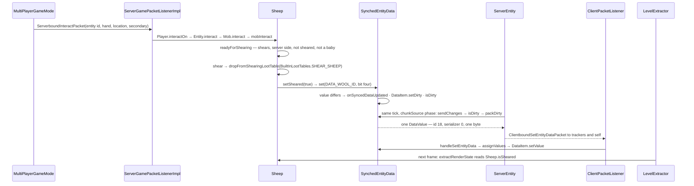

# Synched entity data

> Verified against **Minecraft 26.2** · Part VI · A player shears a sheep: one byte flips on the server, and the wool disappears on every screen in tracking range.

## Responsibility

Every entity carries a small numbered array of values that the server
pushes to every client watching it. That array is `SynchedEntityData`: the
health bar over another player, the sheep's colour, whether someone is
sneaking, on fire, sprinting or gliding, an armour stand's pose, an item
frame's item. It is *one* of five parallel channels the server uses to
describe an entity — the others are attributes, equipment, mob effects and
position/motion — and knowing which channel a fact travels on explains most
of the "why does the client not know that?" questions.

The one sentence a player recognises: *the other player's name tag, their
crouch, the sheep's wool — those are the fields the server chose to send;
the sheep's brain, its path and its loot table are not.*

## The data it owns

- **The container.** `SynchedEntityData` holds a `SyncedDataHolder` (the
  entity — `Entity` is the only implementor), a flat array
  `SynchedEntityData.itemsById` of `SynchedEntityData.DataItem`, and one
  `SynchedEntityData.isDirty` boolean. A `SynchedEntityData.DataItem` is an
  accessor, the current `SynchedEntityData.DataItem.value`, the
  `SynchedEntityData.DataItem.initialValue` it was defined with, and its own
  `SynchedEntityData.DataItem.dirty` flag. Nothing is synchronized and
  nothing is volatile; the array is indexed without a bounds check. Safety
  is single-thread confinement — one container per side.
- **The key.** `EntityDataAccessor` is a record of an int id and an
  `EntityDataSerializer`, and its equality is **on the id alone**. Ids come
  from `SynchedEntityData.defineId`, called in the static initialiser of
  each entity class, which asks `ClassTreeIdRegistry` for the next id after
  the nearest already-registered ancestor
  (`ClassTreeIdRegistry.getLastIdFor`, `ClassTreeIdRegistry.define`,
  `ClassTreeIdRegistry.getCount`). `SynchedEntityData.MAX_ID_VALUE` is 254.
- **The construction.** `SynchedEntityData.Builder` is sized from the
  registry's count for the entity's exact class; the `Entity` constructor
  defines its own eight fields, then calls the abstract
  `Entity.defineSynchedData`, which every subclass overrides and chains up
  through. `SynchedEntityData.Builder.build` refuses a container with any
  unfilled slot, naming the id it is missing — which is why the unchecked
  array index in `SynchedEntityData.get` is safe.
- **The wire value.** `SynchedEntityData.DataValue` is a record of id,
  serializer and value; `SynchedEntityData.DataValue.create` copies through
  `EntityDataSerializer.copy`, and `SynchedEntityData.DataValue.write` puts
  an unsigned byte id, a var-int serializer id and the encoded value.
- **The serializers.** `EntityDataSerializer` is an interface pairing a
  `StreamCodec` — returned by `EntityDataSerializer.codec`, not extended —
  with a `EntityDataSerializer.copy`; `EntityDataSerializer.ForValueType` is the
  immutable case, where copying is identity. `EntityDataSerializers` holds
  43 constants and registers them into a
  `CrudeIncrementalIntIdentityHashBiMap`, so *registration order is the wire
  id*: `EntityDataSerializers.BYTE` 0, `EntityDataSerializers.INT` 1,
  `EntityDataSerializers.LONG` 2, `EntityDataSerializers.FLOAT` 3,
  `EntityDataSerializers.STRING` 4, `EntityDataSerializers.COMPONENT` 5,
  `EntityDataSerializers.OPTIONAL_COMPONENT` 6,
  `EntityDataSerializers.ITEM_STACK` 7, `EntityDataSerializers.BOOLEAN` 8,
  `EntityDataSerializers.ROTATIONS` 9, `EntityDataSerializers.BLOCK_POS` 10,
  `EntityDataSerializers.OPTIONAL_BLOCK_POS` 11,
  `EntityDataSerializers.DIRECTION` 12,
  `EntityDataSerializers.OPTIONAL_LIVING_ENTITY_REFERENCE` 13,
  `EntityDataSerializers.BLOCK_STATE` 14,
  `EntityDataSerializers.OPTIONAL_BLOCK_STATE` 15,
  `EntityDataSerializers.PARTICLE` 16, `EntityDataSerializers.PARTICLES` 17,
  `EntityDataSerializers.VILLAGER_DATA` 18,
  `EntityDataSerializers.OPTIONAL_UNSIGNED_INT` 19,
  `EntityDataSerializers.POSE` 20, then the per-species variant block —
  `EntityDataSerializers.CAT_VARIANT`, `EntityDataSerializers.PIG_VARIANT`,
  `EntityDataSerializers.CHICKEN_VARIANT`,
  `EntityDataSerializers.WOLF_SOUND_VARIANT` and the rest of the
  `*_SOUND_VARIANT` family, which is a 26.2 addition — through
  `EntityDataSerializers.ZOMBIE_NAUTILUS_VARIANT` at 32, and then
  `EntityDataSerializers.OPTIONAL_GLOBAL_POS` 33,
  `EntityDataSerializers.PAINTING_VARIANT` 34,
  `EntityDataSerializers.SNIFFER_STATE` 35,
  `EntityDataSerializers.ARMADILLO_STATE` 36,
  `EntityDataSerializers.COPPER_GOLEM_STATE` 37,
  `EntityDataSerializers.WEATHERING_COPPER_STATE` 38,
  `EntityDataSerializers.VECTOR3` 39,
  `EntityDataSerializers.QUATERNION` 40,
  `EntityDataSerializers.RESOLVABLE_PROFILE` 41 and
  `EntityDataSerializers.HUMANOID_ARM` 42, the last one registered. Several
  carry `Holder`s of data-pack registries, which is why the buffer type is
  `RegistryFriendlyByteBuf` ([codecs](../foundations/codecs-nbt-json.md)).
  `EntityDataSerializers.registerSerializer` is public, and it is the *only*
  thing that fills the bimap — vanilla calls it 43 times from one static
  block and nothing outside that file ever calls it again. It is the mod
  extension point, shipped with no external caller.

### The catalogue on a sheep

Ids are ordinals down the class chain, so the whole hierarchy shares one
numbering. A `Sheep` has exactly nineteen slots:

| id | field | serializer | default |
|---:|---|---|---|
| 0 | `Entity.DATA_SHARED_FLAGS_ID` | `EntityDataSerializers.BYTE` | 0 |
| 1 | `Entity.DATA_AIR_SUPPLY_ID` | `EntityDataSerializers.INT` | `Entity.getMaxAirSupply` |
| 2 | `Entity.DATA_CUSTOM_NAME` | `EntityDataSerializers.OPTIONAL_COMPONENT` | empty |
| 3 | `Entity.DATA_CUSTOM_NAME_VISIBLE` | `EntityDataSerializers.BOOLEAN` | false |
| 4 | `Entity.DATA_SILENT` | `EntityDataSerializers.BOOLEAN` | false |
| 5 | `Entity.DATA_NO_GRAVITY` | `EntityDataSerializers.BOOLEAN` | false |
| 6 | `Entity.DATA_POSE` | `EntityDataSerializers.POSE` | `Pose.STANDING` |
| 7 | `Entity.DATA_TICKS_FROZEN` | `EntityDataSerializers.INT` | 0 |
| 8 | `LivingEntity.DATA_LIVING_ENTITY_FLAGS` | `EntityDataSerializers.BYTE` | 0 |
| 9 | `LivingEntity.DATA_HEALTH_ID` | `EntityDataSerializers.FLOAT` | 1.0 |
| 10 | `LivingEntity.DATA_EFFECT_PARTICLES` | `EntityDataSerializers.PARTICLES` | empty |
| 11 | `LivingEntity.DATA_EFFECT_AMBIENCE_ID` | `EntityDataSerializers.BOOLEAN` | false |
| 12 | `LivingEntity.DATA_ARROW_COUNT_ID` | `EntityDataSerializers.INT` | 0 |
| 13 | `LivingEntity.DATA_STINGER_COUNT_ID` | `EntityDataSerializers.INT` | 0 |
| 14 | `LivingEntity.SLEEPING_POS_ID` | `EntityDataSerializers.OPTIONAL_BLOCK_POS` | empty |
| 15 | `Mob.DATA_MOB_FLAGS_ID` | `EntityDataSerializers.BYTE` | 0 |
| 16 | `AgeableMob.DATA_BABY_ID` | `EntityDataSerializers.BOOLEAN` | false |
| 17 | `AgeableMob.AGE_LOCKED` | `EntityDataSerializers.BOOLEAN` | false |
| 18 | `Sheep.DATA_WOOL_ID` | `EntityDataSerializers.BYTE` | 0 |

The flag bytes are the densest part of the channel. Slot 0's bit indices are
`Entity.FLAG_ONFIRE` 0, `Entity.FLAG_SHIFT_KEY_DOWN` 1,
`Entity.FLAG_SPRINTING` 3, `Entity.FLAG_SWIMMING` 4,
`Entity.FLAG_INVISIBLE` 5, `Entity.FLAG_GLOWING` 6 and
`Entity.FLAG_FALL_FLYING` 7 — bit 2 is unnamed and unused — read and written
through `Entity.getSharedFlag` and `Entity.setSharedFlag`. Slot 8 carries
*using an item*, *off hand* and *spin attack* as masks
(`LivingEntity.LIVING_ENTITY_FLAG_IS_USING`,
`LivingEntity.LIVING_ENTITY_FLAG_OFF_HAND`,
`LivingEntity.LIVING_ENTITY_FLAG_SPIN_ATTACK`). Slot 15 carries no-AI,
left-handed and aggressive as unnamed masks behind `Mob.setNoAi`,
`Mob.setLeftHanded` and `Mob.setAggressive`. Slot 18 packs a `DyeColor` id
into the low nibble and *sheared* into bit four: `Sheep.getColor`,
`Sheep.setColor`, `Sheep.isSheared`, `Sheep.setSheared` — and the same
storage is read out as `DataComponents.SHEEP_COLOR` by `Sheep.get`, and
written back into by `Sheep.applyImplicitComponent`.

Two player-shaped notes. `Avatar` — the class 26.2 inserts between
`LivingEntity` and `Player` — declares `Avatar.DATA_PLAYER_MAIN_HAND` and
`Avatar.DATA_PLAYER_MODE_CUSTOMISATION` (the skin-part toggles), so they
belong to every avatar, not only to players. `Player` itself adds
`Player.DATA_PLAYER_ABSORPTION_ID`, `Player.DATA_SCORE_ID` and the two
shoulder parrots, `Player.DATA_SHOULDER_PARROT_LEFT` and
`Player.DATA_SHOULDER_PARROT_RIGHT` — optional ints now, not NBT.

## When it runs

**Server main thread** for every *authoritative* write:
`SynchedEntityData.set` is called from entity ticking and from interaction
handling, both on the game thread (`ServerGamePacketListenerImpl` bounces
off-thread packets through `PacketUtils.ensureRunningOnSameThread`). The
client writes to its own container too, on its own main thread; those writes
just go nowhere. **Server main thread** for the send: the entity-tracking
loop in `ChunkMap` calls `ServerEntity.sendChanges` per tracked entity — but
only for an entity that changed section, has `Entity.needsSync` set, or is
in entity-ticking range. A tracked entity outside that range keeps its dirty
data until one of the three becomes true. **Client main thread** for the apply:
`ClientPacketListener.handleSetEntityData` runs on the game thread and calls
`SynchedEntityData.assignValues`. **Client main thread, extract phase** for
the read: `LevelExtractor` and `EntityRenderDispatcher.extractEntity` copy
the values a renderer needs into an `EntityRenderState` once per frame, so
the render thread never touches the container (Part XI owns the extract/render
split).

`ServerEntity.sendChanges` opens with `Entity.updateDataBeforeSync` — the
hook `LivingEntity` overrides to recompute its effect-particle list, and
which `ServerEntity.sendPairingData` runs too — and then gates its whole
position-and-rotation block on *interval elapsed, or `Entity.needsSync`, or
the data is dirty*. `ServerEntity.sendDirtyEntityData` normally runs inside
that block, and it runs `SynchedEntityData.packDirty`, which returns the
changed items and clears every flag it touched, or null if nothing changed.
There are two other call sites, though: an `ItemFrame` gets one every ten
ticks *before* the gate, and `ServerEntity.handleMinecartPosRot` has its
own — so the gate is the usual path, not the only one.

The interval itself is not the tracker's invention: `ServerEntity` takes it
from `EntityType.updateInterval` when `ChunkMap.TrackedEntity` builds it,
which is why an item frame updates slower than a player. `Entity.syncPosition`
forces the next tick into the gate by realigning the tracker's own counter.

## The trace: a sheep is sheared

1. **The click.** `MultiPlayerGameMode.interact` sends
   `ServerboundInteractPacket` — in 26.2 a flat record of entity id, hand,
   an *entity-relative* hit location and the secondary-action flag; attacks
   have left it for `ServerboundAttackPacket` — and *also* runs the
   interaction locally as a prediction, unless the player is a spectator.
2. **The server checks the geometry, not the outcome.**
   `ServerGamePacketListenerImpl.handleInteract` confirms the thread and
   that the client has loaded, resolves the entity with
   `ServerLevel.getEntityOrPart`, checks the world border,
   `Player.isWithinEntityInteractionRange` and that the held item is enabled
   by the level's feature flags, and hands off to `Player.interactOn` — but
   first it writes the packet's secondary-action flag straight into
   `Entity.setShiftKeyDown`, which is itself a synched-data write on the
   receiving side of every interaction. If the entity hook passes,
   `Player.interactOn` falls through to `ItemStack.interactLivingEntity`.
3. **Dispatch down the hierarchy.** `Player.interactOn` calls
   `Entity.interact`, which dispatches virtually to the most derived
   override — `Mob.interact`. That method runs three things in order:
   `Mob.checkAndHandleImportantInteractions` (name tags, spawn eggs), then
   the superclass hook, `Entity.interact` and its leashing branch, and only if
   *that* passes, `Sheep.mobInteract`. The base hook runs *between* the two
   mob hooks, not before them. The shears test is item identity against
   `Items.SHEARS` — not a tag, not a component — plus
   `Sheep.readyForShearing` from the shared `Shearable` interface
   (`MushroomCow`, `SnowGolem` and `Bogged` are the siblings). A sheep that
   is *not* ready still consumes the click rather than falling through,
   which is why shears on an already-sheared sheep do nothing visible at
   all.
4. **The effect.** `Sheep.shear` plays `SoundEvents.SHEEP_SHEAR`, drops wool
   through `LivingEntity.dropFromShearingLootTable` with
   `BuiltInLootTables.SHEAR_SHEEP` — the tool is passed in, so the loot table
   can see it — and calls `Sheep.setSheared`.
5. **One byte moves.** `SynchedEntityData.set` compares the new value with
   the old, stores it, calls `Entity.onSyncedDataUpdated` for the accessor —
   `Sheep` does not override it, and the base implementation reacts only to
   `Entity.DATA_POSE`, by calling `Entity.refreshDimensions` — and *then*
   marks the item and the container dirty. Back in `Sheep.mobInteract`:
   `Entity.gameEvent` with `GameEvent.SHEAR` for the sculk listeners
   ([game events](../world/game-events-and-vibrations.md)), `ItemStack.hurtAndBreak`
   on the shears, and an `InteractionResult.SUCCESS_SERVER`.
6. **The send.** Still the same tick — because packets are processed
   *before* the level ticks, and the tracking loop runs in the level tick's
   chunkSource phase, which is near its start. The loop in `ChunkMap` reaches
   this sheep and calls `ServerEntity.sendChanges`; the dirty flag opens the
   gate; `ServerEntity.sendDirtyEntityData` packs the single changed item and
   sends one `ClientboundSetEntityDataPacket` to every tracking player. The
   wire is: entity id, then *byte 18, var-int 0 for
   `EntityDataSerializers.BYTE`, one payload byte*, then the terminator 255.
   That terminator is the reason ids stop at 254. (There *is* a
   `ClientboundSetEntityDataPacket.EOF_MARKER` constant, but both the pack
   and unpack sides write and test the literal; nothing references it.)
7. **The apply.** `ClientPacketListener.handleSetEntityData` looks the entity
   up in `ClientLevel` — and silently drops the whole packet if the id is
   unknown — then calls `SynchedEntityData.assignValues`, which
   checks that the incoming serializer is the one the accessor was defined
   with — a mismatch throws, loudly, on the client — stores each value, fires
   `Entity.onSyncedDataUpdated` per item and then the batch overload once.
8. **The frame.** Nothing tells the renderer. Next frame, `LevelExtractor`
   walks the visible entities, `EntityRenderDispatcher.extractEntity` builds a
   `SheepRenderState`, and `SheepRenderer.extractRenderState` reads
   `Sheep.isSheared` and `Sheep.getColor` into it. `SheepWoolLayer` then draws
   nothing. The wool vanishing is a *layer skipped*, not a model swap — and
   only one layer: `SheepWoolUndercoatLayer` does not test the sheared flag,
   so a sheared coloured sheep still draws its undercoat.

A pairing is the same machinery run once: `ServerEntity.addPairing` →
`ServerEntity.sendPairingData` bundles `ClientboundAddEntityPacket` with a
`ClientboundSetEntityDataPacket`, plus attributes, equipment and passengers,
all inside one `ClientboundBundlePacket`. The data packet is built not from
a fresh call but from `ServerEntity.trackedDataValues`, a snapshot taken in
the constructor from `SynchedEntityData.getNonDefaultValues` and refreshed
only when `SynchedEntityData.packDirty` later returns something. Two
consequences: an entity still entirely at its defaults sends **no** data
packet on pairing at all, and any change made while the tracker was outside
its send gate is already folded into that cache.

## Interfaces

- **Called by:** every entity's static initialiser
  (`SynchedEntityData.defineId`), every entity constructor
  (`Entity.defineSynchedData`), every gameplay setter with a visible
  consequence (`Entity.setPose`, `Entity.setSharedFlag`,
  `LivingEntity.setHealth`, `Sheep.setSheared` …), `ServerEntity.sendChanges`
  on the send side, `ClientPacketListener.handleSetEntityData` on the receive
  side.
- **Calls into:** `SyncedDataHolder.onSyncedDataUpdated` — the only
  notification the client gets. Thirty-five classes override the
  single-accessor form: `Entity` refreshes dimensions on a pose change, `LivingEntity` starts
  and stops item use from its flag byte and snaps to a bed from
  `LivingEntity.SLEEPING_POS_ID`, `Display` recomputes culling,
  `AbstractArrow` starts its shake, `LocalPlayer` reconciles its own predicted
  item use.
- **Crosses the network as:** `ClientboundSetEntityDataPacket` only, server →
  every tracking player (and the entity itself, if it is a player). The
  distinction is `ServerEntity.Synchronizer`, the small interface
  `ChunkMap.TrackedEntity` implements: data uses its
  *and-self* form, equipment updates use the plain one. There is
  **no serverbound entity-data packet**; the client cannot write to this
  channel.
- **The other four channels**, all keyed by the same entity id, all
  clientbound: `ClientboundUpdateAttributesPacket` for
  [attributes](attributes.md), whose dirty set is flushed by the same
  `ServerEntity.sendDirtyEntityData`; `ClientboundSetEquipmentPacket` for worn
  and held items, whose *incremental* updates bypass `ServerEntity` —
  `LivingEntity.handleEquipmentChanges` sends them itself, and to tracking
  players only, not to the wearer, while the pairing bundle still carries an
  equipment packet from `ServerEntity`;
  `ClientboundUpdateMobEffectPacket` and `ClientboundRemoveMobEffectPacket`
  for the authoritative effect list (the synched
  `LivingEntity.DATA_EFFECT_PARTICLES` is only the swirl other players see);
  and `ClientboundMoveEntityPacket`, `ClientboundEntityPositionSyncPacket`,
  `ClientboundTeleportEntityPacket`, `ClientboundRotateHeadPacket` and
  `ClientboundSetEntityMotionPacket` for where it is and where it is going. A
  sixth channel carries one-shot events with no state:
  `ClientboundEntityEventPacket`, a single byte from
  `ServerLevel.broadcastEntityEvent` dispatched by `Entity.handleEntityEvent` —
  `EntityEvent.DEATH`, `EntityEvent.LOVE_HEARTS`, `EntityEvent.EAT_GRASS`,
  `EntityEvent.TAMING_SUCCEEDED` and about sixty more.
- **Data-driven by:** nothing. Ids come from static-initialiser order and
  serializers from a hand-written list. Only the *values* touch data — holders
  of `WolfVariant`, `PaintingVariant`, `CatVariant` and the rest, which is why
  the buffer carries the registry access.

## Invariants and surprises

- **Ids are ordinals down the class tree, not names.** Insert, remove or
  reorder a `SynchedEntityData.defineId` on a base class and every id below it
  in every subclass shifts. Java's rule that a superclass's static initialiser
  runs first is the entire ordering guarantee. Two mods adding fields to
  `LivingEntity` collide here: either `SynchedEntityData.Builder.define`
  rejects the duplicate id — `SynchedEntityData.Builder.build` complains
  about the opposite problem, an *unfilled* slot — or a value arrives at the
  wrong slot and the serializer check throws on the client.
  `SynchedEntityData.Builder.define` has a third precondition too, that the serializer is registered, and an
  off-by-one in its bounds test: an id exactly equal to the array length
  slips past the check and dies on the array write instead.
- **Defaults never travel.** `SynchedEntityData.getNonDefaultValues` skips
  anything still equal to its `SynchedEntityData.DataItem.initialValue`, so a
  freshly tracked entity is described only by what has changed. Both sides
  construct their own defaults; if they disagreed, no packet would ever
  correct it.
- **Only dirty items travel, and only once.** `SynchedEntityData.packDirty`
  clears the flags as it packs, so a value set twice in a tick sends once.
  But the comparison in `SynchedEntityData.set` is against the *current*
  value, not the last-sent one: setting A→B→A dirties twice and sends A. The
  thing that never marks dirty is setting a value to what it already holds.
- **There is a force-dirty overload, and vanilla uses it.**
  `SynchedEntityData.set` has a three-argument form that skips the
  comparison entirely — how `CopperGolem` re-triggers a weathering animation
  and `Display` restarts an interpolation by "setting" a value that has not
  changed. Re-sending an unchanged value is a supported move, not an
  impossible one.
- **The client writes to its own copy, and the write goes nowhere.** Nothing
  stops `SynchedEntityData.set` on the client — `LocalPlayer` prediction does
  it constantly — but the only caller of `SynchedEntityData.packDirty` in the
  whole tree is `ServerEntity.sendDirtyEntityData`. The client's dirty flag is
  read by no one, and the next server value overwrites it. The container
  itself is not useless to the client, though: on a respawn
  `ClientPacketListener.handleRespawn` copies the old player's non-default
  values straight into the new one, the single client-to-client use of the
  channel.
- **A dirty byte drags the movement packets with it.** The gate in
  `ServerEntity.sendChanges` is *interval, or needs-sync, or data dirty*, so
  shearing a sheep also sends that sheep's position and rotation delta this
  tick. Synched data is, incidentally, a latency channel for movement.
- **The batch hook is dead code.** `SyncedDataHolder.onSyncedDataUpdated` has
  a list overload, fired by `SynchedEntityData.assignValues` after every
  packet, and nothing in the 7,055-class tree overrides it. It is the only
  place a client could see a whole update atomically.
- **Pose is the exception that changes physics.** It travels on this channel
  (on its own `EntityDataSerializers.POSE`, not as a byte), and
  `Entity.onSyncedDataUpdated` turns it into `Entity.refreshDimensions` — one
  synched value resizing a hitbox on both sides. Almost every other field is
  cosmetic to the client.
- **Accessor ids are treated as a set in exactly one place.** `Display`
  keeps an int set of the accessor ids that force a render-state rebuild and
  tests incoming updates against it. It is the only code in the tree that
  uses an id as a value rather than as an identity, and the sharpest
  demonstration that these numbers really are ordinals.
- **`Entity` declares its own flag constants and then ignores them:** the call
  sites inside `Entity` pass bare integers to `Entity.setSharedFlag`, even
  though the parameter carries a purpose-built type-use annotation.

## Where to look

`SynchedEntityData` · `SynchedEntityData.Builder` ·
`SynchedEntityData.DataItem` · `SynchedEntityData.DataValue` ·
`EntityDataAccessor` · `EntityDataSerializer` · `EntityDataSerializers` ·
`ClassTreeIdRegistry` · `Entity.defineSynchedData` ·
`Entity.onSyncedDataUpdated` · `LivingEntity.updateDataBeforeSync` ·
`ServerEntity.sendChanges` · `ServerEntity.sendPairingData` ·
`ClientboundSetEntityDataPacket` · `ClientPacketListener.handleSetEntityData` ·
`ServerEntity.Synchronizer` · `ChunkMap.TrackedEntity` ·
`Sheep.mobInteract` · `Shearable`

---

*Rules: names, never code · how the system works, not how the code reads ·
newest version only · every backticked name passes `tools/verify_names.py`.*
