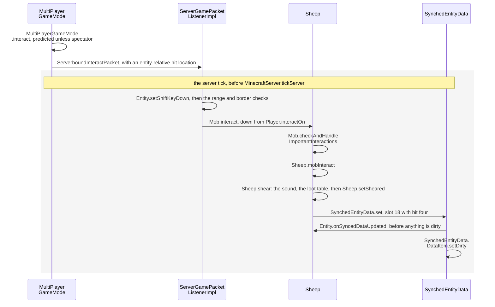
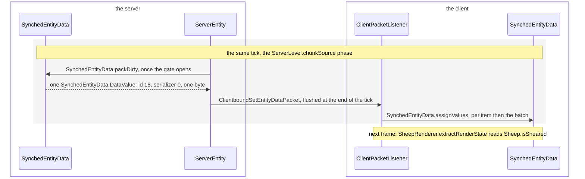
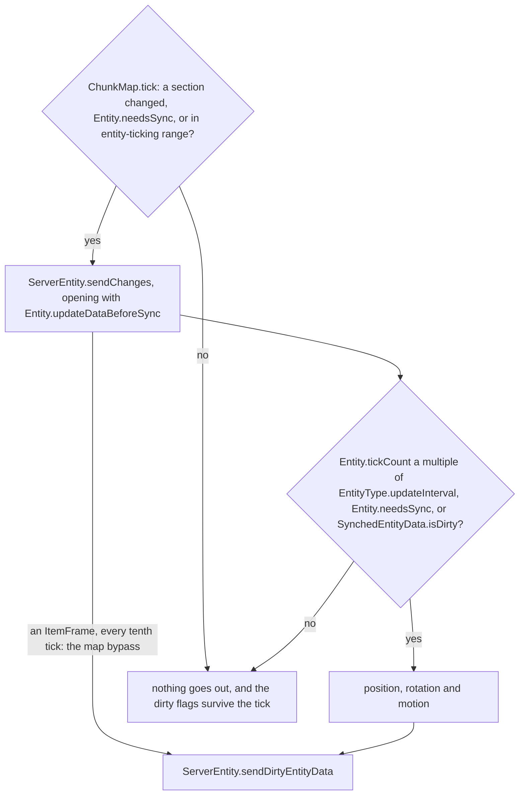

# Synched entity data

> Verified against **Minecraft 26.2** · Part VI · A player shears a sheep: one byte flips on the server, and the wool disappears on every screen in tracking range.

You right-click a sheep with shears. Somewhere on the server a single byte
changes — bit four of one entry in a nineteen-slot array the sheep carries —
and before that tick ends, every player watching has been told, by a packet
that spends four bytes after the entity id. That array is `SynchedEntityData`,
the channel the server uses to describe an entity to the clients that see it: the
health bar over another player, a sneaking crouch, an armour stand's pose,
an item frame's item, this sheep's wool. It is a numbered array, and the
numbers are the surprising part. **The slot the wool lives in is not written
anywhere in `Sheep`: it is 18 because eighteen slots were handed out above
`Sheep` in its superclass chain, and one new field on `Entity` would renumber
every entity in the game.** Ids are ordinals handed out down the class tree
by a single shared `ClassTreeIdRegistry`, which walks only the *superclass*
chain: `Entity` takes 0 to 7, `LivingEntity` 8 to 14, `Mob` 15, `AgeableMob`
16 and 17, and `Sheep`, last in the chain, gets 18.
Nothing names these numbers, nothing writes them down, and they stop at 254
— because on the wire, 255 means *end of packet*.

## The cast

| class | what it decides | thread |
|---|---|---|
| `SynchedEntityData` | one entity's numbered array, and whether anything in it has changed since the last flush | one container per side, confined to that side's main thread |
| `SynchedEntityData.DataItem` | one slot: its value, the default it was built with, and its own dirty flag | with its container |
| `EntityDataAccessor` | the key — an int id and a serializer, equal to another accessor **on the id alone** | immutable, shared by every instance of the class |
| `ClassTreeIdRegistry` | which id a `SynchedEntityData.defineId` call gets, from the last id already taken by an ancestor class | whichever thread first loads the class |
| `EntityDataSerializers` | the 43 registered serializers and the wire id of each, in registration order | a static block, once |
| `ServerEntity` | whether this entity sends anything this tick, and what | the server main thread |
| `ClientboundSetEntityDataPacket` | the wire form: an entity id, then id/serializer/value triples, then 255 | encoded on the Netty pipeline, built on the server thread |
| `ClientPacketListener` | applying an incoming batch to the client's own container | the client main thread |

## Nineteen slots, and where the numbers come from

`SynchedEntityData.defineId` is called from the static initialiser of an
entity class and asks `ClassTreeIdRegistry.define` for a number.
`ClassTreeIdRegistry` keeps one map from class to *last id issued*, and
`ClassTreeIdRegistry.getLastIdFor` walks up the superclass chain until it
finds an entry — so a subclass continues its parent's numbering rather than
starting over. Java's guarantee that a superclass initialises before its
subclass is the entire ordering mechanism. `ClassTreeIdRegistry.getCount` is
the same walk plus one, and it is what sizes the array.

A `Sheep` — `Entity` → `LivingEntity` → `Mob` → `PathfinderMob` →
`AgeableMob` → `Animal` → `Sheep`, of which `PathfinderMob` and `Animal`
define nothing — therefore has exactly nineteen slots:

| id | field | serializer | default |
|---:|---|---|---|
| 0 | `Entity.DATA_SHARED_FLAGS_ID` | `EntityDataSerializers.BYTE` | 0 |
| 1 | `Entity.DATA_AIR_SUPPLY_ID` | `EntityDataSerializers.INT` | `Entity.getMaxAirSupply` |
| 2 | `Entity.DATA_CUSTOM_NAME` | `EntityDataSerializers.OPTIONAL_COMPONENT` | empty |
| 3 | `Entity.DATA_CUSTOM_NAME_VISIBLE` | `EntityDataSerializers.BOOLEAN` | false |
| 4 | `Entity.DATA_SILENT` | `EntityDataSerializers.BOOLEAN` | false |
| 5 | `Entity.DATA_NO_GRAVITY` | `EntityDataSerializers.BOOLEAN` | false |
| 6 | `Entity.DATA_POSE` | `EntityDataSerializers.POSE` | `Pose.STANDING` |
| 7 | `Entity.DATA_TICKS_FROZEN` | `EntityDataSerializers.INT` | 0 |
| 8 | `LivingEntity.DATA_LIVING_ENTITY_FLAGS` | `EntityDataSerializers.BYTE` | 0 |
| 9 | `LivingEntity.DATA_HEALTH_ID` | `EntityDataSerializers.FLOAT` | 1.0 |
| 10 | `LivingEntity.DATA_EFFECT_PARTICLES` | `EntityDataSerializers.PARTICLES` | empty |
| 11 | `LivingEntity.DATA_EFFECT_AMBIENCE_ID` | `EntityDataSerializers.BOOLEAN` | false |
| 12 | `LivingEntity.DATA_ARROW_COUNT_ID` | `EntityDataSerializers.INT` | 0 |
| 13 | `LivingEntity.DATA_STINGER_COUNT_ID` | `EntityDataSerializers.INT` | 0 |
| 14 | `LivingEntity.SLEEPING_POS_ID` | `EntityDataSerializers.OPTIONAL_BLOCK_POS` | empty |
| 15 | `Mob.DATA_MOB_FLAGS_ID` | `EntityDataSerializers.BYTE` | 0 |
| 16 | `AgeableMob.DATA_BABY_ID` | `EntityDataSerializers.BOOLEAN` | false |
| 17 | `AgeableMob.AGE_LOCKED` | `EntityDataSerializers.BOOLEAN` | false |
| 18 | `Sheep.DATA_WOOL_ID` | `EntityDataSerializers.BYTE` | 0 |

There is one of those arrays **per side**, not one per entity: the server's
`Sheep` has its own container and your client's `Sheep` has another, built
independently from the same class chain, and the packet below is the only thing
that ever reconciles them.

### Declaration order is not definition order

The declaration order and the *definition* order are two different lists.
Ids come from where `SynchedEntityData.defineId` sits in the class body; the
values come from the `Entity` constructor, which defines its own eight and
then calls the abstract `Entity.defineSynchedData` that every subclass
overrides and chains up through. `LivingEntity` defines its seven in a
different order from the one that numbered them, and it does not matter,
because `SynchedEntityData.Builder.define` writes each item at
`EntityDataAccessor.id`. `SynchedEntityData.Builder.build` then refuses to
hand over a container with any slot still null, naming the id it is missing —
which is why `SynchedEntityData.get` can index the array with no bounds check
at all.

### Four slots that are bitfields

Four of the nineteen are bitfields, and they are the dense part of the
channel. Slot 0 is `Entity.FLAG_ONFIRE` 0, `Entity.FLAG_SHIFT_KEY_DOWN` 1,
`Entity.FLAG_SPRINTING` 3, `Entity.FLAG_SWIMMING` 4,
`Entity.FLAG_INVISIBLE` 5, `Entity.FLAG_GLOWING` 6 and
`Entity.FLAG_FALL_FLYING` 7 — bit 2 is unnamed and unused — behind
`Entity.getSharedFlag` and `Entity.setSharedFlag`, whose parameter carries a
purpose-built `Entity.Flags` type-use annotation that every call site inside
`Entity` ignores in favour of a bare integer. Slot 8 carries *using an item*,
*off hand* and *spin attack* (`LivingEntity.LIVING_ENTITY_FLAG_IS_USING`,
`LivingEntity.LIVING_ENTITY_FLAG_OFF_HAND`,
`LivingEntity.LIVING_ENTITY_FLAG_SPIN_ATTACK`), slot 15 no-AI, left-handed
and aggressive behind `Mob.setNoAi`, `Mob.setLeftHanded` and
`Mob.setAggressive`, and slot 18 packs a `DyeColor` id into the low nibble
and *sheared* into bit four — `Sheep.getColor`, `Sheep.setColor`,
`Sheep.isSheared`, `Sheep.setSheared`, and the same storage read out as
`DataComponents.SHEEP_COLOR` by `Sheep.get` and written back through
`Sheep.applyImplicitComponent`.

### Nothing may be inserted above you

The numbering belongs to the class, not to the concept. `Avatar` — the class 26.2 inserts between `LivingEntity` and `Player`
([entity anatomy](entity-anatomy.md#the-tree-and-the-class-that-was-inserted-into-it)) — owns
`Avatar.DATA_PLAYER_MAIN_HAND` and `Avatar.DATA_PLAYER_MODE_CUSTOMISATION`,
so the skin-part toggles belong to every avatar, while
`Player.DATA_PLAYER_ABSORPTION_ID`, `Player.DATA_SCORE_ID` and the two
shoulder parrots (`Player.DATA_SHOULDER_PARROT_LEFT`,
`Player.DATA_SHOULDER_PARROT_RIGHT`, optional ints rather than NBT) sit one
level further down.

That is the whole answer to *can two mods both add a field to `LivingEntity`*:
only by accident. Inserting, removing or reordering a
`SynchedEntityData.defineId` on a base class shifts every id below it in every
subclass, so two mods claiming the same number either collide in
`SynchedEntityData.Builder.define`, which rejects a duplicate, or land a value
in the wrong slot and throw the serializer check on the client.
(`SynchedEntityData.Builder.define` also has an off-by-one in its bounds test —
an id exactly equal to the array length slips past and dies on the array write
instead.) And one class treats these numbers as what they are:
`Display.RENDER_STATE_IDS` is an int set of the eight accessor **ids** that
force a render-state rebuild, tested against each incoming accessor, with
`Display.TextDisplay` keeping a second set of its own. Nothing in the codebase
demonstrates more plainly that a slot number is an ordinal and not a name.

## The serializer is the other half of the key

An `EntityDataAccessor` is an id *and* an `EntityDataSerializer`, and the
serializer is what turns the value into bytes. The interface is deliberately
thin: a `StreamCodec` returned by `EntityDataSerializer.codec` — returned,
not extended — paired with an `EntityDataSerializer.copy` that defends the
container against a caller mutating a value it already handed over.
`EntityDataSerializer.ForValueType` is the immutable case, where copying is
identity, and `EntityDataSerializer.forValueType` builds one from a codec
alone.

`EntityDataSerializers` registers 43 of them into a
`CrudeIncrementalIntIdentityHashBiMap`, from a single static block, so
**registration order is the wire id** — `EntityDataSerializers.BYTE` is 0,
`EntityDataSerializers.POSE` is 20, `EntityDataSerializers.HUMANOID_ARM` is
42 and last. Several of them carry `Holder`s of data-pack registries — the
per-species variants, painting variants, resolvable profiles — which is why
the buffer on both sides is a `RegistryFriendlyByteBuf` rather than a plain
one ([codecs](../foundations/codecs-nbt-json.md)). The full list with wire
ids and value types is [the serializer table](../../reference/entity-data-serializers.md).
`EntityDataSerializers.registerSerializer` is public and is the only thing
that fills the bimap: vanilla calls it 43 times from that one block, and
nothing else in the tree ever calls it again. It is a mod extension point
shipped with no caller outside its own file.

## Shears to wool gone, inside one tick

*The server's container, and the one moment worth slowing down for: the
callback to `Sheep` runs first and the item is marked dirty after it, not the
other way round. The whole band is one tick, and it is over before
`MinecraftServer.tickServer` has begun.*

Later in that same tick the container is drained, and what the client builds
from it is a **second** container — one per side, not one per entity:

*Two containers, one per machine, and the packet is the only thing that ever
reconciles them. Everything to the left of the boundary happened in the band
above; everything to the right of it is a copy that has never seen a `Sheep`
of its own until now.*

**The click.** `MultiPlayerGameMode.interact` sends a
`ServerboundInteractPacket` — a flat record of entity id, hand, an
*entity-relative* hit location and the secondary-action flag, attacks having
left for `ServerboundAttackPacket` — and *then*, on the next line, runs the
interaction locally as a prediction, unless the local game mode is spectator.
The packet goes first.

**The server checks the geometry, not the outcome.**
`ServerGamePacketListenerImpl.handleInteract` confirms the thread with
`PacketUtils.ensureRunningOnSameThread` and that the client has loaded,
resolves the entity with `ServerLevel.getEntityOrPart`, tests the world
border and `Player.isWithinEntityInteractionRange`, and checks the held item
against the level's feature flags. Before any of the geometry, though, it
writes the packet's secondary-action flag straight into
`Entity.setShiftKeyDown` — which is itself a synched-data write on the
*player*, so every interaction packet is also a potential update on slot 0.

**Dispatch down the hierarchy.** `Player.interactOn` calls `Entity.interact`,
which dispatches virtually to the most derived override, `Mob.interact`.
That runs three things in a fixed order: `Mob.checkAndHandleImportantInteractions`
(name tags, spawn eggs), then the superclass hook `Entity.interact` with its
leashing branch, and only if that passes, `Sheep.mobInteract` — the base
hook runs *between* the two mob hooks, not before them. The shears test is
item identity against `Items.SHEARS`, not a tag and not a component, plus
`Sheep.readyForShearing` from the shared `Shearable` interface, whose other
implementors are `MushroomCow`, `SnowGolem`, `Bogged`, `CopperGolem` and
`SulfurCube`. A sheep that is *not* ready returns `InteractionResult.CONSUME`
rather than falling through, which is why shears on an already-sheared sheep
do nothing visible at all.

**The effect, and one byte.** `Sheep.shear` plays `SoundEvents.SHEEP_SHEAR`,
drops wool through `LivingEntity.dropFromShearingLootTable` with
`BuiltInLootTables.SHEAR_SHEEP` — the tool is passed in, so the loot table
can see it — and calls `Sheep.setSheared`, which ors bit four into slot 18.
`SynchedEntityData.set` compares the new value against the current one,
stores it, calls `Entity.onSyncedDataUpdated` for that accessor, and *then*
marks the item and the container dirty. `Sheep` does not override the hook,
and the base implementation reacts to exactly one accessor, `Entity.DATA_POSE`,
by calling `Entity.refreshDimensions` — which is also the answer to whether any
of this channel touches the physics the client simulates. Exactly one value
does. `Entity.DATA_POSE` travels on its own `EntityDataSerializers.POSE`, and
the hook resizes the hitbox on whichever side just received it ([entity
anatomy](entity-anatomy.md#dimensions-attachments-and-pose) has what the resize
costs). Everything else on the channel is cosmetic to the client, or read back
by gameplay code that already knew. Back in `Sheep.mobInteract`:
`Entity.gameEvent` with `GameEvent.SHEAR` for the sculk listeners
([game events](../world/game-events-and-vibrations.md#a-game-event-is-one-number)),
`ItemStack.hurtAndBreak` on the shears, and `InteractionResult.SUCCESS_SERVER`.

**The send, in the same tick.** `MinecraftServer.processPacketsAndTick`
drains the queue with `PacketProcessor.processQueuedPackets` and only then
calls `MinecraftServer.tickServer`, so the shear happened before the tick
proper began. `ServerLevel.tick` reaches its *chunkSource* phase after
block and fluid ticks and before block events and entity ticking, and that
phase runs `ChunkMap.tick`, whose loop over `ChunkMap.TrackedEntity` is the
only caller of `ServerEntity.sendChanges` in the tree. The dirty flag opens
the gate, `ServerEntity.sendDirtyEntityData` calls `SynchedEntityData.packDirty`,
and one `ClientboundSetEntityDataPacket` goes to every tracking player and
to the entity itself. After the entity id, the wire carries an unsigned byte
18, a var-int 0 for `EntityDataSerializers.BYTE`, one payload byte and then
the terminator 255 — and that terminator is the whole reason ids stop at
254. Both the pack and the unpack side write and test the literal,
incidentally, so the public `ClientboundSetEntityDataPacket.EOF_MARKER` is
referenced by nothing, exactly like the private
`SynchedEntityData.MAX_ID_VALUE` beside it.

The packet is not on the wire yet. `MinecraftServer.tickChildren` calls
`ServerCommonPacketListenerImpl.suspendFlushing` on every player before it
ticks any level and `ServerCommonPacketListenerImpl.resumeFlushing` at the
end of the tick, so a whole tick's packets leave together.

**The apply, and the frame.** `ClientPacketListener.handleSetEntityData`
looks the entity up in `ClientLevel` and silently drops the entire packet if
the id is unknown, then calls `SynchedEntityData.assignValues`, which checks
that the incoming serializer is the one the accessor was defined with — a
mismatch throws, loudly, on the client — stores each value, fires
`Entity.onSyncedDataUpdated` per item and then the batch overload once. That
batch overload, `SyncedDataHolder.onSyncedDataUpdated`, is the only place a
client could see a whole update atomically, and nothing in the 7,055 classes
overrides it: it is dead.
Nothing tells the renderer. It finds out next frame, by [reading the sheep
again from
scratch](../rendering/entity-rendering.md#extract-the-live-entity-becomes-a-snapshot):
`SheepRenderer.extractRenderState` copies `Sheep.isSheared` and
`Sheep.getColor` into a fresh `SheepRenderState`, after which `SheepWoolLayer`
draws nothing. The
wool vanishing is a *layer skipped*, not a model swap — and only one layer,
because `SheepWoolUndercoatLayer` tests colour, baby and invisibility but
never the sheared flag, so a sheared coloured sheep still draws its undercoat.

## The gate that holds a packet back

Two tests stand between a dirty byte and the wire, and only one of them is
this page's:

*Two tests, and the one thing that gets past the second without answering it.
Both diamonds fail into the same box, which is the shape of the whole
mechanism: nothing is lost when a gate closes, only held.*

The first is not this
page's: `ChunkMap.tick` decides whether `ServerEntity.sendChanges` is called
at all, on three conditions [what the client is
told](../networking/what-the-client-is-told.md#gate-2-whether-the-detector-is-called-at-all)
sets out. An entity that fails them keeps its dirty data until one of the
three becomes true. `Entity.needsSync` is the entity's own way of forcing the
issue: a flag `Entity.syncPosition` sets to say *ask about me this tick
whatever the schedule says*, read by both tests.
What matters to a byte is the second test.
Inside `ServerEntity.sendChanges`, the interval gate
covers the position block *and* the usual
`ServerEntity.sendDirtyEntityData` call, which is why shearing a sheep also
sends that sheep's position delta this tick: synched data is, incidentally,
a latency channel for movement.

The interval comes from `EntityType.updateInterval`, fixed on the type at
registration and copied when `ChunkMap.TrackedEntity` constructs the
`ServerEntity` — 2 for a player, 3 by default, and *Integer.MAX_VALUE* for
seven types including `EntityTypes.ITEM_FRAME`, whose interval branch
therefore never fires again after tick zero ([entity
anatomy](entity-anatomy.md#the-two-numbers-frozen-onto-the-type) has the
seven and the tracking range beside it).

That is exactly why `ServerEntity.sendChanges` has an `ItemFrame` special
case that calls `ServerEntity.sendDirtyEntityData` every tenth tick *before*
the gate: it is the only path to the synched-data flush that skips the
interval test, and without it a map in a frame would update only when
something else set `Entity.needsSync`. (Two *sends* also sit outside the
gate — the passengers packet and the `Entity.hurtMarked` motion packet — but
neither touches the data channel.)
`ServerEntity.handleMinecartPosRot` calls it too, but from inside the gate,
not around it. `Entity.syncPosition` is the other lever: it
realigns the tracker's own counter so the very next evaluation lands on a
multiple of the interval, which works even when that interval is
*Integer.MAX_VALUE*.

`Entity.updateDataBeforeSync` opens `ServerEntity.sendChanges`, ahead of the
gate, and it is the hook `LivingEntity` overrides to reconcile its effects:
`LivingEntity.updateInvisibilityStatus` and the glowing status write slot 0,
and the swirl list goes into slot 10. A mob effect that expired this tick can
therefore dirty the container and open its own gate, in the same call that
goes on to read the flag.

One flush carries at most one value per slot, because
`SynchedEntityData.packDirty` clears each flag as it packs — but the comparison
in `SynchedEntityData.set` is against the *current* value, not the last one
sent, so setting A then B then A within a tick dirties the item twice and then
sends A, a value the client already had. The only thing that never dirties is
setting a slot to what it already holds, and even that can be overridden:
`SynchedEntityData.set` has a three-argument force-dirty form that skips the
comparison. `Display` uses it to restart an interpolation whose delay was
re-set to the same number; `CopperGolem`'s two uses of it are redundant,
because the value it writes is always the previous weather state and so always
different.

## Five more channels, all keyed by the same entity id

Synched data is one of six clientbound descriptions of an entity, and
knowing which one a fact travels on answers most *why does the client not
know that* questions. There is no serverbound counterpart to any of them.
Nothing stops `SynchedEntityData.set` on the client — `LocalPlayer` prediction
does it constantly — but the write goes nowhere:
`ServerEntity.sendDirtyEntityData` is the only caller of
`SynchedEntityData.packDirty` in the whole tree, so the client's dirty flag is
read by nobody and the next server value overwrites the slot
([authority](authority.md#five-predicates-and-the-final-one-the-other-four-hang-off)).
One serverbound packet moves two slots by proxy all the same:
`ServerboundClientInformationPacket` reaches
`ServerPlayer.updateOptions`, which sets the skin-customisation byte and the
main hand. And the client's container is not useless to it —
`ClientPacketListener.handleRespawn` copies the old player's non-default values
straight into the new one, the single client-to-client use of the channel.

| channel | packets | note |
|---|---|---|
| synched data | `ClientboundSetEntityDataPacket` | to trackers **and self** — `ServerEntity.Synchronizer.sendToTrackingPlayersAndSelf` |
| attributes | `ClientboundUpdateAttributesPacket` | flushed by the same `ServerEntity.sendDirtyEntityData` ([attributes](attributes.md)) |
| equipment | `ClientboundSetEquipmentPacket` | incremental updates bypass `ServerEntity` entirely — `LivingEntity.handleEquipmentChanges` sends them, to trackers only, not the wearer |
| mob effects | `ClientboundUpdateMobEffectPacket`, `ClientboundRemoveMobEffectPacket` | the authoritative list, unlike the swirl in `LivingEntity.DATA_EFFECT_PARTICLES` |
| position and motion | `ClientboundMoveEntityPacket`, `ClientboundEntityPositionSyncPacket`, `ClientboundRotateHeadPacket`, `ClientboundSetEntityMotionPacket`, `ClientboundMoveMinecartPacket` | the block the synched-data gate shares; `ClientboundTeleportEntityPacket` is the exception, sent from `Entity` itself |
| one-shot events | `ClientboundEntityEventPacket` | a single byte from `ServerLevel.broadcastEntityEvent`, dispatched by `Entity.handleEntityEvent` — `EntityEvent` declares 62 of them |

### Pairing a viewer who has never seen it

Pairing a new viewer runs the same machinery once. `ServerEntity.addPairing`
calls `ServerEntity.sendPairingData`, which bundles `ClientboundAddEntityPacket`
with a `ClientboundSetEntityDataPacket`, attributes, equipment, passengers and
a leash link into one `ClientboundBundlePacket`. The data packet is built not
from a fresh pack but from `ServerEntity.trackedDataValues`, a snapshot taken
in the `ServerEntity` constructor from `SynchedEntityData.getNonDefaultValues`
and refreshed only when `SynchedEntityData.packDirty` later returns something. Two consequences:
an entity still entirely at its defaults sends **no** data packet on pairing
at all, and any change made while the tracker sat outside its send gate is
already folded into that cache.

Defaults never travel, in other words, because
`SynchedEntityData.getNonDefaultValues` skips any item still equal to its
`SynchedEntityData.DataItem.initialValue` — which is why a freshly loaded
entity is described by so little. Both sides construct their own defaults
independently from the same class chain, and if they ever disagreed no packet
would correct it.

## Where to look

`ClassTreeIdRegistry` is forty lines and it is where the numbering scheme
actually lives; read it before anything else, then `SynchedEntityData` itself
and its `SynchedEntityData.Builder` for how the array is filled and checked.
`EntityDataAccessor` and `EntityDataSerializers` are the key and its other
half. On the sending side the whole gate is `ServerEntity.sendChanges`, with
`ServerEntity.sendDirtyEntityData` and `ServerEntity.sendPairingData` as its two
exits; on the receiving side, `ClientPacketListener.handleSetEntityData`.
`Sheep.mobInteract` is the scenario's own method, three lines of which are this
whole page. One door worth opening: `Display`, the class that reads accessor
ids as values.

---

*Rules: names, never code · how the system works, not how the code reads ·
newest version only · every backticked name passes `tools/verify_names.py`.*
