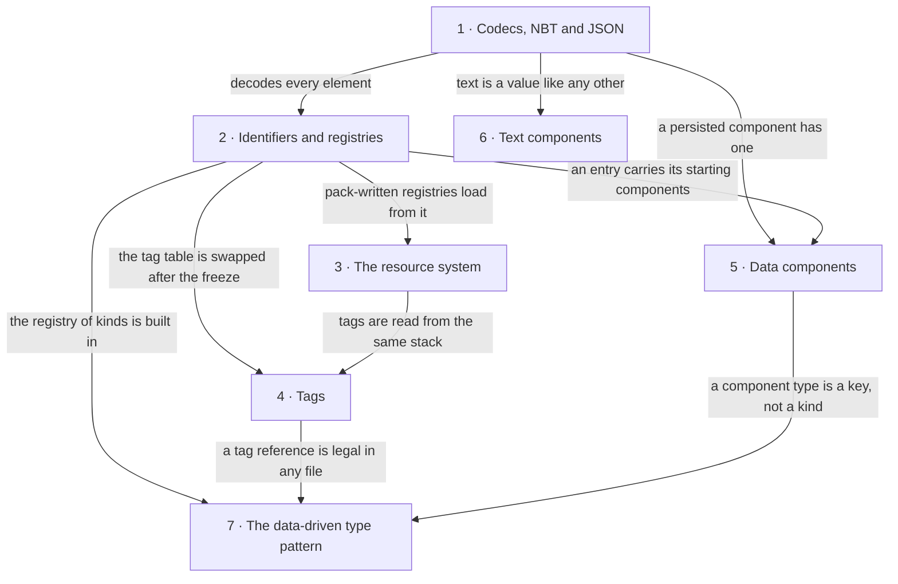

# II · Foundations

> Verified against **Minecraft 26.2** · Part II · The machinery every later part assumes: how anything becomes data, gets a name and a number, is loaded, and reaches into code.

Part II is the vocabulary the other twelve parts speak without pausing to
define it. Nothing here is a thing a player does; everything here is what
happens underneath the things a player does — and a player still recognises
it by its symptoms: the square brackets after an item name in a `/give`, the
`#minecraft:logs` in a recipe file, the *type* line at the top of most of the
JSON files in a data pack. Each of those is one of these seven pages
surfacing. The claim the part makes is that they are not seven mechanisms
but one: a codec describes a value, a registry gives it a name and a number,
a pack stack decides which copy of the file wins, and everything above is
those three used again — which is why a world made almost entirely of JSON
loads in seconds and why a data pack can recombine the game without adding a
single behaviour to it.

## The shape of the part

Part II is not a stack but a fan. Codecs and registries sit under everything
else here, and the five pages below them lean on those two far more than on
each other. The last page is the pattern the rest exists to make possible.

*The part as a fan, numbered to the watch order. An arrow points from the
machinery to the page that takes it for granted: codecs at the top is what
nothing else here is built without, registries hang directly off it, and the
pattern at the foot — which no arrow leaves, as none leaves text components
beside it — is where the part is going.*

## Before you start

[Anatomy](../anatomy/anatomy.md#four-threads-worth-memorising), for the
threads: registries are frozen before either program exists, data-pack
loading runs on the worker pool with hops back to the owning thread, and a
reload's *apply* phase runs on whichever thread owns the state being
replaced.

## Watch in this order

1. [Codecs, NBT and JSON](codecs-nbt-json.md) — one `ItemStack` written
   four ways: into a chunk file, into a packet, as a checksum in a click,
   and out of the text of a `/give`. The click sends no component data at
   all, only hashes.
2. [Identifiers and registries](identifiers-and-registries.md) — how
   `minecraft:diamond_sword` becomes an `Item` before the game exists, and
   how a data-pack biome becomes a `Holder` the client is told about. The
   wire id of a sword is the line number of its registration.
3. [The resource system](resource-system.md) — F3+T as a pipeline: a stack
   of packs, a snapshot of the list, every listener preparing at once,
   applying in order; `/reload` as the same pipeline on the server. On the
   client a failed reload deselects every pack, not the bad one.
4. [Tags](tags.md) — `#minecraft:logs` from a JSON file to the set a parrot
   checks before it perches. A frozen registry's contents never change, and
   yet `/reload` changes what the tag contains.
5. [Data components](data-components.md) — the prototype an item type
   supplies and the patch a stack carries. The prototype is built on every
   reload, with the world's registries in hand, not in the constructor.
6. [Text components](text-components.md) — a death message built on the
   server, sent as a translation key, and worded by the client's language
   file. The client receives it before anyone knows what it says.
7. [The data-driven type pattern](data-driven-types.md) — the *type* field
   at the top of a data-pack file is a lookup in a built-in registry of
   kinds. Fifty-six of the registries in `BuiltInRegistries` are read that
   way, and they are why a pack can compose the game's behaviours without
   adding one.

## Where the part stops

Every page here is a trace, so each names the classes its own scenario
touches and leaves the families beside them to the shelf — the concrete
`Tag` classes one per primitive, the fifteen partial component predicates,
the read-only `Holder` views — catalogued in
[registries](../../reference/registries.md) and
[data components](../../reference/components.md) rather than narrated. Two
omissions are deliberate: `net/minecraft/util` is a grab-bag rather than a
system, named only where a page needs one of its helpers, and
`net/minecraft/core/dispenser` is thirteen dispense behaviours sharing one
interface, which the book names nowhere because what a dispenser *is*
belongs to Part V and what each behaviour does is a catalogue. Between them
that leaves a floor: {{#include ../../generated/coverage-foundations.md}}.
The largest single thing under it is save migration, out of scope by the
newest-version-only rule
([what this book skips](../anatomy/what-this-book-skips.md) has the boundary
in full).

## Reference this part uses

[Math and primitives](../../reference/math-and-primitives.md) — the
coordinate spaces, packings, shapes and random sources every page assumes;
it was a Part II page and is now looked up, not watched.
[Registries](../../reference/registries.md) — every registry key: built-in,
data-pack, synced. [Data components](../../reference/components.md) — every
`DataComponentType`. [Naming drift](../../reference/naming-drift.md) —
`Identifier` was *ResourceLocation*. [Diagram lanes](../../reference/lanes.md)
— what the initials down the side of every sequence diagram stand for.
The [glossary](../../reference/glossary.md) is worth more here than in any
other part: this is where most of the book's vocabulary is defined, and it is
the page to check when a later part uses one of these words in a second
sense.

---

*Rules: names, never code · how the system works, not how the code reads ·
newest version only · every backticked name passes `tools/verify_names.py`.*
