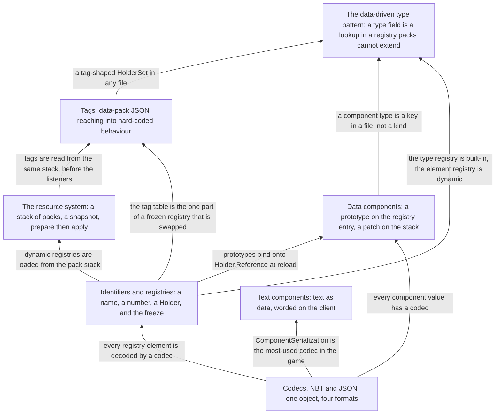

# II · Foundations

> Verified against **Minecraft 26.2** · Part II · The machinery every later part assumes: how anything becomes data, gets a name and a number, is loaded, and reaches into code.

Part II is the vocabulary the other eleven parts speak without pausing to
define it. Nothing here is a thing a player does; everything here is what
happens underneath the things a player does. A player recognises this part
by its symptom: the square brackets after an item name in a `/give`, the
`#minecraft:logs` in a recipe file, the *type* line at the top of every
JSON file in a data pack, and the fact that a world made of JSON loads in
seconds.

## The shape of the part

Part II is a stack. Each page is the machinery the page above it takes for
granted, so it is watched bottom-up, and the last page is the pattern the
whole stack exists to make possible.

## Before you start

[Anatomy](../anatomy/anatomy.md), for the threads: registries are frozen
before either program exists, data-pack loading runs on the worker pool
with hops back to the owning thread, and a reload's *apply* phase runs on
whichever thread owns the state being replaced.

## Watch in this order

1. [Codecs, NBT and JSON](codecs-nbt-json.md) — one `ItemStack` written
   four ways: into a chunk file, into a packet, as a checksum in a click,
   and out of the text of a `/give`. The click sends no item data at all.
2. [Identifiers and registries](identifiers-and-registries.md) — how
   `minecraft:diamond_sword` becomes an `Item` before the game exists, and
   how a data-pack biome becomes a `Holder` the client is told about. The
   wire id of a sword is the line number of its registration.
3. [The resource system](resource-system.md) — F3+T as a pipeline: a stack
   of packs, a snapshot of the list, every listener preparing at once,
   applying in order; `/reload` as the same pipeline on the server. A
   failed reload deselects every pack, not the bad one.
4. [Tags](tags.md) — `#minecraft:logs` from a JSON file to the set a parrot
   checks before it perches. A frozen registry's contents never change, and
   yet `/reload` changes what the tag contains.
5. [Data components](data-components.md) — the prototype an item type
   supplies and the patch a stack carries. The prototype is built on every
   reload, with the world's registries in hand, not in the constructor.
6. [Text components](text-components.md) — a death message built on the
   server, sent as a translation key, and worded by the client's language
   file. The client receives it before anyone knows what it says.
7. [The data-driven type pattern](data-driven-types.md) — the *type* field
   at the top of a data-pack file is a lookup in a built-in registry of
   kinds, and the fifty-six registries of that shape are the whole reason a
   pack can compose the game's behaviours without adding one.

## Reference this part uses

[Math and primitives](../../reference/math-and-primitives.md) — the
coordinate spaces, packings, shapes and random sources every page assumes;
it was a Part II page and is now looked up, not watched.
[Registries](../../reference/registries.md) — every registry key: built-in,
data-pack, synced. [Data components](../../reference/components.md) — every
`DataComponentType`. [Naming drift](../../reference/naming-drift.md) —
`Identifier` was *ResourceLocation*. [Diagram lanes](../../reference/lanes.md).

---

*Rules: names, never code · how the system works, not how the code reads ·
newest version only · every backticked name passes `tools/verify_names.py`.*
