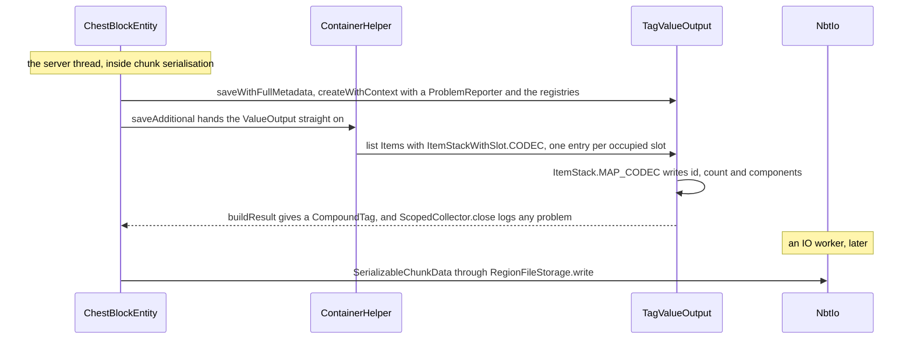
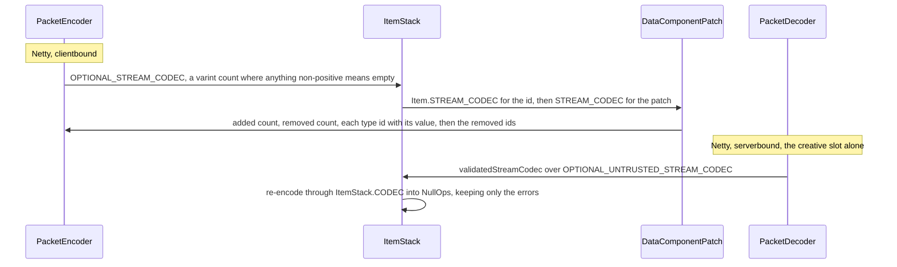
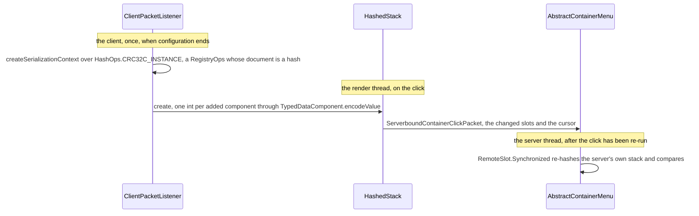
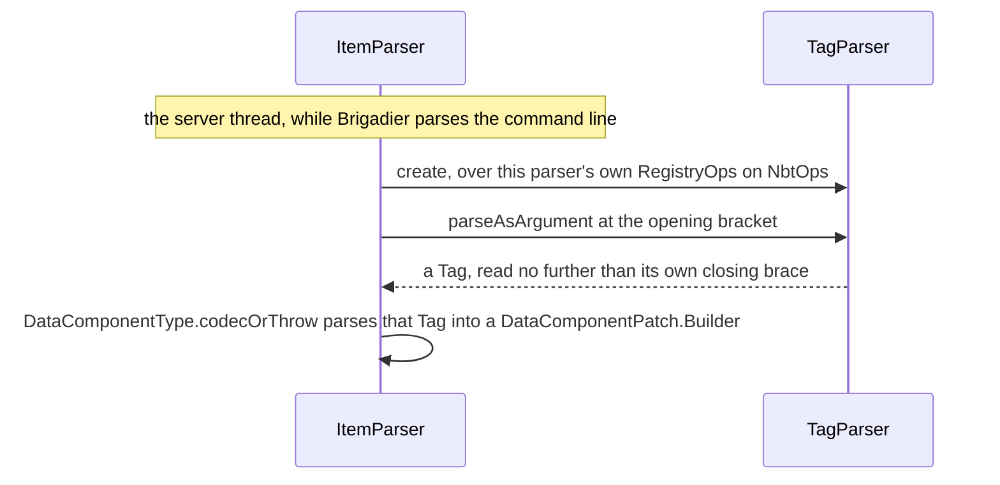

# Codecs, NBT and JSON

> Verified against **Minecraft 26.2** · Part II · One `ItemStack` written four ways: into a chest's chunk file, into a container packet, as a checksum in a click, and out of the text of a `/give`.

A player types `/give @s diamond_sword[damage=5]`, drops the sword into a
chest, logs out, comes back and clicks the slot. In those few seconds the
same sword has been written four times into four different shapes: parsed
out of the square brackets, written into the chunk file the chest lives in,
sent down a socket as bytes, and sent back up when the slot was clicked.
The fourth is the one worth stopping on. **The click carries no component
data at all.** It names the item and the count in the clear —
`HashedStack.ActualItem` is a `Holder<Item>`, an int and a hashed patch —
and for each component on the sword it sends one 32-bit checksum,
produced by running that component's own codec into a `DynamicOps` whose
output is a hash rather than a document — `HashOps`. And it is the same
codec every time. The codec that hashed the damage value is the codec that
wrote it into the chunk file and the codec that parsed it out of the square
brackets. One description of a type, and the format is an argument.

## The cast

| class | what it decides | thread |
|---|---|---|
| `Codec` | DataFixerUpper's description of a type: encode to and decode from *any* format, given the ops for it | any |
| `DynamicOps` | what a format's map, list, string and number are made of — the argument a codec takes | any |
| `NbtOps` | tags: the binary tree on disk, and what SNBT text parses into | any |
| `RegistryOps` | the registry lookup a `Holder`-valued codec needs, wrapped around another ops | any |
| `HashOps` | the format whose finished document is a hash; nothing is serialised on the way | Render on the client, Server on the comparison |
| `StreamCodec` | the exception: hand-laid bytes on a Netty `ByteBuf`, written once, read once | Netty |
| `TagValueOutput` · `TagValueInput` | the only `ValueOutput` and `ValueInput` there are — a `CompoundTag` plus its ops, and what save code actually sees | whichever thread saves |
| `ProblemReporter` | that a codec failure inside a save is a logged path, not an exception in the tick | the failing thread |

All of it ships in both jars. The thread column is the four of
[anatomy](../anatomy/anatomy.md#four-threads-worth-memorising), and which one
holds a codec matters only where the same codec runs on two of them.

## The four paths, side by side

|  | into the chunk file | onto the wire | back as a checksum | out of the text |
|---|---|---|---|---|
| **who starts it** | `ChestBlockEntity.saveAdditional`, inside chunk serialisation | `ClientboundContainerSetSlotPacket`, from `AbstractContainerMenu.broadcastChanges` | `MultiPlayerGameMode.handleContainerInput`, on the click | `GiveCommand` through `ItemArgument` |
| **the ops** | `RegistryOps` over `NbtOps` | none — a `RegistryFriendlyByteBuf` and nothing else | `RegistryOps` over `HashOps.CRC32C_INSTANCE` | `RegistryOps` over `NbtOps`, held by a `TagParser` |
| **the codec** | `ItemStack.MAP_CODEC`, inside `ItemStackWithSlot.CODEC` | `ItemStack.OPTIONAL_STREAM_CODEC` | each component's own codec, through `TypedDataComponent.encodeValue` | `DataComponentType.codecOrThrow`, one component at a time |
| **what is carried** | a document — *id*, *count*, *components* | a count, an item id, then a `DataComponentPatch` | one int per added component, and the bare names of the removed ones | SNBT text, then a `Tag` |
| **the thread** | Server, then an IO worker for the file itself | Netty | Render on the client, Server on the comparison | Server |
| **when it fails** | a problem is recorded on a `ProblemReporter` and logged when the scope closes | the decoder throws, `Connection.exceptionCaught` sees it, and the connection drops | the hash disagrees, and the server sends the slot back | a `CommandSyntaxException` with the cursor position in it |

Four columns, four diagrams. Read them as four answers to the same question.

### Disk: a chest writes a list of slots

`ItemStack` has no NBT method — there is no *save* and no *parse* on it.
`ChestBlockEntity.saveAdditional` receives a `ValueOutput` and calls
`ContainerHelper.saveAllItems`, which opens a typed list under *Items* with
`ItemStackWithSlot.CODEC`, a record of slot plus the stack's own
`ItemStack.MAP_CODEC` fields inlined. That map codec writes *id*, *count*
(defaulting to 1) and *components*, the last being
`DataComponentPatch.CODEC`, which spells a removal as *!minecraft:foo*.
`NbtUtils.addCurrentDataVersion` stamps the data version on the way out.
Load is the mirror: `BlockEntity.loadStatic` reads the id,
`ChestBlockEntity.loadAdditional` calls `ContainerHelper.loadAllItems` over
`ValueInput.listOrEmpty`.

### Wire: a count, an id and a patch

Nothing on this path is a `Codec`. `ItemStack.OPTIONAL_STREAM_CODEC` writes
a varint count where anything non-positive means empty and nothing else
follows, then a registry id that resolves because the buffer is a
`RegistryFriendlyByteBuf`, then `DataComponentPatch.STREAM_CODEC`.
`ItemStack.STREAM_CODEC` is the same codec that refuses an empty stack.
Serverbound is a different animal:
`ServerboundSetCreativeModeSlotPacket` uses `ItemStack.validatedStreamCodec`
over `ItemStack.OPTIONAL_UNTRUSTED_STREAM_CODEC`, and the decoded stack is
re-encoded through `ItemStack.CODEC`
into `NullOps` — output thrown away, only the errors kept — to prove that
the persistent codec would have accepted it. Why that packet in particular is
fenced, and what the other two fences are, is [packets and stream
codecs](../networking/packets-and-stream-codecs.md#what-stops-a-hostile-sender)'.

### Checksum: a hash instead of a stack

`HashOps` is a `DynamicOps` like any other, and a codec cannot tell the
difference: it builds maps and lists and strings as usual, and what comes
back at the end is a hash code rather than a tree. There is no intermediate
byte form to hash. Only one instance is ever built,
`HashOps.CRC32C_INSTANCE`, and **both sides wrap it in a `RegistryOps`** —
`ClientPacketListener` builds one from the registries it received during
configuration, `ServerPlayer` from the server's own — because a component
value can name a registry entry, and a hash of an unresolvable name is no
hash at all. The server's is behind a 256-entry cache keyed on the
`TypedDataComponent`, so the common components are hashed once per player
and then looked up. Removals are not hashed: `HashedPatchMap` is a map of
added component type to int plus a plain set of removed types. What the
server does with the comparison — the either-or in
`RemoteSlot.Synchronized`, and the promotion to a concrete stack when the
hash agrees — is [containers and menus](../items/containers-and-menus.md).

### Text: square brackets into a `Tag`

`ItemArgument` hands `GiveCommand` an `ItemInput`, and `ItemParser` is what
builds it. The parser holds a `RegistryOps` over `NbtOps.INSTANCE` and a
`TagParser` created *for that ops*, so `[damage=5]` becomes a `Tag` and
then goes through the very codec the chunk file used, reached by
`DataComponentType.codecOrThrow`. A leading `ItemParser.SYNTAX_REMOVED_COMPONENT`
is the command-line spelling of the same removal the disk codec writes.
Data packs are the JSON twin of this path:
`SimpleJsonResourceReloadListener.scanDirectory` takes whatever
`DynamicOps` it is handed, registry-aware or bare, and an `ItemStack` in a
loot table goes through `ItemStack.CODEC` exactly as it does on disk.

## One abstraction, and the ops that are not formats

A `Codec` is a description of a type and nothing else; it does not know
what it is writing into. The format is the `DynamicOps` handed to it at the
call, so the same object describes NBT on disk, JSON in a data pack, and
SNBT typed at a command line. Most of the game's codecs are assembled from
the combinators in `ExtraCodecs`, a thousand lines of vocabulary in
`net/minecraft/util`; the [class index](../../reference/class-index.md) is
where to look one of them up.

Two of the game's ops are not formats at all. `HashOps`, in the cast above,
answers every question a codec asks and returns a checksum instead of a
document. `NullOps`, which the cast does not list, returns `Unit`: it
encodes to nothing, and exists so
that a codec can be *run for its errors alone*, which is exactly what
`ItemStack.validatedStreamCodec` does to a creative-mode stack.

`StreamCodec` is the genuine exception, and it is not a `Codec` at all.
A `StreamCodec` pairs an encoder and a decoder over a `ByteBuf` directly,
with `StreamCodec.composite` building one out of field codecs; the
catalogue of primitives is `ByteBufCodecs`. A packet is written once, read
once and must be small, so it gets hand-laid bytes rather than a document
in some format. The two worlds meet at `ByteBufCodecs.fromCodec` and
`ByteBufCodecs.fromCodecWithRegistries`, which run an ordinary `Codec` into
NBT and put the tag on the wire; the composing vocabulary on the far side of
that meeting is [packets and stream
codecs](../networking/packets-and-stream-codecs.md#the-codec-layer-is-small-and-composition-is-all-of-it)'.

## Where the registry context comes from

A codec that names an entry of a **dynamic** registry cannot resolve it on
its own. `RegistryFileCodec`, `RegistryFixedCodec` and `HolderSetCodec` all
demand a `RegistryOps`, a `DelegatingOps` carrying a
`RegistryOps.RegistryInfoLookup` beside whatever real ops it wraps. There
are two routes worth knowing: `HolderLookup.Provider.createSerializationContext`,
which is what nearly every caller uses, and `RegistryDataLoader.createContext`,
used during registry loading itself, when the registries are still being
built ([identifiers and registries](identifiers-and-registries.md#when-a-world-opens)). Both
end at `RegistryOps.create`, which a handful of callers reach directly.

A codec over a **built-in** registry is a different case:
`Registry.holderByNameCodec` — and so `Item.CODEC` — resolves against the
registry instance captured inside the codec, and works on bare
`NbtOps.INSTANCE`. The distinction is not academic. It decides which paths
must build a context before they can decode anything, and in practice
almost every real path must: `TagValueOutput.createWithoutContext` exists
and is called by nothing at all, and there is no context-free `ValueInput`
even in principle.

On the network the same context arrives as a decorator.
`RegistryFriendlyByteBuf` adds `RegistryFriendlyByteBuf.registryAccess` to a
`FriendlyByteBuf`, and `RegistryFriendlyByteBuf.decorator` is bound when the
protocol switches from configuration to play. Configuration packets have no
registry context — which is why registry data and tags are sent in that
phase as NBT and ids, and why the `ByteBufCodecs.holder` family is play-only
([protocol phases](../networking/protocol-phases.md)).

## What NBT actually is

`Tag` is a **sealed** interface, and the scalar leaves are records.

| branch | members | notes |
|---|---|---|
| `CompoundTag` | — | a final class; the only keyed shape |
| `CollectionTag` | `ListTag`, `ByteArrayTag`, `IntArrayTag`, `LongArrayTag` | the arrays are final classes, `ListTag` is a list |
| `PrimitiveTag` | `StringTag` and the six `NumericTag` records | records of one value each |
| `EndTag` | — | the terminator |

Because the leaves are records, the old *getAsInt* family is gone:
`Tag.asInt` and `Tag.asString` return `Optional`, `CompoundTag.getInt` is
`Optional` and `CompoundTag.getIntOr` is its defaulted form,
`CompoundTag.get` is still nullable, and the two-argument *contains* taking
a type id no longer exists.

Three things about the binary form surprise people.

**A mixed-type list is boxed on the way out.** Binary NBT stores one
element type per list, so `ListTag.write` promotes a heterogeneous list to
compounds and wraps each element in a one-entry compound under the empty
key, with `ListTag.addAndUnwrap` the exact inverse on read. This is not a
legacy artefact left lying around — it is written today, and it is the whole
reason mixed lists are legal at all.

**A numeric array stays an array, but nothing turns a list into one.**
`NbtOps.createCollector` hands back a `NbtOps.GenericListCollector` for an empty
list and only reaches for `NbtOps.ByteListCollector`, `NbtOps.IntListCollector` or
`NbtOps.LongListCollector` when it is handed an existing `ByteArrayTag`,
`IntArrayTag` or `LongArrayTag` — and those degrade back to the generic
collector the moment an element does not fit. A codec building a fresh list
gets a `ListTag`, whatever is in it; the arrays on disk are written by the
codecs that asked for arrays.

**A whole file need not be read to answer a question about it.**
`StreamTagVisitor` and the visitors beside it let `NbtIo.parse` pull a named
handful of fields out of a region chunk without materialising the chunk: a
`CollectFields` is built from the `FieldSelector`s the caller wants, two for
the `IOWorker` reading a chunk's data version and its blending data, three
for `StructureCheck`, which is how it and the world-list screen answer
without loading a world.

Every read that came from outside carries a budget. `NbtAccounter` is
charged as the per-type read strategy in `TagType` walks the stream, with
`NbtAccounter.DEFAULT_NBT_QUOTA` at 2 MiB,
`NbtAccounter.UNCOMPRESSED_NBT_QUOTA` at 100 MiB and a depth cap of
`NbtAccounter.MAX_STACK_DEPTH`; overrunning any of them raises an
`NbtException`. Region compression is a separate global:
`RegionFileVersion.configure` sets one process-wide selection from
*region-file-compression*, a `RegionFile` captures it once for **writing**,
but every chunk carries its own version byte and reads honour that — so one
world can hold chunks in several compressions at once.
`RegionFileVersion.VERSION_CUSTOM` (id 127) is the marker for a chunk
written with a compression the game does not name; the marker for a chunk
that grew too big and lives in its own external file is a different one —
`RegionFile`'s external-stream flag, 128, set in the version byte. And
`NbtIo.writeCompressed` (GZIP)
is for the standalone files, *level.dat* and player data.

The text form is `TagParser`, and it is generic over its *output* ops
rather than producing tags: SNBT can decode straight into any format's
target without a `CompoundTag` in between. `TagParser.parseCompoundFully`
is the plain-string entry point; `TagParser.FLATTENED_CODEC` accepts an
SNBT string only, and `TagParser.LENIENT_CODEC`, built as an alternative of
the two, is the one that takes a string *or* an object interchangeably.
Under it, `SnbtGrammar` is a packrat grammar and `SnbtOperations` supplies
the built-in *bool* and *uuid* functions.

## Save code never sees a `CompoundTag`

`ValueOutput` and `ValueInput` are the façade every `BlockEntity` and
`Entity` writes through — `ValueOutput.store` with a codec,
`ValueOutput.child`, `ValueOutput.list`, and typed getters with defaults on
the way back in (`ValueInput.getIntOr`, `ValueInput.getStringOr`). The only
implementations are `TagValueOutput` and `TagValueInput`, which wrap a
`CompoundTag` and a `DynamicOps`, with `ValueInputContextHelper` holding the
shared provider and the empty instances. The `CompoundTag`-returning methods
on `BlockEntity` are final shells that build one of these, and they differ
only in how much metadata they add: `BlockEntity.saveCustomOnly` none,
`BlockEntity.saveWithoutMetadata` the block entity's own *components* as a
full `DataComponentMap`, and `BlockEntity.saveWithFullMetadata` the id and
x, y and z. `BlockEntity.saveWithId` adds the id too, but only in the
`ValueOutput` form — it has no `CompoundTag` shell.

The point of the façade is that **an encode failure is reported, not
thrown**. Everything goes through a `ProblemReporter`, and
`ProblemReporter.ScopedCollector` logs the whole collected tree of problems
when it closes, rooted at `BlockEntity.problemPath` or `Entity.problemPath`;
`TagValueOutput.EncodeToFieldFailedProblem` and its siblings are what a bad
codec produces. A component that will not serialise costs you the component,
not the tick. The deliberate exceptions to the façade are `CustomData` and
`TypedEntityData`, the two components that carry a `CompoundTag` verbatim so
that data packs have an escape hatch
([data components](data-components.md#the-key-datacomponenttype)).

Migration is the one thing that runs before any of this. `DataFixTypes` is
the enum of every kind of file the game owns — `DataFixTypes.CHUNK`,
`DataFixTypes.PLAYER`, `DataFixTypes.LEVEL`, `DataFixTypes.OPTIONS` and the
rest — and each calls `DataFixTypes.updateToCurrentVersion` on the
DataFixerUpper `DataFixer` from `DataFixers.getDataFixer` before the codec is
shown the tag, using the data version `NbtUtils.addCurrentDataVersion`
stamped when the file was written. The fixes themselves are out of scope
here.

## Trusted, untrusted and validated

The wire's own vocabulary for *how far to trust a document* is
[packets and stream
codecs](../networking/packets-and-stream-codecs.md#what-stops-a-hostile-sender)':
the trusted/plain pairs are a read budget chosen by direction, and the
creative slot is the one packet that carries an arbitrary stack and is fenced
three ways for it. What belongs here is the fact that stands *behind* those
fences: this page's four paths run one `ItemStack` through four ops, and the
serverbound path is the only one where the codec is run for its **errors**
rather than its output. `ItemStack.validatedStreamCodec` re-encodes a decoded
stack through `ItemStack.CODEC` into `NullOps` and keeps nothing but the
problems — the persistent codec is used as a validator for the wire one,
which is why a creative-mode stack cannot carry a component the *disk* would
reject.

JSON is the format with the smallest footprint. It is the data packs, and
on the wire it survives in exactly two places, both outside the play phase:
`ClientboundStatusResponsePacket` and `ClientboundLoginDisconnectPacket`,
sent through `ByteBufCodecs.lenientJson`. That is why the game ships two
JSON parsers — `LenientJsonParser` for the wire and `StrictJsonParser` for
data packs. Chat text itself is NBT by the time it reaches the play phase:
`ComponentSerialization` holds that whole matrix in one class
([text components](text-components.md#serialisation-one-codec-three-shapes)).

## Questions players ask

**Why does an item look identical and not stack?** Because equality is
prototype plus patch, and the patch is what these codecs round-trip. Two
stacks that took different routes to the same components compare equal;
one that kept a component the other dropped does not, however the tooltip
reads.

**Why can a data pack put arbitrary NBT on an item at all?** Because
`CustomData` and `TypedEntityData` are components whose value *is* a
`CompoundTag`, passed through verbatim. Everything else on a stack has a
real codec and is checked by it.

**Why does a corrupt item vanish instead of crashing the world?** Because
the save façade reports rather than throws. The bad field becomes a problem
on a `ProblemReporter` and is logged when the scope closes, and the chunk
saves without it.

**Why is a creative-mode item the one thing the server double-checks?**
Because it is the only packet on which a client authors a whole stack.
Everywhere else the client either receives stacks or asserts hashes about
stacks the server already sent it.

**Why does a `/give` accept the same square brackets a chunk file uses?**
Because it is the same codec. `ItemParser` parses the text into a `Tag`
with `TagParser` and hands that tag to `DataComponentType.codecOrThrow` —
the codec `ItemStack.MAP_CODEC` reaches for when it writes *components* to
disk.

**Why can a world hold chunks in two different compressions?** Because the
compression setting is captured per `RegionFile` for writing only, and every
chunk stores the version byte it was written with. Reads honour the byte.

## Where to look

`Codec` · `DynamicOps` · `ExtraCodecs` · `RegistryOps` ·
`HolderLookup.Provider.createSerializationContext` · `Tag` · `CompoundTag` ·
`ListTag` · `NbtOps` · `NbtIo` · `NbtAccounter` · `TagParser` ·
`StreamTagVisitor` · `HashOps` · `NullOps` · `ValueOutput` · `ValueInput` ·
`TagValueOutput` · `ProblemReporter` · `BlockEntity` (the save shells) ·
`ContainerHelper` · `ItemStackWithSlot` · `ItemStack` (the codec fields) ·
`StreamCodec` · `ByteBufCodecs` · `RegistryFriendlyByteBuf` ·
`PacketEncoder` · `HashedPatchMap` · `ItemParser` · `DataFixTypes` ·
`RegionFileVersion`

---

*Rules: names, never code · how the system works, not how the code reads ·
newest version only · every backticked name passes `tools/verify_names.py`.*
