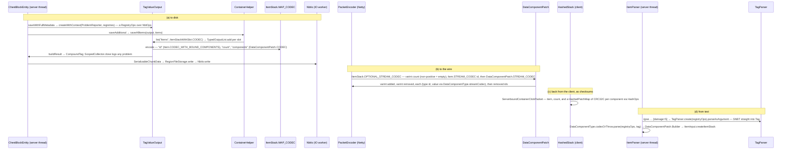

# Codecs, NBT and JSON

> Verified against **Minecraft 26.2** · Part II · One `ItemStack` written four ways: into a chest's chunk file, into a container packet, as a checksum in a click, and out of the text of a `/give`.

## Responsibility

Minecraft serialises through one abstraction and several wire shapes. The
abstraction is DataFixerUpper's `Codec`: a description of a type that can
encode to or decode from *any* format given a `DynamicOps` for it. The
formats the game actually uses are **NBT** (`NbtOps`, the binary tree on
disk and the text form SNBT that commands use), **JSON** (`JsonOps`, the
data packs), and two curiosities the game supplies itself — `HashOps`, which
"encodes" to a checksum, and `NullOps`, which encodes to nothing. Packets
are the exception: they mostly do not go through a codec at all but through
a `StreamCodec`, hand-laid bytes on a Netty `ByteBuf`, because a packet is
written once, read once, and must be small.

The one sentence a player recognises: *the thing in square brackets after an
item name in `/give` is the same data that ends up in the chunk file.*

## The data it owns

- **Codecs** (external, in com.mojang.serialization; the game adds
  `ExtraCodecs` in `net/minecraft/util`, nearly a thousand lines of them).
  `ExtraCodecs.intRange`, `ExtraCodecs.nonEmptyList`,
  `ExtraCodecs.optionalAlwaysPresentFieldOf` and friends are the vocabulary
  most game codecs are built from. A codec that names an entry of a
  **dynamic** registry — `RegistryFileCodec`, `RegistryFixedCodec`,
  `HolderSetCodec` — needs a `RegistryOps` (`net/minecraft/resources`), a
  `DelegatingOps` carrying a `RegistryOps.RegistryInfoLookup`;
  `HolderLookup.Provider.createSerializationContext` is how most callers make
  one, and `RegistryDataLoader.createContext` is the other way, used during
  registry loading itself. A codec over a **built-in** registry
  (`Registry.holderByNameCodec`, and so `Item.CODEC`) resolves against the
  registry instance captured inside it and works fine on bare
  `NbtOps.INSTANCE` — the distinction matters, because it decides which
  paths must build a context first.
- **NBT** (`net/minecraft/nbt`). `Tag` is a **sealed** interface: `CompoundTag`,
  `CollectionTag` (`ListTag`, `ByteArrayTag`, `IntArrayTag`, `LongArrayTag`),
  `PrimitiveTag` (`StringTag` and the six `NumericTag` records) and
  `EndTag`. The **scalar** leaves are records — `StringTag` and the numerics;
  `CompoundTag`, `EndTag` and the array tags are final classes and `ListTag`
  is a list. `TagType` and `TagTypes` are the per-type read strategy every
  binary load goes through, and where the accounter is charged;
  `NbtException` and its siblings are what a malformed read raises.
  `NbtIo` reads and writes streams and files (`NbtIo.readCompressed`,
  `NbtIo.writeCompressed` are GZIP); `NbtAccounter` is the read-side
  byte-and-depth budget every untrusted read carries
  (`NbtAccounter.DEFAULT_NBT_QUOTA` 2 MiB,
  `NbtAccounter.UNCOMPRESSED_NBT_QUOTA` 100 MiB, and a depth cap of
  `NbtAccounter.MAX_STACK_DEPTH`); `NbtOps.INSTANCE` is the `DynamicOps` over
  tags, and `NbtOps.convertTo` is the bridge to any other format.
  `TagParser` parses SNBT and is generic over the *output* ops, so text can
  decode straight into a registry-aware context; `SnbtGrammar` is the packrat
  grammar behind it, `SnbtOperations` the built-in `bool(...)` and `uuid(...)`
  functions. `StringTagVisitor` and `SnbtPrinterTagVisitor` print;
  `TextComponentTagVisitor` colours for `/data`.
- **The save façade** (`world/level/storage`). `ValueOutput` and
  `ValueInput` are what a `BlockEntity` or `Entity` writes to and reads
  from: `ValueOutput.store` with a codec, `ValueOutput.child`,
  `ValueOutput.list` (returning a `ValueOutput.TypedOutputList`), and typed
  getters with defaults on the input side (`ValueInput.getIntOr`,
  `ValueInput.getStringOr`). The only implementations are `TagValueOutput`
  and `TagValueInput`, which wrap a `CompoundTag` plus a `DynamicOps`, with
  `ValueInputContextHelper` holding the shared provider and the empty
  instances. Every encode or decode failure is *reported*, not thrown,
  through a `ProblemReporter` — `ProblemReporter.ScopedCollector` logs the
  collected tree of problems on close, rooted at `BlockEntity.problemPath`
  or `Entity.problemPath`.
- **Stream codecs** (`net/minecraft/network/codec`, `net/minecraft/network`). `StreamCodec` pairs a
  `StreamEncoder` and a `StreamDecoder`; `StreamCodec.composite` builds one
  from up to twelve field codecs. `ByteBufCodecs` is the catalogue of
  primitives (`ByteBufCodecs.VAR_INT`, `ByteBufCodecs.STRING_UTF8`,
  `ByteBufCodecs.COMPOUND_TAG`, `ByteBufCodecs.TRUSTED_COMPOUND_TAG` …) and
  bridges: `ByteBufCodecs.fromCodec` and
  `ByteBufCodecs.fromCodecWithRegistries` (plus their `…Trusted` variants)
  send NBT built by a `Codec`, `ByteBufCodecs.lenientJson` sends JSON text,
  and `ByteBufCodecs.registry`, `ByteBufCodecs.holder`,
  `ByteBufCodecs.holderSet` send registry ids. `FriendlyByteBuf` wraps a
  `ByteBuf` with varints, strings, NBT, identifiers and positions;
  `RegistryFriendlyByteBuf` adds `RegistryFriendlyByteBuf.registryAccess`,
  and exists only in the play phase — `RegistryFriendlyByteBuf.decorator` is
  bound when the protocol switches from configuration to play.
  `IdDispatchCodec` is the packet-id table itself.

All of this ships in both jars.

## When it runs

Codecs run wherever data is: the **server thread** for saves initiated by
the tick (`BlockEntity.saveWithFullMetadata` inside chunk serialisation,
`PlayerDataStorage.save`), the **worker pool** for `SerializableChunkData.write`
and for data-pack JSON decoding in reload listeners and registry load tasks,
the **IO workers** for `NbtIo.write` into region files, and the **Netty
threads** for every `StreamCodec` in `PacketEncoder` and `PacketDecoder`.
Nothing here has a tick of its own.

## The trace: one `ItemStack`, four ways

Narrated:

**(a) Disk.** `ItemStack` has no NBT method; there is no *save* or *parse*
on it. `ChestBlockEntity.saveAdditional` receives a `ValueOutput` and calls
`ContainerHelper.saveAllItems`, which opens a typed list under "Items" with
`ItemStackWithSlot.CODEC` — a record of slot plus the stack's `ItemStack.MAP_CODEC`
fields inlined. That map codec writes "id", "count" (defaulting to 1 via
`ExtraCodecs.optionalAlwaysPresentFieldOf`) and "components"
(`DataComponentPatch.CODEC`, removals as `!minecraft:foo`). The
`TagValueOutput` was created by the final shell `BlockEntity.saveWithFullMetadata`
with `TagValueOutput.createWithContext`, so the ops are a `RegistryOps`.
The three save shells differ only in metadata: `BlockEntity.saveCustomOnly`
adds none, `BlockEntity.saveWithoutMetadata` adds the block entity's own
"components" (`DataComponentMap.CODEC`), `BlockEntity.saveWithId` adds the
id, and `BlockEntity.saveWithFullMetadata` adds id, x, y and z. The result
joins the chunk's "block_entities", `NbtUtils.addCurrentDataVersion` stamps
the data version, and an IO worker writes it through `RegionFileStorage.write`
with `NbtIo.write`. Load is the mirror: `BlockEntity.loadStatic` reads "id",
`ChestBlockEntity.loadAdditional` calls `ContainerHelper.loadAllItems` over
`ValueInput.listOrEmpty`.

**(b) Wire.** `ClientboundContainerSetSlotPacket` encodes the stack with
`ItemStack.OPTIONAL_STREAM_CODEC`: a varint count where anything non-positive
means empty and nothing else follows; `Item.STREAM_CODEC` (a registry id,
resolvable because the buffer is a `RegistryFriendlyByteBuf`); then
`DataComponentPatch.STREAM_CODEC`. `ItemStack.STREAM_CODEC` is the same but
refuses an empty stack. Serverbound is different:
`ServerboundSetCreativeModeSlotPacket` uses `ItemStack.validatedStreamCodec`
over `ItemStack.OPTIONAL_UNTRUSTED_STREAM_CODEC`, where
`DataComponentPatch.DELIMITED_STREAM_CODEC` length-prefixes every component
value and the decoded stack is then *re-encoded* through `ItemStack.CODEC`
into `NullOps` — output discarded, only the errors kept — to prove the
persistent codec would accept it. Everything here runs on a Netty thread
inside `PacketEncoder` and `PacketDecoder`.

**(c) Checksums.** The ordinary container click does not send components at
all. `ServerboundContainerClickPacket` carries a `HashedStack`, whose
`HashedPatchMap` is one CRC32C per component, produced by running the
component's own codec into `HashOps` — a `DynamicOps` whose output is a hash
rather than a document. The server compares hashes against what it last sent.
This is the fourth serialisation of the same object and the one that carries
no data; [data-components](data-components.md) owns what the server does with
it.

**(d) Text.** `GiveCommand` asks `ItemArgument` for an `ItemInput`.
`ItemParser` holds a `RegistryOps` over `NbtOps.INSTANCE` and a `TagParser`
created *for that ops*, so `[damage=5]` is parsed by `TagParser.parseAsArgument`
directly into a `Tag`, then each component's `DataComponentType.codecOrThrow`
parses it — the same codec the chunk file used — into a
`DataComponentPatch.Builder`. Data packs are the JSON twin:
`SimpleJsonResourceReloadListener.scanDirectory` takes whatever
`DynamicOps` it is handed (registry-aware or bare) and parses with
`StrictJsonParser`; an `ItemStack` in a loot table goes through
`ItemStack.CODEC` exactly as on disk. One codec, many formats.

## Interfaces

- **Called by:** every `BlockEntity` and `Entity` save (`BlockEntity.saveAdditional`,
  `BlockEntity.loadAdditional`, `Entity.saveWithoutId`, `Entity.load`),
  `PlayerDataStorage`, `LevelStorageSource` for `level.dat`, `SavedDataStorage`
  via `SavedDataType`, `CommandStorage`; every packet's static stream codec;
  every command argument that parses NBT (`CompoundTagArgument`,
  `NbtTagArgument`, `NbtPathArgument`, `ItemArgument`).
- **Calls into:** registries for `RegistryOps`
  ([identifiers-and-registries](identifiers-and-registries.md)); the
  component types for their codecs ([data-components](data-components.md));
  the resource system for files ([resource-system](resource-system.md)).
- **Crosses the network as:** everything — but in four shapes. Structured
  data is `StreamCodec` fields. Opaque data is NBT, through
  `ByteBufCodecs.COMPOUND_TAG` or a `ByteBufCodecs.fromCodec` bridge.
  **JSON text** survives in exactly two places, both outside the play phase:
  `ClientboundStatusResponsePacket` and `ClientboundLoginDisconnectPacket`,
  which is why the game ships two JSON parsers — `LenientJsonParser` for the
  wire, `StrictJsonParser` for data packs. And a codec can reach the wire as
  a bare integer through `HashOps`.
- **Data-driven by:** nothing; this is the layer the data goes through.
  The save format's *migration* is `DataFixTypes` — the enum of every kind
  of file the game owns (`DataFixTypes.CHUNK`, `DataFixTypes.PLAYER`, `DataFixTypes.LEVEL`, `DataFixTypes.OPTIONS` …), each
  calling `DataFixTypes.updateToCurrentVersion` on the DFU `DataFixer` from
  `DataFixers.getDataFixer` before the codec sees the tag. The fixes
  themselves (`util/datafix`) are out of scope by rule 3.

## Invariants and surprises

- **`Tag` is sealed and the scalar leaves are records.** `IntTag` is a record
  of one int; the old *getAsInt* family is gone and `Tag.asInt`, `Tag.asString`
  etc. return `Optional`. On `CompoundTag`, `CompoundTag.getInt` is
  `Optional` and `CompoundTag.getIntOr` is the defaulted form;
  `CompoundTag.get` is still nullable; the two-argument *contains* with a
  type id no longer exists.
- **Save code never sees a `CompoundTag`.** `BlockEntity.saveAdditional`
  and `Entity` take `ValueOutput`; the `CompoundTag`-returning methods on
  `BlockEntity` are final shells that build a `TagValueOutput`. A codec
  failure inside a save is a logged problem path, never an exception in the
  tick — `TagValueOutput.EncodeToFieldFailedProblem` and its siblings. The
  named exceptions are `CustomData` and `TypedEntityData`, the components
  that deliberately carry a `CompoundTag` verbatim so data packs have an
  escape hatch.
- **Registry context is not optional in practice.**
  `TagValueOutput.createWithoutContext` exists and is called by nothing at
  all; there is no context-free `ValueInput` even in principle. Almost every
  real codec resolves a dynamic-registry `Holder` somewhere.
- **A mixed-type `ListTag` is boxed on the way out.** Binary NBT stores one
  element type per list, so `ListTag.write` promotes a heterogeneous list to
  compounds and wraps each element in a one-entry compound under the empty
  key; `ListTag.addAndUnwrap` is the exact inverse on read. The wrapper is
  not a legacy artefact — it is written today, and it is the whole reason
  mixed lists are legal.
- **`NbtOps` list collectors start specialised.** A list of bytes, ints or
  longs is collected into a `ByteArrayTag`, `IntArrayTag` or `LongArrayTag`
  and only degrades to a generic `ListTag` on the first mismatched element —
  so a homogeneous numeric list on disk is an array tag, not a list of
  numeric tags.
- **`TagParser` is generic over its output.** SNBT can decode into any
  `DynamicOps` target without going through a `CompoundTag` first;
  `TagParser.parseCompoundFully` is the plain-string entry point.
  `TagParser.FLATTENED_CODEC` accepts an SNBT **string** only; the codec that
  takes a string *or* an object interchangeably is
  `TagParser.LENIENT_CODEC`, built as an alternative of the two.
- **"Trusted" means the server wrote it, not that it is clientbound.** The
  live distinction is `ByteBufCodecs.TRUSTED_COMPOUND_TAG` (an unlimited
  accounter, used for block-entity update payloads, chat components and
  dialogs) against plain `ByteBufCodecs.COMPOUND_TAG` (the 2 MiB default,
  used for `CustomData` and predicates). `ByteBufCodecs.TRUSTED_TAG` exists
  and has no call sites at all; do not build a mental model on it.
- **Serverbound defence is layered, not singular.** Full re-validation
  through `ItemStack.validatedStreamCodec` is unique to the creative-mode
  slot. `ServerboundCustomClickActionPacket` builds its own, much tighter
  `NbtAccounter` and length-prefixes the payload. And the ordinary container
  click sends no component data at all, only hashes.
- **`RegistryFriendlyByteBuf` is a play-phase decorator.** Configuration
  packets have no registry context, which is why registry data and tags
  are sent as NBT and ids in that phase (`RegistrySynchronization` is the
  concrete case) and why `ByteBufCodecs.holder` codecs are play-only.
- **Chat components are NBT on the wire.** `ComponentSerialization` is the
  most-used codec in the game and carries the whole matrix in one class: a
  JSON/NBT `Codec` for data, a registry-aware stream codec for play, trusted
  and context-free stream variants, and a flat-size-restricted codec used
  where a component arrives from a player.
- **A whole file need not be read to answer a question about it.**
  `StreamTagVisitor` and the `nbt/visitors` family (`CollectFields`,
  `SkipFields`, `FieldSelector`, `FieldTree`, `CollectToTag`) let
  `NbtIo.parse` pull two fields out of a region chunk without materialising
  it — which is how the IO worker reads a chunk's data version, and how
  `StructureCheck` and the world-list screen answer without loading worlds.
- **Region compression is a global setting stamped per chunk.**
  `RegionFileVersion.configure` sets one process-wide selection from
  *region-file-compression*; a `RegionFile` captures it once for **writing**,
  but every chunk carries its own version byte and reads honour that, so a
  world can hold chunks in several compressions at once. `RegionFileVersion`
  also knows GZIP, LZ4, none, and `RegionFileVersion.VERSION_CUSTOM`, the
  marker meaning the chunk is too big and lives in its own external file.
  `NbtIo.writeCompressed` (GZIP) is for standalone files like `level.dat`
  and player data.

## Where to look

`ExtraCodecs` · `RegistryOps` · `HolderLookup.Provider.createSerializationContext` ·
`Tag` · `TagType` · `CompoundTag` · `ListTag` · `NbtIo` · `NbtAccounter` ·
`NbtOps` · `HashOps` · `NullOps` · `TagParser` · `SnbtGrammar` ·
`StreamTagVisitor` · `ValueOutput` · `ValueInput` · `TagValueOutput` ·
`TagValueInput` · `ValueInputContextHelper` · `ProblemReporter` ·
`BlockEntity` (the save shells) · `ContainerHelper` · `ItemStackWithSlot` ·
`ItemStack` (the codec fields) · `StreamCodec` · `ByteBufCodecs` ·
`ComponentSerialization` · `FriendlyByteBuf` · `RegistryFriendlyByteBuf` ·
`PacketEncoder` · `ItemParser` · `DataFixTypes` · `RegionFileVersion`

---

*Rules: names, never code · how the system works, not how the code reads ·
newest version only · every backticked name passes `tools/verify_names.py`.*
