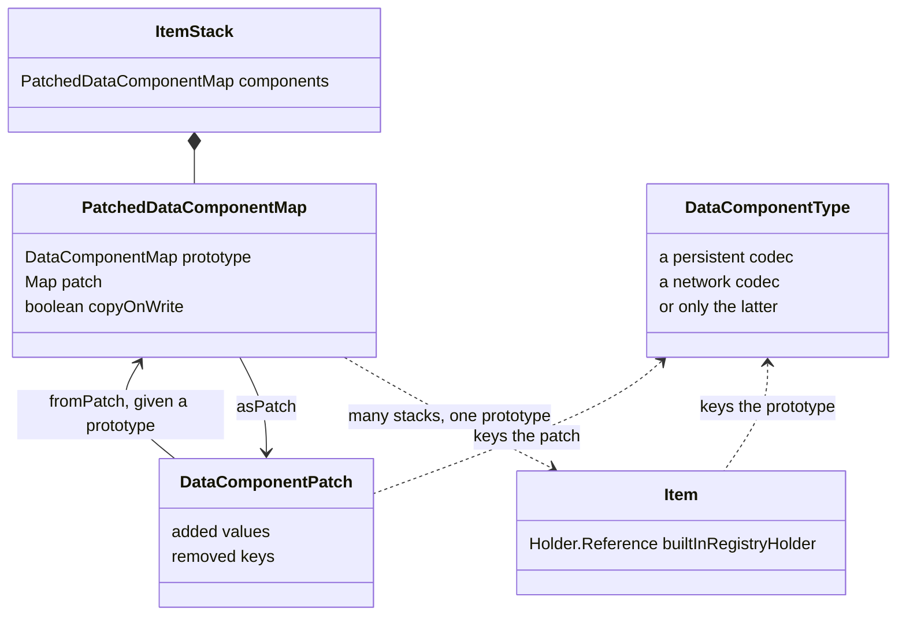
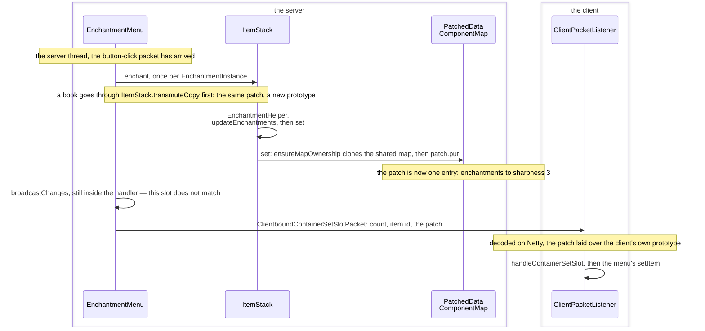

# Data components

> Verified against **Minecraft 26.3** · Part II · A player types `/give @s diamond_sword[enchantments={sharpness:3}]`, and later rolls Sharpness onto a plain sword at the enchanting table: what the square brackets are, and how the client finds out.

A player types `/give @s diamond_sword[enchantments={sharpness:3}]`. The
part in square brackets is a **patch**: one keyed, typed value laid over
the sword. A data component is exactly that — one typed, keyed piece of
data attached to an item stack: its damage, its enchantments, its lore, the
food it is, the armour slot it goes in. The item *type* supplies a
**prototype** map of components; a stack carries only a patch against that
prototype. Everything that used to be "the NBT on an item" is a component
with a codec, and most of what used to be a subclass of `Item` carrying
behaviour (a sword, a piece of armour) is now a kit of components on a
plain `Item`. The surprise is where the prototype comes from. It is not
built in the item's constructor: `Item.Properties` only *records* an
initializer, and the map is built again on every reload with the world's
registries in hand — `DataComponentInitializers.build` on the reload
worker, `Holder.Reference.bindComponents` on the owning thread. That is
why a data pack can change what a jukebox plays without touching the item,
and why a stack cannot even be decoded before the first reload:
`Item.CODEC_WITH_BOUND_COMPONENTS` guards on `Holder.areComponentsBound`.

## The cast

| class | what it decides | thread |
|---|---|---|
| `DataComponentType` | the key: which codec writes the value to disk, which to the wire, and whether it is saved at all | static, registered at bootstrap |
| `DataComponentMap` | the map interface; a prototype is an immutable, identity-keyed one | any; a prototype is never mutated |
| `PatchedDataComponentMap` | what an `ItemStack` owns: a shared prototype, a patch, and whether the patch is still someone else's | whichever thread owns the stack |
| `DataComponentPatch` | the serialisable form of the patch: additions and removals | Netty for packets; server and workers for saves |
| `DataComponentInitializers` | builds every registry element's prototype, from the recorded initializers, once the registries exist | the reload worker on the server; the Render thread on the client |
| `Holder.Reference` | holds the bound prototype for one registry element, and throws until it has one | bound by the thread driving a world load, and by the server thread on `/reload`; on the client at the end of configuration |
| `ItemStack` | the writes (`ItemStack.set`, `ItemStack.update`, `ItemStack.remove`, `ItemStack.copyFrom`) and the reads it inherits from `DataComponentHolder` | whichever thread owns the stack |
| `DataComponentLookup` | the reverse index: which elements of a registry carry this component value | built at freeze, populated lazily |

Everything here ships in both jars; in the trace below only
`ClientPacketListener` and `RegistryDataCollector` are client-only.

## The shape of a stack

```mermaid
classDiagram
    class Item {
        Holder.Reference builtInRegistryHolder
    }
    class ItemStack {
        PatchedDataComponentMap components
    }
    class PatchedDataComponentMap {
        DataComponentMap prototype
        Map patch
        boolean copyOnWrite
    }
    class DataComponentPatch {
        added values
        removed keys
    }
    class DataComponentType {
        a persistent codec
        a network codec
        or only the latter
    }
    ItemStack *-- PatchedDataComponentMap
    PatchedDataComponentMap ..> Item : many stacks, one prototype
    PatchedDataComponentMap --> DataComponentPatch : asPatch
    DataComponentPatch --> PatchedDataComponentMap : fromPatch, given a prototype
    DataComponentType <.. Item : keys the prototype
    DataComponentType <.. DataComponentPatch : keys the patch
```

*What a stack holds and what it only points at: a stack owns its
`PatchedDataComponentMap` and that map owns the patch, while the dotted line to
`Item` points at a prototype every diamond sword made between two reloads
shares and none can write. `DataComponentPatch` is the form that leaves, on
disk and on the wire, and `PatchedDataComponentMap.fromPatch` is how it comes
back.*

The item's prototype is built by `DataComponentInitializers` and bound onto
the item's `Holder.Reference`, which
[a section below](#the-prototype-and-why-it-is-built-at-reload) is about. A
stack points at that shared prototype and owns only a patch over it, in which
a removal is a marker value, `Removed.INSTANCE`. The patch's
serialisable twin is a `DataComponentPatch`, and the key of every entry in
all of them is a `DataComponentType`. The rest of the page is a tour of
those objects, each grounded in one small trace: Sharpness III arriving on
a sword at the enchanting table.

## The key: `DataComponentType`

A type is built by `DataComponentType.Builder`. `DataComponentType.Builder.persistent`
gives the disk and JSON codec; `DataComponentType.Builder.networkSynchronized`
a hand-written wire codec. A type with no persistent codec is **transient**
(`DataComponentType.isTransient`): never saved, only sent.
`DataComponentType.Builder.networkSynchronized` is not a gate — without it,
`DataComponentType.Builder.build` derives a wire codec from the persistent
codec (NBT over the wire), and with neither it throws. The only real switch
is transient-versus-persistent, and it gates *saving*. Three types exist
only on the wire: `DataComponents.CREATIVE_SLOT_LOCK`,
`DataComponents.ADDITIONAL_TRADE_COST`, `DataComponents.MAP_POST_PROCESSING`.

**122 vanilla types** are registered in `DataComponents` into
`BuiltInRegistries.DATA_COMPONENT_TYPE`; 30 of them have slash-shaped ids
(*villager/variant* and its siblings). The catalogue is
[reference/components](../../reference/components.md). Component *types*
are code, in a registry data packs cannot extend; what data packs reach is
the prototype (below) and `CustomData`, which carries arbitrary NBT for
them to use.

Two more flags live on the builder. `DataComponentType.Builder.cacheEncoding`
routes a type's `Codec` encodes — disk and JSON, not the wire — through `EncoderCache` (`DataComponents.ENCODER_CACHE`).
`DataComponentType.Builder.ignoreSwapAnimation` is set on exactly one type,
`DataComponents.DAMAGE`, and the first-person hand that reads it belongs to
[items and stacks](../items/items-and-stacks.md#when-two-stacks-are-the-same-stack). Underneath, `DataComponentType.PERSISTENT_CODEC`
and `DataComponentType.VALUE_MAP_CODEC` are the shared dispatch machinery
that `DataComponentMap.CODEC` and the exact predicate are built on.

## The maps

A prototype `DataComponentMap` is immutable and identity-keyed;
`DataComponentMap.Builder` builds one and can carry a `DataComponentMap.Builder.addValidator`, which is
where the prototype-time structural rule lives (below). `DataComponentMap.EMPTY`
is the map every registry element gets when nothing declared one.
`DataComponentMap.composite` is dead API: it exists, and nothing in 26.3
calls it; the layering that actually happens is `PatchedDataComponentMap`'s
prototype-plus-patch.

`PatchedDataComponentMap` is the map an `ItemStack` owns: a
`PatchedDataComponentMap.prototype` shared with every stack of that item made
since the last reload, a `PatchedDataComponentMap.patch` in which the marker
`Removed.INSTANCE` means *removed from the prototype*, and a
`PatchedDataComponentMap.copyOnWrite` flag. It sanitises on every write: `PatchedDataComponentMap.set` stores
nothing when the value equals the prototype's, and
`PatchedDataComponentMap.remove` stores a removal marker only if the
prototype had the key. In the trace, the sword's prototype carries an
*empty* `ItemEnchantments` (every item's does, through
`DataComponents.COMMON_ITEM_COMPONENTS`), so Sharpness III differs from the
prototype and the patch gains one entry. Set the enchantments back to empty
and the entry vanishes rather than becoming an explicit default.

**The first write pays for the copy.** `PatchedDataComponentMap.ensureMapOwnership`
clones the backing map only when `PatchedDataComponentMap.copyOnWrite` is
set; `ItemStack.copy`, `PatchedDataComponentMap.asPatch` and
`ItemStack.transmuteCopy` can all alias the same map and set the flag, so
copying a stack is O(1) until someone writes. `ItemStack.applyComponentsAndValidate`
relies on that: it snapshots with `PatchedDataComponentMap.asPatch`,
applies, runs `ItemStack.validateStrict`, and on failure
`PatchedDataComponentMap.restorePatch`.

**Equality is prototype plus patch.** `ItemStack.isSameItemSameComponents`
bottoms out in `PatchedDataComponentMap.equals`. Because setting a value
equal to the prototype default *removes* it from the patch, two stacks that
reached the default by different routes compare equal.

## The patch, on the wire and on disk

`DataComponentPatch` is the serialisable form: additions and removals.
`DataComponentPatch.CODEC` writes removals as `!minecraft:foo`;
`DataComponentPatch.STREAM_CODEC` writes two counts then the entries;
`DataComponentPatch.DELIMITED_STREAM_CODEC` is the length-prefixed variant
for untrusted input; and `DataComponentPatch.split` is the added/removed
decomposition that the hashing and block-entity paths are both built on.
`TypedDataComponent` — a type with its value — has its own "type id then
value" stream codec, distinct from the patch encoding, for the places one
value travels alone.

**The wire patch never contains defaults — for a real stack.** Because
`PatchedDataComponentMap` sanitises on every write, a value equal to the
prototype's is dropped rather than sent. `ItemStackTemplate` is the
exception, and [items and
stacks](../items/items-and-stacks.md#an-item-a-count-some-components--said-three-ways)
says why.

On the network the patch travels inside every `ItemStack` in
`ClientboundContainerSetSlotPacket`, `ClientboundContainerSetContentPacket`,
`ClientboundSetCursorItemPacket`, `ClientboundSetPlayerInventoryPacket` and
`ClientboundSetEquipmentPacket`; the client answers ordinary clicks with
hashes, not stacks, and the creative slot alone sends a full, re-validated
stack — [codecs, NBT and JSON](codecs-nbt-json.md#the-four-paths-side-by-side) owns the four
serialisations of a stack, and [containers and menus](../items/containers-and-menus.md)
owns what the server does with a hash. On disk an item is saved as a
*patch* (`ItemStack.MAP_CODEC`'s "components", with transient types
silently dropped), but a block entity as a full `DataComponentMap` — the
two are not symmetric.

## The prototype, and why it is built at reload

A prototype is *recorded* once and *built* many times, and the two happen
far apart in the program's life. The recording is at class-init, long
before a world exists.
`Bootstrap.bootStrap` has loaded the `Items` class before
`BuiltInRegistries.bootStrap` runs — the dispenser and cauldron bootstraps
name items — and its static initialisers each build an `Item`, so every item
in the game exists, and no item has components. An `Item` constructor registers
its initializer in `BuiltInRegistries.DATA_COMPONENT_INITIALIZERS` and nothing
more. `Item.Properties.component`
and its convenience methods (`Item.Properties.durability`,
`Item.Properties.food`, `Item.Properties.equippable`, `Item.Properties.sword`,
…) only *record* a `DataComponentInitializers.Initializer`; nothing is a
map yet. `Item.Properties.delayedComponent` and
`Item.Properties.delayedHolderComponent` are the reason it must be
deferred: they name registry entries that do not exist until a world's
registries do — an item's `DataComponents.JUKEBOX_PLAYABLE` or
`DataComponents.DAMAGE_RESISTANT` names an entry a data pack can change.

They are also **rare**. Between them the two methods have twenty-six call
sites in the entire game, all inside `Item` and `Items`: fire resistance
resolving `DamageTypeTags.IS_FIRE`, the banner patterns, the goat horn, the
jukebox songs, the egg variants, the spear's damage type, the axe, shovel and
hoe's block transformers, the pottery sherds, the trim materials and a handful
more. Everything else is baked
literal. `Item.Properties.repairable` is the near miss that shows where the
line runs — it takes a tag, which sounds like context, and is still eager,
because it asks `BuiltInRegistries.acquireBootstrapRegistrationLookup` at
class-init and stores an unresolved `HolderSet` instead of waiting for one.
So the deferral exists for twenty-six call sites, and everything else is
deferred along with them because the map is built in one pass.

The maps are *built* with full registry context — tags, damage types,
jukebox songs resolvable — by `DataComponentInitializers.build`, reached from
`ReloadableServerResources.loadResources` on the reload worker on the server, and *installed* with
`Holder.Reference.bindComponents` on the owning thread: on the server in
`ReloadableServerResources.updateComponentsAndStaticRegistryTags` (by the
thread driving a world load, and by the server thread on `/reload`), on the
client in
`RegistryDataCollector` at the end of configuration. A `/reload` therefore
rebinds every item's prototype. Every registry element gets a component
map (`DataComponentMap.EMPTY` if it had no initializer), so `EntityType`
holders have one too — with one asymmetry, and it runs the way round you
would not guess. `ClientConfigurationPacketListenerImpl` passes
`Connection.isMemoryConnection` into `RegistryDataCollector.collectGameRegistries`,
which negates it, so a **singleplayer** client binds only the registries
`RegistrySynchronization.isNetworkable` accepts and a **multiplayer** client
binds every one. Singleplayer can skip the rest because it shares
`BuiltInRegistries` with the integrated server, whose own apply has already
bound them.

Before binding, reading a registry element's components throws, and the
failure is a null-check, not a friendly error: `Item.components` merely
delegates, the throw comes from `Holder.Reference.components`, and the
non-throwing question is `Holder.areComponentsBound`.
`Item.CODEC_WITH_BOUND_COMPONENTS` guards on it and refuses to decode a
stack until then.

**Eleven entries** in `DataComponents.COMMON_ITEM_COMPONENTS` make the map
every item's prototype starts from. Notably it puts an *empty* `ItemEnchantments`
on every item, which is what `ItemStack.isEnchantable` depends on: it gates
first on `DataComponents.ENCHANTABLE` being present, and *then* on
`DataComponents.ENCHANTMENTS` being present and empty.

**A prototype can carry a validator.** `DataComponentMap.Builder.addValidator`
is where a structural rule is installed, and `Item.Properties` installs one:
an item may not be both damageable and stackable. The stack-time twin of that
rule, and the rest of what `ItemStack.validateStrict` refuses, belongs to
[items and stacks](../items/items-and-stacks.md#two-validators-one-rule-two-spellings).

## The reverse index: `DataComponentLookup`

Every frozen `MappedRegistry` builds one (`Registry.componentLookup`): a
lazily-populated reverse index answering "which elements carry this
component value?", which is how the game finds the spawn egg for an entity
type or the item for a dye colour. It scans the bound prototypes the holders
carry the first time a component type is asked for and keeps what it found,
so before the first reload it throws, and a `/reload` that changes a
prototype leaves its old answer in place.

## The readers and the predicates

`DataComponentGetter` reads one component; `DataComponentHolder` reads one
and has a map, and is implemented only by `ItemStack`, which is where
`DataComponentHolder.get`, `DataComponentHolder.getOrDefault` and
`DataComponentHolder.has` come from. `ItemInstance` is the read-only face
over `ItemStack` and `ItemStackTemplate` that predicates take
([items and
stacks](../items/items-and-stacks.md#an-item-a-count-some-components--said-three-ways)). Beyond item behaviour, the callers are
loot functions (`CopyComponentsFunction`) and the `/give`, `/item` and
`/loot` commands — which is where the square brackets this page opened on are
finally turned into a patch: `ItemParser` reads the text component by
component through each `DataComponentType`'s own codec
([codecs, NBT and JSON](codecs-nbt-json.md#text-square-brackets-into-a-tag)),
and what it produces is the same `DataComponentPatch` the wire and the disk
carry.

The predicates come in two strengths. `DataComponentExactPredicate` requires
every listed component to equal. The partial `DataComponentPredicate`
family under `core/component/predicates` — `DataComponentPredicates`, **15**
kinds, in their own `BuiltInRegistries.DATA_COMPONENT_PREDICATE_TYPE`
registry — matches a shape rather than a value, and `DataComponentMatchers`
joins the two for `ItemPredicate`.

## The values, by package

| package | value types |
|---|---|
| `world/item/component` | `Consumable`, `Tool`, `Weapon`, `BlocksAttacks`, `ItemLore`, `CustomData`, `TooltipDisplay`, `ItemContainerContents`, `BundleContents`, `TypedEntityData` … |
| `world/item/equipment` | `Equippable` |
| `world/item/enchantment` | `ItemEnchantments`, `Enchantable`, `Repairable` |

Most combat has left the `Item` subclasses. `Weapon`, `BlocksAttacks`,
`KineticWeapon`, `PiercingWeapon`, `AttackRange`, `SwingAnimation` and
`Tool` are components; `Item.Properties.sword`, `Item.Properties.spear` and
`Item.Properties.humanoidArmor` build whole kits, and *SwordItem* is gone;
`MaceItem`, `BowItem`, `CrossbowItem` and `TridentItem` are among the few that
still carry their own.
The tools that act *on a block* went the same way: stripping, path-making
and tilling are `DataComponents.BLOCK_TRANSFORMER`, which
`Item.Properties.axe`, `Item.Properties.shovel` and `Item.Properties.hoe`
point at `BlockTransformers.AXE`, `BlockTransformers.SHOVEL` and
`BlockTransformers.HOE`, and which `Item.useOn` runs for an item that
carries it.

## Sharpness onto a sword, and how the client is told

```mermaid
sequenceDiagram
    box transparent the server
    participant EM as EnchantmentMenu
    participant IStack as ItemStack
    participant PDM as PatchedData<br/>ComponentMap
    end
    box transparent the client
    participant CPL as ClientPacketListener
    end

    Note over EM: the server thread, the button-click packet has arrived
    EM->>IStack: enchant, once per EnchantmentInstance
    Note over EM,IStack: a book goes through ItemStack.transmuteCopy first: the same patch, a new prototype
    IStack->>IStack: EnchantmentHelper.<br/>updateEnchantments, then set
    IStack->>PDM: set: ensureMapOwnership clones the shared map, then patch.put
    Note over PDM: the patch is now one entry: enchantments to sharpness 3
    EM->>EM: broadcastChanges, still inside the handler — this slot does not match
    EM->>CPL: ClientboundContainerSetSlotPacket: count, item id, the patch
    Note over CPL: decoded on Netty, the patch laid over the client's own prototype
    CPL->>CPL: handleContainerSetSlot, then the menu's setItem
```

*One write on the server and one slot packet for the sword, and what crosses
is the diff alone. The client never receives the prototype: it rebuilds the
stack by laying the patch over the copy it already has, which is why a
component the server never changed costs nothing to send.*

**The menu owns the mutation.** `EnchantmentMenu.clickMenuButton` runs
under `ContainerLevelAccess.execute` on the server thread and calls
`ItemStack.enchant` once per chosen `EnchantmentInstance`. (A book takes one
step more first: `ItemStack.transmuteCopy` builds a new stack carrying the
*same patch* over the enchanted book's prototype.) `ItemStack.enchant` hands the edit to
`EnchantmentHelper.updateEnchantments`, which reads the current
`ItemEnchantments`, edits a mutable copy and writes the immutable result
back with `ItemStack.set` — under `DataComponents.STORED_ENCHANTMENTS` for
an `Items.ENCHANTED_BOOK` and `DataComponents.ENCHANTMENTS` for everything
else, which is the one place the book branch reaches past the transmute; the enchanting rules, the lapis, the seed and
`/enchant` are [Part VII's](../items/enchanting.md). What matters here is
that enchantments are a value, not a list on the stack: one component, one
write.

**One write, one patch entry.** `ItemStack.set` is `PatchedDataComponentMap.set`.
The map the sword owned was shared with whatever it was copied from, so
`PatchedDataComponentMap.ensureMapOwnership` clones it now; the new
`ItemEnchantments` differs from the prototype's empty one, so the patch
gains its single entry. A book that was transmuted a moment earlier carries
the same patch over a different prototype, which is the whole meaning of
`ItemStack.transmuteCopy`.

**The menu compares, and here it does not wait for the tick.** A menu-button
click, like an ordinary click, is answered inside the handler that accepted
it ([containers and
menus](../items/containers-and-menus.md#where-in-the-tick-a-broadcast-happens)),
so the correction leaves at once. The
sword's slot no longer matches what the client was last told, so
`ClientboundContainerSetSlotPacket` goes out, and only the patch crosses: `ItemStack.OPTIONAL_STREAM_CODEC` writes the count,
`Item.STREAM_CODEC` (a registry id) and the patch. The client answers later
clicks with a `HashedStack` of CRC32C checksums rather than stacks
([codecs, NBT and JSON](codecs-nbt-json.md#checksum-a-hash-instead-of-a-stack) for the hashing,
[containers and menus](../items/containers-and-menus.md) for the click
protocol).

**The client rebuilds against its own prototype.** The decoder constructs
`ItemStack` from holder, count and patch, and that constructor is
`PatchedDataComponentMap.fromPatch` against the client's *own* bound
prototype — the map `RegistryDataCollector` bound at the end of
configuration, or in singleplayer the server's own. That is the reason components must be bound on the client
before the play phase: an unbound prototype would throw in a packet decoder
on a Netty thread. `ClientPacketListener.handleContainerSetSlot` then hands
the stack to `AbstractContainerMenu.setItem`, and the Sharpness line in the
tooltip, when the sword is hovered, is `ItemEnchantments.addToTooltip` reading
the same component.

## Components on things that are not items

**Block entities, both directions.** Placing runs
`BlockEntity.applyComponentsFromItemStack`, which hands subclasses a
*recording* `DataComponentGetter`: whatever `BlockEntity.applyImplicitComponents`
reads is forgotten from the patch (`DataComponentPatch.forget`) and only the
leftovers persist as opaque `BlockEntity.components`. Two types are
pre-seeded into that forget set regardless of whether anything reads them
— `DataComponents.BLOCK_ENTITY_DATA` and `DataComponents.BLOCK_STATE` — and
only the *added* half of the resulting patch is kept, so removals are
discarded. Breaking or picking runs the reverse,
`BlockEntity.collectComponents` over `BlockEntity.collectImplicitComponents`,
with `BlockEntity.removeComponentsFromTag` de-duplicating what was
promoted; `BlockItem.setBlockEntityData` is the write path for the opaque
blob.

**Entities, a view with a narrow write path.** `Entity` implements `DataComponentGetter` with no
patch of its own: `Entity.get` answers `DataComponents.CUSTOM_NAME` and
`DataComponents.CUSTOM_DATA` by hand, lets subclass overrides (`Sheep`,
`Wolf`, `Villager` …) answer the variant-shaped types, and otherwise falls
through to its `EntityType` holder's bound prototype — the same map every
registry element gets. `Entity.applyComponentsFromItemStack` is the write
path, and it is not only spawn eggs: any item-to-entity spawn, an arrow
picking up its stack and a lingering potion's cloud all take it.

## Where to look

`DataComponentType` · `DataComponents` · `DataComponentMap` ·
`PatchedDataComponentMap` · `DataComponentPatch` · `DataComponentInitializers` ·
`Holder.Reference` · `DataComponentLookup` · `Item.Properties` · `ItemStack` ·
`ItemInstance` · `ItemStackTemplate` · `EnchantmentMenu` ·
`AbstractContainerMenu` · `BlockEntity` · `Entity` (the getter half)

---

*Rules: names, never code · how the system works, not how the code reads ·
newest version only · every backticked name passes `tools/verify_names.py`.*
