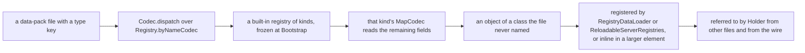
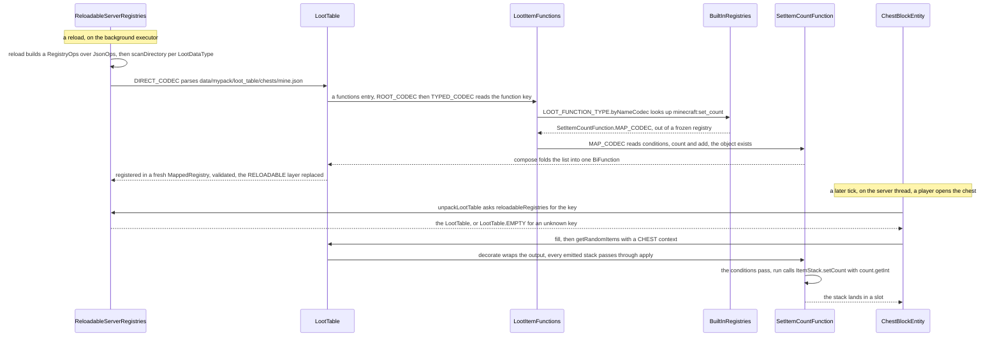

# The data-driven type pattern

> Verified against **Minecraft 26.2** · Part II · A data pack's loot table says *"function": "minecraft:set_count"*, and the game turns that string into an object it never named in code.

A data-pack author writes a chest loot table, gives one entry a function
whose *function* field says *minecraft:set_count* and whose *count* is a
range, and drops the file into *data/mypack/loot_table/chests/*. Nothing in
the pack says `SetItemCountFunction`. Nothing in the jar says
*mypack*. When the server reloads, `ReloadableServerRegistries.reload`
scans the directory, hands the file to `LootTable.DIRECT_CODEC`, and
somewhere inside that codec the string *minecraft:set_count* is looked up
in `BuiltInRegistries.LOOT_FUNCTION_TYPE` — a registry that was filled by a
static initialiser and frozen before any world existed — and the
`MapCodec` it finds there reads the rest of the object. The result is a
`SetItemCountFunction`, and the first time a player opens that chest,
`SetItemCountFunction.run` calls `ItemStack.setCount` on every stack the
pool emits. The same move is made in fifty-six places. That is why *type*
is the most important key in a data pack: **every file that has one is a
lookup in a registry data packs cannot add to**, so a pack can compose the
game's behaviours endlessly and never add a new one.

## The cast

| class | what it decides | thread |
|---|---|---|
| `MapCodec` (DataFixerUpper) | how to read one kind's fields out of a JSON object that also carries a type key; the registry element in the bare spelling | — |
| `Registry` | `Registry.byNameCodec`: a string to an element, with the error *Unknown registry key* and the element's registration lifecycle attached | — |
| `BuiltInRegistries` | the registries of kinds — filled at `BuiltInRegistries.bootStrap`, frozen, identical on client and server | main thread, at `Bootstrap` |
| `ReloadableServerRegistries` | the three loot registries (`LootDataType.TABLE`, `LootDataType.MODIFIER`, `LootDataType.PREDICATE`) rebuilt on every reload | the background executor |
| `RegistryOps` | the ops that let a codec resolve a `Holder` to another data-pack element while it decodes | wherever the codec runs |
| `LootItemFunctions` | `LootItemFunctions.TYPED_CODEC`, the dispatch codec for one instance of the pattern; `LootItemFunctions.compose`, the list of functions folded into one | — |
| `SetItemCountFunction` | the kind traced below: conditions, a `NumberProvider`, an *add* flag | Server, when the loot rolls |
| `Holder` | how everything else refers to the loaded element — by key, bound later | — |

## The idea, stated once

A codec built by `Codec.dispatch` reads one field of a JSON object — *type*
unless the caller names another — decodes it with a codec for the *kind*,
and asks that kind for a `MapCodec` to read the remaining fields. The class
that does it is DataFixerUpper's `KeyDispatchCodec`, which is why the
`MapCodec` a kind supplies is a *map* codec: it reads a set of fields from
the same object the type key came from, so the file looks flat. When the
kind codec is `Registry.byNameCodec` over a registry in `BuiltInRegistries`,
the set of kinds is whatever the jar registered at `Bootstrap`, and a pack
can reach every one of them by name and none it did not ship. The element
that comes out is then either **registered** — a `RegistryDataLoader`
registry such as `Registries.STRUCTURE`, or one of the three
`ReloadableServerRegistries` registries — or **inline**, a value inside a
larger element that has no id of its own, such as the `PlacementModifier`
list in a `PlacedFeature`. A registered element is referred to everywhere
else by `Holder`: a `RegistryFileCodec` reads either an id or the inline
object, and the identifiers page explains how the reference is handed out
before the entry exists ([identifiers and registries](identifiers-and-registries.md)).

The pattern has two spellings, and they differ only in what the registry
holds. In the **bare** spelling the element *is* the `MapCodec`:
`BuiltInRegistries.LOOT_FUNCTION_TYPE` is a `Registry` of
`MapCodec`, `LootItemFunctions.bootstrap` registers
`SetItemCountFunction.MAP_CODEC` under *set_count*, and
`LootItemFunction.codec` is how a live object names its own kind for
encoding. In the **type-object** spelling the element is a small interface
or record that wraps the codec: `PlacementModifierType` is an interface
with one method, `PlacementModifierType.codec`, its constants such as
`PlacementModifierType.COUNT` are registered into
`BuiltInRegistries.PLACEMENT_MODIFIER_TYPE`, and `PlacementModifier.CODEC`
dispatches on `PlacementModifier.type`. The type object exists so that a
kind can carry something beside its codec — `RecipeSerializer`,
`ConsumeEffect.Type` and `RecipeDisplay.Type` are records of a `MapCodec`
and a `StreamCodec`, one for the file and one for the wire. There is a
**third** spelling with two members, in which the type object is the
behaviour itself: a `Feature` is registered into
`BuiltInRegistries.FEATURE`, `Feature.place` is what it does, and what the
file supplies is only a *config* — `Feature.configuredCodec` wraps the
feature's configuration codec under that key, and
`ConfiguredFeature.DIRECT_CODEC` dispatches to it. `WorldCarver` and
`ConfiguredWorldCarver.DIRECT_CODEC` are the same shape.

Four of the instances accept a bare value in place of the object:
`IntProviders.CODEC` and `NumberProviders.CODEC` read a plain number as a
constant, `DensityFunctions.DIRECT_CODEC` reads a plain number as
`DensityFunctions.Constant`, and a height provider reads a bare anchor.
And two of the loot instances accept a bare **list**:
`LootItemFunctions.ROOT_CODEC` tries `LootItemFunctions.TYPED_CODEC` and
falls back to `SequenceFunction.INLINE_CODEC`, so a JSON array where one
function was expected is a sequence of them.

> **For a 1.21-era reader.** The loot package has no type-object class any
> more: there is no *LootItemFunctionType* record wrapping a `MapCodec`,
> and `BuiltInRegistries.LOOT_FUNCTION_TYPE`,
> `BuiltInRegistries.LOOT_CONDITION_TYPE` and the provider registries hold
> the `MapCodec` itself. The worldgen registries
> kept their type objects. Both spellings dispatch identically.

## Fifty-six of them

**Fifty-six** — registries in `BuiltInRegistries` that some codec in the
decompile dispatches on through `Registry.byNameCodec`, counted at the
dispatch sites: thirty-one bare, twenty-three type-object, two where the
type is the behaviour. The dispatch key is *type* unless the row says
otherwise.

### The bare spelling: the registry holds a `MapCodec`

| registry | element | key | where the elements live | taught in |
|---|---|---|---|---|
| `BuiltInRegistries.LOOT_POOL_ENTRY_TYPE` | `LootPoolEntryContainer` | | inline in loot tables | [loot tables](../items/loot-tables.md) |
| `BuiltInRegistries.LOOT_FUNCTION_TYPE` | `LootItemFunction` | *function* | `Registries.ITEM_MODIFIER` (reloadable), and inline in tables, pools and entries | [loot tables](../items/loot-tables.md) |
| `BuiltInRegistries.LOOT_CONDITION_TYPE` | `LootItemCondition` | *condition* | `Registries.PREDICATE` (reloadable), and inline | [loot tables](../items/loot-tables.md) |
| `BuiltInRegistries.LOOT_NUMBER_PROVIDER_TYPE` | `NumberProvider` | | inline; a bare number is a constant | [loot tables](../items/loot-tables.md) |
| `BuiltInRegistries.LOOT_NBT_PROVIDER_TYPE` | `NbtProvider` | | inline in loot functions | [loot tables](../items/loot-tables.md) |
| `BuiltInRegistries.LOOT_SCORE_PROVIDER_TYPE` | `ScoreboardNameProvider` | | inline in loot conditions | [loot tables](../items/loot-tables.md) |
| `BuiltInRegistries.SLOT_SOURCE_TYPE` | `SlotSource` | | inline in `SlotLoot` entries and container-modifying functions | [loot tables](../items/loot-tables.md) |
| `BuiltInRegistries.INT_PROVIDER_TYPE` | `IntProvider` | | inline in feature configs and elsewhere; a bare integer is a constant | [features and placement](../worldgen/features-and-placement.md) |
| `BuiltInRegistries.FLOAT_PROVIDER_TYPE` | `FloatProvider` | | inline; a bare float is a constant | [features and placement](../worldgen/features-and-placement.md) |
| `BuiltInRegistries.DENSITY_FUNCTION_TYPE` | `DensityFunction` | | `Registries.DENSITY_FUNCTION`, and inline; a bare number is a constant | [density functions](../worldgen/density-functions.md) |
| `BuiltInRegistries.MATERIAL_CONDITION` | `SurfaceRules.ConditionSource` | | inline in `Registries.NOISE_SETTINGS` | [terrain](../worldgen/terrain.md) |
| `BuiltInRegistries.MATERIAL_RULE` | `SurfaceRules.RuleSource` | | inline in `Registries.NOISE_SETTINGS` | [terrain](../worldgen/terrain.md) |
| `BuiltInRegistries.BIOME_SOURCE` | `BiomeSource` | | inline in `Registries.LEVEL_STEM` | [biomes](../worldgen/biomes.md) |
| `BuiltInRegistries.CHUNK_GENERATOR` | `ChunkGenerator` | | inline in `Registries.LEVEL_STEM` | [terrain](../worldgen/terrain.md) |
| `BuiltInRegistries.STRUCTURE_PROCESSOR` | `StructureProcessor` | *processor_type* | `Registries.PROCESSOR_LIST` | [jigsaw and templates](../worldgen/jigsaw-and-templates.md) |
| `BuiltInRegistries.POOL_ALIAS_BINDING_TYPE` | `PoolAliasBinding` | | inline in jigsaw structures | [jigsaw and templates](../worldgen/jigsaw-and-templates.md) |
| `BuiltInRegistries.ENCHANTMENT_LEVEL_BASED_VALUE_TYPE` | `LevelBasedValue` | | inline in `Registries.ENCHANTMENT` | [enchantments](../items/enchantments.md) |
| `BuiltInRegistries.ENCHANTMENT_ENTITY_EFFECT_TYPE` | `EnchantmentEntityEffect` | | inline in `Registries.ENCHANTMENT` | [enchantments](../items/enchantments.md) |
| `BuiltInRegistries.ENCHANTMENT_LOCATION_BASED_EFFECT_TYPE` | `EnchantmentLocationBasedEffect` | | inline in `Registries.ENCHANTMENT` | [enchantments](../items/enchantments.md) |
| `BuiltInRegistries.ENCHANTMENT_VALUE_EFFECT_TYPE` | `EnchantmentValueEffect` | | inline in `Registries.ENCHANTMENT` | [enchantments](../items/enchantments.md) |
| `BuiltInRegistries.ENCHANTMENT_PROVIDER_TYPE` | `EnchantmentProvider` | | `Registries.ENCHANTMENT_PROVIDER` | [enchantments](../items/enchantments.md) |
| `BuiltInRegistries.SPAWN_CONDITION_TYPE` | `SpawnCondition` | | inline in entity variants, through `SpawnPrioritySelectors.CODEC` | [entity lifecycle](../entities/entity-lifecycle.md) |
| `BuiltInRegistries.TEST_ENVIRONMENT_DEFINITION_TYPE` | `TestEnvironmentDefinition` | | `Registries.TEST_ENVIRONMENT` | [game tests](../commands/game-tests.md) |
| `BuiltInRegistries.TEST_INSTANCE_TYPE` | `GameTestInstance` | | `Registries.TEST_INSTANCE` | [game tests](../commands/game-tests.md) |
| `BuiltInRegistries.DIALOG_TYPE` | `Dialog` | | `Registries.DIALOG` | [dialogs](../commands/dialogs.md) |
| `BuiltInRegistries.DIALOG_ACTION_TYPE` | `Action` | | inline in dialogs | [dialogs](../commands/dialogs.md) |
| `BuiltInRegistries.DIALOG_BODY_TYPE` | `DialogBody` | | inline in dialogs | [dialogs](../commands/dialogs.md) |
| `BuiltInRegistries.INPUT_CONTROL_TYPE` | `InputControl` | | inline in dialogs, as a `MapCodec` (`Codec.dispatchMap`) | [dialogs](../commands/dialogs.md) |
| `BuiltInRegistries.PERMISSION_TYPE` | `Permission` | | inline in a permission check | [Brigadier and commands](../commands/brigadier-and-commands.md) |
| `BuiltInRegistries.PERMISSION_CHECK_TYPE` | `PermissionCheck` | | only written, by `ArgumentUtils` into the command-tree report | [Brigadier and commands](../commands/brigadier-and-commands.md) |
| `BuiltInRegistries.BLOCK_TYPE` | `Block` | | nothing loads it: every block is Java, and `BlockTypes.CODEC` is read by no one and written only by `BlockListReport` | [blocks and states](../blocks/blocks-and-states.md) |

### The type-object spelling: the registry holds a type that carries a `MapCodec`

| registry | type object | element | key | where the elements live | taught in |
|---|---|---|---|---|---|
| `BuiltInRegistries.PLACEMENT_MODIFIER_TYPE` | `PlacementModifierType` | `PlacementModifier` | | inline in `Registries.PLACED_FEATURE` | [features and placement](../worldgen/features-and-placement.md) |
| `BuiltInRegistries.HEIGHT_PROVIDER_TYPE` | `HeightProviderType` | `HeightProvider` | | inline in placements; a bare anchor is a constant | [features and placement](../worldgen/features-and-placement.md) |
| `BuiltInRegistries.BLOCK_PREDICATE_TYPE` | `BlockPredicateType` | `BlockPredicate` | | inline in features and placements | [features and placement](../worldgen/features-and-placement.md) |
| `BuiltInRegistries.BLOCKSTATE_PROVIDER_TYPE` | `BlockStateProviderType` | `BlockStateProvider` | | inline in feature configs | [features and placement](../worldgen/features-and-placement.md) |
| `BuiltInRegistries.TRUNK_PLACER_TYPE` | `TrunkPlacerType` | `TrunkPlacer` | | inline in tree configs | [trees](../worldgen/trees.md) |
| `BuiltInRegistries.FOLIAGE_PLACER_TYPE` | `FoliagePlacerType` | `FoliagePlacer` | | inline in tree configs | [trees](../worldgen/trees.md) |
| `BuiltInRegistries.ROOT_PLACER_TYPE` | `RootPlacerType` | `RootPlacer` | | inline in tree configs | [trees](../worldgen/trees.md) |
| `BuiltInRegistries.TREE_DECORATOR_TYPE` | `TreeDecoratorType` | `TreeDecorator` | | inline in tree configs | [trees](../worldgen/trees.md) |
| `BuiltInRegistries.FEATURE_SIZE_TYPE` | `FeatureSizeType` | `FeatureSize` | | inline in tree configs | [trees](../worldgen/trees.md) |
| `BuiltInRegistries.STRUCTURE_TYPE` | `StructureType` | `Structure` | | `Registries.STRUCTURE` | [structure placement](../worldgen/structure-placement.md) |
| `BuiltInRegistries.STRUCTURE_PLACEMENT` | `StructurePlacementType` | `StructurePlacement` | | inline in `Registries.STRUCTURE_SET` | [structure placement](../worldgen/structure-placement.md) |
| `BuiltInRegistries.STRUCTURE_POOL_ELEMENT` | `StructurePoolElementType` | `StructurePoolElement` | *element_type* | inline in `Registries.TEMPLATE_POOL` | [jigsaw and templates](../worldgen/jigsaw-and-templates.md) |
| `BuiltInRegistries.RULE_TEST` | `RuleTestType` | `RuleTest` | *predicate_type* | inline in processor lists | [jigsaw and templates](../worldgen/jigsaw-and-templates.md) |
| `BuiltInRegistries.POS_RULE_TEST` | `PosRuleTestType` | `PosRuleTest` | *predicate_type* | inline in processor lists | [jigsaw and templates](../worldgen/jigsaw-and-templates.md) |
| `BuiltInRegistries.RULE_BLOCK_ENTITY_MODIFIER` | `RuleBlockEntityModifierType` | `RuleBlockEntityModifier` | | inline in processor rules | [jigsaw and templates](../worldgen/jigsaw-and-templates.md) |
| `BuiltInRegistries.RECIPE_SERIALIZER` | `RecipeSerializer` | `Recipe` | | the `RecipeMap` that `RecipeManager` builds from *data/&lt;ns&gt;/recipe/* — a reload listener, not a registry | [recipes](../items/recipes.md) |
| `BuiltInRegistries.RECIPE_DISPLAY` | `RecipeDisplay.Type` | `RecipeDisplay` | | inline, mostly on the wire to the recipe book | [recipes](../items/recipes.md) |
| `BuiltInRegistries.SLOT_DISPLAY` | `SlotDisplay.Type` | `SlotDisplay` | | inline in recipe displays | [recipes](../items/recipes.md) |
| `BuiltInRegistries.CONSUME_EFFECT_TYPE` | `ConsumeEffect.Type` | `ConsumeEffect` | | inline in the `Consumable` and `DeathProtection` components | [data components](data-components.md) |
| `BuiltInRegistries.TRIGGER_TYPES` | `CriterionTrigger` | `Criterion` | *trigger*, with the fields under *conditions* (`ExtraCodecs.dispatchOptionalValue`) | advancements, loaded by `ServerAdvancementManager` — a reload listener, not a registry | [advancements](../commands/advancements.md) |
| `BuiltInRegistries.PARTICLE_TYPE` | `ParticleType` | `ParticleOptions` | | inline in biome ambient particles (`AmbientParticle`) and area effect clouds | [particles](../rendering/particles.md) |
| `BuiltInRegistries.NUMBER_FORMAT_TYPE` | `NumberFormatType` | `NumberFormat` | | inline in `Objective` and `Score` — save data and commands, no pack | [scoreboard and data](../commands/scoreboard-and-data.md) |
| `BuiltInRegistries.POSITION_SOURCE_TYPE` | `PositionSourceType` | `PositionSource` | | `VibrationParticleOption`, and one enchantment effect (`SpawnParticlesEffect`) — save data and the wire, no pack | [game events and vibrations](../world/game-events-and-vibrations.md) |

The first nine rows are the sub-objects of a configured or placed feature,
and the trace on [features and placement](../worldgen/features-and-placement.md)
walks a tree through all of them.

### The type is the behaviour: the file supplies only a config

| registry | type object | element | where the elements live | taught in |
|---|---|---|---|---|
| `BuiltInRegistries.FEATURE` | `Feature` | `ConfiguredFeature` | `Registries.CONFIGURED_FEATURE` | [features and placement](../worldgen/features-and-placement.md) |
| `BuiltInRegistries.CARVER` | `WorldCarver` | `ConfiguredWorldCarver` | `Registries.CONFIGURED_CARVER` | [terrain](../worldgen/terrain.md) |

Three of the registered destinations are not in `RegistryDataLoader` at
all. `Registries.LOOT_TABLE`, `Registries.ITEM_MODIFIER` and
`Registries.PREDICATE` are built by `ReloadableServerRegistries`, which
`DatapackStructureReport` calls stable dynamic registries, while
`Registries.RECIPE` and `Registries.ADVANCEMENT` it calls pseudo-registries:
keys exist for them, directories are named after them, and no `Registry`
is ever constructed. The elements that reach the client are the ones in
`RegistryDataLoader.SYNCHRONIZED_REGISTRIES`, re-encoded with the same
direct codec, which is why `BuiltInRegistries` must be identical on both
sides: the client runs the same dispatch on the same kinds
([protocol phases](../networking/protocol-phases.md)).

## One instance traced: *set_count*

**The reload half.** `MinecraftServer.reloadResources` — and `WorldLoader.load`
on first start — calls `ReloadableServerResources.loadResources`, whose first
act is `ReloadableServerRegistries.reload` on the background executor. It
builds a `RegistryOps` over `JsonOps.INSTANCE` from a
`HolderLookup.Provider` that already carries the updated tags, so a loot
condition can name an item tag while it decodes. For each of the three
`LootDataType`s it creates a new `MappedRegistry` and calls
`SimpleJsonResourceReloadListener.scanDirectory`, whose lister is
`FileToIdConverter.registry` over `Registries.elementsDirPath` — the
directory *is* the registry's path, *loot_table* — and which parses every
file with the type's codec. A file that fails to parse is logged and
skipped, and a duplicate id is an error, so one bad table costs one table.

Inside `LootTable.DIRECT_CODEC` the *functions* list is
`LootItemFunctions.ROOT_CODEC`; the entry in question is an object, so
`LootItemFunctions.TYPED_CODEC` runs: `Registry.byNameCodec` on
`BuiltInRegistries.LOOT_FUNCTION_TYPE` reads *minecraft:set_count*,
finds `SetItemCountFunction.MAP_CODEC`, and that codec reads *conditions*
(the `LootItemConditionalFunction.commonFields` every conditional function
shares, itself a list dispatched on `BuiltInRegistries.LOOT_CONDITION_TYPE`),
*count* through `NumberProviders.CODEC` — a third dispatch, on
`BuiltInRegistries.LOOT_NUMBER_PROVIDER_TYPE` — and the optional *add*.
Three built-in registries were consulted to build one function, and the
file named none of them. A misspelt kind fails at the first of them with
an *Unknown registry key* error that names the registry of kinds, and the
whole file is dropped. The `LootTable` constructor then calls
`LootItemFunctions.compose`, which folds each list of functions into a
single function; a list of one is the function itself.

After all three registries are built,
`ReloadableServerRegistries.createUpdatedRegistries` replaces the
`RegistryLayer.RELOADABLE` layer through `LayeredRegistryAccess.replaceFrom`
and `ReloadableServerRegistries.validateLootRegistries` runs
`LootDataType.runValidation` over every element:
`SetItemCountFunction.validate` checks its count provider's references
against the finished lookup. Validation **warns** — problems are logged,
the element stays registered. Every element in these three registries is
`Lifecycle.experimental`.

**The run half.** `RandomizableContainerBlockEntity.getItem` — like the
other container methods on that class — calls
`RandomizableContainer.unpackLootTable`, which asks
`MinecraftServer.reloadableRegistries` for the table by `ResourceKey`; an
unknown key is `LootTable.EMPTY`, never an exception. `LootTable.fill` rolls
`LootTable.getRandomItems` with a `LootContextParamSets.CHEST` context and
`LootTable.shuffleAndSplitItems` spreads the result over the slots. On the
way out, each level wraps the consumer: `LootTable.getRandomItemsRaw`
decorates the output with the table's composite function, `LootPool.addRandomItems`
with the pool's, and `LootPoolSingletonContainer.EntryBase` with the
entry's, each through `LootItemFunction.decorate`. `LootItem.createItemStack`
makes a stack of one, and it passes through
`LootItemConditionalFunction.apply`, which tests the conditions and, if they
pass, calls `SetItemCountFunction.run` — `ItemStack.setCount` with
`NumberProvider.getInt`, added to the current count if *add* was set. The
object the pack described by a string is now a method call on a stack in a
chest.

## What does not follow the pattern

Not every registry in `BuiltInRegistries` whose name ends in *type* is a
registry of kinds, and the ones that are not fall into three groups.

**A key, not a kind.** `BuiltInRegistries.DATA_COMPONENT_TYPE`,
`BuiltInRegistries.ENCHANTMENT_EFFECT_COMPONENT_TYPE`,
`BuiltInRegistries.GAME_RULE`, `BuiltInRegistries.ENVIRONMENT_ATTRIBUTE` and
`BuiltInRegistries.ATTRIBUTE_TYPE` each hold objects that carry a codec for
their *value*, and a file uses them as JSON **keys**: `GameRuleMap.CODEC`
and `DataComponentPredicate.CODEC` are `Codec.dispatchedMap`, a map whose
key codec is `Registry.byNameCodec` and whose value codec depends on the
key. There is no *type* field because the name of the field is the type.
`BuiltInRegistries.ENTITY_SUB_PREDICATE_TYPE` is the same shape and holds a
plain `Codec` rather than a `MapCodec`, and `EntityPredicate` reads it as a
dispatched map too. `BuiltInRegistries.STAT_TYPE` is a key whose value codec
is derived from `StatType.getRegistry` rather than stored, which is what
`PlayerPredicate.StatMatcher` builds on. `BuiltInRegistries.MEMORY_MODULE_TYPE`
is a key in a brain's saved memories, `MemoryMap.CODEC`, the same way.

**A type object with no codec.** `BuiltInRegistries.RECIPE_TYPE` is the
one a modder reaches for and the wrong one: `RecipeType.CRAFTING` groups
recipes for lookup, and the kind a recipe file names — the field
`Recipe.CODEC` dispatches on through `Recipe.getSerializer` — is a
`RecipeSerializer`, in `BuiltInRegistries.RECIPE_SERIALIZER`.
`BuiltInRegistries.STRUCTURE_PIECE` holds `StructurePieceType`, a loader
from NBT with a `StructurePieceSerializationContext`, for the pieces of a
started structure saved in the chunk — save data, not a pack.
`BuiltInRegistries.ENTITY_TYPE`, `BuiltInRegistries.BLOCK_ENTITY_TYPE`,
`BuiltInRegistries.MENU`, `BuiltInRegistries.SENSOR_TYPE` and
`BuiltInRegistries.COMMAND_ARGUMENT_TYPE`
are registries of type objects that no codec dispatches on: they are
looked up by name and construct or describe things in Java.

**A registry of kinds with nothing to load.** `BuiltInRegistries.BLOCK_TYPE`
is a complete instance of the bare spelling — `BlockTypes.CODEC` dispatches
on it through `Block.codec` — that no data pack and no loader ever reads.
Its one caller is the data generator's `BlockListReport`, which encodes
every block with it. It is the pattern applied for the sake of the report.

## Questions players ask

**Can a data pack add a new loot function, placement modifier or dialog
kind?** No. Every kind is an entry in a `BuiltInRegistries` registry, and
those are frozen at `Bootstrap`. A pack composes kinds; only the jar adds
one.

**Why does one typo break the whole file and not the whole pack?**
`SimpleJsonResourceReloadListener.scanDirectory` parses each file on its
own and logs the ones that fail, so a loot table that names
*minecraft:set_cuont* is simply missing, and the chest that names the table
gets `LootTable.EMPTY`. `RegistryDataLoader` is stricter: it collects every
error by key and fails the whole load, which is why a broken biome stops
the world from opening and a broken loot table does not.

**Why is the same kind name accepted in a pool, an entry and a table?**
Because the field is decoded by the same `LootItemFunctions.ROOT_CODEC` in
all three places, and the three composite functions wrap the output
consumer one inside the other. A function on the table runs last.

**Why do worldgen files sometimes take a number where an object was
expected?** `Codec.either` in front of the dispatch: a bare number is a
constant for int, float and number providers and for density functions.

## Where to look

`Codec.dispatch` · `KeyDispatchCodec` · `Registry.byNameCodec` ·
`BuiltInRegistries` · `LootItemFunctions.TYPED_CODEC` ·
`LootItemFunctions.bootstrap` · `SetItemCountFunction.MAP_CODEC` ·
`PlacementModifier.CODEC` · `PlacementModifierType` ·
`ConfiguredFeature.DIRECT_CODEC` · `Feature.configuredCodec` ·
`LootDataType` · `ReloadableServerRegistries.reload` ·
`SimpleJsonResourceReloadListener.scanDirectory` · `RegistryFileCodec` ·
`RegistryDataLoader.WORLDGEN_REGISTRIES` · `LootTable.fill` ·
`LootItemFunction.decorate` · `SetItemCountFunction.run`

---

*Rules: names, never code · how the system works, not how the code reads ·
newest version only · every backticked name passes `tools/verify_names.py`.*
