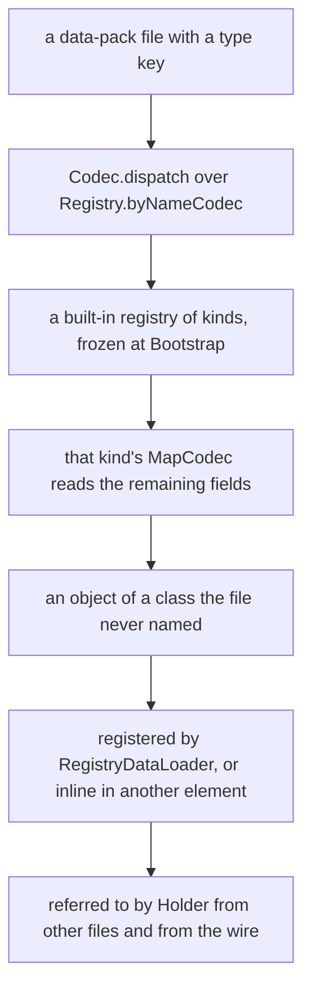
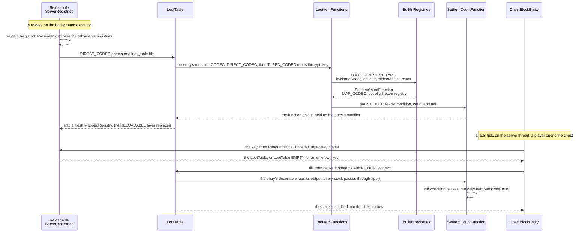

# The data-driven type pattern

> Verified against **Minecraft 26.3** · Part II · A data pack's loot table says *"type": "minecraft:set_count"*, and the game turns that string into an object the file never names.

A data-pack author writes a chest loot table, gives one entry a modifier
whose *type* field says *minecraft:set_count* and whose *count* is a
range, and drops the file into *data/mypack/loot_table/chests/*. Nothing in
the pack says `SetItemCountFunction`. Nothing in the jar says
*mypack*. When the server reloads, `ReloadableServerRegistries.reload`
has `RegistryDataLoader` scan the directory and hand the file to
`LootTable.DIRECT_CODEC`, and
somewhere inside that codec the string *minecraft:set_count* is looked up
in `BuiltInRegistries.LOOT_FUNCTION_TYPE` — a registry that
`BuiltInRegistries.bootStrap` filled and froze before any world existed — and the
`MapCodec` it finds there reads the rest of the object. The result is a
`SetItemCountFunction`, and the first time a player opens that chest,
`SetItemCountFunction.run` calls `ItemStack.setCount` on every stack that
entry emits. That field is spelled *type* here and almost everywhere else the
pattern appears, and the move behind it is the same one: fifty-six registries in
`BuiltInRegistries` are read this way. It is why *type* is the most
important key in a data pack — **every *type* the pattern reads is a lookup
in a registry data packs cannot add to**, so a pack can compose the game's
behaviours endlessly and never add a new one.

## The cast

| class | what it decides | thread |
|---|---|---|
| `MapCodec` (DataFixerUpper) | how to read one kind's fields out of a JSON object that also carries a type key; the registry element in the bare spelling | — |
| `Registry` | `Registry.byNameCodec`: a string to an element, with the error *Unknown registry key* and the element's registration lifecycle attached | — |
| `BuiltInRegistries` | the registries of kinds — filled at `BuiltInRegistries.bootStrap`, frozen, identical on client and server | main thread, at `Bootstrap` |
| `ReloadableServerRegistries` | the eight registries of `RegistryDataLoader.RELOADABLE_REGISTRIES`, loot tables among them, rebuilt on every reload, and the six with a `LootDataType` validated | the background executor |
| `RegistryOps` | the ops that let a codec resolve a `Holder` to another data-pack element while it decodes | wherever the codec runs |
| `LootItemFunctions` | `LootItemFunctions.TYPED_CODEC`, the dispatch codec for one instance of the pattern; `LootItemFunctions.CODEC`, which takes an item modifier's id, one function or a list of them | — |
| `SetItemCountFunction` | the kind traced below: a condition, a `ContextIntProvider`, an *add* flag | Server, when the loot rolls |
| `Holder` | how everything else refers to the loaded element — by key, bound later | — |

## The idea, stated once

A codec built by `Codec.dispatch` reads one field of a JSON object — *type*
unless the caller names another — decodes it with a codec for the *kind*,
and asks that kind for a `MapCodec` to read the remaining fields. The class
that does it is DataFixerUpper's `KeyDispatchCodec` — a `Codec` and a
`DynamicOps` being the two halves of every read in this part
([codecs, NBT and JSON](codecs-nbt-json.md#one-abstraction-and-the-ops-that-are-not-formats)) —
which is why the
`MapCodec` a kind supplies is a *map* codec: it reads a set of fields from
the same object the type key came from, so the file looks flat. When the
kind codec is `Registry.byNameCodec` over a registry in `BuiltInRegistries`,
the set of kinds is whatever the jar registered at `Bootstrap`, and a pack
can reach every one of them by name and none it did not ship. The element
that comes out is then either **registered** — in a `RegistryDataLoader`
registry, read with the world like `Registries.STRUCTURE` or on every
reload like `Registries.LOOT_TABLE` — or **inline**, a value inside a
larger element that has no id of its own, such as the `PlacementModifier`
list in a `PlacedFeature`. A registered element is referred to everywhere
else by `Holder`: a `RegistryFileCodec` reads either an id or the inline
object, and the identifiers page explains how the reference is handed out
before the entry exists ([identifiers and registries](identifiers-and-registries.md)).

```mermaid
flowchart TD
    F["a data-pack file with a type key"] --> D["Codec.dispatch over Registry.byNameCodec"]
    D --> K["a built-in registry of kinds, frozen at Bootstrap"]
    K --> M["that kind's MapCodec reads the remaining fields"]
    M --> O["an object of a class the file never named"]
    O --> R["registered by RegistryDataLoader, or inline in another element"]
    R --> H["referred to by Holder from other files and from the wire"]
```

*The pattern in one line, and the whole of it turns on the third box: the
registry of kinds is built in and frozen, so a pack may write any number of
elements and no number of kinds. Only the first box is data; every box after
it is the jar's code.*

The pattern has two spellings, and they differ only in what the registry
holds. In the **bare** spelling the element *is* the `MapCodec`:
`BuiltInRegistries.LOOT_FUNCTION_TYPE` is a `Registry` of
`MapCodec`, `LootItemFunctions.bootstrap` registers
`SetItemCountFunction.MAP_CODEC` under *set_count*, and
`LootItemFunction.codec` is how a live object names its own kind for
encoding. In the **type-object** spelling the element is a small interface
or record that wraps the codec: `BlockPredicateType` is an interface
with one method, `BlockPredicateType.codec`, its constants such as
`BlockPredicateType.MATCHING_BLOCKS` are registered into
`BuiltInRegistries.BLOCK_PREDICATE_TYPE`, and `BlockPredicate.CODEC`
dispatches on `BlockPredicate.type`. A type object lets a kind carry
something beside its codec — `RecipeSerializer`, `ConsumeEffect.Type` and
`RecipeDisplay.Type` are records of a `MapCodec` and a `StreamCodec`, one for
the file and one for the wire — though most carry the codec alone. `Feature` and
`WorldCarver` take the bare spelling:
`BuiltInRegistries.FEATURE_TYPE` and `BuiltInRegistries.CARVER_TYPE` hold
each kind's `MapCodec`, and the element the file describes carries its own
parameters and does the work itself, in `Feature.place` or
`WorldCarver.carve`.

Eleven of the instances accept a bare value in place of the object, each
through a `Codec.either` in front of the dispatch, or a `Codec.xor` in one
case: `IntProviders.CODEC`, `FloatProviders.CODEC`,
`ContextIntProviders.DIRECT_CODEC`, `ContextFloatProviders.DIRECT_CODEC`
and `LevelBasedValue.CODEC` read a plain number as a constant,
`DensityFunctions.DIRECT_CODEC` reads one as a `ConstantFunction`, a height
provider reads a bare anchor, `BlockStateProvider.DIRECT_CODEC` a bare block
state, `NbtProviders.CODEC` and `ScoreboardNameProviders.CODEC` a bare
string as the context form, and `Permission.CODEC` a bare identifier as a
`Permission.Atom`. Two accept a bare **list**:
`LootItemFunctions.DIRECT_CODEC` tries `LootItemFunctions.TYPED_CODEC` and
falls back to `SequenceFunction.INLINE_CODEC`, so a JSON array where one
function was expected is a sequence of them, and `SlotSources.DIRECT_CODEC`
does the same through `GroupSlotSource.INLINE_CODEC`.

## Fifty-six of them

**Fifty-six registries** in `BuiltInRegistries` hold a kind's codec, or a
type that carries one, for a codec to dispatch to from the **value** of a
field: thirty-six bare and twenty type-object. The dispatch key is *type* unless
the row says otherwise. The criterion is the codec in the registry, not `Registry.byNameCodec`
itself: more registries dispatch through it and are not here.
`BuiltInRegistries.GAME_RULE` spells the registry name as the *key* of a map
rather than the value of a field, and so does `BuiltInRegistries.STAT_TYPE`
in a player's statistics file, though a player predicate dispatches on it by
*type*. `BuiltInRegistries.ENVIRONMENT_ATTRIBUTE` and
`BuiltInRegistries.DATA_COMPONENT_TYPE` are keys nearly everywhere a data
pack meets them, and each also backs a field dispatch or two —
`EnvironmentAttributeCheck.MAP_CODEC` on *attribute*, and two client
item-model properties. All four are among the exceptions below.

### The bare spelling: the registry holds a `MapCodec`

| registry | element | key | where the elements live | taught in |
|---|---|---|---|---|
| `BuiltInRegistries.LOOT_POOL_ENTRY_TYPE` | `LootPoolEntryContainer` | | inline in loot tables | [loot tables](../items/loot-tables.md) |
| `BuiltInRegistries.LOOT_FUNCTION_TYPE` | `LootItemFunction` | | `Registries.ITEM_MODIFIER` (reloadable), and inline in tables, pools and entries | [loot tables](../items/loot-tables.md) |
| `BuiltInRegistries.LOOT_CONDITION_TYPE` | `LootItemCondition` | | `Registries.PREDICATE` (reloadable), and inline | [contexts and predicates](../items/contexts-and-predicates.md) |
| `BuiltInRegistries.CONTEXT_INT_PROVIDER_TYPE` | `ContextIntProvider` | | `Registries.CONTEXT_INT_PROVIDER` (reloadable), and inline; a bare integer is a constant | [contexts and predicates](../items/contexts-and-predicates.md) |
| `BuiltInRegistries.CONTEXT_FLOAT_PROVIDER_TYPE` | `ContextFloatProvider` | | `Registries.CONTEXT_FLOAT_PROVIDER` (reloadable), and inline; a bare number is a constant | [contexts and predicates](../items/contexts-and-predicates.md) |
| `BuiltInRegistries.LOOT_NBT_PROVIDER_TYPE` | `NbtProvider` | | inline in loot functions | [contexts and predicates](../items/contexts-and-predicates.md) |
| `BuiltInRegistries.LOOT_SCORE_PROVIDER_TYPE` | `ScoreboardNameProvider` | | inline in the *score* int provider, `ScoreboardValue` | [contexts and predicates](../items/contexts-and-predicates.md) |
| `BuiltInRegistries.SLOT_SOURCE_TYPE` | `SlotSource` | | `Registries.SLOT_SOURCE` (reloadable), and inline in `SlotLoot` entries | [contexts and predicates](../items/contexts-and-predicates.md) |
| `BuiltInRegistries.INT_PROVIDER_TYPE` | `IntProvider` | | inline in features and elsewhere; a bare integer is a constant | [features and placement](../worldgen/features-and-placement.md) |
| `BuiltInRegistries.FLOAT_PROVIDER_TYPE` | `FloatProvider` | | inline; a bare float is a constant | [features and placement](../worldgen/features-and-placement.md) |
| `BuiltInRegistries.DENSITY_FUNCTION_TYPE` | `DensityFunction` | | `Registries.DENSITY_FUNCTION`, and inline; a bare number is a constant | [density functions](../worldgen/density-functions.md) |
| `BuiltInRegistries.MATERIAL_CONDITION_TYPE` | `MaterialCondition` | | `Registries.MATERIAL_CONDITION`, and inline in material rules | [terrain](../worldgen/terrain.md) |
| `BuiltInRegistries.MATERIAL_RULE_TYPE` | `MaterialRule` | | `Registries.MATERIAL_RULE`, and inline | [terrain](../worldgen/terrain.md) |
| `BuiltInRegistries.BIOME_SOURCE` | `BiomeSource` | | inline in `Registries.LEVEL_STEM` | [biomes](../worldgen/biomes.md) |
| `BuiltInRegistries.CHUNK_GENERATOR` | `ChunkGenerator` | | inline in `Registries.LEVEL_STEM` | [terrain](../worldgen/terrain.md) |
| `BuiltInRegistries.FEATURE_TYPE` | `Feature` | | `Registries.FEATURE`, and inline | [features and placement](../worldgen/features-and-placement.md) |
| `BuiltInRegistries.PLACEMENT_MODIFIER_TYPE` | `PlacementModifier` | | inline in `Registries.PLACED_FEATURE` | [features and placement](../worldgen/features-and-placement.md) |
| `BuiltInRegistries.BLOCK_STATE_PROVIDER_TYPE` | `BlockStateProvider` | | `Registries.BLOCK_STATE_PROVIDER`, and inline in features; a bare block state is a `SimpleStateProvider` | [features and placement](../worldgen/features-and-placement.md) |
| `BuiltInRegistries.CARVER_TYPE` | `WorldCarver` | | `Registries.CARVER` | [terrain](../worldgen/terrain.md) |
| `BuiltInRegistries.STRUCTURE_PLACEMENT` | `StructurePlacement` | | inline in `Registries.STRUCTURE_SET` | [structure placement](../worldgen/structure-placement.md) |
| `BuiltInRegistries.STRUCTURE_PROCESSOR` | `StructureProcessor` | *processor_type* | `Registries.PROCESSOR_LIST` | [jigsaw and templates](../worldgen/jigsaw-and-templates.md) |
| `BuiltInRegistries.POOL_ALIAS_BINDING_TYPE` | `PoolAliasBinding` | | inline in jigsaw structures | [jigsaw and templates](../worldgen/jigsaw-and-templates.md) |
| `BuiltInRegistries.ENCHANTMENT_LEVEL_BASED_VALUE_TYPE` | `LevelBasedValue` | | inline in `Registries.ENCHANTMENT` | [enchantments](../items/enchantments.md) |
| `BuiltInRegistries.ENCHANTMENT_ENTITY_EFFECT_TYPE` | `EnchantmentEntityEffect` | | inline in `Registries.ENCHANTMENT` | [enchantments](../items/enchantments.md) |
| `BuiltInRegistries.ENCHANTMENT_LOCATION_BASED_EFFECT_TYPE` | `EnchantmentLocationBasedEffect` | | inline in `Registries.ENCHANTMENT` | [enchantments](../items/enchantments.md) |
| `BuiltInRegistries.ENCHANTMENT_VALUE_EFFECT_TYPE` | `EnchantmentValueEffect` | | inline in `Registries.ENCHANTMENT` | [enchantments](../items/enchantments.md) |
| `BuiltInRegistries.ENCHANTMENT_PROVIDER_TYPE` | `EnchantmentProvider` | | `Registries.ENCHANTMENT_PROVIDER` | [enchanting](../items/enchanting.md) |
| `BuiltInRegistries.SPAWN_CONDITION_TYPE` | `SpawnCondition` | | inline in entity variants, through `SpawnPrioritySelectors.CODEC` | [entity lifecycle](../entities/entity-lifecycle.md#the-variant-that-same-method-picks) |
| `BuiltInRegistries.TEST_ENVIRONMENT_DEFINITION_TYPE` | `TestEnvironmentDefinition` | | `Registries.TEST_ENVIRONMENT` | [game tests](../commands/game-tests.md) |
| `BuiltInRegistries.TEST_INSTANCE_TYPE` | `GameTestInstance` | | `Registries.TEST_INSTANCE` | [game tests](../commands/game-tests.md) |
| `BuiltInRegistries.DIALOG_TYPE` | `Dialog` | | `Registries.DIALOG` | [dialogs](../commands/dialogs.md) |
| `BuiltInRegistries.DIALOG_ACTION_TYPE` | `Action` | | inline in dialogs | [dialogs](../commands/dialogs.md) |
| `BuiltInRegistries.DIALOG_BODY_TYPE` | `DialogBody` | | inline in dialogs | [dialogs](../commands/dialogs.md) |
| `BuiltInRegistries.INPUT_CONTROL_TYPE` | `InputControl` | | inline in dialogs, as a `MapCodec` (`Codec.dispatchMap`) | [dialogs](../commands/dialogs.md) |
| `BuiltInRegistries.PERMISSION_TYPE` | `Permission` | | inline in a permission check | [permissions](../commands/permissions.md#a-question-an-answer-and-a-check) |
| `BuiltInRegistries.PERMISSION_CHECK_TYPE` | `PermissionCheck` | | only written, by `ArgumentUtils` into the command-tree report | [permissions](../commands/permissions.md#where-a-set-comes-from) |

### The type-object spelling: the registry holds a type that carries a `MapCodec`

| registry | type object | element | key | where the elements live | taught in |
|---|---|---|---|---|---|
| `BuiltInRegistries.HEIGHT_PROVIDER_TYPE` | `HeightProviderType` | `HeightProvider` | | inline in placements; a bare anchor is a constant | [features and placement](../worldgen/features-and-placement.md) |
| `BuiltInRegistries.BLOCK_PREDICATE_TYPE` | `BlockPredicateType` | `BlockPredicate` | | inline in features and placements | [features and placement](../worldgen/features-and-placement.md) |
| `BuiltInRegistries.TRUNK_PLACER_TYPE` | `TrunkPlacerType` | `TrunkPlacer` | | inline in tree features | [trees](../worldgen/trees.md) |
| `BuiltInRegistries.FOLIAGE_PLACER_TYPE` | `FoliagePlacerType` | `FoliagePlacer` | | inline in tree features | [trees](../worldgen/trees.md) |
| `BuiltInRegistries.ROOT_PLACER_TYPE` | `RootPlacerType` | `RootPlacer` | | inline in tree features | [trees](../worldgen/trees.md) |
| `BuiltInRegistries.TREE_DECORATOR_TYPE` | `TreeDecoratorType` | `TreeDecorator` | | inline in tree features | [trees](../worldgen/trees.md) |
| `BuiltInRegistries.FEATURE_SIZE_TYPE` | `FeatureSizeType` | `FeatureSize` | | inline in tree features | [trees](../worldgen/trees.md) |
| `BuiltInRegistries.STRUCTURE_TYPE` | `StructureType` | `Structure` | | `Registries.STRUCTURE` | [structure placement](../worldgen/structure-placement.md) |
| `BuiltInRegistries.STRUCTURE_POOL_ELEMENT` | `StructurePoolElementType` | `StructurePoolElement` | *element_type* | inline in `Registries.TEMPLATE_POOL` | [jigsaw and templates](../worldgen/jigsaw-and-templates.md) |
| `BuiltInRegistries.RULE_TEST` | `RuleTestType` | `RuleTest` | *predicate_type* | inline in processor lists | [jigsaw and templates](../worldgen/jigsaw-and-templates.md) |
| `BuiltInRegistries.POS_RULE_TEST` | `PosRuleTestType` | `PosRuleTest` | *predicate_type* | inline in processor lists | [jigsaw and templates](../worldgen/jigsaw-and-templates.md) |
| `BuiltInRegistries.RULE_BLOCK_ENTITY_MODIFIER` | `RuleBlockEntityModifierType` | `RuleBlockEntityModifier` | | inline in processor rules | [jigsaw and templates](../worldgen/jigsaw-and-templates.md) |
| `BuiltInRegistries.RECIPE_SERIALIZER` | `RecipeSerializer` | `Recipe` | | `Registries.RECIPE` (reloadable), which `RecipeManager` indexes into a `RecipeMap` | [recipes](../items/recipes.md) |
| `BuiltInRegistries.RECIPE_DISPLAY` | `RecipeDisplay.Type` | `RecipeDisplay` | | inline, mostly on the wire to the recipe book | [recipes](../items/recipes.md) |
| `BuiltInRegistries.SLOT_DISPLAY` | `SlotDisplay.Type` | `SlotDisplay` | | inline in recipe displays | [recipes](../items/recipes.md) |
| `BuiltInRegistries.CONSUME_EFFECT_TYPE` | `ConsumeEffect.Type` | `ConsumeEffect` | | inline in the `Consumable` and `DeathProtection` components | [using an item](../items/using-an-item.md#the-two-paths-side-by-side) |
| `BuiltInRegistries.TRIGGER_TYPES` | `CriterionTrigger` | `Criterion` | *trigger*, with the fields under *conditions* (`ExtraCodecs.dispatchOptionalValue`) | inline in `Registries.ADVANCEMENT` (reloadable) | [advancements](../commands/advancements.md) |
| `BuiltInRegistries.PARTICLE_TYPE` | `ParticleType` | `ParticleOptions` | | inline in biome ambient particles (`AmbientParticle`) and area effect clouds | [particles](../rendering/particles.md) |
| `BuiltInRegistries.NUMBER_FORMAT_TYPE` | `NumberFormatType` | `NumberFormat` | | inline in `Objective` and `Score` — save data and commands, no pack | [scoreboard and data](../commands/scoreboard-and-data.md) |
| `BuiltInRegistries.POSITION_SOURCE_TYPE` | `PositionSourceType` | `PositionSource` | | inline in `VibrationParticleOption`, the vibration particle's options, which a pack can write wherever it writes a particle | [game events and vibrations](../world/game-events-and-vibrations.md) |

The first seven rows are the sub-objects of a feature or a placed feature, and
they split between two pages: the first two are the placement layer, on
[features and placement](../worldgen/features-and-placement.md#the-fold), and
the five tree slots are [trees](../worldgen/trees.md#one-algorithm-five-slots),
which is one feature's inside seen whole.

Every registered destination is a `RegistryDataLoader` registry. Most are
read once, when the world loads; the eight of
`RegistryDataLoader.RELOADABLE_REGISTRIES` — `Registries.LOOT_TABLE`,
`Registries.ITEM_MODIFIER`, `Registries.PREDICATE`, `Registries.RECIPE`,
`Registries.ADVANCEMENT` and three more — are read again on every reload by
`ReloadableServerRegistries`, and `DatapackStructureReport` calls them
stable dynamic registries. The elements that reach the client are the ones in
`RegistryDataLoader.SYNCHRONIZED_REGISTRIES`, re-encoded with the direct
codec or, for thirteen of them, a smaller network codec, which is why `BuiltInRegistries` must be identical on both
sides: the client runs the same dispatch on the same kinds
([protocol phases](../networking/protocol-phases.md)).

## One instance traced: *set_count*

```mermaid
sequenceDiagram
    participant RSReg as Reloadable<br/>ServerRegistries
    participant LT as LootTable
    participant LIF as LootItemFunctions
    participant BIR as BuiltInRegistries
    participant SICF as SetItemCountFunction
    participant CBE as ChestBlockEntity

    Note over RSReg: a reload, on the background executor
    RSReg->>RSReg: reload: RegistryDataLoader.load over the reloadable registries
    RSReg->>LT: DIRECT_CODEC parses one loot_table file
    LT->>LIF: an entry's modifier: CODEC, DIRECT_CODEC, then TYPED_CODEC reads the type key
    LIF->>BIR: LOOT_FUNCTION_TYPE.<br/>byNameCodec looks up minecraft:set_count
    BIR-->>LIF: SetItemCountFunction.<br/>MAP_CODEC, out of a frozen registry
    LIF->>SICF: MAP_CODEC reads condition, count and add
    SICF-->>LT: the function object, held as the entry's modifier
    LT-->>RSReg: into a fresh MappedRegistry, the RELOADABLE layer replaced
    Note over CBE: a later tick, on the server thread, a player opens the chest
    CBE->>RSReg: the key, from RandomizableContainer.unpackLootTable
    RSReg-->>CBE: the LootTable, or LootTable.EMPTY for an unknown key
    CBE->>LT: fill, then getRandomItems with a CHEST context
    LT->>SICF: the entry's decorate wraps its output, every stack passes through apply
    SICF->>SICF: the condition passes, run calls ItemStack.setCount
    LT-->>CBE: the stacks, shuffled into the chest's slots
```

*One loot function's whole life, in two stretches: parsed once at reload,
where the registered type supplies the codec and the file only the config,
and run much later, when a chest is filled and every stack its entry emits
passes through `SetItemCountFunction`.*

**The reload half.** `MinecraftServer.reloadResources` — and `WorldLoader.load`
on first start — calls `ReloadableServerResources.loadResources`, whose first
act is `ReloadableServerRegistries.reload` on the background executor. It
builds lookups that already carry the updated tags, so a loot
condition can name an item tag while it decodes
([tags](tags.md#the-four-moments-tags-are-loaded)), and hands them to
`RegistryDataLoader.load` with `RegistryDataLoader.RELOADABLE_REGISTRIES` —
loot tables, predicates, item modifiers and five more, read the way the
world's registries are rather than by a listener of the
every-JSON-file-in-a-directory shape
([the resource system](resource-system.md#prepare-every-listener-at-once)).
For each, `RegistryDataLoader` creates a new `MappedRegistry`, lists the directory with
`FileToIdConverter.registry` over `Registries.elementsDirPath` — the
directory *is* the registry's path, *loot_table* — and parses every
file with the registry's codec through a `RegistryOps` over
`JsonOps.INSTANCE`. It collects every error by key and fails the whole
load, so one bad table costs the whole reload: a loot table naming
*minecraft:set_cuont* makes a `/reload` fail and keep the data it had, and
stops the world from opening on first start, as a typo in a biome does.

Inside `LootTable.DIRECT_CODEC` the entry's *modifier* is read by
`LootItemFunctions.CODEC`, which takes an item modifier's id or the
function itself; the value in question is an object, so
`LootItemFunctions.DIRECT_CODEC` takes its first branch,
`LootItemFunctions.TYPED_CODEC`: `Registry.byNameCodec` on
`BuiltInRegistries.LOOT_FUNCTION_TYPE` reads *minecraft:set_count*,
finds `SetItemCountFunction.MAP_CODEC`, and that codec reads *condition*
(the `LootItemConditionalFunction.commonFields` every conditional function
shares, itself dispatched on `BuiltInRegistries.LOOT_CONDITION_TYPE`),
*count* through `ContextIntProviders.CODEC` — a third dispatch, on
`BuiltInRegistries.CONTEXT_INT_PROVIDER_TYPE` — and the optional *add*.
At least three built-in registries are consulted to build this one function,
and the file names none of them. A misspelt kind fails at the first of them with
an *Unknown registry key* error that names the registry of kinds, and the
whole load fails with it. An entry, a pool and a table each hold at most one
modifier, and several functions in one place are one `SequenceFunction`,
which is what a JSON array in that field reads as. That same
`LootItemFunctions.CODEC` decodes the *modifier* field of a pool and
of the table as well as of an entry, which is why one kind name is accepted
in all three places — the three modifiers wrap the output consumer
one inside the other, and a modifier on the table runs last.

After all eight registries are built and frozen,
`ReloadableServerRegistries.createAndValidateFullContext` replaces the
`RegistryLayer.RELOADABLE` layer through `LayeredRegistryAccess.replaceFrom`
and `ReloadableServerRegistries.validateLootRegistries` runs
`LootDataType.runValidation` over every element of the six registries that
have a `LootDataType`:
`SetItemCountFunction.validate` walks into its count provider, entering any
`Registries.CONTEXT_INT_PROVIDER` entry it names by id. Validation **warns** —
problems are logged, the element stays registered — except for a reference
cycle, which is fatal and fails the reload. An element from one of the game's
own packs registers as `Lifecycle.stable`, one from any other pack as
`Lifecycle.experimental`.

**The run half.** The pack described a function with a string, and the string
is now an object hanging off a pool's entry. What runs it is the ordinary
machinery of a draw — `RandomizableContainer.unpackLootTable` asking
`MinecraftServer.reloadableRegistries` for the table, the pools rolling, the
tiers of modifiers wrapping the output consumer one inside the
other, and `SetItemCountFunction.run` finally calling `ItemStack.setCount` with
a number a `ContextIntProvider` produced ([loot
tables](../items/loot-tables.md#one-roll-drawn)). None of that is the pattern;
the pattern ended the moment the object existed.

## What does not follow the pattern

Not every registry in `BuiltInRegistries` whose name ends in *type* is a
registry of kinds. Two groups account for most of the ones that are not.
A few fall outside them altogether — `BuiltInRegistries.TICKET_TYPE`,
`BuiltInRegistries.MAP_DECORATION_TYPE`,
`BuiltInRegistries.POINT_OF_INTEREST_TYPE` and
`BuiltInRegistries.VILLAGER_TYPE` are registries of ordinary things whose
names happen to end in *type*, dispatching nothing, and `BuiltInRegistries.ATTRIBUTE_TYPE` has a `Registry.byNameCodec`,
`AttributeTypes.CODEC`, that nothing in the tree reads; the attribute name
a file actually uses as a key belongs to
`BuiltInRegistries.ENVIRONMENT_ATTRIBUTE`.

**A key, not a kind.** `BuiltInRegistries.DATA_COMPONENT_TYPE`,
`BuiltInRegistries.ENCHANTMENT_EFFECT_COMPONENT_TYPE`,
`BuiltInRegistries.GAME_RULE` and `BuiltInRegistries.ENVIRONMENT_ATTRIBUTE`
each hold objects that carry a codec for
their *value*, and a file uses them as JSON **keys**: `GameRuleMap.CODEC`
and `DataComponentPredicate.CODEC` are `Codec.dispatchedMap`, a map whose
key codec is `Registry.byNameCodec` and whose value codec depends on the
key. There is no *type* field because the name of the field is the type.
`BuiltInRegistries.ENTITY_SUB_PREDICATE_TYPE` is the same shape and holds a
plain `Codec` rather than a `MapCodec`, and `EntityPredicate` reads it as a
dispatched map too. `BuiltInRegistries.STAT_TYPE` is a key in a player's
statistics file and the *type* a `PlayerPredicate.StatMatcher` dispatches on,
and either way its value codec is derived from `StatType.getRegistry` rather
than stored. `BuiltInRegistries.MEMORY_MODULE_TYPE`
is a key in a brain's saved memories, `MemoryMap.CODEC`, the same way.

**A type object with no codec.** `BuiltInRegistries.RECIPE_TYPE` is the
one a modder reaches for and the wrong one: `RecipeType.CRAFTING` groups
recipes for lookup, and the kind a recipe file names — the field
`Recipe.DIRECT_CODEC` dispatches on through `Recipe.getSerializer` — is a
`RecipeSerializer`, in `BuiltInRegistries.RECIPE_SERIALIZER`.
`BuiltInRegistries.STRUCTURE_PIECE` holds `StructurePieceType`, a loader
from NBT with a `StructurePieceSerializationContext`, for the pieces of a
started structure saved in the chunk — save data, not a pack.
`BuiltInRegistries.ENTITY_TYPE`, `BuiltInRegistries.BLOCK_ENTITY_TYPE`,
`BuiltInRegistries.MENU`, `BuiltInRegistries.SENSOR_TYPE` and
`BuiltInRegistries.COMMAND_ARGUMENT_TYPE`
are registries of type objects that no codec dispatches on: they are
looked up by name and construct or describe things in Java.

> **For a 1.21-era reader.** The loot registries of kinds hold the `MapCodec`
> itself — there is no *LootItemFunctionType* — and a *functions* list is one
> *modifier*, keyed *type*; *NumberProvider* is `ContextIntProvider` and
> `ContextFloatProvider`. Int and float providers, structure processors,
> features, carvers, placement modifiers, state providers and structure
> placements went the same way, and *ConfiguredFeature* is gone: a `Feature`
> carries its own configuration. Surface rules are `MaterialRule`s. The rest
> kept their type objects, and both spellings dispatch identically.

## Where to look

`Codec.dispatch` · `KeyDispatchCodec` · `Registry.byNameCodec` ·
`BuiltInRegistries` · `LootItemFunctions.TYPED_CODEC` ·
`LootItemFunctions.bootstrap` · `SetItemCountFunction.MAP_CODEC` ·
`BlockPredicate.CODEC` · `BlockPredicateType` ·
`Feature.DIRECT_CODEC` · `FeatureTypes.bootstrap` ·
`LootDataType` · `ReloadableServerRegistries.reload` ·
`RegistryDataLoader.RELOADABLE_REGISTRIES` · `RegistryFileCodec` ·
`RegistryDataLoader.WORLD_REGISTRIES` · `LootTable.fill` ·
`LootItemFunction.decorate` · `SetItemCountFunction.run`

---

*Rules: names, never code · how the system works, not how the code reads ·
newest version only · every backticked name passes `tools/verify_names.py`.*
