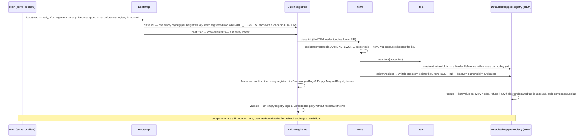

# Identifiers and registries

> Verified against **Minecraft 26.2** · Part II · How `minecraft:diamond_sword` becomes an `Item` before the game exists, and how a data-pack biome becomes a `Holder` the client can be told about.

## Responsibility

Everything in Minecraft that has a name lives in a registry: a table from
`ResourceKey` to object that also assigns each object a small integer for the
wire. Some registries are **built in** — filled by static initialisers before
any world exists and frozen forever (blocks, items, entity types). Others are
**dynamic** — loaded from data-pack JSON when a world opens (biomes,
dimension types, enchantments, loot tables) and sent to the client during the
configuration phase. The `Holder` type is the seam between the two: a
reference to a registry entry that may be handed out before the entry exists
and that the registry binds later.

The one sentence a player recognises: *`/give @s minecraft:diamond_sword`
works because the string on the left is a key in a table the server froze at
startup.*

## The data it owns

- `Identifier` (`net/minecraft/resources`) — namespace and path. Not a record:
  a final class with a private constructor whose validation is an assertion on
  the trusted path and a real check on the parsing paths
  (`Identifier.isValidNamespace`, `Identifier.isValidPath`). The two character
  sets differ, and the difference bites: a **path** may contain `/`, a
  **namespace** may not, and `..` is rejected outright as a namespace.
  `Identifier.DEFAULT_NAMESPACE` is *minecraft* and
  `Identifier.withDefaultNamespace` supplies it — as does a string with no
  separator at all, or one that starts with the separator.
  `Identifier.parse` throws `IdentifierException` (which lives in
  `net/minecraft`, not beside `Identifier`) where `Identifier.tryParse`
  returns null; `Identifier.read` exists twice, once returning a `DataResult`
  for `Identifier.CODEC` and once over a Brigadier `StringReader`, with
  `Identifier.readNonEmpty` beside it. `Identifier.resolveAgainst` carries a
  path-traversal guard. The one that surprises people:
  **`Identifier.compareTo` orders by path first and namespace second**, so a
  sorted list of ids is not grouped by mod. This is the class 1.21 readers
  know as *ResourceLocation*.
- `ResourceKey` — an `Identifier` paired with the `Identifier` of the
  registry it belongs to. Keys are **interned** through a weak map keyed by
  `ResourceKey.InternKey`, so two keys for the same registry and id are
  literally the same object. `Registries` holds the 148 `ResourceKey`s *of
  registries* (`Registries.ITEM`, `Registries.BIOME` …) — 147 distinct
  objects, because of the collision described in the surprises below;
  `ItemIds` and `BlockItemIds` (`net/minecraft/references`) hold the
  per-element keys the static initialisers use.
- `Registry` — the read interface: `Registry.getValue`, `Registry.getKey`,
  `Registry.getId`, `Registry.getTags`, plus codecs (`Registry.byNameCodec`,
  `Registry.holderByNameCodec`). It extends `IdMap`, so every registry is
  also an int ↔ object table. `WritableRegistry` adds
  `WritableRegistry.register` and `WritableRegistry.bindTags`;
  `DefaultedRegistry` (`DefaultedMappedRegistry`) answers a default entry —
  "air" for items and blocks — instead of null.
- `MappedRegistry` — the one real implementation (with
  `DefaultedMappedRegistry` its only subclass). It owns `MappedRegistry.byId`
  (insertion order **is** the numeric id), `MappedRegistry.byKey`,
  `MappedRegistry.byLocation`, `MappedRegistry.byValue`,
  `MappedRegistry.toId`, `MappedRegistry.registrationInfos`, two tag tables
  (see below), the reverse index `MappedRegistry.componentLookup`, and the
  `MappedRegistry.frozen` flag that `MappedRegistry.validateWrite` checks on
  every mutation.
- **Two tag tables, not one.** `MappedRegistry.frozenTags` is the
  registration-time map of declared `HolderSet.Named` objects;
  `MappedRegistry.allTags` (a `MappedRegistry.TagSet`) is the bound view, and
  it starts as `MappedRegistry.TagSet.unbound`, where every read throws. That
  split is what makes the freeze checks possible. The tag system itself is
  [tags](tags.md)'s subject.
- `Holder` — a sealed interface with two kinds (`Holder.Kind`).
  `Holder.Reference` is an entry *in* a registry — and is itself `non-sealed`:
  it knows its `HolderOwner`, its key, its tags and its components, and any of
  those may be unbound until the registry binds them
  (`Holder.Reference.bindValue`, `Holder.Reference.bindTags`,
  `Holder.Reference.bindComponents`). `Holder.Direct` is a record wrapping an
  inline value and a `DataComponentMap` that belongs to no registry — it has
  no key, is in no tag, and serialises inline. `HolderSet` is a set of
  holders: `HolderSet.Named` is a tag, `HolderSet.Direct` is a literal list.
- `HolderGetter` / `HolderLookup` / `HolderOwner` — the read-only views a
  codec sees. `HolderLookup.Provider` is "all the registries I may resolve
  against"; `HolderLookup.RegistryLookup` is one of them. `HolderOwner`
  exists for one question — `HolderOwner.canSerializeIn` — which is how a
  holder from one world refuses to be written by another world's context.
- `RegistryAccess` — a `HolderLookup.Provider` over a set of registries;
  `RegistryAccess.Frozen` is a bare marker for the finished kind.
  `LayeredRegistryAccess` stacks several, one per `RegistryLayer`:
  **`RegistryLayer.STATIC`, `RegistryLayer.WORLDGEN`, `RegistryLayer.DIMENSIONS`, `RegistryLayer.RELOADABLE`**, in that order, and the server keeps
  the stack itself in `MinecraftServer.registries` (with
  `MinecraftServer.registryAccess` the flattened view).
  `LayeredRegistryAccess.getAccessForLoading` is everything *before* a layer
  (what that layer's JSON may reference); `LayeredRegistryAccess.compositeAccess`
  is everything. The client mirrors this with two layers,
  `ClientRegistryLayer.STATIC` and `ClientRegistryLayer.REMOTE`. Note that
  the STATIC access on both sides is `RegistryAccess.fromRegistryOfRegistries`
  over `BuiltInRegistries.REGISTRY` — a live view of the frozen root
  registry, not a copy of it.
- `RegistrationInfo` — per entry: a `Lifecycle` and the `KnownPack` it came
  from. `RegistrationInfo.BUILT_IN` is what every static registration gets.

All of this is server *and* client: `MappedRegistry`, `BuiltInRegistries`,
`RegistryDataLoader` ship in the dedicated server jar. Only
`ClientRegistryLayer`, `RegistryDataCollector` and `KnownPacksManager` are
client-only.

## When it runs

Three moments.

1. **Launch, on the launching thread**, before any server or client object
   exists: `Bootstrap.bootStrap` → `BuiltInRegistries.bootStrap`. Both
   `Main` classes do this early — after argument parsing and crash-report
   preload, and after a handful of non-registry bootstraps
   (see [Anatomy](../anatomy/anatomy.md)). After it returns every built-in
   registry is frozen and any `WritableRegistry.register` throws.
2. **World load, on the worker pool with hops to the main thread**:
   `WorldLoader.load` runs `RegistryDataLoader.load` on
   `Util.backgroundExecutor`, returning to the main thread for
   resource-manager creation and the final assembly. This is where the
   `RegistryLayer.WORLDGEN`, `RegistryLayer.DIMENSIONS` and
   `RegistryLayer.RELOADABLE` layers are filled.
3. **Configuration phase, on the server thread then the client thread**:
   `SynchronizeRegistriesTask` sends the dynamic registries; the client
   rebuilds its `ClientRegistryLayer.REMOTE` layer in `RegistryDataCollector.collectGameRegistries`
   (decoding on the worker pool, joined on the client thread) before it will
   accept play packets.

`/reload` is a fourth moment and does more than the `RegistryLayer.RELOADABLE`
layer: it also re-reads and re-applies tags for **every** registry in the
server's composite access and rebinds every registry element's data
components. The mechanics belong to [the resource system](resource-system.md)
and [tags](tags.md); what matters here is that a frozen registry's *contents*
never change, while its tags and its elements' components do.

## The trace: `minecraft:diamond_sword` becomes an `Item`

Narrated:

1. **Registries exist before their contents.** `BuiltInRegistries` class
   init creates every registry empty and records the loader that fills it
   in `BuiltInRegistries.LOADERS`, an insertion-ordered map. `Bootstrap.bootStrap`
   then runs `BuiltInRegistries.createContents` — the loaders in that order —
   which forces the class init of `Items`, `Blocks`, `EntityType` and the
   rest. `Bootstrap.checkBootstrapCalled` is the guard that makes
   "touched `Blocks` from a static initialiser" a crash rather than a
   silent empty registry; it works because the bootstrap flag is set *before*
   the registries are touched, not after.
2. **The key travels in the properties.** `Items.registerItem` takes a
   `ResourceKey` from `ItemIds` and calls `Item.Properties.setId` before
   constructing; an `Item` therefore knows its own key at construction time.
   Blocks do the same with `BlockItemIds` and `BlockBehaviour.Properties.setId`.
3. **Intrusive holders.** Five registries — `BuiltInRegistries.BLOCK`, `BuiltInRegistries.ITEM`, `BuiltInRegistries.FLUID`,
   `BuiltInRegistries.ENTITY_TYPE`, `BuiltInRegistries.BLOCK_ENTITY_TYPE` — are created with intrusive holders:
   the constructor asks the registry for a `Holder.Reference`
   (`MappedRegistry.createIntrusiveHolder`) that wraps the object before it
   has a key, and stores it in `Item.builtInRegistryHolder`. Registration
   then binds the key to *that* holder rather than creating a new one, so
   `Item.builtInRegistryHolder` and the registry's own holder are the same
   object and a tag check on a block or item is a set lookup on the holder's
   own bound tag set, with no registry hop. (`Holder.Reference.createIntrusive`
   is marked deprecated — the mechanism is load-bearing but not encouraged.)
4. **The numeric id is the line number.** `MappedRegistry.register` appends
   to `MappedRegistry.byId`; the wire id of an item is the position of its
   line in `Items`. `Item.STREAM_CODEC` is `ByteBufCodecs.holderRegistry`
   over `Registries.ITEM`, which encodes that integer.
5. **Freeze is a proof.** `MappedRegistry.freeze` binds every holder's value
   and throws if any holder is still unbound, any intrusive holder was
   created but never registered, or any tag declared by a `TagKey` was never
   bound. `BuiltInRegistries.freeze` first binds the tags the bootstrap
   actually asked for to empty (`MappedRegistry.bindAllTagsToEmpty`) so that
   this check passes for the static registries, whose real tags do not exist
   until a data pack is read.

## The trace: a data-pack biome becomes a `Holder` and reaches the client

```mermaid
sequenceDiagram
    participant WL as WorldLoader (server, worker pool)
    participant RDL as RegistryDataLoader
    participant T as ResourceManagerRegistryLoadTask (BIOME)
    participant LRA as LayeredRegistryAccess
    participant SCP as ServerConfigurationPacketListenerImpl (server thread)
    participant CCP as ClientConfigurationPacketListenerImpl (client thread)
    participant RDC as RegistryDataCollector

    WL->>WL: RegistryLayer.createRegistryAccess — STATIC filled from BuiltInRegistries.REGISTRY, three empty layers
    WL->>RDL: load(resources, getAccessForLoading(WORLDGEN), WORLDGEN_REGISTRIES, backgroundExecutor)
    RDL->>T: one RegistryLoadTask per RegistryData#59; every task's ConcurrentHolderGetter is visible to every other
    T->>T: FileToIdConverter.registry lists data/*/worldgen/biome/*.json#59; decode in parallel#59; register sorted by id#59; load and bind this registry's tags
    T->>T: freezeRegistry, then the RegistryData's RegistryValidator
    RDL->>LRA: one replaceFrom(WORLDGEN, worldgen layer, dimensions layer) — the dimensions layer is the WorldDataSupplier's finalDimensions
    SCP->>CCP: ClientboundSelectKnownPacks — which packs do you already have?
    CCP->>SCP: ServerboundSelectKnownPacks — accepted all-or-nothing
    SCP->>CCP: ClientboundRegistryDataPacket × N — RegistrySynchronization.packRegistries#59; entries from a known pack carry no data
    SCP->>CCP: ClientboundUpdateTagsPacket — every static registry's tags plus the synced dynamic ones, as registry ints
    SCP->>CCP: ClientboundFinishConfigurationPacket
    CCP->>RDC: collectGameRegistries — rebuild REMOTE with NetworkRegistryLoadTasks#59; missing data re-read from the local pack#59; static tags applied in place
    RDC->>CCP: a RegistryAccess.Frozen into CommonListenerCookie.receivedRegistries
    CCP->>SCP: ServerboundFinishConfigurationPacket — play may begin
```

Narrated:

1. **Layers load against the layers before them.** `RegistryDataLoader.load`
   is given `LayeredRegistryAccess.getAccessForLoading`, so a biome JSON may
   reference a placed feature (same layer) or a sound event (`RegistryLayer.STATIC`) but
   never a level stem (`RegistryLayer.DIMENSIONS`, which loads after). The lists
   `RegistryDataLoader.WORLDGEN_REGISTRIES`, `RegistryDataLoader.DIMENSION_REGISTRIES`
   and `RegistryDataLoader.SYNCHRONIZED_REGISTRIES` say which keys belong to
   which step and which subset the client is told about. Both worldgen and
   dimensions are installed in a *single* `LayeredRegistryAccess.replaceFrom`
   call, and the dimensions layer that wins is the world data's, not
   necessarily the one just decoded — a saved world's dimension set survives.
2. **Loading is a task graph.** Each registry is one `RegistryLoadTask`
   owning a fresh `MappedRegistry` and a lock-guarded `ConcurrentHolderGetter`.
   `RegistryDataLoader.createContext` hands every task's getter to every
   other, so `Biome.DIRECT_CODEC` decoding on one worker can ask for a
   configured carver that another worker is still registering — the getter
   returns an unbound `Holder.Reference` and the reference is bound when that
   registry freezes. Forward references cost nothing; cycles are impossible
   because layers order the registries. Most dynamic registries also carry a
   `RegistryValidator` in their `RegistryDataLoader.RegistryData`, run after
   the freeze — commonly "not empty".
3. **Provenance is recorded per entry, and it is coarser than it looks.**
   `ResourceManagerRegistryLoadTask` gives each element a `RegistrationInfo`
   naming the `KnownPack` it came from and a `Lifecycle`. The rule is
   *presence*, not vanilla-ness: an element from **any** pack that reports a
   `KnownPack` is stable, and only an element from a pack with no known-pack
   info is experimental. `KnownPack.isVanilla` is computed on that path and
   then discarded. Anything received over the network is experimental, and
   the whole `RegistryLayer.RELOADABLE` layer is constructed experimental;
   the registry's own lifecycle is the merge of its entries', and that merge
   is what the "experimental features" warning on world open reads.
4. **The client is told what it does not already have.**
   `SynchronizeRegistriesTask` first asks the client which `KnownPack`s it
   has (`ClientboundSelectKnownPacks`). The comparison is **all or nothing**:
   the client's answer must equal the request exactly, or every element of
   every synced registry is sent in full. On a match,
   `RegistrySynchronization.packRegistries` sends every element's *id* but
   leaves the NBT payload empty for entries from those packs, and the
   client's `RegistryLoadTask.PendingRegistration.findAndLoadFromResource`
   re-decodes the JSON from its own jar. A modified biome from a custom data
   pack is sent in full through `Biome.NETWORK_CODEC` — the network codec,
   which omits the generation and mob-spawn settings the client never needs.
5. **The client rebuilds one layer and patches the other.**
   `RegistryDataCollector` accumulates the packets, and
   `RegistryDataCollector.collectGameRegistries` runs when configuration
   finishes. The `ClientRegistryLayer.REMOTE` layer is rebuilt wholesale and
   frozen — but the **static** registries cannot be rebuilt, so their tags
   are applied in place as a `Registry.PendingTags` patch, and when no
   registry data arrived at all the collector takes a tags-only path that
   patches and returns the original registries untouched. The result is a
   `RegistryAccess.Frozen` in `CommonListenerCookie` that every
   `RegistryFriendlyByteBuf` in the play phase decodes against.
6. **Singleplayer throws most of that away.** When an `IntegratedServer`
   exists, `ClientConfigurationPacketListenerImpl.handleConfigurationFinished`
   substitutes the server's own registries for the ones the client just
   built, and the memory connection suppresses re-applying static tags and
   components client-side. Both halves then share the same registry objects —
   which is worth remembering whenever a page says "the client's copy".

## Interfaces

- **Called by:** everything. `Registry.register` from every static
  initialiser; `RegistryOps` from every codec that names a *dynamic* registry
  entry; `MinecraftServer.registryAccess` and `ClientPacketListener.registryAccess`
  from anything that needs to resolve a key at runtime.
- **Calls into:** the resource system (`FileToIdConverter.registry` over a
  `ResourceManager`, page [resource-system](resource-system.md)), tags
  (`TagLoader`, page [tags](tags.md)), codecs (`RegistryFileCodec`,
  `RegistryFixedCodec`, `RegistryCodecs.homogeneousList`, `HolderSetCodec`,
  page [codecs-nbt-json](codecs-nbt-json.md)).
- **Crosses the network as:** `ClientboundSelectKnownPacks` /
  `ServerboundSelectKnownPacks` and `ClientboundRegistryDataPacket` (one
  per synchronised registry, entries as `RegistrySynchronization.PackedRegistryEntry`)
  in the configuration phase; then `ClientboundUpdateTagsPacket`, which is a
  **common** packet and arrives again mid-play after a server `/reload`.
  Built-in registry *elements* never cross — both sides ran the same static
  initialisers — but their *tags* do. Every registry element, built-in or
  dynamic, crosses as a bare varint id resolved against the buffer's
  registry access, with id 0 reserved so that an inline `Holder.Direct` can
  be sent instead.
- **Data-driven by:** `data/<namespace>/<registry path>/*.json` for every
  key in `RegistryDataLoader.WORLDGEN_REGISTRIES` and
  `RegistryDataLoader.DIMENSION_REGISTRIES` (`Registries.elementsDirPath`);
  the reloadable set (loot tables, predicates, item modifiers) through
  `ReloadableServerRegistries`. There is a third data-driven directory
  besides elements and tags — `Registries.componentsDirPath`. The catalogue
  of which registry is which kind is
  [reference/registries](../../reference/registries.md).

## Invariants and surprises

- **A holder can exist before its entry does.** `Holder.Reference` is a
  promise; `Holder.Reference.value` throws until the registry calls
  `Holder.Reference.bindValue`. Codecs hand these out freely during load and
  the freeze is what makes every promise kept — or fails loudly.
- **`Registries.DIMENSION` and `Registries.LEVEL_STEM` are the same object.**
  Both are created from the string "dimension", and because `ResourceKey`
  interns, the two fields hold one interned key under two names and two
  (unchecked) element types. `Registries.LEVEL_STEM` is the data-pack
  registry the `RegistryLayer.DIMENSIONS` layer loads;
  `Registries.DIMENSION` keys the `ServerLevel`s; the conversion helpers
  between them are identity functions at runtime.
- **Interning buys identity where it matters, not everywhere.**
  `MappedRegistry.byKey` and `MappedRegistry.byLocation` are ordinary hash
  maps. What genuinely depends on interned keys is
  `MappedRegistry.registrationInfos`, an identity map, and
  `Holder.Reference.is` for a `ResourceKey`, which is a reference comparison.
- **Numeric ids come from two different places.** For `BuiltInRegistries`
  they are an accident of source order — `MappedRegistry.byId` insertion
  order, so reordering two lines in `Blocks` changes a block's wire id and a
  resource pack cannot. For a **dynamic** registry they are the element ids
  in sorted order: `ResourceManagerRegistryLoadTask` decodes in parallel but
  registers sorted, which is exactly why the client can rebuild the same ids
  from the same element list. `MappedRegistry.toId` is keyed by *value*
  identity and returns −1 for anything it has never seen, including an
  equal-but-distinct object.
- **Holders carry components now, and they are bound after the freeze.**
  `Holder.Reference.bindComponents` attaches a per-entry `DataComponentMap`
  built by `BuiltInRegistries.DATA_COMPONENT_INITIALIZERS` — on the server
  during a reload, on the client at the end of configuration. Do not confuse
  that with `MappedRegistry.componentLookup`, which is a `DataComponentLookup`
  built *at* freeze: a lazily-populated **reverse** index answering "which
  elements have this component value?", used by things like finding the spawn
  egg for an entity type. See [data-components](data-components.md).
- **The vanilla data is not built at runtime.** `RegistrySetBuilder`,
  `BootstrapContext` and `VanillaRegistries` are the data generator that
  *writes* the JSON in the jar; the running game only ever reads JSON. A
  1.21 reader who remembers biomes being registered in code is remembering
  datagen.
- **`IdMapper` is not a registry.** It is the standalone `IdMap` used for
  `BlockState` ids (`Block.BLOCK_STATE_REGISTRY`) and similar palettes; the
  two share an interface and nothing else.
- **Tags bind before freeze and never after — except through
  `Registry.PendingTags`.** `MappedRegistry.prepareTagReload` is the one
  sanctioned way to swap the tag table of a frozen registry. It is prepared
  off to the side and installed in a single call, but that call is three
  ordered steps with no lock, so "atomic" is a statement about the server
  thread running it uninterrupted, not about memory visibility. [tags](tags.md)
  owns the detail.

## Where to look

`Identifier` · `ResourceKey` · `Registries` · `Registry` · `MappedRegistry` ·
`DefaultedMappedRegistry` · `Holder` · `HolderSet` · `HolderLookup` ·
`BuiltInRegistries` · `Bootstrap` · `RegistryLayer` · `LayeredRegistryAccess` ·
`WorldLoader` · `RegistryDataLoader` · `RegistryLoadTask` ·
`ResourceManagerRegistryLoadTask` · `RegistryValidator` ·
`RegistrySynchronization` · `SynchronizeRegistriesTask` ·
`RegistryDataCollector` · `NetworkRegistryLoadTask` ·
`ClientConfigurationPacketListenerImpl` · `RegistryOps`

---

*Rules: names, never code · how the system works, not how the code reads ·
newest version only · every backticked name passes `tools/verify_names.py`.*
