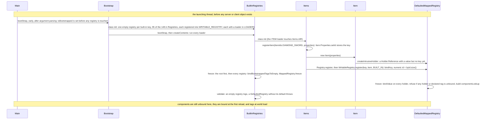

# Identifiers and registries

> Verified against **Minecraft 26.2** · Part II · A player types `/give @s minecraft:diamond_sword`, and the sword reaches their inventory as the number of the line it was registered on.

A player types `/give @s minecraft:diamond_sword`. The string on the right
is parsed into an `Identifier`, the identifier is paired with
`Registries.ITEM` to make a `ResourceKey`, and the key is looked up in a
table the server froze at startup, before any world existed —
`BuiltInRegistries.ITEM`. The stack that then lands in the player's
inventory does not carry the name. `Item.STREAM_CODEC` is
`ByteBufCodecs.holderRegistry` over `Registries.ITEM`, and it writes an
integer. That integer is a line number. `MappedRegistry.byId` is an
insertion-ordered list, `MappedRegistry.register` appends to it, and an
entry's numeric id is its position — so the wire id of a diamond sword is
where its line falls in `Items`, reordering two lines in `Blocks` changes a
block's wire id, and a resource pack cannot. A dynamic registry, a biome
from a data pack, gets its numbers the other way: its elements are decoded
in parallel but registered in sorted order of their ids, so the server's
numbering does not depend on which file finished first. The client does not
re-derive those numbers at all — it registers what the server sent, in the
order the packet lists them.

## The cast

| class | what it decides | thread |
|---|---|---|
| `Identifier` | the name — namespace and path — and which strings are legal ones | any |
| `ResourceKey` | the name paired with the registry it belongs to, interned so equal keys are one object | any |
| `Registry` · `MappedRegistry` | the table: key to object to integer, the frozen flag, the two tag tables | written on the launching thread or a load task's worker; read from anywhere |
| `Holder` | a reference to an entry that may be handed out before the entry exists (`Holder.Reference`), or an inline value that belongs to no registry (`Holder.Direct`) | any |
| `HolderLookup.Provider` · `RegistryAccess` | the read-only view a codec resolves against: all the registries it may name | any |
| `BuiltInRegistries` | the static registries — created empty at class init, filled and frozen by `Bootstrap.bootStrap` | the launching thread, before any server or client object exists |
| `RegistryDataLoader` | the dynamic registries — one load task per registry, JSON from the packs on the server, NBT from the wire on the client | `Util.backgroundExecutor` |
| `LayeredRegistryAccess` | which layer may see which: four `RegistryLayer`s on the server, two `ClientRegistryLayer`s on the client | the server thread owns `MinecraftServer.registries`; the client thread owns its own stack |

All of this is server *and* client: `MappedRegistry`, `BuiltInRegistries`
and `RegistryDataLoader` ship in the dedicated server jar. Client-only, of
the classes this page names, are `ClientRegistryLayer`,
`RegistryDataCollector` and `KnownPacksManager` — and, less surprisingly,
`ClientPacketListener`, `ClientConfigurationPacketListenerImpl` and
`IntegratedServer`.

## The name

`Identifier`, in `net/minecraft/resources`, is a namespace and a path, and
it is the class a 1.21-era reader knows as *ResourceLocation*. It is not a
record: a final class with a private constructor whose validation is an
assertion on the trusted path and a real check on the parsing paths
(`Identifier.isValidNamespace`, `Identifier.isValidPath`). The two
character sets differ, and the difference bites: a **path** may contain
`/`, a **namespace** may not, and `..` is rejected outright as a namespace.
`Identifier.DEFAULT_NAMESPACE` is *minecraft*, and
`Identifier.withDefaultNamespace` supplies it — as does parsing a string
with no separator at all, or one that starts with the separator.
`Identifier.parse` throws `IdentifierException` (which lives in
`net/minecraft`, not beside `Identifier`) where `Identifier.tryParse`
returns null. `Identifier.read` exists twice, once returning a `DataResult`
for `Identifier.CODEC` and once over a Brigadier `StringReader`, with
`Identifier.readNonEmpty` beside it, and `Identifier.resolveAgainst`
carries a path-traversal guard. The one that surprises people:
**`Identifier.compareTo` orders by path first and namespace second**, so a
sorted list of ids is not grouped by mod.

A `ResourceKey` is an `Identifier` paired with the `Identifier` of the
registry it belongs to, and keys are **interned** through a weak map keyed
by `ResourceKey.InternKey`, so two keys for the same registry and id are
literally the same object. `Registries` holds the 148 `ResourceKey`s *of
registries* (`Registries.ITEM`, `Registries.BIOME` …) — 147 distinct
objects, for a reason the questions at the end explain — and `ItemIds` and
`BlockItemIds` (`net/minecraft/references`) hold the per-element keys the
static initialisers use.

## The table

`Registry` is the read interface — `Registry.getValue`, `Registry.getKey`,
`Registry.getId`, `Registry.getTags`, and the codecs `Registry.byNameCodec`
and `Registry.holderByNameCodec` — and it extends `IdMap`, so every registry
is also an int-to-object table. `WritableRegistry` adds
`WritableRegistry.register` and `WritableRegistry.bindTags`;
`DefaultedRegistry` answers a default entry — *air* for items and blocks —
instead of null. `MappedRegistry` is the one real implementation, with
`DefaultedMappedRegistry` its only subclass. It is keyed three ways
(`MappedRegistry.byKey`, `MappedRegistry.byLocation` and the
insertion-ordered `MappedRegistry.byId`), it maps values back to their
numbers in `MappedRegistry.toId`, and it carries the `MappedRegistry.frozen`
flag that `MappedRegistry.validateWrite` checks on every mutation.

A `Holder` is the seam between a registry and the code that names its
entries. It is a sealed interface with two kinds (`Holder.Kind`).
`Holder.Reference` is an entry *in* a registry — and is itself
`non-sealed`: it knows its `HolderOwner`, its key, its tags and its
components, and any of those may be unbound until the registry binds them
(`Holder.Reference.bindValue`, `Holder.Reference.bindTags`,
`Holder.Reference.bindComponents`). A reference is a promise:
`Holder.Reference.value` throws until `Holder.Reference.bindValue` has run,
codecs hand these out freely during a load, and the freeze is what makes
every promise kept — or fails loudly. `Holder.Direct` is a record wrapping
an inline value and a `DataComponentMap` that belongs to no registry: it has
no key, is in no tag, and serialises inline. A `HolderSet` is a set of
holders — `HolderSet.Named` is a tag, `HolderSet.Direct` a literal list.

What a codec sees is a read-only view. `HolderGetter`, `HolderLookup` and
`HolderOwner` are those views; `HolderLookup.Provider` is "all the
registries I may resolve against" and `HolderLookup.RegistryLookup` is one
of them. `RegistryAccess` is a `HolderLookup.Provider` over a set of
registries, and `RegistryAccess.Frozen` is a bare marker for the finished
kind. Every static initialiser writes through `Registry.register`; every
codec that names a *dynamic* entry — `RegistryFileCodec`,
`RegistryFixedCodec`, `RegistryCodecs.homogeneousList`, `HolderSetCodec` —
resolves through a `RegistryOps` ([codecs, NBT and JSON](codecs-nbt-json.md));
and at runtime `MinecraftServer.registryAccess` and
`ClientPacketListener.registryAccess` are where anything that must resolve a
key goes.

## Before the game exists

Both `Main` classes do this early — after argument parsing and crash-report
preload, and after a handful of non-registry bootstraps
([anatomy](../anatomy/anatomy.md)) — on the launching thread, before any
server or client object exists. `Bootstrap.bootStrap` calls
`BuiltInRegistries.bootStrap`, and after it returns every built-in registry
is frozen and any `WritableRegistry.register` throws.

**Registries exist before their contents.** `BuiltInRegistries` class init
creates every registry empty and records the loader that fills it in
`BuiltInRegistries.LOADERS`, an insertion-ordered map. `Bootstrap.bootStrap`
then runs `BuiltInRegistries.createContents` — the loaders in that order.
By then `Items`, `Blocks` and `EntityTypes` are already initialised:
`Bootstrap.bootStrap` reaches `FireBlock.bootStrap`, `EntityTypes.PLAYER`
and `CauldronInteractions.bootStrap` before it calls
`BuiltInRegistries.bootStrap`, and each of those touches its catalogue.
`Bootstrap.checkBootstrapCalled` is the guard that makes "touched `Blocks`
from a static initialiser" a crash rather than a silent empty registry; it
works because the bootstrap flag is set *before* the registries are touched,
not after.

**The key travels in the properties.** `Items.registerItem` takes a
`ResourceKey` from `ItemIds` and calls `Item.Properties.setId` before
constructing, so an `Item` knows its own key at construction time. Blocks
do the same with `BlockItemIds` and `BlockBehaviour.Properties.setId`.

**Five registries hand the object its own holder.** `BuiltInRegistries.BLOCK`,
`BuiltInRegistries.ITEM`, `BuiltInRegistries.FLUID`,
`BuiltInRegistries.ENTITY_TYPE` and `BuiltInRegistries.BLOCK_ENTITY_TYPE`
are created with intrusive holders: the constructor asks the registry for a
`Holder.Reference` (`MappedRegistry.createIntrusiveHolder`) that wraps the
object before it has a key, and stores it in `Item.builtInRegistryHolder`.
Registration then binds the key to *that* holder rather than creating a
new one, so `Item.builtInRegistryHolder` and the registry's own holder are
the same object, and a tag check on a block or item is a set lookup on the
holder's own bound tag set with no registry hop
([tags](tags.md)). `Holder.Reference.createIntrusive` is marked
deprecated — the mechanism is load-bearing but not encouraged.

**The numeric id is the line number.** `MappedRegistry.register` appends
to `MappedRegistry.byId`, and every static registration carries
`RegistrationInfo.BUILT_IN`. The wire id of an item is the position of its
line in `Items`, and `Item.STREAM_CODEC` encodes that integer.

**Freeze is a proof**, stated in full below. `BuiltInRegistries.freeze`
freezes the root registry first, then every registry it holds, and
`BuiltInRegistries.validate` closes the bootstrap: an empty registry is
logged, a `DefaultedRegistry` whose default key is missing throws.

## When a world opens

The server keeps its registries as a `LayeredRegistryAccess` in
`MinecraftServer.registries`, one layer per `RegistryLayer` —
`RegistryLayer.STATIC`, `RegistryLayer.WORLDGEN`,
`RegistryLayer.DIMENSIONS`, `RegistryLayer.RELOADABLE`, in that order —
with `MinecraftServer.registryAccess` the flattened view.
`LayeredRegistryAccess.getAccessForLoading` is everything *before* a layer,
which is what that layer's JSON may reference;
`LayeredRegistryAccess.compositeAccess` is everything. The client mirrors
this with two layers, `ClientRegistryLayer.STATIC` and
`ClientRegistryLayer.REMOTE`. On both sides the STATIC layer is
`RegistryAccess.fromRegistryOfRegistries` over `BuiltInRegistries.REGISTRY`
— a live view of the frozen root registry, not a copy of it.

```mermaid
sequenceDiagram
    participant WL as WorldLoader
    participant RDL as RegistryDataLoader
    participant RMRLT as ResourceManagerRegistryLoadTask
    participant LRA as LayeredRegistryAccess
    participant SCPL as ServerConfigurationPacketListenerImpl
    participant CCPL as ClientConfigurationPacketListenerImpl
    participant RDC as RegistryDataCollector

    Note over WL,LRA: world load, on the worker pool
    WL->>WL: RegistryLayer.createRegistryAccess: STATIC filled from BuiltInRegistries.REGISTRY, three empty layers
    WL->>RDL: load(resources, the lookups built from getAccessForLoading(WORLDGEN), WORLDGEN_REGISTRIES, backgroundExecutor)
    RDL->>RMRLT: one RegistryLoadTask per RegistryData, every task's ConcurrentHolderGetter visible to every other
    RMRLT->>RMRLT: FileToIdConverter.registry lists data/*/worldgen/biome/*.json, decode in parallel, register sorted by id, load and bind this registry's tags
    RMRLT->>RMRLT: freezeRegistry, then the RegistryData's RegistryValidator
    WL->>LRA: one replaceFrom(WORLDGEN, worldgen layer, dimensions layer): the dimensions layer is the WorldDataSupplier's finalDimensions
    Note over WL,RDC: later, a client logs in and reaches the configuration phase: the server thread on the left, the client thread on the right
    SCPL->>CCPL: ClientboundSelectKnownPacks: which packs do you already have?
    CCPL->>SCPL: ServerboundSelectKnownPacks: accepted all-or-nothing
    SCPL->>CCPL: ClientboundRegistryDataPacket, one per synced registry: RegistrySynchronization.packRegistries, entries from a known pack carry no data
    SCPL->>CCPL: ClientboundUpdateTagsPacket: every static registry's tags plus the synced dynamic ones, as registry ints
    SCPL->>CCPL: ClientboundFinishConfigurationPacket
    CCPL->>RDC: collectGameRegistries: rebuild REMOTE with NetworkRegistryLoadTasks, missing data re-read from the local pack, static tags applied in place
    RDC->>CCPL: a RegistryAccess.Frozen, into CommonListenerCookie.receivedRegistries
    CCPL->>SCPL: ServerboundFinishConfigurationPacket: play may begin
```

`WorldLoader.load` runs `RegistryDataLoader.load` on
`Util.backgroundExecutor`, returning to the main thread for
resource-manager creation and the final assembly; this is where the
`RegistryLayer.WORLDGEN`, `RegistryLayer.DIMENSIONS` and
`RegistryLayer.RELOADABLE` layers are filled. The configuration phase is
the third moment: `SynchronizeRegistriesTask` sends the dynamic registries
on the server thread, and the client rebuilds its
`ClientRegistryLayer.REMOTE` layer in
`RegistryDataCollector.collectGameRegistries` — decoding on the worker
pool, joined on the client thread — before it will accept play packets.

**Layers load against the layers before them.** `RegistryDataLoader.load`
is given lookups built from `LayeredRegistryAccess.getAccessForLoading` —
built by `TagLoader.buildUpdatedLookups`, so that the static registries'
freshly read tags are visible to the worldgen codecs before they are
applied ([tags](tags.md)) — so a biome JSON may reference a placed feature
(same layer) or a sound event (`RegistryLayer.STATIC`) but never a level
stem (`RegistryLayer.DIMENSIONS`, which loads after). The lists
`RegistryDataLoader.WORLDGEN_REGISTRIES`,
`RegistryDataLoader.DIMENSION_REGISTRIES` and
`RegistryDataLoader.SYNCHRONIZED_REGISTRIES` say which keys belong to which
step and which subset the client is told about. Both worldgen and
dimensions are installed in a *single* `LayeredRegistryAccess.replaceFrom`
call, and the dimensions layer that wins is the world data's, not
necessarily the one just decoded — a saved world's dimension set survives.

**Loading is a task graph.** Each registry is one `RegistryLoadTask`
owning a fresh `MappedRegistry` and a lock-guarded
`ConcurrentHolderGetter`. `RegistryDataLoader.createContext` hands every
task's getter to every other, so `Biome.DIRECT_CODEC` decoding on one
worker can ask for a configured carver that another worker is still
registering — the getter returns an unbound `Holder.Reference`, and the
reference is bound when that registry freezes. Forward references cost
nothing; cycles are impossible because layers order the registries.
Thirteen of the forty-seven dynamic registries also carry a
`RegistryValidator` in their `RegistryDataLoader.RegistryData`, run after
the freeze — every one an entity-variant registry, and every one the same
check, `RegistryValidator.nonEmpty`.

**Provenance is recorded per entry, and it is coarser than it looks.**
`ResourceManagerRegistryLoadTask` gives each element a `RegistrationInfo`
naming the `KnownPack` it came from and a `Lifecycle`. The rule is
*presence*, not vanilla-ness: an element from **any** pack that reports a
`KnownPack` is stable, and only an element from a pack with no known-pack
info is experimental. `KnownPack.isVanilla` is computed on that path and
then discarded. Anything received over the network is experimental, and
the whole `RegistryLayer.RELOADABLE` layer is constructed experimental; the
registry's own lifecycle is the merge of its entries', and that merge is
what the "experimental features" warning on world open reads.

**The client is told what it does not already have.**
`SynchronizeRegistriesTask` first asks the client which `KnownPack`s it has
(`ClientboundSelectKnownPacks`). The comparison is **all or nothing**: the
client's answer must equal the request exactly, or every element of every
synced registry is sent in full. On a match,
`RegistrySynchronization.packRegistries` sends every element's *id* but
leaves the NBT payload empty for entries from those packs, and the client's
`RegistryLoadTask.PendingRegistration.findAndLoadFromResource` re-decodes
the JSON from its own jar. A modified biome from a custom data pack is sent
in full through `Biome.NETWORK_CODEC` — the network codec, which omits the
generation and mob-spawn settings the client never needs.

**The client rebuilds one layer and patches the other.**
`RegistryDataCollector` accumulates the packets, and
`RegistryDataCollector.collectGameRegistries` runs when configuration
finishes. The `ClientRegistryLayer.REMOTE` layer is rebuilt wholesale and
frozen — but the **static** registries cannot be rebuilt, so their tags are
applied in place, through the mechanism [tags](tags.md) owns, and when no
registry data arrived at all the collector takes a tags-only path that
patches and returns the original registries untouched. The result is a
`RegistryAccess.Frozen` in `CommonListenerCookie` that every
`RegistryFriendlyByteBuf` in the play phase decodes against.

**Singleplayer throws most of that away.** When an `IntegratedServer`
exists, `ClientConfigurationPacketListenerImpl.handleConfigurationFinished`
substitutes the server's own registries for the ones the client just built,
and the memory connection suppresses re-applying static tags and components
client-side. Both halves then share the same registry objects — which is
worth remembering whenever a page says "the client's copy".

## The freeze rule, stated

A frozen registry's **contents** never change. Its **tags** and its
elements' **components** do. Everything in this part that looks like an
exception to the first sentence is one of the two things in the second.

`MappedRegistry.freeze` is a proof, not a switch. It binds every holder's
value and throws if any holder is still unbound, if any intrusive holder
was created but never registered, or if any tag declared by a `TagKey` was
never bound. The tag half of that proof works because there are **two tag
tables, not one**: `MappedRegistry.frozenTags` is the registration-time map of
declared `HolderSet.Named` objects, and `MappedRegistry.allTags` (a
`MappedRegistry.TagSet`) is the bound view, which starts as
`MappedRegistry.TagSet.unbound`, where every read throws. The freeze
checks the first and installs the second. For the static registries the
real tags do not exist until a data pack is read, so `BuiltInRegistries.freeze`
first binds the tags the bootstrap actually asked for to empty
(`MappedRegistry.bindAllTagsToEmpty`) and the proof passes on empty sets.
The freeze also builds `MappedRegistry.componentLookup`. After it, the
`MappedRegistry.frozen` flag makes `MappedRegistry.validateWrite` throw on
every ordinary write. Two things still change: `MappedRegistry.prepareTagReload`
*requires* the frozen flag, and the component prototypes are rebound beside
the tags ([data components](data-components.md)).

What changes afterwards changes through two doors. **Tags:** a world load
swaps the tag tables of the static registries, and `/reload` does more
than refill the `RegistryLayer.RELOADABLE` layer — it re-reads and
re-applies tags for **every** registry in the server's composite access.
How a frozen registry's tags are swapped is the pay-off of
[tags](tags.md), and the mechanics of the reload itself belong to
[the resource system](resource-system.md). **Components:** every registry
element's `DataComponentMap` is bound after the freeze by
`Holder.Reference.bindComponents`, and `/reload` rebinds every one of them;
[data components](data-components.md) owns how.

## What crosses the wire, and where the files are

Built-in registry *elements* never cross the network — both sides ran the
same static initialisers — but their *tags* do, and dynamic elements do:
`ClientboundSelectKnownPacks` and `ServerboundSelectKnownPacks`, then
`ClientboundRegistryDataPacket` (one per synchronised registry, entries as
`RegistrySynchronization.PackedRegistryEntry`) in the configuration phase,
then `ClientboundUpdateTagsPacket`, which is a **common** packet and arrives
again mid-play after a server `/reload`; and every registry element,
built-in or dynamic, crosses inside other packets as a bare varint id
resolved against the buffer's registry access. Only one variant shifts that
numbering: `ByteBufCodecs.holder` reserves 0 for an inline `Holder.Direct`
and writes every registry id one higher, where `ByteBufCodecs.holderRegistry`
— which `Item.STREAM_CODEC` uses — writes the raw id. On disk, every key in
`RegistryDataLoader.WORLDGEN_REGISTRIES` and
`RegistryDataLoader.DIMENSION_REGISTRIES` reads
`data/<namespace>/<registry path>/*.json` (`Registries.elementsDirPath`)
through `FileToIdConverter.registry` over a `ResourceManager`
([the resource system](resource-system.md)), its tags live under
`Registries.tagsDirPath` — there is a third path builder,
`Registries.componentsDirPath`, but it names a *reports* directory the data
generator writes and nothing in the running game reads — and the reloadable set (loot
tables, predicates, item modifiers) comes through
`ReloadableServerRegistries`. Which registry is which kind is
[reference/registries](../../reference/registries.md).

## Questions players ask

**Are `Registries.DIMENSION` and `Registries.LEVEL_STEM` two registries?**
They are the same object. Both are created from the string "dimension", and
because `ResourceKey` interns, the two fields hold one interned key under
two names and two (unchecked) element types. `Registries.LEVEL_STEM` is the
data-pack registry the `RegistryLayer.DIMENSIONS` layer loads;
`Registries.DIMENSION` keys the `ServerLevel`s; the conversion helpers
between them are identity functions at runtime. That is why `Registries`
declares 148 keys and holds 147 objects.

**Does interning matter?** Where identity is used, and only there.
`MappedRegistry.byKey` and `MappedRegistry.byLocation` are ordinary hash
maps. What genuinely depends on interned keys is
`MappedRegistry.registrationInfos`, an identity map, and
`Holder.Reference.is` for a `ResourceKey`, which is a reference comparison.

**Where does the number come from?** Two different places. For
`BuiltInRegistries` it is an accident of source order —
`MappedRegistry.byId` insertion order, so reordering two lines in `Blocks`
changes a block's wire id and a resource pack cannot. For a **dynamic**
registry it is the element ids in sorted order:
`ResourceManagerRegistryLoadTask` decodes in parallel but registers sorted,
which is exactly why the client can rebuild the same ids from the same
element list. `MappedRegistry.toId` is keyed by *value* identity and
returns −1 for anything it has never seen, including an equal-but-distinct
object.

**Are components part of the freeze?** No. `Holder.Reference.bindComponents`
attaches a per-entry `DataComponentMap` built by
`BuiltInRegistries.DATA_COMPONENT_INITIALIZERS` — on the server during a
reload, on the client at the end of configuration. Do not confuse that with
`MappedRegistry.componentLookup`, which is a `DataComponentLookup` built
*at* freeze: a lazily-populated **reverse** index answering "which elements
have this component value?", used by things like finding the spawn egg for
an entity type ([data components](data-components.md)).

**What does a `RegistrationInfo` say?** Per entry, a `Lifecycle` and the
`KnownPack` it came from; `RegistrationInfo.BUILT_IN` is what every static
registration gets.

**Why does a holder from one world refuse to be written by another?**
`HolderOwner` exists for one question — `HolderOwner.canSerializeIn` — and
that is it: a holder answers whether the context asking to serialise it is
its own owner.

**Is the vanilla data built at runtime?** No. `RegistrySetBuilder`,
`BootstrapContext` and `VanillaRegistries` are the data generator that
*writes* the JSON in the jar; the running game only ever reads JSON. A
1.21 reader who remembers biomes being registered in code is remembering
datagen.

**Is `Block.BLOCK_STATE_REGISTRY` a registry?** No. `IdMapper` is the
standalone `IdMap` used for `BlockState` ids and similar palettes; the two
share an interface and nothing else.

## Where to look

`Identifier` · `ResourceKey` · `Registries` · `Registry` · `MappedRegistry.register` ·
`MappedRegistry.freeze` · `DefaultedMappedRegistry` · `Holder` · `HolderSet` ·
`HolderLookup` · `Bootstrap.bootStrap` · `BuiltInRegistries.bootStrap` ·
`RegistryLayer` · `LayeredRegistryAccess` · `WorldLoader.load` ·
`RegistryDataLoader.load` · `RegistryLoadTask` ·
`ResourceManagerRegistryLoadTask` · `RegistryValidator` ·
`RegistrySynchronization.packRegistries` · `SynchronizeRegistriesTask` ·
`RegistryDataCollector.collectGameRegistries` · `NetworkRegistryLoadTask` ·
`ClientConfigurationPacketListenerImpl.handleConfigurationFinished` · `RegistryOps`

---

*Rules: names, never code · how the system works, not how the code reads ·
newest version only · every backticked name passes `tools/verify_names.py`.*
