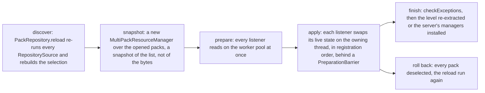
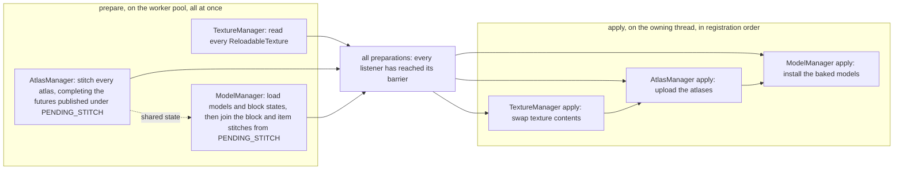
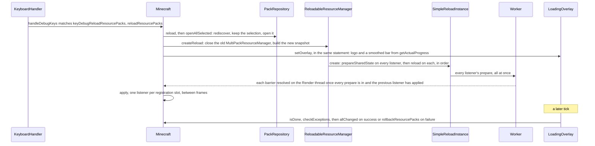

# The resource system

> Verified against **Minecraft 26.2** · Part II · A player presses F3+T, the screen goes to the logo and a bar, and every texture, model, sound and font is rebuilt from a stack of packs without the game stopping.

A player presses F3+T. The screen goes red, the Mojang Studios logo comes
up, and a white bar creeps across under it while the old world keeps
rendering behind. What is happening is one pipeline that everything the
game reads from a file goes through — textures, models, sounds, language
strings, recipes, advancements, loot tables, tags, worldgen JSON: a **stack
of packs** is discovered, merged into a **resource manager** that is a
snapshot of the stack, and a list of **reload listeners** each rebuild
their world from it, every one of them reading on the shared worker pool at
once ([anatomy](../anatomy/anatomy.md#four-threads-worth-memorising)) and
swapping their live state on the owning thread in the order they were
registered. The client's stack is resource packs (`PackType.CLIENT_RESOURCES`,
the *assets* tree); the server's is data packs (`PackType.SERVER_DATA`, the
*data* tree) — same classes, two instances, two directories, and `/reload`
is the same pipeline run by the server. The surprising part is the end. A
reload that fails does not find the offending pack.
`Minecraft.rollbackResourcePacks` deselects *every* resource pack, clears
the options lists, saves, and reloads again — and if vanilla was the only
selected pack it rethrows and crashes instead.

## The cast

| class | what it decides | thread |
|---|---|---|
| `PackRepository` · `Pack` | which packs exist, which are selected, and in what order | whoever asks: Render on the client, Server on the server |
| `MultiPackResourceManager` · `FallbackResourceManager` | which pack's copy of a file wins, one stack per namespace | built on the asking thread, read from workers |
| `ReloadableResourceManager` | the client's long-lived façade: the current snapshot and the listener list | Render |
| `PreparableReloadListener` · `SimplePreparableReloadListener` · `SimpleJsonResourceReloadListener` | what to read off-thread and what to swap on-thread | prepare on the worker pool, apply on the owner |
| `SimpleReloadInstance` | the schedule: every prepare at once, every apply in order behind a barrier | built on the caller's thread, barriers resolved on the owner |
| `LoadingOverlay` | when the client's reload is done, and what to do if it failed | Render |
| `ReloadableServerResources` | the server's three listeners, and the registries that replaced the rest | Server |

## The pipeline

Five stages, and the rest of the page is one section per stage: what comes
in, what is decided, what goes out. F3+T is the grounding trace; `/reload`
is the coda, as a table of where the server's run of the same pipeline
differs.

## Discover: the repository and its packs

What comes in is a set of `RepositorySource`s (`server/packs/repository`),
each a place packs are found. `ClientPackSource` and `ServerPacksSource`
are the built-ins, both extending `BuiltInPackSource`, which also lists the
packs bundled *inside* the vanilla pack — the art packs, the accessibility
packs and every feature pack (`BuiltInPackSource.TESTS_ID` is declared and
referenced nowhere, so the *tests* pack is a development leftover); `FolderRepositorySource` is a
directory of user packs; `DownloadedPackSource` is server-sent packs, client
only. `PackRepository.reload` re-runs every source into the *available*
map and then rebuilds the *selected* list: prior choices are kept, and a
pack whose `Pack.isRequired` is true is force-inserted at its
`Pack.getDefaultPosition`. Reading the order out of *options.txt* is a
startup step — `Options.loadSelectedResourcePacks` runs once in the
`Minecraft` constructor, not on every F3+T.

A `Pack` is a discoverable pack: a `PackLocationInfo` (id, title,
`PackSource`, optional `KnownPack`), a `Pack.ResourcesSupplier` that can
open it, its `Pack.Metadata` (description, `PackCompatibility`, requested
feature flags, overlays) and a `PackSelectionConfig` — required, default
`Pack.Position`, fixed. `Pack.Position` owns the insertion algorithm that
makes a fixed pack stick: `Pack.Position.BOTTOM` inserts at the front of
the list, past any pack already fixed there, and `Pack.Position.TOP` at the
back. The last pack in the list wins (next section), which is why vanilla
is BOTTOM and why "higher in the UI" means "later in the list". The
client's vanilla pack cannot be deselected and the server's can:
`ClientPackSource` marks vanilla required and bottom; `ServerPacksSource`
marks it bottom but optional.

What a pack *is* on disk is `PackResources` (`server/packs`): the raw file
source with `PackResources.getResource`, `PackResources.listResources` and
`PackResources.getNamespaces`. `VanillaPackResources` is the jar's own
assets and data; `FilePackResources` a zip; `PathPackResources` a
directory; `CompositePackResources` a pack plus its *overlays*
subdirectories, which the `Pack.ResourcesSupplier` assembles for zip and
folder packs (the vanilla pack never produces one). Discovery is guarded:
`DirectoryValidator`, `ForbiddenSymlinkInfo` and `PackDetector` decide
what a folder is allowed to be, `allowed_symlinks.txt` is parsed into a
`DirectoryValidator` by `LevelStorageSource.parseValidator`. Two corners of
`server/packs` are worth a sentence each. `packs/linkfs` is a synthetic
read-only file system — `LinkFileSystem`, `LinkFSProvider` and a `LinkFSPath`
that is a name in a tree rather than a name on disk — which lets a
development checkout's scattered directories present as one pack root, so
the game can open a pack that was never assembled. And `DownloadQueue` is
the client's cache for server-sent packs: one directory per pack UUID under
a cache root, downloads run one at a time on a `ConsecutiveExecutor` over
`Util.nonCriticalIoPool`, every attempt appended to a `JsonEventLog` beside
them, and the constructor calls `DownloadCacheCleaner.vacuumCacheDir` to
trim the root to `DownloadQueue.MAX_KEPT_PACKS` — twenty files, newest kept,
one per directory before any directory's second. A server you visited
twenty packs ago has been evicted.

### What *pack.mcmeta* says

The file is read as `ResourceMetadata` sections: `PackMetadataSection`
(description and a `PackFormat` range), `FeatureFlagsMetadataSection`,
`OverlayMetadataSection`, `ResourceFilterSection`. Compatibility is a
range, not a number. `PackMetadataSection` carries an inclusive range of
`PackFormat` major/minor pairs and `PackCompatibility` reports too old, too
new, unknown or compatible against the game's own — resource **88.0** and
data **107.1** in 26.2. Above `PackFormat.lastPreMinorVersion` (64 for
assets, 81 for data) the *min_format* / *max_format* fields are mandatory
and the old integer *pack_format* is not enough. A *pack.mcmeta* the strict
codec rejects gets one more chance through a description-only fallback so
the pack can at least be listed as incompatible. Overlays are versioned
sub-packs: `OverlayMetadataSection` maps a `PackFormat` range to an
overlays subdirectory that `CompositePackResources` layers on top of the
pack itself, so one zip can carry variants for several game versions.

Feature flags are packs, but not auto-selected ones. A feature pack is a
built-in pack carrying a `FeatureFlagsMetadataSection`, and its
`PackSource` deliberately reports that it must *not* be added
automatically. `MinecraftServer.enableForcedFeaturePacks` force-selects the
ones matching the world's forced features, and the world's flag set is the
selected packs' requested flags joined with those forced ones. Turning on
an experiment is enabling a data pack — through a different door than
ordinary packs use. What the resulting `FeatureFlagSet` then *gates* is a
registry lookup, and that is
[identifiers and registries](identifiers-and-registries.md#feature-flags-the-same-registry-narrowed).

What goes out of the stage is `PackRepository.openAllSelected`: the
selected `Pack`s opened into a list of `PackResources`, in order.

## Snapshot: the manager

`MultiPackResourceManager` (`server/packs/resources`) is built from that
list. It is a **snapshot of the pack list, not of the bytes**: it asks each
pack for its namespaces and builds one `FallbackResourceManager` per
namespace, each a stack searched from the **last** selected pack down. The
old world stays up until the last apply, but the old files do not: on the
client, `ReloadableResourceManager.createReload` closes the previous
`MultiPackResourceManager` — with every file handle it held — before
building the new one. What is frozen is *which packs are in the stack*; a
`Resource` still opens its file when it is read, so a **folder** pack
edited on disk mid-reload is observable. A zip is not: `FilePackResources`
holds its zip open for the life of the pack.

A `Resource` is what a lookup returns: its source pack, an `IoSupplier` for
the bytes — opened lazily, at read time — and a lazily-read
`ResourceMetadata` found beside it. A `.mcmeta` is looked for in the
winning pack or those above it, never in one below, so a pack overriding a
texture without its `.mcmeta` loses the animation. `ResourceFilterSection`
lets a pack *hide* lower packs' files by pattern without providing
replacements: `MultiPackResourceManager` reads each pack's filter section
and pushes it onto the namespace stacks as a filter, and a lookup that
reaches a filtered entry stops there. Some loaders want every copy, not
the winner: `ResourceManager.getResourceStack` and
`ResourceManager.listResourceStacks` return all packs' copies
**bottom-first**, which is how languages, tags and atlas sources merge
instead of overriding.

Two more managers frame this one. `ReloadableResourceManager` is the
long-lived client façade that holds the current snapshot and the
`PreparableReloadListener` list; the server has no façade — each reload is
a fresh `MultiPackResourceManager` inside
`MinecraftServer.ReloadableResources`. `ResourceManager.Empty` is the
do-nothing manager handed to code that must run without packs.

What goes out is one `ResourceManager`, wrapped in a
`PreparableReloadListener.SharedState`, and a `ReloadInstance` that has
already started.

## Prepare: every listener at once

A `PreparableReloadListener.reload` takes the shared state (which carries
the `ResourceManager`), a background executor, a
`PreparableReloadListener.PreparationBarrier` and a main-thread executor.
`SimplePreparableReloadListener` splits that into
`SimplePreparableReloadListener.prepare` (background) and
`SimplePreparableReloadListener.apply` (main thread);
`SimpleJsonResourceReloadListener` is the "every JSON file in a directory
through one codec" specialisation, using `FileToIdConverter` to map
*data/ns/recipe/foo.json* to *ns:foo*; `ResourceManagerReloadListener` is
the apply-only shape.

`SimpleReloadInstance` is the schedule, and this is what it does, read
from `SimpleReloadInstance.prepareTasks`. It wraps both executors in
counters. It calls `PreparableReloadListener.prepareSharedState` on every
listener first, synchronously. Then it walks the listener list once,
calling each listener's `PreparableReloadListener.reload` and handing it a
barrier chained to the *previous* listener's returned future (the first
listener's barrier is chained to the initial task). The barrier's
`PreparableReloadListener.PreparationBarrier.wait` does two things: it
posts a task to the main-thread executor that removes the listener from
the set still preparing and completes the all-preparations future when
that set empties, and it returns that future combined with the previous
listener's. So listener N's apply runs only after *every* listener has
reached its barrier *and* listener N−1 has finished entirely — apply
included — and a listener that never reaches its barrier holds every apply
behind it. The futures are sequenced fail-fast: the first listener to throw
fails the reload as a whole. It does not stop the others — `Util.sequenceFailFast`
completes the outer future exceptionally and leaves every prepare running;
`Util.sequenceFailFastAndCancel`, which would cancel them, is not the one
used here. What never happens is the applies.

Three of the client's twenty listeners, the ones registered between them
elided. Every apply waits on the all-preparations node; each apply also
waits on the apply before it; and the one dotted edge is the only way one
listener's prepare depends on another's.

### The shared-state channel

`PreparableReloadListener.prepareSharedState` is a separate first pass for
a reason: it is the one place a listener can publish something for
*another* listener's prepare to consume, keyed by a
`PreparableReloadListener.StateKey`. The game declares exactly one —
`AtlasManager.PENDING_STITCH`. `AtlasManager` publishes a future per atlas
there before any prepare starts; `ModelManager` and `ParticleResources`
pull the pending sprite futures out of it and join them **inside their own
prepare**, so model baking overlaps atlas stitching rather than queueing
behind it. This is why the model/atlas dependency is *not* an apply-order
dependency, and why reasoning about it from the registration list gets
the wrong answer. Which thread runs that first pass depends on who started
the reload: the Render thread on the client, but a worker on the server,
because the server's reload instance is created from inside an
already-async chain.

Prepare never touches live state. That is the whole contract, and it is
one-directional: a listener that reads from the manager in
`SimplePreparableReloadListener.apply` is reading the *new* snapshot and
that is fine (`TextureManager` does exactly this, from its own
`PreparableReloadListener.reload`), while one that mutates
live state in `SimplePreparableReloadListener.prepare` is racing the
Render thread. Nothing a listener owns is torn down when a reload starts;
the client keeps rendering with the old atlases while the new ones bake.

## Apply: registration order

Registration order is apply order. The client registers, in order,
`LanguageManager`, `TextureManager`, `ShaderManager`, `SoundManager`,
`AtlasManager`, `FontManager`, the three colour listeners
(`GrassColorReloadListener`, `FoliageColorReloadListener`,
`DryFoliageColorReloadListener`), `ModelManager`, `EquipmentAssetManager`,
`EntityRenderDispatcher`, `BlockEntityRenderDispatcher`,
`ParticleResources`, `LevelExtractor`, the cloud renderer,
`GpuWarnlistManager`, a `PeriodicNotificationManager`, then `SplashManager`
from `Gui` and `WaypointStyleManager` from `Hud` — twenty in all. On the
client `ReloadableResourceManager.createReload` is called with
`Util.backgroundExecutor` (named *resourceLoad*) and `Minecraft` itself as
the main-thread executor, so apply runs on the Render thread, interleaved
with frames. On the server `ReloadableServerResources.loadResources` is
called with `Util.backgroundExecutor` and `MinecraftServer`, so apply runs
on the Server thread.

The counters `SimpleReloadInstance` wrapped the executors in are where the
progress bar's numbers come from: `ReloadInstance.getActualProgress`
weighs prepare and apply tasks double and listeners-completed single, and
the overlay smooths it.

## Finish, or roll back

On the client `LoadingOverlay` is a poll. It draws the logo from the
vanilla pack *outside* the reload (via `VanillaPackResources.asProvider`)
and a smoothed bar from `ReloadInstance.getActualProgress`; a manual reload
fades it in over half a second and it will not fade out until a full second
has passed. Each tick, once `ReloadInstance.isDone`, it calls
`ReloadInstance.checkExceptions` and hands the result to its finish
callback. Success runs `LevelExtractor.allChanged`, which is why every
chunk section rebuilds after F3+T, then `ResourceLoadStateTracker.finishReload`,
`DownloadedPackSource.onReloadSuccess` and `Minecraft.onResourceLoadFinished`.
Failure runs `Minecraft.rollbackResourcePacks`, which does **not** find the
offending pack — it deselects *every* resource pack, clears the options
lists, saves, and reloads again, and if vanilla was the only selected pack
it rethrows and crashes instead. That recovery reload bypasses the
one-at-a-time guard, skips the fade, and if *it* fails the client abandons
recovery: `Minecraft.abortResourcePackRecovery` drops the overlay,
disconnects any level and returns to the title screen with a failure
toast. `ShaderManager` is constructed with
`Minecraft.triggerResourcePackRecovery` for exactly this, so a shader that
fails at runtime rather than at load takes the same road. Throughout,
`ResourceLoadStateTracker` records what kind of reload this was and with
which packs, so a crash report can say.

On the server there is no overlay; the finish is a continuation on the
server thread, and the coda below lists it.

## F3+T, end to end

The key does nothing but ask. `KeyboardHandler.handleDebugKeys` matches
`Options.keyDebugReloadResourcePacks` and calls
`Minecraft.reloadResourcePacks`. If a reload is already showing an overlay,
the request is parked in `Minecraft.pendingReload` and drained from
`Minecraft.runTick`, and a second request while one is parked simply
returns the same future. The one path that bypasses the guard is a
*recovery* reload after a failure. The rest is the five stages above:
`PackRepository.reload` and `PackRepository.openAllSelected` on the Render
thread, `ReloadableResourceManager.createReload` closing the old snapshot
and building the new one, `SimpleReloadInstance` fanning prepares out to
the *resourceLoad* pool and marshalling applies back through `Minecraft`,
and `LoadingOverlay.tick` polling for the end.

The first reload of the game's life runs the same way from the `Minecraft`
constructor, tagged `ResourceLoadStateTracker.ReloadReason.INITIAL` rather
than manual; a world being opened builds its own first snapshot through
`WorldLoader.load`, whose `WorldLoader.PackConfig.createResourceManager`
runs `MinecraftServer.configurePackRepository` and opens the packs; and a
server-sent pack is just one more `RepositorySource`, so
`DownloadedPackSource` triggers an ordinary `Minecraft.reloadResourcePacks`.

## `/reload`, the same pipeline on the server

| | F3+T (client) | `/reload` (server) |
|---|---|---|
| who starts it | `KeyboardHandler.handleDebugKeys` → `Minecraft.reloadResourcePacks`, parked in `Minecraft.pendingReload` if an overlay is already up | `ReloadCommand`, at `Commands.LEVEL_GAMEMASTERS` → `MinecraftServer.reloadResources` |
| discovery | `PackRepository.reload` keeps the current selection; required packs are force-inserted | `ReloadCommand.discoverNewPacks` runs `PackRepository.reload` and then selects every available pack not in the world's disabled list — which is how a datapack dropped into the folder is picked up |
| where the packs are opened | on the Render thread, before the overlay goes up | on the *server thread* first, one `Pack.open` per selected id, before any background work starts |
| the manager | a façade swap: `ReloadableResourceManager.createReload` closes the old `MultiPackResourceManager` and holds the new one | a fresh `MultiPackResourceManager` inside a new `MinecraftServer.ReloadableResources`; the old one is closed only when the new one is installed, and the new one is closed if the reload fails |
| which thread applies, and whether it blocks | the Render thread, between frames; nothing blocks | the Server thread; if `/reload` is issued *from* the server thread the method blocks it with `BlockableEventLoop.managedBlock` until done — `/reload` stalls the tick |
| how many listeners | twenty, in registration order | three — `RecipeManager`, `ServerFunctionLibrary`, `ServerAdvancementManager` (`ReloadableServerResources.listeners`) |
| what is a registry instead | nothing; the client's registries arrive over the wire | tags are read *before* the reload instance by `TagLoader.loadTagsForExistingRegistries` and applied after it ([tags](tags.md#the-four-moments-tags-are-loaded)); loot tables, predicates and item modifiers load as the `RegistryLayer.RELOADABLE` layer in `ReloadableServerRegistries.reload` ([identifiers and registries](identifiers-and-registries.md#when-a-world-opens)); item component prototypes rebind through `BuiltInRegistries.DATA_COMPONENT_INITIALIZERS` ([data components](data-components.md#the-prototype-and-why-it-is-built-at-reload)) |
| when success is reported | when the overlay's poll finds the instance done with no exception | **before** the reload runs — the success message is sent first, and a failure arrives later, asynchronously |
| what happens on completion | `LevelExtractor.allChanged` · `ResourceLoadStateTracker.finishReload` · `DownloadedPackSource.onReloadSuccess` · `Minecraft.onResourceLoadFinished` | close the old `MinecraftServer.ReloadableResources` · install the new · `PackRepository.setSelected` · write the new `WorldDataConfiguration` into level data · `ReloadableServerResources.updateComponentsAndStaticRegistryTags` · `RecipeManager.finalizeRecipeLoading` · `PlayerList.saveAll` · `PlayerList.reloadResources` — which re-reads every player's advancements, broadcasts `ClientboundUpdateTagsPacket` and `ClientboundUpdateRecipesPacket`, and re-sends every player's whole recipe book · `ServerFunctionManager.replaceLibrary` · `StructureTemplateManager.onResourceManagerReload` · a rebuilt fuel table |
| what happens on failure | `Minecraft.rollbackResourcePacks` | the new manager is closed, the old resources stay installed, and the command source is told |
| timing | `ProfiledReloadInstance` only when the logger is at debug | the same |

Two of those rows are worth a second look. The command tree is rebuilt by
every `/reload` — a new `Commands` inside the new
`ReloadableServerResources` — but nothing re-sends it, so connected clients
complete against the tree they were given until they reconnect. And the
reload is debug-timed only: the "Resource reload finished after N ms" line,
the per-listener timings and the total-blocking-time figure all come from
`ProfiledReloadInstance`, selected only when the logger is at debug.

## Across the wire

A server pushes a pack with `ClientboundResourcePackPushPacket` (id, URL,
hash, required, prompt) and withdraws one with
`ClientboundResourcePackPopPacket`, sent by
`ServerResourcePackConfigurationTask` in the configuration phase and by
`ServerPackCommand` (*/serverpack push|pop*) at any time in play; the
client answers with a `ServerboundResourcePackPacket` and its
`ServerboundResourcePackPacket.Action`. Packs are keyed by UUID and stack,
and a server-sent pack pins itself to the top of the selection.
`ServerCommonPacketListenerImpl.handleResourcePackResponse` disconnects a
client that declines — but the "required" it consults is
`MinecraftServer.isResourcePackRequired`, a **server-wide**
*server.properties* setting, not the flag on the individual pack, so a
declined */serverpack push* can disconnect you on a server whose
properties pack is required.

The system is data-driven by *pack.mcmeta* (`PackMetadataSection`, with
*min_format* / *max_format* replacing the integer *pack_format*),
*options.txt* (`Options.resourcePacks`), *level.dat*'s
`WorldDataConfiguration` (`DataPackConfig` enabled/disabled plus the
`FeatureFlagSet`), *server.properties* for the server-sent pack, and
*allowed_symlinks.txt* via `DirectoryValidator`.

## Questions players ask

**Why does my pack's animated texture stop animating when another pack
overrides the image?** Because the `.mcmeta` is looked for in the winning
pack or those above it, never below. The override won the image and
brought no metadata.

**Why does a datapack I dropped into the folder appear after `/reload` but
a resource pack I dropped in does not after F3+T?** `ReloadCommand.discoverNewPacks`
selects every newly available pack; `PackRepository.reload` on the client
only re-discovers and keeps the selection you had.

**Why did F3+T turn all my packs off?** A listener threw. The rollback
does not know which pack did it, so it clears them all and reloads with
vanilla alone.

**Why does `/reload` freeze the server?** When it is issued from the
server thread, `MinecraftServer.reloadResources` blocks that thread with
`BlockableEventLoop.managedBlock` until the reload is done.

**Why can I disable the vanilla data pack but not the vanilla resource
pack?** `ClientPackSource` marks it required; `ServerPacksSource` does not.

## Where to look

`PackType` · `PackResources` · `Pack` · `PackRepository` · `PackCompatibility` ·
`PackFormat` · `ServerPacksSource` · `ClientPackSource` · `BuiltInPackSource` ·
`FolderRepositorySource` · `MultiPackResourceManager` ·
`FallbackResourceManager` · `ReloadableResourceManager` ·
`PreparableReloadListener` · `SimplePreparableReloadListener` ·
`SimpleJsonResourceReloadListener` · `SimpleReloadInstance` ·
`ResourceLoadStateTracker` · `Minecraft.reloadResourcePacks` ·
`LoadingOverlay` · `ReloadCommand` · `MinecraftServer.reloadResources` ·
`ReloadableServerResources` · `WorldLoader` · `DownloadedPackSource` ·
`ServerPackManager`

---

*Rules: names, never code · how the system works, not how the code reads ·
newest version only · every backticked name passes `tools/verify_names.py`.*
