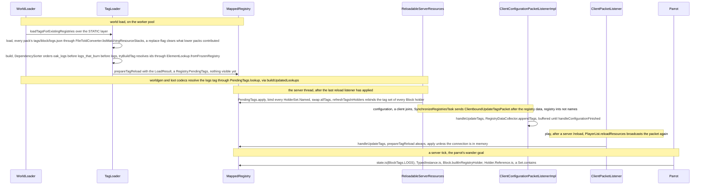

# Tags

> Verified against **Minecraft 26.2** · Part II · A parrot flies down through the canopy looking for a log to perch on, a moment after a data pack put a new block in the logs tag.

A parrot is looking for somewhere to sit. `Parrot.ParrotWanderGoal` scans
the blocks around it and asks the block state beneath each one a single
question, `state.is(BlockTags.LOGS)` — a leaves block it recognises by
class, a log only by tag. Nothing in that goal names oak, or spruce, or the
block a data pack added an hour ago; the tutorial toast that tells a new
player to punch a tree asks the same question. A tag is a named set of
registry entries, defined in data-pack JSON and tested against by key, and
it is how data reaches into hard-coded behaviour without the behaviour
naming any specific block. [The registries page](identifiers-and-registries.md)
ended on a promise: a frozen registry's *contents* never change. Its tags
do. Type `/reload` with a data pack that adds a block to *logs* and the
parrot perches on it a moment later — with `BuiltInRegistries.BLOCK` frozen
since before the title screen. The tag table is the one part of a frozen
registry that is swapped after the freeze, through `Registry.PendingTags`,
in three ordered steps with no lock: `MappedRegistry.prepareTagReload`
builds the new table off to the side, and `Registry.PendingTags.apply`
binds each `HolderSet.Named`, swaps the `MappedRegistry.TagSet`, then
rebinds every holder's tag set. It is safe because the server thread runs
it start to finish with nothing else looking, not because it is atomic.

## The cast

| class | what it decides | thread |
|---|---|---|
| `TagKey` | the name: a registry key and an `Identifier`, interned so equal keys are one object | any |
| `TagFile` · `TagEntry` | the on-disk shape: a list of entries, each an element or a reference to another tag, and the *replace* flag | — |
| `TagLoader` | reads every pack's copy of every file and resolves them in dependency order; what an id resolves to is its `TagLoader.ElementLookup` | Worker at world load, Server on `/reload` |
| `MappedRegistry` | the tag half: `MappedRegistry.frozenTags`, one `HolderSet.Named` per freeze-time key, and `MappedRegistry.allTags`, the bound `MappedRegistry.TagSet` | Server; Render on the client |
| `Registry.PendingTags` | a loaded table not yet installed, with a `Registry.PendingTags.lookup` that answers as if it were | built on a worker, applied on the owning thread |
| `HolderSet.Named` | one tag's contents, rebound in place on every reload | — |
| `Holder.Reference` | one element's own `Set` of `TagKey`s — the thing a membership test reads | — |
| `TagNetworkSerialization` | the wire form: tag id to a list of registry ints | Server encodes, client decodes |

## A tag is a key and a file

In code a tag is a `TagKey`: a record of the registry's `ResourceKey` and
an `Identifier`, interned through a weak interner so that `TagKey.create`
always returns the canonical instance and a membership test is a
set-contains on identity. The keys are declared once, in catalogues that
hold no contents — `BlockTags`, `ItemTags`, `EntityTypeTags`, `BiomeTags`,
`FluidTags` and their siblings, twenty files in `net/minecraft/tags`
including `DamageTypeTags`, `EnchantmentTags`, `StructureTags`,
`PoiTypeTags` and the two 26.2 arrivals `FeatureTags` and `TimelineTags`.
A key that a block and its item share is declared once as a
`BlockItemTagId` in `BlockItemTags` and projected into both catalogues:
`BlockTags.LOGS` is `BlockItemTags.LOGS.block()`.

On disk a tag is a `TagFile`: a list of `TagEntry` and a *replace* flag.
Each entry is an element id or a *#*-prefixed reference to another tag,
with a *required* flag that defaults to true. The file lives at
*data/\<namespace\>/tags/\<registry path\>/\<name\>.json* —
`Registries.tagsDirPath` builds that string in exactly one place, and there
is no plural-name fallback — so *tags/block*, *tags/item*,
*tags/entity_type*, *tags/worldgen/biome*. Vanilla's own files are written
by the data generator (`TagsProvider`, `TagBuilder`), which the running game
never calls, and players reach tags through the *#tag* syntax of
`ResourceOrTagArgument`, `ResourceOrTagKeyArgument` and
`ResourceSelectorArgument` (Part XIII).

Between the two sits `TagLoader`, generic over what an id resolves to: a
`Holder` for a registry, a `CommandFunction` for function tags. It has two
instance steps. `TagLoader.load` reads every pack's copy of every file into
lists of `TagLoader.EntryWithSource`; `TagLoader.build` resolves them in
dependency order, `TagLoader.tryBuildTag` doing one tag at a time through
the `TagLoader.ElementLookup` the loader was built with. Its output, a
`TagLoader.LoadResult`, is resolved but bound to nothing. Everything in
`net/minecraft/tags` ships in both jars. There is no *TagManager* in 26.2
and no reload listener for registry tags: loading is static functions on
`TagLoader`, called from `WorldLoader`, `MinecraftServer.reloadResources`,
`ReloadableServerRegistries` and the registry load tasks. Function tags
are the exception — `ServerFunctionLibrary` genuinely is a reload listener
and runs its own `TagLoader` inside it.

Inside a `MappedRegistry` a tag is two things. `MappedRegistry.frozenTags`
holds one canonical `HolderSet.Named` per key for the tags that existed
when the registry froze, and `MappedRegistry.allTags` is a
`MappedRegistry.TagSet`, the bound view, which starts out as
`MappedRegistry.TagSet.unbound`, where every read throws. Beside the
registry, each `Holder.Reference` carries its own `Set` of `TagKey`s, bound
by `Holder.Reference.bindTags`; that set, not the registry, is what
`Holder.Reference.is` reads.

## The four moments tags are loaded

World load comes first, on the worker pool.
`TagLoader.loadTagsForExistingRegistries` runs *before* the reload
listeners, over the `RegistryLayer.STATIC` layer, and produces a
`Registry.PendingTags` for every static registry that has at least one tag
file. The pending tables are made visible to worldgen and loot loading
through `TagLoader.buildUpdatedLookups`, and applied, one registry at a
time, in `ReloadableServerResources.updateComponentsAndStaticRegistryTags`
once every listener has finished. For the whole of a load the old tags are
what `Registry.getTags` answers and the new tags are what the loading
codecs see.

`/reload` is the same call on the server thread, handed the composite
access of `MinecraftServer.registries` — so it re-reads and re-applies tags
for the **dynamic** worldgen registries too, not only the static ones. Of
the loading paths only loot re-runs; a worldgen registry keeps its elements
and gets new tags.

A data-pack registry loads its tags inside its own load task.
`ResourceManagerRegistryLoadTask` reads them after its elements, with
`TagLoader.ElementLookup.fromGetters`, and `RegistryLoadTask.registerTags`
binds them under the registry's write lock before it freezes. The
reloadable layer has tags too: `ReloadableServerRegistries` calls
`TagLoader.loadTagsForRegistry` for every `LootDataType`.

The fourth moment is the client's. One `ClientboundUpdateTagsPacket`
covering every synced registry is sent by `SynchronizeRegistriesTask` after
the registry data. In configuration the client merely *buffers* it —
`ClientConfigurationPacketListenerImpl.handleUpdateTags` hands it to
`RegistryDataCollector.appendTags`, and nothing resolves until
configuration finishes. After a server `/reload`, `PlayerList.reloadResources`
broadcasts the same packet into the play phase, and
`ClientPacketListener.handleUpdateTags` applies that one at once.

## From JSON to a parrot's decision

**Every pack's file, lowest first.** `TagLoader.load` asks
[the resource system](resource-system.md) for resource *stacks* — a
`FileToIdConverter.json` over the tag directory, listed with
`FileToIdConverter.listMatchingResourceStacks` — so every copy of
*tags/block/logs.json* across the enabled packs is visited in priority
order and merged, and a *replace* in a higher pack discards what the lower
packs contributed to that id. A pack whose file fails to parse is
logged and skipped, never fatal.

**Tags of tags resolve in dependency order, and a tag with a hole is
dropped whole.** The vanilla *logs* file names no block at all: it is three
tag references, *logs_that_burn*, *crimson_stems* and *warped_stems*, and
*logs_that_burn* is in turn nine references, *oak_logs* among them, before
*oak_logs* finally lists four blocks. `TagLoader.build` feeds every tag
reference into a `DependencySorter` and resolves the leaves first. A tag
with **any** failing entry — a missing required element as much as a
missing required tag reference — is dropped whole, not loaded minus the
entry, and is then absent from `Registry.getTags`, so neither the network
payload nor a lookup will find it. Optional entries (*required: false*)
resolve to nothing. There is a wrinkle: for a **static** registry the
lookup is `TagLoader.ElementLookup.fromFrozenRegistry`, which ignores the
required flag entirely and simply asks the registry — so an unknown element
id kills the tag whether or not it was marked optional. Only the
`TagLoader.ElementLookup.fromGetters` path, used by data-pack registries,
honours the flag, by routing a required id through the registration lookup.

**Prepared, then applied.** This is where the hook pays off.
`MappedRegistry.prepareTagReload` refuses a registry that is not frozen and
builds the new table, reusing existing `HolderSet.Named` objects where it
can; nothing is visible yet, and the `Registry.PendingTags.lookup` it hands
back answers as if the new table were installed, which is what the worldgen
and loot codecs are given while they load. `Registry.PendingTags.apply` is
then **three ordered steps**: bind each `HolderSet.Named`, swap the
`MappedRegistry.TagSet`, then rebind every holder's tag set. There is no
lock and no single-reference swap; it is safe because the server thread
runs it start to finish with nothing else looking, not because it is
atomic.

**The client gets integers.**
`TagNetworkSerialization.serializeTagsToNetwork` walks
`RegistrySynchronization.networkSafeRegistries` and writes each tag as a
list of registry ids, dropping any registry whose payload came out empty.
That set is *every* `RegistryLayer.STATIC` registry, unconditionally,
concatenated with the synced dynamic ones —
`RegistrySynchronization.isNetworkable` filters only the second group. Ids
for dynamic registries are meaningful only once both sides have built the
same registry in the same order, which is why `SynchronizeRegistriesTask`
sends the registry data first. In the configuration phase that ordering is
a *send*-order constraint rather than a handling one: the client buffers
both packets and resolves everything at the end. The play-phase packet
resolves immediately against the live registry access, and the client then
rebuilds its fuel table and the creative-inventory search tree from the new
tags.

**Singleplayer skips only what it already has.** On the play path
`ClientPacketListener.handleUpdateTags` always prepares, and skips only the
*apply* on a memory connection, because the integrated server's apply
already rebound the `BuiltInRegistries` both halves share. In configuration
the suppression is narrower still: only the non-networkable (static)
registries' tags are skipped, and the client still binds tags on its own
copies of the remote dynamic registries.

**The check is a field read.** `BlockBehaviour.BlockStateBase` is a
`TypedInstance`; `TypedInstance.is` asks the type holder — for a block,
`Block.builtInRegistryHolder`, the intrusive holder from
[identifiers-and-registries](identifiers-and-registries.md) — and
`Holder.Reference.is` is set-contains on an interned `TagKey`. No registry
is consulted. `Parrot` (the perch search), `TrunkPlacer` (worldgen) and the
client's `PunchTreeTutorialStepInstance` all ask this way; `FluidState`,
`Entity` and `ItemStack` go through the same interface.

## The other way tags cross the wire

`ClientboundUpdateTagsPacket` is not the only one. `ByteBufCodecs.holderSet`
encodes a `HolderSet.Named` as a marker plus the tag's `Identifier`, and
decodes it by looking the tag up in the receiving side's registry — so any
packet or data component carrying a tag-shaped `HolderSet` **hard-fails on
a client that does not have that tag**. That, more than the id numbering,
is why the tags packet must reach the client before play traffic does.

The same idea appears in data: `TagKey.hashedCodec`, `HolderSetCodec` and
`RegistryCodecs` are what turn *"#minecraft:logs"* in an ordinary JSON field
— a recipe ingredient, a loot condition, a placement predicate — into a
`HolderSet` without any of those files being tag files.

## Questions players ask

**Is a tag empty or broken before a world is open?** Empty, not fatal.
`BuiltInRegistries` binds to empty only the tags the bootstrap actually
asked for through its registration lookup; every other tag is simply absent
from the table, so `Registry.get` for it answers empty and
`state.is(BlockTags.LOGS)` answers **false**. The window in which a tag
read genuinely *throws* is narrower than it looks: it is during
`BuiltInRegistries.bootStrap` itself, before `MappedRegistry.freeze`
installs a bound `MappedRegistry.TagSet`. The two throws even come from
different places — an unbound `Holder.Reference` complains that tags are
not bound, while `MappedRegistry.TagSet.unbound` guards the registry-level
lookups.

**Can a tag name something from another registry, or something that does
not exist yet?** Never the first: a `TagEntry` carries only an
`Identifier`, and the registry is fixed by the directory the file is in.
The second, on one path: a data-pack tag *can* name an element that has
not loaded yet, because the required path creates a placeholder
`Holder.Reference` through `MappedRegistry.createRegistrationLookup`, and
the registry's freeze fails with unbound values if the element never
arrives. That escape hatch exists only on the data-pack path, never for a
static registry.

**Is the `HolderSet` I captured still the right object after `/reload`?**
Only if the tag existed when the registry froze.
`MappedRegistry.prepareTagReload` reuses a `HolderSet.Named` from
`MappedRegistry.frozenTags` when it finds one, but a tag that first appears
*after* the registry froze is created fresh into the pending map and never
written back — so it gets a brand-new `HolderSet.Named` on every subsequent
reload. A recipe ingredient that captured a vanilla tag at load time is
correct after `/reload` without re-lookup; one that captured a data-pack
tag may be holding a stale object.

**What happens to a tag a reload deleted?** It keeps its old contents. It
is absent from the pending map, so apply neither rebinds nor clears it.
Anything still holding that `HolderSet.Named` will *iterate* the old list
while `HolderSet.Named.contains` — which delegates to the holder's
refreshed tag set — answers false, and `Registry.get` for the key answers
empty.

**What if two tags reference each other?** The cycle is broken silently.
`DependencySorter.addDependencyIfNotCyclic` drops any edge that would close
a cycle, so *a* referencing *b* referencing *a* loads in an arbitrary order
with no diagnostic at all.

**Which tags does the client never hear about?** Those of
`RegistryLayer.RELOADABLE`-layer registries (loot tables, predicates) and
of non-synced worldgen registries (configured features, structures) — even
though those tags exist and are loaded. On the receiving side, ids the
client's registry does not know are dropped from the payload silently.

**Is picking a random element from a tag deterministic?** Yes, per pack
stack. Duplicate entries collapse and file order is preserved —
`TagLoader.tryBuildTag` collects into an insertion-ordered set — so
iterating a tag, or picking from it with `HolderSet.getRandomElement`,
gives the same sequence for the same packs.

**Why do function tags look different from every other kind?** Because
they are. `ServerFunctionLibrary` runs its own `TagLoader` over
`CommandFunction`s, inside a real reload listener, with no registry
involved; the well-known keys `ServerFunctionManager.TICK_FUNCTION_TAG` and
`ServerFunctionManager.LOAD_FUNCTION_TAG` live on the manager, not the
library (see Part XIII).

## Where to look

`TagKey` · `BlockItemTags` · `BlockTags` · `TagFile` · `TagEntry` ·
`TagLoader` · `MappedRegistry` (the tag half) · `Registry.PendingTags` ·
`HolderSet` · `DependencySorter` · `WorldLoader` · `ReloadableServerResources` ·
`TagNetworkSerialization` · `ClientboundUpdateTagsPacket` ·
`ClientConfigurationPacketListenerImpl` · `ClientPacketListener` ·
`RegistryDataCollector` · `ByteBufCodecs` · `TypedInstance` ·
`Parrot.ParrotWanderGoal`

---

*Rules: names, never code · how the system works, not how the code reads ·
newest version only · every backticked name passes `tools/verify_names.py`.*
