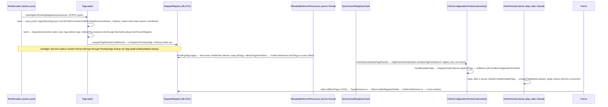

# Tags

> Verified against **Minecraft 26.2** · Part II · `#minecraft:logs` from a JSON file in a data pack to the `HolderSet` a parrot checks before it perches.

## Responsibility

A tag is a named set of registry entries, defined in data-pack JSON, that
code tests membership against by key. Blocks that count as logs, items that
can be enchanted with Sharpness, biomes where villages spawn, entity types
that arrows pass through — all are tags, and all are one `TagKey` constant in
code plus one file per pack. Tags are how vanilla data reaches into
hard-coded behaviour without the behaviour naming any specific block.

The one sentence a player recognises: *an axe strips anything in
`#minecraft:logs`, and a data pack can put a new block in that set.*

## The data it owns

- `TagKey` — a record of the registry key and an `Identifier`, **interned**
  through a weak interner so `TagKey.create` always returns the canonical
  instance; membership tests are set-contains on identity.
  `BlockTags`, `ItemTags`, `EntityTypeTags`, `BiomeTags`, `FluidTags` and
  their siblings are catalogues of keys and hold no contents — twenty such
  files in `net/minecraft/tags`, including `DamageTypeTags`,
  `EnchantmentTags`, `StructureTags`, `PoiTypeTags` and the two 26.2 arrivals
  `FeatureTags` and `TimelineTags`. Keys shared by a block and its item are
  declared once as a `BlockItemTagId` in `BlockItemTags` and projected into
  both (`BlockTags.LOGS` is `BlockItemTags.LOGS.block()`).
- `TagFile` — the on-disk shape: a list of `TagEntry` and a "replace" flag.
  A `TagEntry` is an element id, a `#`-prefixed reference to another tag, and
  a "required" flag (default true).
- `TagLoader` — the loader, generic over what it resolves to (a `Holder` for
  registries, a `CommandFunction` for function tags). Two instance steps,
  `TagLoader.load` (read every pack's copy of every file into
  `TagLoader.EntryWithSource` lists) and `TagLoader.build` (resolve, in
  dependency order, with `TagLoader.tryBuildTag` doing one tag at a time).
  Its `TagLoader.ElementLookup` decides how an id becomes an element;
  `TagLoader.LoadResult` is the resolved-but-unbound output.
- Inside a `MappedRegistry`: `MappedRegistry.frozenTags` holds one canonical
  `HolderSet.Named` per key **for the tags that existed when the registry
  froze**, and `MappedRegistry.allTags` is a `MappedRegistry.TagSet` that
  starts out `MappedRegistry.TagSet.unbound`, where every read throws. Each
  `Holder.Reference` carries its own `Set` of `TagKey`s, bound by
  `Holder.Reference.bindTags`; that set is what `Holder.Reference.is` reads.
- `Registry.PendingTags` — a loaded-but-not-applied tag table for one frozen
  registry, with a `Registry.PendingTags.lookup` that answers as if applied
  and a `Registry.PendingTags.apply` that installs it.
- `TagNetworkSerialization.NetworkPayload` — the wire form: tag id → list of
  registry **ints**.

Everything in `net/minecraft/tags` ships in both jars. There is no *TagManager*
in 26.2 and no reload listener for *registry* tags; loading is static functions
on `TagLoader` called from `WorldLoader`, `MinecraftServer.reloadResources`,
`ReloadableServerRegistries` and the registry load tasks. (Function tags are
the exception — `ServerFunctionLibrary` genuinely is a reload listener and
runs its own `TagLoader` inside it.)

## When it runs

- **World load, on the worker pool.** `TagLoader.loadTagsForExistingRegistries`
  runs *before* the reload listeners over the `RegistryLayer.STATIC` layer,
  producing `Registry.PendingTags` for every static registry **that has at
  least one tag file**. The pending lookups are made visible to worldgen and
  loot loading through `TagLoader.buildUpdatedLookups`. They are applied, per
  registry, in `ReloadableServerResources.updateComponentsAndStaticRegistryTags`
  after every listener has finished. For the duration of a load the old tags
  are what `Registry.getTags` answers and the new tags are what the loading
  codecs see.
- **`/reload`, on the server thread.** The same call, but handed
  `MinecraftServer.registries`' composite access — so `/reload` re-reads and
  re-applies tags for the **dynamic** worldgen registries too, not only the
  static ones. Of the loading paths, only loot re-runs; worldgen registries
  keep their elements and get new tags.
- **Data-pack registries, inside their own load task.** Tags for a biome or
  enchantment registry are loaded by `ResourceManagerRegistryLoadTask`
  after its elements, with `TagLoader.ElementLookup.fromGetters`, and bound
  by `RegistryLoadTask.registerTags` under the registry's write lock before
  it freezes. The reloadable layer has tags too:
  `ReloadableServerRegistries` calls `TagLoader.loadTagsForRegistry` for
  every `LootDataType`.
- **Configuration phase, buffered; after `/reload`, applied at once.** One
  `ClientboundUpdateTagsPacket` covering every synced registry, sent by
  `SynchronizeRegistriesTask` after the registry data. In configuration the
  client merely *buffers* it —
  `ClientConfigurationPacketListenerImpl.handleUpdateTags` hands it to
  `RegistryDataCollector.appendTags` and nothing resolves until configuration
  finishes. The play-phase re-broadcast from `PlayerList.reloadResources` is
  the one `ClientPacketListener.handleUpdateTags` sees, and that one applies
  immediately.

## The trace: `#minecraft:logs` from JSON to a block check

Narrated:

1. **Every pack's file, lowest first.** `TagLoader.load` lists resource
   *stacks* (through `FileToIdConverter.listMatchingResourceStacks`), so all
   copies of `tags/block/logs.json` across the enabled packs are visited in
   priority order and merged; a "replace" in a higher pack discards what
   lower packs contributed to that id. A pack whose file fails to parse is
   logged and skipped, never fatal.
2. **Tags of tags resolve in dependency order.** `BlockTags.LOGS` is a tag
   whose entries are other tags (`#minecraft:oak_logs` …). `TagLoader.build`
   feeds tag references into a `DependencySorter` and resolves leaves first.
   A tag with **any** failing entry — a missing required element as much as a
   missing required tag reference — is dropped whole, not loaded minus the
   entry, and is then absent from `Registry.getTags`, so neither the network
   payload nor a lookup will find it. Optional entries (`"required": false`)
   resolve to nothing. There is a wrinkle: for a **static** registry the
   lookup is `TagLoader.ElementLookup.fromFrozenRegistry`, which ignores the
   required flag entirely and simply asks the registry — so an unknown
   element id kills the tag whether or not it was marked optional. Only the
   `TagLoader.ElementLookup.fromGetters` path, used by data-pack registries,
   honours the flag by routing a required id through the registration lookup.
3. **Prepared, then applied.** `MappedRegistry.prepareTagReload` refuses a
   registry that is not frozen and builds the new table, reusing existing
   `HolderSet.Named` objects where it can. `Registry.PendingTags.apply` is
   **three ordered steps**: bind each `HolderSet.Named`, swap the
   `MappedRegistry.TagSet`, then rebind every holder's tag set. There is no
   lock and no single-reference swap; it is safe because the server thread
   runs it start to finish with nothing else looking, not because it is
   atomic.
4. **The client gets integers.** `TagNetworkSerialization.serializeTagsToNetwork`
   walks `RegistrySynchronization.networkSafeRegistries` and writes each tag
   as a list of registry ids, dropping any registry whose payload came out
   empty. That set is *every* `RegistryLayer.STATIC` registry, unconditionally,
   concatenated with the synced dynamic ones —
   `RegistrySynchronization.isNetworkable` filters only the second group. Ids
   for dynamic registries are meaningful only once both sides have built the
   same registry in the same order, which is why
   `SynchronizeRegistriesTask` sends the registry data first. In the
   configuration phase that ordering is a *send*-order constraint rather than
   a handling one: the client buffers both packets and resolves everything at
   the end. The play-phase packet resolves immediately against the live
   registry access.
5. **Singleplayer skips only what it already has.** On the play path
   `ClientPacketListener.handleUpdateTags` always prepares, and skips only
   the *apply* on a memory connection, because the integrated server's apply
   already rebound the `BuiltInRegistries` both halves share. In
   configuration the suppression is narrower still: only the non-networkable
   (static) registries' tags are skipped, and the client still binds tags on
   its own copies of the remote dynamic registries.
6. **The check is a field read.** `BlockBehaviour.BlockStateBase` is a
   `TypedInstance`; `TypedInstance.is` asks the type holder — for a block,
   `Block.builtInRegistryHolder`, the intrusive holder from
   [identifiers-and-registries](identifiers-and-registries.md) — and
   `Holder.Reference.is` is set-contains on an interned `TagKey`. `Parrot`
   (perch search), `TrunkPlacer` (worldgen) and the client's
   `PunchTreeTutorialStepInstance` all ask this way. `FluidState`, `Entity`
   and `ItemStack` go through the same interface.

## The other way tags cross the wire

`ClientboundUpdateTagsPacket` is not the only one. `ByteBufCodecs.holderSet`
encodes a `HolderSet.Named` as a marker plus the tag's `Identifier`, and
decodes it by looking the tag up in the receiving side's registry — so any
packet or data component carrying a tag-shaped `HolderSet` **hard-fails on a
client that does not have that tag**. That, more than the id numbering, is
why the tags packet must reach the client before play traffic does.

The same idea appears in data: `TagKey.hashedCodec`, `HolderSetCodec` and
`RegistryCodecs` are what turn `"#minecraft:logs"` in an ordinary JSON field
— a recipe ingredient, a loot condition, a placement predicate — into a
`HolderSet` without any of those files being tag files.

## Interfaces

- **Called by:** `WorldLoader.load` and `MinecraftServer.reloadResources`
  (static and, on reload, dynamic registries), `ResourceManagerRegistryLoadTask`
  and `ReloadableServerRegistries.reload` (dynamic and reloadable registries),
  `ServerFunctionLibrary` (function tags, the one non-registry user),
  `RegistryDataCollector` and both client packet listeners.
- **Calls into:** the resource system for files (`FileToIdConverter.json`,
  page [resource-system](resource-system.md)); `DependencySorter` for
  ordering; the registry for binding.
- **Crosses the network as:** `ClientboundUpdateTagsPacket`, a map of
  registry key → `TagNetworkSerialization.NetworkPayload`, in configuration
  and again in play after a server `/reload`; and implicitly inside any
  packet whose payload contains a tag-shaped `HolderSet`.
- **Data-driven by:** `data/<namespace>/tags/<registry path>/<name>.json`
  (`Registries.tagsDirPath`), so *tags/block*, *tags/item*,
  *tags/entity_type*, *tags/worldgen/biome*. There is no plural-name
  fallback in the loader — that string is built in exactly one place.
  Vanilla's files are written by the data generator (`TagsProvider`,
  `TagBuilder`), which the running game never calls. Players reach tags
  through `ResourceOrTagArgument`, `ResourceOrTagKeyArgument` and
  `ResourceSelectorArgument` — the `#tag` syntax in commands (Part XIII).

## Invariants and surprises

- **Between bootstrap and world load a tag is empty, not fatal.**
  `BuiltInRegistries` binds to empty only the tags the bootstrap actually
  asked for through its registration lookup; every other tag is simply absent
  from the table, so `Registry.get` for it answers empty and
  `state.is(BlockTags.LOGS)` answers **false**. The window in which a tag
  read genuinely *throws* is narrower than it looks: it is during
  `BuiltInRegistries.bootStrap` itself, before `MappedRegistry.freeze`
  installs a bound `MappedRegistry.TagSet`. The two throws even come from
  different places — an unbound `Holder.Reference` complains that tags are
  not bound, while `MappedRegistry.TagSet.unbound` guards the registry-level
  lookups.
- **A tag can only name elements of its own registry.** `TagEntry` carries
  an `Identifier`; the registry is fixed by the directory the file is in.
  It *can* name a data-pack element that has not loaded yet: the required
  path creates a placeholder `Holder.Reference` through
  `MappedRegistry.createRegistrationLookup`, and the registry's freeze fails
  with unbound values if the element never arrives. That escape hatch exists
  only on the data-pack path, never for a static registry.
- **Identity is stable for tags that existed at freeze time — and only
  those.** `MappedRegistry.prepareTagReload` reuses a `HolderSet.Named` from
  `MappedRegistry.frozenTags` when it finds one, but a tag that first appears
  *after* the registry froze is created fresh into the pending map and never
  written back — so it gets a brand-new `HolderSet.Named` on every subsequent
  reload. A recipe ingredient that captured a vanilla tag at load time is
  correct after `/reload` without re-lookup; one that captured a data-pack
  tag may be holding a stale object.
- **A tag deleted by a reload keeps its old contents.** It is absent from the
  pending map, so apply neither rebinds nor clears it. Anything still holding
  that `HolderSet.Named` will *iterate* the old list while
  `HolderSet.Named.contains` — which delegates to the holder's refreshed tag
  set — answers false, and `Registry.get` for the key answers empty.
- **Tag cycles are broken silently.** `DependencySorter.addDependencyIfNotCyclic`
  drops any edge that would close a cycle, so `#a → #b → #a` loads in an
  arbitrary order with no diagnostic at all.
- **What the client is never told:** tags of `RegistryLayer.RELOADABLE`-layer
  registries (loot tables, predicates) and of non-synced worldgen registries
  (configured features, structures) — even though those tags exist and are
  loaded. On the receiving side, ids the client's registry does not know are
  dropped from the payload silently.
- **Duplicate entries collapse and file order is preserved** —
  `TagLoader.tryBuildTag` collects into an insertion-ordered set — so
  iterating a tag, or picking from it with `HolderSet.getRandomElement`, is
  deterministic per pack stack.
- **Function tags are the odd one out.** `ServerFunctionLibrary` runs its
  own `TagLoader` over `CommandFunction`s, inside a real reload listener,
  with no registry involved; the well-known keys
  `ServerFunctionManager.TICK_FUNCTION_TAG` and
  `ServerFunctionManager.LOAD_FUNCTION_TAG` live on the manager, not the
  library (see Part XIII).

## Where to look

`TagKey` · `BlockItemTags` · `BlockTags` · `TagFile` · `TagEntry` ·
`TagLoader` · `MappedRegistry` (the tag half) · `Registry.PendingTags` ·
`HolderSet` · `DependencySorter` · `WorldLoader` · `ReloadableServerResources` ·
`TagNetworkSerialization` · `ClientboundUpdateTagsPacket` ·
`ClientConfigurationPacketListenerImpl` · `ClientPacketListener` ·
`RegistryDataCollector` · `ByteBufCodecs` · `TypedInstance`

---

*Rules: names, never code · how the system works, not how the code reads ·
newest version only · every backticked name passes `tools/verify_names.py`.*
