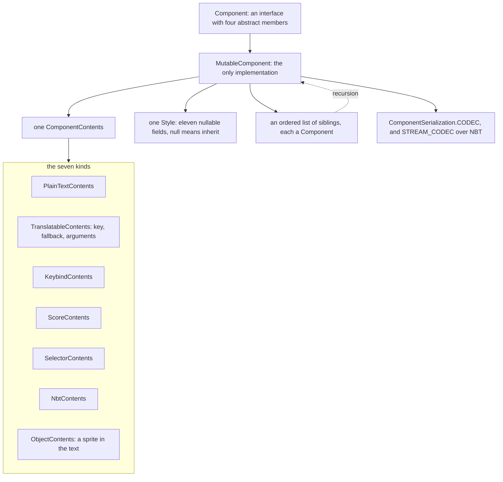
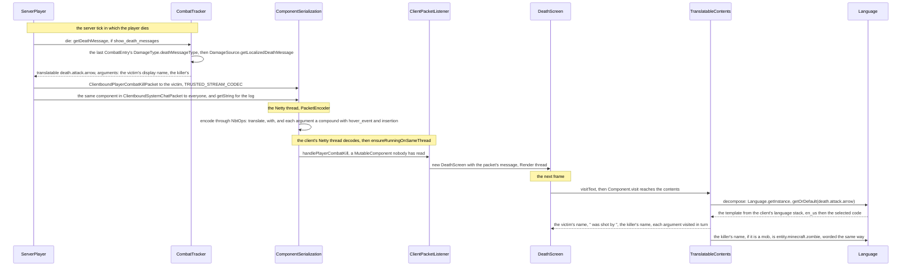

# Text components

> Verified against **Minecraft 26.2** · Part II · A player dies: the message that names the killer is built on the server, crosses the wire as a translation key, and is worded on the client.

An arrow lands and a player drops. A line appears in everyone's chat, and
on the victim's screen the death screen says who did it. The server built
that message on its own thread, inside `CombatTracker.getDeathMessage`,
and sent it twice: once in `ClientboundPlayerCombatKillPacket` to the
victim, once as system chat to everybody. But the server never wrote the
sentence. What it built was a `Component` whose contents are a translation
key — *death.attack.arrow* — and two arguments, the victim's name and the
killer's, each of them another `Component` carrying a hover card and a
click action. The packet crosses the wire as NBT. On the client the packet
is decoded, handed to a `DeathScreen`, and still nobody has read the key.
**The client receives the death message before anyone knows what it says.**
The words are chosen on the first frame that draws it, when
`TranslatableContents` asks the client's own `Language` for the template
behind the key, so two players watching the same death read two
different sentences from one packet — and the server, which logs the
message too, only ever reads it in English.

## The cast

| class | what it decides | thread |
|---|---|---|
| `Component` | the interface: contents, style, siblings, and a walk over them in logical order | built wherever text is made — a server tick, a command, the Render thread |
| `MutableComponent` | the only implementation; `MutableComponent.append` and `MutableComponent.withStyle` are how a tree is built | as above |
| `ComponentContents` · `TranslatableContents` | what a node *says*: seven kinds, of which the translatable kind is the one that waits for a `Language` | worded on whichever thread first visits it |
| `Style` | the eleven inheritable fields, immutable, `Style.EMPTY` the shared blank | any |
| `ComponentSerialization` | the one recursive codec, and the NBT stream codecs built over it | Netty, in `PacketEncoder` and `PacketDecoder`; Server or Render for data on disk |
| `ComponentUtils` | `ComponentUtils.resolve`: selectors, scores and NBT paths into text, against a `ResolutionContext` | Server, during command execution |
| `Language` | a key to a template; the client swaps the instance on every resource reload | Render thread reads it, `Language.inject` swaps it |
| `ClickEvent` | what a click on styled text may do, and the one action a server may not send | Render thread, when the click lands |

## A component is three things

`Component` is an interface with four abstract members —
`Component.getStyle`, `Component.getContents`, `Component.getSiblings` and
`Component.getVisualOrderText`, the last of which is why `MutableComponent`
caches a laid-out form — and exactly **one** implementation,
`MutableComponent`. A component is a triple: one `ComponentContents`, one
`Style`, and an ordered list of sibling components. Style inheritance
happens during traversal, not in storage: `Component.visit` applies a
node's own style over its parent's with `Style.applyTo` and hands the
result down to the contents and then to each sibling in turn, so a red
parent with a plain child draws the child red, and nothing in the child
records it. The mutability is in the name. `Component.literal`,
`Component.translatable` and the other factories return a
`MutableComponent`, and a tree is built by `MutableComponent.append` and
`MutableComponent.withStyle`, which replace the style field with a fresh
`Style` each time. `Component.copy` is a shallow copy — the sibling list is
new, the siblings are shared.

The walk is the only way to read one. `Component.getString` visits every
node and concatenates what it says; `Component.getString` with a limit stops
at that many characters, which is how a death message too long to send is
cut to 256 for its replacement. Everything from the walk onwards — the
codepoint stream, bidirectional reordering, glyphs — belongs to
[text and fonts](../client/text-and-fonts.md).

## The seven kinds of contents

Each kind has a static factory on `Component`:

| kind | class | made by |
|---|---|---|
| text | `PlainTextContents`, with `PlainTextContents.LiteralContents` | `Component.literal` |
| translatable | `TranslatableContents` | `Component.translatable` |
| keybind | `KeybindContents` | `Component.keybind` |
| score | `ScoreContents` | `Component.score` |
| selector | `SelectorContents` | `Component.selector` |
| nbt | `NbtContents` | `Component.nbt` |
| object | `ObjectContents` | `Component.object` |

### What each kind says, and when

**Text** says its string and nothing more; the empty string is the shared
`PlainTextContents.EMPTY`, which is what `Component.empty` and
`CommonComponents.EMPTY` hold.

**Translatable** is a key, an optional fallback and an array of
arguments. An argument is a number, a boolean, a string or another
`Component` — `TranslatableContents.isAllowedPrimitiveArgument` is the
test, and `Component.translatableEscape` turns anything else into its
string form before it can reach the codec. The template the key names is
read by `TranslatableContents.decompose`, which accepts only `%s`, `%n$s`
and `%%`: any other specifier is a `TranslatableFormatException`, and the
component then shows the raw template string instead. The decomposition is
cached against the identity of the `Language` that produced it
(`TranslatableContents.decomposedWith`), so a language switch re-words every
component the next time it is visited, without anything being re-sent.

**Keybind** names a key binding and asks `KeybindResolver.keyResolver` for
its current name; the default resolver answers with the name itself, and
the client installs `KeyMapping.createNameSupplier` in the `Minecraft`
constructor, so *key.jump* reads as whatever key is bound on a client and
as *key.jump* anywhere else.

**Score**, **selector** and **nbt** are the three kinds that say nothing
until a server resolves them. A score names a holder — an entity selector,
a literal name, or `ScoreHolder.WILDCARD` for the context's own entity —
and an objective. A selector holds a compiled `EntitySelector` and an
optional separator; visited unresolved, it shows the selector's source
text. An nbt component holds an `NbtPathArgument.NbtPath`, a separator, and
one of three `DataSource`s — `EntityDataSource`, `BlockDataSource`,
`StorageDataSource` — and either prints what it finds through
`TextComponentTagVisitor` or, with *interpret*, parses each match as a
component; *interpret* and *plain* are refused together. Visited without
resolution, score and nbt contents say nothing at all.

**Object** puts a picture inside text. Its `ObjectInfo` is an
`AtlasSprite` (an atlas and a sprite, the block atlas by default) or a
`PlayerSprite` (a `ResolvableProfile` and whether to draw the hat). When
visited with a style it emits a single placeholder character, U+FFFC, with
the style's font set to the info's `FontDescription`; the font system draws
the sprite where a glyph would go. Visited without style —
`Component.getString`, a log line — it says its fallback, or
`ObjectInfo.defaultFallback`: *[sprite]*
for an atlas sprite, *[name head]* for a player.

## Style, and the click that never crosses

`Style` holds eleven nullable fields: `Style.color` (a `TextColor`),
`Style.shadowColor`, the five booleans — `Style.bold`, `Style.italic`,
`Style.underlined`, `Style.strikethrough`, `Style.obfuscated` —
`Style.clickEvent`, `Style.hoverEvent`, `Style.insertion` and `Style.font`
(a `FontDescription`). Null means *inherit*, which is what makes
`Style.applyTo` a merge: a field the child sets wins, a field it leaves
null falls through to the parent. Every setter returns a new `Style`, and
the codec and the setters collapse a style with nothing left set to the
shared `Style.EMPTY`, so `Style.isEmpty` is an identity check. `ChatFormatting`
is the legacy vocabulary — `Style.applyFormat` sets one boolean or, for a
colour code, `TextColor.fromLegacyFormat`, and `ChatFormatting.RESET`
returns `Style.EMPTY` outright.

A `TextColor` is 24 bits, masked on construction, and serialises as one of
its sixteen names or as *#RRGGBB*; `TextColor.parseColor` accepts either.
The shadow is different: `Style.shadowColor` is a 32-bit ARGB integer,
`Style.NO_SHADOW` is zero, and `Style.withoutShadow` is how a component asks
to be drawn flat. `Style.font` is a `FontDescription`, which may be a
`FontDescription.Resource` naming a font file, or one of the two sprite
shapes that `ObjectContents` uses — it need not name a font at all.

### Eight clicks, three hovers, one refusal

`ClickEvent` and `HoverEvent` are interfaces implemented by nested records
— closed by convention and by their `Action` dispatch codec, not by the
language. There are eight click actions and three hover actions:

| `ClickEvent.Action` | record | carries | a server may send it |
|---|---|---|---|
| `ClickEvent.Action.OPEN_URL` | `ClickEvent.OpenUrl` | a URI, through `ExtraCodecs.UNTRUSTED_URI` | ✓ |
| `ClickEvent.Action.OPEN_FILE` | `ClickEvent.OpenFile` | a path on the viewer's disk | **no** |
| `ClickEvent.Action.RUN_COMMAND` | `ClickEvent.RunCommand` | a command string | ✓ |
| `ClickEvent.Action.SUGGEST_COMMAND` | `ClickEvent.SuggestCommand` | a string for the chat box | ✓ |
| `ClickEvent.Action.SHOW_DIALOG` | `ClickEvent.ShowDialog` | a `Holder` of a `Dialog` | ✓ |
| `ClickEvent.Action.CHANGE_PAGE` | `ClickEvent.ChangePage` | a positive page number | ✓ |
| `ClickEvent.Action.COPY_TO_CLIPBOARD` | `ClickEvent.CopyToClipboard` | a string | ✓ |
| `ClickEvent.Action.CUSTOM` | `ClickEvent.Custom` | an `Identifier` and an optional NBT payload, for servers to define | ✓ |

What keeps `ClickEvent.Action.OPEN_FILE` out of a server's hands is
`ClickEvent.Action.filterForSerialization`, applied as a validation on
`ClickEvent.Action.CODEC` and therefore biting in **both** directions and
in **every** format: a data pack cannot write one either, and the client
cannot encode one it built itself. The private flag behind it is
`ClickEvent.Action.allowFromServer`. The unfiltered
`ClickEvent.Action.UNSAFE_CODEC` exists and nothing outside the enum reads
it; an open-file click is something only client code constructs in memory —
`Screenshot`'s notice, a debug dump's path in `KeyboardHandler`, a
profiler result in `Minecraft` — for its own chat. `HoverEvent.Action` has the identical machinery and
nothing to filter — all three of its values are allowed:
`HoverEvent.ShowText` wraps a component, `HoverEvent.ShowItem` an
`ItemStackTemplate`, `HoverEvent.ShowEntity` an
`HoverEvent.EntityTooltipInfo` of type, UUID and optional name.

## Serialisation: one codec, three shapes

**Serialisation** is one recursive codec, `ComponentSerialization.CODEC`,
whose shape is a three-way choice: a bare string becomes a literal, a list
becomes its first element with the rest appended, and an object is the
full record. Contents are matched by an explicit *type* field if one is
present and otherwise by trying each contents codec in turn — which is why
an untyped component still round-trips. `Component.tryCollapseToString` is
what lets a plain unstyled literal encode as a bare string.

The full record is flat. `Style.Serializer.MAP_CODEC` is inlined, so the
style's keys — *color*, *shadow_color*, *bold*, *italic*, *underlined*,
*strikethrough*, *obfuscated*, *click_event*, *hover_event*, *insertion*,
*font* — sit beside the contents' own keys, and the siblings are a
non-empty list under *extra*. The seven contents codecs are registered in
an `ExtraCodecs.LateBoundIdMapper` under the names in the table above, and
`ComponentSerialization.createLegacyComponentMatcher` builds the matcher
that the object and data-source kinds reuse for their own *object* and
*source* fields. In JSON and NBT, encoding never writes a *type*: each
kind is written with its own distinguishing key (*text*, *translate*,
*keybind*, *score*, *selector*, *nbt*, and a sprite's *sprite* or
*player*), and a decoder recognises it by that key. A translatable
argument that decodes to a plain unstyled literal is collapsed back to a
string argument, so the argument list round-trips by meaning rather than
by shape.

### On the wire: NBT, and two budgets

On the wire, **components travel as NBT, not JSON**:
`ComponentSerialization.STREAM_CODEC` is built over the NBT ops — it is
`ByteBufCodecs.fromCodecWithRegistries`, which encodes through `NbtOps`
with the buffer's `RegistryOps` and writes the resulting `Tag`, and on
decode reads a `Tag` under an `NbtAccounter` and parses it back. The
accounter is the difference between the two families:
`NbtAccounter.defaultQuota` allows two mebibytes at depth 512, and the
trusted variants — `ComponentSerialization.TRUSTED_STREAM_CODEC` and its
siblings, built with `ByteBufCodecs.fromCodecWithRegistriesTrusted` over
`NbtAccounter.unlimitedHeap` — lift the NBT budget, and **every clientbound
chat packet uses them**
([packets and stream codecs](../networking/packets-and-stream-codecs.md)).
So does everything else a server authors: the death packet, entity custom
names through `EntityDataSerializers.OPTIONAL_COMPONENT`, score displays,
painting titles, command-suggestion tooltips. The budgeted codec is what
the two component-typed data components use — `DataComponents.CUSTOM_NAME`
and `DataComponents.ITEM_NAME` are synchronised with it — and those are
the components a creative player's stack carries serverbound. A third shape,
`ComponentSerialization.TRUSTED_CONTEXT_FREE_STREAM_CODEC`, needs no
registries and carries the texts that must decode before a registry
exists: `ClientboundDisconnectPacket`, the MOTD in
`ClientboundServerDataPacket`, a resource-pack prompt, server links. And
`ComponentSerialization.flatRestrictedCodec` caps a component by the length
of its JSON form; `WrittenBookContent.CONTENT_CODEC` uses it at 32,767 for
a page.

## Resolution: what a server does to a component before it sends it

Resolution — turning selectors, scores and NBT paths into text — is
`ComponentUtils.resolve` against a `ResolutionContext`, which carries the
command source, a depth limit and a `ResolutionContext.LimitBehavior`. The
walk copies the tree: `ComponentContents.resolve` returns a copy by default
and is overridden by the score, selector, nbt and object kinds, and by the
translatable kind, which resolves each component argument; siblings are
resolved after the contents, and a `HoverEvent.ShowText` inside a style is
resolved too. Past the depth limit — 100 by default —
`ResolutionContext.LimitBehavior.STOP_PROCESSING_AND_COPY_REMAINING` copies
the rest untouched and `ResolutionContext.LimitBehavior.DISCARD_REMAINING`
puts `CommonComponents.ELLIPSIS` in its place. A context with no command
source resolves score, selector and nbt contents to empty. The context also
carries an `ObjectInfo` validator: `ResolutionContext.validate` swaps a
rejected sprite for its fallback, which is how `ServerStatusPinger`
sanitises a server-list MOTD on the *client* — depth 16, discard past it,
and no player heads.

**Ordinary chat never resolves anything**: the content of a
`ServerboundChatPacket` is a plain string all the way to
`Component.literal`. Commands are the exception —
`MessageArgument.Message.toComponent` expands entity selectors inside a
message argument, behind a permission, which is why `/say @a` names people
and a chat line saying the same thing does not. The resolved text becomes
the message's *unsigned* content. The mechanics: `MessageArgument.Message.parseText`
refuses more than 256 characters and, if the source may use selectors at
all (`EntitySelectorParser.allowSelectors`), parses every `@` into a
`MessageArgument.Part`; at execution the permission is
`Permissions.COMMANDS_ENTITY_SELECTORS`, and each part becomes
`EntitySelector.joinNames` of what it finds. A raw component argument —
`/tellraw`'s — is a `ComponentArgument`, parsed with the full codec from
SNBT and resolved by `ComponentArgument.getResolvedComponent` with the
target player as the scoreboard entity.

## The death message

### Built on the server, in no language

`ServerPlayer.die` runs on the server thread. If
`GameRules.SHOW_DEATH_MESSAGES` is on it asks the `CombatTracker` for the
message; `CombatTracker.getDeathMessage` takes the last `CombatEntry`,
reads its `DamageType.deathMessageType`, and for the default kind hands
to `DamageSource.getLocalizedDeathMessage`, which picks a key from the
damage type's `DamageType.msgId` — *death.attack.* plus the id, with
*.player* when the source names no entity but `LivingEntity.getKillCredit`
still finds one (the last player, or failing that the last mob, to hurt
the victim), with *.item* when the killer's held item has a
`DataComponents.CUSTOM_NAME` — and builds `Component.translatable` with
the victim's and the killer's display names as arguments.
`DeathMessageType.FALL_VARIANTS` and `DeathMessageType.INTENTIONAL_GAME_DESIGN`
take the other two branches, the second of them attaching a
`ClickEvent.OpenUrl` to a bracketed link. The key is a line in
*en_us.json*; the tracker never sees the line.

The killer's name is itself a component, and often a translatable one.
`Entity.getDisplayName` is `PlayerTeam.formatNameForTeam` over
`Entity.getName` — the custom name if there is one, otherwise
`Entity.getTypeName`, which is `EntityType.getDescription`, a
`Component.translatable` of *entity.minecraft.zombie* — with a
`HoverEvent.ShowEntity` and the UUID as insertion. `Player.getDisplayName`
adds a `ClickEvent.SuggestCommand` of */tell name* and the name as
insertion. A team wraps the name in its prefix, suffix and colour. So the
argument list carries components inside a component, styles inside
styles, and a mob killer's name is a second key the client will look up
after the first.

The packet is sent twice over. `ClientboundPlayerCombatKillPacket` goes to
the victim, with a `PacketSendListener.exceptionallySend` fallback: if the
send fails, a replacement carries *death.attack.even_more_magic* with the
first 256 characters of the real message in a hover, so the death screen
never goes blank. The same component goes to everyone as system chat —
`PlayerList.broadcastSystemMessage`, or the team-scoped
`PlayerList.broadcastSystemToTeam` / `PlayerList.broadcastSystemToAllExceptTeam`
when the team's `Team.Visibility` says so — each as a
`ClientboundSystemChatPacket`. With the game rule off, the kill packet
still goes, carrying `CommonComponents.EMPTY`, and nothing is broadcast.
Both packets use `ComponentSerialization.TRUSTED_STREAM_CODEC`, so what
crosses is a compound with *translate* and *with*, the arguments compounds
of their own.

The server reads the message once, for its log:
`PlayerList.broadcastSystemMessage` starts with
`MinecraftServer.sendSystemMessage`, which logs `Component.getString`, and
the walk visits the translatable contents and asks `Language.getInstance`.
On a server that is
`Language.DEFAULT_INSTANCE`, loaded once from the *en_us.json* on the
classpath, and nothing on the server ever calls `Language.inject`. A
named mob's death is logged the same way from `LivingEntity.die`. The
console is in English whatever the players speak.

### Worded on the client, on the first frame

On the client, `ClientPacketListener.handlePlayerCombatKill` hops to the
Render thread and constructs a `DeathScreen` with
`ClientboundPlayerCombatKillPacket.message`, or
respawns at once if `LocalPlayer.shouldShowDeathScreen` is off. Nothing has
read the key. The next frame's `DeathScreen.visitText` hands the component
to the text collector, and the walk reaches
`TranslatableContents.decompose`, which asks the current `Language` for
the template. That `Language` is a `ClientLanguage`, built by
`LanguageManager.onResourceManagerReload` from `ClientLanguage.loadFrom`
over a stack of two codes — *en_us* first, then the selected language if
its pack declares it — reading *lang/code.json* from every namespace of
every enabled pack, merged in stack order. A key missing from the chosen
language falls to English; a key missing from both is shown as itself, by
`Language.getOrDefault`, unless the component carried a fallback from
`Component.translatableWithFallback`. `Language.loadFromJson` rewrites a
*%d* or *%f* specifier to *%s* as it loads, which is why translators' number
specifiers do not crash the decomposer. The template's arguments are
visited in their turn — the killer's name, if it is *entity.minecraft.zombie*,
goes back to the same `Language` — and the sentence exists, in this
client's language, for the first time. The chat line took the same path
through `ChatListener.handleSystemMessage`.

## What this page does not own

Signing and chat delivery — the `PlayerChatMessage`, the session, the
*Not Secure* tag — is [chat and signing](../networking/chat-and-signing.md).
Everything after `Component.visit` — `StringDecomposer`,
`FormattedCharSequence`, wrapping, reordering, glyphs — is
[text and fonts](../client/text-and-fonts.md). What a `Codec` is, and how
NBT and JSON differ under one, is [codecs, NBT and JSON](codecs-nbt-json.md).

## Questions players ask

**Why did my friend's death message say something different from mine?**
Because neither client received a sentence. Both received
*death.attack.arrow* and two name components, and each client's
`Language` supplied its own template on the first frame that drew it.

**Why does `/tellraw` with a selector name people when chat with an `@`
does not?** Chat is a literal, always: nothing in the chat path calls
`ComponentUtils.resolve`. A command's message argument parses `@` into
`MessageArgument.Part`s and expands them behind
`Permissions.COMMANDS_ENTITY_SELECTORS`; a `/tellraw` component is resolved
whole by `ComponentArgument.getResolvedComponent`.

**Why does a message sometimes show as a raw key like *death.attack.foo*?**
The key is in neither the selected language nor *en_us*, and the component
has no fallback, so `Language.getOrDefault` returned the key. A server or
data pack that invents a key without shipping a resource pack for it shows
the key on every client.

**Why can a server show me a link but not open a file?**
`ClickEvent.Action.OPEN_FILE` fails `ClickEvent.Action.filterForSerialization`,
so it cannot be encoded into any packet, data pack or book by either side.
Only client code that constructs the `ClickEvent.OpenFile` in memory — the
screenshot notice, a debug dump's path — can present one.

**What does an object component actually put in the text?** One U+FFFC
placeholder whose style names a sprite font — an atlas sprite or a player
head — so the font system draws the picture where a glyph would go.
Anything that reads the text as a string sees *[sprite]* or *[name head]*
instead.

**Why does the server console show death messages in English?** The server's
`Language` is `Language.DEFAULT_INSTANCE`, the bundled *en_us.json*;
`Language.inject` is called only by the client's `LanguageManager`.

## Where to look

`Component` · `MutableComponent` · `ComponentContents` · `PlainTextContents` ·
`TranslatableContents.decompose` · `KeybindContents` · `ScoreContents` ·
`SelectorContents` · `NbtContents` · `ObjectContents` · `Style.applyTo` ·
`TextColor` · `ClickEvent.Action.filterForSerialization` · `HoverEvent` ·
`ComponentSerialization.CODEC` · `ComponentSerialization.STREAM_CODEC` ·
`ByteBufCodecs.fromCodecWithRegistries` · `ComponentUtils.resolve` ·
`ResolutionContext` · `MessageArgument.Message.toComponent` ·
`CombatTracker.getDeathMessage` · `DamageSource.getLocalizedDeathMessage` ·
`ServerPlayer.die` · `ClientboundPlayerCombatKillPacket` ·
`ClientPacketListener.handlePlayerCombatKill` · `DeathScreen.visitText` ·
`Language.getOrDefault` · `ClientLanguage.loadFrom` ·
`LanguageManager.onResourceManagerReload`

---

*Rules: names, never code · how the system works, not how the code reads ·
newest version only · every backticked name passes `tools/verify_names.py`.*
