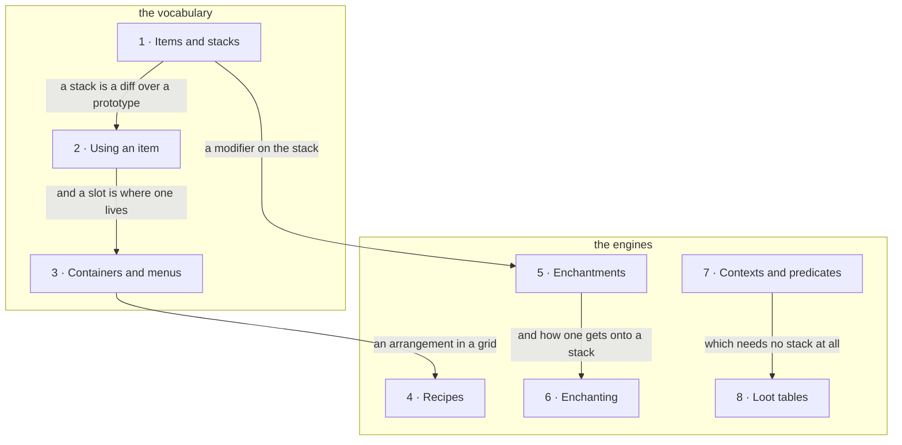

# VII · Items and inventories

> Verified against **Minecraft 26.2** · Part VII · The things you carry: what a stack is, what happens when you use one, how two machines agree about a chestful of them, and the three engines that make them out of data.

A block is a position in a grid and an entity is a thing in the world. An
item is neither: it is a *stack*, and a stack only exists inside something
else — a hand, a slot, a chest, a recipe grid, a dropped `ItemEntity`, a
packet. A player recognises the part by the moments that container is showing:
the shift-click that lands before anything has answered it, the bow that fires
when you let go rather than when it finished drawing, the chest whose contents
appear a tick late, the dungeon chest that is empty until somebody opens it.
Three of those four are a client guessing and being confirmed afterwards
([prediction and
acknowledgement](../client/prediction-and-acks.md#two-state-machines-running-against-each-other));
the tick-late chest is not a guess at all, but a broadcast that missed its
phase, and telling those two apart is most of what this part teaches. **An
item is the thing in the game that is never simply somewhere — so every page
here is about a container, and about which of the two programs is allowed to
believe what it holds.**

## The shape of the part

More than in most parts, an item is where some other system surfaces:
`BlockItem` belongs to Part V · Blocks, `BucketItem` to Part IV · The world,
`SpawnEggItem` to Part VI · Entities, `Equippable` and `AttackRange` to Part
VIII · The player. Each is an item only in the sense that it is the handle.

Three subjects go out the same door. The part stops at the slot: what a player's
own inventory *is* belongs to [player
anatomy](../player/player-anatomy.md#forty-three-slots-and-one-of-them-is-an-alias),
how a held stack picks the model you see belongs to [models and
atlases](../rendering/models-and-atlases.md#how-an-item-picks-its-model), and
the reason a container click is not on the prediction ledger — no sequence
number, no window — belongs to [prediction and
acknowledgement](../client/prediction-and-acks.md#what-the-ledger-does-not-cover).

What is left is **two tiers**. The first three pages are the vocabulary — what
a stack is, what using one does, and how a set of them is kept in agreement
across the wire. The last five are three engines built out of one pattern — a
registry of kinds, a dispatch codec, a data file naming one ([data-driven
types](../foundations/data-driven-types.md#the-idea-stated-once)) — that
produce or decorate stacks.

The engines lean on the vocabulary and not on each other, so they can be
watched in any order; where two of them touch — two of enchanting's five paths
*are* loot functions — neither has to teach the other's machine to say so.
*Contexts and predicates* is the outlier: its subject is not a stack at all,
but the question engine the other engines happen to run on, and it can be
watched first.

Every arrow below is *what the next page can now assume*, not what its code
calls. Read down a chain and nothing is missing; read across two and nothing
is owed.

*The two tiers of the part, numbered to the watch order. Every
arrow means "and now you can assume this", so a page with no arrow into it —
contexts and predicates — is one you can watch whenever you like.*

## Before you start

[Data
components](../foundations/data-components.md#the-prototype-and-why-it-is-built-at-reload)
is the hard prerequisite: a stack *is* an item plus a component patch, and this part
never re-teaches the component system. [Codecs, NBT and
JSON](../foundations/codecs-nbt-json.md#the-four-paths-side-by-side) for the
four ways one stack is serialised, and [identifiers and
registries](../foundations/identifiers-and-registries.md#when-a-world-opens) and
[the resource
system](../foundations/resource-system.md#reload-the-same-pipeline-on-the-server)
for where recipes, enchantments and loot tables come from and when. They come from three different places, and
the difference bites: recipes are a reload listener and loot tables a
reloadable registry layer, so `/reload` rebuilds both — while enchantments are
a world-load dynamic registry that `/reload` [never re-reads at
all](enchantments.md#where-the-forty-three-live-and-when-they-are-read).

Three ordering facts matter more than they look. [The server
tick](../server/server-tick.md#every-packet-since-last-time-in-one-drain) drains
the packet queue before any level ticks,
which is why a click and its correction land in the same tick; [the level
tick](../server/server-level-tick.md#the-whole-tick-and-its-three-gates) decides
*when* a menu's changes are broadcast, which is what makes a hopper's delivery visibly late; and [block
interaction](../blocks/block-interaction.md#block-then-empty-hand-then-item) is
how a chest gets opened in the first place, which is where two of these
pages start.

## Watch in this order

The first three in order, then the engines in any order you like.

1. [Items and stacks](items-and-stacks.md) — an `Item` holds almost no data
   and an `ItemStack` holds a *diff*, and everything else follows: what makes
   two of them the same stack, what one may legally hold, and the one thing
   about an item a client never predicts.
2. [Using an item](using-an-item.md) — a meal and a bow, which are one
   machine read two ways. The client's countdown never stops at zero: the
   meal ends when a single byte arrives, and the bow ends when you let go.
3. [Containers and menus](containers-and-menus.md) — a shift-click out of a
   chest. One packet goes up, nothing comes back, and agreement is silence,
   because the server adopted the client's *claim* as its new baseline.
4. [Recipes](recipes.md) — eight planks and an empty middle. No recipe ever
   crosses the wire, and yet the client holds the whole contents of every
   recipe it has unlocked.
5. [Enchantments](enchantments.md) — there are no enchantment subclasses.
   Fire Aspect is a data-pack record whose "melee only" rule is one loot
   condition, the burn that follows belongs to something else entirely, and
   the three enchantments players talk about most have no effect component at
   all.
6. [Enchanting](enchanting.md) — the five paths that change what an item is
   enchanted with, one of which runs backwards. The
   seed is per player, saved, and sent to the client, which is why the
   Standard Galactic gibberish is stable and why an anvil never changes
   what the table is offering.
7. [Contexts and predicates](contexts-and-predicates.md) — the engine that
   answers *is this true here*. Twelve of its twenty-six parameter sets
   never roll a loot table at all: five of them belong to enchantment
   effects, and the rest are `/execute if predicate`, entity selectors,
   advancement triggers and villager trades.
8. [Loot tables](loot-tables.md) — the worked example, and the part's last
   lecture. A dungeon chest is genuinely empty on disk, and the first thing to
   *read* it — a hopper will do, and so will breaking it — commits the roll
   with no luck at all.

Watched as lectures, five and six are the pair to keep together: *what an
enchantment is* and *how you get one*. Seven and eight are the other pair,
and seven is the one Part XIII comes back for.

## Where the part stops

The part is {{#include ../../generated/part-items.md}} across `world/item`,
`world/inventory` and `world/level/storage/loot`, and
{{#include ../../generated/coverage-items.md}}. Most of that is an answer
rather than a gap: it is the four families each page names once and does not
enumerate. `world/item`'s ninety-eight remaining classes are one `Item`
subclass each, kept for a behaviour hook no component can express; the
twenty-nine menus in `world/inventory` are one machine with different slot
lists; the forty-three loot functions and twenty loot conditions are one shape
each; and the special crafting recipes are the nine whose output cannot be
written down.

Four things here are not a family and are explained nowhere: **villager
trading** (`VillagerTrades` alone is the part's largest class — the loot
machinery a trade *runs on* is covered, the trades themselves are not),
**brewing**, **the creative tabs**, and **armour identity and trims**. A second
edition should take them; this one names them and says so.

## Reference this part uses

Three were written for it. [The weapon
helpers](../../reference/weapon-helpers.md) — the seven `Item.Properties`
methods that make a weapon and the forty-two items built by one; [enchantment
hooks](../../reference/enchantment-hooks.md) — every `EnchantmentHelper`
entry point with the classes that call it, which is the enchantment
system's real interface. [Loot context parameter
sets](../../reference/loot-context-params.md) — all twenty-six, with the
keys each one requires and allows. Then the catalogue behind the part's hard prerequisite, [data
components](../../reference/components.md) — every component type with what
holds it; [packets](../../reference/packets.md) for the container and recipe
traffic; [registries](../../reference/registries.md) for where each of the
three engines' elements live; [naming
drift](../../reference/naming-drift.md) for the loot package's move out of
*critereon*; and [diagram lanes](../../reference/lanes.md).

---

*Rules: names, never code · how the system works, not how the code reads ·
newest version only · every backticked name passes `tools/verify_names.py`.*
