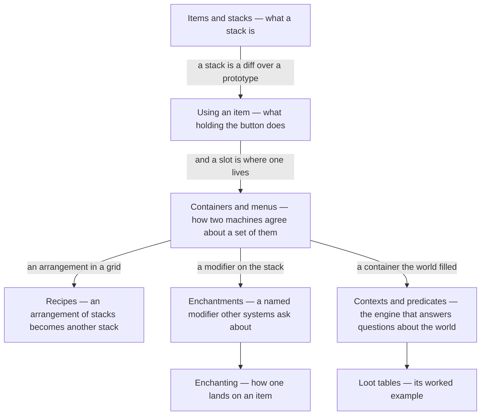

# VII · Items and inventories

> Verified against **Minecraft 26.2** · Part VII · The things you carry: what a stack is, what happens when you use one, how two machines agree about a chestful of them, and the three engines that make them out of data.

A block is a position in a grid and an entity is a thing in the world. An
item is neither: it is a *stack*, and a stack only exists inside something
else — a hand, a slot, a chest, a recipe grid, a dropped `ItemEntity`, a
packet. That makes this part the one where the two programs disagree most
often and most cheaply, because almost everything a player does with items
is predicted locally and confirmed afterwards. A player recognises the part
by the small lies: the sword that swings before the server has heard about
it, the chest whose contents appear a tick late, the bow that fires when you
let go rather than when it finished drawing, and the dungeon chest that is
empty until the moment somebody opens it.

## The shape of the part

Part VII is **two tiers**, not a chain. The first three pages are the
vocabulary — what a stack is, what using one does, and how a set of them is
kept in agreement across the wire — and every later page assumes all three.
The last five are three independent data-driven engines that produce or
decorate stacks: they depend on the vocabulary completely and on each other
not at all, so they can be watched in any order.

## Before you start

[Data components](../foundations/data-components.md) is the hard
prerequisite: a stack *is* an item plus a component patch, and this part
never re-teaches the component system. [Codecs, NBT and
JSON](../foundations/codecs-nbt-json.md) for the four ways one stack is
serialised, and [identifiers and
registries](../foundations/identifiers-and-registries.md) and [the resource
system](../foundations/resource-system.md) for where recipes, enchantments
and loot tables come from and when — all three engines are reload-time
citizens of the same machinery.

Two ordering facts matter more than they look. [The level
tick](../server/server-level-tick.md) decides *when* a menu's changes are
broadcast, so half this part's timing surprises are claims about which
phase something ran in; and [block interaction](../blocks/block-interaction.md)
is how a chest gets opened in the first place, which is where two of these
pages start.

## Watch in this order

The first three in order, then the engines in any order you like.

1. [Items and stacks](items-and-stacks.md) — an `Item` holds almost no
   data, and an `ItemStack` holds a *diff*. The prototype it is a diff
   against does not exist until the first data-pack load.
2. [Using an item](using-an-item.md) — a meal and a bow, which are one
   machine read two ways. The client's countdown never stops at zero: the
   meal ends when a single byte arrives, and the bow ends when you let go.
3. [Containers and menus](containers-and-menus.md) — a shift-click out of a
   chest. One packet goes up, nothing comes back, and agreement is silence,
   because the server adopted the client's *claim* as its new baseline.
4. [Recipes](recipes.md) — eight planks and an empty middle. No recipe ever
   crosses the wire, and yet the client holds the whole contents of every
   recipe it has unlocked.
5. [Enchantments](enchantments.md) — there are no enchantment subclasses.
   Fire Aspect is a data-pack record whose "melee only" rule is one loot
   condition, and the burn that follows belongs to something else entirely.
6. [Enchanting](enchanting.md) — the five ways one lands on an item. The
   seed is per player, saved, and sent to the client, which is why the
   Standard Galactic gibberish is stable and why an anvil never changes
   what the table is offering.
7. [Contexts and predicates](contexts-and-predicates.md) — the engine that
   answers *is this true here*. Twelve of its twenty-six parameter sets
   never roll a loot table at all: `/execute if predicate`, entity
   selectors, advancement triggers and villager trades all run on it.
8. [Loot tables](loot-tables.md) — the worked example, and the part's
   closer. A dungeon chest is genuinely empty on disk, and the first thing
   to touch it — a hopper will do — commits the roll with no luck at all.

Watched as lectures, four and five are the pair to keep together: *what an
enchantment is* and *how you get one*. Seven and eight are the other pair,
and seven is the one Part XIII comes back for.

## Reference this part uses

Two were written for it. [Enchantment
hooks](../../reference/enchantment-hooks.md) — every `EnchantmentHelper`
entry point with the classes that call it, which is the enchantment
system's real interface. [Loot context parameter
sets](../../reference/loot-context-params.md) — all twenty-six, with the
keys each one requires and allows. Then [data
components](../../reference/components.md),
[packets](../../reference/packets.md),
[registries](../../reference/registries.md) and [diagram
lanes](../../reference/lanes.md).

The part stops at the slot. What a player's own inventory is, and how the
hand relates to the equipment slots, is [player
anatomy](../player/player-anatomy.md) in Part VIII; how a held stack picks
the model you actually see is Part XI's, in [models and
atlases](../rendering/models-and-atlases.md#how-an-item-picks-its-model); and the ledger behind the
click you have already seen happen is [prediction and
acknowledgement](../client/prediction-and-acks.md) in Part X.

---

*Rules: names, never code · how the system works, not how the code reads ·
newest version only · every backticked name passes `tools/verify_names.py`.*
