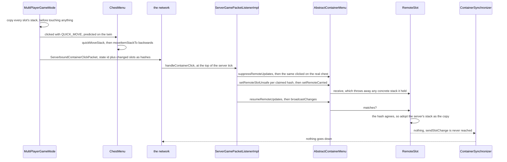
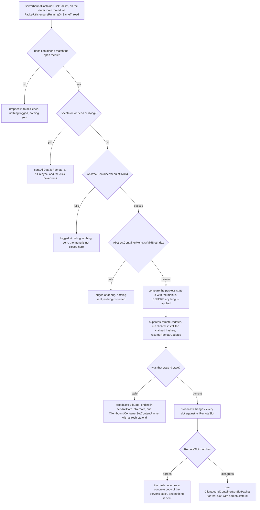

# Containers and menus

> Verified against **Minecraft 26.2** · Part VII · A player shift-clicks a stack out of a chest: one packet goes up, the server re-runs the same code against the real container, and nothing comes back down.

You are standing at a chest with a stack of cobblestone in the top-left
slot, and you shift-click it. Your machine moves the stack into your hotbar
immediately, and one `ServerboundContainerClickPacket` leaves for the
server. The server runs the *same* method against the real
`ChestBlockEntity`, gets its own answer, compares the two — and if they
agree, sends nothing at all. That is the steady state: **one packet up, zero
packets down.** There is no transaction acknowledgement in this protocol;
agreement is silence. What makes silence safe is the part nobody expects.
The click packet does not carry the stacks the client thinks it produced, it
carries a CRC32C *hash* per changed slot, and before comparing anything the
server **installs that claim as its own belief about the client**. It adopts
the client's belief object, never the client's data.

## The cast

| class | what it decides | thread |
|---|---|---|
| `Container` | storage, and nothing about who is looking at it — `Container.getItem`, `Container.setItem`, `Container.stillValid` | wherever its owner runs |
| `AbstractContainerMenu` | the slot list, the cursor, the state id, the click state machine, and the two baselines (one for listeners, one for the wire) | both main threads |
| `Slot` | GUI policy — `Slot.mayPlace`, `Slot.mayPickup`, `Slot.getMaxStackSize` — and the guarded mutations a click goes through | both main threads |
| `Inventory` | the player's own storage, present as slots in nearly every menu that opens — the lectern's one book slot is the exception | both main threads |
| `MenuType` / `MenuProvider` | the registry entry with the *screen-side* constructor, and the server-side factory a block hands to `ServerPlayer.openMenu` | client / server main |
| `ContainerSynchronizer` | the diffing channel to the connection, and every menu's writer but one — one per `ServerPlayer`, shared by every menu that player opens | server main |
| `RemoteSlot` | what the server believes the client is holding in one slot, as either a stack or a hash | server main (`RemoteSlot.PLACEHOLDER` on the client) |
| `HashedStack` | the client's claim about one slot after its own click | created on the client, matched on the server |

## The chest you see is not the chest

The server's `ChestMenu` is built from a `MenuProvider` that
`ChestBlock.getMenuProvider` produces and `ChestBlock.useWithoutItem` hands
to `ServerPlayer.openMenu` ([block interaction](../blocks/block-interaction.md)),
and its `Container` is the real `ChestBlockEntity` — or a
`CompoundContainer` over both halves, for a double chest, from a separate
anonymous provider. The client's `ChestMenu` is built
from `MenuType`'s screen-side constructor by `MenuScreens`, and that
constructor makes a **fresh `SimpleContainer`**. The client's chest contents
have no connection to the block entity beyond the packet stream. Its
`AbstractContainerMenu.stillValid` would be a lie for the same reason —
`SimpleContainer.stillValid` returns true unconditionally — but the question is
never put to it: every call site of `AbstractContainerMenu.stillValid` in the
game is on the server. A client never closes its own menu because it walked
away.

The other half of that asymmetry is the synchronizer. Only
`ServerPlayer.initMenu` ever calls
`AbstractContainerMenu.setSynchronizer`, so a client menu has none, and
every one of its `RemoteSlot`s stays `RemoteSlot.PLACEHOLDER`, whose
`RemoteSlot.matches` always answers true, so the *wire* half of
`AbstractContainerMenu.broadcastChanges` is inert on the client by
construction. The listener half is not: `BeaconScreen`, `ItemCombinerScreen`,
`LecternScreen` and the creative inventory all register a real
`ContainerListener`, which is how the anvil's rename field repopulates itself
after a slot changes.

Three smaller facts about the model that a reader will otherwise trip over.
A menu with a null `MenuType` cannot be opened over the network at all —
`AbstractContainerMenu.getType` throws — which is why the player's own
`InventoryMenu` is pinned to `InventoryMenu.CONTAINER_ID`, zero, and built
independently on both sides, and why the mount menus need a
`ClientboundMountScreenOpenPacket` of their own instead of
`ClientboundOpenScreenPacket`. Every other menu takes an id from
`ServerPlayer.nextContainerCounter`, which cycles 1 to 100 and never reaches
zero. And `Slot.mayPlace` and `Container.canPlaceItem` are unrelated
questions: the first is GUI policy and defaults to true without consulting
the container at all, the second is what hopper automation reads. A player
and a hopper can have different rights over the same slot. So can a player
and an item: `Container.getMaxStackSize` defaults to **99**, and the
familiar 64 comes only from the per-stack overload, which takes the minimum
with the item's own maximum.

## One shift-click, end to end

A three-row `ChestMenu` numbers slots 0–26 for the chest, 27–53 for the
player's three main inventory rows and 54–62 for the hotbar, because
`AbstractContainerMenu.addStandardInventorySlots` adds the main rows before
the hotbar. Watch what the wire carries, and what it does not.

**The press.** `AbstractContainerScreen.mouseClicked` resolves the hovered
slot, sees an empty `AbstractContainerMenu.getCarried` and a held shift, and
chooses `ContainerInput.QUICK_MOVE` on the press. Two near neighbours are
release-path instead, from `AbstractContainerScreen.mouseReleased`: a
shift-click with a *non-empty* cursor, and the shift-double-click sweep,
which issues a separate `ContainerInput.QUICK_MOVE` — and a separate packet
— for every matching slot in the same container.

**The snapshot, then the prediction.**
`MultiPlayerGameMode.handleContainerInput` copies every slot's stack before
touching anything, because that copy is what the packet's diff is built
against. Then it runs `AbstractContainerMenu.clicked` on the client's own
menu. The `ContainerInput.QUICK_MOVE` branch loops
`AbstractContainerMenu.quickMoveStack` while the clicked slot keeps yielding
the same item, and it runs only for button 0 or 1, a non-negative slot index
and a slot that `Slot.mayPickup` allows.

**The move, and its two passes.** `ChestMenu.quickMoveStack` sees the index
is inside the chest and calls `AbstractContainerMenu.moveItemStackTo` over
the player's range with the backwards flag, which scans from the last slot
down — **the hotbar first, from the right**. That method makes two passes.
The first runs only if the stack is stackable at all, and merges into every
existing compatible stack across the whole range
(`ItemStack.isSameItemSameComponents`, topped up to `Slot.getMaxStackSize`).
The second runs only if something is left, finds the first empty slot that
`Slot.mayPlace` accepts, places what that slot's cap allows and **breaks**.
One empty slot per call — which is why the caller loops. Note which pass
consults policy: **the merge pass never asks `Slot.mayPlace`**, so a slot
that would refuse the item on placement can still be topped up by a
shift-click when it already holds a matching stack. Note also what
`ChestMenu.quickMoveStack` never calls: `Slot.onTake`.
`InventoryMenu.quickMoveStack` does. Shift-clicking out of a chest and out
of the crafting result are structurally different operations.

**The packet.** The client diffs the post-click slots against its snapshot,
hashes each changed stack with `HashedStack.create`, and sends
`ServerboundContainerClickPacket` with the container id, the client's
*last-known* state id, the slot, the button, the `ContainerInput`, up to
**128** changed slots as hashes, and the cursor as one more.

**The real move.** The server takes the ladder below, then — with
`AbstractContainerMenu.suppressRemoteUpdates` held — runs the identical
`AbstractContainerMenu.clicked` path against the real `ChestBlockEntity` and
the real `Inventory`. `Slot.setChanged` reaches `BlockEntity.setChanged`,
which calls `Level.blockEntityChanged` to mark the chunk and
`Level.updateNeighbourForOutputSignal` to re-derive the comparator output
([block entities](../blocks/block-entities.md)). The whole click is wrapped
in a try/catch that builds a crash report category naming the menu class,
the slot and the button.

**Installing the claim, then comparing.**
`AbstractContainerMenu.setRemoteSlotUnsafe` writes each hash the client sent
into the matching `RemoteSlot`; `RemoteSlot.Synchronized` **discards any
concrete stack it was holding** and keeps the hash alone. An out-of-range
index is logged at debug and ignored rather than rejected. Then
`AbstractContainerMenu.setRemoteCarried`, then
`AbstractContainerMenu.resumeRemoteUpdates`, then
`AbstractContainerMenu.broadcastChanges`, which makes one pass over the
slots offering each to `AbstractContainerMenu.triggerSlotListeners` for
advancements and to `AbstractContainerMenu.synchronizeSlotToRemote` for the
wire, then the cursor, then the data slots. Where the hash agrees,
`RemoteSlot.Synchronized` **promotes it to a concrete copy of the server's
own stack** and nothing is sent.

The advancement channel sees one state per click, not one per slot touched:
`AbstractContainerMenu.triggerSlotListeners` runs only from
`AbstractContainerMenu.broadcastChanges` and
`AbstractContainerMenu.broadcastFullState` — and for a chest nothing calls
back into the menu mid-click to reach either. That is a fact about the chest,
not about menus: `CrafterSlot`, the anvil's and the smithing table's
`ItemCombinerMenu` slots and the crafting grid all call
`AbstractContainerMenu.slotsChanged` from `Container.setChanged`, and the base
`AbstractContainerMenu.slotsChanged` is a bare
`AbstractContainerMenu.broadcastChanges`. The click's
own broadcast runs
*after* `AbstractContainerMenu.resumeRemoteUpdates`, so suppression is not
in force by then, and `ServerPlayer`'s `ContainerListener` filters to slots
that are not a `ResultSlot` and whose container is the player's own
`Inventory` before firing `CriteriaTriggers.INVENTORY_CHANGED` anyway.

## The ladder the server climbs before it believes you

`ServerGamePacketListenerImpl.handleContainerClick` is four tests and a
fork, and the interesting thing about it is how much of it ends in *nothing
sent* rather than a correction.

The order of the last two boxes is the load-bearing part: **the state id is
compared before the click is applied and acted on after**, so a click that
quotes a stale id still runs, and still runs first. Its result is simply
published wholesale instead of diffed.

`AbstractContainerMenu.isValidSlotIndex` deserves suspicion. It accepts −1,
accepts `AbstractContainerMenu.SLOT_CLICKED_OUTSIDE`, and otherwise only
asks whether the index is below the slot count — so **every negative index
passes it**. The branches that need a floor test for it themselves; the two
that do not, `ContainerInput.SWAP` and the painting phase of
`ContainerInput.QUICK_CRAFT`, index the list directly, and the click's own
try/catch turns the failure into a `ReportedException` rather than swallowing
it: what swallows it is `PacketProcessor`, which logs a game-listener error and
carries on. An out-of-range click is therefore neither corrected nor fatal, but
it is loudly logged, and it closes nothing:
`ServerGamePacketListenerImpl.handleContainerClose` for its part validates
nothing at all, not even the container id, and goes straight to
`ServerPlayer.doCloseContainer`.

## Why hashes, and why only in one direction

`HashedStack.create` produces either `HashedStack.EMPTY` or a
`HashedStack.ActualItem` of item holder, count and a `HashedPatchMap` — one
CRC32C integer per *added* component plus the plain set of *removed* ones.
Each integer comes from running the component's own codec into
`HashOps.CRC32C_INSTANCE`, a `DynamicOps` whose output **is** the hash
([codecs, NBT and JSON](../foundations/codecs-nbt-json.md) owns that
mechanism). Nothing is serialised on the way and there is no intermediate
byte form. `HashedPatchMap.matches` then checks the removed set, the added
count, and each component's hash in turn.

Two things follow. The client is *asserting a belief*, not authoring state —
a hash cannot be turned back into an item, so a client that lies here can
only fail to match — and the traffic is 128 integers rather than 128 full
`DataComponentPatch`es. The asymmetry is exact: **only the client ever calls
`HashedStack.create`, and only the server ever calls `HashedStack.matches`.**
Hashing is not free-standing on the server either: `ServerPlayer`'s
`ContainerSynchronizer` carries a 256-entry component-hash cache shared by
every menu that player opens, and `ContainerSynchronizer.createSlot` hands
each new `RemoteSlot.Synchronized` a `HashedPatchMap.HashGenerator` backed
by it.

One channel is deliberately outside all of this. `DataSlot` and
`ContainerData` — furnace progress, enchanting cost, lectern page — travel
as `ClientboundContainerSetDataPacket`, whose id and value are written as
**shorts**, and they carry two independent baselines:
`DataSlot.checkAndClearUpdateFlag` for the listeners and
`AbstractContainerMenu.remoteDataSlots` for the network, compared
separately. The network comparison is a plain integer test, so a furnace's
progress bar is not covered by the hash-agreement silence and is re-sent
every time it changes.

## The state id, and the three places it moves

`AbstractContainerMenu.incrementStateId` is a wrapping 15-bit counter — it
masks to 32767 — and it answers exactly one question: *has the client
applied every slot correction I have sent?* It has three call sites in the
whole game. Two are inside `ServerPlayer`'s synchronizer, behind
`ContainerSynchronizer.sendInitialData` and
`ContainerSynchronizer.sendSlotChange`;
`ContainerSynchronizer.sendCarriedChange` and
`ContainerSynchronizer.sendDataChange` do not bump it — and
`ClientboundSetCursorItemPacket` carries no id whatever, while
`ClientboundContainerSetDataPacket` carries the container's but never a state
id. The third is `CraftingMenu.slotChangedCraftingGrid`,
below. The client never generates one: `AbstractContainerMenu.setItem` and
`AbstractContainerMenu.initializeContents` simply store whatever arrived and
quote it back on the next click. A click quoting a stale id means
corrections are still in flight, and the server stops diffing and resends
everything.

## Where in the tick a broadcast happens

Not one place, and the difference is observable. Packets are drained
**before any level ticks** ([the server tick](../server/server-tick.md)), so
a click and any correction it produces both happen at the top of the tick
and reach the client the same tick. `ServerPlayer.tick` then calls
`AbstractContainerMenu.broadcastChanges` again from the level's **entity**
phase, which runs *before* the block-entity phase
([the level tick](../server/server-level-tick.md)). And `ServerPlayer.doTick`
— driven by the connection after every level has finished — repeats only the
`AbstractContainerMenu.stillValid` distance test, without a broadcast.

So the distance test happens twice a tick and only the first is accompanied
by a broadcast. A hopper that pushes an item into a chest whose menu is open
therefore runs in the block-entity phase, after that tick's only broadcast,
and **nothing calls back into the menu to say so** —
`SimpleContainer.setChanged` is empty, `BlockEntity.setChanged` marks the chunk
and re-derives the comparator output and stops there,
`Inventory.setChanged` only bumps a counter. You see the hopper's
item one tick late.

Closing has its own surprise. The cursor belongs to the menu, not the
player, so closing one would destroy it: `AbstractContainerMenu.removed`
rescues it explicitly, dropping it in the world if the player has been
removed or has disconnected and calling `Inventory.placeItemBackInInventory`
otherwise, the whole method gated on being a `ServerPlayer`, which is what
makes that safe. The rescue sends one `ClientboundSetPlayerInventoryPacket`
per slot it fills, and runs *before* `AbstractContainerMenu.transferState`,
which copies both the listener baseline and the remote beliefs across every
container-and-slot pair the closing menu and `InventoryMenu` share. For a
chest that is the 36 main and hotbar slots — not armour, not the offhand, not
the 2×2 grid, not the crafting result — so changes to those four are re-sent
and nothing else is.

## The seven click kinds

`ContainerInput` has seven values, and the button number means something
different in every one. `ClickAction` — `ClickAction.PRIMARY` and
`ClickAction.SECONDARY` — is *not* on the wire; it is derived inside
`AbstractContainerMenu.doClick` on both sides and handed to the item
override hooks `ItemStack.overrideStackedOnOther` and
`ItemStack.overrideOtherStackedOnMe`, which is how a `BundleItem`
intercepts a click before ordinary slot logic runs.

| value | the gesture | what the button number means | packets per gesture |
|---|---|---|---|
| `ContainerInput.PICKUP` | the ordinary click | 0 left, 1 right — and on `AbstractContainerMenu.SLOT_CLICKED_OUTSIDE`, drop all or drop one | 1 |
| `ContainerInput.QUICK_MOVE` | shift-click | 0 or 1, the same in a real slot — and outside the window, the drop-all and drop-one of `ContainerInput.PICKUP` | 1, or one per matching slot for the shift-double-click sweep |
| `ContainerInput.SWAP` | a hotbar key, or `Inventory.SLOT_OFFHAND` for the offhand key | the destination index: 0–8, or 40 | 1 |
| `ContainerInput.CLONE` | creative middle-click | ignored, but the player must pass `Player.hasInfiniteMaterials` | 1 |
| `ContainerInput.THROW` | Q over a slot, cursor empty — and also a click *outside* the window with an empty cursor, which the server's branch then ignores because it demands a non-negative index | 0 drops one, 1 (control-Q) drops the stack and keeps going while the slot yields the same item | 1 |
| `ContainerInput.QUICK_CRAFT` | drag-painting | a packed mask that `AbstractContainerMenu.getQuickcraftHeader` and `AbstractContainerMenu.getQuickcraftType` split into a phase (start, continue, end) and a mode (even split, one each, clone) | **painted slots plus two** — `AbstractContainerScreen.quickCraftToSlots` sends a start, one continue per slot, and an end |
| `ContainerInput.PICKUP_ALL` | double-click to collect | 0 scans forwards, 1 backwards, over two passes that skip already-full stacks first | 1 |

An unknown id on the wire is not rejected. `ContainerInput`'s id mapper is
built with a zero-out-of-bounds strategy, so a malformed click **decodes as
`ContainerInput.PICKUP`**.

## Two paths that are not this protocol at all

**Creative mode is a parallel protocol, not a variation.**
`CreativeModeInventoryScreen` overrides
`AbstractContainerScreen.slotClicked` and drives a menu of its own, and its
writes go up as `ServerboundSetCreativeModeSlotPacket`. That is the one
packet in the game whose *item* data the server adopts — a rename, a sign and a
jigsaw block are adopted as text:
`ServerGamePacketListenerImpl.handleSetCreativeModeSlot` takes the client's
`ItemStack` verbatim into the slot through `Slot.setByPlayer`, behind only a
`Player.hasInfiniteMaterials` check, a feature-flag check, a slot range of
1 to 45 and a count cap — then writes the same stack into the remote belief
with `AbstractContainerMenu.setRemoteSlot` to suppress the echo. A negative
slot number means *drop it in the world instead*, and that branch is the one
place here with a rate limiter on it.

**The crafting result is a second, unsuppressed channel.**
`CraftingMenu.slotChangedCraftingGrid` recomputes the result slot and then
sends a `ClientboundContainerSetSlotPacket` **straight down the connection**,
bumping the state id itself and bypassing `ContainerSynchronizer` entirely.
It is reached from `CraftingMenu.slotsChanged`,
`CraftingMenu.finishPlacingRecipe` and `InventoryMenu.slotsChanged`, and the
first of those fires mid-click, because `TransientCraftingContainer` calls
`AbstractContainerMenu.slotsChanged` from its own `Container.setItem` and
from any `Container.removeItem` that took something. So the one path that
transmits *during* a click is also the one path
`AbstractContainerMenu.suppressRemoteUpdates` does not cover — that flag
guards only `AbstractContainerMenu.synchronizeSlotToRemote` and its two
siblings. [Recipes](recipes.md) is where the recomputation itself lives.

Everything else on the wire is bookkeeping around those two:
`ClientboundOpenScreenPacket` and `ClientboundContainerClosePacket` for the
lifetime, `ClientboundContainerSetContentPacket` and
`ClientboundSetCursorItemPacket` for a resync,
`ServerboundContainerButtonClickPacket` for the lectern, enchanting, loom and
stonecutter buttons,
`ServerboundContainerSlotStateChangedPacket` for crafter toggles,
`ServerboundSelectBundleItemPacket` for a bundle, and
`ServerboundSetCarriedItemPacket` with `ClientboundSetHeldSlotPacket` for the
hotbar selection — which, despite the name, has nothing to do with the
cursor. A structure chest fills itself on first open through
`RandomizableContainer.unpackLootTable` ([loot tables](loot-tables.md)), and
`ContainerLevelAccess` — `ContainerLevelAccess.NULL` on the client — is the
position capability a block-anchored menu tests distance against. None of
the click protocol is data-driven: `BuiltInRegistries.MENU` supplies only
the type.

## Where to look

`ServerGamePacketListenerImpl.handleContainerClick` ·
`MultiPlayerGameMode.handleContainerInput` ·
`AbstractContainerMenu.doClick` · `AbstractContainerMenu.moveItemStackTo` ·
`AbstractContainerMenu.broadcastChanges` ·
`AbstractContainerMenu.setRemoteSlotUnsafe` · `RemoteSlot.Synchronized` ·
`HashedStack` · `HashedPatchMap` · `HashOps` · `ContainerSynchronizer` ·
`ContainerListener` · `Container` · `Slot` · `ChestMenu` · `InventoryMenu` ·
`CraftingMenu.slotChangedCraftingGrid` · `ContainerInput` · `ClickAction` ·
`DataSlot` · `MenuType` · `MenuProvider` · `MenuScreens` ·
`ServerPlayer.openMenu` ·
`ServerGamePacketListenerImpl.handleSetCreativeModeSlot` ·
`CreativeModeInventoryScreen`

---

*Rules: names, never code · how the system works, not how the code reads ·
newest version only · every backticked name passes `tools/verify_names.py`.*
