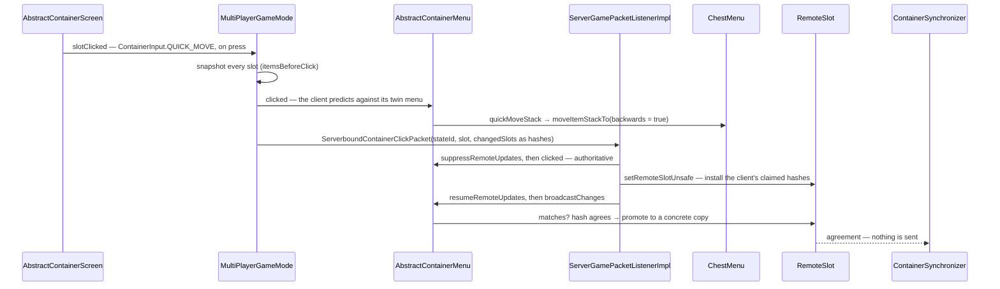

# Containers and menus

> Verified against **Minecraft 26.2** · Part VII · A player shift-clicks a stack out of a chest: one packet goes up, the server re-runs the same code against the real container, and in the ordinary case *nothing* comes back down.

## Responsibility

A `Container` is storage. A menu is the synchronised view of some
storage that a player currently has open, with slots, a cursor, a few
synchronised integers and a protocol for clicking. The system's job is to
let two machines run the same click logic against different copies of the
data and agree afterwards without shipping the data every time.

The one sentence a player recognises: *what you see when you open a
chest, and the fact that shift-click fills your hotbar first.*

The headline: **the click protocol is a diff, not a command.** A click is
`ContainerInput` — a first-class network type with its own id and stream
codec — plus a 15-bit state id and a list of per-slot *hashes* saying what
the client thinks the click produced. There is no transaction
acknowledgement; agreement is silence.

## The data it owns

- **`Container`** — the storage interface: `Container.getContainerSize`,
  `Container.getItem`, `Container.setItem`, `Container.removeItem`,
  `Container.setChanged`, `Container.stillValid`, plus
  `Container.startOpen` / `Container.stopOpen`, which take a
  `ContainerUser` rather than a `Player`. Implementations range from
  `SimpleContainer` to `CompoundContainer` (the double chest) to the
  block entities in [block entities](../blocks/block-entities.md).
- **`AbstractContainerMenu`** — the menu itself, and it owns rather a lot:
  `AbstractContainerMenu.slots`, `AbstractContainerMenu.containerId`,
  `AbstractContainerMenu.lastSlots` (the last state the *listeners* saw),
  `AbstractContainerMenu.remoteSlots` (what the menu believes the other
  side holds), `AbstractContainerMenu.remoteDataSlots` (the same for the
  integers), `AbstractContainerMenu.carried` (the cursor),
  `AbstractContainerMenu.dataSlots`, the quick-craft drag state machine,
  and a private 15-bit `AbstractContainerMenu.stateId`.
- **`Slot`** — a view onto one index of one `Container` at a GUI position.
  It owns policy — `Slot.mayPlace`, `Slot.mayPickup`,
  `Slot.getMaxStackSize`, `Slot.onTake`, `Slot.isFake` — and the guarded
  mutations the click protocol actually goes through:
  `Slot.safeInsert`, `Slot.safeTake`, `Slot.tryRemove`,
  `Slot.setByPlayer`, `Slot.safeClone`, `Slot.onQuickCraft`. The
  subclasses are the policy — `ResultSlot`, `ArmorSlot`,
  `FurnaceFuelSlot`, `NonInteractiveResultSlot`, `ShulkerBoxSlot`.
- **`MenuProvider`** — what a block hands to `ServerPlayer.openMenu`: a
  title plus a factory. `ChestBlock.getMenuProvider` builds it, and the
  double-chest branch is a separate anonymous provider that opens both
  halves.
- **`MenuType`** — the registry entry in `BuiltInRegistries.MENU`. It
  ships on both sides and carries a screen-side constructor and a feature
  flag set; only the client ever calls `MenuType.create`, from
  `MenuScreens`. The server builds its menu from the `MenuProvider`
  instead.
- **`ContainerSynchronizer`** — the remote channel:
  `ContainerSynchronizer.sendInitialData`,
  `ContainerSynchronizer.sendSlotChange`,
  `ContainerSynchronizer.sendCarriedChange`,
  `ContainerSynchronizer.sendDataChange`, and
  `ContainerSynchronizer.createSlot`. There is exactly one **per
  `ServerPlayer`** — built once in the constructor and handed to every
  menu that player ever opens by `ServerPlayer.initMenu`, which is the
  only caller of `AbstractContainerMenu.setSynchronizer`. It carries a
  256-entry component-hash cache shared across all of them.
- **`ContainerListener`** — the *local* channel, a list rather than a
  single field, compared against `AbstractContainerMenu.lastSlots` with
  real stacks. `ServerPlayer`'s implementation fires
  `CriteriaTriggers.INVENTORY_CHANGED` — but only for a slot that is not
  a `ResultSlot` and whose container is the player's own `Inventory`.
- **`RemoteSlot`** — one slot's belief about the other side. The
  interface declares only `RemoteSlot.force`, `RemoteSlot.receive` and
  `RemoteSlot.matches`; the implementation that holds anything is
  `RemoteSlot.Synchronized`, which stores *either* a concrete `ItemStack`
  copy *or* a `HashedStack`. `RemoteSlot.PLACEHOLDER` is the null object
  whose `RemoteSlot.matches` always returns true, and it is what every
  slot on the client gets.
- **`DataSlot`** / **`ContainerData`** — synchronised integers: furnace
  progress, enchanting cost, lectern page.
- **`ContainerLevelAccess`** — the `(Level, BlockPos)` capability a
  block-anchored menu is given, with `ContainerLevelAccess.NULL` for the
  client's copy.
- **`Inventory`** — the player's own storage, with the constants that
  matter for slot arithmetic: `Inventory.INVENTORY_SIZE`,
  `Inventory.SELECTION_SIZE`, `Inventory.SLOT_OFFHAND`,
  `Inventory.SLOT_BODY_ARMOR`, `Inventory.SLOT_SADDLE`.

## When it runs

**Server main thread** for everything authoritative:
`ServerGamePacketListenerImpl.handleContainerClick`,
`ServerGamePacketListenerImpl.handleContainerClose`, `ServerGamePacketListenerImpl.handleContainerButtonClick`,
`ServerGamePacketListenerImpl.handleSetCarriedItem`, `ServerGamePacketListenerImpl.handleSetCreativeModeSlot`, all reached through
`PacketUtils.ensureRunningOnSameThread`; then
`AbstractContainerMenu.clicked`, every `Slot` and `Container` mutation,
and `AbstractContainerMenu.broadcastChanges`.

**Where in the tick this lands matters, and it is not one place.**
Packets are drained *before* any level ticks
([the server tick](../server/server-tick.md)), so a click and the
`AbstractContainerMenu.broadcastChanges` it ends with both happen at the
top of the tick: the correction reaches the client the same tick.
`ServerPlayer.tick` calls `AbstractContainerMenu.broadcastChanges` again
from the level's **entity** phase — which is *before* the block-entity
phase ([the level tick](../server/server-level-tick.md)). So a hopper
that moves an item into a chest whose menu is open is not noticed until
the following tick's broadcast; nothing calls back into the menu, because
`SimpleContainer.setChanged` is empty, `BlockEntity.setChanged` only
marks the chunk, and `Inventory.setChanged` only bumps a counter.

The `AbstractContainerMenu.stillValid` distance check happens **twice a
tick**: once in `ServerPlayer.tick`, in the entity phase, and once in
`ServerPlayer.doTick`, which the connection drives after every level has
finished (see [players and sessions](../server/players-and-sessions.md)
for why player ticking is split). Only the first is accompanied by a
broadcast.

**Client main thread** for the prediction:
`AbstractContainerScreen.mouseClicked` →
`AbstractContainerScreen.slotClicked` →
`MultiPlayerGameMode.handleContainerInput`, which runs the *same*
`AbstractContainerMenu.clicked` against the client's twin menu before
sending anything.

**Netty threads** only decode.

## The trace: shift-clicking a stack out of a chest

A three-row `ChestMenu` numbers its slots 0–26 for the chest, 27–53 for
the player's three main inventory rows, and 54–62 for the hotbar —
because `AbstractContainerMenu.addStandardInventorySlots` adds the main
rows before the hotbar.

1. **The press.** `AbstractContainerScreen.mouseClicked` resolves the
   hovered slot, sees an empty `AbstractContainerMenu.getCarried` and a
   held shift, and picks `ContainerInput.QUICK_MOVE` on the press. Two
   near neighbours are release-path instead: a shift-click with a
   *non-empty* cursor, and the shift-double-click sweep, which issues a
   separate `ContainerInput.QUICK_MOVE` — and a separate packet — for
   every matching slot in the container.
2. **The snapshot.** `MultiPlayerGameMode.handleContainerInput` copies
   every slot's stack *before* touching anything — this is what the
   packet's diff is built from.
3. **The prediction.** The client runs `AbstractContainerMenu.clicked`
   against its own menu. The `ContainerInput.QUICK_MOVE` branch loops
   `AbstractContainerMenu.quickMoveStack` while the slot keeps yielding
   the same item, and it only runs for button 0 or 1, a non-negative slot
   index and a slot the player may pick up from.
4. **The move.** `ChestMenu.quickMoveStack` sees the index is inside the
   chest and calls `AbstractContainerMenu.moveItemStackTo` over the
   player's range with `backwards = true`, which scans from the last slot
   down — **the hotbar first, from the right**.
5. **Two passes.** `AbstractContainerMenu.moveItemStackTo` first — and
   only if the stack is stackable at all — merges into every existing
   compatible stack across the whole range
   (`ItemStack.isSameItemSameComponents`, topping up to
   `Slot.getMaxStackSize`), then, if anything is left, finds the first
   empty slot that `Slot.mayPlace` accepts, places as much of it as that
   slot's cap allows, and **breaks**. One empty slot per call — hence the
   caller's loop.
6. **The packet.** `MultiPlayerGameMode.handleContainerInput` diffs the
   post-click slots against its snapshot, hashes each changed stack with
   `HashedStack.create`, and sends `ServerboundContainerClickPacket`
   carrying the container id, the client's *last-known* state id, the
   slot, the button, the `ContainerInput`, up to 128 changed slots as
   `HashedStack`s, and the cursor as one more.
7. **The ladder.** `ServerGamePacketListenerImpl.handleContainerClick`
   checks the container id (mismatch: silently dropped), spectator or
   dying (full resync via `AbstractContainerMenu.sendAllDataToRemote`),
   `AbstractContainerMenu.stillValid` (failure: logged, *nothing sent*),
   and `AbstractContainerMenu.isValidSlotIndex`. Then it computes
   whether a full resync is needed by comparing the packet's state id
   against the menu's — **before applying anything**.
8. **The real move.** With `AbstractContainerMenu.suppressRemoteUpdates`
   held, the server runs the identical `AbstractContainerMenu.clicked` → `AbstractContainerMenu.quickMoveStack` →
   `AbstractContainerMenu.moveItemStackTo` path against the real `ChestBlockEntity` (or a
   `CompoundContainer` for a double chest) and the real `Inventory`.
   `Slot.setChanged` reaches `BlockEntity.setChanged`, which marks the
   chunk dirty and re-derives the comparator output. The click is wrapped
   in a try/catch that builds a crash report category naming the menu
   class, the slot and the button.
9. **Installing the claim.** `AbstractContainerMenu.setRemoteSlotUnsafe`
   writes each hash the client sent into the matching `RemoteSlot` —
   `RemoteSlot.Synchronized.receive` **discards any concrete stack it was
   holding** and keeps the hash alone; out-of-range indices are logged
   and ignored rather than rejected. Then
   `AbstractContainerMenu.setRemoteCarried`, then
   `AbstractContainerMenu.resumeRemoteUpdates`.
10. **The comparison.** `AbstractContainerMenu.broadcastChanges` makes one
    pass over the slots, offering each to
    `AbstractContainerMenu.triggerSlotListeners` for advancements and to
    `AbstractContainerMenu.synchronizeSlotToRemote` for the wire, then
    does the cursor and then the data slots. Where the hash agrees,
    `RemoteSlot.Synchronized` **promotes it to a concrete copy of the
    server's own stack** and sends nothing.
11. **Steady state.** One packet up, zero down. Only a disagreement
    produces `ClientboundContainerSetSlotPacket` with a fresh state id,
    and only a stale state id escalates to
    `AbstractContainerMenu.broadcastFullState` and a whole
    `ClientboundContainerSetContentPacket`.

### Why hashes

`HashedStack.create` produces `HashedStack.EMPTY` or a
`HashedStack.ActualItem` of item holder, count and a `HashedPatchMap` —
one CRC32C per added component, produced by running the component's own
codec into `HashOps`, a `DynamicOps` whose output *is* a hash
([codecs, NBT and JSON](../foundations/codecs-nbt-json.md) owns the
mechanism). Nothing is serialised on the way; there is no intermediate
byte form. The client is *asserting a belief*, not authoring state, and
it is very much smaller than 128 full component patches per click.
`HashedStack.matches` checks count, then item, then removed-set equality
and per-component hash equality. Note the asymmetry: only the client ever
calls `HashedStack.create`, and only the server ever calls
`HashedStack.matches`.

### The state id

`AbstractContainerMenu.incrementStateId` is a wrapping 15-bit counter
with exactly three call sites, and it answers one question: *has the
client applied every slot correction I have sent?* Two are in
`ServerPlayer`'s synchronizer, behind
`ContainerSynchronizer.sendInitialData` and
`ContainerSynchronizer.sendSlotChange`.
`ContainerSynchronizer.sendCarriedChange` and
`ContainerSynchronizer.sendDataChange` do not bump it and their packets
carry none. The third is `CraftingMenu.slotChangedCraftingGrid` — see
below. The client stores whatever arrives. A click quoting a stale id
means corrections are in flight, and the server gives up on diffing and
resends everything.

### The crafting result is a second, unsuppressed channel

`CraftingMenu.slotChangedCraftingGrid` recomputes the result slot and
then sends a `ClientboundContainerSetSlotPacket` **straight down the
connection**, bumping the state id itself and bypassing
`ContainerSynchronizer` entirely. It is reached from
`CraftingMenu.slotsChanged` and `InventoryMenu.slotsChanged`, and those
are reached mid-click, because `TransientCraftingContainer` calls
`AbstractContainerMenu.slotsChanged` on every write. So the one path that
sends during a click is also the one path
`AbstractContainerMenu.suppressRemoteUpdates` does not cover — the flag
guards only `AbstractContainerMenu.synchronizeSlotToRemote` and its two
siblings.

## Interfaces

- **Called by:** `ChestBlock.useWithoutItem` and every other block or
  entity that opens something, through `Player.openMenu` /
  `ServerPlayer.openMenu` ([block interaction](../blocks/block-interaction.md));
  `AbstractContainerScreen` on the client;
  `ServerPlayer.tick` and `ServerPlayer.doTick` every tick.
- **Calls into:** `Container` implementations — including the block
  entities of [block entities](../blocks/block-entities.md) — `Slot`
  policy, `ItemStack.overrideStackedOnOther` and
  `ItemStack.overrideOtherStackedOnMe` (how a bundle intercepts a click
  before ordinary slot logic, on both sides), and
  `RandomizableContainer.unpackLootTable` for a structure chest
  ([loot tables](loot-tables.md)).
- **Crosses the network as:** upward,
  `ServerboundContainerClickPacket`,
  `ServerboundContainerButtonClickPacket`,
  `ServerboundContainerClosePacket`,
  `ServerboundContainerSlotStateChangedPacket` (crafter toggles only),
  `ServerboundSetCarriedItemPacket` (**the hotbar selection, despite the
  name**), `ServerboundSetCreativeModeSlotPacket`,
  `ServerboundSelectBundleItemPacket` and
  `ServerboundPlaceRecipePacket` ([recipes](recipes.md)). Downward,
  `ClientboundOpenScreenPacket`, `ClientboundMountScreenOpenPacket`,
  `ClientboundContainerSetContentPacket`,
  `ClientboundContainerSetSlotPacket`,
  `ClientboundContainerSetDataPacket`, `ClientboundSetCursorItemPacket`,
  `ClientboundContainerClosePacket`,
  `ClientboundSetPlayerInventoryPacket` (which bypasses the menu
  entirely) and `ClientboundSetHeldSlotPacket`.
- **Data-driven by:** `BuiltInRegistries.MENU` for the type;
  `MenuScreens` maps a type to a screen on the client. Nothing about the
  click protocol is data-driven.

### The click kinds

`ContainerInput` has seven values and the button number means something
different in each. `ContainerInput.PICKUP` is the ordinary click, with 0 and 1 meaning
left and right — and, on `AbstractContainerMenu.SLOT_CLICKED_OUTSIDE`,
dropping all or one, though with an *empty* cursor the client sends
`ContainerInput.THROW` there instead. `ContainerInput.QUICK_MOVE` is the
shift-click. `ContainerInput.SWAP` takes a hotbar index or
the offhand slot, and comes from the keyboard as often as the mouse
(`AbstractContainerScreen.checkHotbarKeyPressed`).
`ContainerInput.CLONE` is creative middle-click. `ContainerInput.THROW` is Q.
`ContainerInput.QUICK_CRAFT` is drag-painting, whose button is a packed mask that
`AbstractContainerMenu.getQuickcraftHeader` and
`AbstractContainerMenu.getQuickcraftType` unpack into a phase (start,
continue, end) and a mode (even split, one each, clone); one drag is
**not one packet** — `AbstractContainerScreen.quickCraftToSlots` sends a
start, one continue per painted slot, and an end, and
`AbstractContainerMenu.getQuickCraftPlaceCount` does the division.
`ContainerInput.PICKUP_ALL` is the double-click collect. `ClickAction` —
`ClickAction.PRIMARY` and `ClickAction.SECONDARY` — is *not* on the wire;
it is derived inside `AbstractContainerMenu.doClick`, on both sides, and
handed to the item override hooks.

## Invariants and surprises

- **The client's menu is a twin, not a mirror.** It is built from
  `MenuType`'s screen-side constructor with a *fresh* `SimpleContainer`;
  the client's chest contents have no connection to the server's block
  entity beyond the packet stream. Its `AbstractContainerMenu.stillValid`
  is likewise a lie — `SimpleContainer.stillValid` just returns true — so
  a client never closes its own menu on distance.
- **The client's synchronizer never fires, by construction.** Every slot
  starts with `RemoteSlot.PLACEHOLDER`, whose `RemoteSlot.matches` is always true,
  and only `ServerPlayer.initMenu` ever calls
  `AbstractContainerMenu.setSynchronizer`. The client still runs
  `AbstractContainerMenu.broadcastChanges` — it is simply a no-op there.
- **The happy path costs zero clientbound packets** — and the reason is
  that the server *adopted the client's belief object* (never its data)
  as the new baseline before comparing.
- **There is exactly one packet whose data the server does adopt.**
  `ServerGamePacketListenerImpl.handleSetCreativeModeSlot` takes the
  client's `ItemStack` verbatim into `Inventory`, behind only an
  infinite-materials check, a feature-flag check, a slot range and a
  count cap — then writes the same stack into the remote belief to
  suppress the echo. Creative mode is a parallel protocol, not a
  variation: `CreativeModeInventoryScreen` overrides
  `AbstractContainerScreen.slotClicked` and drives a menu of its own.
- **`AbstractContainerMenu.moveItemStackTo`'s merge pass ignores `Slot.mayPlace`.** A slot that
  would refuse an item on placement can still be topped up by a
  shift-click if it already holds a matching stack.
- **The advancement channel sees one state per click, not thirty.**
  `AbstractContainerMenu.triggerSlotListeners` runs only from
  `AbstractContainerMenu.broadcastChanges` and
  `AbstractContainerMenu.broadcastFullState`, neither of which is reached
  during a click — `Slot.setChanged` does not call back into the menu. It
  also runs *after* `AbstractContainerMenu.resumeRemoteUpdates`, so
  suppression is not even in force, and
  `CriteriaTriggers.INVENTORY_CHANGED` is filtered to the player's own
  inventory slots anyway.
- **`AbstractContainerMenu.isValidSlotIndex` is only an upper bound.**
  Every negative index passes it; the branches that need a floor
  (`ContainerInput.QUICK_MOVE`, `ContainerInput.THROW`,
  `ContainerInput.CLONE`, `ContainerInput.PICKUP_ALL`) test for it
  themselves, and the two that do not are caught by the click's own
  try/catch.
- **A menu with a null `MenuType` cannot be opened over the network.**
  `AbstractContainerMenu.getType` throws. That is why the player's own
  `InventoryMenu` is pinned to container id 0 and both sides just build
  it independently, and why the mount menus need
  `ClientboundMountScreenOpenPacket` of their own.
- **Container ids cycle 1 to 100 and never reach 0** —
  `ServerPlayer.nextContainerCounter`.
- **`Slot.mayPlace` and `Container.canPlaceItem` are unrelated.** The
  first is GUI policy and defaults to true without consulting the
  container; the second is what hopper automation reads. A player and a
  hopper can have different rights over the same slot.
- **An out-of-range click is not corrected and does not close anything.**
  The click handler logs at debug and returns; `ServerPlayer.tick` closes
  the menu only when `AbstractContainerMenu.stillValid` fails, which is a
  distance test and has nothing to do with the slot index.
  `ServerGamePacketListenerImpl.handleContainerClose` validates nothing
  at all, not even the container id.
- **`ChestMenu.quickMoveStack` never calls `Slot.onTake`**, while
  `InventoryMenu.quickMoveStack` does — shift-clicking out of a chest and
  out of the crafting result are structurally different operations.
- **`Container.getMaxStackSize` defaults to 99, not 64.** The familiar
  cap comes from the per-stack overload, which mins it with the item's
  own maximum.
- **Data slots are sixteen bits on the wire.**
  `ClientboundContainerSetDataPacket` writes id and value as shorts, and
  they have two independent baselines — `DataSlot.checkAndClearUpdateFlag`
  for the listeners and `AbstractContainerMenu.remoteDataSlots` for the
  network, compared separately. The network one is a plain integer
  comparison, so a furnace's progress bar is *not* covered by the
  hash-agreement silence.
- **Closing a chest mostly does not resend your inventory.**
  `AbstractContainerMenu.transferState` copies both the listener baseline
  and the remote beliefs across every `(Container, slot)` pair the
  closing menu and `InventoryMenu` share — which excludes armour, the
  offhand and the 2×2 grid, so changes there are re-sent. And it runs
  *after* the cursor rescue, which for a non-empty cursor sends one
  `ClientboundSetPlayerInventoryPacket` per slot it touches.
- **The cursor belongs to the menu, not the player**, so closing a menu
  destroys it — `AbstractContainerMenu.removed` has to explicitly rescue
  it, dropping it in the world if the player has been removed or
  disconnected and putting it back in the inventory otherwise. The whole
  method is gated on being a `ServerPlayer`, which is what makes that
  safe.
- **An unknown click id decodes as `ContainerInput.PICKUP`.** `ContainerInput`'s id
  mapper is built with a zero-out-of-bounds strategy, so a malformed
  click is silently reinterpreted rather than rejected.

## Where to look

`Container` · `AbstractContainerMenu` · `AbstractContainerMenu.doClick` ·
`AbstractContainerMenu.moveItemStackTo` ·
`AbstractContainerMenu.broadcastChanges` · `Slot` · `ChestMenu` ·
`InventoryMenu` · `CraftingMenu.slotChangedCraftingGrid` · `MenuType` ·
`MenuProvider` · `ContainerInput` · `ClickAction` ·
`ContainerSynchronizer` · `ContainerListener` · `RemoteSlot` ·
`HashedStack` · `HashedPatchMap` · `DataSlot` · `ContainerLevelAccess` ·
`ServerPlayer.openMenu` · `ServerGamePacketListenerImpl.handleContainerClick` ·
`ServerGamePacketListenerImpl.handleSetCreativeModeSlot` ·
`MultiPlayerGameMode.handleContainerInput` · `AbstractContainerScreen` ·
`CreativeModeInventoryScreen` · `MenuScreens`

---

*Rules: names, never code · how the system works, not how the code reads ·
newest version only · every backticked name passes `tools/verify_names.py`.*
