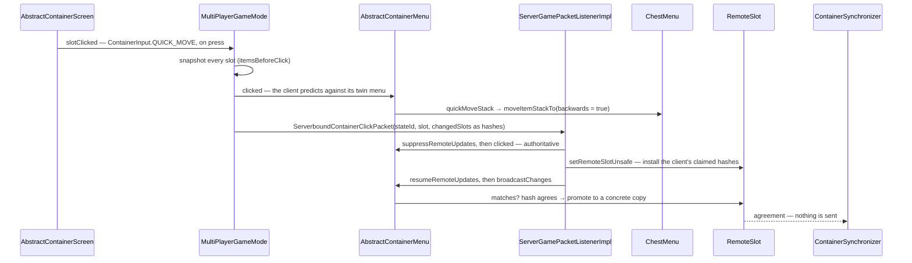

# Containers and menus

> Verified against **Minecraft 26.2** · Part VII · A player shift-clicks a stack out of a chest: one packet goes up, the server re-runs the same code against the real container, and in the ordinary case *nothing* comes back down.

## Responsibility

A `Container` is storage. A menu is the synchronised view of some
storage that a player currently has open, with slots, a cursor, a few
synchronised integers and a protocol for clicking. The system's job is to
let two machines run the same click logic against different copies of the
data and agree afterwards without shipping the data every time.

The one sentence a player recognises: *what you see when you open a
chest, and the fact that shift-click fills your hotbar first.*

The headline for a 1.21-era reader: **the old *ClickType* is gone.** It is
`ContainerInput`, a first-class network type with its own id and stream
codec. And the container-transaction acknowledgement of old is gone too,
replaced by a 15-bit state id and per-slot hashes.

## The data it owns

- **`Container`** — the storage interface: `Container.getContainerSize`,
  `Container.getItem`, `Container.setItem`, `Container.removeItem`,
  `Container.setChanged`, `Container.stillValid`, plus
  `Container.startOpen` / `Container.stopOpen`, which in 26.2 take a
  `ContainerUser` rather than a `Player`. Implementations range from
  `SimpleContainer` to `CompoundContainer` (the double chest) to the
  block entities in [block entities](../blocks/block-entities.md).
- **`AbstractContainerMenu`** — the menu itself, and it owns rather a lot:
  `AbstractContainerMenu.slots`, `AbstractContainerMenu.containerId`,
  `AbstractContainerMenu.lastSlots` (the last state the *listeners* saw),
  `AbstractContainerMenu.remoteSlots` (what the menu believes the other
  side holds), `AbstractContainerMenu.carried` (the cursor),
  `AbstractContainerMenu.dataSlots`, the quick-craft drag state machine,
  and a private 15-bit `AbstractContainerMenu.stateId`.
- **`Slot`** — a view onto one index of one `Container` at a GUI position.
  It owns policy, not data: `Slot.mayPlace`, `Slot.mayPickup`,
  `Slot.getMaxStackSize`, `Slot.onTake`, `Slot.isFake`. The subclasses
  are the policy — `ResultSlot`, `ArmorSlot`, `FurnaceFuelSlot`,
  `NonInteractiveResultSlot`, `ShulkerBoxSlot`.
- **`MenuType`** — the registry entry in `BuiltInRegistries.MENU`, which
  also carries the *client-side* constructor and a feature flag set.
- **`ContainerSynchronizer`** — the remote channel:
  `ContainerSynchronizer.sendInitialData`,
  `ContainerSynchronizer.sendSlotChange`,
  `ContainerSynchronizer.sendCarriedChange`,
  `ContainerSynchronizer.sendDataChange`, and
  `ContainerSynchronizer.createSlot`. There is exactly one per menu, and
  only `ServerPlayer.initMenu` ever attaches it.
- **`ContainerListener`** — the *local* channel, a list rather than a
  single field, compared against `AbstractContainerMenu.lastSlots` with
  real stacks. `ServerPlayer`'s implementation fires
  `CriteriaTriggers.INVENTORY_CHANGED`.
- **`RemoteSlot`** — one slot's belief about the other side, holding
  *either* a concrete `ItemStack` copy *or* a `HashedStack`.
  `RemoteSlot.PLACEHOLDER` is the null object whose
  `RemoteSlot.matches` always returns true, and it is what every slot on
  the client gets.
- **`DataSlot`** / **`ContainerData`** — synchronised integers: furnace
  progress, enchanting cost, lectern page.
- **`ContainerLevelAccess`** — the `(Level, BlockPos)` capability a
  block-anchored menu is given, with `ContainerLevelAccess.NULL` for the
  client's copy.
- **`Inventory`** — the player's own storage, with the constants that
  matter for slot arithmetic: `Inventory.INVENTORY_SIZE`,
  `Inventory.SELECTION_SIZE`, `Inventory.SLOT_OFFHAND`,
  `Inventory.SLOT_BODY_ARMOR`, `Inventory.SLOT_SADDLE`.

## When it runs

**Server main thread** for everything authoritative:
`ServerGamePacketListenerImpl.handleContainerClick`,
`ServerGamePacketListenerImpl.handleContainerClose`, `ServerGamePacketListenerImpl.handleContainerButtonClick`,
`ServerGamePacketListenerImpl.handleSetCarriedItem`, `ServerGamePacketListenerImpl.handleSetCreativeModeSlot`, all reached through
`PacketUtils.ensureRunningOnSameThread`; then
`AbstractContainerMenu.clicked`, every `Slot` and `Container` mutation,
and `AbstractContainerMenu.broadcastChanges`.

`AbstractContainerMenu.broadcastChanges` runs from `ServerPlayer.tick` — the ordinary entity
tick inside the level loop ([the level tick](../server/server-level-tick.md))
— and again, ad hoc, from `AbstractContainerMenu.slotsChanged`, from the
click handler itself, and from `ServerPlayer.take` on a pickup. The
`AbstractContainerMenu.stillValid` distance check happens **twice a tick**: once in
`ServerPlayer.tick` and once in `ServerPlayer.doTick`, which the
connection drives (see [players and sessions](../server/players-and-sessions.md)
for why player ticking is split).

**Client main thread** for the prediction:
`AbstractContainerScreen.mouseClicked` →
`AbstractContainerScreen.slotClicked` →
`MultiPlayerGameMode.handleContainerInput`, which runs the *same*
`AbstractContainerMenu.clicked` against the client's twin menu before
sending anything.

**Netty threads** only decode.

## The trace: shift-clicking a stack out of a chest

A three-row `ChestMenu` numbers its slots 0–26 for the chest, 27–53 for
the player's three main inventory rows, and 54–62 for the hotbar —
because `AbstractContainerMenu.addStandardInventorySlots` adds the main
rows before the hotbar.

1. **The press.** `AbstractContainerScreen.mouseClicked` resolves the
   hovered slot, sees an empty `AbstractContainerMenu.getCarried` and a
   held shift, and picks `ContainerInput.QUICK_MOVE`. Shift-click fires
   on press, not release.
2. **The snapshot.** `MultiPlayerGameMode.handleContainerInput` copies
   every slot's stack *before* touching anything — this is what the
   packet's diff is built from.
3. **The prediction.** The client runs `AbstractContainerMenu.clicked`
   against its own menu. The `ContainerInput.QUICK_MOVE` branch loops
   `AbstractContainerMenu.quickMoveStack` while it keeps making progress.
4. **The move.** `ChestMenu.quickMoveStack` sees the index is inside the
   chest and calls `AbstractContainerMenu.moveItemStackTo` over the
   player's range with `backwards = true`, which scans from the last slot
   down — **the hotbar first, from the right**.
5. **Two passes.** `AbstractContainerMenu.moveItemStackTo` first merges into every existing
   compatible stack across the whole range (`ItemStack.isSameItemSameComponents`,
   topping up to `Slot.getMaxStackSize`), then, if anything is left,
   finds the first empty slot that `Slot.mayPlace` accepts, places, and
   **breaks**. One empty slot per call — hence the caller's loop.
6. **The packet.** `MultiPlayerGameMode.handleContainerInput` diffs the
   post-click slots against its snapshot, hashes each changed stack with
   `HashedStack.create`, and sends `ServerboundContainerClickPacket`
   carrying the container id, the client's *last-known* state id, the
   slot, the button, the `ContainerInput`, up to 128 changed slots as
   `HashedStack`s, and the cursor as one more.
7. **The ladder.** `ServerGamePacketListenerImpl.handleContainerClick`
   checks the container id (mismatch: silently dropped), spectator or
   dying (full resync via `AbstractContainerMenu.sendAllDataToRemote`),
   `AbstractContainerMenu.stillValid` (failure: logged, *nothing sent*),
   and `AbstractContainerMenu.isValidSlotIndex`. Then it computes
   whether a full resync is needed by comparing the packet's state id
   against the menu's — **before applying anything**.
8. **The real move.** With `AbstractContainerMenu.suppressRemoteUpdates`
   held, the server runs the identical `AbstractContainerMenu.clicked` → `AbstractContainerMenu.quickMoveStack` →
   `AbstractContainerMenu.moveItemStackTo` path against the real `ChestBlockEntity` (or a
   `CompoundContainer` for a double chest) and the real `Inventory`.
   `Slot.setChanged` reaches `BlockEntity.setChanged` and marks the chunk
   dirty. The click is wrapped in a try/catch that builds a crash report
   category naming the menu class, the slot and the button.
9. **Installing the claim.** `AbstractContainerMenu.setRemoteSlotUnsafe`
   writes each hash the client sent into the matching `RemoteSlot`;
   out-of-range indices are logged and ignored rather than rejected.
   Then `AbstractContainerMenu.setRemoteCarried`, then
   `AbstractContainerMenu.resumeRemoteUpdates`.
10. **The comparison.** `AbstractContainerMenu.broadcastChanges` walks
    every slot twice over: `AbstractContainerMenu.triggerSlotListeners`
    for advancements, and the remote channel, which asks
    `RemoteSlot.matches`. Where the hash agrees,
    `RemoteSlot.Synchronized` **promotes the hash to a concrete copy** and
    sends nothing.
11. **Steady state.** One packet up, zero down. Only a disagreement
    produces `ClientboundContainerSetSlotPacket` with a fresh state id,
    and only a stale state id escalates to
    `AbstractContainerMenu.broadcastFullState` and a whole
    `ClientboundContainerSetContentPacket`.

### Why hashes

`HashedStack.create` produces `HashedStack.EMPTY` or a
`HashedStack.ActualItem` of item holder, count and a `HashedPatchMap` —
which stores, per added component, a CRC32C hash of its serialised value
rather than the value. The client is *asserting a belief*, not authoring
state: the server can compare, but it can never adopt the client's data.
It is also very much smaller than 128 full component patches per click.
`HashedStack.matches` checks count, then item, then removed-set equality
and per-component hash equality.

### The state id

`AbstractContainerMenu.incrementStateId` is a wrapping 15-bit counter,
and **only the server's synchronizer bumps it**, in `ContainerSynchronizer.sendInitialData` and
`ContainerSynchronizer.sendSlotChange`. The client stores whatever arrives.
`ContainerSynchronizer.sendCarriedChange` and `ContainerSynchronizer.sendDataChange` do not
bump it and their packets carry none. So the state id answers exactly one
question: *has the client applied every slot correction I have sent?* A
click quoting a stale id means corrections are in flight, and the server
gives up on diffing and resends everything.

## Interfaces

- **Called by:** `ChestBlock.useWithoutItem` and every other block or
  entity that opens something, through `Player.openMenu` /
  `ServerPlayer.openMenu` ([block interaction](../blocks/block-interaction.md));
  `AbstractContainerScreen` on the client;
  `ServerPlayer.tick` and `ServerPlayer.doTick` every tick.
- **Calls into:** `Container` implementations — including the block
  entities of [block entities](../blocks/block-entities.md) — `Slot`
  policy, `ItemStack.overrideStackedOnOther` and
  `ItemStack.overrideOtherStackedOnMe` (how a bundle intercepts a click
  before ordinary slot logic), and `RandomizableContainer.unpackLootTable`
  for a structure chest ([loot tables](loot-tables.md)).
- **Crosses the network as:** upward,
  `ServerboundContainerClickPacket`,
  `ServerboundContainerButtonClickPacket`,
  `ServerboundContainerClosePacket`,
  `ServerboundContainerSlotStateChangedPacket` (crafter toggles only),
  `ServerboundSetCarriedItemPacket` (**the hotbar selection, despite the
  name**), `ServerboundSetCreativeModeSlotPacket`,
  `ServerboundSelectBundleItemPacket` and
  `ServerboundPlaceRecipePacket` ([recipes](recipes.md)). Downward,
  `ClientboundOpenScreenPacket`, `ClientboundMountScreenOpenPacket`,
  `ClientboundContainerSetContentPacket`,
  `ClientboundContainerSetSlotPacket`,
  `ClientboundContainerSetDataPacket`, `ClientboundSetCursorItemPacket`,
  `ClientboundContainerClosePacket`,
  `ClientboundSetPlayerInventoryPacket` (which bypasses the menu
  entirely) and `ClientboundSetHeldSlotPacket`.
- **Data-driven by:** `BuiltInRegistries.MENU` for the type and its
  client constructor; `MenuScreens` maps a type to a screen on the
  client. Nothing about the click protocol is data-driven.

### The click kinds

`ContainerInput` has seven values and the button number means something
different in each. `ContainerInput.PICKUP` is the ordinary click, with 0 and 1 meaning
left and right — and, on the outside-the-window slot index, dropping all
or one. `ContainerInput.QUICK_MOVE` is the shift-click. `ContainerInput.SWAP` takes a hotbar index or
the offhand slot. `ContainerInput.CLONE` is creative middle-click. `ContainerInput.THROW` is Q.
`ContainerInput.QUICK_CRAFT` is drag-painting, whose button is a packed mask that
`AbstractContainerMenu.getQuickcraftHeader` and
`AbstractContainerMenu.getQuickcraftType` unpack into a phase (start,
continue, end) and a mode (even split, one each, clone). `ContainerInput.PICKUP_ALL` is
the double-click collect. `ClickAction` — `ClickAction.PRIMARY` and
`ClickAction.SECONDARY` — is *not* on the wire; it is derived server-side
inside the dispatch and handed to the item override hooks.

## Invariants and surprises

- **The client's menu is a twin, not a mirror.** It is built from
  `MenuType`'s client constructor with a *fresh* `SimpleContainer`; the
  client's chest contents have no connection to the server's block entity
  beyond the packet stream.
- **The client's synchronizer never fires, by construction.** Every slot
  starts with `RemoteSlot.PLACEHOLDER`, whose `RemoteSlot.matches` is always true,
  and only `ServerPlayer.initMenu` ever calls
  `AbstractContainerMenu.setSynchronizer`.
- **The happy path costs zero clientbound packets** — and the reason is
  that the server *adopted the client's belief object* (never its data)
  as the new baseline before comparing.
- **`AbstractContainerMenu.moveItemStackTo`'s merge pass ignores `Slot.mayPlace`.** A slot that
  would refuse an item on placement can still be topped up by a
  shift-click if it already holds a matching stack.
- **Suppression silences the network channel but not the advancement
  channel.** `AbstractContainerMenu.triggerSlotListeners` has no
  suppression guard, so `CriteriaTriggers.INVENTORY_CHANGED` sees every
  intermediate state of a shift-click that touched thirty slots.
- **A menu with a null `MenuType` cannot be opened over the network.**
  `AbstractContainerMenu.getType` throws. That is why the player's own
  `InventoryMenu` is pinned to container id 0 and both sides just build
  it independently, and why the mount menus need
  `ClientboundMountScreenOpenPacket` of their own.
- **Container ids cycle 1 to 100 and never reach 0** —
  `ServerPlayer.nextContainerCounter` — purely so a stale packet from a
  just-closed menu is unlikely to match the new one.
- **`Slot.mayPlace` and `Container.canPlaceItem` are unrelated.** The
  first is GUI policy and defaults to true without consulting the
  container; the second is what hopper automation reads. A player and a
  hopper can have different rights over the same slot.
- **An out-of-range click is not corrected.** The click handler only
  logs; the menu is closed a tick later by `ServerPlayer.tick`.
- **`ChestMenu.quickMoveStack` never calls `Slot.onTake`**, while
  `InventoryMenu.quickMoveStack` does — shift-clicking out of a chest and
  out of the crafting result are structurally different operations.
- **`Container.getMaxStackSize` defaults to 99, not 64.** The familiar
  cap comes from the per-stack overload, which mins it with the item's
  own maximum.
- **Closing a chest does not resend your inventory.**
  `AbstractContainerMenu.transferState` copies both the listener baseline
  and the remote beliefs across every `(Container, slot)` pair the
  closing menu and `InventoryMenu` share.
- **The cursor belongs to the menu, not the player**, so closing a menu
  destroys it — `AbstractContainerMenu.removed` has to explicitly rescue
  it, dropping it in the world if the player has disconnected and putting
  it back in the inventory otherwise.
- **An unknown click id decodes as `ContainerInput.PICKUP`.** `ContainerInput`'s id
  mapper is built with a zero-out-of-bounds strategy, so a malformed
  click is silently reinterpreted rather than rejected.

## Where to look

`Container` · `AbstractContainerMenu` · `AbstractContainerMenu.doClick` ·
`AbstractContainerMenu.moveItemStackTo` ·
`AbstractContainerMenu.broadcastChanges` · `Slot` · `ChestMenu` ·
`InventoryMenu` · `MenuType` · `ContainerInput` · `ClickAction` ·
`ContainerSynchronizer` · `ContainerListener` · `RemoteSlot` ·
`HashedStack` · `HashedPatchMap` · `DataSlot` · `ContainerLevelAccess` ·
`ServerPlayer.openMenu` · `ServerGamePacketListenerImpl.handleContainerClick` ·
`MultiPlayerGameMode.handleContainerInput` · `AbstractContainerScreen` ·
`MenuScreens`

---

*Rules: names, never code · how the system works, not how the code reads ·
newest version only · every backticked name passes `tools/verify_names.py`.*
