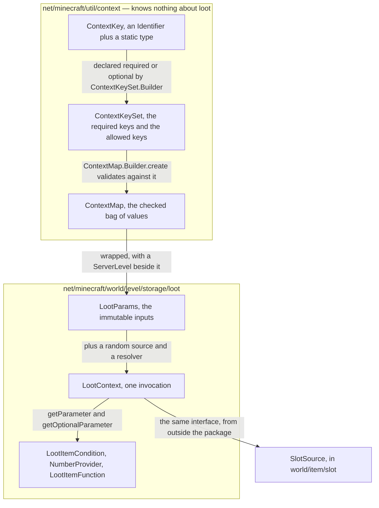
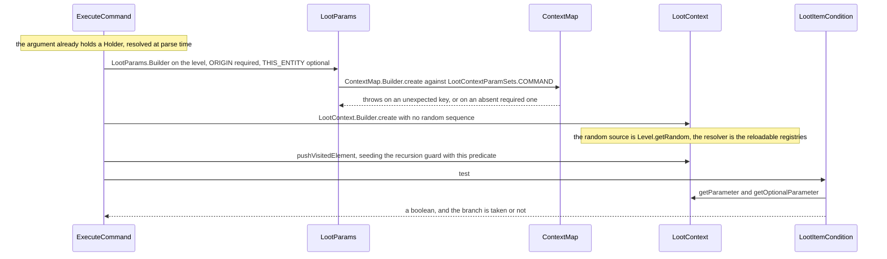

# Contexts and predicates

> Verified against **Minecraft 26.2** · Part VII · A command asks *is this true, here, of this entity?* — and the machinery that answers is the same machinery that decides what a chest contains.

You type `/execute if predicate example:in_the_rain run say wet`. Before
anything can be tested, the server has to turn *here* into something a
data-pack file is allowed to interrogate: a position, maybe an entity,
nothing else. It does that by building a small typed map of parameters and
handing it to an object loaded out of a registry, which returns a boolean.
That machinery is usually called the loot system, because most of it lives
in `net/minecraft/world/level/storage/loot` — but the keys and the sets it
is built from live in `net/minecraft/util/context` and know nothing about
loot at all. **Twelve of the twenty-six parameter sets never roll a loot
table**, and the set that is enforced is always the *caller's*: a loot
table's own declared *type* is read exactly once, by the load-time
validator, and never consulted again while the game is running.

## Two packages, one machine

The dividing line is the whole argument of this page. `ContextKey`,
`ContextKeySet` and `ContextMap` are three small general-purpose classes in
`net/minecraft/util/context` with no dependency on items, blocks, entities
or loot. Everything below them is in the loot package, and everything
*above* them is whoever wants a question answered. A loot table is one such
caller. The others are commands, entity selectors, advancement triggers,
villager trades, every enchantment effect — and, on the *client*,
`SlotDisplayContext`, which builds a `ContextMap` of its own so a recipe book
entry can resolve itself into stacks.

## The cast

| class | package | what it owns | when |
|---|---|---|---|
| `ContextKey` | *util/context* | one parameter's name and its Java type, and nothing else | — |
| `ContextKeySet` | *util/context* | which keys a call site must supply, and which it may | built once at class-init |
| `ContextMap` | *util/context* | the values, and the only place the contract is enforced | server main for loot; the client builds its own for a recipe display |
| `LootParams` | *storage/loot* | the `ServerLevel`, the map, the dynamic-drop callbacks, the luck | server main |
| `LootContext` | *storage/loot* | one invocation: the random source, the reference resolver, the visited stack | server main |
| `LootItemCondition` | *storage/loot/predicates* | a predicate over a `LootContext` — the boolean answer | server main |
| `NumberProvider` | *storage/loot/providers* | a float over a `LootContext` — the numeric answer | server main |
| `ValidationContext` | *storage/loot* | at load, whether an element asked for a key its set does not have | background executor |

> **For a 1.21-era reader.** *LootContextParam* is `ContextKey` and
> *LootContextParamSet* is `ContextKeySet`, both moved out to
> `net/minecraft/util/context`, and the predicate library that consumes them
> has left *critereon* for `net/minecraft/advancements/predicates` and
> `net/minecraft/advancements/triggers`.
> [The drift table](../../reference/naming-drift.md) has the rest.

## A key is a name with a type welded to it

`ContextKey` is an `Identifier` and a phantom type parameter. It has no
value, no default, no validation and no registry — `ContextKey.vanilla`
just makes one in the *minecraft* namespace, and only seventeen exist: the
fifteen static fields of `LootContextParams`, plus the two on
`SlotDisplayContext` that let a client draw a recipe. The type parameter is what
makes the rest of the system safe: `LootContextParams.ORIGIN` is a key of
`Vec3`, `LootContextParams.TOOL` a key of `ItemInstance` (the read-only
item view), `LootContextParams.ENCHANTMENT_LEVEL` a key of a boxed *int*, and
a reader gets that type back without a cast.

A data-pack author never writes a key's name directly. They write a
*target* — *this*, *attacker*, *target_entity*, *tool*, *block_entity* —
and `LootContextArg` turns it into a key, out of three enums nested in
`LootContext`: `LootContext.EntityTarget` with six entity keys,
`LootContext.BlockEntityTarget` and `LootContext.ItemStackTarget` with one
each. All three read through `LootContextArg.SimpleGetter`, which uses the
**optional** accessor — so a target the current set does not carry
evaluates to nothing rather than throwing.

## A set is a contract, and the caller signs it

`ContextKeySet` holds two sets: `ContextKeySet.required` and
`ContextKeySet.allowed`, the second the union of required and optional, and
its `ContextKeySet.Builder` refuses to make one key both in either order.
`LootContextParamSets` registers twenty-six of them into a private bi-map,
which is what `LootContextParamSets.CODEC` reads when a data pack names a
set by id — and the ids do not always match the field names:
`LootContextParamSets.PIGLIN_BARTER` is *barter* and
`LootContextParamSets.ALL_PARAMS` is *generic*. Every set's keys are
tabulated in [Loot context parameter
sets](../../reference/loot-context-params.md).

`LootContextParamSets.ALL_PARAMS` deserves its own warning, because it is
the default a loot table with no declared *type* gets
(`LootTable.DEFAULT_PARAM_SET`) and the set standalone predicate and
item-modifier files are validated against — and it is **not all of them**.
It declares eleven of the fifteen keys, all of them required, and omits
`LootContextParams.INTERACTING_ENTITY`, `LootContextParams.TARGET_ENTITY`,
`LootContextParams.ENCHANTMENT_LEVEL` and
`LootContextParams.ENCHANTMENT_ACTIVE`. The practical consequence: a
standalone predicate file that asks about the interacting or target
entity, or about whether an enchantment is active, *is* flagged at load;
one that asks about a block state or a damage source is not, even though
`LootContextParamSets.COMMAND` — the set `/execute if predicate` actually
builds — carries neither.

## Three ways a parameter can be missing

`ContextMap.Builder.create` is where the contract is enforced, and it is
the only place: it throws if the values collected include a key the set
does not allow, and again if the set requires a key that is absent. Note
what it compares — the keys the **caller** supplied against the set the
**caller** named. Nothing on this path ever sees the loot table.

1. **At build time.** `ContextMap.Builder.create` throws, naming the
   offending keys. That is a programming error rather than a data one, and
   it takes the tick down with it.
2. **At read time.** `LootContext.getParameter` goes to
   `ContextMap.getOrThrow` and throws; `LootContext.getOptionalParameter`
   returns nothing, and most conditions and functions degrade quietly
   rather than fail.
3. **At load time.** `ValidationContext.validateContextUsage` compares
   what an element declares it reads —
   `LootContextUser.getReferencedContextParams`, overridden by
   twenty-seven classes — against `ContextKeySet.allowed`, and reports the
   difference.

The third is the loose one, in two ways. It checks against *allowed*, not
*required*, so an element that reads an optional key passes validation and
can still take path 2 at runtime. And what
`ReloadableServerRegistries.validateLootRegistries` does with the collected
problems is **log them as warnings**: a predicate that asks for a parameter
it cannot have loads fine and misbehaves later. The same validation is a
hard error in exactly two places, both applied by a codec —
`Validatable.validatorForContext` for `VillagerTrade`, and its list form
`Validatable.listValidatorForContext` for every conditional effect in
`EnchantmentEffectComponents`. Those two build a
`ValidationContext` with no resolver, so `ValidationContext.allowsReferences`
is false and a `ConditionReference` inside a trade or an enchantment effect
is rejected outright.

## Inputs, then one invocation

`LootParams` is the immutable half: a `ServerLevel`, the `ContextMap`, a
map of `LootParams.DynamicDrop` callbacks keyed by `Identifier`, and a
float of luck. The `ServerLevel` is the mechanical guarantee that none of
this runs on the client — `LootParams.Builder` takes one in its
constructor and `LootContext.Builder.create` dereferences the server off it
for the registries, so a `ClientLevel` cannot produce a context at all.

`LootContext` is the per-invocation half, and it adds three things
`LootParams` does not have: the chosen `RandomSource`, a
`HolderGetter.Provider` that resolves references to other loaded elements,
and a set of `LootContext.VisitedEntry` used as a recursion guard.
`LootContext.pushVisitedElement` returns false when the element is already
present, which is how `ConditionReference` detects a cycle — it logs an
infinite loop and answers false. The guard is a stack, not a ledger: the
entry is popped afterwards, so naming the same predicate twice in one
evaluation is fine, and only genuine re-entrancy trips it. Both command
call sites seed it with the top-level predicate before testing, so a
predicate that references itself by name is caught on the first hop.

**Named random sequences belong to the context, not to the table.**
`LootContext.Builder.create` takes an optional `Identifier` and picks a
random source three ways, in order: an explicit source or non-zero seed
handed to the builder, else `MinecraftServer.getRandomSequence` for the
named sequence, else `Level.getRandom`. `RandomSequences` is a `SavedData`
that derives each sequence's seed from the world seed, a salt and the
sequence id, which is what makes a named sequence reproducible across
restarts. A loot table supplies that identifier from its own field — and so
does `TradeSet.randomSequence`, which is why a villager's trade selection
is reproducible by the same mechanism and has nothing to do with loot. The
seeded-chest half of the story belongs to [loot tables](loot-tables.md).

## What reads a context

`LootContextUser` — *what did you read out of the map* — has six
sub-interfaces, and two of them carry the traffic, both reached by codec
through a registry of types. `LootItemCondition` is a predicate over a
`LootContext` with twenty registered types, from
`LootItemEntityPropertyCondition` and `LocationCheck` to
`EnchantmentActiveCheck` and `ConditionReference`; `NumberProvider`
returns a float and has eight, from `ConstantValue` and `UniformGenerator`
to `EnchantmentLevelProvider`. Their codecs are forgiving in the same
shape: `LootItemCondition.DIRECT_CODEC` accepts a bare *list* as an
implicit `AllOfCondition`, and `NumberProviders.CODEC` accepts a bare
number as a `ConstantValue` and an untagged object as a
`UniformGenerator`. A third family, `SlotSource` in
`net/minecraft/world/item/slot`, reads a context through the same
interface from outside the loot package.

`ContextAwarePredicate` is the bridge the advancement system uses: a list
of `LootItemCondition` composed into one predicate, entered through
`ContextAwarePredicate.matches`. The *player* half of every trigger goes
through it — `EntityPredicate.wrap` folds an `EntityPredicate` into a
`LootItemEntityPropertyCondition` — but the rest of
`net/minecraft/advancements/predicates` need not: a trigger instance can hold
an `ItemPredicate` or a `LocationPredicate` outright and test it with no
context at all, which `ConsumeItemTrigger` and `DistanceTrigger` both do.

## Who asks, and with which set

| caller | set | when |
|---|---|---|
| `BlockBehaviour.BlockStateBase.getDrops` | `LootContextParamSets.BLOCK` | any block break ([block breaking](../blocks/block-breaking.md)) |
| `Block.dropFromBlockInteractLootTable` | `LootContextParamSets.BLOCK_INTERACT` | beehives, cave vines, carving a pumpkin, sweet berries |
| `LivingEntity.dropFromLootTable` | `LootContextParamSets.ENTITY` | death ([damage and death](../entities/damage-and-death.md)) |
| `LivingEntity.dropFromShearingLootTable` | `LootContextParamSets.SHEARING` | sheep, mooshrooms, snow golems, bogged |
| `LivingEntity.dropFromGiftLootTable` | `LootContextParamSets.GIFT` | hero gifts, cat gifts, chicken eggs, sniffer digs |
| `LivingEntity.dropFromEntityInteractLootTable` | `LootContextParamSets.ENTITY_INTERACT` | brushing an armadillo |
| `RandomizableContainer.unpackLootTable` | `LootContextParamSets.CHEST` | first touch of a structure container |
| `ContainerEntity.unpackChestVehicleLootTable` | `LootContextParamSets.CHEST` | first touch of a chest minecart or chest boat |
| `FishingHook.retrieve` | `LootContextParamSets.FISHING` | reeling in — luck is the hook's plus the owner's |
| `BrushableBlockEntity` | `LootContextParamSets.ARCHAEOLOGY` | brushing suspicious sand |
| `PiglinAi.getBarterResponseItems` | `LootContextParamSets.PIGLIN_BARTER` | bartering |
| `Mob.createEquipmentParams` | `LootContextParamSets.EQUIPMENT` | the `EquipmentUser.equip` path, on mob spawn |
| `VaultBlockEntity` | `LootContextParamSets.VAULT` | a trial chamber vault's display item and its reward |
| `TrialSpawner.ejectReward`, `TrialSpawnerStateData.getDispensingItems` | `LootContextParamSets.EMPTY` | a trial spawner's reward and its dispensed items |
| `AdvancementRewards.grant` | `LootContextParamSets.ADVANCEMENT_REWARD` | advancement loot |
| `Enchantment.damageContext` and its four siblings | the four enchanted sets plus `LootContextParamSets.HIT_BLOCK` | [an enchantment effect's condition](enchantments.md) |
| `LootCommand` | block, entity, chest or fishing | `/loot` |
| `ItemCommands.applyModifier` | `LootContextParamSets.COMMAND` | `/item … with` |
| **`ExecuteCommand`** | `LootContextParamSets.COMMAND` | **`/execute if predicate`** |
| **`EntitySelectorOptions`** | `LootContextParamSets.SELECTOR` | **a selector's *predicate* argument** |
| **`EntityPredicate.createContext`** | `LootContextParamSets.ADVANCEMENT_ENTITY` | **every advancement trigger that tests an entity** |
| **`ItemUsedOnLocationTrigger`, `AnyBlockInteractionTrigger`** | `LootContextParamSets.ADVANCEMENT_LOCATION` | **placing or using an item on a block** |
| **`DefaultBlockInteractionTrigger`** | `LootContextParamSets.BLOCK_USE` | **right-clicking a block, for an advancement** |
| **`AbstractVillager.addOffersFromTradeSet`** | `LootContextParamSets.VILLAGER_TRADE` | **rolling and filtering a villager's offers** |

The bold rows are the ones with no loot table anywhere in sight: a boolean,
or in the villager's case a `MerchantOffers`, is the whole output.
`ValidationContextSource` even keeps a cached
`LootContextParamSets.ADVANCEMENT_ENTITY` context around, because so much
of the advancement tree validates against it.

Count *sets* rather than rows and the picture is starker. Fourteen of the
twenty-six are named above by a caller that goes on to roll a `LootTable`.
**The other twelve never do.** Six are the bold rows —
`LootContextParamSets.COMMAND` counts among them, because its other caller,
`/item … with`, applies an item modifier rather than a table. Five are the
enchantment sets, built only by `Enchantment` to decide whether an effect
fires. The twelfth is `LootContextParamSets.ALL_PARAMS`, which is never
used to build a `ContextMap` at all: it exists solely as a validation
context and as `LootTable.DEFAULT_PARAM_SET`. That is why this page is not
called *loot tables*.

## The trace: `/execute if predicate`

Four details in that picture are worth pulling out.

**The predicate is resolved before the command runs.** The argument type is
`ResourceOrIdArgument.LootPredicateArgument`, which accepts *either* a
registry id *or* an inline SNBT object and hands back a `Holder` — a
reference in the first case, a direct holder over a freshly parsed
condition in the second. An unknown id fails at parse time, as a command
syntax error, not at execution.

**`LootContextParamSets.COMMAND` is thin.** It requires
`LootContextParams.ORIGIN` and optionally allows
`LootContextParams.THIS_ENTITY`, and that is all: a predicate run from
`/execute` cannot see a block state, a damage source or a tool, whatever
the standalone-file validator let through. The selector's version,
`LootContextParamSets.SELECTOR`, differs in exactly one way — it makes the
entity *required*, because a selector always has one.

**There is no random sequence.** `ExecuteCommand` passes an empty optional,
so `Level.getRandom` is what a `LootItemRandomChanceCondition` inside the
predicate draws from — not correlated between runs, not reproducible across
restarts.

**The selector path is the same code with one difference.**
`EntitySelectorOptions` builds its context *per candidate entity*, inside
the predicate it hands the parser, and looks the condition up itself
through the reloadable registries rather than through the argument type —
so a missing predicate there is a silent false, not a syntax error.

## None of this crosses the wire

`LootDataType` is the three loot registries expressed as data:
`LootDataType.TABLE` over `Registries.LOOT_TABLE`,
`LootDataType.PREDICATE` over `Registries.PREDICATE` and
`LootDataType.MODIFIER` over `Registries.ITEM_MODIFIER`. Each pairs a
registry key with a codec and a `LootDataType.ContextGetter` — the function
that says which `ContextKeySet` an element of that type is validated
against. Predicates and item modifiers get the constant
`LootContextParamSets.ALL_PARAMS`; tables get `LootTable.getParamSet`, and that
context getter is its only caller in the game. That is the sense in which a
table's declared type is never checked at runtime.

All three live in `RegistryLayer.RELOADABLE`, loaded by
`ReloadableServerRegistries.reload` on a background executor — one task per
type, each scanning the data packs, registering, loading that registry's
tags, and only then validating ([the resource
system](../foundations/resource-system.md), [identifiers and
registries](../foundations/identifiers-and-registries.md), and
[codecs](../foundations/codecs-nbt-json.md) for the files themselves). None
of the three appears in `RegistryDataLoader.SYNCHRONIZED_REGISTRIES`, the
list `RegistrySynchronization.isNetworkable` tests, so none is ever packed
for a client. What crosses the wire is only the *result* — a container
packet, an item entity, a command's success.

The two dependants outside this part are Part XIII's commands, which own
`/execute if predicate` and the selector argument, and the advancement
system, whose triggers build a context per tested entity.

## Where to look

`ContextKey` · `ContextKeySet` · `ContextMap` · `LootContextParams` ·
`LootContextParamSets` · `LootParams` · `LootContext` · `LootContextArg` ·
`LootContextUser` · `LootItemCondition` · `LootItemConditions` ·
`ConditionReference` · `NumberProvider` · `NumberProviders` ·
`SlotSource` · `ContextAwarePredicate` · `EntityPredicate` ·
`Validatable` · `ValidationContext` · `ValidationContextSource` ·
`LootDataType` · `ReloadableServerRegistries` · `ExecuteCommand` ·
`EntitySelectorOptions` · `ResourceOrIdArgument` · `RandomSequences`

---

*Rules: names, never code · how the system works, not how the code reads ·
newest version only · every backticked name passes `tools/verify_names.py`.*
