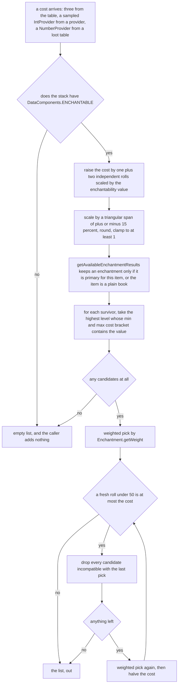
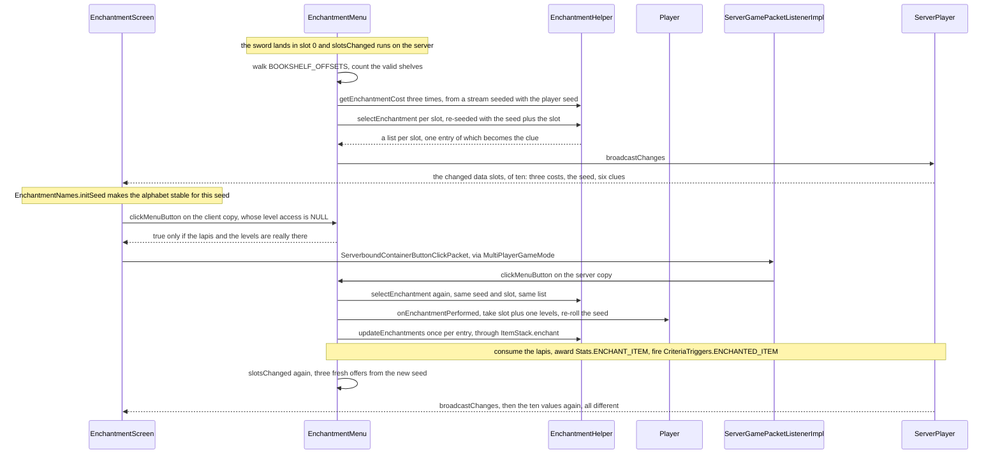

# Enchanting: the five paths, and what each one is allowed to do

> Verified against **Minecraft 26.2** · Part VII · A player reads three offers off an enchanting table and buys one, and then the same sword picks up enchantments four other ways — an anvil, a grindstone running backwards, a spawning pillager, and a command.

A sword goes in the left slot of an enchanting table and three lapis in the
right, and the table answers with three lines of Standard Galactic Alphabet,
three level numbers, and — if you hover — one enchantment named outright.
None of that is guessed. The server has already run the entire selection,
and it ships the answer to the client as ten integers. One of those ten is
`Player.enchantmentSeed`, and it is the reason the page is worth a lecture:
**one number per player, saved in the player file, carried across death and
dimension change, sent to the client, and re-rolled by nothing in the game
except the enchanting table itself.** Spend thirty levels at an anvil and
come back and the table is offering exactly what it offered before — and the
gibberish is in the same handwriting, because the client is drawing it from
that same number.

The table is one of five paths that change what a stack is enchanted with —
four of them adding and the grindstone taking away — and they differ far more
than the shared vocabulary suggests. This page is about those differences. A
sixth writer hides outside all of them, in the crafting grid: `RepairItemRecipe`
carries every curse from both inputs onto the tool it makes
([recipes](recipes.md)). What an enchantment *is* — the record, the effect
components, the hooks that fire in combat — is
[the next page along](enchantments.md) and is not re-taught here.

## The cast

| class | what it decides | thread |
|---|---|---|
| `EnchantmentMenu` | the three offers, the clue, and what the click costs | server main, with a client copy that can only say no |
| `EnchantmentHelper` | the cost curve, the weighted selection, and the write every path ends in | whichever side asks |
| `Player` | the seed and the levels | server main |
| `AnvilMenu` | the merge arithmetic and the price | server main |
| `GrindstoneMenu` | the only removal a player can reach, and the refund | server main |
| `EnchantmentProvider` | what a mob's spawn equipment gets | server main |
| `EnchantRandomlyFunction` | chest loot and villager trades | server main |
| `EnchantCommand` | the operator's path, and the fewest checks | server main |

`EnchantWithLevelsFunction`, `SetEnchantmentsFunction` and
`EnchantedCountIncreaseFunction` are the other three loot functions, named
below where they differ; `EnchantmentScreen` is the client half of the table
and gets its own section.

## The five paths at a glance

| | enchanting table | anvil | grindstone | providers and loot | `/enchant` |
|---|---|---|---|---|---|
| **what it costs** | 1, 2 or 3 levels and the same count of lapis | the full price in levels, and a chance the anvil chips | pays *you*, in orbs at the block | nothing | nothing |
| **the gate on the item** | `ItemStack.isEnchantable` — enchantable *and* not already enchanted | `EnchantmentHelper.canStoreEnchantments` | damageable or already enchanted | `DataComponents.ENCHANTABLE`, except `SingleEnchantment` and `EnchantRandomlyFunction` | any non-empty main-hand item |
| **which item filter** | `Enchantment.isPrimaryItem` — the narrow set | `Enchantment.canEnchant` — the supported set | n/a | `Enchantment.isPrimaryItem` for the selection paths, `Enchantment.canEnchant` for `EnchantRandomlyFunction`, none at all for `SingleEnchantment` | `Enchantment.canEnchant` |
| **the level ceiling** | whatever the cost brackets allow | clamped to `Enchantment.getMaxLevel` | n/a | clamped, except `SetEnchantmentsFunction` | rejected above `Enchantment.getMaxLevel` |
| **exclusivity** | filtered out mid-selection | dropped, and it raises the price | curses survive, everything else goes | filtered, or ignored by flag | rejected with an error |
| **randomness** | the player's saved seed | none in the arithmetic; a 12% roll for the chip | none in the strip; a roll on the refund | the level's random source | none |
| **decided on** | server, with the click predicted | server, with the price synced | server | server | server |

Five paths, one row that would be the same everywhere: the last step. Not the
same method — the table, `/enchant` and `EnchantRandomlyFunction` go through
`ItemStack.enchant`, the grindstone and the providers call
`EnchantmentHelper.updateEnchantments` themselves, and the anvil writes with
`EnchantmentHelper.setEnchantments` — but the same *decision*, and that is
where the page starts.

## The one question all five ask

`EnchantmentHelper.getComponentType` is the private line under every one of
those three entry points, and it does the thing worth knowing before any of
the five paths make sense.

It **routes by item identity**: the component the write lands in is
`DataComponents.STORED_ENCHANTMENTS` if the stack is `Items.ENCHANTED_BOOK`
and `DataComponents.ENCHANTMENTS` otherwise — a hard identity test against
one item, not a tag. That is why every path that can be handed a plain
`Items.BOOK` transmutes it *first*, through `ItemStack.transmuteCopy` or by
building a fresh stack. The transmute is not cosmetic: enchant a plain book
and the levels would land in the active component and the book would start
*working*.

`EnchantmentHelper.updateEnchantments` adds one more rule of its own: it
**silently does nothing if the component is absent**, returning
`ItemEnchantments.EMPTY` on a null read. In practice every item gets
`DataComponents.ENCHANTMENTS` from `DataComponents.COMMON_ITEM_COMPONENTS`,
so the case only arises when an item definition replaces the default
component initializer or a patch removes the component from a stack — and
then the four paths through it become a no-op, with no error anywhere
([data components](../foundations/data-components.md)).

The merge itself is `ItemEnchantments.Mutable.upgrade`: keep the higher
level, cap at 255, ignore a level of zero. Only
`ItemEnchantments.Mutable.set` can lower a level, and only the anvil — where
it clamps an over-maximum level down — and `SetEnchantmentsFunction` reach for
it. The grindstone does not lower anything; it removes.

## What it costs, and who pays

The enchanting table's headline number is not its price. The level
*requirement* for a slot is the cost the table computed for it — up to
thirty at the bottom slot — but the amount `Player.onEnchantmentPerformed`
actually subtracts is the slot's index plus one, and the lapis consumed is
the same one, two or three.

| what the forum says | what the decompile does |
|---|---|
| the bottom offer costs thirty levels | `EnchantmentMenu.clickMenuButton` requires thirty levels and takes **three** |
| more bookshelves make better enchantments | more bookshelves raise the *cost*, and `EnchantmentHelper.getEnchantmentCost` floors the bottom slot at twice the shelf count |
| the anvil's "Too Expensive" is a level cap | it is a result cap — at a price of forty or more `AnvilMenu.createResult` empties the output slot unless the player has infinite materials |

The anvil is the opposite: it charges the whole displayed price, through
`Player.giveExperienceLevels` with a negative amount, in `AnvilMenu.onTake`,
and then rolls a small chance to damage or destroy the block. The price is
a prior-work tax read from `DataComponents.REPAIR_COST` on **both** inputs,
plus one per repair material consumed, plus `Enchantment.getAnvilCost` times
the resulting level for every enchantment transferred (halved with a floor
of one when the addition is a book), plus one for a rename. The **larger** of
the two inputs' `DataComponents.REPAIR_COST` is then doubled and incremented
by `AnvilMenu.calculateIncreasedRepairCost` and written onto the result — the
whole of the prior-work spiral, and the one step a pure rename skips. Two cases escape that arithmetic: an input stack of more than one
item sets the price to a flat **40** the moment any enchantment actually
transfers, which — forty being exactly the threshold at which the result is
withheld — makes enchanting a stack not expensive but forbidden outside
creative; and a rename with no other change is capped at 39, which is why
renaming never hits "Too Expensive".

The grindstone runs the transaction backwards. It strips everything not in
`EnchantmentTags.CURSE`, turns an emptied `Items.ENCHANTED_BOOK` back into a
plain `Items.BOOK` with `ItemStack.transmuteCopy`, and rebuilds
`DataComponents.REPAIR_COST` from zero, so a clean item leaves with its
prior work erased. The refund is the sum of `Enchantment.getMinCost` at each
stripped level, halved upward with a random bonus of up to one less than that
half again,
and it arrives as orbs from `ExperienceOrb.award` at the block — on the
ground, not in the player
([hunger and experience](../player/hunger-and-experience.md)).

## What each path is allowed to add

Two predicates are doing the work, and the difference between them is the
difference between the enchantments an axe is *offered* and the enchantments
an axe can *hold*.

`Enchantment.canEnchant` asks whether the item's *type* is in the
definition's supported set; `Enchantment.isSupportedItem` asks exactly the
same question of a stack and is called from nowhere but the method below.
`Enchantment.isPrimaryItem` asks the supported question **and** the narrower
primary-items question on top, falling back to the supported set when the
definition names no primary items. The narrow one lives in
`EnchantmentHelper.getAvailableEnchantmentResults`, which is
`EnchantmentHelper.selectEnchantment`'s own — so the table, the cost-based
providers and chest loot all use it, and the anvil and `/enchant` do not. In
vanilla exactly
five enchantments declare a narrower primary set than their supported one.
Three of them are melee enchantments whose supported set reaches axes and
whose primary set stops at swords and spears, which is why no enchanting
table has ever offered Sharpness on an axe while every anvil will put it
there. A fourth does the same to the mace, and the fifth is Thorns, offered
only on a chestplate and wearable anywhere.

The anvil uses `Enchantment.canEnchant`, overridden to true when the target
is an `Items.ENCHANTED_BOOK` or the player has infinite materials, so books
collect anything. Its arithmetic per transferred enchantment is short: the
same level on both sides merges to one higher, different levels take the
maximum, and the winner is clamped to `Enchantment.getMaxLevel`. An
enchantment the target cannot take is dropped and **costs nothing**; one
that conflicts with something already on the result is dropped *and* adds
one to the price per conflicting pair — the anvil's only punitive rule. If
nothing survives, the result slot is emptied.

### The ceilings, and who ignores them

`/enchant` is the shortest path and, contrary to its reputation, not the
laxest. `EnchantCommand` rejects a level above `Enchantment.getMaxLevel`
before it looks at any target, then per target requires a `LivingEntity`
whose `LivingEntity.getMainHandItem` is non-empty, then checks
`Enchantment.canEnchant` and `EnchantmentHelper.isEnchantmentCompatible`
against what the stack already carries — and from there it is the same tail
as everything else. What it skips is the primary filter, the enchantability
component and the cost, not the supported-items or level rules. It also
accepts a level of zero, which passes every check, reports success, and
changes nothing.

The genuine ceiling-breaker is elsewhere. `SetEnchantmentsFunction` writes
through `ItemEnchantments.Mutable.set`, whose only clamp is 255, with no
reference to `Enchantment.getMaxLevel` at all: a loot table can hand out
Sharpness 200 and nothing else on this page can. Exclusivity, by contrast,
is one static method everywhere — `Enchantment.areCompatible`, wrapped by
`EnchantmentHelper.isEnchantmentCompatible` and
`EnchantmentHelper.filterCompatibleEnchantments` — and it is **symmetric**,
failing if either side's exclusive set names the other, and failing an
enchantment against itself.

## Where the randomness comes from

The anvil and the grindstone roll a die each — for the chip and for the refund
— but only the table and the provider and loot paths roll one to decide *what
you get*, and they roll it in the same place:
`EnchantmentHelper.selectEnchantment`, a short method
with four distinct sources of variance stacked on one another.

The enchantability perturbation is the first place the item matters:
`Enchantable.value` — gold's is famously high — widens two independent rolls
that only ever push the cost **up**. The span that follows is triangular
rather than flat, so the extremes are rare. The bracket test in
`EnchantmentHelper.getAvailableEnchantmentResults` walks levels downward and
stops at the first fit, so a high cost buys a high level of one enchantment
rather than more of them. Buying more is the loop's job: the cost halves
after every extra pick, so by the third or fourth pass the roll is nearly
always lost — while from a cost of forty-nine up the first extra is certain.

The table adds one more layer. `EnchantmentMenu.slotsChanged` seeds its
`RandomSource` with `Player.enchantmentSeed` for the three costs, then
re-seeds it with the seed **plus the slot number** before each selection,
which is why the three offers are independent of each other and yet
reproducible. `EnchantmentHelper.getEnchantmentCost` returns zero outright
for an item with no `DataComponents.ENCHANTABLE`, and a slot whose cost came
out below its own index plus one is zeroed too.

Bookshelves reach it as a plain integer. `EnchantmentMenu` walks
`EnchantingTableBlock.BOOKSHELF_OFFSETS` — a fixed list of thirty-two
offsets, the outer ring of a five-by-five footprint at two heights — and
`EnchantingTableBlock.isValidBookShelf` requires the block at the offset to
be in `BlockTags.ENCHANTMENT_POWER_PROVIDER` **and** the block between it
and the table to be in `BlockTags.ENCHANTMENT_POWER_TRANSMITTER`
([tags](../foundations/tags.md)). That between position halves the X and Z
offsets but leaves Y alone, so the upper ring's gap is checked at the
bookshelf's own height, not the table's. The clamp to fifteen happens
inside `EnchantmentHelper.getEnchantmentCost`, not in the walk.

**Fifteen** — the shelf count above which nothing changes, and twice which
is the floor on the bottom offer (`EnchantmentHelper.getEnchantmentCost`).

## What is decided on which side

The clue you hover is not a hint about what you might get: it is a genuine
member of the exact list you *will* get. `EnchantmentMenu.slotsChanged` runs
the selection for real, shows one entry of the result at random and throws
the rest away, and `EnchantmentMenu.clickMenuButton` runs the same selection
again from the same seed and slot and applies all of it. The one wrinkle is
the plain book, which has one random entry deleted from its list before either
use — unless the list has only one entry, which survives.

The predicted click is the sharpest thing on that diagram.
`EnchantmentScreen.mouseClicked` calls `EnchantmentMenu.clickMenuButton` on
its own local menu and only sends the packet if that call returns true. On
the client the menu's level access is `ContainerLevelAccess.NULL`, whose
evaluation returns an empty optional without running the action at all — so
the entire enchanting body is skipped, and what the client really evaluates
is the guard in front of it: the lapis count, the level requirement, and
`Player.hasInfiniteMaterials`. The affordability check is real on both
sides; the enchanting is real on one.
[Containers and menus](containers-and-menus.md) has the data-slot and
button-click machinery in general.

The ten slots are ordinary `DataSlot` entries — three `DataSlot.shared`
views onto the cost array, one `DataSlot.standalone` holding the seed — and
they reach the client one `ClientboundContainerSetDataPacket` each as
`AbstractContainerMenu.broadcastChanges` diffs them against its remote copy.
The clue slots carry a **numeric registry id** that `EnchantmentScreen`
resolves against its own registry copy — the same registry copy that
`ItemEnchantments`' stream codec needs to name the enchantments on any stack
the client is sent. The seed slot is
the only route by which `Player.enchantmentSeed` ever reaches a client: it
is written to the player file as *XpSeed*, re-rolled on read if it loads
back as zero, copied unconditionally by `ServerPlayer.restoreFrom` across
death and dimension change, and named in no packet of its own.
`EnchantmentNames.initSeed` then seeds one shared `RandomSource` with it per
frame and `EnchantmentNames.getRandomName` draws three or four words from a
fixed list in the *alt* font — same seed, same three lines, every time.

## The paths that never show a player anything

The provider path runs at spawn. `Mob.enchantSpawnedEquipment` calls
`EnchantmentHelper.enchantItemFromProvider`, which looks a provider up in
`Registries.ENCHANTMENT_PROVIDER` and hands the stack's mutable enchantment
map to `EnchantmentProvider.enchant`. `EnchantmentsByCost` and
`EnchantmentsByCostWithDifficulty` go through
`EnchantmentHelper.selectEnchantment`, so a mob's gear is rolled by exactly
the arithmetic the table uses, with the regional difficulty widening the
cost; `SingleEnchantment` skips selection entirely, upgrading one named
enchantment to a sampled level clamped only to that enchantment's own range,
never asking whether the item supports it. Six of the seven providers
`VanillaEnchantmentProviders` registers are that third kind.

The loot path runs wherever a loot table does, and villager trades are on
it: a `VillagerTrade` carries a list of `LootItemFunction`s applied to what
it gives, and the librarian's enchanted book is `EnchantRandomlyFunction`
with compatibility checking turned *off*, followed by a filter that discards
the trade if the result somehow is not an enchanted book.
`EnchantWithLevelsFunction` is the chest-loot one and calls
`EnchantmentHelper.enchantItem` — the same selection again;
`SetEnchantmentsFunction` is the deterministic one. Both random ones can set
`DataComponents.ADDITIONAL_TRADE_COST` when the context offers
`LootContextParams.ADDITIONAL_COST_COMPONENT_ALLOWED`, which is how a strong
enchantment makes a trade dearer ([loot tables](loot-tables.md),
[contexts and predicates](contexts-and-predicates.md)).
`EnchantedCountIncreaseFunction` sits in the same package and is the odd one
out: it adds nothing, reading a level off the killer with
`EnchantmentHelper.getEnchantmentLevel` to multiply a drop count. It
consumes this page's output rather than producing any.

One more producer belongs in nobody's mental model of enchanting.
`CreativeModeTabs` builds the creative enchanted books with
`EnchantmentHelper.createBook` — maximum level only in the tab, every level
in the search, through
`CreativeModeTabs.generateEnchantmentBookTypesOnlyMaxLevel` and
`CreativeModeTabs.generateEnchantmentBookTypesAllLevels`.

## Where to look

`EnchantmentMenu.slotsChanged` · `EnchantmentMenu.clickMenuButton` ·
`EnchantingTableBlock.BOOKSHELF_OFFSETS` ·
`EnchantingTableBlock.isValidBookShelf` ·
`EnchantmentHelper.getEnchantmentCost` ·
`EnchantmentHelper.selectEnchantment` ·
`EnchantmentHelper.getAvailableEnchantmentResults` ·
`EnchantmentHelper.filterCompatibleEnchantments` ·
`EnchantmentHelper.updateEnchantments` · `ItemStack.enchant` ·
`Enchantment.areCompatible` · `Enchantment.isPrimaryItem` ·
`Enchantment.canEnchant` · `AnvilMenu.createResult` · `AnvilMenu.onTake` ·
`GrindstoneMenu` · `EnchantmentProvider` · `VanillaEnchantmentProviders` ·
`EnchantRandomlyFunction` · `EnchantWithLevelsFunction` ·
`SetEnchantmentsFunction` · `EnchantCommand` ·
`Player.onEnchantmentPerformed` · `EnchantmentScreen.mouseClicked` ·
`EnchantmentNames`

---

*Rules: names, never code · how the system works, not how the code reads ·
newest version only · every backticked name passes `tools/verify_names.py`.*
