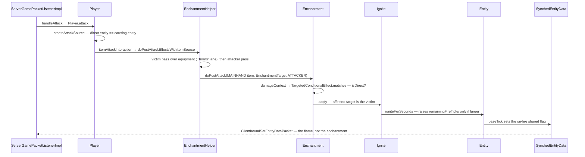

# Enchantments

> Verified against **Minecraft 26.2** · Part VII · A player hits a zombie with a Fire Aspect sword: one data-pack record, one loot predicate and one effect object set the zombie on fire, and nothing about the enchantment crosses the wire.

## Responsibility

An enchantment is a named modifier that other systems ask about at
well-defined moments. It holds no code at all: `Enchantment` is a record
of a description, a definition and a **map of effect components**, loaded
from a data pack. The system's job is to store those records, put them on
items, and offer a set of hooks that combat, mining, fishing, projectiles
and durability call into.

The one sentence a player recognises: *Sharpness makes your sword hurt
more and Fire Aspect sets things alight.*

The headline: **there are no enchantment subclasses.** The vanilla
enchantments are JSON files in the built-in data pack, `Enchantments` is
a bag of registry keys, and the behaviour lives in a registry of effect
objects that the definition names.

## The data it owns

- **`Enchantment`** — a record of the description, an
  `Enchantment.EnchantmentDefinition`, an exclusive set, and a
  `DataComponentMap` of effects.
- **`Enchantment.EnchantmentDefinition`** — the supported items and the
  narrower primary items (a `HolderSet` and an *optional* one, normally
  tags; `Enchantment.isPrimaryItem` falls back to the supported set when
  the second is absent), the weight, the maximum level, the minimum and
  maximum cost curves, the anvil cost and the equipment slot groups it
  applies in. The codec bounds weight to 1–1024 and the level to
  1–`Enchantment.MAX_LEVEL`, which is 255.
- **`Enchantment.Cost`** — `Enchantment.Cost.base` plus
  `Enchantment.Cost.perLevelAboveFirst`, evaluated by
  `Enchantment.Cost.calculate`. Note that `Enchantment.getMinLevel` is
  hardcoded to 1 while everything else about levels is data.
- **`EnchantmentEffectComponents`** — the thirty-one component keys that
  make up the effects map. Each is one hook:
  `EnchantmentEffectComponents.DAMAGE`,
  `EnchantmentEffectComponents.DAMAGE_PROTECTION`,
  `EnchantmentEffectComponents.DAMAGE_IMMUNITY`,
  `EnchantmentEffectComponents.KNOCKBACK`,
  `EnchantmentEffectComponents.POST_ATTACK`,
  `EnchantmentEffectComponents.POST_PIERCING_ATTACK` (for spears),
  `EnchantmentEffectComponents.HIT_BLOCK`,
  `EnchantmentEffectComponents.ITEM_DAMAGE`,
  `EnchantmentEffectComponents.EQUIPMENT_DROPS`,
  `EnchantmentEffectComponents.LOCATION_CHANGED`,
  `EnchantmentEffectComponents.TICK`,
  `EnchantmentEffectComponents.ATTRIBUTES`,
  `EnchantmentEffectComponents.BLOCK_EXPERIENCE`,
  `EnchantmentEffectComponents.REPAIR_WITH_XP`,
  `EnchantmentEffectComponents.PREVENT_EQUIPMENT_DROP`,
  `EnchantmentEffectComponents.PREVENT_ARMOR_CHANGE` and the rest.
- **The three effect registries, which are not disjoint.**
  `EnchantmentValueEffect` modifies a number (`AddValue`,
  `MultiplyValue`, `SetValue`, `RemoveBinomial`, `ScaleExponentially`,
  and `AllOf.ValueEffects` — the top-level `AllOf` is an interface
  holding three nested records, one per registry).
  `EnchantmentEntityEffect` does something to an entity (`Ignite`,
  `DamageEntity`, `ChangeItemDamage`, `ApplyMobEffect`, `ApplyExhaustion`,
  `SummonEntityEffect`, `ExplodeEffect`, `SpawnParticlesEffect`,
  `PlaySoundEffect`, `ApplyEntityImpulse`, `RunFunction`, `ReplaceBlock`,
  `ReplaceDisk`, `SetBlockProperties`) — and it *extends*
  `EnchantmentLocationBasedEffect`, so fourteen of the fifteen
  location-based effects are the entity effects under the same ids. The
  one that is only location-based is `EnchantmentAttributeEffect`, which
  installs an `AttributeModifier`
  ([attributes](../entities/attributes.md)).
- **`LevelBasedValue`** — the level-to-number curve, with
  `LevelBasedValue.Linear`, `LevelBasedValue.Clamped`,
  `LevelBasedValue.Fraction`, `LevelBasedValue.LevelsSquared`,
  `LevelBasedValue.Exponent` and `LevelBasedValue.Lookup`.
  `LevelBasedValue.Constant` is deliberately *not* in the dispatch
  registry — it is the other arm of an either-codec, which is what makes
  a bare float legal anywhere one is expected.
- **`ConditionalEffect`** and **`TargetedConditionalEffect`** — an effect
  plus an optional loot condition, and, for the attack hooks, two
  `EnchantmentTarget` fields: which side of the fight the enchantment
  *lives on* and which side it *lands on*.
- **`ItemEnchantments`** — the map stored on the stack, under
  `DataComponents.ENCHANTMENTS` (active) or
  `DataComponents.STORED_ENCHANTMENTS` (an enchanted book's inert set).
  It is immutable; `ItemEnchantments.Mutable` is the only way to change
  one, and its upgrade path merges by maximum and clamps at 255.
- **`EnchantmentInstance`** — a `(Holder<Enchantment>, level)` pair with
  a weight delegate. The whole weighted-selection path is built on it.
- **`EnchantedItemInUse`** — the bundle every effect receives: the stack,
  the slot it is in, the owner, and a break callback.
- **`EnchantmentHelper`** — the static hook surface. It holds no state;
  it is the seam between the enchantment system and everything else.

## When it runs

**Server main thread for every *effect*, with two exceptions that are
worth knowing.** `EnchantmentEntityEffect` and
`EnchantmentLocationBasedEffect` cannot run on the client: their
signatures demand a `ServerLevel`. But `Enchantment.modifyUnfilteredValue`
takes only a `RandomSource`, and its two users —
`Enchantment.modifyCrossbowChargeTime` and
`Enchantment.modifyTridentSpinAttackStrength` — are reached from
client-only code. `CrossbowItem.getChargeDuration` is called by the item
renderer and by three entity renderers, so **Quick Charge is evaluated on
the render thread every frame a crossbow is being drawn**; and
`MultiPlayerGameMode.useItem` runs `TridentItem`'s use locally, so
**Riptide's spin-attack strength is computed client-side too**, which is
what lets the riptide push be predicted at all.

Everything else the client does with an enchantment is drawing: the
tooltip through `ItemEnchantments.addToTooltip` and
`Enchantment.getFullname`, the glint through `ItemStack.hasFoil`, and the
attribute lines through `EnchantmentHelper.forEachModifier` — which means
the client evaluates the `LevelBasedValue` curve itself.

**Data-pack load** builds the records. `Registries.ENCHANTMENT` is a
dynamic registry, and — unusually — the effect codecs validate their loot
conditions *at decode time* against the parameter set the effect will
actually be evaluated with, so a *post_attack* effect asking about a
block state fails to load rather than throwing later. Only the ten
conditional-list components carry that validator; the value and flag
components have no conditions to check.

## The trace: Fire Aspect

Fire Aspect as data: supported and primary items are tags, weight 2,
maximum level 2, a dynamic cost curve, and **one effect** — a
`EnchantmentEffectComponents.POST_ATTACK` entry whose enchanted target is
the attacker, whose affected target is the victim, whose effect is
`Ignite` with a per-level duration, and whose condition is a damage-source
predicate requiring a *direct* hit. (The vanilla numbers are read out of
`Enchantments.bootstrap`, the generator that writes those JSON files.)

1. **The swing.** `ServerGamePacketListenerImpl.handleAttack` runs the
   range checks and calls `Player.attack` — unless the main-hand item has
   `DataComponents.PIERCING_WEAPON`, in which case the packet is dropped
   and the whole trace below never happens (see
   [the sword swing](../player/the-sword-swing.md) for the spear's path).
2. **The source.** `Player.createAttackSource` builds a `DamageSource`
   from the weapon in which the direct entity and the causing entity are
   the same, so `DamageSource.isDirect` is true. This single fact is why
   Fire Aspect never fires through an arrow.
3. **The damage.** `ServerPlayer.getEnchantedDamage` — the override, not
   the base method, which returns its argument unchanged — calls
   `EnchantmentHelper.modifyDamage` for Sharpness and friends, and the
   hit goes through `Entity.hurtOrSimulate`, which dispatches to
   `LivingEntity.hurtServer` on a `ServerLevel`
   ([damage and death](../entities/damage-and-death.md)).
4. **The hook.** On a successful hit, `Player.itemAttackInteraction`
   calls `EnchantmentHelper.doPostAttackEffectsWithItemSource`.
5. **Three branches, not two.** The victim's whole equipment is walked
   first — that is Thorns' lane. Then, if the damage has a living causing
   entity, the attacker's **main hand only**, and only for enchantments
   whose declared slots include the main hand. A third branch exists for
   the case where the causing entity is not living: a slotless pass with
   no slot filter at all, which in vanilla only a thrown trident takes.
   An attacker's armour can never contribute a post-attack effect.
6. **Filtering.** `Enchantment.doPostAttack` keeps only the entries whose
   *enchanted* target matches the pass it is in.
7. **The condition.** `Enchantment.damageContext` builds a `LootContext`
   on the enchanted-damage parameter set — the victim, the level, the
   origin, the damage source, and the attacking entities — and
   `TargetedConditionalEffect.matches` evaluates the predicate against
   it. The whole "melee only" rule is one loot condition.
8. **The target.** The *affected* field picks who receives it: attacker,
   direct entity, or victim. Fire Aspect says victim. If that entity
   works out to null, the effect is silently dropped.
9. **The effect.** `Ignite.apply` calls `Entity.igniteForSeconds` with
   the level-based duration.
10. **The burn.** `Entity.igniteForTicks` raises the counter **only if
    the new value is larger** — and clears any freeze regardless — so
    re-hitting a burning target with a weaker Fire Aspect does nothing
    but thaw it. The damage that follows is dealt by `Entity.baseTick`,
    once every twenty ticks, on a `ServerLevel`, if the entity is not
    fire-immune and not standing in lava.
11. **The flame.** `Entity.baseTick` sets the on-fire shared flag in
    `Entity.DATA_SHARED_FLAGS_ID`
    ([synched entity data](../entities/synched-entity-data.md)), which
    travels as `ClientboundSetEntityDataPacket` and becomes
    `Entity.displayFireAnimation` on the client — whose own copy of
    `Entity.baseTick` clears the fire counter instead of burning.

## Interfaces

The most useful way to read this system is as a *hook table*: the
enchantment package barely calls anything, and everything calls it.

| `EnchantmentHelper` entry point | who calls it |
|---|---|
| `EnchantmentHelper.modifyDamage` | `ServerPlayer.getEnchantedDamage`, `Mob.doHurtTarget`, `AbstractArrow`, `ThrownTrident` |
| `EnchantmentHelper.modifyKnockback` | `LivingEntity.getKnockback`, `AbstractArrow` |
| `EnchantmentHelper.modifyFallBasedDamage` | `MaceItem` — Density |
| `EnchantmentHelper.getDamageProtection` | `LivingEntity.getDamageAfterMagicAbsorb` |
| `EnchantmentHelper.modifyArmorEffectiveness` | `CombatRules` |
| `EnchantmentHelper.isImmuneToDamage` | `LivingEntity.isInvulnerableTo`, via `EnchantmentEffectComponents.DAMAGE_IMMUNITY` and the `DamageImmunity` effect |
| `EnchantmentHelper.doPostAttackEffectsWithItemSource` | `Player.itemAttackInteraction`, `AbstractArrow` |
| `EnchantmentHelper.doPostAttackEffects` | `Player.doSweepAttack`, `Mob.doHurtTarget`, `LivingEntity.stabAttack`, and most projectiles |
| `EnchantmentHelper.doPostPiercingAttackEffects` | `LivingEntity.postPiercingAttack` |
| `EnchantmentHelper.getItemEnchantmentLevel` | `ApplyBonusCount`, `BonusLevelTableCondition` — **Fortune** |
| `EnchantmentHelper.getEnchantmentLevel` | `EnchantedCountIncreaseFunction` — **Looting** |
| `EnchantmentHelper.tickEffects` | `LivingEntity.baseTick` |
| `EnchantmentHelper.runLocationChangedEffects` / `EnchantmentHelper.stopLocationBasedEffects` | `LivingEntity.onChangedBlock`, `LivingEntity.collectEquipmentChanges`, `ServerPlayer.setGameMode` |
| `EnchantmentHelper.processDurabilityChange` | `ItemStack.hurtAndBreak` |
| `EnchantmentHelper.processEquipmentDropChance` | `Mob` |
| `EnchantmentHelper.processAmmoUse`, `EnchantmentHelper.processProjectileCount`, `EnchantmentHelper.processProjectileSpread` | `ProjectileWeaponItem` |
| `EnchantmentHelper.getPiercingCount` | `AbstractArrow` |
| `EnchantmentHelper.onProjectileSpawned` | `Projectile.applyOnProjectileSpawned` |
| `EnchantmentHelper.onHitBlock` | `AbstractArrow`, `ThrownTrident`, `ServerPlayerGameMode` |
| `EnchantmentHelper.getTridentReturnToOwnerAcceleration` | `ThrownTrident` — Loyalty |
| `EnchantmentHelper.getTridentSpinAttackStrength` | `TridentItem` — **on both sides** |
| `EnchantmentHelper.processBlockExperience` | `Block.tryDropExperience` |
| `EnchantmentHelper.processMobExperience` | `LivingEntity.getExperienceReward` |
| `EnchantmentHelper.modifyDurabilityToRepairFromXp` / `EnchantmentHelper.getRandomItemWith` | `ExperienceOrb.repairPlayerItems` — Mending |
| `EnchantmentHelper.forEachModifier` | `ItemStack.forEachModifier` → equipment attribute changes and the tooltip |
| `EnchantmentHelper.getFishingLuckBonus`, `EnchantmentHelper.getFishingTimeReduction` | `FishingRodItem` |
| `EnchantmentHelper.modifyCrossbowChargingTime` | `CrossbowItem` — **on both sides** |
| `EnchantmentHelper.pickHighestLevel` | `CrossbowItem`, `TridentItem` |
| `EnchantmentHelper.has` | eleven call sites, including `ArmorSlot.mayPickup` and `Equippable` for Curse of Binding |
| `EnchantmentHelper.hasTag` | `IceBlock`, `BeehiveBlock`, `DecoratedPotBlock`, `InfestedBlock` — one per `EnchantmentTags` *prevents* tag |

- **Crosses the network as:** the registry itself, in the configuration
  phase. `Registries.ENCHANTMENT` is in the synchronized registry list
  and is encoded with the **full** direct codec — but only for entries
  the client does not already have. The known-packs handshake lets
  `RegistrySynchronization.packRegistry` send a bare `Identifier` for
  every element whose pack the client also has, which for a vanilla
  client against a vanilla server is all of them. Full definitions cross
  only for a data pack's custom or overridden enchantments. Also
  `ClientboundUpdateTagsPacket` for `EnchantmentTags`, and per stack
  through `DataComponents.ENCHANTMENTS` — which on the wire is registry
  ids and levels, not definitions. The enchanting table's ten data slots
  travel as `ClientboundContainerSetDataPacket`
  ([containers and menus](containers-and-menus.md)), and the offer is
  taken with `ServerboundContainerButtonClickPacket`.
- **Data-driven by:** `Registries.ENCHANTMENT`, the effect registries,
  `EnchantmentTags` — twenty-nine tags in five families: exclusivity
  sets, tooltip order, pool membership (the enchanting table, mob spawn
  equipment, traded equipment, random loot), behaviour flags (the four
  *prevents* tags and the loot-smelting one) and trade tables — and
  `DataComponents.ENCHANTABLE`, the enchantability integer as a
  component.

### Getting one onto an item

There are four ways in, and the table is only the first.

**The table.** It counts bookshelves by walking a fixed offset list and
requiring the outer block to be in the power-provider tag *and* a block
between to be in the transmitter tag — halved in X and Z but not in Y, so
the check for the upper ring is at the bookshelf's own height. The count
is clamped to fifteen, and an item with no `DataComponents.ENCHANTABLE`
yields a cost of zero outright. It seeds its random from
`Player.enchantmentSeed`, computes three costs with
`EnchantmentHelper.getEnchantmentCost`, and generates a clue for each slot
with `EnchantmentHelper.selectEnchantment`. That method perturbs the cost
twice — once from the item's enchantability, once by a ±15 % span — then
picks by weight from `EnchantmentHelper.getAvailableEnchantmentResults`,
which filters to the enchantment's **primary** items (or a plain book).
That primary filter is the reason a sword offers sword enchantments. It
then keeps adding compatible ones while a roll against a *halving* cost
succeeds.

**The anvil**, `AnvilMenu.createResult`: same level merges to one higher,
different levels take the maximum clamped to the enchantment's own
maximum, incompatible pairs add a level to the price, and an enchantment
the target item cannot take is dropped with no penalty at all. The price
is the anvil cost times the level, halved for a book with a floor of one
— unless the input stack has more than one item, in which case the price
is a flat 40.

**The grindstone** strips everything except the curse tag, refunds
experience from the minimum costs, and turns an emptied enchanted book
back into a plain one.

**Loot, mobs and villagers** use `EnchantmentProvider` — with
`EnchantmentsByCost`, `EnchantmentsByCostWithDifficulty` and
`SingleEnchantment` shapes, registered by `VanillaEnchantmentProviders`
— and the loot functions `EnchantRandomlyFunction`,
`EnchantWithLevelsFunction`, `SetEnchantmentsFunction` and
`EnchantedCountIncreaseFunction` ([loot tables](loot-tables.md)). The
`/enchant` command, `EnchantCommand`, is a fifth path that checks
compatibility but not the supported-items or level rules the anvil
applies.

Exclusivity itself is `Enchantment.areCompatible`, wrapped by
`EnchantmentHelper.isEnchantmentCompatible` and
`EnchantmentHelper.filterCompatibleEnchantments`; it is symmetric, so
either side's exclusive set blocks the pair.

## Invariants and surprises

- **No enchantment *effect* runs on the client — but two *values* do.**
  Entity and location-based effects need a `ServerLevel` and so cannot;
  the two unfiltered value components, crossbow charge time and trident
  spin-attack strength, take only a random source and are evaluated
  client-side by the renderers and by the local use path.
- **The client usually receives an enchantment's id and nothing else.**
  The definitions are in its own built-in data pack; the known-packs
  handshake elides the contents. Tooltips and the table's clue are drawn
  from the local copy.
- **`EnchantmentHelper.runIterationOnItem` reads only the active
  component.** That one fact is what makes an enchanted book inert; and
  the routing to the stored component is keyed on the exact item
  `Items.ENCHANTED_BOOK`, so no other item can behave like one.
- **The attacker's post-attack pass is pinned to the main hand — as a
  *label*, not a fact.** `Player.stabAttack` hands `EquipmentSlot.MAINHAND`
  to the same helper for a spear that `PiercingWeapon` may have taken
  from the off hand, so an off-hand spear's enchantments are tested
  against the main-hand slot. Thorns works from any slot because it lives
  on the *victim*, whose whole equipment is walked.
- **`ItemStack.isEnchantable` reads two different components.**
  `DataComponents.ENCHANTABLE` must be present, and
  `DataComponents.ENCHANTMENTS` must be present *and empty* — so an item
  with no enchantments component at all is not enchantable either.
- **The two `EnchantmentHelper.forEachModifier` overloads test different
  things**: one asks whether the enchantment applies in the runtime slot,
  the other whether it declares that exact slot group. The tooltip uses
  the second and loops every group, so an enchantment declared for *any*
  slot surfaces under the "any" heading rather than under the hand — no
  vanilla enchantment does both, but a data pack can.
- **The enchanting seed is per player, saved, and re-rolled only by
  `Player.onEnchantmentPerformed`** — the enchanting-table hook, whose
  only caller is `EnchantmentMenu.clickMenuButton`. Spending levels any
  other way leaves it alone: `Player.giveExperienceLevels` never touches
  it, and neither does the anvil. A seed that loads back as zero is
  re-rolled on read, and `ServerPlayer.restoreFrom` copies it across
  death and dimension change unconditionally.
  [Hunger, XP and effects](../player/hunger-xp-and-effects.md) covers the
  experience side.
- **The seed is sent to the client, and that is what the gibberish is
  for.** It arrives as one of the ten data slots, and `EnchantmentScreen`
  feeds it to `EnchantmentNames` so the Standard Galactic Alphabet text
  is stable for a given offer. The clue itself is a numeric registry id
  the client resolves locally — which is the only reason the enchantment
  registry needs syncing at all. The click is even predicted:
  `EnchantmentScreen` runs `EnchantmentMenu.clickMenuButton` locally as a
  gate before sending, where the affordability checks are real but the
  level access is a no-op.
- **Effect conditions are validated at decode time, per parameter set.**
  A predicate that asks for something its hook cannot provide is a load
  error, not a runtime one.
- **Location-based effects keep per-entity state** so the system can tell
  "became active" from "still active" — and so an attribute effect can be
  removed cleanly on unequip.
- **Curse of Binding is enforced in shared code**, through
  `EnchantmentHelper.has` on
  `EnchantmentEffectComponents.PREVENT_ARMOR_CHANGE` in
  `ArmorSlot.mayPickup` — so the client refuses the pickup too.
- **`Entity.igniteForTicks` only ever raises the counter**, and the burn
  damage belongs to `Entity.baseTick`.
- **Fire Aspect does not cook the loot.** That lives in the loot tables
  as a condition on an enchantment tag
  ([loot tables](loot-tables.md)).
- **`Enchantments` is a data generator's vocabulary, not a runtime
  dependency.** `Enchantments.bootstrap` writes the JSON; outside the
  data-generation tree only four files name a constant at all, two of
  them registry bootstraps and two of them loot functions reaching for
  Looting. Vanilla enchantments really are just data.
- **`Enchantments.LUNGE` is the best worked example on the page.** It is
  the only user of `EnchantmentEffectComponents.POST_PIERCING_ATTACK`,
  and its effect is an `AllOf.EntityEffects` of four things — item
  damage, exhaustion, an impulse and a sound — behind a four-clause loot
  condition.
- **Two spellings to watch:** the instance method on `Enchantment` is
  `Enchantment.modifyArmorEffectivness` — Mojang's typo — while the
  helper is `EnchantmentHelper.modifyArmorEffectiveness`.

## Where to look

`Enchantment` · `Enchantment.EnchantmentDefinition` ·
`EnchantmentEffectComponents` · `EnchantmentHelper` ·
`EnchantmentEntityEffect` · `EnchantmentValueEffect` ·
`EnchantmentLocationBasedEffect` · `EnchantmentAttributeEffect` ·
`AllOf` · `Ignite` · `LevelBasedValue` · `ConditionalEffect` ·
`TargetedConditionalEffect` · `EnchantmentTarget` ·
`EnchantmentInstance` ·
`EnchantedItemInUse` · `ItemEnchantments` · `Enchantments` ·
`EnchantmentTags` · `EnchantmentMenu` · `EnchantingTableBlock` ·
`AnvilMenu` · `GrindstoneMenu` · `EnchantmentProvider` · `EnchantCommand`

---

*Rules: names, never code · how the system works, not how the code reads ·
newest version only · every backticked name passes `tools/verify_names.py`.*
