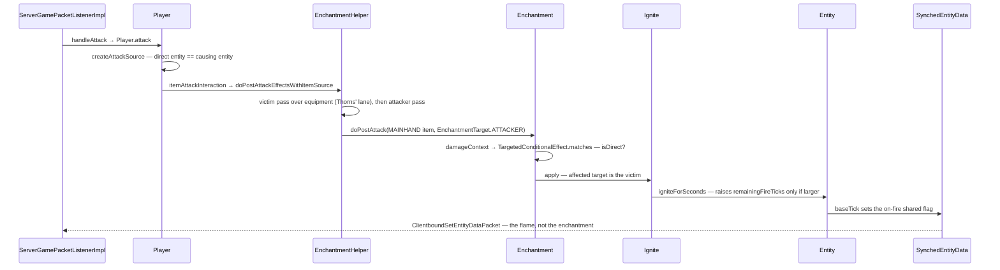

# Enchantments

> Verified against **Minecraft 26.2** · Part VII · A player hits a zombie with a Fire Aspect sword: one data-pack record, one loot predicate and one effect object set the zombie on fire, and nothing about the enchantment crosses the wire.

## Responsibility

An enchantment is a named modifier that other systems ask about at
well-defined moments. In 26.2 it holds no code at all: `Enchantment` is a
record of a description, a definition and a **map of effect components**,
loaded from a data pack. The system's job is to store those records, put
them on items, and offer a set of hooks that combat, mining, fishing,
projectiles and durability call into.

The one sentence a player recognises: *Sharpness makes your sword hurt
more and Fire Aspect sets things alight.*

The headline for a 1.21-era reader: **there are no enchantment
subclasses.** *EnchantmentCategory*, *Enchantment.getDamageBonus*,
*EnchantmentHelper.getFireAspect* and the rest are gone. The vanilla
enchantments are JSON files in the built-in data pack, and `Enchantments`
is a bag of registry keys.

## The data it owns

- **`Enchantment`** — a record of the description, an
  `Enchantment.EnchantmentDefinition`, an exclusive set, and a
  `DataComponentMap` of effects.
- **`Enchantment.EnchantmentDefinition`** — the supported items and the
  narrower primary items (both `HolderSet`s, normally tags), the weight,
  the maximum level, the minimum and maximum cost curves, the anvil cost
  and the equipment slot groups it applies in.
- **`Enchantment.Cost`** — `Enchantment.Cost.base` plus
  `Enchantment.Cost.perLevelAboveFirst`, evaluated by
  `Enchantment.Cost.calculate`. Note that `Enchantment.getMinLevel` is
  hardcoded to 1 while everything else about levels is data.
- **`EnchantmentEffectComponents`** — the thirty component keys that make
  up the effects map. Each is one hook: `EnchantmentEffectComponents.DAMAGE`,
  `EnchantmentEffectComponents.DAMAGE_PROTECTION`,
  `EnchantmentEffectComponents.KNOCKBACK`,
  `EnchantmentEffectComponents.POST_ATTACK`,
  `EnchantmentEffectComponents.POST_PIERCING_ATTACK` (new, for spears),
  `EnchantmentEffectComponents.HIT_BLOCK`,
  `EnchantmentEffectComponents.ITEM_DAMAGE`,
  `EnchantmentEffectComponents.EQUIPMENT_DROPS`,
  `EnchantmentEffectComponents.LOCATION_CHANGED`,
  `EnchantmentEffectComponents.TICK`,
  `EnchantmentEffectComponents.ATTRIBUTES`,
  `EnchantmentEffectComponents.BLOCK_EXPERIENCE`,
  `EnchantmentEffectComponents.REPAIR_WITH_XP`,
  `EnchantmentEffectComponents.PREVENT_EQUIPMENT_DROP` and the rest.
- **The three effect registries.** `EnchantmentValueEffect` modifies a
  number (`AddValue`, `MultiplyValue`, `SetValue`, `RemoveBinomial`,
  `ScaleExponentially`, `AllOf`). `EnchantmentEntityEffect` does
  something to an entity (`Ignite`, `DamageEntity`, `ApplyMobEffect`,
  `SummonEntityEffect`, `ExplodeEffect`, `SpawnParticlesEffect`,
  `ApplyEntityImpulse`, `RunFunction`, `ReplaceBlock`).
  `EnchantmentLocationBasedEffect` runs when the wearer moves or
  re-equips, and `EnchantmentAttributeEffect` is the one that only exists
  there — it installs an `AttributeModifier`
  ([attributes](../entities/attributes.md)).
- **`LevelBasedValue`** — the level-to-number curve, with
  `LevelBasedValue.Linear`, `LevelBasedValue.Constant`,
  `LevelBasedValue.Clamped`, `LevelBasedValue.Fraction`,
  `LevelBasedValue.LevelsSquared`, `LevelBasedValue.Exponent` and
  `LevelBasedValue.Lookup`. A bare float is legal anywhere one is
  expected.
- **`ConditionalEffect`** and **`TargetedConditionalEffect`** — an effect
  plus an optional loot condition, and, for the attack hooks, two
  `EnchantmentTarget` fields: which side of the fight the enchantment
  *lives on* and which side it *lands on*.
- **`ItemEnchantments`** — the map stored on the stack, under
  `DataComponents.ENCHANTMENTS` (active) or
  `DataComponents.STORED_ENCHANTMENTS` (an enchanted book's inert set).
- **`EnchantedItemInUse`** — the bundle every effect receives: the stack,
  the slot it is in, the owner, and a break callback.
- **`EnchantmentHelper`** — the static hook surface. It holds no state;
  it is the seam between the enchantment system and everything else.

## When it runs

**Server main thread, always.** Every dispatch method on `Enchantment`
takes a `ServerLevel`, and every caller guards on being server-side.
The client's entire involvement is drawing: the tooltip through
`ItemEnchantments.addToTooltip` and `Enchantment.getFullname`, the glint
through `ItemStack.hasFoil`, and the attribute lines through
`EnchantmentHelper.forEachModifier`.

**Data-pack load** builds the records. `Registries.ENCHANTMENT` is a
dynamic registry, and — unusually — the effect codecs validate their loot
conditions *at decode time* against the parameter set the effect will
actually be evaluated with, so a *post_attack* effect asking about a
block state fails to load rather than throwing later.

## The trace: Fire Aspect

Fire Aspect as data: supported and primary items are tags, weight 2,
maximum level 2, a dynamic cost curve, and **one effect** — a
`EnchantmentEffectComponents.POST_ATTACK` entry whose enchanted target is
the attacker, whose affected target is the victim, whose effect is
`Ignite` with a per-level duration, and whose condition is a damage-source
predicate requiring a *direct* hit.

1. **The swing.** `ServerGamePacketListenerImpl.handleAttack` — attacks
   now arrive as their own packet — runs the range checks and calls
   `Player.attack`.
2. **The source.** `Player.createAttackSource` builds a `DamageSource`
   from the weapon in which the direct entity and the causing entity are
   the same, so `DamageSource.isDirect` is true. This single fact is why
   Fire Aspect never fires through an arrow.
3. **The damage.** `ServerPlayer.getEnchantedDamage` — the override, not
   the base method, which returns its argument unchanged — calls
   `EnchantmentHelper.modifyDamage` for Sharpness and friends, and the
   hit goes through `LivingEntity.hurtServer`
   ([damage and death](../entities/damage-and-death.md)).
4. **The hook.** On a successful hit, `Player.itemAttackInteraction`
   calls `EnchantmentHelper.doPostAttackEffectsWithItemSource`.
5. **Two passes.** The victim's whole equipment is walked first — that is
   Thorns' lane — and then the attacker's, but **only the main hand**.
   An attacker's armour can never contribute a post-attack effect.
6. **Filtering.** `Enchantment.doPostAttack` keeps only the entries whose
   *enchanted* target matches the pass it is in.
7. **The condition.** `Enchantment.damageContext` builds a `LootContext`
   on the enchanted-damage parameter set — the victim, the level, the
   origin, the damage source, and the attacking entities — and
   `TargetedConditionalEffect.matches` evaluates the predicate against
   it. The whole "melee only" rule is one loot condition.
8. **The target.** The *affected* field picks who receives it: attacker,
   direct entity, or victim. Fire Aspect says victim.
9. **The effect.** `Ignite.apply` calls `Entity.igniteForSeconds` with
   the level-based duration.
10. **The burn.** `Entity.igniteForTicks` raises the counter **only if
    the new value is larger**, so re-hitting a burning target with a
    weaker Fire Aspect does nothing. The damage that follows is dealt by
    `Entity.baseTick`, once every twenty ticks, not by the enchantment.
11. **The flame.** `Entity.baseTick` sets the on-fire shared flag in
    `Entity.DATA_SHARED_FLAGS_ID`
    ([synched entity data](../entities/synched-entity-data.md)), which
    travels as `ClientboundSetEntityDataPacket` and becomes
    `Entity.displayFireAnimation` on the client. Nothing about the
    enchantment itself crosses the wire in this trace.

## Interfaces

The most useful way to read this system is as a *hook table*: the
enchantment package barely calls anything, and everything calls it.

| `EnchantmentHelper` entry point | who calls it |
|---|---|
| `EnchantmentHelper.modifyDamage` | `ServerPlayer.getEnchantedDamage`, `Mob.doHurtTarget`, `AbstractArrow`, `ThrownTrident` |
| `EnchantmentHelper.modifyKnockback` | `LivingEntity.getKnockback`, `AbstractArrow` |
| `EnchantmentHelper.getDamageProtection` | `LivingEntity.getDamageAfterMagicAbsorb` |
| `EnchantmentHelper.modifyArmorEffectiveness` | `CombatRules` |
| `EnchantmentHelper.isImmuneToDamage` | `LivingEntity.isInvulnerableTo` |
| `EnchantmentHelper.doPostAttackEffectsWithItemSource` | `Player.itemAttackInteraction`, `AbstractArrow` |
| `EnchantmentHelper.doPostAttackEffects` | `Player.doSweepAttack`, `Mob.doHurtTarget`, and most projectiles |
| `EnchantmentHelper.doPostPiercingAttackEffects` | `LivingEntity.postPiercingAttack` |
| `EnchantmentHelper.tickEffects` | `LivingEntity.baseTick` |
| `EnchantmentHelper.runLocationChangedEffects` / `EnchantmentHelper.stopLocationBasedEffects` | `LivingEntity.onChangedBlock`, `LivingEntity.collectEquipmentChanges` |
| `EnchantmentHelper.processDurabilityChange` | `ItemStack.hurtAndBreak` |
| `EnchantmentHelper.processAmmoUse`, `EnchantmentHelper.processProjectileCount`, `EnchantmentHelper.processProjectileSpread` | `ProjectileWeaponItem` |
| `EnchantmentHelper.onProjectileSpawned` | `Projectile.applyOnProjectileSpawned` |
| `EnchantmentHelper.onHitBlock` | `AbstractArrow`, `ThrownTrident`, `ServerPlayerGameMode` |
| `EnchantmentHelper.processBlockExperience` | `Block.tryDropExperience` |
| `EnchantmentHelper.processMobExperience` | `LivingEntity.getExperienceReward` |
| `EnchantmentHelper.modifyDurabilityToRepairFromXp` | `ExperienceOrb.repairPlayerItems` |
| `EnchantmentHelper.forEachModifier` | `ItemStack.forEachModifier` → equipment attribute changes and the tooltip |
| `EnchantmentHelper.getFishingLuckBonus`, `EnchantmentHelper.getFishingTimeReduction` | `FishingRodItem` |
| `EnchantmentHelper.modifyCrossbowChargingTime` | `CrossbowItem` |
| `EnchantmentHelper.hasTag` | `IceBlock`, `BeehiveBlock`, `DecoratedPotBlock` |

- **Crosses the network as:** the registry itself, in the configuration
  phase — `Registries.ENCHANTMENT` is in both the world-gen and the
  synchronized registry lists, encoded with the **full** direct codec, so
  the client receives every effect and condition. Also
  `ClientboundUpdateTagsPacket` for `EnchantmentTags`, and per stack
  through `DataComponents.ENCHANTMENTS` — which on the wire is registry
  ids and levels, not definitions. The enchanting table's ten data slots
  travel as `ClientboundContainerSetDataPacket`
  ([containers and menus](containers-and-menus.md)), and the offer is
  taken with `ServerboundContainerButtonClickPacket`.
- **Data-driven by:** `Registries.ENCHANTMENT`, the effect registries,
  `EnchantmentTags` (notably the enchanting-table pool, the curse set and
  the tooltip order), and `DataComponents.ENCHANTABLE` — the old
  "enchantability" integer, now a component.

### Getting one onto an item

The table counts bookshelves by walking a fixed offset list and requiring
the outer block to be in the power-provider tag *and* the block halfway
to it to be in the transmitter tag — so a torch in the gap really does
break it. It seeds its random from `Player.enchantmentSeed`, computes
three costs with `EnchantmentHelper.getEnchantmentCost`, and generates a
clue for each slot with `EnchantmentHelper.selectEnchantment`, which
picks by weight from the enchantments whose cost bracket contains the
rolled value and then keeps adding compatible ones on a halving
probability. Taking an offer charges lapis and levels and — crucially —
**re-rolls the seed inside `Player.onEnchantmentPerformed`**, as a side
effect of spending experience.

The anvil is `AnvilMenu.createResult`: same level merges to one higher,
different levels take the maximum, incompatible pairs cost an extra level
and are dropped, and the price is the anvil cost times the level, halved
for a book. The grindstone strips everything except the curse tag and
refunds experience from the minimum costs.

## Invariants and surprises

- **No enchantment effect ever runs on the client** — yet the client is
  sent the full definitions anyway, purely so tooltips and the table's
  clue can name them.
- **`EnchantmentHelper.runIterationOnItem` reads only the active
  component.** That one fact is what makes an enchanted book inert; and
  the routing to the stored component is keyed on the exact item
  `Items.ENCHANTED_BOOK`, so no other item can behave like one.
- **The attacker's post-attack pass is pinned to the main hand.** Thorns
  works from any slot because it lives on the *victim*, whose whole
  equipment is walked.
- **`ItemStack.isEnchantable` requires the component to be present and
  empty** — an already-enchanted item can never go back into a table.
- **The two `EnchantmentHelper.forEachModifier` overloads disagree**: one
  tests the runtime slot, the other tests exact membership in the
  declared slot list, so an enchantment declared for any slot does not
  surface its attribute lines in a main-hand tooltip.
- **The enchanting seed is per player, saved, and re-rolled only by
  `Player.onEnchantmentPerformed`** — that is, by taking an enchantment
  from the table. Spending levels any other way (an anvil, for instance)
  leaves it alone, and a seed that loads back as zero is re-rolled on
  read. [Hunger, XP and effects](../player/hunger-xp-and-effects.md)
  covers the experience side.
- **Effect conditions are validated at decode time, per parameter set.**
  A predicate that asks for something its hook cannot provide is a load
  error, not a runtime one.
- **Location-based effects keep per-entity state** so the system can tell
  "became active" from "still active" — and so an attribute effect can be
  removed cleanly on unequip.
- **`Entity.igniteForTicks` only ever raises the counter**, and the burn
  damage belongs to `Entity.baseTick`.
- **Fire Aspect does not cook the loot.** That lives in the loot tables
  as a condition on an enchantment tag
  ([loot tables](loot-tables.md)).
- **The vanilla enchantment class is dead code at runtime.**
  `Enchantments.bootstrap` is a data generator; only three runtime
  classes still name any constant. Vanilla enchantments really are just
  data.
- **Two spellings to watch:** the instance method on `Enchantment` is
  `Enchantment.modifyArmorEffectivness` — Mojang's typo — while the
  helper is `EnchantmentHelper.modifyArmorEffectiveness`.

## Where to look

`Enchantment` · `Enchantment.EnchantmentDefinition` ·
`EnchantmentEffectComponents` · `EnchantmentHelper` ·
`EnchantmentEntityEffect` · `EnchantmentValueEffect` ·
`EnchantmentLocationBasedEffect` · `EnchantmentAttributeEffect` ·
`Ignite` · `LevelBasedValue` · `ConditionalEffect` ·
`TargetedConditionalEffect` · `EnchantmentTarget` ·
`EnchantedItemInUse` · `ItemEnchantments` · `Enchantments` ·
`EnchantmentTags` · `EnchantmentMenu` · `EnchantingTableBlock` ·
`AnvilMenu` · `GrindstoneMenu` · `EnchantmentProvider`

---

*Rules: names, never code · how the system works, not how the code reads ·
newest version only · every backticked name passes `tools/verify_names.py`.*
