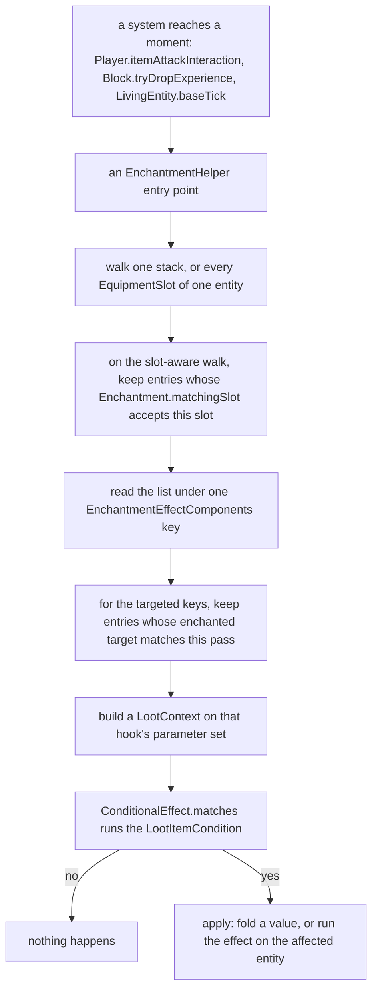
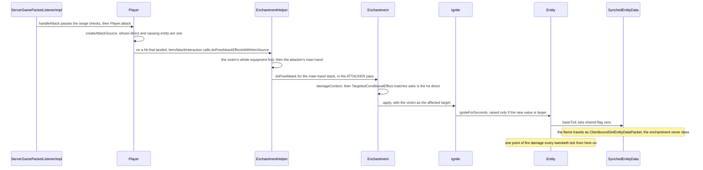

# Enchantments

> Verified against **Minecraft 26.2** · Part VII · A player hits a zombie with a Fire Aspect sword, and everything that makes the zombie burn is data.

You swing a Fire Aspect sword at a zombie and the zombie catches fire. Go
looking for the class that does that — the one with the *on hit, set them
alight* method — and there is nothing to find. There are no enchantment
subclasses. The forty-three vanilla enchantments are JSON files in the
built-in data pack, `Enchantments` is a bag of forty-three registry keys
that only four files outside the data generator ever name, and the whole
*Fire Aspect is melee only* rule is **one loot condition**, sitting on one
entry of a `DataComponentMap` that no item ever holds.

That is the pattern the rest of the page is about. An enchantment is a
named modifier that holds no code; every behaviour in the game an
enchantment can change is a component key that some other system asks
about at a well-defined moment.

## The cast

| class | what it decides | thread |
|---|---|---|
| `Enchantment` | the record — a description, a definition, an exclusive set and a map of effects. No behaviour of its own | built at data-pack load, read on both sides |
| `Enchantment.EnchantmentDefinition` | what it can go on, what it costs, which slots it counts in | data-pack load |
| `EnchantmentEffectComponents` | the thirty-one keys that name every moment an enchantment can change | static, both sides |
| `EnchantmentHelper` | the static hook surface — walks stacks and slots, calls into the record, holds no state | server main for every effect, with some read-only entry points on the client |
| `ConditionalEffect` / `TargetedConditionalEffect` | whether this effect fires here, and on whom | server main |
| `EnchantmentEntityEffect` | the thing that finally happens | server main only — the signature demands a `ServerLevel` |
| `ItemEnchantments` | the id-to-level map on the stack, under one of two components | both sides |
| `EnchantedItemInUse` | the stack, its slot, its owner and a break callback, built by the slot-aware walk and handed to the effects that act on the world | server main |

## A record with a definition and a bag of components

`Enchantment` is a record of four things: a description `Component`, an
`Enchantment.EnchantmentDefinition`, a `HolderSet` of enchantments it is
exclusive with, and a `DataComponentMap` of effects. `Enchantment.getEffects`
looks a component type up in that map and returns an empty list if it is
absent, which is the whole dispatch mechanism.

The definition is where the enchanting rules live. It carries the supported
items and a *narrower, optional* set of primary items — both normally item
tags — so `Enchantment.isPrimaryItem` falls back to the supported set when
the second is absent, while `Enchantment.isSupportedItem` only ever asks the
first. It carries the weight, the maximum level, two `Enchantment.Cost`
curves (a base plus a per-level-above-first increment, read by
`Enchantment.Cost.calculate`), the anvil cost, and a list of
`EquipmentSlotGroup` — the slots in which this enchantment counts at all,
tested by `Enchantment.matchingSlot`. The codec bounds the weight to 1–1024
and the maximum level to 1–255, which is `Enchantment.MAX_LEVEL`;
`Enchantment.getMinLevel` is the one number that is not data, hardcoded to 1.

What a stack carries is not that record but `ItemEnchantments`, an
immutable id-to-level map under `DataComponents.ENCHANTMENTS` — or, for an
enchanted book's inert set, under `DataComponents.STORED_ENCHANTMENTS`. It
is changed only through `ItemEnchantments.Mutable`, whose
`ItemEnchantments.Mutable.upgrade` merges by maximum and clamps at 255.
`EnchantmentInstance`, a holder-and-level pair with a
`EnchantmentInstance.weight` delegate, is what the weighted selection path
is built on — and that path, along with the table, the anvil, the
grindstone, the providers and `/enchant`, is a separate machine with its own
arithmetic, on [enchanting](enchanting.md#the-five-paths-at-a-glance).

## Thirty-one keys, three registries and one curve

`EnchantmentEffectComponents` registers thirty-one component types into
`BuiltInRegistries.ENCHANTMENT_EFFECT_COMPONENT_TYPE`. Twenty-four hold a
list of `ConditionalEffect` (or `TargetedConditionalEffect`); the other
seven are plain — `EnchantmentEffectComponents.ATTRIBUTES`, two sound
lists, two unconditional values, and the two `Unit`-valued flags
`EnchantmentEffectComponents.PREVENT_EQUIPMENT_DROP` and
`EnchantmentEffectComponents.PREVENT_ARMOR_CHANGE`, true by being present.

Three registries supply the effect objects, and **they are not disjoint**.
`EnchantmentValueEffect` has six shapes and modifies a running number
(`AddValue`, `MultiplyValue`, `SetValue`, `RemoveBinomial`,
`ScaleExponentially` and `AllOf.ValueEffects`). `EnchantmentEntityEffect`
has fifteen and does something to an entity — `Ignite`, `DamageEntity`,
`ApplyMobEffect`, `SummonEntityEffect`, `AllOf.EntityEffects` and ten more.
And it *extends* `EnchantmentLocationBasedEffect`, whose registry has
sixteen entries: those same fifteen ids plus one. The odd one out is
*attribute*, `EnchantmentAttributeEffect`, which installs an
`AttributeModifier` ([attributes](../entities/attributes.md#where-the-modifiers-come-from)) and is the
only effect that is location-based without also being an entity effect.

`LevelBasedValue` turns a level into a number, and six shapes are in its
dispatch registry (`LevelBasedValue.Linear`, `LevelBasedValue.Clamped`,
`LevelBasedValue.Fraction`, `LevelBasedValue.LevelsSquared`,
`LevelBasedValue.Exponent`, `LevelBasedValue.Lookup`).
`LevelBasedValue.Constant` is deliberately **not** among them: it is the
other arm of an either-codec, which is what makes a bare float legal
anywhere a curve is expected.

`ConditionalEffect` is an effect plus an optional `LootItemCondition`.
`TargetedConditionalEffect` adds two `EnchantmentTarget` fields — which side
of the fight the enchantment *lives on* (`TargetedConditionalEffect.enchanted`)
and which side it *lands on* (`TargetedConditionalEffect.affected`) —
except for the equipment-drops variant, whose codec reads only the first and
pins the second to `EnchantmentTarget.VICTIM`.

Both implement `Validatable`, and the effect codecs are one of only two places
in the game where a context mismatch is a **hard error at decode time**
rather than a logged warning ([contexts and
predicates](contexts-and-predicates.md#three-ways-a-parameter-can-be-missing)).
The consequence here is worth the trip: a *post_attack* effect asking about a
block state fails to load, rather than failing quietly at runtime a thousand
hits later.

## Seven families of moment

Everything above is inert until something calls `EnchantmentHelper`. The
enchantment package barely calls anything and everything calls it, so the
artefact worth keeping is a table of who calls what: every entry point with
its callers is [the enchantment hook
table](../../reference/enchantment-hooks.md), and these are the seven kinds
of moment it falls into.

| family | a representative hook or two | who makes it real |
|---|---|---|
| damage and protection | `EnchantmentHelper.modifyDamage`, `EnchantmentHelper.getDamageProtection` | `ServerPlayer.getEnchantedDamage`, `LivingEntity.getDamageAfterMagicAbsorb` |
| post-attack effects | `EnchantmentHelper.doPostAttackEffectsWithItemSource`, `EnchantmentHelper.doPostPiercingAttackEffects` | `Player.itemAttackInteraction`, `LivingEntity.postPiercingAttack` |
| durability and drops | `EnchantmentHelper.processDurabilityChange`, `EnchantmentHelper.processEquipmentDropChance` | `ItemStack.hurtAndBreak`, `Mob.dropCustomDeathLoot` |
| projectiles and the weapon in hand | `EnchantmentHelper.processProjectileCount`, `EnchantmentHelper.getPiercingCount` | `ProjectileWeaponItem.draw`, the `AbstractArrow` constructor |
| location and tick effects | `EnchantmentHelper.runLocationChangedEffects`, `EnchantmentHelper.tickEffects` | `LivingEntity.onChangedBlock`, `LivingEntity.baseTick` |
| experience and repair | `EnchantmentHelper.processBlockExperience`, `EnchantmentHelper.modifyDurabilityToRepairFromXp` | `Block.tryDropExperience`, `ExperienceOrb.repairPlayerItems` |
| the flag questions | `EnchantmentHelper.has`, `EnchantmentHelper.hasTag` | `ArmorSlot.mayPickup` for Curse of Binding, four blocks for the four *prevents* tags |

The location row is the one that keeps state:
`LivingEntity.activeLocationDependentEnchantments` remembers which
location-based effects are running in which slot, so the system can tell
*became active* from *still active*, and so an attribute effect can be taken
off cleanly by `EnchantmentHelper.stopLocationBasedEffects` when the armour
comes off.

## How one hook fires

Six of those seven rows are the same shape underneath. A system reaches a
moment and asks `EnchantmentHelper`; the helper picks which stacks to walk,
filtering by slot if it was given one; the record picks which effect entries
apply; a loot condition decides whether this one fires. Only then does
anything happen. The flag row is the exception and is the reason the shape is
worth drawing: `EnchantmentHelper.has` and `EnchantmentHelper.hasTag` build no
context and run no condition — they ask the record whether the key is present
at all.

The `LootContext` in the middle is the same machinery loot tables and
`/execute if predicate` use, and `Enchantment` builds five of them —
`Enchantment.damageContext` plus four private siblings for items, entities,
locations and block hits, one per parameter set the components name.
[Contexts and predicates](contexts-and-predicates.md#who-asks-and-with-which-set)
owns that half.

## Fire Aspect, from the click to the flame

Fire Aspect as data is forty-three lines of JSON: supported and primary items
are tags, weight 2, maximum level 2, anvil cost 4, dynamic cost curves, one
slot (*mainhand*), and **one effect** — a
`EnchantmentEffectComponents.POST_ATTACK` entry whose enchanted target is
the attacker, whose affected target is the victim, whose effect is `Ignite`
with a linear duration of four seconds per level, behind one damage-source
predicate requiring a *direct* hit.

**The swing, and the source that is the whole melee rule.**
`ServerGamePacketListenerImpl.handleAttack` runs the range checks and calls
`Player.attack` — unless the main-hand item has
`DataComponents.PIERCING_WEAPON`, in which case the packet is dropped and
none of this happens (see [the spear](../player/the-spear.md)
for its own path). `Player.createAttackSource` then asks
`ItemStack.getDamageSource`, and every branch of it reaches the
single-entity `DamageSource` constructor — the one that sets the direct
entity and the causing entity to the same object, making
`DamageSource.isDirect` true. An arrow's source has an arrow as the direct
entity and a player as the causing entity, so it is false. That one
comparison, read by one loot condition in one JSON file, is why Fire Aspect
never fires through a bow.

**The damage, then the hook.** `ServerPlayer.getEnchantedDamage` — the
override, not `Player`'s base version, which returns its argument unchanged
— folds Sharpness and friends in through `EnchantmentHelper.modifyDamage`,
and the hit goes through `Entity.hurtOrSimulate` to `LivingEntity.hurtServer`
([damage and death](../entities/damage-and-death.md#one-number-a-dozen-owners)). Only if that returned
true does `Player.itemAttackInteraction` call
`EnchantmentHelper.doPostAttackEffectsWithItemSource`.

**Three branches, not two.** The helper walks the *victim's* whole
equipment first, with `EnchantmentTarget.VICTIM` as the pass — that is
Thorns' lane, and why Thorns works from a chestplate while Fire Aspect does
not work from boots. Then, for a living causing entity, it walks the
attacker's **main hand only**, in the `EnchantmentTarget.ATTACKER` pass,
keeping enchantments whose declared slots include that slot. A third branch
handles a causing entity that is not living: a slotless pass with no filter
at all, reached through
`EnchantmentHelper.doPostAttackEffectsWithItemSourceOnBreak` with a break
callback, whose only vanilla caller is `ThrownTrident`. **An attacker's
armour can never contribute a post-attack effect.**

**The condition and the target.** `Enchantment.doPostAttack` keeps the
entries whose enchanted target matches the pass, builds the
enchanted-damage context — victim, level, origin, damage source, and both
attacking entities as optional parameters — and runs the predicate. The
*affected* field then picks who receives the effect: attacker, direct
entity, or victim. Fire Aspect says victim, and if that works out to null
the effect is dropped in silence.

**The burn.** `Ignite.apply` calls `Entity.igniteForSeconds`, which floors
to ticks and hands `Entity.igniteForTicks` a number it applies **only if it
is larger than the counter already there** — while clearing any freeze
regardless, so re-hitting a burning target with a weaker Fire Aspect does
nothing except thaw it. No damage happens here. `Entity.baseTick` deals it,
one point every twentieth tick, on a `ServerLevel`, skipped in lava and
replaced by `Entity.clearFire` for a fire-immune entity. The same method
sets shared flag zero through `Entity.setSharedFlagOnFire`
([synched entity
data](../entities/synched-entity-data.md#five-more-channels-all-keyed-by-the-same-entity-id)),
which becomes
`Entity.displayFireAnimation` on the client — whose own `Entity.baseTick`,
finding no `ServerLevel`, clears the fire counter instead of burning.

## Questions the pattern raises

**Where does Fortune live, if not in a hook?** In the loot table.
`ApplyBonusCount` and `BonusLevelTableCondition` read the *tool* parameter
out of a `LootContext` and call `EnchantmentHelper.getItemEnchantmentLevel`
on it — a level, not an effect. Looting is the same trick from the other
end, twice: `EnchantedCountIncreaseFunction` and
`LootItemRandomChanceWithEnchantedBonusCondition` both read the *attacking
entity* parameter and call `EnchantmentHelper.getEnchantmentLevel`, the
overload that walks a `LivingEntity`'s equipment and keeps the best. Fortune has no effect
component whatsoever, and Looting's only one is an *equipment_drops* entry
that has nothing to do with mob loot. Mending inverts it once more:
`ExperienceOrb.repairPlayerItems` asks `EnchantmentHelper.getRandomItemWith`
for a stack carrying `EnchantmentEffectComponents.REPAIR_WITH_XP`, so the
orb, not the item, drives the repair.

**Does anything enchantment-shaped run on the client?** No *effect* can:
`EnchantmentEntityEffect` and `EnchantmentLocationBasedEffect` both demand a
`ServerLevel`. But two *values* do. `Enchantment.modifyUnfilteredValue`
takes only a `RandomSource`, and its two users are
`Enchantment.modifyCrossbowChargeTime` and
`Enchantment.modifyTridentSpinAttackStrength`.
`CrossbowItem.getChargeDuration` is called by three entity renderers, by
`ItemInHandRenderer` and by the `CrossbowPull` item property, so **Quick
Charge is evaluated on the render thread every frame a crossbow is being
drawn**; and `MultiPlayerGameMode.releaseUsingItem` runs
`TridentItem.releaseUsing` on the client's own copy, which asks
`EnchantmentHelper.getTridentSpinAttackStrength`, so **Riptide's strength is
computed client-side too** — which is what lets the riptide push be predicted
at all. Everything else the client does is drawing:
`ItemEnchantments.addToTooltip` for the tooltip, `ItemStack.hasFoil` for the
glint, and `EnchantmentHelper.forEachModifier` for the attribute lines —
which means the client evaluates the `LevelBasedValue` curve itself.

**When is an enchantment loaded, and does `/reload` re-read it?** At world
load, and no. `Registries.ENCHANTMENT` and `Registries.ENCHANTMENT_PROVIDER`
are both in `RegistryDataLoader.WORLDGEN_REGISTRIES`, the dynamic registries
built once when a world opens ([identifiers and
registries](../foundations/identifiers-and-registries.md#when-a-world-opens)) —
not in `RegistryLayer.RELOADABLE`, where the loot tables and predicates live.
`/reload` rebuilds those and every recipe and leaves the enchantments exactly
as the world found them; changing one takes a restart.

**What actually crosses the wire?** Usually an id and nothing else.
`Registries.ENCHANTMENT` is in `RegistryDataLoader.SYNCHRONIZED_REGISTRIES`
with the full `Enchantment.DIRECT_CODEC`, but
`RegistrySynchronization.packRegistry` sends a bare `Identifier` for every
element whose pack the client already has — for a vanilla client against a
vanilla server, all forty-three. Full definitions cross only for a data
pack's custom or overridden enchantments. Beyond that,
`ClientboundUpdateTagsPacket` for `EnchantmentTags` and, per stack, the
`DataComponents.ENCHANTMENTS` component: registry ids and levels.

**Why is an enchanted book inert?** Because
`EnchantmentHelper.runIterationOnItem` — the private walk under every hook —
reads `DataComponents.ENCHANTMENTS` and nothing else. A book's set lives
under `DataComponents.STORED_ENCHANTMENTS`, and the routing between the two,
in `EnchantmentHelper.getComponentType`, is keyed on the exact item
`Items.ENCHANTED_BOOK`. The *component* is not so exclusive: `ItemStack` puts
`DataComponents.STORED_ENCHANTMENTS` in any stack's tooltip, and the anvil
prices its right-hand input as a book by testing for that component rather
than for the item ([enchanting](enchanting.md#what-each-path-is-allowed-to-add))
— so a data pack can make a stick priced like one, but never make it behave
like one.

**Is the main hand really the main hand?** No — it is a label.
`EnchantmentHelper.doPostAttackEffectsWithItemSourceOnBreak` and
`EnchantmentHelper.doPostPiercingAttackEffects` both hand
`EquipmentSlot.MAINHAND` to the slot filter regardless of where the weapon
came from, and `KineticWeapon.damageEntities` reaches
`LivingEntity.stabAttack` with whichever slot the *use* was in. An off-hand
spear's enchantments are therefore tested against the main-hand slot group.

**Two more small ones.** The two
`EnchantmentHelper.forEachModifier` overloads test different things — the
`EquipmentSlot` one asks `Enchantment.matchingSlot`, the `EquipmentSlotGroup`
one asks whether the definition declares that exact group — and
`ItemStack.forEachModifier` uses one of each. And the instance method is
spelled `Enchantment.modifyArmorEffectivness`, Mojang's typo, while the
helper beside it is `EnchantmentHelper.modifyArmorEffectiveness`.

**And does Fire Aspect cook the loot?** Not through the enchantment. The cooking
is `SmeltItemFunction`, an ordinary loot function on the mob's own table,
behind a condition that passes when the victim is on fire *or* the direct
attacker's main hand carries an enchantment in `EnchantmentTags.SMELTS_LOOT` —
a tag whose only member is Fire Aspect ([loot
tables](loot-tables.md#one-roll-drawn)). `EnchantmentTags`
holds twenty-nine tags. Twenty-five fall into five families — the seven
exclusivity sets, the tooltip order, pool membership for the table and for
mob, trade and loot equipment, the behaviour flags (curse, smelts-loot and the
four *prevents* tags), and the seven biome trade tables — and the last four
are the trading and treasure axes the villager and the loot tables sort on.

**What does a whole enchantment look like, then?** `Enchantments.LUNGE` is
the only user of `EnchantmentEffectComponents.POST_PIERCING_ATTACK` in the
game, and its single effect is an `AllOf.EntityEffects` of four — a
`ChangeItemDamage`, an `ApplyExhaustion` scaled per level, an
`ApplyEntityImpulse` forward with its vertical component scaled away, and a
`PlaySoundEffect` holding three sounds, indexed by level rather than
shuffled — behind a four-clause
condition checking that the user is not riding, not elytra-flying, not in
water, and either not a player, in creative, or fed. One JSON file, four
effect objects, four predicates, no Java. That is what an enchantment is.

## Where to look

`Enchantment` · `Enchantment.EnchantmentDefinition` · `Enchantment.Cost` ·
`EnchantmentEffectComponents` · `ConditionalEffect` ·
`TargetedConditionalEffect` · `EnchantmentTarget` · `LevelBasedValue` ·
`EnchantmentValueEffect` · `EnchantmentEntityEffect` ·
`EnchantmentLocationBasedEffect` · `EnchantmentAttributeEffect` · `AllOf` ·
`Ignite` · `EnchantmentHelper` · `EnchantedItemInUse` · `ItemEnchantments` ·
`EnchantmentInstance` · `Enchantments` · `EnchantmentTags`

---

*Rules: names, never code · how the system works, not how the code reads ·
newest version only · every backticked name passes `tools/verify_names.py`.*
