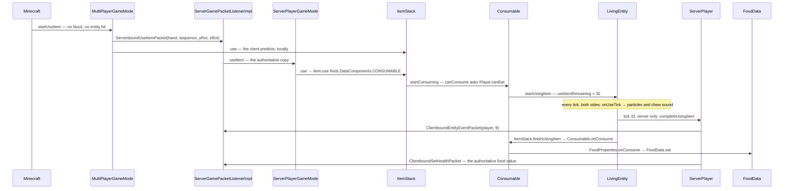

# Items and stacks

> Verified against **Minecraft 26.2** · Part VII · A player right-clicks a piece of cooked beef and holds the button for thirty-two ticks: the client predicts the whole meal, the server sends one byte to say it finished, and the hunger bar arrives separately.

## Responsibility

An `Item` is a behaviour; an `ItemStack` is a count plus a bag of data
components attached to one of those behaviours. Between them they cover
every stack in the game — in a hand, in a chest, on the ground, in a
recipe, on the wire. The system's job is to answer three questions
cheaply: *what happens when this is used*, *are these two stacks the same
thing*, and *what of this survives a save or a packet*.

The one sentence a player recognises: *a stack of sixteen cooked beef and
a stack of one enchanted sword are the same kind of object, and the
difference between them is data, not code.*

The headline for a 1.21-era reader: **`Item` holds almost no data any
more.** Its fields are a description id, a crafting remainder, a feature
flag set and its own registry holder. Everything a stack is made of —
stack size, durability, food, tool rules, equippability — is a data
component ([data components](../foundations/data-components.md)), and the
default set for an item is not even built until the first data-pack
reload.

## The data it owns

- **`Item`** — the singleton behaviour object, one per registry entry, in
  `BuiltInRegistries.ITEM`. It declares the hooks: `Item.use`,
  `Item.useOn`, `Item.finishUsingItem`, `Item.releaseUsing`,
  `Item.onUseTick`, `Item.inventoryTick`, `Item.mineBlock`,
  `Item.hurtEnemy`, `Item.appendHoverText`. `Item.components` does not
  return a field — it delegates to `Holder.Reference.components` on the
  item's own registry holder.
- **`Item.Properties`** — the builder used at class-init in `Items`. It
  does not produce a component map; it produces a
  `DataComponentInitializers.Initializer` that is registered and run
  later. Its methods are the vocabulary of an item definition:
  `Item.Properties.food`, `Item.Properties.stacksTo`,
  `Item.Properties.durability`, `Item.Properties.tool`,
  `Item.Properties.sword`, `Item.Properties.spear`,
  `Item.Properties.humanoidArmor`, `Item.Properties.useCooldown`,
  `Item.Properties.usingConvertsTo`, `Item.Properties.equippable`.
- **`ItemStack`** — a final class holding exactly three things plus one
  transient: a `Holder<Item>`, an int count, a `PatchedDataComponentMap`,
  and `ItemStack.getPopTime` (the client's pickup animation). It
  implements `DataComponentHolder` and the new `ItemInstance`.
- **`PatchedDataComponentMap`** — prototype plus patch, copy-on-write.
  `PatchedDataComponentMap.set` **removes** the entry when the value
  equals the prototype's, so a stack whose components happen to match its
  item's defaults carries an empty patch.
- **`ItemInstance`** — new in 26.2: the read-only "an item, a count, some
  components" contract shared by `ItemStack` and `ItemStackTemplate`. It
  declares `ItemInstance.count` and `ItemInstance.getMaxStackSize`, and it
  extends `TypedInstance` (which declares the whole family of
  `TypedInstance.is` overloads) and `DataComponentGetter`.
- **`ItemStackTemplate`** — also new: an immutable record of a
  `Holder<Item>`, a count and a `DataComponentPatch`, with
  `ItemStackTemplate.create` to materialise a real stack. It is what
  particles, hover events, `UseRemainder` and crafting remainders carry
  instead of a mutable `ItemStack`.
- **`ItemCooldowns`** and `ServerItemCooldowns` — a per-player map keyed
  by cooldown *group*, not by item. `ItemCooldowns.getCooldownGroup`
  returns `UseCooldown.cooldownGroup` if the component names one, and the
  item's registry `Identifier` otherwise.
- **`ItemEntity`** — the dropped stack, holding its `ItemStack` in
  `ItemEntity.DATA_ITEM` and merging with neighbours through
  `ItemEntity.mergeWithNeighbours`. Blocks reach it through
  `Block.popResource` ([block breaking](../blocks/block-breaking.md)).

### The consumable components

Eating is not implemented by a food item class. It is four components and
one interface.

- **`Consumable`** — `Consumable.consumeSeconds` (default
  `Consumable.DEFAULT_CONSUME_SECONDS`, 1.6, so
  `Consumable.consumeTicks` is **32**), `Consumable.animation` (an
  `ItemUseAnimation`), `Consumable.sound`,
  `Consumable.hasConsumeParticles` and `Consumable.onConsumeEffects`. The
  presets are in `Consumables` — `Consumables.DEFAULT_FOOD`,
  `Consumables.DEFAULT_DRINK`, `Consumables.GOLDEN_APPLE`,
  `Consumables.CHORUS_FRUIT`, `Consumables.MILK_BUCKET` and the rest.
- **`FoodProperties`** — `FoodProperties.nutrition`,
  `FoodProperties.saturation`, `FoodProperties.canAlwaysEat`. It is not a
  passive data bag: it *implements* `ConsumableListener`, and
  `FoodProperties.onConsume` is what moves the food bar.
- **`ConsumableListener`** — one method, `ConsumableListener.onConsume`,
  found on the stack by `DataComponentHolder.getAllOfType`. Four things
  implement it: `FoodProperties`, `PotionContents`,
  `SuspiciousStewEffects` and `OminousBottleAmplifier`.
- **`ConsumeEffect`** — a registry-dispatched effect
  (`BuiltInRegistries.CONSUME_EFFECT_TYPE`) with five implementations:
  `ApplyStatusEffectsConsumeEffect`, `RemoveStatusEffectsConsumeEffect`,
  `ClearAllStatusEffectsConsumeEffect`, `TeleportRandomlyConsumeEffect`,
  `PlaySoundConsumeEffect`.
- **`UseRemainder`** (the empty bowl), **`UseCooldown`** (the seconds and
  the group) and **`UseEffects`** — the last of which is new and is the
  reason eating slows you down: `UseEffects.canSprint`,
  `UseEffects.interactVibrations` and `UseEffects.speedMultiplier`, with
  `UseEffects.DEFAULT` being *(false, true, 0.2)*.

`FoodData` is the player's side of it: `FoodData.foodLevel`,
`FoodData.saturationLevel`, `FoodData.exhaustionLevel`, ticked server-side
in `FoodData.tick`, with the constants in `FoodConstants`
(`FoodConstants.MAX_FOOD` is 20).

## When it runs

**Client main thread** starts everything. `Minecraft.handleKeybinds` sees
the use key, checks `Minecraft.rightClickDelay` and
`LocalPlayer.isHandsBusy`, and calls `Minecraft.startUseItem`, which
picks a hand and a target and hands off to `MultiPlayerGameMode.useItem`
or `MultiPlayerGameMode.useItemOn`. Both open a prediction window
(`BlockStatePredictionHandler`, see
[block interaction](../blocks/block-interaction.md)), run the real logic
locally, and send a packet.

**Server main thread** decides. `ServerGamePacketListenerImpl.handleUseItem`
and `ServerGamePacketListenerImpl.handleUseItemOn` are bounced off the
Netty thread by `PacketUtils.ensureRunningOnSameThread` — which in 26.2
takes a `PacketProcessor`, not an event loop — and call
`ServerPlayerGameMode.useItem` / `ServerPlayerGameMode.useItemOn`.

**Every tick, both sides**, `LivingEntity.tick` calls
`LivingEntity.updateUsingItem`, which decrements
`LivingEntity.useItemRemaining` and calls `ItemStack.onUseTick`. Only the
server ever reaches zero and calls `LivingEntity.completeUsingItem`; the
client counts down and then waits to be told.

**Render thread** reads the same fields: `ItemInHandRenderer.applyEatTransform`
bobs the model from `LivingEntity.getUseItemRemainingTicks`, and
`Hud.extractFood` draws the bar from `FoodData.getFoodLevel`.

## The trace: eating a piece of cooked beef

1. **The click.** `Minecraft.handleKeybinds` fires `Minecraft.startUseItem`,
   which loops both hands. Nothing is hit, so it falls through to
   `MultiPlayerGameMode.useItem`, which opens the prediction window,
   sends `ServerboundUseItemPacket` — which now carries the player's
   rotation as well as the hand and sequence number — and runs
   `ItemStack.use` locally.
2. **The dispatch.** `Item.use` is not overridden by anything in the food
   path; its default body is a component dispatch. It finds
   `DataComponents.CONSUMABLE` and calls `Consumable.startConsuming`.
   (The other branches are `DataComponents.EQUIPPABLE` with a swappable
   flag, `DataComponents.BLOCKS_ATTACKS`, and
   `DataComponents.KINETIC_WEAPON`.)
3. **The refusal.** `Consumable.canConsume` asks `Player.canEat` with
   `FoodProperties.canAlwaysEat`. A full food bar and ordinary food
   returns `InteractionResult.FAIL` and the trace stops here.
4. **Starting.** `LivingEntity.startUsingItem` sets `LivingEntity.useItem`
   and `LivingEntity.useItemRemaining` to 32. On the server it also sets
   two bits of `LivingEntity.DATA_LIVING_ENTITY_FLAGS`
   ([synched entity data](../entities/synched-entity-data.md)) and fires
   `GameEvent.ITEM_INTERACT_START` through `ItemStack.causeUseVibration`,
   gated on `UseEffects.interactVibrations`. The result is
   `InteractionResult.CONSUME`, which carries
   `InteractionResult.SwingSource.NONE` — **which is why eating does not
   swing the arm.**
5. **The client's own timer.** `LocalPlayer.isUsingItem` is backed by a
   client-local flag, not by the synched bits;
   `LocalPlayer.onSyncedDataUpdated` reconciles the two afterwards. The
   eater counts thirty-two ticks down by themselves.
6. **Chewing.** Each tick, `LivingEntity.updateUsingItem` calls
   `ItemStack.onUseTick`. `Consumable.shouldEmitParticlesAndSounds` is
   true once more than `Consumable.CONSUME_EFFECTS_START_FRACTION` of the
   duration has elapsed and the remaining count is a multiple of
   `Consumable.CONSUME_EFFECTS_INTERVAL` (4), and then
   `Consumable.emitParticlesAndSounds` spawns five item particles via
   `LivingEntity.spawnItemParticles` and plays the chew sound.
   `Level.addParticle` does nothing on the server, so the particles are
   pure client simulation.
7. **The slowdown.** `LocalPlayer.modifyInput` scales the movement input
   by `LocalPlayer.itemUseSpeedMultiplier` — which reads
   `UseEffects.speedMultiplier` — and `LocalPlayer.isSlowDueToUsingItem`
   blocks sprinting because `UseEffects.canSprint` is false. The famous
   20 % is now a JSON number.
8. **Tick thirty-two.** The client decrements to zero and stops, because
   `LivingEntity.updateUsingItem` guards the completion server-side. The
   server calls `LivingEntity.completeUsingItem`, whose override
   `ServerPlayer.completeUsingItem` first sends
   `ClientboundEntityEventPacket` with event id 9.
9. **The meal.** `ItemStack.finishUsingItem` → `Item.finishUsingItem` →
   `Consumable.onConsume`, which emits a final burst of sixteen
   particles, awards `Stats.ITEM_USED`, fires
   `CriteriaTriggers.CONSUME_ITEM`, then walks
   `DataComponentHolder.getAllOfType` for `ConsumableListener`s —
   finding `FoodProperties`, whose `FoodProperties.onConsume` plays the
   sound and calls `FoodData.eat` — then applies each `ConsumeEffect` in
   `Consumable.onConsumeEffects` **behind a server-side guard**, fires
   `GameEvent.EAT`, and finally `ItemStack.consume` shrinks the stack
   (skipped entirely in creative).
10. **The leftovers.** `ItemStack.applyAfterUseComponentSideEffects` runs
    against the *pre-use copy*: `UseRemainder.convertIntoRemainder` makes
    the bowl or bottle, and `UseCooldown.apply` starts the cooldown,
    which `ServerItemCooldowns.onCooldownStarted` mirrors as
    `ClientboundCooldownPacket`. Then `LivingEntity.stopUsingItem` clears
    the flag and fires `GameEvent.ITEM_INTERACT_FINISH`.
11. **The client replays it.** `Player.handleEntityEvent` turns event 9
    back into `LivingEntity.completeUsingItem`, so the client re-runs
    step 9 locally — particles, sound, `FoodData.eat`, the shrink. It
    does **not** run the `ConsumeEffect`s, which is why a chorus fruit
    teleport is never predicted but the hunger bar jump is.
12. **The correction.** `ServerPlayer.doTick` notices the food value
    changed and sends `ClientboundSetHealthPacket`, which overwrites the
    client's prediction outright. The stack count is corrected separately
    by `AbstractContainerMenu.broadcastChanges`
    ([containers and menus](containers-and-menus.md)).

## Interfaces

- **Called by:** `Minecraft.handleKeybinds` and
  `Minecraft.startUseItem` on the client;
  `ServerGamePacketListenerImpl.handleUseItem`,
  `ServerGamePacketListenerImpl.handleUseItemOn` and `ServerGamePacketListenerImpl.handlePlayerAction` on the server;
  `LivingEntity.tick` every tick on both.
- **Calls into:** `BlockBehaviour.BlockStateBase.useItemOn` and
  `BlockBehaviour.BlockStateBase.useWithoutItem` for the block half
  ([block interaction](../blocks/block-interaction.md)), `FoodData`,
  `ItemCooldowns`, `GameEvent` for vibrations
  ([game events](../world/game-events-and-poi.md)), and
  `Level.playSeededSound`.
- **Crosses the network as:** `ServerboundUseItemPacket`,
  `ServerboundUseItemOnPacket`, `ServerboundPlayerActionPacket` (whose
  `ServerboundPlayerActionPacket.Action` gained `ServerboundPlayerActionPacket.Action.STAB` for spears) and
  `ServerboundSetCarriedItemPacket` upward;
  `ClientboundBlockChangedAckPacket`, `ClientboundEntityEventPacket`
  (event 9), `ClientboundSetEntityDataPacket` (the using-item flag, for
  observers), `ClientboundSetHealthPacket`, `ClientboundCooldownPacket`
  and the container packets downward. An `ItemStack` itself travels as
  `ItemStack.OPTIONAL_STREAM_CODEC` — count, item holder, then the
  **patch only**, never the prototype; anything arriving from a client
  goes through `ItemStack.OPTIONAL_UNTRUSTED_STREAM_CODEC` and
  `ItemStack.validateStrict`.
- **Data-driven by:** `BuiltInRegistries.ITEM`,
  `BuiltInRegistries.DATA_COMPONENT_TYPE`,
  `BuiltInRegistries.CONSUME_EFFECT_TYPE`, and — for the parts that need
  registries or tags to exist — `DataComponentInitializers`, run at
  reload from `ReloadableServerResources` on the server and
  `RegistryDataCollector` on the client. Mining and repair are tags
  (`BlockTags.SWORD_EFFICIENT`, `ItemTags`) rather than code.

## Invariants and surprises

- **An item's default components are reloadable state on a registry
  holder.** `Item`'s constructor registers a
  `DataComponentInitializers.Initializer` and walks away; the map is
  built by `DataComponentInitializers.build` and installed with
  `Holder.Reference.bindComponents`. Between JVM start and the first
  reload, `Item.components` throws, and `Item.CODEC_WITH_BOUND_COMPONENTS`
  exists purely to refuse an item whose components have not been bound.
  Two worlds with different data packs give the same `Item` object
  different defaults.
- **A stack stores a diff, not a map.** `ItemStack.isSameItemSameComponents`
  compares patches, and setting a component back to its prototype value
  removes it from the patch — so "enchanted with nothing" and "never
  enchanted" are the same object state.
- **`ItemStack.use` only applies the remainder and the cooldown for
  *instant* uses.** `ItemStack.applyAfterUseComponentSideEffects` is
  gated on the use duration being zero; for a timed use it runs later,
  from `ItemStack.finishUsingItem` or `ItemStack.releaseUsing`, and
  always against a copy taken before the use began.
- **The completion of a multi-tick use is one byte.** There is no "you
  ate this" packet: `ClientboundEntityEventPacket` with id 9 tells the
  client to re-derive the outcome from components it already has, and
  `ClientboundSetHealthPacket` corrects it afterwards.
- **`Consumable.onConsume` runs on both sides but its effect list does
  not.** Particles, sound, the `ConsumableListener` and the stack shrink
  are unguarded; only `Consumable.onConsumeEffects` sits behind the
  server-side check.
- **Durability and stackability are mutually exclusive, enforced twice.**
  `Item.Properties.finalizeInitializer` installs a validator that throws,
  and `ItemStack.validateComponents` rejects the same pair at decode
  time.
- **`LivingEntity.updateUsingItem` cancels the use if the held item
  *type* changes**, compared with `ItemStack.isSameItem` — so swapping a
  bowl for a stew aborts eating, but a durability tick does not.
- **A durability change does not restart the swap animation.**
  `DataComponents.DAMAGE` is declared with
  `DataComponentType.Builder.ignoreSwapAnimation`, and
  `ItemInHandRenderer.shouldInstantlyReplaceVisibleItem` compares with
  `ItemStack.matchesIgnoringComponents`.
- **`ItemStack.EMPTY` is not identified by reference.**
  `ItemStack.isEmpty` also accepts `Items.AIR` and a count at or below
  zero, so a stack shrunk to nothing is empty without being the
  singleton.
- **Cooldowns are grouped.** One `ClientboundCooldownPacket` names a
  group, so a single cooldown can gate several items — and two items with
  the same `UseCooldown.cooldownGroup` share one timer.
- **`Item.APPROXIMATELY_INFINITE_USE_DURATION` is 72000 ticks**, and it
  is what `ItemStack.getUseDuration` returns for anything with
  `DataComponents.BLOCKS_ATTACKS` or `DataComponents.KINETIC_WEAPON` —
  one hour of ticks standing in for "until released".
- **`SpyglassItem.finishUsingItem` is the only override of
  `Item.finishUsingItem` in the item package.** Everything else in the
  consume path is component dispatch.

## Where to look

`Item` · `Item.Properties` · `Items` · `ItemStack` · `ItemInstance` ·
`ItemStackTemplate` · `PatchedDataComponentMap` ·
`DataComponentInitializers` · `Consumable` · `Consumables` ·
`ConsumableListener` · `FoodProperties` · `FoodData` · `ConsumeEffect` ·
`UseRemainder` · `UseCooldown` · `UseEffects` · `ItemUseAnimation` ·
`ItemCooldowns` · `LivingEntity.startUsingItem` ·
`LivingEntity.completeUsingItem` · `ServerPlayerGameMode.useItem` ·
`MultiPlayerGameMode.useItem` · `ItemEntity` · `InteractionResult`

---

*Rules: names, never code · how the system works, not how the code reads ·
newest version only · every backticked name passes `tools/verify_names.py`.*
