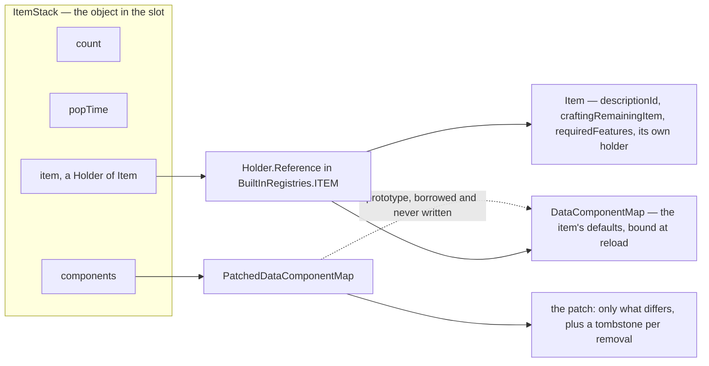

# Items and stacks

> Verified against **Minecraft 26.2** · Part VII · A diamond pickaxe sits in a hotbar slot, is compared against its neighbours, is sent to a client, and finally loses its last point of durability.

A diamond pickaxe is in your hotbar. The `Item` behind it,
`Items.DIAMOND_PICKAXE`, is a single object shared by every diamond pickaxe
that has ever existed on this server, and it holds four fields: a description
id, a crafting remainder, a feature-flag set, and its own registry holder. Not
the stack size. Not the mining speed. Not the durability. All of that is data
components — and they do not live on the `Item` either. They live on the
item's `Holder.Reference` in `BuiltInRegistries.ITEM`, as a prototype map
built at the first data-pack load and rebuilt at every one after ([data
components](../foundations/data-components.md#the-prototype-and-why-it-is-built-at-reload)),
and the *stack* borrows that map read-only and stores only the ways it
differs from it. This page is the object in the slot rather than the
component system behind it: what an `ItemStack` is made of, what makes two of
them the same stack, what a stack may legally hold, and what happens to one
that runs out of durability. That last is the odd one out in a part where
almost everything is predicted locally and corrected afterwards.
**Durability is the one thing a client never even guesses at** — the method
that spends it demands a `ServerLevel`, and the convenient overloads that do
not have one silently do nothing at all.

## The cast

| class | what it decides | thread |
|---|---|---|
| `Item` | the behaviour hooks, and four fields that are not components | both main threads |
| `Item.Properties` | the builder — which produces an *initializer*, never a component map | class-init, wherever the bootstrap runs |
| `Holder.Reference` | where an item's default components actually live, and whether they exist yet | written on a main thread at reload |
| `DataComponentInitializers` | the pile of pending default maps, one entry per registered item | built on the background executor |
| `ItemStack` | a holder, a count, a pop time and a patched map — the mutable thing in a slot | both main threads |
| `PatchedDataComponentMap` | prototype plus patch, and the copy-on-write flag that makes copying a stack free | wherever its stack is |
| `ItemStackTemplate` | the immutable stack: what a stack looks like inside a component, a particle or a recipe | both |
| `ItemEntity` | a stack that is an entity, with a five-minute clock and a merge rule | server main, mirrored on the client |

## Four fields, and only one of them is really data

`ItemStack` is a final class holding exactly four things: two ints, a registry
holder, and the interesting one.

The dotted arrow is the shape of the whole system. A stack does not own its
defaults and cannot change them: it points at a holder, and the holder owns
one `DataComponentMap` shared by every stack of that item in both programs.

`ItemStack.typeHolder` answers `Items.AIR`'s holder rather than null for an
empty stack, which is why `ItemStack.getItem` never returns null either. The
pop time is the odd one out: it is the five-tick squeeze the hotbar icon does
when something lands in it, set to 5 by `Inventory` when a stack grows and by
`ClientPacketListener.handleContainerSetSlot` when a slot update makes a
hotbar stack larger, counted down by `ItemStack.inventoryTick` on **both**
sides, and read by `Hud.extractSlot`, which scales the icon while it is above
zero and hands the drawing to `GuiGraphicsExtractor` either way. It is
ordinary shared state that only the client has any use for — and
`ItemStack.copy` carries it across, so the animation survives being copied
into a menu slot.

`Item.Properties` is the builder used at class-init, and its output is not a
component map. `Item.Properties.component` and every convenience over it —
`Item.Properties.stacksTo`, `Item.Properties.durability`,
`Item.Properties.food`, `Item.Properties.tool`, `Item.Properties.spear`,
`Item.Properties.equippable`, `Item.Properties.useCooldown` — fold one more
step onto a `DataComponentInitializers.Initializer`, a function that will be
run against a `DataComponentMap.Builder` later, with a
`HolderLookup.Provider` in hand.

Between the two halves of that arrangement an `Item` is a live object with no
components at all: the constructor registers an initializer and the map is not
built until a reload builds it, so `Item.components` throws until then and
`Item.CODEC_WITH_BOUND_COMPONENTS` exists to refuse an item whose components
are not bound yet. When and on which thread that happens, on the server and on
a joining client alike, is [data
components](../foundations/data-components.md#the-prototype-and-why-it-is-built-at-reload).

## What copying a stack costs, and what crosses the wire

Two properties of that borrowed map do work on the rest of this page, and
both belong to [data components](../foundations/data-components.md#the-maps).
The patch is **sanitised on every write**, so it can never hold a value the
item already had — which is what makes the equality table below behave. And
the patch map is **shared until someone writes to it**: `ItemStack.copy` hands
out the same map and sets a copy-on-write flag, and the fork happens on the
first mutation. Copying a stack is therefore something the game does without
thinking about it, and it does — menus, recipes, hover text and
`ServerPlayerGameMode.destroyBlock` all copy constantly, and each copy
allocates one small object and no component data.

The wire form falls out of the same shape and is the third of the four
serialisations [codecs, NBT and
JSON](../foundations/codecs-nbt-json.md#the-four-paths-side-by-side) lays side
by side: `ItemStack.OPTIONAL_STREAM_CODEC` writes the count, the item holder
and the patch, never the prototype, because the receiver has the same
prototype bound to the same holder. A count of zero is the whole encoding of
an empty stack.

## When two stacks are the same stack

Five static methods on `ItemStack` answer five different versions of that
question, and menus, recipes and the renderer each want a different one.

| method | compares | used for |
|---|---|---|
| `ItemStack.isSameItem` | the item holder only | *is this the same kind of thing* |
| `ItemStack.isSameItemSameComponents` | the item, then the whole `PatchedDataComponentMap` | stacking, and every *are these interchangeable* test |
| `ItemStack.matches` | the count as well | container synchronisation ([containers and menus](containers-and-menus.md#the-ladder-the-server-climbs-before-it-believes-you)) |
| `ItemStack.matchesIgnoringComponents` | everything except the component types a predicate excuses | the held-item swap animation |
| `ItemStack.hashItemAndComponents` | the item's hash and the effective component map's | keying stacks in maps |

The second row is where the borrowed map pays off. Comparing two stacks of the
same item amounts to comparing their patches, and because a patch never holds
a value equal to the prototype's, two pickaxes with the same damage are equal
whether one reached that state by being set explicitly or by never being
touched.

The fourth row exists for one component. `DataComponents.DAMAGE` is the only
component type in the game declared with
`DataComponentType.Builder.ignoreSwapAnimation`, and
`ItemInHandRenderer.shouldInstantlyReplaceVisibleItem` passes exactly that
flag as the predicate — which is why a pickaxe losing a point of durability
does not re-play the lower-and-raise animation. And a trap sits under all five
rows: `ItemStack.EMPTY` is a singleton but is not identified by reference,
because `ItemStack.isEmpty` also answers true for `Items.AIR` and for any
count at or below zero.

## Two validators, one rule, two spellings

Durability and stackability are mutually exclusive, and the game says so
twice — in different places, at different times, against different
components.

| | the reload validator | `ItemStack.validateStrict` |
|---|---|---|
| installed by | `Item.Properties.finalizeInitializer` | — |
| rejects | `DataComponents.DAMAGE` on a stackable item | `DataComponents.MAX_DAMAGE` on a stackable item, and a count over the maximum |
| runs inside | `DataComponentMap.Builder.build` | `ItemInput`, `ItemStackTemplate.create`, `ItemStack.applyComponentsAndValidate` |
| when | at reload, on the background executor | when a command, a template or a component patch builds a stack |
| on failure | throws, failing the reload | depends on the caller: `ItemInput` throws a command syntax error, the other two log and yield `ItemStack.EMPTY` or restore the previous patch |

Neither is reached from a network decode. Exactly **one** serverbound packet
in the protocol carries an `ItemStack` at all, the creative slot's, and it is
proved a third way — re-encoded rather than validated ([codecs, NBT and
JSON](../foundations/codecs-nbt-json.md#trusted-untrusted-and-validated)).

The strict validator reaches one level into a stack's contents and no further.
`ItemStack.validateContainedItemSizes` runs inside `ItemStack.validateStrict`
over `DataComponents.CONTAINER`, `DataComponents.BUNDLE_CONTENTS` and
`DataComponents.CHARGED_PROJECTILES`, checking each contained stack's count
against its own maximum — and it does **not** re-run the full validation
there, so nesting is not followed and a shulker box full of impossible stacks
is caught by a command rather than at the creative slot's door. The bundle is
the one that gets a second test of its own: an over-weight `BundleContents`
fails too.

## An item, a count, some components — said three ways

`ItemInstance` is the read-only contract those validators are written
against: `ItemInstance.count`, `ItemInstance.getMaxStackSize`, and — through
`TypedInstance` and `DataComponentGetter` — five `TypedInstance.is` overloads
for tags, holder sets, raw items, holders and resource keys, to which
`ItemStack.is` adds a sixth taking a predicate. Its default
`ItemInstance.getMaxStackSize` answers **1** when
`DataComponents.MAX_STACK_SIZE` is missing — which for a bound item never
happens, because the common set puts 64 there.

Two classes implement it. `ItemStack` is the mutable one that lives in slots.
`ItemStackTemplate` is an immutable record of a `Holder<Item>`, a count and a
**raw** `DataComponentPatch` — one that came straight from a builder and was
never sanitised against a prototype, so a template is the one thing in the
game that can carry a component value equal to the item's own default and send
it verbatim. It is what a stack becomes when it is stored *inside* something
else: `ItemContainerContents` (so a shulker box's contents are
templates, not stacks), `BundleContents`, `ChargedProjectiles`,
`ItemParticleOption`, `HoverEvent`, `UseRemainder`, the recipe classes, and
`Item`'s own crafting remainder. Its constructor refuses a count of zero or
`Items.AIR`, so there is no empty template; but
`ItemStackTemplate.create` and `ItemStackTemplate.apply`, which materialise a
real stack, run `ItemStack.validateStrict` on the result and answer
`ItemStack.EMPTY` with a log line rather than throwing.

## A pickaxe's last point of durability

Durability is not one component: `ItemStack.isDamageableItem` demands
`DataComponents.MAX_DAMAGE` present, `DataComponents.UNBREAKABLE` absent, and
`DataComponents.DAMAGE` present. Take a diamond pickaxe one block short of
breaking, and mine that block.

`ServerPlayerGameMode.destroyBlock` copies the held stack *before* touching it
— that copy is what `Block.playerDestroy` later hands the loot table, so the
drops are decided by the tool as it was — then calls `ItemStack.mineBlock`,
which delegates to `Item.mineBlock` and awards `Stats.ITEM_USED` if the item
claims the block. The base `Item.mineBlock` is pure component work: it reads
`DataComponents.TOOL`, does nothing without one, and damages the stack by
`Tool.damagePerBlock` only on a server level, only when that number is above
zero, and only when the block's destroy speed is not zero — so instant-break
plants cost a tool nothing, and neither does a tool that declares no per-block
damage.

`ItemStack.hurtAndBreak` is the way in for almost everything, and the overload
that does the work demands a `ServerLevel` outright. The overloads taking a `LivingEntity`
pattern-match on the entity's level and **silently do nothing** on the client,
which is why a client never predicts durability. The amount then goes through
`EnchantmentHelper.processDurabilityChange`
([enchantments](enchantments.md#seven-families-of-moment)), which is how Unbreaking turns a point of
damage into no damage at all, and a player with `Player.hasInfiniteMaterials`
short-circuits to zero before even that. If anything survives, the stack fires
`CriteriaTriggers.ITEM_DURABILITY_CHANGED` for a real player, writes the new
`DataComponents.DAMAGE`, and — this being the last point — finds
`ItemStack.isBroken` true, **shrinks itself by one**, and calls the break hook
it was handed. For equipment that hook is `LivingEntity.onEquippedItemBroken`,
which strips the item's attribute modifiers and broadcasts an entity event
(47 for the main hand); `ServerPlayer.onEquippedItemBroken` adds
`Stats.ITEM_BROKEN` on top.

The client is told in one byte. `LivingEntity.handleEntityEvent` turns event
47 into `LivingEntity.breakItem`, which plays `DataComponents.BREAK_SOUND`
from the stack still in that slot and spawns five item particles; the empty
slot itself arrives separately, as a container update. Two siblings round the
family out: `ItemStack.hurtWithoutBreaking` clamps one short of the maximum,
and `ItemStack.hurtAndConvertOnBreak` transmutes rather than vanishing.

What the player actually watched was three methods on `Item`.
`Item.isBarVisible` is *is this stack damaged*, `Item.getBarWidth` scales the
damage over thirteen pixels — the width `Item.MAX_BAR_WIDTH` names, though
`Item.getBarWidth` spells the number out and no reader of the constant
survives the decompile — and
`Item.getBarColor`
sweeps a hue from green to red. `GuiGraphicsExtractor` draws the two-pixel bar
under the icon from those three answers and nothing else.

## The tick a stack gets, and the stack that is an entity

`ItemStack.inventoryTick` runs on both sides and does exactly one thing there:
decrement the pop time. It forwards to `Item.inventoryTick` only for a
`ServerLevel` — the hook's parameter is declared as one, so it cannot be
otherwise — and exactly two items override that hook, `CompassItem` and
`MapItem`. It has two callers: `Inventory.tick`, from `Player.aiStep`, walks
the thirty-six ordinary slots and tells the selected one it is the main hand;
`EntityEquipment.tick`, from `LivingEntity.aiStep`, walks the worn and held
slots of every living entity. A stack that leaves an inventory altogether
becomes an `ItemEntity`, which keeps it in a synched data entry
([synched entity data](../entities/synched-entity-data.md#nineteen-slots-and-where-the-numbers-come-from)) rather than a
plain field, counts up to a 6000-tick lifetime, and folds itself into
neighbours through `ItemEntity.mergeWithNeighbours` — a merge that keeps the
*smaller* of the two ages, so a fresh drop rejuvenates an old one. Blocks
reach it through `Block.popResource`
([block breaking](../blocks/block-breaking.md#remove-damage-roll-drop)).

**And the other ninety-eight classes in `world/item`?** They are one `Item`
subclass each, and each exists for the same reason: a behaviour hook that no
component can express. `MaceItem`, `BoneMealItem`, `HoneycombItem`,
`EnderEyeItem`, `DebugStickItem`, `BoatItem`, `LeadItem` and sixty more
override `Item.use`, `Item.useOn` or `Item.interactLivingEntity` and hold no
state of their own; `AxeItem`, `ShovelItem` and `HoeItem` kept a class only
for stripping, path-making and tilling, which act on a block rather than on a
stack. That is why a registry of over a thousand items has so few classes
behind it ([the class hierarchy](../../maps/hierarchy.md)).

## What this page hands off

Everything a stack *does* when a player holds down the use key — the
prediction, the countdown, the consumable and cooldown components, the
completion packet — is the next lecture: [using an item](using-an-item.md#the-two-paths-side-by-side).
How two machines agree about a set of stacks in a screen is
[containers and menus](containers-and-menus.md#one-shift-click-end-to-end); the
component system itself is [data
components](../foundations/data-components.md#the-key-datacomponenttype), catalogued in the
[components reference](../../reference/components.md). And how an item picks
the model, texture and tint you see in the slot is **not** this part's subject
at all: it is Part XI's, in [models and atlases](../rendering/models-and-atlases.md#how-an-item-picks-its-model).

## Where to look

`Item` · `Item.Properties` · `Items` · `BuiltInRegistries.ITEM` ·
`DataComponentInitializers.Initializer` · `Holder.Reference` · `ItemStack` ·
`PatchedDataComponentMap` · `DataComponentPatch` · `ItemInstance` ·
`TypedInstance` · `ItemStackTemplate` · `ItemContainerContents` ·
`ServerPlayerGameMode.destroyBlock` · `ItemEntity` · `Inventory.tick` ·
`EntityEquipment.tick` · `ServerboundSetCreativeModeSlotPacket`

---

*Rules: names, never code · how the system works, not how the code reads ·
newest version only · every backticked name passes `tools/verify_names.py`.*
