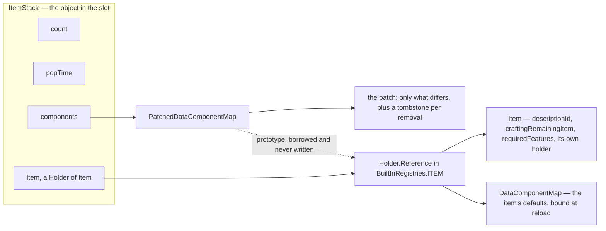
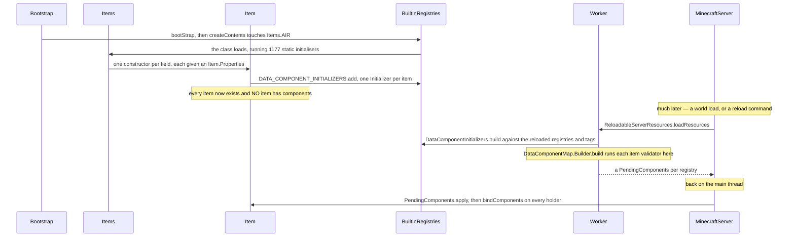

# Items and stacks

> Verified against **Minecraft 26.2** · Part VII · A diamond pickaxe sits in a hotbar slot, is compared against its neighbours, is sent to a client, and finally loses its last point of durability.

A diamond pickaxe is in your hotbar. The `Item` behind it,
`Items.DIAMOND_PICKAXE`, is a single object shared by every diamond pickaxe
that has ever existed on this server, and it holds four fields: a description
id, a crafting remainder, a feature-flag set, and its own registry holder. Not
the stack size. Not the mining speed. Not the durability. All of that is data
components ([data components](../foundations/data-components.md)) — and they
do not live on the `Item` either. They live on the item's `Holder.Reference`
in `BuiltInRegistries.ITEM`, and the *stack* borrows that map as a read-only
prototype and stores only the ways it differs from it. Two things follow, and
they run through the whole page. **That prototype does not exist until the
first data-pack load**: `Item.components` throws until a reload binds it, and
`Item.CODEC_WITH_BOUND_COMPONENTS` exists purely to refuse an item whose
components are not bound yet. And **a stack whose components equal its item's
defaults carries an empty patch** — every item's prototype contains
`DataComponents.ENCHANTMENTS` set to `ItemEnchantments.EMPTY`, so *enchanted
with nothing* and *never enchanted* are not merely equal, they are the same
object state, indistinguishable on disk and on the wire.

## The cast

| class | what it decides | thread |
|---|---|---|
| `Item` | the behaviour hooks, and four fields that are not components | both main threads |
| `Item.Properties` | the builder — which produces an *initializer*, never a component map | class-init, wherever the bootstrap runs |
| `Holder.Reference` | where an item's default components actually live, and whether they exist yet | written on a main thread at reload |
| `DataComponentInitializers` | the pile of pending default maps, one entry per registered item | built on the background executor |
| `ItemStack` | a holder, a count, a pop time and a patched map — the mutable thing in a slot | both main threads |
| `PatchedDataComponentMap` | prototype plus patch, and the copy-on-write flag that makes copying a stack free | wherever its stack is |
| `ItemStackTemplate` | the immutable stack: what a stack looks like inside a component, a particle or a recipe | both |
| `ItemEntity` | a stack that is an entity, with a five-minute clock and a merge rule | server main, mirrored on the client |

## Four fields, and only one of them is really data

`ItemStack` is a final class holding exactly four things: two ints, a registry
holder, and the interesting one.

The dotted arrow is the shape of the whole system. A stack does not own its
defaults and cannot change them: it points at a holder, and the holder owns
one `DataComponentMap` shared by every stack of that item in both programs.

`ItemStack.typeHolder` answers `Items.AIR`'s holder rather than null for an
empty stack, which is why `ItemStack.getItem` never returns null either. The
pop time is the odd one out: it is the five-tick squeeze the hotbar icon does
when something lands in it, set to 5 by `Inventory` when a stack grows and by
`ClientPacketListener.handleContainerSetSlot` when a slot update makes a
hotbar stack larger, counted down by `ItemStack.inventoryTick` on **both**
sides, and read by `GuiGraphicsExtractor` while it is above zero. It is
ordinary shared state that only the client has any use for — and
`ItemStack.copy` carries it across, so the animation survives being copied
into a menu slot.

`Item.Properties` is the builder used at class-init, and its output is not a
component map. `Item.Properties.component` and every convenience over it —
`Item.Properties.stacksTo`, `Item.Properties.durability`,
`Item.Properties.food`, `Item.Properties.tool`, `Item.Properties.spear`,
`Item.Properties.equippable`, `Item.Properties.useCooldown` — fold one more
step onto a `DataComponentInitializers.Initializer`, a function that will be
run against a `DataComponentMap.Builder` later, with a
`HolderLookup.Provider` in hand.

## The map that does not exist yet

Registration and definition happen at completely different times, on
different threads, in different phases of the program.

Between those two halves an `Item` is a live object whose `Item.components`
call ends in a null check reading *Components not bound yet*;
`Holder.Reference.areComponentsBound` is the polite way to ask, and
`Item.CODEC_WITH_BOUND_COMPONENTS` refuses to name an unbound item at all. The
client goes through the same gate on its own registries, in
`RegistryDataCollector` while `ClientConfigurationPacketListenerImpl` finishes
configuration — so a client on the title screen has componentless items too.

Almost none of that map actually varies with the data pack. Every initializer
starts by copying `DataComponents.COMMON_ITEM_COMPONENTS` — ten entries every
item in the game gets, including the stack size of 64 and the empty
enchantment list the hook rests on — and `Item.Properties.component` bakes
literal Java values on top. Only `Item.Properties.delayedComponent` and
`Item.Properties.delayedHolderComponent` read the context, and there are
**twenty** call sites between them in the entire game, all in `Item` and
`Items`: fire resistance resolving `DamageTypeTags.IS_FIRE`, the banner
patterns, the goat horn, the jukebox songs, the egg variants, the spear's
damage type. `Item.Properties.repairable` is the near miss — it takes a tag
and is still eager, because it takes a lookup from
`BuiltInRegistries.acquireBootstrapRegistrationLookup` at class-init and
stores an unresolved `HolderSet` rather than waiting.

## A patch with tombstones, and a copy that copies nothing

`PatchedDataComponentMap` holds three things: the prototype, a patch map, and
a copy-on-write flag. Reads consult the patch and fall through to the
prototype. Writes are where the design shows.
`PatchedDataComponentMap.set` compares the new value against the prototype's
and, if they are equal, **removes** the entry rather than storing it — the
patch never contains a value the item already had.
`PatchedDataComponentMap.remove` does the opposite trick: when the prototype
has the component, it cannot simply drop the key, so it writes an empty
optional as a tombstone meaning *this one is deliberately gone*. A patch is
therefore a diff in both directions, which is exactly what
`DataComponentPatch` serialises: additions, then removals.

`ItemStack.copy` and `PatchedDataComponentMap.asPatch` both hand out the
*same* patch map and set the copy-on-write flag on it, and every mutating
method calls `PatchedDataComponentMap.ensureMapOwnership` first, which forks
the map on the first write and clears the flag. Copying a stack — which menus,
recipes, hover text and `ServerPlayerGameMode.destroyBlock` all do constantly
— allocates one small object and copies no component data at all.

The wire form falls straight out of it. `ItemStack.OPTIONAL_STREAM_CODEC`
writes the count, then the item holder, then `PatchedDataComponentMap.asPatch`
— **the patch only, never the prototype**, because the receiver already has
the same prototype bound to the same holder. A count of zero is the whole
encoding of an empty stack.

## When two stacks are the same stack

Five static methods on `ItemStack` answer five different versions of that
question, and menus, recipes and the renderer each want a different one.

| method | compares | used for |
|---|---|---|
| `ItemStack.isSameItem` | the item holder only | *is this the same kind of thing* |
| `ItemStack.isSameItemSameComponents` | the item, then the whole `PatchedDataComponentMap` | stacking, and every *are these interchangeable* test |
| `ItemStack.matches` | the count as well | container synchronisation ([containers and menus](containers-and-menus.md)) |
| `ItemStack.matchesIgnoringComponents` | everything except the component types a predicate excuses | the held-item swap animation |
| `ItemStack.hashItemAndComponents` | the item's hash and the effective component map's | keying stacks in maps |

The second row is where the hook pays off. `PatchedDataComponentMap` compares
by prototype **and** patch, so for two stacks of the same item it amounts to
comparing the patches — and since a patch can never hold a value equal to the
prototype's, two pickaxes with the same damage are equal whether one reached
that state by being set explicitly or by never being touched.

The fourth row exists for one component. `DataComponents.DAMAGE` is the only
component type in the game declared with
`DataComponentType.Builder.ignoreSwapAnimation`, and
`ItemInHandRenderer.shouldInstantlyReplaceVisibleItem` passes exactly that
flag as the predicate — which is why a pickaxe losing a point of durability
does not re-play the lower-and-raise animation. And a trap sits under all five
rows: `ItemStack.EMPTY` is a singleton but is not identified by reference,
because `ItemStack.isEmpty` also answers true for `Items.AIR` and for any
count at or below zero.

## Two validators, one rule, two spellings

Durability and stackability are mutually exclusive, and the game says so
twice — in different places, at different times, against different
components.

| | the reload validator | `ItemStack.validateStrict` |
|---|---|---|
| installed by | `Item.Properties.finalizeInitializer` | — |
| rejects | `DataComponents.DAMAGE` on a stackable item | `DataComponents.MAX_DAMAGE` on a stackable item, and a count over the maximum |
| runs inside | `DataComponentMap.Builder.build` | `ItemInput`, `ItemStackTemplate.create`, `ItemStack.applyComponentsAndValidate` |
| when | at reload, on the background executor | when a command, a template or a component patch builds a stack |
| on failure | throws, failing the reload | logs, and yields `ItemStack.EMPTY` or restores the previous patch |

Neither is reached from a network decode, and the client's stacks are proved a
third way instead. Exactly **one** serverbound packet in the protocol carries
an `ItemStack`: `ServerboundSetCreativeModeSlotPacket`, whose
`ItemStack.OPTIONAL_UNTRUSTED_STREAM_CODEC` is wrapped in
`ItemStack.validatedStreamCodec` — which runs no validator at all, but
re-encodes the decoded stack through `ItemStack.CODEC` and throws if that
fails. `ItemStack.validateContainedItemSizes` makes it recursive, into
`DataComponents.CONTAINER`, `DataComponents.BUNDLE_CONTENTS` and
`DataComponents.CHARGED_PROJECTILES`, so a shulker box full of impossible
stacks is rejected at the door.

## An item, a count, some components — said three ways

`ItemInstance` is the read-only contract those validators are written
against: `ItemInstance.count`, `ItemInstance.getMaxStackSize`, and — through
`TypedInstance` and `DataComponentGetter` — five `TypedInstance.is` overloads
for tags, holder sets, raw items, holders and resource keys, to which
`ItemStack.is` adds a sixth taking a predicate. Its default
`ItemInstance.getMaxStackSize` answers **1** when
`DataComponents.MAX_STACK_SIZE` is missing — which for a bound item never
happens, because the common set puts 64 there.

Two classes implement it. `ItemStack` is the mutable one that lives in slots.
`ItemStackTemplate` is an immutable record of a `Holder<Item>`, a count and a
raw `DataComponentPatch` — what a stack becomes when it is stored *inside*
something else: `ItemContainerContents` (so a shulker box's contents are
templates, not stacks), `BundleContents`, `ChargedProjectiles`,
`ItemParticleOption`, `HoverEvent`, `UseRemainder`, the recipe classes, and
`Item`'s own crafting remainder. Its constructor refuses a count of zero or
`Items.AIR`, so there is no empty template; but
`ItemStackTemplate.create` and `ItemStackTemplate.apply`, which materialise a
real stack, run `ItemStack.validateStrict` on the result and answer
`ItemStack.EMPTY` with a log line rather than throwing.

## A pickaxe's last point of durability

Durability is not one component: `ItemStack.isDamageableItem` demands
`DataComponents.MAX_DAMAGE` present, `DataComponents.UNBREAKABLE` absent, and
`DataComponents.DAMAGE` present. Take a diamond pickaxe one block short of
breaking, and mine that block.

`ServerPlayerGameMode.destroyBlock` copies the held stack *before* touching it
— that copy is what `Block.playerDestroy` later hands the loot table, so the
drops are decided by the tool as it was — then calls `ItemStack.mineBlock`,
which delegates to `Item.mineBlock` and awards `Stats.ITEM_USED` if the item
claims the block. The base `Item.mineBlock` is pure component work: it reads
`DataComponents.TOOL`, does nothing without one, and damages the stack by
`Tool.damagePerBlock` only on a server level and only when the block's destroy
speed is not zero — so instant-break plants cost a tool nothing.

`ItemStack.hurtAndBreak` is the only way in, and the overload that does the
work demands a `ServerLevel` outright. The overloads taking a `LivingEntity`
pattern-match on the entity's level and **silently do nothing** on the client,
which is why a client never predicts durability. The amount then goes through
`EnchantmentHelper.processDurabilityChange`
([enchantments](enchantments.md)), which is how Unbreaking turns a point of
damage into no damage at all, and a player with `Player.hasInfiniteMaterials`
short-circuits to zero before even that. If anything survives, the stack fires
`CriteriaTriggers.ITEM_DURABILITY_CHANGED` for a real player, writes the new
`DataComponents.DAMAGE`, and — this being the last point — finds
`ItemStack.isBroken` true, **shrinks itself by one**, and calls the break hook
it was handed. For equipment that hook is `LivingEntity.onEquippedItemBroken`,
which strips the item's attribute modifiers and broadcasts an entity event
(47 for the main hand); `ServerPlayer.onEquippedItemBroken` adds
`Stats.ITEM_BROKEN` on top.

The client is told in one byte. `LivingEntity.handleEntityEvent` turns event
47 into `LivingEntity.breakItem`, which plays `DataComponents.BREAK_SOUND`
from the stack still in that slot and spawns five item particles; the empty
slot itself arrives separately, as a container update. Two siblings round the
family out: `ItemStack.hurtWithoutBreaking` clamps one short of the maximum,
and `ItemStack.hurtAndConvertOnBreak` transmutes rather than vanishing.

What the player actually watched was three methods on `Item`.
`Item.isBarVisible` is *is this stack damaged*, `Item.getBarWidth` scales the
damage over `Item.MAX_BAR_WIDTH` — thirteen pixels — and `Item.getBarColor`
sweeps a hue from green to red. `GuiGraphicsExtractor` draws the two-pixel bar
under the icon from those three answers and nothing else.

## The tick a stack gets, and the stack that is an entity

`ItemStack.inventoryTick` runs on both sides and does exactly one thing there:
decrement the pop time. It forwards to `Item.inventoryTick` only for a
`ServerLevel` — the hook's parameter is declared as one, so it cannot be
otherwise — and exactly two items override that hook, `CompassItem` and
`MapItem`. It has two callers: `Inventory.tick`, from `Player.aiStep`, walks
the thirty-six ordinary slots and tells the selected one it is the main hand;
`EntityEquipment.tick`, from `LivingEntity.aiStep`, walks the worn and held
slots of every living entity. A stack that leaves an inventory altogether
becomes an `ItemEntity`, which keeps it in a synched data entry
([synched entity data](../entities/synched-entity-data.md)) rather than a
plain field, counts up to a 6000-tick lifetime, and folds itself into
neighbours through `ItemEntity.mergeWithNeighbours` — a merge that keeps the
*smaller* of the two ages, so a fresh drop rejuvenates an old one. Blocks
reach it through `Block.popResource`
([block breaking](../blocks/block-breaking.md)).

## What this page hands off

Everything a stack *does* when a player holds down the use key — the
prediction, the countdown, the consumable and cooldown components, the
completion packet — is the next lecture: [using an item](using-an-item.md).
How two machines agree about a set of stacks in a screen is
[containers and menus](containers-and-menus.md); the component system itself
is [data components](../foundations/data-components.md), catalogued in the
[components reference](../../reference/components.md). And how an item picks
the model, texture and tint you see in the slot is **not** this part's subject
at all: it is Part XI's, in
[models and atlases](../rendering/models-and-atlases.md).

## Where to look

`Item` · `Item.Properties` · `Items` · `BuiltInRegistries.ITEM` ·
`DataComponentInitializers` · `Holder.Reference` ·
`ReloadableServerResources.loadResources` · `ItemStack` ·
`PatchedDataComponentMap` · `DataComponentPatch` · `ItemInstance` ·
`TypedInstance` · `ItemStackTemplate` · `ItemContainerContents` ·
`ServerPlayerGameMode.destroyBlock` · `ItemEntity` · `Inventory.tick` ·
`EntityEquipment.tick` · `ServerboundSetCreativeModeSlotPacket`

---

*Rules: names, never code · how the system works, not how the code reads ·
newest version only · every backticked name passes `tools/verify_names.py`.*
