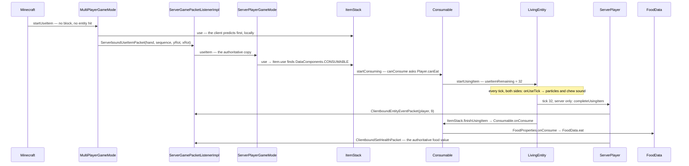

# Items and stacks

> Verified against **Minecraft 26.2** · Part VII · A player right-clicks a piece of cooked beef and holds the button for thirty-two ticks: the client predicts the whole meal, the server sends one byte to say it finished, and the hunger bar arrives separately.

## Responsibility

An `Item` is a behaviour; an `ItemStack` is a count plus a bag of data
components attached to one of those behaviours. Between them they cover
every stack in the game — in a hand, in a chest, on the ground, in a
recipe, on the wire. The system's job is to answer three questions
cheaply: *what happens when this is used*, *are these two stacks the same
thing*, and *what of this survives a save or a packet*.

The one sentence a player recognises: *a stack of sixteen cooked beef and
a stack of one enchanted sword are the same kind of object, and the
difference between them is data, not code.*

The headline: **`Item` holds almost no data.** Its fields are a
description id, a crafting remainder, a feature flag set and its own
registry holder. Everything a stack is made of — stack size, durability,
food, tool rules, equippability — is a data component
([data components](../foundations/data-components.md)), and the default
set for an item is not built until the first data-pack reload.

## The data it owns

- **`Item`** — the singleton behaviour object, one per registry entry, in
  `BuiltInRegistries.ITEM`. It declares the hooks: `Item.use`,
  `Item.useOn`, `Item.finishUsingItem`, `Item.releaseUsing`,
  `Item.onUseTick`, `Item.inventoryTick`, `Item.mineBlock`,
  `Item.hurtEnemy`, `Item.appendHoverText`. `Item.components` does not
  return a field — it delegates to `Holder.Reference.components` on the
  item's own registry holder.
- **`Item.Properties`** — the builder used at class-init in `Items`. It
  does not produce a component map; it produces a
  `DataComponentInitializers.Initializer` that is registered and run
  later. Its methods are the vocabulary of an item definition:
  `Item.Properties.food`, `Item.Properties.stacksTo`,
  `Item.Properties.durability`, `Item.Properties.tool`,
  `Item.Properties.sword`, `Item.Properties.spear`,
  `Item.Properties.humanoidArmor`, `Item.Properties.useCooldown`,
  `Item.Properties.usingConvertsTo`, `Item.Properties.equippable`.
- **`ItemStack`** — a final class holding exactly four things: a
  `Holder<Item>`, an int count, a `PatchedDataComponentMap`, and
  `ItemStack.getPopTime`. The pop time is ordinary shared state — both
  sides decrement it in `ItemStack.inventoryTick`, and `Inventory` writes
  it — it is simply that only the client has anything to do with the
  number. `ItemStack` implements `DataComponentHolder` and
  `ItemInstance`.
- **`PatchedDataComponentMap`** — prototype plus patch, genuinely
  copy-on-write: `PatchedDataComponentMap.copy` and
  `PatchedDataComponentMap.asPatch` hand out a shared patch map and set a
  flag, and the first mutation calls
  `PatchedDataComponentMap.ensureMapOwnership` to fork it.
  `PatchedDataComponentMap.set` **removes** the entry when the value
  equals the prototype's, so a stack whose components happen to match its
  item's defaults carries an empty patch.
- **`ItemInstance`** — the read-only "an item, a count, some components"
  contract shared by `ItemStack` and `ItemStackTemplate`. It declares
  `ItemInstance.count` and `ItemInstance.getMaxStackSize` — which
  defaults to **1** when `DataComponents.MAX_STACK_SIZE` is absent — and
  it extends `TypedInstance` (five `TypedInstance.is` overloads, with
  `ItemStack.is` adding a sixth) and `DataComponentGetter`.
- **`ItemStackTemplate`** — an immutable record of a `Holder<Item>`, a
  count and a `DataComponentPatch`, with `ItemStackTemplate.create` to
  materialise a real stack. It is what particles, hover events,
  `UseRemainder` and crafting remainders carry instead of a mutable
  `ItemStack`. An invalid template does not throw at that point: it is
  logged and yields `ItemStack.EMPTY`.
- **`ItemCooldowns`** and `ServerItemCooldowns` — a per-player map keyed
  by cooldown *group*, not by item. `ItemCooldowns.getCooldownGroup`
  returns `UseCooldown.cooldownGroup` if the component names one, and the
  item's registry `Identifier` otherwise. **Both sides own one**: the
  client's is a real prediction, consulted before it will even attempt a
  use.
- **`ItemEntity`** — the dropped stack, holding its `ItemStack` in
  `ItemEntity.DATA_ITEM` and merging with neighbours through
  `ItemEntity.mergeWithNeighbours`. Blocks reach it through
  `Block.popResource` ([block breaking](../blocks/block-breaking.md)).

### Durability

Durability is three components acting together, not one.
`ItemStack.isDamageableItem` requires `DataComponents.MAX_DAMAGE` to be
present, `DataComponents.UNBREAKABLE` to be absent, and
`DataComponents.DAMAGE` to be present. `ItemStack.hurtAndBreak` is the
only way in and it demands a `ServerLevel` — the shared overloads
silently do nothing on the client — running the amount through
`EnchantmentHelper.processDurabilityChange` first
([enchantments](enchantments.md)); when the item breaks it **shrinks the
stack by one** and calls the break hook.
`ItemStack.hurtWithoutBreaking` clamps one short of the maximum, and
`ItemStack.hurtAndConvertOnBreak` transmutes instead. `Item.isBarVisible`,
`Item.getBarWidth` and `Item.getBarColor` are the bar under the icon.

### The consumable components

Eating is not implemented by a food item class. It is four components and
one interface.

- **`Consumable`** — `Consumable.consumeSeconds` (default
  `Consumable.DEFAULT_CONSUME_SECONDS`, 1.6, so
  `Consumable.consumeTicks` is **32**), `Consumable.animation` (an
  `ItemUseAnimation`), `Consumable.sound`,
  `Consumable.hasConsumeParticles` and `Consumable.onConsumeEffects`. The
  presets are in `Consumables` — `Consumables.DEFAULT_FOOD`,
  `Consumables.DEFAULT_DRINK`, `Consumables.GOLDEN_APPLE`,
  `Consumables.CHORUS_FRUIT`, `Consumables.MILK_BUCKET` and the rest.
  A consumer may override the sound per stack by implementing
  `Consumable.OverrideConsumeSound`.
- **`FoodProperties`** — `FoodProperties.nutrition`,
  `FoodProperties.saturation`, `FoodProperties.canAlwaysEat`. It is not a
  passive data bag: it *implements* `ConsumableListener`, and
  `FoodProperties.onConsume` is what moves the food bar.
- **`ConsumableListener`** — one method, `ConsumableListener.onConsume`,
  found on the stack by `DataComponentHolder.getAllOfType`. Four things
  implement it: `FoodProperties`, `PotionContents`,
  `SuspiciousStewEffects` and `OminousBottleAmplifier`.
- **`ConsumeEffect`** — a registry-dispatched effect
  (`BuiltInRegistries.CONSUME_EFFECT_TYPE`) with five implementations:
  `ApplyStatusEffectsConsumeEffect`, `RemoveStatusEffectsConsumeEffect`,
  `ClearAllStatusEffectsConsumeEffect`, `TeleportRandomlyConsumeEffect`,
  `PlaySoundConsumeEffect`.
- **`UseRemainder`** (the empty bowl), **`UseCooldown`** (the seconds and
  the group) and **`UseEffects`** — the last of which is the reason
  eating slows you down: `UseEffects.canSprint`,
  `UseEffects.interactVibrations` and `UseEffects.speedMultiplier`, with
  `UseEffects.DEFAULT` being *(false, true, 0.2)* and sitting in
  `DataComponents.COMMON_ITEM_COMPONENTS`, so every item has one.

`FoodData` is the player's side of it: `FoodData.foodLevel`,
`FoodData.saturationLevel`, `FoodData.exhaustionLevel`, ticked server-side
in `FoodData.tick`, with the constants in `FoodConstants`
(`FoodConstants.MAX_FOOD` is 20) — see
[hunger, XP and effects](../player/hunger-xp-and-effects.md).

## When it runs

**The client's main thread — the one named *Render thread*
([anatomy](../anatomy/anatomy.md)) — starts everything.**
`Minecraft.handleKeybinds` sees the use key and calls
`Minecraft.startUseItem` outright on the press; only the held-down branch
consults `Minecraft.rightClickDelay`, and it also refuses while the
player is already using an item. The delay and `LocalPlayer.isHandsBusy`
are checked *inside* `Minecraft.startUseItem`, which then picks a hand and
a target and hands off to `MultiPlayerGameMode.useItem` or
`MultiPlayerGameMode.useItemOn`. Both open a prediction window
(`MultiPlayerGameMode.startPrediction` → `BlockStatePredictionHandler`,
see [block interaction](../blocks/block-interaction.md)), run the real
logic locally, and *then* send the packet the prediction concludes with.

**Server main thread** decides. `ServerGamePacketListenerImpl.handleUseItem`
and `ServerGamePacketListenerImpl.handleUseItemOn` are bounced off the
Netty thread by `PacketUtils.ensureRunningOnSameThread` — through the
`ServerLevel` overload, which hands the work to the server's
`PacketProcessor` ([the server tick](../server/server-tick.md)) — and
call `ServerPlayerGameMode.useItem` / `ServerPlayerGameMode.useItemOn`.

**Every tick, both sides**, `LivingEntity.tick` calls the private
`LivingEntity.updatingUsingItem`, which is where the use is abandoned if
the held item changed, and which then calls `LivingEntity.updateUsingItem`
— `ItemStack.onUseTick` first, with the count *before* the decrement, and
the decrement after. Only the server may act on reaching zero.

**The item tick is server-only, and it has two callers.**
`ItemStack.inventoryTick` decrements the pop time on both sides but
forwards to `Item.inventoryTick` only for a `ServerLevel` — the hook's
parameter is a `ServerLevel`, so it cannot be otherwise. `Inventory.tick`
walks the thirty-six ordinary slots; `EntityEquipment.tick`, reached from
`LivingEntity.aiStep`, walks the rest.

**The same thread, later in the frame,** reads the results:
`ItemInHandRenderer.applyEatTransform` bobs the model from
`LivingEntity.getUseItemRemainingTicks`, and `Hud.extractFood` draws the
bar from `FoodData.getFoodLevel`.

## The trace: eating a piece of cooked beef

1. **The click.** `Minecraft.handleKeybinds` fires `Minecraft.startUseItem`,
   which loops both hands. Nothing is hit, so it falls through to
   `MultiPlayerGameMode.useItem`, which refuses outright if the client's
   own `ItemCooldowns` says the item is on cooldown, and otherwise runs
   `ItemStack.use` **locally first** and hands the resulting
   `ServerboundUseItemPacket` — carrying the player's rotation as well as
   the hand and sequence number — back to
   `MultiPlayerGameMode.startPrediction` to send. The prediction is
   complete before a byte leaves the client.
2. **The dispatch.** `Item.use` is not overridden by anything in the food
   path; its default body is a component dispatch, and the
   `DataComponents.CONSUMABLE` branch is first and exclusive — an item
   that is both consumable and equippable is only ever eaten. It calls
   `Consumable.startConsuming`. (The other branches are
   `DataComponents.EQUIPPABLE` with a swappable flag,
   `DataComponents.BLOCKS_ATTACKS`, and `DataComponents.KINETIC_WEAPON`.)
3. **The refusal.** `Consumable.canConsume` consults `Player.canEat` only
   when the stack has `DataComponents.FOOD` *and* the user is a player —
   a potion or a milk bucket never looks at the food bar at all. For
   ordinary food on a full bar the answer is `InteractionResult.FAIL` and
   the trace stops here, unless the player's abilities are invulnerable,
   in which case they can always eat.
4. **Starting.** `LivingEntity.startUsingItem` does nothing if a use is
   already in progress; otherwise it sets `LivingEntity.useItem` and
   `LivingEntity.useItemRemaining` to 32. On the server it also **writes**
   two bits of `LivingEntity.DATA_LIVING_ENTITY_FLAGS`
   ([synched entity data](../entities/synched-entity-data.md)) — one set
   to true for "using", the other *assigned* the hand, so for a main-hand
   meal it is cleared — and fires `GameEvent.ITEM_INTERACT_START` through
   `ItemStack.causeUseVibration`, gated on `UseEffects.interactVibrations`.
   The result is `InteractionResult.CONSUME`, which carries
   `InteractionResult.SwingSource.NONE` — **which is why eating does not
   swing the arm.**
5. **The client's own timer.** `LocalPlayer.isUsingItem` is backed by a
   client-local flag, not by the synched bits;
   `LocalPlayer.onSyncedDataUpdated` reconciles the two afterwards, and it
   works in both directions — it will start a use the client never
   predicted and stop one it did.
6. **Chewing.** Each tick, `LivingEntity.updateUsingItem` calls
   `ItemStack.onUseTick` with the count *before* it decrements, so a
   thirty-two-tick meal is offered the numbers 32 down to 1 and never 0.
   `Consumable.shouldEmitParticlesAndSounds` is true once more than
   `Consumable.CONSUME_EFFECTS_START_FRACTION` of the duration has
   elapsed and the remaining count is a multiple of
   `Consumable.CONSUME_EFFECTS_INTERVAL` (4), and then
   `Consumable.emitParticlesAndSounds` spawns five item particles via
   `LivingEntity.spawnItemParticles` — behind
   `Consumable.hasConsumeParticles`, which drinks turn off — and plays
   the chew sound, which they do not. `Level.addParticle` does nothing on
   the server, so the particles are pure client simulation.
7. **The slowdown.** `LocalPlayer.modifyInput` scales the movement input
   by `LocalPlayer.itemUseSpeedMultiplier` — which reads
   `UseEffects.speedMultiplier` — unless the player is riding, and
   `LocalPlayer.isSlowDueToUsingItem` blocks sprinting because
   `UseEffects.canSprint` is false. The famous 20 % is a JSON default,
   and `Item.Properties.spear` overrides it outright: a spear may sprint
   and is not slowed at all.
8. **Tick thirty-two.** The client's counter does not stop at zero — it
   keeps running until the server's packet arrives, and only the arm
   animation is clamped. The completion is guarded three ways: the count
   reaching zero, being on the server, and the item not being a
   release-on-use item. The server calls
   `LivingEntity.completeUsingItem`, whose override
   `ServerPlayer.completeUsingItem` first sends
   `ClientboundEntityEventPacket` with event id 9.
9. **The meal.** `ItemStack.finishUsingItem` → `Item.finishUsingItem` →
   `Consumable.onConsume`, which emits a final burst of sixteen particles
   and the sound, then — **for a `ServerPlayer` only** — awards
   `Stats.ITEM_USED` and fires `CriteriaTriggers.CONSUME_ITEM`, then
   walks `DataComponentHolder.getAllOfType` for `ConsumableListener`s,
   finding `FoodProperties`, whose `FoodProperties.onConsume` plays the
   eat and burp sounds and calls `FoodData.eat`; then applies each
   `ConsumeEffect` in `Consumable.onConsumeEffects` **behind a
   server-side guard**, fires `GameEvent.EAT` — a no-op on the client,
   whose `ClientLevel.gameEvent` has an empty body — and finally
   `ItemStack.consume` shrinks the stack, which a player with infinite
   materials skips.
10. **The leftovers.** `ItemStack.applyAfterUseComponentSideEffects` runs
    against a copy taken at the *top of `ItemStack.finishUsingItem`* —
    immediately before the meal, not at the start of the thirty-two
    ticks — so it can still see the pre-shrink count.
    `UseRemainder.convertIntoRemainder` makes the bowl or bottle unless
    the player has infinite materials or the stack did not shrink, and
    `UseCooldown.apply` starts the cooldown for a player, which
    `ServerItemCooldowns.onCooldownStarted` mirrors as
    `ClientboundCooldownPacket`. Then `LivingEntity.stopUsingItem` clears
    the flag and fires `GameEvent.ITEM_INTERACT_FINISH`, both server-side;
    only the field reset runs on the client.
11. **The client replays it.** `Player.handleEntityEvent` turns event 9
    back into `LivingEntity.completeUsingItem`, so the client re-runs
    step 9 locally — particles, the chew sound, `FoodData.eat`, the
    shrink. It does **not** run the `ConsumeEffect`s, which is why a
    chorus fruit teleport is never predicted but the hunger bar jump is;
    and it does not reproduce the `FoodProperties` eat and burp sounds
    either, for the reason in the invariants below.
12. **The correction.** `ServerPlayer.doTick` notices the food value
    changed and sends `ClientboundSetHealthPacket` in the **same tick**,
    overwriting the client's prediction outright. The stack count is
    corrected by `AbstractContainerMenu.broadcastChanges`
    ([containers and menus](containers-and-menus.md)) — which for this
    player already ran, in the level's entity phase, before the meal — so
    it arrives a tick later than the health packet.

## Interfaces

- **Called by:** `Minecraft.handleKeybinds` and
  `Minecraft.startUseItem` on the client;
  `ServerGamePacketListenerImpl.handleUseItem`,
  `ServerGamePacketListenerImpl.handleUseItemOn` and `ServerGamePacketListenerImpl.handlePlayerAction` on the server;
  `LivingEntity.tick` every tick on both.
- **Calls into:** `BlockBehaviour.BlockStateBase.useItemOn` and
  `BlockBehaviour.BlockStateBase.useWithoutItem` for the block half
  ([block interaction](../blocks/block-interaction.md)), `FoodData`,
  `ItemCooldowns`, `GameEvent` for vibrations
  ([game events](../world/game-events-and-vibrations.md)), and
  `Level.playSeededSound`.
- **Crosses the network as:** `ServerboundUseItemPacket`,
  `ServerboundUseItemOnPacket`, `ServerboundPlayerActionPacket` (whose
  `ServerboundPlayerActionPacket.Action` includes `ServerboundPlayerActionPacket.Action.STAB` for spears) and
  `ServerboundSetCarriedItemPacket` upward;
  `ClientboundBlockChangedAckPacket`, `ClientboundEntityEventPacket`
  (event 9), `ClientboundSetEntityDataPacket` (the using-item flag —
  which the eater's own client also receives, and reconciles against),
  `ClientboundSetHealthPacket`, `ClientboundCooldownPacket`
  and the container packets downward. An `ItemStack` itself travels as
  `ItemStack.OPTIONAL_STREAM_CODEC` — count, item holder, then the
  **patch only**, never the prototype.
- **Data-driven by:** `BuiltInRegistries.ITEM`,
  `BuiltInRegistries.DATA_COMPONENT_TYPE`,
  `BuiltInRegistries.CONSUME_EFFECT_TYPE`, and — for the parts that need
  registries or tags to exist — `DataComponentInitializers`, run at
  reload from `ReloadableServerResources` on the server and
  `RegistryDataCollector` on the client. Mining and repair are tags
  (`BlockTags.SWORD_EFFICIENT`, `ItemTags`) rather than code.

## Invariants and surprises

- **An item's default components are reloadable state on a registry
  holder.** `Item`'s constructor registers a
  `DataComponentInitializers.Initializer` and walks away; the map is
  built by `DataComponentInitializers.build` — on the **background
  executor**, from `ReloadableServerResources.loadResources` — and
  installed later, on the main thread, with
  `Holder.Reference.bindComponents`. Until then `Item.components` throws,
  `Holder.Reference.areComponentsBound` is the test, and
  `Item.CODEC_WITH_BOUND_COMPONENTS` exists purely to refuse an item
  whose components have not been bound. Only the *delayed* parts of a
  definition actually vary with the data pack —
  `Item.Properties.delayedComponent` and
  `Item.Properties.delayedHolderComponent`, which is how a tag-dependent
  value like fire resistance or repairability gets in; the eagerly set
  values are fixed in Java.
- **A stack stores a diff, not a map.** Setting a component back to its
  prototype value removes it from the patch, so "enchanted with nothing"
  and "never enchanted" are the same object state.
  `ItemStack.isSameItemSameComponents` compares whole
  `PatchedDataComponentMap`s — prototype and patch — which for two stacks
  of the same item amounts to comparing the patches.
  `ItemStack.matches` and `ItemStack.hashItemAndComponents` are the other
  two members of the family.
- **An instant use returns its result *through* the `InteractionResult`.**
  `InteractionResult.Success.heldItemTransformedTo` is how a use replaces
  the held item; both game modes unwrap it and write it back to the hand,
  and `ItemStack.use` applies the side effects to the transformed stack
  rather than the original.
- **`ItemStack.use` only applies the remainder and the cooldown for
  *instant, successful* uses.** `ItemStack.applyAfterUseComponentSideEffects`
  needs both a zero use duration and an `InteractionResult.Success`; for
  a timed use it runs later, from `ItemStack.finishUsingItem` or
  `ItemStack.releaseUsing`.
- **The completion of a multi-tick use is one byte.** There is no "you
  ate this" packet: `ClientboundEntityEventPacket` with id 9 tells the
  client to re-derive the outcome from components it already has, and
  `ClientboundSetHealthPacket` corrects it afterwards.
- **One meal, two different exactly-once sound strategies.** The chew
  sound goes through `Player.playSound`, which names the eater as the
  entity to *exclude*, so the server broadcasts it to everyone else and
  the eater's own client plays it locally. The `FoodProperties` eat and
  burp sounds pass no exclusion at all — and `ClientLevel.playSeededSound`
  plays a sound only when it is excluding the local player, so those two
  reach the eater as the server's broadcast alone.
- **`Consumable.onConsume` runs on both sides; three parts of it do not.**
  The stats and the advancement criterion need a `ServerPlayer`, the
  `ConsumeEffect`s need a non-client level, and the game event is a no-op
  on the client because `ClientLevel.gameEvent` has an empty body.
  Particles, sound, the `ConsumableListener` and the stack shrink run on
  both, and every one of those client mutations is later overwritten.
- **Durability and stackability are mutually exclusive, enforced twice
  and not by the same test.** The validator installed by
  `Item.Properties.finalizeInitializer` rejects `DataComponents.DAMAGE`
  on a stackable item, and it fires inside `DataComponentMap.Builder.build`
  — i.e. at *reload*, not at class-init. `ItemStack.validateStrict`
  rejects `DataComponents.MAX_DAMAGE` on a stackable item instead, and it
  is reached from commands and templates, not from a network decode.
- **The client's stacks are validated by re-encoding, not by a
  validator.** Exactly one serverbound packet carries an `ItemStack` at
  all — the creative-mode slot packet — and its
  `ItemStack.OPTIONAL_UNTRUSTED_STREAM_CODEC` is wrapped in
  `ItemStack.validatedStreamCodec`, which proves the decoded stack by
  running it back through `ItemStack.CODEC`.
  `ItemStack.validateContainedItemSizes` means the check recurses into
  `DataComponents.CONTAINER`, `DataComponents.BUNDLE_CONTENTS` and
  `DataComponents.CHARGED_PROJECTILES`.
- **The use is abandoned in `LivingEntity.updatingUsingItem`, not
  `LivingEntity.updateUsingItem`.** The first is the private per-tick
  entry point and holds the `ItemStack.isSameItem` comparison — so
  swapping a bowl for a stew aborts eating, but a durability tick does
  not; the second is the countdown itself.
- **A durability change does not restart the swap animation.**
  `DataComponents.DAMAGE` is declared with
  `DataComponentType.Builder.ignoreSwapAnimation`, and
  `ItemInHandRenderer.shouldInstantlyReplaceVisibleItem` compares with
  `ItemStack.matchesIgnoringComponents`.
- **`ItemStack.EMPTY` is not identified by reference.**
  `ItemStack.isEmpty` also accepts `Items.AIR` and a count at or below
  zero, so a stack shrunk to nothing is empty without being the
  singleton.
- **Cooldowns are grouped.** One `ClientboundCooldownPacket` names a
  group, so a single cooldown can gate several items — and two items with
  the same `UseCooldown.cooldownGroup` share one timer.
- **72000 ticks is the "until released" duration, and it is spelled out
  in several places.** `Item.APPROXIMATELY_INFINITE_USE_DURATION` names
  it, and `Item.getUseDuration` returns it for
  `DataComponents.BLOCKS_ATTACKS` and `DataComponents.KINETIC_WEAPON` —
  but `BowItem`, `CrossbowItem` and `TridentItem` override
  `Item.getUseDuration` and return the same hour of ticks regardless of
  components, and `BrushItem`, `BundleItem`, `SpyglassItem`,
  `EnderEyeItem` and `InstrumentItem` override it with numbers of their
  own. `ItemStack.getUseDuration` is a pure delegate.
- **`SpyglassItem.finishUsingItem` is the only override of
  `Item.finishUsingItem` anywhere in the tree.** Everything else in the
  consume path is component dispatch.
- **The other half of the use pipeline is release, not completion.**
  `ItemStack.useOnRelease` is the third term in the completion guard, and
  an item for which it is true never finishes by counting down: the bow,
  the crossbow and the trident are finished by
  `ServerboundPlayerActionPacket`, through
  `LivingEntity.releaseUsingItem` and `ItemStack.releaseUsing`.

## Where to look

`Item` · `Item.Properties` · `Items` · `ItemStack` · `ItemInstance` ·
`ItemStackTemplate` · `PatchedDataComponentMap` ·
`DataComponentInitializers` · `Consumable` · `Consumables` ·
`ConsumableListener` · `FoodProperties` · `FoodData` · `ConsumeEffect` ·
`UseRemainder` · `UseCooldown` · `UseEffects` · `ItemUseAnimation` ·
`ItemCooldowns` · `LivingEntity.startUsingItem` ·
`LivingEntity.completeUsingItem` · `LivingEntity.releaseUsingItem` ·
`ServerPlayerGameMode.useItem` ·
`MultiPlayerGameMode.useItem` · `ItemEntity` · `InteractionResult`

---

*Rules: names, never code · how the system works, not how the code reads ·
newest version only · every backticked name passes `tools/verify_names.py`.*
