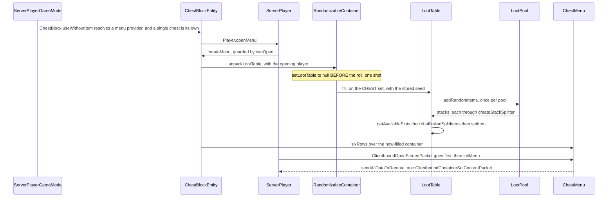
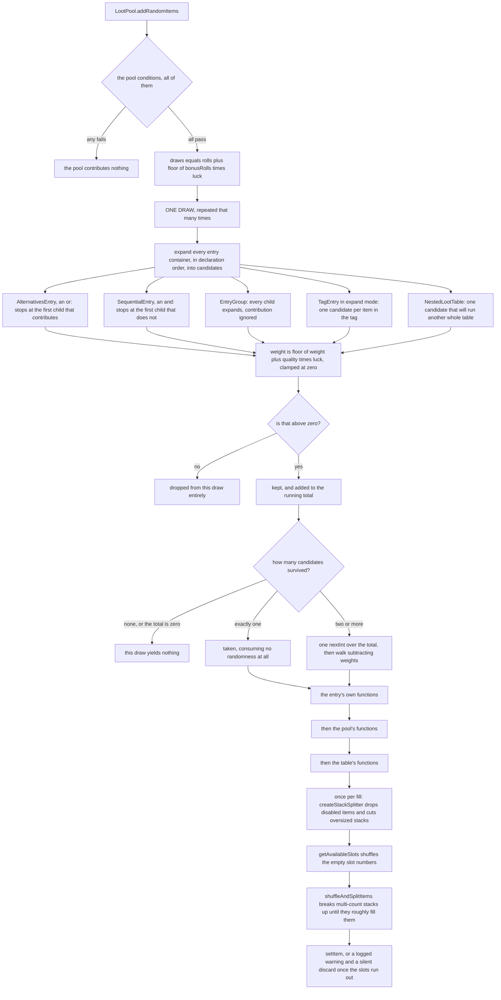

# Loot tables

> Verified against **Minecraft 26.2** · Part VII · A player opens a dungeon chest for the first time, and every item in it comes into existence between the click and the screen.

You break into a mossy cobblestone room, there is a chest against the wall,
and you right-click it. Between that click and the inventory screen the server
does something it will do exactly once for this chest: it looks up a loot
table, rolls it, scatters the results across the empty slots, and throws the
recipe away. Until that moment the chest is **genuinely empty on disk** — the
region file holds a table key and a seed and no items at all. And the roll is a
one-shot in the strictest sense: `RandomizableContainer.unpackLootTable` clears
the stored key *before* it rolls, and the thing that triggers it is not "a
player opens this chest" but "anything reads this container". A hopper
underneath taking one item, or a comparator behind the wall asking how full it
is, will commit the roll with **no player present, and therefore no luck, for
good**.

The typed parameters the table is handed, the predicates it tests and the sets
those belong to are not loot machinery — they are the general context engine
that enchantment effects, advancement triggers, `/execute if predicate` and
villager trade filters all run on, and
[contexts and predicates](contexts-and-predicates.md) is where they are
explained. Loot is that engine's oldest and largest client. This page is the
worked example: what a table *is*, how one draw picks an item, and why the
chest was empty.

## The cast

| class | what it decides | thread |
|---|---|---|
| `LootTable` | the parameter set, an optional random sequence, the pools, and the two ways out — `LootTable.fill` into a container, `LootTable.getRandomItems` into a list | server main |
| `LootPool` | whether the pool runs at all, and how many draws it makes | server main |
| `LootPoolEntryContainer` | the entry algebra — `ComposableEntryContainer.expand` answers *did I contribute* | server main |
| `LootPoolSingletonContainer` | weight and quality, the only place in the whole system where luck reaches a choice | server main |
| `LootItemFunction` | forty-three stack-to-stack transforms, composed into one per level | server main |
| `RandomizableContainer` | the stored table key and seed, and the one-shot unpack | server main |
| `LootContext` | which random source this draw uses, and the recursion guard | server main |
| `ReloadableServerRegistries` | loading the three loot registries and validating them | the background executor |

## The chest was empty before you got there

Nothing wrote items into that chest at world generation. `MonsterRoomFeature`
places the room, makes up to two attempts at a chest position — each needing an
air block with exactly one solid horizontal neighbour — and for each one calls
`RandomizableContainer.setBlockEntityLootTable` with
`BuiltInLootTables.SIMPLE_DUNGEON` and a fresh long from the feature's own
random. What lands on the live `ChestBlockEntity` is a **key and a seed**, and
nothing else. Structure pieces do the same through `StructurePiece.createChest`
and `StructurePiece.createDispenser`; `BuiltInLootTables` holds a hundred and
seventeen named keys plus a per-dye-colour set for sheep, covering chests,
dispensers, gameplay drops, shearing, brushing, decorated pots, equipment,
archaeology and spawners.

The seed reaches disk on the next save, and from then on the emptiness is
self-perpetuating. `RandomizableContainer.trySaveLootTable` writes the key —
and the seed only when it is non-zero — and answers *yes, I handled this*, so
`ChestBlockEntity.saveAdditional` never writes an item list.
`RandomizableContainer.tryLoadLootTable` answers the same way on the way back
in, and `ChestBlockEntity.loadAdditional` **skips reading items entirely**. A
chest nobody has touched has no inventory in any file the game has ever
written.

## From the click to the screen

**The click** arrives as `ServerPlayerGameMode.useItemOn` and reaches
`ChestBlock.useWithoutItem`
([block interaction](../blocks/block-interaction.md)), which asks
`ChestBlock.getMenuProvider` for something to open. A single chest *is* its own
provider — the combiner hands back the `ChestBlockEntity`. A double chest is the
interesting case: it gets an anonymous provider wrapped round a
`CompoundContainer` that requires **both** halves to pass
`RandomizableContainerBlockEntity.canOpen`, unpacks **both** loot tables
itself, and never enters either block entity's own menu factory.

**Opening** goes through `ServerPlayer.openMenu`, which closes whatever menu was
already open, allocates a container id, and calls
`RandomizableContainerBlockEntity.createMenu`. That is where the lock check and
the spectator check live: `RandomizableContainerBlockEntity.canOpen` refuses a spectator *while a table is still
pending*, so a spectator cannot commit the roll by peering into an unopened
chest, though they can open one that has already been rolled.

**The unpack** is `RandomizableContainer.unpackLootTable`, and its order matters
more than anything else on this page. It looks the key up through
`ReloadableServerRegistries.Holder.getLootTable` — which answers
`LootTable.EMPTY` for a missing key, never null — fires
`CriteriaTriggers.GENERATE_LOOT` if a `ServerPlayer` is doing the opening, and
**then clears the stored key**, before a single die is rolled. It builds the
parameters with `LootContextParams.ORIGIN` at the block centre and, *only if a
player is present*, that player's `Player.getLuck` and
`LootContextParams.THIS_ENTITY`. Then it calls `LootTable.fill` with the
container, those parameters and the stored seed.

**The screen** comes last and is no part of the roll. `ServerPlayer.openMenu`
sends `ClientboundOpenScreenPacket` and then calls `ServerPlayer.initMenu`,
which attaches the listener and the synchronizer; attaching a synchronizer runs
`AbstractContainerMenu.sendAllDataToRemote`, and that is the single
`ClientboundContainerSetContentPacket` carrying the freshly rolled contents
([containers and menus](containers-and-menus.md)).

## One roll, drawn

`LootTable.fill` runs every pool of the table, each pool makes some number of
independent draws, and each draw picks at most one entry. That draw is the
engine's smallest complete unit, and it is a funnel with three fan-outs in it.

**The algebra is boolean, not weighted.** `ComposableEntryContainer.expand`
returns a plain *did I contribute*, and `ComposableEntryContainer.and` and
`ComposableEntryContainer.or` are what `CompositeEntryBase` folds a child list
down with. So `AlternativesEntry` short-circuits like a boolean or and
`SequentialEntry` like a boolean and — neither is a weighted choice between
branches, and the validator reports an `AlternativesEntry` whose non-final
children carry no conditions, because every later alternative is then
unreachable. Nine entry types are registered in `LootPoolEntries`: the leaves
`LootItem`, `EmptyLootItem`, `TagEntry`, `NestedLootTable`, `DynamicLoot` and
`SlotLoot`, and the composites `AlternativesEntry`, `SequentialEntry` and
`EntryGroup`. `TagEntry` has two modes and they are not variations on a theme:
expanded, it becomes one weighted candidate *per item in the tag*; unexpanded,
it is a single candidate that emits **every** item in the tag at once.

**Luck touches exactly two things**, and neither is what players think it is.
`LootPool.bonusRolls` is multiplied by luck and floored to add whole extra
draws, and `LootPoolSingletonContainer.EntryBase.getWeight` is
*weight + quality × luck*, floored, then clamped at zero. Because a candidate
whose weight comes out at zero or below is discarded rather than merely made
rare, a **negative quality with enough luck removes an entry from the pool
altogether**. Everything else players call luck is something else entirely:
Fortune is `ApplyBonusCount` and `BonusLevelTableCondition`, both reading
`LootContextParams.TOOL` and asking `EnchantmentHelper` for a level on it;
Looting is `EnchantedCountIncreaseFunction` and
`LootItemRandomChanceWithEnchantedBonusCondition`, both reading
`LootContextParams.ATTACKING_ENTITY` and asking about the killer's gear.

**Functions apply innermost first.** Each level wraps the output consumer with
`LootItemFunction.decorate` over its own `LootItemFunctions.compose`, so as the
call stack unwinds a drop passes the entry's functions, then the pool's, then
the table's. Forty-two of the forty-three registered functions extend
`LootItemConditionalFunction`, whose `LootItemConditionalFunction.apply` is
final and hands the stack back
untouched when its own conditions fail — which is why a function with a failing
condition is a no-op and not a veto on the drop. They also **mutate the stack in
place and return it**, which is safe only because `LootItem` and `TagEntry`
construct fresh stacks. `DynamicLoot` is the exception: it calls straight out to
a callback the caller registered with `LootParams.Builder.withDynamicDrop`, and
the one `ShulkerBoxBlock.getDrops` registers hands back the block entity's live
stacks uncopied.

## The scatter

`LootTable.fill` does not simply place what it rolled.
`LootTable.getAvailableSlots` collects the container's empty slot numbers and
shuffles them; `LootTable.shuffleAndSplitItems` then pulls the multi-count
stacks out of the result list and repeatedly splits one — taking a random amount
between one and half its count — until the number of pieces roughly matches the
slot count. That is why one rolled stack of arrows arrives as three partial ones
in three unrelated slots. If the pieces outnumber the free slots, the remainder
is **logged as a warning and silently discarded**.

Above that sits `LootTable.createStackSplitter`, which every public
`LootTable.getRandomItems` and `LootTable.fill` wraps its output in: it drops
items the level's feature flags disable, and cuts anything at or over its
maximum stack size into stack-sized pieces. `NestedLootTable` deliberately calls
`LootTable.getRandomItemsRaw` instead, so a nested table's results are split
once by the outer table rather than twice.

## Where the randomness comes from

`LootContext.Builder` resolves the random source in a fixed order, and the zero
is load-bearing. `LootContext.Builder.withOptionalRandomSeed` installs a seeded
source **only when the seed is non-zero**; failing that, the table's declared
random sequence is fetched from the server's per-world `RandomSequences` through
`MinecraftServer.getRandomSequence`; failing that, the level's own random is
used. `LootTable.RANDOMIZE_SEED` names the zero, and nothing in the game reads
the constant.

So a seed of zero means *unseeded*, is indistinguishable from having no seed at
all, and is never written to NBT — which is why a chest given a loot table by
command re-rolls freshly every time while a structure chest does not. Named
random sequences are the other half: a table that declares one draws from a
stored, saved sequence rather than the level random, which is what keeps the
same table in the same world reproducible across a restart. Villager trades use
that mechanism from outside the loot package —
`AbstractVillager.addOffersFromTradeSet` builds its context with
`TradeSet.randomSequence`.

Loading is the only part of any of this that is not on the server thread.
`ReloadableServerRegistries.reload` schedules one load per `LootDataType` on the
background executor, builds a registry for each, loads that registry's tags,
freezes the layer and only then validates
([the resource system](../foundations/resource-system.md)). Rolling is server
main everywhere, and the guarantee is a type rather than a thread check: the
parameters are built from a `ServerLevel`, so a `ClientLevel` cannot produce
them at all. No client class references the loot package.

## Questions players ask

**Did I just lose the loot by putting a hopper under it?** Yes, and the answer
is precise about which reads count.

**Five** — the container methods `RandomizableContainerBlockEntity` overrides so
that they unpack first: `RandomizableContainerBlockEntity.isEmpty`,
`RandomizableContainerBlockEntity.getItem`,
`RandomizableContainerBlockEntity.removeItem`,
`RandomizableContainerBlockEntity.removeItemNoUpdate` and — the surprising one —
`RandomizableContainerBlockEntity.setItem`.

A comparator gets there through
`AbstractContainerMenu.getRedstoneSignalFromContainer`, which walks
`Container.getItem` over every slot. A hopper gets there the same way before it
takes anything, and a hopper pointing *into* the chest commits the roll by
writing. `Clearable.clearContent` and `Container.getContainerSize` do not
unpack, and neither does saving — which is why `/data get block` on an unopened
chest reports the loot table key instead of committing the roll.

**Can I reference the same table twice?** Yes. The recursion guard in
`LootContext` is a **stack, not a ledger**: `LootContext.pushVisitedElement`
adds the table on the way in and `LootContext.popVisitedElement` takes it off on
the way out, so two pools pointing at the same nested table each get items, and
so do two rolls of one pool. Only genuine re-entrancy — a table inside itself —
trips it, and it is logged as an infinite loop rather than passing silently.

**Why does a shulker box in my inventory say the contents are unknown?**
`DataComponents.CONTAINER_LOOT` carries a `SeededContainerLoot` and is declared
persistent with no network codec of its own, so
`ByteBufCodecs.fromCodecWithRegistries` supplies one from the persistence codec
and the component **does** reach the client
([data components](../foundations/data-components.md)). The client cannot
resolve the table — it has no loot registry at all — so
`SeededContainerLoot.addToTooltip` prints the unknown-contents line instead.

**Does the type declared on the table do anything?** Not at roll time. A table's
parameter set is read during load-time validation and never compared against the
incoming parameters; whether a chest table works is entirely down to what the
*caller* put in the map. That, and the twenty-six sets, are next door in
[contexts and predicates](contexts-and-predicates.md).

Two callers on the other side of that door are worth naming here:
`BlockBehaviour.BlockStateBase.getDrops` for every block broken
([block breaking](../blocks/block-breaking.md)) and
`LivingEntity.dropFromLootTable` for every mob killed
([damage and death](../entities/damage-and-death.md)).
`EnchantWithLevelsFunction` and `EnchantRandomlyFunction` are the loot side of
[enchanting](enchanting.md). And `EquipmentUser.equip` is the one caller that
compares the looked-up table against `LootTable.EMPTY` **by identity** to decide
whether to bother.

## Where to look

`RandomizableContainer.unpackLootTable` · `RandomizableContainerBlockEntity` ·
`ChestBlock.getMenuProvider` · `LootTable.fill` ·
`LootTable.getRandomItemsRaw` · `LootPool.addRandomItems` ·
`ComposableEntryContainer` · `LootPoolSingletonContainer.EntryBase` ·
`AlternativesEntry` · `TagEntry` · `NestedLootTable` · `DynamicLoot` ·
`LootItemFunctions` · `LootItemConditionalFunction` ·
`LootTable.createStackSplitter` · `LootContext.Builder` · `RandomSequences` ·
`BuiltInLootTables` · `ReloadableServerRegistries` · `SeededContainerLoot`

---

*Rules: names, never code · how the system works, not how the code reads ·
newest version only · every backticked name passes `tools/verify_names.py`.*
