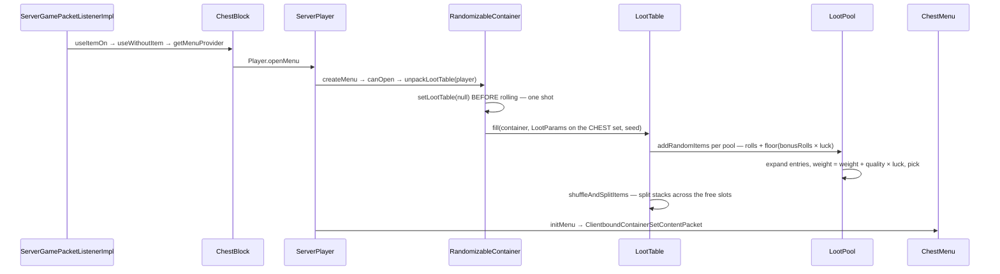

# Loot tables

> Verified against **Minecraft 26.2** · Part VII · A player opens a dungeon chest: the chest is genuinely empty on disk, the table rolls at the moment of opening, and whoever touches the block first — player or hopper — commits the roll.

## Responsibility

A loot table is a data-pack description of "roll some items". The system
loads those descriptions into registries, evaluates them against a bag of
typed parameters, and hands the results to whoever asked. Blocks, mobs,
chests, fishing, brushing, bartering, villager gifts, advancements and
commands all ask.

The one sentence a player recognises: *what a chest has in it, and what
a mob drops.*

The headline for a 1.21-era reader: **loot parameters have moved out of
the loot package entirely.** *LootContextParam* and
*LootContextParamSet* are now the general-purpose `ContextKey`,
`ContextKeySet` and `ContextMap`, and the same machinery is what
[enchantments](enchantments.md) use to decide whether an effect fires. The
"loot" system is really Minecraft's data-driven predicate and effect
engine; generating items is one of its clients.

## The data it owns

- **`LootTable`** — a parameter set, an optional random-sequence
  identifier, a list of pools, table-level functions pre-composed into
  one, and the container-filling entry points `LootTable.fill` and
  `LootTable.getRandomItems`.
- **`LootPool`** — entries, conditions, functions, and two number
  providers: `LootPool.rolls` and `LootPool.bonusRolls`.
- **`LootPoolEntryContainer`** and its expansion. `ComposableEntryContainer.expand`
  returns a boolean — "did I contribute" — and that is what makes the
  composites work: `AlternativesEntry` is an or, `SequentialEntry` is an
  and, `EntryGroup` runs everything. The leaves are `LootItem`,
  `TagEntry`, `NestedLootTable`, `DynamicLoot`, `EmptyLootItem` and the
  new `SlotLoot`.
- **`LootPoolSingletonContainer`** — weight and quality.
  `LootPoolSingletonContainer.EntryBase.getWeight` is
  *weight + quality × luck*, floored at zero.
- **`LootItemFunction`** — a function from stack to stack, extending
  `LootContextUser` and a plain bi-function. Forty of them, from
  `SetItemCountFunction` and `EnchantWithLevelsFunction` to
  `SetContainerLootTable`, `ApplyBonusCount` and `ApplyExplosionDecay`.
- **`LootItemCondition`** — a predicate over a `LootContext`. The usual
  suspects plus `EnchantmentActiveCheck` and the new
  `EnvironmentAttributeCheck`.
- **`NumberProvider`** — `ConstantValue`, `UniformGenerator`,
  `BinomialDistributionGenerator`, `ScoreboardValue`, `StorageValue`,
  `Sum`, `EnchantmentLevelProvider`, `EnvironmentAttributeValue`. A bare
  float works wherever one is expected.
- **`LootContext`** — the per-invocation state: the params, the chosen
  random source, a resolver for references, and a **set** of visited
  elements used as the recursion guard.
- **`LootParams`** — the immutable inputs: the level, a `ContextMap`, the
  dynamic-drop callbacks and the luck value.
- **`LootContextParams`** — the fifteen keys, including
  `LootContextParams.THIS_ENTITY`, `LootContextParams.ORIGIN`,
  `LootContextParams.BLOCK_STATE`, `LootContextParams.TOOL` (which is
  now typed as `ItemInstance`, the read-only item view),
  `LootContextParams.DAMAGE_SOURCE`,
  `LootContextParams.ATTACKING_ENTITY`,
  `LootContextParams.EXPLOSION_RADIUS` and
  `LootContextParams.ENCHANTMENT_LEVEL`.
- **`LootContextParamSets`** — the twenty-five named sets. Notable ones:
  `LootContextParamSets.BLOCK`, `LootContextParamSets.ENTITY`,
  `LootContextParamSets.CHEST`, `LootContextParamSets.FISHING`,
  `LootContextParamSets.ARCHAEOLOGY`, `LootContextParamSets.SHEARING`,
  `LootContextParamSets.GIFT`, `LootContextParamSets.VAULT`,
  `LootContextParamSets.EMPTY` and the catch-all
  `LootContextParamSets.ALL_PARAMS`, which is what a table with no
  declared type gets.
- **`LootDataType`** — the three loot registries as data:
  `LootDataType.TABLE`, `LootDataType.PREDICATE`,
  `LootDataType.MODIFIER`.
- **`BuiltInLootTables`** — the hardcoded keys for chests, gameplay,
  shearing, brushing, equipment and spawners.

Loot tables **are a registry of data-pack objects**: `Registries.LOOT_TABLE`,
with predicates and item modifiers as siblings. They live in the
reloadable registry layer, and code reaches them through the server's
reloadable-registry holder rather than a manager class.

## When it runs

**Reload worker threads** for loading and validation.
`ReloadableServerRegistries` schedules one load per loot data type,
populates a registry each, then validates everything asynchronously
before handing back frozen registries.

**Server main thread** for every roll, without exception — every entry
point demands a `ServerLevel`, and building a `LootContext` reaches for
the server.

**Chunk generation workers** write the *seed*: when a structure places a
container, it stores a random seed in the block entity's NBT before the
data is loaded. Loading that block entity then finds a loot table key and
**skips loading items entirely** — the chest on disk is empty by design.

## The trace: a chest generates

1. **The click.** `ServerPlayerGameMode.useItemOn` reaches
   `ChestBlock.useWithoutItem`
   ([block interaction](../blocks/block-interaction.md)), which resolves
   a menu provider — a single chest is its own block entity, a double
   chest an anonymous provider over a `CompoundContainer` that requires
   *both* halves to unlock and unpacks *both* loot tables.
2. **Opening.** `ServerPlayer.openMenu` calls the provider, which reaches
   `RandomizableContainerBlockEntity.createMenu`, which checks
   `RandomizableContainerBlockEntity.canOpen` — a spectator is refused
   while a table is still pending — and then unpacks.
3. **The unpack.** `RandomizableContainer.unpackLootTable` looks the
   table up (a missing key yields `LootTable.EMPTY`, never null), fires
   `CriteriaTriggers.GENERATE_LOOT`, and **clears the stored key before
   rolling**. It builds a `LootParams` with the origin, and — only if a
   player is present — that player's luck and entity.
4. **The random source.** `LootTable.fill` uses the stored seed if it is
   non-zero; `LootTable.RANDOMIZE_SEED` is zero, and a zero seed means
   "unseeded", falling back to the table's named random sequence or the
   level's own random.
5. **The pools.** Each pool tests its condition, then rolls
   *rolls + floor(bonusRolls × luck)* times.
6. **The draw.** Each roll expands every entry — this is where
   `AlternativesEntry`, `TagEntry` and `NestedLootTable` fan out — keeps
   the entries whose weight is above zero, sums, picks and walks.
7. **The functions.** Entry functions, then pool functions, then table
   functions, each short-circuiting on its own conditions.
8. **The splitter.** `LootTable.createStackSplitter` drops
   feature-disabled items and splits anything over its maximum stack
   size.
9. **The scatter.** `LootTable.fill` does not simply place the results:
   `LootTable.getAvailableSlots` shuffles the empty slots, and
   `LootTable.shuffleAndSplitItems` repeatedly halves multi-count stacks
   until they roughly fill the slot count. That is why one rolled stack
   of arrows arrives as three partial ones. Running out of slots only
   logs a warning.
10. **The screen.** The menu is created, `ClientboundOpenScreenPacket`
    goes out, and `ServerPlayer.initMenu` sends the freshly rolled
    contents as one `ClientboundContainerSetContentPacket`
    ([containers and menus](containers-and-menus.md)).

## Interfaces

Who calls loot tables, and with which parameter set:

| caller | set | when |
|---|---|---|
| `BlockBehaviour.BlockStateBase.getDrops` | `LootContextParamSets.BLOCK` | any block break ([block breaking](../blocks/block-breaking.md)) |
| `Block.dropFromBlockInteractLootTable` | `LootContextParamSets.BLOCK_INTERACT` | beehives, cave vines, carving a pumpkin, sweet berries |
| `LivingEntity.dropFromLootTable` | `LootContextParamSets.ENTITY` | death ([damage and death](../entities/damage-and-death.md)) |
| `LivingEntity.dropFromShearingLootTable` | `LootContextParamSets.SHEARING` | sheep, mooshrooms, snow golems, bogged |
| `LivingEntity.dropFromGiftLootTable` | `LootContextParamSets.GIFT` | villager hero gifts, cat gifts, chicken eggs, sniffer digs |
| `LivingEntity.dropFromEntityInteractLootTable` | `LootContextParamSets.ENTITY_INTERACT` | brushing an armadillo |
| `RandomizableContainer.unpackLootTable` | `LootContextParamSets.CHEST` | first touch of a structure container |
| `FishingHook.retrieve` | `LootContextParamSets.FISHING` | reeling in; luck is the hook's plus the owner's |
| `BrushableBlockEntity` | `LootContextParamSets.ARCHAEOLOGY` | brushing suspicious sand |
| `PiglinAi.getBarterResponseItems` | `LootContextParamSets.PIGLIN_BARTER` | bartering |
| `EquipmentUser.equip` | `LootContextParamSets.EQUIPMENT` | mob spawn equipment |
| `VaultBlockEntity` | `LootContextParamSets.VAULT` | trial chamber vaults |
| `AdvancementRewards.grant` | `LootContextParamSets.ADVANCEMENT_REWARD` | advancement loot |
| `Enchantment.damageContext` and its siblings | the five enchanted sets | an enchantment effect's condition |
| `LootCommand` | block, entity, chest or fishing | `/loot` |
| `ItemCommands.applyModifier` | `LootContextParamSets.COMMAND` | `/item … with` |

- **Crosses the network as:** nothing. The three loot registries live in
  the reloadable layer, which is not part of registry synchronisation,
  and no client class references the package at all. What crosses is the
  *result* — container packets, item entities — and, as a wrinkle,
  `DataComponents.CONTAINER_LOOT`: declared persistent with no explicit
  network codec, it falls back to an NBT codec and therefore *does* reach
  the client, which is how a picked-up shulker box can show an unknown
  loot table in its tooltip.
- **Data-driven by:** `Registries.LOOT_TABLE`, `Registries.PREDICATE`,
  `Registries.ITEM_MODIFIER`, plus the type registries for entries,
  functions, conditions and the three provider families.

### Missing parameters, three ways

Building a `ContextMap` throws on both extra and absent required
parameters — so the enforcement point is the *caller's* declared set, not
the table's. Reading a required parameter that is not there throws;
reading it optionally returns nothing, and most conditions and functions
degrade quietly. And at load time the validator merely *reports* that an
element referenced a parameter its set does not provide — which is only
ever logged as a warning.

## Invariants and surprises

- **A table's declared type is never checked at runtime.** It is used
  only during load-time validation; the roll itself never compares it
  against the incoming parameters, and at least one caller passes the
  empty set to a chest-shaped table.
- **The loot table key is cleared *before* the roll**, and every
  container read method on a randomizable block entity unpacks first — so
  a hopper, a comparator or a `/data` read generates the loot with **no
  player and no luck**, permanently. The first observer wins, and need not
  be a player.
- **A seed of zero means "unseeded"** and is indistinguishable from
  having no seed at all, re-rolling freshly each time.
- **Recursion is guarded by a set, not a depth counter.** A table
  legitimately referenced twice within one draw silently yields nothing
  the second time.
- **Luck touches exactly two things**: bonus rolls, and entry quality.
  And because the weight is floored at zero and zero-weight entries are
  discarded, a negative quality with high luck removes an entry from the
  pool rather than merely making it rare.
- **Composites are boolean short-circuits, not weighted choices** — and
  the validator will tell you when an unconditioned alternative makes a
  later one unreachable.
- **`LootTable.fill` redistributes as well as places**, splitting stacks
  to spread across the free slots.
- **Validation failures are warnings, never errors.** A table that
  references a missing predicate, uses a parameter it cannot have, or
  recurses will load fine and misbehave later. The only hard validators
  are the ones a codec applies, which villager trades use.
- **A missing table yields `LootTable.EMPTY`, never null** — and callers
  compare against it by identity to skip work.
- **Standalone predicate and item-modifier files are validated against
  the all-parameters set**, so they are never flagged, while the same
  condition inlined in a block table would be.
- **Functions mutate the stack in place and return it.** Both styles work
  because composition threads the return value, and it is safe because a
  leaf entry always constructs a fresh stack.

## Where to look

`LootTable` · `LootPool` · `LootContext` · `LootParams` · `ContextMap` ·
`ContextKeySet` · `LootContextParams` · `LootContextParamSets` ·
`LootPoolEntryContainer` · `LootPoolSingletonContainer` ·
`ComposableEntryContainer` · `AlternativesEntry` · `NestedLootTable` ·
`LootItemFunction` · `LootItemCondition` · `NumberProvider` ·
`LootDataType` · `BuiltInLootTables` · `ReloadableServerRegistries` ·
`RandomizableContainer` · `RandomizableContainerBlockEntity` ·
`SeededContainerLoot` · `LootCommand`

---

*Rules: names, never code · how the system works, not how the code reads ·
newest version only · every backticked name passes `tools/verify_names.py`.*
