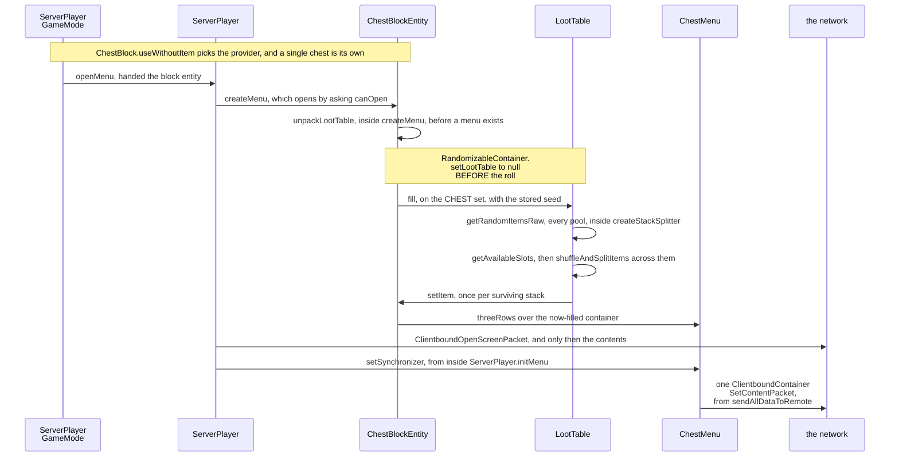
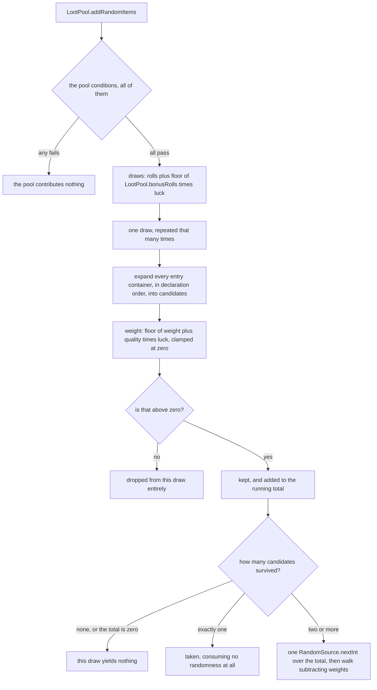

# Loot tables

> Verified against **Minecraft 26.2** · Part VII · A player opens a dungeon chest for the first time, and every item in it comes into existence between the click and the screen.

You break into a mossy cobblestone room, there is a chest against the wall,
and you right-click it. Between that click and the inventory screen the server
does something it will do exactly once for this chest: it looks up a loot
table, rolls it, scatters the results across the empty slots, and throws the
recipe away. Until that moment the chest is **genuinely empty on disk** — the
region file holds a table key, a seed where the chest was given one, and no
items at all. And the roll is a
one-shot in the strictest sense: `RandomizableContainer.unpackLootTable` clears
the stored key *before* it rolls, and the thing that triggers it is not "a
player opens this chest" but "anything reads this container". A hopper
underneath taking one item, or a comparator behind the wall asking how full it
is, will commit the roll with **no player present, and therefore no luck, for
good**.

The typed parameters the table is handed, the predicates it tests and the sets
those belong to are not loot machinery — they are the general context engine
that enchantment effects, advancement triggers, `/execute if predicate` and
villager trade filters all run on, and
[contexts and
predicates](contexts-and-predicates.md#a-set-is-a-contract-and-the-caller-signs-it)
is where they are explained. Loot is that engine's oldest and largest client,
and one consequence of borrowing an engine is worth knowing before you start:
a table's own declared *type* is read once at load, by the validator, and
never compared against the parameters it is actually handed. Whether a chest
table works is entirely down to what the caller put in the map. This page is
the worked example: what a table *is*, how one draw picks an item, and why the
chest was empty.

## The cast

| class | what it decides | thread |
|---|---|---|
| `LootTable` | the parameter set, an optional random sequence, the pools, the table's own functions, and the ways out — `LootTable.fill` into a container, `LootTable.getRandomItems` into a list, and the unsplit `LootTable.getRandomItemsRaw` a nested table uses | server main |
| `LootPool` | whether the pool runs at all, and how many draws it makes | server main |
| `LootPoolEntryContainer` | the entry algebra — `ComposableEntryContainer.expand` answers *did I contribute* | server main |
| `LootPoolSingletonContainer` | weight and quality — one of the two places luck reaches anything | server main |
| `LootItemFunction` | forty-three registered kinds, forty-two of them stack-to-stack transforms, composed into one per level | server main |
| `RandomizableContainer` | the stored table key and seed, and the one-shot unpack | server main |
| `LootContext` | which random source this draw uses, and the recursion guard | server main |
| `ReloadableServerRegistries` | loading the three loot registries and validating them | the background executor |

## The chest was empty before you got there

Nothing wrote items into that chest at world generation. `MonsterRoomFeature`
places the room, then places up to two chests, giving each up to three tries
at a position — every try needing an air block with exactly one solid
horizontal neighbour — and for each chest that lands calls
`RandomizableContainer.setBlockEntityLootTable` with
`BuiltInLootTables.SIMPLE_DUNGEON` and a fresh long from the feature's own
random. What lands on the live `ChestBlockEntity` is a **key and a seed**, and
nothing else. Structure pieces do the same through `StructurePiece.createChest`
and `StructurePiece.createDispenser`. `BuiltInLootTables` holds a hundred and
seventeen named keys and two per-dye-colour families for sheep — one under
*entities* and one under *shearing* — spread over thirteen directories that
are worth a glance for the range of things that roll a table at all: not only
chests and dispensers but brushing, shearing, harvesting, carving, decorated
pots, mob equipment, spawners and a charged creeper's.

The seed reaches disk on the next save, and from then on the emptiness is
self-perpetuating. `RandomizableContainer.trySaveLootTable` writes the key —
and the seed only when it is non-zero — and answers *yes, I handled this*, so
`ChestBlockEntity.saveAdditional` never writes an item list.
`RandomizableContainer.tryLoadLootTable` answers the same way on the way back
in, and `ChestBlockEntity.loadAdditional` **skips reading items entirely**. A
chest nobody has touched has no inventory in any file the game has ever
written.

## What counts as reading it

The opening said *anything reads this container*, and the rule is exactly that
literal. `RandomizableContainerBlockEntity` overrides five of the container
methods so that each unpacks before answering:
`RandomizableContainerBlockEntity.isEmpty`,
`RandomizableContainerBlockEntity.getItem`,
`RandomizableContainerBlockEntity.removeItem`,
`RandomizableContainerBlockEntity.removeItemNoUpdate` and — the surprising one
— `RandomizableContainerBlockEntity.setItem`. Writing into an unrolled chest
rolls it first, so that the write is not overwritten by the roll a moment
later.

Every way a player loses a dungeon chest's luck goes through one of those
five, and every one of them unpacks with a **null** player, so the roll gets
no `Attributes.LUCK` at all:

- A **comparator** reaches `Container.getItem` over every slot through
  `AbstractContainerMenu.getRedstoneSignalFromContainer` ([what a comparator
  can see](../blocks/diodes-and-observers.md#what-each-one-can-see)).
- A **hopper underneath** asks the same question before it takes anything —
  and so does a hopper pointing *into* the chest, which checks whether the
  destination is full before it pushes. Both directions commit the roll by
  reading.
- **Breaking the block** does it too, and this is the one players do not
  expect: `BlockEntity.preRemoveSideEffects` drops a container's contents by
  walking `Container.getItem` over every slot, so mining an untouched dungeon
  chest rolls it and scatters the result on the ground, luckless.

What does *not* unpack is as precise. `Clearable.clearContent` and
`Container.getContainerSize` do not, and neither does saving — which is why
`/data get block` on an unopened chest reports the loot table key instead of
committing the roll, and why a structure that has never been visited costs
nothing to keep.

## From the click to the screen

Right-clicking a dungeon chest is one call that does four things in an order
worth watching: it resolves a provider, commits the roll, builds a menu, and
only then tells the client anything.

*Figure: the roll is three messages deep inside
`RandomizableContainerBlockEntity.createMenu`, and the screen
is the last two arrows. Look at where the chest is filled relative to where
the client is told anything — the contents exist before the screen is asked
for.*

**The click** arrives as `ServerPlayerGameMode.useItemOn` and reaches
`ChestBlock.useWithoutItem`
([block interaction](../blocks/block-interaction.md#block-then-empty-hand-then-item)), which asks
`ChestBlock.getMenuProvider` for something to open. A single chest *is* its own
provider — the combiner hands back the `ChestBlockEntity`. A double chest is the
interesting case: it gets an anonymous provider wrapped round a
`CompoundContainer` that requires **both** halves to pass
`RandomizableContainerBlockEntity.canOpen`, unpacks **both** loot tables
itself, and never enters either block entity's own menu factory.

**Opening** goes through `ServerPlayer.openMenu`, which closes whatever menu was
already open, allocates a container id, and calls
`RandomizableContainerBlockEntity.createMenu`. Both gates on opening are in one
predicate: `RandomizableContainerBlockEntity.canOpen` adds a spectator clause to
the lock check it inherits from `BaseContainerBlockEntity.canOpen`, and the
spectator half bites only *while a table is still pending* — so a spectator
cannot commit the roll by peering into an unopened chest, though they can open
one that has already been rolled.

**The unpack** is `RandomizableContainer.unpackLootTable`, and its order matters
more than anything else on this page. It looks the key up through
`ReloadableServerRegistries.Holder.getLootTable` — which answers
`LootTable.EMPTY` for a missing key, never null — fires
`CriteriaTriggers.GENERATE_LOOT` if a `ServerPlayer` is doing the opening, and
**then clears the stored key** with `RandomizableContainer.setLootTable`,
before a single die is rolled. It builds the
parameters with `LootContextParams.ORIGIN` at the block centre and, *only if a
player is present*, that player's `Player.getLuck` — the live value of
`Attributes.LUCK`, whose default is zero and which nothing but a potion or a
command moves ([attributes](../../reference/attributes.md)) — and
`LootContextParams.THIS_ENTITY`. Then it calls `LootTable.fill` with the
container, those parameters and the stored seed.

**The screen** comes last and is no part of the roll. The menu itself is a
`ChestMenu`, built by `ChestMenu.threeRows` over the container the roll has
just filled. `ServerPlayer.openMenu`
sends `ClientboundOpenScreenPacket` and then calls `ServerPlayer.initMenu`,
which attaches the listener and the synchronizer;
`AbstractContainerMenu.setSynchronizer` ends in
`AbstractContainerMenu.sendAllDataToRemote`, and that is the single
`ClientboundContainerSetContentPacket` carrying the freshly rolled contents
([containers and
menus](containers-and-menus.md#the-chest-you-see-is-not-the-chest)).

## One roll, drawn

`LootTable.fill` runs every pool of the table, each pool makes some number of
independent draws, and each draw picks at most one entry. That draw is the
engine's smallest complete unit, and it narrows the whole way down — from
however many entries a pool declares, through the expansion where composites
become candidates, to at most one stack.

*Figure: one draw, narrowing. The two diamonds are the whole of the chance in
it — and note the middle arm out of the last one, where a pool with a single
surviving candidate rolls no dice at all.*

The one box that hides a fan-out is *expand*, and what it expands are the five
containers:

| the container | what expanding it yields |
|---|---|
| `AlternativesEntry` | an **or**: stops at the first child that contributes |
| `SequentialEntry` | an **and**: stops at the first child that does not |
| `EntryGroup` | every child expands, and the contribution is ignored |
| `TagEntry` in expand mode | one candidate per item in the tag |
| `NestedLootTable` | one candidate that will run another whole table |

What becomes of the stack that survives — the three tiers of functions, the
splitter, the shuffle and the write — is the trace above and *the scatter*
below; it is a straight line and needs no second picture.

**The algebra is boolean, not weighted.** `ComposableEntryContainer.expand`
returns a plain *did I contribute*, and each composite folds its children into
one of those in its own `CompositeEntryBase.compose` — the two-child case
literally calling `ComposableEntryContainer.or` or
`ComposableEntryContainer.and`, and the longer cases a hand-written loop with
the same short-circuit. So `AlternativesEntry` behaves like a boolean or and
`SequentialEntry` like a boolean and — neither is a weighted choice between
branches, and the validator reports an `AlternativesEntry` whose non-final
children carry no conditions, because every later alternative is then
unreachable. Nine entry types are registered in `LootPoolEntries` — one more registry of
kinds in a page made of them ([data-driven
types](../foundations/data-driven-types.md#the-idea-stated-once)) — and the
thing each one produces is a `LootPoolEntry`, the candidate the funnel above
weighs. They are the leaves
`LootItem`, `EmptyLootItem`, `TagEntry`, `NestedLootTable`, `DynamicLoot` and
`SlotLoot`, and the composites `AlternativesEntry`, `SequentialEntry` and
`EntryGroup`. `TagEntry` has two modes and they are not variations on a theme:
expanded, it becomes one weighted candidate *per item in the tag* — and those
candidates are built bare, so the entry's own functions never run on them;
unexpanded, it is a single candidate that emits **every** item in the tag at
once, with its functions intact.

**Luck touches exactly two things**, and neither is what players think it is.
`LootPool.bonusRolls` is multiplied by luck and floored to add whole extra
draws, and `LootPoolSingletonContainer.EntryBase.getWeight` is
*weight + quality × luck*, floored, then clamped at zero. Because a candidate
whose weight comes out at zero or below is discarded rather than merely made
rare, a **negative quality with enough luck removes an entry from the pool
altogether**. Everything a player calls luck on a drop is something
else: a loot function or condition reading an enchantment level off the tool
or off the killer, which is why Fortune and Looting have [no effect component
between them](enchantments.md#the-three-famous-ones-that-have-no-effect-component).

**Functions apply innermost first.** Nothing on this path *returns* a stack:
a draw is handed a consumer to push its results into, and each level wraps
that consumer before passing it down, with `LootItemFunction.decorate` over
its own `LootItemFunctions.compose`. So as the call stack unwinds a drop
passes the entry's functions, then the pool's, then the table's. Forty-two of the forty-three registered functions extend
`LootItemConditionalFunction`, whose `LootItemConditionalFunction.apply` is
final and hands the stack back
untouched when its own conditions fail — the forty-third being
`SequenceFunction`, which is a list of functions rather than a transform and
so has no conditions of its own — which is why a function with a failing
condition is a no-op and not a veto on the drop. They also **mutate the stack in
place and return it**, which is safe because every leaf hands out something of
its own: `LootItem` and `TagEntry` construct fresh stacks and `SlotLoot` emits
copies. `DynamicLoot` is the exception: it calls straight out to
a callback the caller registered with `LootParams.Builder.withDynamicDrop`, and
the one `ShulkerBoxBlock.getDrops` registers hands back the block entity's live
stacks uncopied.

## The scatter

`LootTable.fill` does not simply place what it rolled.
`LootTable.getAvailableSlots` collects the container's empty slot numbers and
shuffles them; `LootTable.shuffleAndSplitItems` then pulls the multi-count
stacks out of the result list and repeatedly splits one — taking a random amount
between one and half its count — until the number of pieces roughly matches the
slot count. That is why one rolled stack of arrows arrives as several partial
ones in unrelated slots — how many depends on how much of the chest is free. If the pieces outnumber the free slots, the remainder
is **logged as a warning and silently discarded**.

Above that sits `LootTable.createStackSplitter`, which every public
`LootTable.getRandomItems` and `LootTable.fill` wraps its output in: it drops
items the level's feature flags disable, and cuts anything at or over its
maximum stack size into stack-sized pieces. `NestedLootTable` deliberately calls
`LootTable.getRandomItemsRaw` instead, so a nested table's results are split
once by the outer table rather than twice. Nesting the *same* table twice is
fine, from two pools or two rolls of one: the recursion guard is a stack that
pops on the way out rather than a ledger of everything seen ([contexts and
predicates](contexts-and-predicates.md#inputs-then-one-invocation)), so only a
table genuinely inside itself trips it.

## Where the randomness comes from

A `LootContext` picks its random source by trying three things in order — an
explicitly supplied source or seed, then the level's saved sequence for a
named random sequence, then the plain `Level.getRandom` ([contexts and
predicates](contexts-and-predicates.md#inputs-then-one-invocation) owns the
mechanism). For a chest the load-bearing part is the condition on the first of
the three: a seed is installed **only when it is non-zero**. `LootTable.RANDOMIZE_SEED` names that zero, and
nothing in the game reads the constant.

So a seed of zero means *unseeded*, is indistinguishable from having no seed at
all, and is never written to NBT — which is why a chest given a loot table by
command rolls unpredictably where a structure chest, carrying a seed, rolls the
same contents whoever opens it and whenever. Neither rolls twice: the key is
gone after the first unpack either way. A table that declares a named
random sequence draws from a stored, saved one instead of the level random,
which is what keeps the same table in the same world reproducible across a
restart even when no chest ever carried a seed.

### And which thread does the rolling

One, everywhere. Loading is the only part of any of this that is not on the
server thread — one task per `LootDataType` on the background executor, with
the layer frozen before anything is validated ([the resource
system](../foundations/resource-system.md#reload-the-same-pipeline-on-the-server)).
Rolling is server main without exception, and the guarantee is a type rather
than a thread check: a `LootParams` demands a `ServerLevel` to be built at all
([contexts and
predicates](contexts-and-predicates.md#inputs-then-one-invocation)). The
strongest form of it is a fact about the whole tree: **no client class
references the loot package at all.**

## A loot table that travels inside an item

Everything above is a table anchored to a position. One kind is not.
`DataComponents.CONTAINER_LOOT` carries a `SeededContainerLoot` — a key and a
seed living in a stack's component patch — put there by `SetContainerLootTable`,
the loot function that writes a table key into a container instead of
contents, as against `SetContainerContents`, which writes the stacks
themselves. So a shulker box can come out of a chest already owing a roll, and
carry that debt around in your inventory.

The component is persistent with no network codec of its own, which under the
rule on [data
components](../foundations/data-components.md#the-key-datacomponenttype) means
one is derived for it, so it **does** reach the client. What it cannot carry
is the contents: the client has no loot registry at all, and
`SeededContainerLoot.addToTooltip` does not try — it prints the
unknown-contents line and nothing else, on either side. That tooltip is the
only place in the game where a player is shown, in so many words, that the
items do not exist yet.

## Where to look

`RandomizableContainer.unpackLootTable` is twenty lines and holds the whole of
why the chest was empty, including the order of the clear and the roll. Read
`RandomizableContainerBlockEntity` straight after it for the five overrides
that decide what counts as reading.

Then the roll, outside in: `LootTable.fill`, `LootPool.addRandomItems`, and
`LootPoolSingletonContainer.EntryBase.getWeight` for the two lines where luck
touches anything. `ComposableEntryContainer` is the boolean algebra, and
`AlternativesEntry` beside `TagEntry` is the shortest way to see that a
composite and a leaf are the same interface.

`LootItemConditionalFunction` is forty-two of the forty-three functions, and
its final `LootItemConditionalFunction.apply` is why a failing condition is a no-op rather than a veto.
`LootTable.createStackSplitter` and `LootTable.shuffleAndSplitItems` are the
scatter.

Four callers on the other side of the door are worth opening to see the range
of what rolls a table: `BlockBehaviour.BlockStateBase.getDrops` for every
block broken ([block breaking](../blocks/block-breaking.md#remove-damage-roll-drop)),
`LivingEntity.dropFromLootTable` for every mob killed ([damage and
death](../entities/damage-and-death.md#death-or-not)), `EnchantWithLevelsFunction`
for the loot side of [enchanting](enchanting.md#the-paths-that-never-show-a-player-anything),
and `EquipmentUser.equip`, the one caller that compares the looked-up table
against `LootTable.EMPTY` **by identity** to decide whether to bother. The
[Contexts and
predicates](contexts-and-predicates.md#who-asks-and-with-which-set) has the
twenty-six sets they build against, and the count of how few involve loot.

---

*Rules: names, never code · how the system works, not how the code reads ·
newest version only · every backticked name passes `tools/verify_names.py`.*
