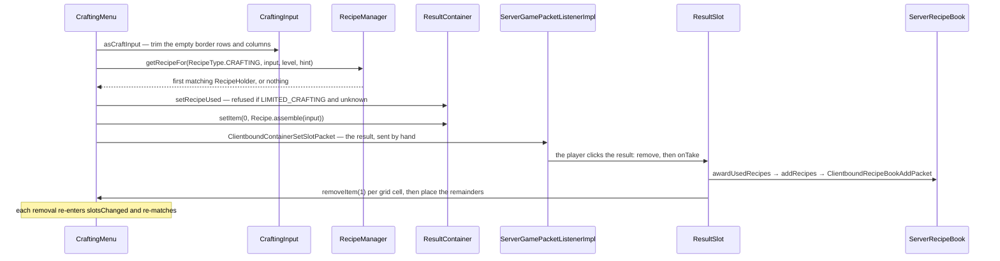

# Recipes

> Verified against **Minecraft 26.2** · Part VII · Eight planks go into a crafting grid around an empty centre and a chest comes out: the server matches, assembles and pushes the result slot by hand — and the client is never told which recipe it was.

## Responsibility

A recipe turns a shaped or shapeless arrangement of items into another
item. The system's job is to load those definitions from a data pack,
index them so a grid change can be matched twenty times a second, decide
authoritatively what a player may craft, and give the client just enough
to *draw* a recipe book without ever telling it what the recipes are.

The one sentence a player recognises: *the crafting grid, and the book
that fills it in for you.*

The headline: **no `Recipe` ever crosses the wire.** Every serializer has
a stream codec and no game packet uses one. What crosses is a set of
"which items may go in this slot" predicates and, for the book, a list of
*displays* — which do carry the recipe's whole contents, but never its
identity.

## The data it owns

- **`Recipe`** — the interface, ten methods: `Recipe.matches`,
  `Recipe.assemble`, `Recipe.isSpecial`, `Recipe.showNotification`,
  `Recipe.group`, `Recipe.getSerializer`, `Recipe.getType`,
  `Recipe.placementInfo`, `Recipe.display`, `Recipe.recipeBookCategory`.
  Note what is *not* there: no result getter. The result exists only
  inside the implementation and leaves either through `Recipe.assemble`
  or, for the book, through `Recipe.display`. For every recipe except the
  hand-written ones, `Recipe.assemble` ignores its input entirely and
  materialises a stored `ItemStackTemplate`.
- **`Recipe.CommonInfo` and `Recipe.BookInfo`** — the shared codec
  fragments every data-driven recipe is built from: the notification flag
  in the first, the group and book category in the second, with
  `CraftingRecipe.CraftingBookInfo` and
  `AbstractCookingRecipe.CookingBookInfo` as the concrete carriers.
- **`NormalCraftingRecipe`** — the base of every non-special crafting
  recipe. It finalises the group, the category and the notification flag,
  and memoises `Recipe.placementInfo` behind an abstract builder.
- **`RecipeType`** — seven constants (`RecipeType.CRAFTING`,
  `RecipeType.SMELTING`, `RecipeType.BLASTING`, `RecipeType.SMOKING`,
  `RecipeType.CAMPFIRE_COOKING`, `RecipeType.STONECUTTING`,
  `RecipeType.SMITHING`) and a `RecipeType.register` that puts each one
  into `BuiltInRegistries.RECIPE_TYPE`. It carries no behaviour; it is a
  map key.
- **`RecipeSerializer`** — a **record** of a `MapCodec` and a
  `StreamCodec`, and that is the whole thing. `Recipe.CODEC` dispatches
  on the JSON *type* field through `BuiltInRegistries.RECIPE_SERIALIZER`;
  `RecipeSerializers` registers twenty-one of them.
- **`RecipeHolder`** — a record of a `ResourceKey` and the recipe.
  `Registries.RECIPE` exists as a registry *key* so ids can be interned
  keys rather than plain identifiers; there is no built-in recipe
  registry.
- **`RecipeManager`** — the server-side loader and index, a
  `SimplePreparableReloadListener` over a `RecipeMap`
  ([the resource system](../foundations/resource-system.md)). It is the
  server's `RecipeAccess`.
- **`ClientRecipeContainer`** — the client's `RecipeAccess`, and the
  answer to "what does the client know": seven `RecipePropertySet`s and
  the stonecutter's input set, rebuilt wholesale from every
  `ClientboundUpdateRecipesPacket`. No recipes, no ids.
- **`RecipeMap`** — the immutable store, and it holds exactly two
  indexes: `RecipeMap.byType` (a multimap) and `RecipeMap.byKey`.
- **`RecipeInput`** — what a recipe is matched against, in three shapes:
  `CraftingInput`, `SingleRecipeInput` (furnaces, stonecutters) and
  `SmithingRecipeInput`, whose three named accessors the smithing recipes
  read directly.
- **`Ingredient`** — a `HolderSet` of items with a predicate face.
  `Ingredient.CODEC` rejects an empty *literal* list and the constructor
  rejects air in one — but a tag that resolves to nothing yields a
  legally empty ingredient, which is why `Ingredient.isEmpty` exists and
  why `PlacementInfo` bails when it sees one.
- **`PlacementInfo`** — the auto-fill plan: an ordered ingredient list
  plus a slot-to-ingredient-index map, with `PlacementInfo.NOT_PLACEABLE`
  for the recipes that have none. It is computed lazily and memoised, and
  in practice the first caller is the load itself.
- **`RecipePropertySet`** — a flat set of items that may go in one slot.
  Seven exist — `RecipePropertySet.SMITHING_BASE`,
  `RecipePropertySet.SMITHING_TEMPLATE`,
  `RecipePropertySet.SMITHING_ADDITION`,
  `RecipePropertySet.FURNACE_INPUT`,
  `RecipePropertySet.BLAST_FURNACE_INPUT`,
  `RecipePropertySet.SMOKER_INPUT`, `RecipePropertySet.CAMPFIRE_INPUT` —
  and `RecipePropertySet.test` is **item identity only**: the client's
  slot predicate ignores components entirely.
- **`RecipeDisplay`** and **`SlotDisplay`** — the presentation model. A
  `SlotDisplay` is what to draw in one slot; the variants include
  `SlotDisplay.Empty`, `SlotDisplay.ItemSlotDisplay`,
  `SlotDisplay.ItemStackSlotDisplay`, `SlotDisplay.TagSlotDisplay`,
  `SlotDisplay.Composite`, `SlotDisplay.WithRemainder`,
  `SlotDisplay.WithAnyPotion` and `SlotDisplay.AnyFuel`, and
  `SlotDisplay.resolve` against a `SlotDisplayContext` is how one becomes
  concrete stacks to draw. There are five `RecipeDisplay`s, one per
  station shape: `ShapedCraftingRecipeDisplay`,
  `ShapelessCraftingRecipeDisplay`, `FurnaceRecipeDisplay`,
  `StonecutterRecipeDisplay`, `SmithingRecipeDisplay`.
- **`RecipeDisplayId`** — a record wrapping a single int. It is an
  **index into a list**, not an identifier.
- **`ServerRecipeBook`** and `ClientRecipeBook` — the per-player unlocked
  set, and the client's grouped view of it. `RecipeBookMenu` is the seam
  that lets both a crafting table and a furnace be auto-filled, with
  `RecipeBookMenu.PostPlaceAction` deciding between a real fill and a
  ghost.

### The derived indexes

`RecipeManager.finalizeRecipeLoading` builds four things on top of
`RecipeMap`: the seven `RecipePropertySet`s, the stonecutter's
`SelectableRecipe.SingleInputSet`, a flat list of every display — whose
position in that list *is* the `RecipeDisplayId` — and a map from recipe
key to its displays. Entries are filtered by feature flags on the way in:
a display is added only if both its result and its crafting station are
enabled.

### It is not only shaped and shapeless

Of the fourteen crafting serializers, eight are the special
`CustomRecipe`s. The other data-driven non-shaped ones are `DyeRecipe`,
`ImbueRecipe`, `TransmuteRecipe` and `DecoratedPotRecipe` — real
`NormalCraftingRecipe`s with hand-written matching and hand-built
placement info, and the users of the exotic `SlotDisplay` variants. So
"special recipes are the only ones that are not shaped or shapeless" is
not true, and it matters, because special recipes are the ones the book
cannot show.

## When it runs

**A background executor thread** for `RecipeManager.prepare`, which scans
*data/&lt;ns&gt;/recipe/* through the same JSON machinery every other
reload listener uses and accumulates into a sorted map.
**Server main thread** for `RecipeManager.apply`, which swaps the field
and does nothing else, and for everything downstream: matching,
assembling, awarding.

**The indexes are rebuilt in a separate step.**
`RecipeManager.finalizeRecipeLoading` is not called by `RecipeManager.apply`;
`MinecraftServer` calls it afterwards, at construction and again from
`MinecraftServer.reloadResources`. Between the two the four derived
indexes still describe the previous recipe set.

**Every grid change** re-matches. `TransientCraftingContainer.setItem`
calls `AbstractContainerMenu.slotsChanged`. `CraftingMenu.slotsChanged`
routes that through `ContainerLevelAccess.execute`;
`InventoryMenu.slotsChanged` calls the same static directly, gated only
on having a `ServerLevel`. Both end in
`CraftingMenu.slotChangedCraftingGrid`. A `CraftingMenu` built with the
single-argument constructor holds `ContainerLevelAccess.NULL`, so for
that instance the callback never runs at all — which is the client's
copy.

Three accelerations sit on top of what is otherwise a linear scan:
a hint parameter (test this recipe first), `RecipeManager.CachedCheck`
(remember the last successful key — used by `AbstractFurnaceBlockEntity`
and `CampfireBlockEntity`), and `RecipeCache`, a small LRU keyed on grid
contents that `CrafterBlock` holds statically and that caches *misses*
as well as hits.

## The trace: crafting

1. **The grid changes.** A click writes into the menu's
   `TransientCraftingContainer`, which calls
   `AbstractContainerMenu.slotsChanged`.
2. **Trimming.** `CraftingContainer.asCraftInput` builds a
   `CraftingInput` that has trimmed the empty border rows and columns and
   remembers the offset — which is why a shaped recipe works anywhere in
   the grid. Its constructor also builds a `StackedItemContents`, but
   with every stack counted as **one**: that index is a presence set for
   shapeless matching, not the count the auto-fill arithmetic uses.
3. **Matching.** `RecipeManager.getRecipeFor` streams the type bucket,
   filters on `Recipe.matches`, and takes the first — after a fast exit
   when the input is empty. Deterministic, because the load accumulated
   into a sorted map. `ShapedRecipePattern.matches` compares the
   ingredient count first, then requires exact trimmed dimensions, then
   tries the mirrored layout before the straight one unless the pattern
   is symmetrical; `ShapelessRecipe.matches` rejects on count and then
   hands off to a bipartite matching search in
   `StackedContents.RecipePicker`.
4. **The gate.** `RecipeCraftingHolder.setRecipeUsed` returns false — and
   the result stays empty — when `GameRules.LIMITED_CRAFTING` is on, the
   recipe is not special, and `ServerRecipeBook` has not unlocked it.
   The limited-crafting rule is enforced in the result slot, not in
   matching.
5. **Assembling.** `Recipe.assemble` produces the stack;
   `ItemStack.isItemEnabled` filters it against the level's feature
   flags; `ResultContainer.setItem` stores it.
6. **Pushing it.** `AbstractContainerMenu.setRemoteSlot` forces the
   server's belief and then a `ClientboundContainerSetSlotPacket` is sent
   **by hand**, outside the ordinary diffing of
   [containers and menus](containers-and-menus.md) — bumping the state id
   on the way, which is the one bump that does not come from the
   synchronizer. It fires even when the result is empty.
7. **Taking it.** The player clicks the result; `ResultSlot.remove`
   counts what was taken and `ResultSlot.onTake` runs.
8. **Awarding, first.** `ResultSlot.checkTakeAchievements` runs before
   anything is consumed. It calls `ItemStack.onCraftedBy` (the
   `Stats.ITEM_CRAFTED` counter and `Item.onCraftedBy`), then
   `RecipeCraftingHolder.awardUsedRecipes` fires
   `CriteriaTriggers.RECIPE_CRAFTED` for *every* recipe including special
   ones and, for a non-special recipe only, calls
   `ServerPlayer.awardRecipes` → `ServerRecipeBook.addRecipes`, which
   unlocks it, fires `CriteriaTriggers.RECIPE_UNLOCKED` and sends
   `ClientboundRecipeBookAddPacket` — and then clears the stored recipe.
9. **Consuming.** `ResultSlot.getRemainingItems` **re-runs the lookup**,
   because for a non-special recipe the stored holder was just nulled,
   and `CraftingRecipe.getRemainingItems` maps each slot through
   `Item.getCraftingRemainder`, which returns an `ItemStackTemplate`.
10. **The decrement.** One item is removed per occupied cell and the
    remainder placed: back into the emptied slot, merged if compatible,
    else into the inventory, else dropped. Every removal re-enters step 1
    and the result slot is recomputed.

## Interfaces

- **Called by:** `AbstractCraftingMenu` and `CraftingMenu` on every grid
  change; `AbstractFurnaceBlockEntity` and `CampfireBlockEntity` through
  `RecipeManager.CachedCheck`; `CrafterBlock` through `RecipeCache`;
  `SmithingMenu`; `StonecutterMenu`;
  `ServerGamePacketListenerImpl.handlePlaceRecipe` for the book.
- **Calls into:** `Ingredient`, `StackedItemContents` for craftability
  and auto-fill, `Inventory` for pulling items into the grid, and
  `ServerRecipeBook` for unlocks.
- **Crosses the network as:** `ClientboundUpdateRecipesPacket` (property
  sets and the stonecutter set, on join and after a reload),
  `ClientboundRecipeBookAddPacket` (the unlocked displays, whole set on
  join with a replace flag, incrementally afterwards),
  `ClientboundRecipeBookRemovePacket`,
  `ClientboundRecipeBookSettingsPacket`,
  `ClientboundPlaceGhostRecipePacket` (a whole `RecipeDisplay`), and
  `ClientboundContainerSetSlotPacket` for the result. Upward:
  `ServerboundPlaceRecipePacket`,
  `ServerboundRecipeBookSeenRecipePacket`,
  `ServerboundRecipeBookChangeSettingsPacket`.
- **Data-driven by:** JSON under *data/&lt;ns&gt;/recipe/* (note the
  singular directory), dispatched by `RecipeSerializer`; the effect
  registries `Registries.RECIPE_DISPLAY`, `Registries.SLOT_DISPLAY` and
  `Registries.RECIPE_BOOK_CATEGORY`, the last of which
  `RecipeBookCategories` populates.

### What the client actually gets

`ClientboundUpdateRecipesPacket` carries the `RecipePropertySet`s and the
stonecutter's `SelectableRecipe.SingleInputSet` — the latter serialised
with a codec that writes **only the `SlotDisplay`**; nothing of the
recipe is written at all, and the decoder substitutes an empty optional.
The property sets exist so that `SmithingMenu` and `AbstractFurnaceMenu`
can answer "may this item go in this slot" and route a shift-click
without knowing any recipe; `StonecutterMenu` uses the stonecutter input
set for the same purpose. The recipe book gets `RecipeDisplayEntry`s: an
id, a display, a group index, a category, and an optional ingredient list
used only to decide whether the entry lights up as craftable.

So the client is denied three things, not one: the recipe's *identity*,
the recipes the player has not unlocked, and any authority. For a recipe
it has unlocked, it holds the entire contents — pattern, dimensions,
ingredients, result.

### The recipe book

`ServerRecipeBook` stores three things — the settings, an identity set of
known recipe keys, and the "new and glowing" subset — saved in the player
NBT as `ServerRecipeBook.Packed` and validated key-by-key against the
live `RecipeManager` on load, with unknown keys logged and dropped.
`ClientRecipeBook` groups the displays by category and by group index,
which is why one book button cycles through several kinds of plank.
`RecipeBookType` has only four values — crafting, furnace, blast furnace
and smoker — so the stonecutter and smithing table have no book of their
own.

Craftability is decided on the client and re-decided on the server.
`RecipeCollection.selectRecipes` asks `RecipeDisplayEntry.canCraft`
against a `StackedItemContents` built from the player's inventory, purely
to decide which entries glow; a lying client gains nothing, because
`ServerPlaceRecipe` re-checks and `CraftingMenu.slotChangedCraftingGrid`
runs a full `Recipe.matches` afterwards regardless.

Auto-fill runs entirely on the server. A book click sends
`ServerboundPlaceRecipePacket` with a `RecipeDisplayId`, and
`ServerGamePacketListenerImpl.handlePlaceRecipe` applies seven gates: not
a spectator, matching container id, `AbstractContainerMenu.stillValid`,
the display id resolves, the recipe is in the player's book, the menu is
a `RecipeBookMenu`, and the placement info is possible. Then it sets a
flag that suppresses re-matching while it shuffles — a `CraftingMenu`
override, so the 2×2 grid in `InventoryMenu` re-matches on every write —
and runs `ServerPlaceRecipe.placeRecipe`, which **counts first**: a dry
run of clearing the grid, then a tally of the available items, then how
many the player can make, and only then does it clear the grid for real
and lay the items out with `PlaceRecipeHelper.placeRecipe`. Whether it
may drop items to clear the grid is the player's creative flag, so for a
survival player a full inventory means no fill *and* no ghost. If the
items are not there it returns the ghost outcome and the server sends
`ClientboundPlaceGhostRecipePacket` carrying the display itself.

## Invariants and surprises

- **The client never receives a recipe.** The stream codecs exist on
  every serializer and no game packet uses them; the only reference to
  `Recipe.STREAM_CODEC` in the tree is `RecipeHolder`'s, which has no
  call sites at all.
- **A `RecipeDisplayId` is a list index, deterministic per recipe set and
  unstable across any change to it.** Reload an unchanged pack and every
  id is identical; add one recipe and everything after it shifts. The
  server does not try to work out which — a reload re-sends the whole
  book with the replace flag set.
- **Shaped recipes match mirrored** unless the pattern is symmetrical,
  which is computed once in the constructor — and a one-column pattern is
  always symmetrical.
- **Matching is a linear scan whose order is alphabetical by recipe id —
  path first, then namespace.** That is `Identifier`'s own comparison
  order, so *foo:acacia_boat* sorts before *minecraft:zzz*, and the same
  order fixes the `RecipeDisplayId` numbering.
- **Special recipes are invisible to the book.** `CustomRecipe.isSpecial`
  is true and its placement info is not placeable, so it is never
  unlocked, never shown as craftable, and never auto-filled — though
  `CriteriaTriggers.RECIPE_CRAFTED` still fires for it.
- **`ResultSlot.onTake` re-runs the recipe lookup** rather than trusting
  the stored one, because the award step nulled it.
- **Auto-fill ignores damaged, enchanted and renamed items.**
  `Inventory.isUsableForCrafting` is the filter, applied by
  `StackedItemContents.accountSimpleStack` — and `CraftingInput`'s
  constructor deliberately bypasses it by calling
  `StackedItemContents.accountStack` directly. So the book can say "not
  craftable" for a stack an ordinary manual craft would accept.
- **The result slot bypasses the menu's change diffing** entirely, with a
  forced remote slot and a hand-written packet.
- **`RecipeCache` invalidates on object identity**, holding a weak
  reference to the manager and wiping itself when the level hands back a
  different one — which works because a reload builds a new manager.
- **An unplaceable non-special recipe is logged and kept, not dropped.**
  It stays in `RecipeMap`, still matches a manual craft, and still gets a
  `RecipeDisplayEntry` — one whose ingredient list is empty, so the book
  lights it up as always craftable. Only the placement check in
  `ServerGamePacketListenerImpl.handlePlaceRecipe` stops the click.
- **`RecipeType.SMITHING` is one bucket** holding both the transform and
  the trim recipes, sharing a default match method on the interface.
- **The crafter has its own advancement trigger**,
  `CriteriaTriggers.CRAFTER_RECIPE_CRAFTED`, distinct from the player's.

## Where to look

`Recipe` · `RecipeType` · `RecipeSerializer` · `RecipeSerializers` ·
`RecipeHolder` · `RecipeManager` · `RecipeMap` · `RecipeAccess` ·
`ClientRecipeContainer` · `Ingredient` ·
`PlacementInfo` · `RecipePropertySet` · `RecipeInput` · `CraftingInput` ·
`ShapedRecipePattern` · `ShapelessRecipe` · `NormalCraftingRecipe` ·
`AbstractCookingRecipe` ·
`CustomRecipe` · `RecipeDisplay` · `SlotDisplay` · `RecipeDisplayId` ·
`AbstractCraftingMenu` · `CraftingMenu` · `RecipeBookMenu` · `ResultSlot` ·
`ResultContainer` · `RecipeCraftingHolder` · `ServerRecipeBook` ·
`ClientRecipeBook` · `ServerPlaceRecipe` · `StackedItemContents`

---

*Rules: names, never code · how the system works, not how the code reads ·
newest version only · every backticked name passes `tools/verify_names.py`.*
