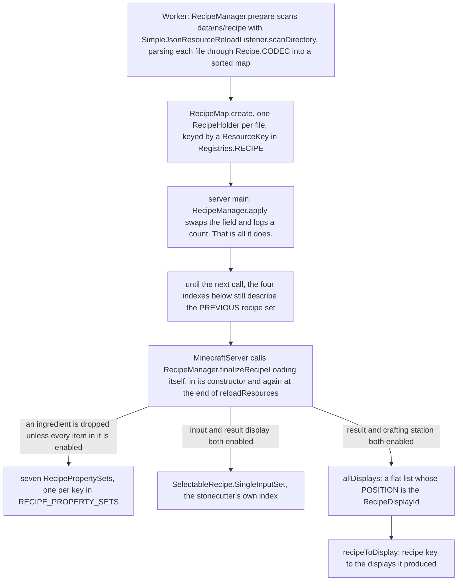
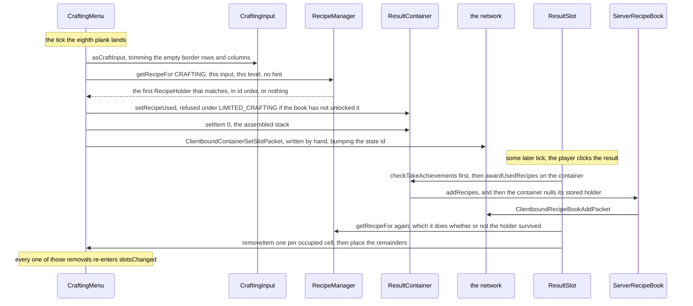

# Recipes

> Verified against **Minecraft 26.2** · Part VII · Eight planks go around the empty centre of a crafting table, a chest appears in the result slot, and the client is never told which recipe it was.

You lay eight planks around the empty middle square of a crafting table and a
chest appears in the slot on the right. What the server did was take a trimmed
copy of the grid, scan every crafting recipe it has loaded in alphabetical
order until one matched, call a `Recipe.assemble` that ignored your planks
entirely, and push the answer down the wire in a packet written by hand,
outside the menu's ordinary bookkeeping. What it never did was tell you *which*
recipe matched — and it could not have, because **no `Recipe` ever crosses the
wire**. Every `RecipeSerializer` is a record of a `MapCodec` and a
`StreamCodec`, and no game packet uses the stream half: the only reference to
`Recipe.STREAM_CODEC` anywhere in the tree is inside `RecipeHolder.STREAM_CODEC`,
which has no call sites at all. For the recipes it has unlocked the client
holds the whole *contents* — pattern, dimensions, ingredients, result — as a
`RecipeDisplay`. What it is denied is the **identity**, plus every recipe it has
not unlocked, plus any authority over the outcome.

## The cast

| class | what it decides | thread |
|---|---|---|
| `Recipe` | ten methods and no result getter — a result leaves through `Recipe.assemble`, `Recipe.display`, or a stonecutter's `StonecutterRecipe.resultDisplay` | data, and a `Recipe` object never leaves the server |
| `RecipeManager` | the loaded set, four indexes derived from it, and the server's `RecipeAccess` | the background executor for the scan, server main for everything after |
| `RecipeMap` | the immutable store, holding exactly two indexes: `RecipeMap.byType` and `RecipeMap.byKey` | built off-thread, swapped in and read on server main |
| `Ingredient` | whether one stack satisfies one slot — a `HolderSet` of items wearing a predicate face | both sides |
| `CraftingInput` | the trimmed grid a crafting recipe is matched against, and the presence index a shapeless one is matched with | server main |
| `ResultSlot` | the order of the endgame: award first, then look the recipe up again, then decrement | server main, mirrored on the client's own menu |
| `ServerRecipeBook` | which recipes this player has unlocked, and which of them still glow | server main |
| `ClientRecipeContainer` | everything the client knows about recipes *as recipes*: seven `RecipePropertySet`s and the stonecutter's input set | client, rebuilt wholesale from each packet |

## Loading: one scan, one swap, and four indexes built later

`RecipeManager` is a `SimplePreparableReloadListener` over a `RecipeMap`, so it
takes the ordinary two-phase shape of
[the resource system](../foundations/resource-system.md) — and then does
something unusual with the second phase.

Three things in that picture are worth saying out loud.

**The scan is sorted, and the sort is the whole ordering story.**
`RecipeManager.prepare` accumulates into a sorted map keyed by `Identifier`,
and `Identifier.compareTo` compares the *path* first and the namespace only to
break a tie. So *foo:acacia_boat* sorts ahead of *minecraft:zzz*, matching is
deterministic across restarts, and the same order fixes the numbering of every
display id below.

**The indexes are not built by `RecipeManager.apply`.**
`RecipeManager.finalizeRecipeLoading` has exactly two call sites, both of them
in `MinecraftServer`, and neither is inside the reload listener. Between the
swap and that call the four derived indexes are **empty** — a reload builds a
fresh `RecipeManager`, whose constructor sets all four to their empty values —
so the recipe book, the property sets and the stonecutter index describe
nothing at all. Nothing can catch the game in that state: the swap and the
call are five statements apart in one lambda on the server thread.

**A `RecipeDisplayId` is a list index, not an identifier.** It is a record
wrapping a single int, and the int is the position the entry took in the flat
display list. Reload an unchanged pack and every id comes back identical; add
one recipe near the front and everything after it shifts. The server does not
try to work out which ids moved — `ServerRecipeBook.sendInitialRecipeBook`
re-sends the player's whole book with the replace flag set. Nor is the list one
entry per recipe: `Recipe.display` returns a *list*, and `TransmuteRecipe`
returns one display per legal material count — up to
`TransmuteRecipe.MAX_MATERIAL_COUNT`, eight — so a single recipe can occupy
eight consecutive ids.

The same walk decides what a recipe *is*, and it forgives more than you would
expect. A non-special recipe whose `PlacementInfo.isImpossibleToPlace` — the
usual cause being an ingredient tag that resolved to nothing, which
`Ingredient.CODEC` cannot reject because only a *literal* empty list is illegal
— is logged as unplaceable and then **kept**. It stays in `RecipeMap`, it still
matches a manual craft, and it still gets a `RecipeDisplayEntry`, one whose
ingredient list is present but empty; and `RecipeDisplayEntry.canCraft` on an
empty ingredient list is trivially *true*, so the book paints it as craftable
out of thin air. Only gate six of the auto-fill, below, stops the click.

### It is not only shaped and shapeless

`RecipeSerializers` registers twenty-one serializers and fourteen of them are
crafting-table recipes. **Nine** of those fourteen are `CustomRecipe`s — Java,
not data. `CustomRecipe` hard-codes `Recipe.isSpecial` true, `Recipe.group`
empty and `PlacementInfo.NOT_PLACEABLE`, and not one of the nine overrides
`Recipe.display`, so a special recipe contributes nothing to the display list in
the first place. Only eight of the nine are *named* special: `DecoratedPotRecipe`
registers as *crafting_decorated_pot* and is a `CustomRecipe` all the same. Of
the five that remain, `ShapedRecipe` and `ShapelessRecipe` are the pair everyone
knows, and `DyeRecipe`, `ImbueRecipe` and `TransmuteRecipe` are genuine
`NormalCraftingRecipe`s — data-driven, with hand-written matching, hand-built
placement info, and the exotic `SlotDisplay` variants to draw themselves with
(`SlotDisplay.OnlyWithComponent` and `SlotDisplay.DyedSlotDemo` for the first,
`SlotDisplay.WithAnyPotion` for the second). So *special* and *neither shaped nor
shapeless* are not the same set, and the difference matters, because it is
*special* that the book cannot show.

## Eight planks: the trace

**The grid changes.** Writing a plank into the menu's
`TransientCraftingContainer` calls `AbstractContainerMenu.slotsChanged`, and both
crafting overrides of it end in the same static,
`CraftingMenu.slotChangedCraftingGrid`. They reach it differently:
`CraftingMenu.slotsChanged` goes through `ContainerLevelAccess.execute`, while
`InventoryMenu.slotsChanged` calls the static directly, gated only on having a
`ServerLevel`. A `CraftingMenu` built with the two-argument constructor holds
`ContainerLevelAccess.NULL`, whose `ContainerLevelAccess.execute` runs nothing — and that instance is
the client's copy, which is why the client never matches anything.

**Trimming.** `CraftingContainer.asPositionedCraftInput` produces a
`CraftingInput` with the empty border rows and columns removed *and* the offset
beside it, which is why a shaped recipe works anywhere in the grid;
`CraftingContainer.asCraftInput` is the same call with the offset thrown away,
and it is what matching uses. Its constructor also fills a
`StackedItemContents`, but accounts every stack as **one** item: that index is a
presence set for shapeless matching, not the arithmetic the auto-fill does.

**Matching is a linear scan.** `RecipeMap.getRecipesFor` exits immediately on an
empty input, then streams the recipes of that `RecipeType` and filters them
through `Recipe.matches`, and `RecipeManager.getRecipeFor` takes the first.
`ShapedRecipePattern.matches` compares the ingredient count, then demands exactly
matching trimmed dimensions, then tries the **mirrored** layout before the
straight one — unless the pattern is symmetrical, which `Util.isSymmetrical`
settles once in the constructor. The chest's ring of planks is symmetrical, so
only the straight pass ever runs, and a one-column pattern is always symmetrical
too. `ShapelessRecipe.matches` rejects on count, short-circuits the single-slot
case, and otherwise hands the presence index to the bipartite search in
`StackedContents`, which it reaches through
`StackedItemContents.canCraft`.

Three accelerations sit on top of that scan, and each belongs to a different
caller. `RecipeManager.getRecipeFor` takes an optional **hint** and tests it
before scanning; the auto-fill supplies one through
`CraftingMenu.finishPlacingRecipe`, so the recipe it has just laid out is
the first thing re-matched — and the base
`AbstractCraftingMenu.finishPlacingRecipe` is a no-op, so the player's own
2×2 grid never gets one. `RecipeManager.CachedCheck` remembers the last
successful key and re-hints with it — `AbstractFurnaceBlockEntity` holds one per
block entity and `CampfireBlock` hands one to `CampfireBlockEntity.cookTick`. And
`RecipeCache`, ten entries held statically by `CrafterBlock` and keyed on the
grid contents, caches **misses** as well as hits, and invalidates on object
identity: it keeps a weak reference to the manager and wipes itself the moment
the level hands back a different one, which works because a reload builds a new
`RecipeManager`.

**The gate, and then the result.** `RecipeCraftingHolder.setRecipeUsed` returns
false — leaving the result slot empty — when `GameRules.LIMITED_CRAFTING` is on,
the recipe is not special, and `ServerRecipeBook.contains` says no. Limited
crafting is enforced *here*, in the result slot, not in matching. Past it,
`Recipe.assemble` produces the stack — for everything but the hand-written
recipes it ignores its input entirely and materialises a stored
`ItemStackTemplate` ([items and stacks](items-and-stacks.md)) —
`ItemStack.isItemEnabled` filters that against the level's feature flags, and
`ResultContainer.setItem` stores it.

**Pushing it.** `AbstractContainerMenu.setRemoteSlot` forces the server's belief
about slot zero and then a `ClientboundContainerSetSlotPacket` is sent by hand,
outside the diffing that [containers and menus](containers-and-menus.md)
describes, incrementing the state id on its own way past. It is sent even when
the result is empty.

**Taking it, in an order that surprises.** `ResultSlot.remove` counts what was
taken, and then `ResultSlot.onTake` runs `ResultSlot.checkTakeAchievements`
*before* anything is consumed. That calls `ItemStack.onCraftedBy`, which awards
`Stats.ITEM_CRAFTED` and runs `Item.onCraftedBy`, and then
`RecipeCraftingHolder.awardUsedRecipes`, which fires
`CriteriaTriggers.RECIPE_CRAFTED` for *every* recipe, special ones included, and
then — for a non-special recipe only — calls `ServerPlayer.awardRecipes` and so
`ServerRecipeBook.addRecipes`, unlocking it, firing
`CriteriaTriggers.RECIPE_UNLOCKED`, sending `ClientboundRecipeBookAddPacket`, and
**nulling the stored holder**. The next thing `ResultSlot.onTake` does is look
the recipe up all over again — not because of that null, but because
`ResultSlot.getRemainingItems` never consults the stored holder on any path,
special recipes included. `CraftingRecipe.getRemainingItems` — whose
default implementation is spelled `CraftingRecipe.defaultCraftingReminder`, the
typo Mojang's — maps each slot through `Item.getCraftingRemainder`, an
`ItemStackTemplate` or nothing. Then one item leaves each occupied cell and the
remainder goes back into the emptied slot, or merges with what is left there, or
goes to the inventory, or is dropped. Every one of those removals re-enters
`AbstractContainerMenu.slotsChanged`, so the result slot is recomputed eight
times on the way out.

A crafter block runs the same machinery through `RecipeCache` and fires its own
advancement trigger, `CriteriaTriggers.CRAFTER_RECIPE_CRAFTED`, not the player's.

## What the client actually gets

`ClientboundUpdateRecipesPacket` goes out twice: once from `PlayerList` as a
player joins, once to everybody from `PlayerList.reloadResources`. It carries two
things. The `RecipePropertySet`s are flat sets of items, and
`RecipePropertySet.test` is **item identity only** — the client's slot predicate
ignores components entirely. The stonecutter's
`SelectableRecipe.SingleInputSet` is written by
`SelectableRecipe.SingleInputEntry.noRecipeCodec`, which serialises the input
`Ingredient`'s contents and the option's `SlotDisplay` and drops the recipe on
the floor: `SelectableRecipe.noRecipeCodec` decodes an empty optional in its
place.

Those sets exist so that menus can answer *may this item go in this slot* — and
route a shift-click on the strength of it — without knowing a single recipe.
`SmithingMenu` builds its three input slots out of the three smithing sets,
`AbstractFurnaceMenu` holds whichever of `RecipePropertySet.FURNACE_INPUT`,
`RecipePropertySet.BLAST_FURNACE_INPUT` and `RecipePropertySet.SMOKER_INPUT`
its type was constructed with — the fourth set,
`RecipePropertySet.CAMPFIRE_INPUT`, reaches no menu at all and is read by
`CampfireBlock` on a right-click — and
`StonecutterMenu` asks the stonecutter set the same question through
`SelectableRecipe.SingleInputSet.acceptsInput`.

The book gets something far richer and still anonymous: a `RecipeDisplayEntry`
per display, carrying the display id, the `RecipeDisplay` itself, a group index,
a `RecipeBookCategory`, and an optional ingredient list used for one thing only —
deciding whether the entry lights up. `RecipeDisplay` and `SlotDisplay` are
dispatched registries of their own (`Registries.RECIPE_DISPLAY`,
`Registries.SLOT_DISPLAY`, and `Registries.RECIPE_BOOK_CATEGORY` for the
categories `RecipeBookCategories` fills), and *their* stream codecs are very much
used: five `RecipeDisplay` types, one per station shape, and eleven registered
`SlotDisplay` variants, which `SlotDisplay.resolve` turns into concrete stacks
against a `SlotDisplayContext`. The chest's single ingredient reaches the client
as a `SlotDisplay.TagSlotDisplay` over *minecraft:planks*
([tags](../foundations/tags.md)) — everything needed to draw the recipe, and
nothing at all about its name.

## The recipe book: unlocked, glowing, and filled in for you

`ServerRecipeBook` stores four things: a display resolver, the settings,
`ServerRecipeBook.known` —
an *identity* set of recipe keys — and `ServerRecipeBook.highlight`, the subset
still new enough to glow. It is saved in the player NBT as
`ServerRecipeBook.Packed` and read back by `ServerRecipeBook.loadUntrusted`,
which validates every key against the live `RecipeManager` and logs and drops the
ones that no longer resolve ([codecs](../foundations/codecs-nbt-json.md)).
`ClientRecipeBook` never sees any of that. It holds `RecipeDisplayEntry`s by
display id, and `ClientRecipeBook.rebuildCollections` groups them into
`RecipeCollection`s by category and then by group index, which is why one button
in the book cycles through all twelve kinds of plank.

The tabs are narrower than the recipe types. `RecipeBookType` has four values —
crafting, furnace, blast furnace and smoker — and exactly five menus extend
`RecipeBookMenu` to claim them, `CraftingMenu` and `InventoryMenu` both answering
`RecipeBookType.CRAFTING`. `StonecutterMenu` and `SmithingMenu` are not
`RecipeBookMenu`s at all, so the stonecutter and the smithing table have no book
and no auto-fill, even though `RecipeBookCategories.STONECUTTER` and
`RecipeBookCategories.SMITHING` exist to categorise them — and the anvil and the
grindstone were never recipes at all ([enchanting](enchanting.md)).

Craftability is decided on the client and then decided again on the server.
`RecipeCollection.selectRecipes` asks `RecipeDisplayEntry.canCraft` against a
`StackedItemContents` that `RecipeBookComponent` fills from the player's
inventory, purely to choose which entries glow. A lying client gains nothing by
it, because the placement re-checks and `CraftingMenu.slotChangedCraftingGrid`
runs a full `Recipe.matches` afterwards regardless.

Auto-fill itself runs entirely on the server. Clicking an entry sends
`ServerboundPlaceRecipePacket` carrying nothing but a container id, a
`RecipeDisplayId` and a shift flag, and
`ServerGamePacketListenerImpl.handlePlaceRecipe` puts it through seven gates:

1. the player is not a spectator, and the packet's container id is the open menu's;
2. `AbstractContainerMenu.stillValid` still holds for the open menu;
3. `RecipeManager.getRecipeFromDisplay` resolves the index to a `RecipeManager.ServerDisplayInfo`;
4. `ServerRecipeBook.contains` says this player has unlocked the parent recipe;
5. the open menu really is a `RecipeBookMenu`;
6. the recipe's `PlacementInfo.isImpossibleToPlace` says no — which catches
   `PlacementInfo.NOT_PLACEABLE` and any placement whose ingredients came out
   empty;
7. and only then does `RecipeBookMenu.handlePlacement` run.

`AbstractCraftingMenu.handlePlacement` raises the flag that suppresses
re-matching while it shuffles — a `CraftingMenu` override, so the 2×2 grid inside
`InventoryMenu` re-matches on every single write — and calls
`ServerPlaceRecipe.placeRecipe`, which **counts before it clears**: a dry run of
emptying the grid back into the inventory, a tally of what the player has, a
calculation of how many crafts that allows, clamped to the smallest stack size
among the items chosen, and only then the real clear and the layout through
`PlaceRecipeHelper.placeRecipe`. Whether it may drop items in order to clear the
grid is simply `Player.isCreative`, so for a survival player with a full
inventory the whole call returns `RecipeBookMenu.PostPlaceAction.NOTHING` — no
fill *and* no ghost. When the ingredients merely are not there it returns
`RecipeBookMenu.PostPlaceAction.PLACE_GHOST_RECIPE` instead, and the server sends
`ClientboundPlaceGhostRecipePacket` carrying the `RecipeDisplay` itself.

One filter runs underneath all of that and catches players out.
`Inventory.isUsableForCrafting` rejects any stack that is damaged, enchanted or
renamed, and it gates both halves of the auto-fill: the tally, through
`StackedItemContents.accountSimpleStack`, and the actual pull, through
`Inventory.findSlotMatchingCraftingIngredient`. `CraftingInput`'s constructor
deliberately goes around it by calling `StackedItemContents.accountStack`
directly. So the book can grey out a recipe that a manual craft with those very
items would have accepted without complaint.

## Where to look

`Recipe` · `RecipeType` · `RecipeSerializer` · `RecipeSerializers` ·
`RecipeHolder` · `RecipeManager` · `RecipeMap` · `RecipeAccess` ·
`ClientRecipeContainer` · `Ingredient` · `PlacementInfo` · `RecipePropertySet` ·
`RecipeInput` · `CraftingInput` · `ShapedRecipePattern` · `ShapelessRecipe` ·
`NormalCraftingRecipe` · `AbstractCookingRecipe` · `CustomRecipe` ·
`RecipeDisplay` · `SlotDisplay` · `RecipeDisplayEntry` · `RecipeDisplayId` ·
`AbstractCraftingMenu` · `CraftingMenu` · `RecipeBookMenu` · `ResultSlot` ·
`ResultContainer` · `RecipeCraftingHolder` · `ServerRecipeBook` ·
`ClientRecipeBook` · `ServerPlaceRecipe` · `StackedItemContents`

Before this page: [containers and menus](containers-and-menus.md), for the
synchroniser that the result slot goes around, and [items and
stacks](items-and-stacks.md) for `ItemStackTemplate` and crafting remainders.

---

*Rules: names, never code · how the system works, not how the code reads ·
newest version only · every backticked name passes `tools/verify_names.py`.*
