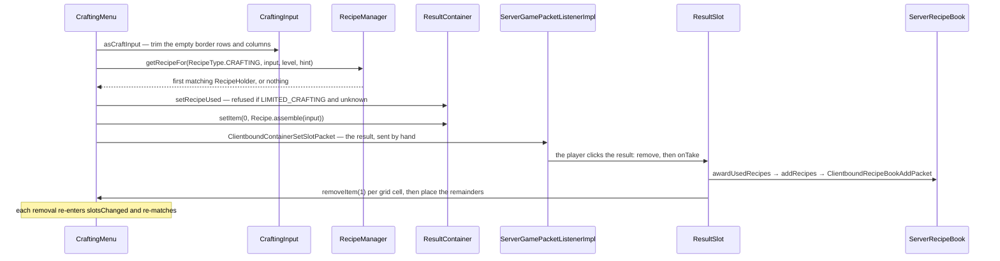

# Recipes

> Verified against **Minecraft 26.2** · Part VII · Nine planks go into a crafting grid and a chest comes out: the server matches, assembles and pushes the result slot by hand — and the client never sees a single recipe.

## Responsibility

A recipe turns a shaped or shapeless arrangement of items into another
item. The system's job is to load those definitions from a data pack,
index them so a grid change can be matched twenty times a second, decide
authoritatively what a player may craft, and give the client just enough
to *draw* a recipe book without ever telling it what the recipes are.

The one sentence a player recognises: *the crafting grid, and the book
that fills it in for you.*

The headline for a 1.21-era reader: **the client is never sent the
recipes.** `ClientboundUpdateRecipesPacket` no longer carries them. What
crosses is a set of "which items may go in this slot" predicates and, for
the book, a list of *displays*.

## The data it owns

- **`Recipe`** — the interface, ten methods: `Recipe.matches`,
  `Recipe.assemble`, `Recipe.isSpecial`, `Recipe.showNotification`,
  `Recipe.group`, `Recipe.getSerializer`, `Recipe.getType`,
  `Recipe.placementInfo`, `Recipe.display`, `Recipe.recipeBookCategory`.
  Note what is *not* there: no result getter. The result exists only
  inside the implementation and leaves either through `Recipe.assemble`
  or, for the book, through `Recipe.display`.
- **`RecipeType`** — an empty interface with seven constants
  (`RecipeType.CRAFTING`, `RecipeType.SMELTING`, `RecipeType.BLASTING`,
  `RecipeType.SMOKING`, `RecipeType.CAMPFIRE_COOKING`,
  `RecipeType.STONECUTTING`, `RecipeType.SMITHING`). It carries no
  behaviour; it is a map key.
- **`RecipeSerializer`** — in 26.2 a **record** of a `MapCodec` and a
  `StreamCodec`, and that is the whole thing. `Recipe.CODEC` dispatches
  on the JSON *type* field through `BuiltInRegistries.RECIPE_SERIALIZER`.
- **`RecipeHolder`** — a record of a `ResourceKey` and the recipe.
  `Registries.RECIPE` exists as a registry *key* so ids can be interned
  keys rather than plain identifiers; there is no built-in recipe
  registry.
- **`RecipeManager`** — the server-side loader and index, a
  `SimplePreparableReloadListener` over a `RecipeMap`
  ([the resource system](../foundations/resource-system.md)).
- **`RecipeMap`** — the immutable store, and it holds exactly two
  indexes: `RecipeMap.byType` (a multimap) and `RecipeMap.byKey`.
- **`Ingredient`** — a `HolderSet` of items with a predicate face. It
  cannot be empty and cannot contain air; the constructor throws.
- **`PlacementInfo`** — the auto-fill plan: an ordered ingredient list
  plus a slot-to-ingredient-index map, with `PlacementInfo.NOT_PLACEABLE`
  for the recipes that have none.
- **`RecipePropertySet`** — a flat set of items that may go in one slot.
  The constants name the slots that need it:
  `RecipePropertySet.SMITHING_BASE`, `RecipePropertySet.FURNACE_INPUT`,
  `RecipePropertySet.BLAST_FURNACE_INPUT` and so on.
- **`RecipeDisplay`** and **`SlotDisplay`** — the presentation model. A
  `SlotDisplay` is what to draw in one slot; the variants include
  `SlotDisplay.ItemSlotDisplay`, `SlotDisplay.TagSlotDisplay`,
  `SlotDisplay.Composite`, `SlotDisplay.WithRemainder` and
  `SlotDisplay.AnyFuel`.
- **`RecipeDisplayId`** — a record wrapping a single int. It is an
  **index into a list**, not an identifier.
- **`ServerRecipeBook`** and `ClientRecipeBook` — the per-player unlocked
  set, and the client's grouped view of it.

### The derived indexes

`RecipeManager.finalizeRecipeLoading` builds four things on top of
`RecipeMap`: the seven `RecipePropertySet`s, the stonecutter's
`SelectableRecipe.SingleInputSet`, a flat list of every display — whose
position in that list *is* the `RecipeDisplayId` — and a map from recipe
key to its displays.

## When it runs

**Reload worker threads** for `RecipeManager.prepare`, which scans
*data/&lt;ns&gt;/recipe/* through the same JSON machinery every other
reload listener uses and accumulates into a sorted map.
**Server main thread** for `RecipeManager.apply`, which swaps the field,
and for everything else: matching, assembling, awarding.

**Every grid change** re-matches. `TransientCraftingContainer.setItem`
calls `AbstractContainerMenu.slotsChanged`, which for a crafting menu
runs `CraftingMenu.slotChangedCraftingGrid` inside
`ContainerLevelAccess.execute` — so a player dragging items across a
3×3 grid runs a full match per slot touched.

Three accelerations sit on top of what is otherwise a linear scan:
a hint parameter (test this recipe first), `RecipeManager.CachedCheck`
(remember the last successful key — what a furnace uses), and
`RecipeCache`, a small LRU keyed on grid contents that the crafter block
shares statically.

## The trace: crafting

1. **The grid changes.** A click writes into the menu's
   `TransientCraftingContainer`, which calls
   `AbstractContainerMenu.slotsChanged`.
2. **Trimming.** `CraftingContainer.asCraftInput` builds a
   `CraftingInput` that has trimmed the empty border rows and columns and
   remembers the offset — which is why a shaped recipe works anywhere in
   the grid. The `CraftingInput` constructor also builds its
   `StackedItemContents`.
3. **Matching.** `RecipeManager.getRecipeFor` streams the type bucket,
   filters on `Recipe.matches`, and takes the first. Deterministic,
   because the load accumulated into a sorted map — two recipes that both
   match resolve alphabetically by id. `ShapedRecipePattern.matches`
   compares the ingredient count and the trimmed dimensions, then tries
   the mirrored layout before the straight one;
   `ShapelessRecipe.matches` hands off to a bipartite matching search in
   `StackedContents.RecipePicker`.
4. **The gate.** `RecipeCraftingHolder.setRecipeUsed` returns false — and
   the result stays empty — when `GameRules.LIMITED_CRAFTING` is on, the
   recipe is not special, and `ServerRecipeBook` has not unlocked it.
   The limited-crafting rule is enforced in the result slot, not in
   matching.
5. **Assembling.** `Recipe.assemble` produces the stack;
   `ItemStack.isItemEnabled` filters it against the level's feature
   flags; `ResultContainer.setItem` stores it.
6. **Pushing it.** `AbstractContainerMenu.setRemoteSlot` forces the
   server's belief and then a `ClientboundContainerSetSlotPacket` is sent
   **by hand**, outside the ordinary diffing of
   [containers and menus](containers-and-menus.md).
7. **Taking it.** The player clicks the result; `ResultSlot.remove`
   counts what was taken and `ResultSlot.onTake` runs.
8. **Awarding.** `ResultSlot.checkTakeAchievements` calls
   `ItemStack.onCraftedBy` (the `Stats.ITEM_CRAFTED` counter and
   `Item.onCraftedBy`), then `RecipeCraftingHolder.awardUsedRecipes`
   fires `CriteriaTriggers.RECIPE_CRAFTED` and, for a non-special
   recipe, `ServerPlayer.awardRecipes` →
   `ServerRecipeBook.addRecipes`, which unlocks it, fires
   `CriteriaTriggers.RECIPE_UNLOCKED` and sends
   `ClientboundRecipeBookAddPacket`.
9. **Consuming.** `ResultSlot.getRemainingItems` **re-runs the lookup**
   rather than reusing the stored recipe (which `RecipeCraftingHolder.awardUsedRecipes` has
   already nulled), and `CraftingRecipe.getRemainingItems` maps each
   slot through `Item.getCraftingRemainder` — which now returns an
   `ItemStackTemplate`.
10. **The decrement.** One item is removed per occupied cell and the
    remainder placed: back into the emptied slot, merged if compatible,
    else into the inventory, else dropped. Every removal re-enters step 1
    and the result slot is recomputed.

## Interfaces

- **Called by:** `AbstractCraftingMenu` and `CraftingMenu` on every grid
  change; `AbstractFurnaceMenu` and the furnace block entity
  ([block entities](../blocks/block-entities.md)) through a cached
  check; `CrafterMenu` through `RecipeCache`; `StonecutterMenu`;
  `ServerGamePacketListenerImpl.handlePlaceRecipe` for the book.
- **Calls into:** `Ingredient`, `StackedItemContents` for craftability
  and auto-fill, `Inventory` for pulling items into the grid, and
  `ServerRecipeBook` for unlocks.
- **Crosses the network as:** `ClientboundUpdateRecipesPacket` (property
  sets and the stonecutter set, on join and after a reload),
  `ClientboundRecipeBookAddPacket` (the unlocked displays, whole set on
  join with a replace flag, incrementally afterwards),
  `ClientboundRecipeBookRemovePacket`,
  `ClientboundRecipeBookSettingsPacket`,
  `ClientboundPlaceGhostRecipePacket` (a whole `RecipeDisplay`), and
  `ClientboundContainerSetSlotPacket` for the result. Upward:
  `ServerboundPlaceRecipePacket`,
  `ServerboundRecipeBookSeenRecipePacket`,
  `ServerboundRecipeBookChangeSettingsPacket`.
- **Data-driven by:** JSON under *data/&lt;ns&gt;/recipe/* (note the
  singular directory), dispatched by `RecipeSerializer`; the effect
  registries `Registries.RECIPE_DISPLAY`, `Registries.SLOT_DISPLAY` and
  `Registries.RECIPE_BOOK_CATEGORY`.

### What the client actually gets

`ClientboundUpdateRecipesPacket` carries the `RecipePropertySet`s and the
stonecutter's `SelectableRecipe.SingleInputSet` — the latter serialised
with a codec that **drops the recipe** and writes an empty optional.
The property sets exist so that `SmithingMenu`, `AbstractFurnaceMenu` and
`StonecutterMenu` can answer "may this item go in this slot" and route a
shift-click, without the client knowing any recipe. The recipe book gets
`RecipeDisplayEntry`s: an id, a display, a group index, a category, and
an optional ingredient list used only to decide whether the entry lights
up as craftable.

### The recipe book

`ServerRecipeBook` stores three things — the settings, an identity set of
known recipe keys, and the "new and glowing" subset — saved in the player
NBT and validated key-by-key against the live `RecipeManager` on load,
with unknown keys logged and dropped. `ClientRecipeBook` groups the
displays by category and by group index, which is why one book button
cycles through six kinds of plank.

Auto-fill runs entirely on the server. A book click sends
`ServerboundPlaceRecipePacket` with a `RecipeDisplayId`; the server
resolves the index, checks the recipe is unlocked and placeable, sets a
flag that suppresses re-matching while it shuffles, and runs
`ServerPlaceRecipe.placeRecipe` — which clears the grid into the
inventory, works out how many the player can make, pulls items with
`Inventory.findSlotMatchingCraftingIngredient`, and lays them out with
`PlaceRecipeHelper.placeRecipe` (which centres a small pattern in a big
grid). If the items are not there it returns the "place ghost" outcome
instead, and the server sends `ClientboundPlaceGhostRecipePacket`
carrying the display itself.

## Invariants and surprises

- **The client never receives a recipe.** The stream codecs exist on
  every serializer and no game packet uses them.
- **A `RecipeDisplayId` is a list index that changes on every reload** —
  which is exactly why a reload re-sends the whole book with the replace
  flag set, and why the server resolves a place-recipe request by bounds
  check.
- **Shaped recipes match mirrored** unless the pattern is symmetrical,
  which is computed once at load.
- **Matching is a linear scan whose order is alphabetical by recipe id.**
  Ties resolve by namespace and path, deterministically, because the load
  sorted them.
- **Special recipes are invisible to the book.** `CustomRecipe.isSpecial`
  is true and its placement info is not placeable, so it is never
  unlocked, never shown as craftable, and never auto-filled.
- **`ResultSlot.onTake` re-runs the recipe lookup** rather than trusting
  the stored one.
- **Auto-fill ignores damaged, enchanted and renamed items.**
  `Inventory.isUsableForCrafting` gates both the craftability count and
  the item search — so the book can say "not craftable" for a stack an
  ordinary manual craft would accept.
- **The result slot bypasses the menu's change diffing** entirely, with a
  forced remote slot and a hand-written packet.
- **`RecipeCache` invalidates on object identity**, holding a weak
  reference to the manager and wiping itself when the level hands back a
  different one — which works because a reload builds a new manager.
- **An `Ingredient` cannot be empty**, and a non-special recipe whose
  placement info comes out unplaceable is logged and dropped at load.
- **`RecipeType.SMITHING` is one bucket** holding both the transform and
  the trim recipes, sharing a default match method on the interface.

## Where to look

`Recipe` · `RecipeType` · `RecipeSerializer` · `RecipeHolder` ·
`RecipeManager` · `RecipeMap` · `RecipeAccess` · `Ingredient` ·
`PlacementInfo` · `RecipePropertySet` · `CraftingInput` ·
`ShapedRecipePattern` · `ShapelessRecipe` · `AbstractCookingRecipe` ·
`CustomRecipe` · `RecipeDisplay` · `SlotDisplay` · `RecipeDisplayId` ·
`AbstractCraftingMenu` · `CraftingMenu` · `ResultSlot` ·
`ResultContainer` · `RecipeCraftingHolder` · `ServerRecipeBook` ·
`ClientRecipeBook` · `ServerPlaceRecipe` · `StackedItemContents`

---

*Rules: names, never code · how the system works, not how the code reads ·
newest version only · every backticked name passes `tools/verify_names.py`.*
