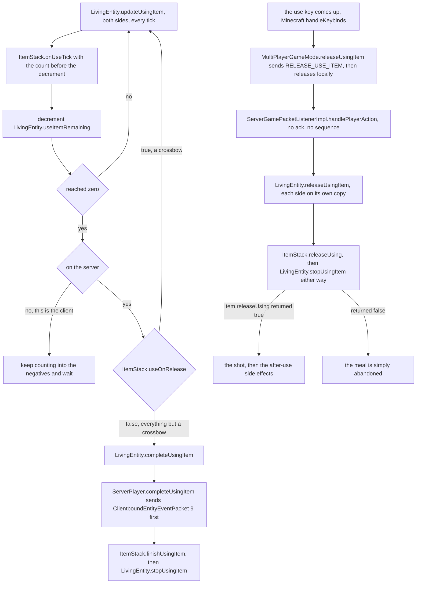
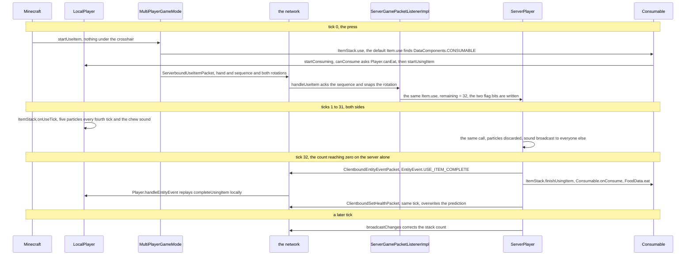
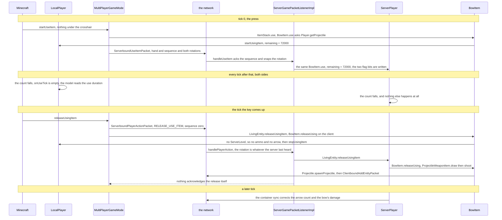

# Using an item

> Verified against **Minecraft 26.2** · Part VII · A player holds the use key on a piece of cooked beef, then holds it on a bow — one countdown, two endings.

You hold the use button on cooked beef and thirty-two ticks later you have
eaten it. You hold the same button on a bow and nothing happens at all until
you let go. These are the same machine: `Item.use` starts both,
`LivingEntity.useItemRemaining` counts down on the client *and* the server
for both, `ItemStack.onUseTick` runs every tick on both sides, and
`LivingEntity.stopUsingItem` ends both. What differs is whether the count is
allowed to mean anything — and the consequence is stranger than the
difference. **The client's countdown does not stop at zero.** The meal ends
because one byte arrives from the server, a `ClientboundEntityEventPacket`
carrying `EntityEvent.USE_ITEM_COMPLETE`. The bow's countdown starts at
72000 and would take an hour to expire, so the shot is fired by a
`ServerboundPlayerActionPacket` instead — the same packet, carrying the same
action, that the meal would read as *the player changed their mind*.

## The cast

| class | what it decides | thread |
|---|---|---|
| `Minecraft` | which key edge starts a use, and which one ends it | client main |
| `MultiPlayerGameMode` | the client's own copy of the use, and the packet that reports it | client main |
| `ServerGamePacketListenerImpl` | which handler each packet reaches, and whether the rotation is snapped first | server main |
| `LivingEntity` | the countdown, the synched flags, and both endings | both main |
| `ItemStack` | the dispatch into the item, and the after-use side effects | both |
| `Item` | `Item.use`, `Item.getUseDuration`, `Item.releaseUsing`, `Item.useOnRelease` | both |
| `Consumable` | everything the meal does, on both sides | both |
| `ProjectileWeaponItem` | ammo, spread and the arrow — the counting on both sides, the spawning only on the server | both, but only the server's counts |

The block-target branch of a use — right-clicking a chest rather than the
air — leaves at `MultiPlayerGameMode.useItemOn` and belongs to
[block interaction](../blocks/block-interaction.md#block-then-empty-hand-then-item);
the stack itself is [items and
stacks](items-and-stacks.md#four-fields-and-only-one-of-them-is-really-data).

## The two paths, side by side

| | the meal | the bow |
|---|---|---|
| what `Item.use` does | the default body finds `DataComponents.CONSUMABLE` and calls `Consumable.startConsuming` | `BowItem.use` overrides it, checks `Player.getProjectile`, calls `LivingEntity.startUsingItem` |
| the refusal | `Consumable.canConsume` asks `Player.canEat`, for food only | no arrow anywhere and no infinite materials — `InteractionResult.FAIL` |
| `Item.getUseDuration` | `Consumable.consumeTicks`, **32** for `Consumables.DEFAULT_FOOD` | **72000** — an hour, and `BowItem`'s own override |
| what `ItemStack.onUseTick` does | particles and the chew sound, on both sides | nothing — `BowItem` does not override `Item.onUseTick` |
| how it ends | the count reaches zero on the server | the use key comes up on the client |
| the packet that ends it | `ClientboundEntityEventPacket`, downward | `ServerboundPlayerActionPacket`, upward |
| is the ending acknowledged | yes — that *is* the acknowledgement | **no**, nothing answers a release |
| `Item.releaseUsing` | not overridden, returns false, so letting go simply abandons the meal | `BowItem.releaseUsing` is where the whole shot lives |
| `ItemStack.useOnRelease` | false | **also false** |
| what the client predicts | the entire meal, twice over | the animation, and nothing else |

The last-but-one row is the one that looks wrong. `ItemStack.useOnRelease` is
the third term of the completion guard and it is the obvious name for "this
item is finished by letting go" — but it only delegates, and the hook it
delegates to, `Item.useOnRelease`, has **exactly one override in the tree**,
`CrossbowItem`'s. The bow and the trident take the default false. They are
release-ended not because a predicate says so, but because their
`Item.getUseDuration` is an hour long and their `Item.releaseUsing` does the
work. The spyglass takes the default too and is not release-ended at all: at
1200 ticks its countdown really can run out.

Duration is where the real answer lives, and the whole roster is eight
overrides and one default. `Item.getUseDuration`'s base body reads
`Consumable.consumeTicks` off the stack if there is a `Consumable` on it, and
otherwise answers the hour for anything carrying
`DataComponents.BLOCKS_ATTACKS` or `DataComponents.KINETIC_WEAPON` — so a
shield and a spear get their long draw from the base method and no class of
their own. Above it: `BowItem`, `CrossbowItem` and `TridentItem` return the
same 72000, which `Item.APPROXIMATELY_INFINITE_USE_DURATION` names and no
override actually reads; `SpyglassItem` returns 1200; `BrushItem` and
`BundleItem` return 200; `InstrumentItem` returns the goat horn's own sounded
length in ticks; and `EnderEyeItem` returns **zero**, which makes it the one
item in the game whose use is instant by declaration rather than by having no
`Consumable` at all.

## Starting: the client finishes before it speaks

`Minecraft.handleKeybinds` sees the press and calls `Minecraft.startUseItem`,
which sets the four-tick `Minecraft.rightClickDelay` itself, refuses while
`LocalPlayer.isHandsBusy`, and walks both hands for a target. With nothing
under the crosshair it reaches `MultiPlayerGameMode.useItem`, which opens a prediction window first
(`MultiPlayerGameMode.startPrediction`,
[prediction and acks](../client/prediction-and-acks.md#two-state-machines-running-against-each-other)) and does everything
else inside it: it builds the `ServerboundUseItemPacket` — hand, sequence
number and both rotations — then consults the client's own `ItemCooldowns`,
and runs `ItemStack.use` **locally first** only if the item is off cooldown.
The packet goes up either way; the cooldown suppresses the prediction, not the
report of it. The prediction is complete before a byte leaves the client, for
the meal and the bow alike. Both answer `InteractionResult.CONSUME`, whose
`InteractionResult.SwingSource.NONE` is why neither swings the arm, although
`ItemInHandRenderer.itemUsed` still runs — the small dip the item makes as
the use begins. An *instant* use, one whose `ItemStack.getUseDuration` is
zero, returns its outcome the other way instead, through
`InteractionResult.Success.heldItemTransformedTo`, which both game modes
unwrap and write back into the hand.

On the server, `ServerGamePacketListenerImpl.handleUseItem` acknowledges the
sequence number, **snaps the player's rotation to the one in the packet**,
and calls `ServerPlayerGameMode.useItem`. That snap is what makes the
release strange later, because the release packet does no such thing. And
`ServerPlayerGameMode.useItem` ends on a deliberate omission: it normally
re-sends the player's inventory with
`AbstractContainerMenu.sendAllDataToRemote`
([containers and
menus](containers-and-menus.md#the-chest-you-see-is-not-the-chest)), but not when the use it
just ran started a multi-tick one. **While you are eating or drawing, the
server declines to correct your inventory.**

## While it runs: the flag on the wire and the flag the client believes

`LivingEntity.startUsingItem` writes two bits of
`LivingEntity.DATA_LIVING_ENTITY_FLAGS`
([synched entity
data](../entities/synched-entity-data.md#nineteen-slots-and-where-the-numbers-come-from)) — bit one for
*using*, bit two *assigned* the hand, so a main-hand use clears it — and
only on the server. `LivingEntity.isUsingItem` and
`LivingEntity.getUsedItemHand` read those bits, which is how every other
client knows your arm is up.

Your own client does not read them. `LocalPlayer.isUsingItem` overrides the
base and returns a private local flag set by `LocalPlayer.startUsingItem`;
`LocalPlayer.getUsedItemHand` likewise answers from a local field.
Reconciliation happens afterwards, in **both** directions:
`LocalPlayer.onSyncedDataUpdated` compares the arriving bits with the local
flag and will start a use the client never predicted, or stop one it did.
The base `LivingEntity.onSyncedDataUpdated` makes the matching repair on
every *other* entity's copy — it adopts the held stack and re-derives
`LivingEntity.useItemRemaining` from `ItemStack.getUseDuration`, which is why
a remote player drawing a bow animates correctly although your client never
saw the press.

One abandonment rule is shared, and it lives a level above the countdown.
`LivingEntity.tick` calls the private `LivingEntity.updatingUsingItem`,
which compares the hand's current stack with the remembered one using
`ItemStack.isSameItem` and calls `LivingEntity.stopUsingItem` if they
differ; only on a match does it call `LivingEntity.updateUsingItem`, the
countdown proper. The comparison is item identity, not components, so
**swapping a bowl for a stew aborts the meal while a durability tick on the
bow does not abort the draw.**

## Every tick, and what the bow does instead

`LivingEntity.updateUsingItem` offers `ItemStack.onUseTick` the count
*before* it decrements, so a thirty-two-tick meal is offered 32 down to 1
and never 0. For the meal that one call is the whole visible experience:
`Consumable.shouldEmitParticlesAndSounds` is true once more than
`Consumable.CONSUME_EFFECTS_START_FRACTION` of the duration has elapsed and
the remaining count is a multiple of `Consumable.CONSUME_EFFECTS_INTERVAL`,
and `Consumable.emitParticlesAndSounds` then spawns five item particles
through `LivingEntity.spawnItemParticles` — behind
`Consumable.hasConsumeParticles`, which drinks turn off — and plays the chew
sound, which they do not. `Level.addParticle` does nothing on the server, so
the crumbs are pure client simulation.

For the bow the call does nothing whatever: `BowItem` does not override
`Item.onUseTick`, and the base body is empty. Everything you see while
drawing is the renderer reading the same counter the logic is decrementing.
`ItemInHandRenderer` computes the draw curve for `ItemUseAnimation.BOW` from
`LivingEntity.getUseItemRemainingTicks`, and the three-stage bow texture is
not code at all: *items/bow.json* is a *condition* on *using_item* wrapping
a *range_dispatch* on the *use_duration* property (`UseDuration`), scaled so
its thresholds are fractions of `BowItem.MAX_DRAW_DURATION`.

The crossbow is the exception that makes the rule legible. It *does*
override `Item.onUseTick`, and that body is entirely server-side: it plays
the three `CrossbowItem.ChargingSounds` at fixed fractions of
`CrossbowItem.getChargeDuration` and, on reaching one, writes
`DataComponents.CHARGED_PROJECTILES` onto the stack. Its client half is a
render-thread computation — `CrossbowPull` and `ItemInHandRenderer` both
call `CrossbowItem.getChargeDuration`, which calls
`EnchantmentHelper.modifyCrossbowChargingTime`
([enchantments](enchantments.md#questions-the-pattern-raises)). **An enchantment hook, evaluated on the
render thread, once per frame, to pick one of three textures.**

> **For a 1.21-era reader.** There is no bow-pull item property class left
> to hunt for. The old *pulling* / *pull* pair is now the shared
> `UseDuration` range-select property plus a *using_item* condition, both
> declared in the item's JSON; the crossbow keeps a bespoke one,
> `CrossbowPull`, only because its denominator is enchantable.

## Moving while you use

Neither path slows you through movement code — both read one component.
`LocalPlayer.modifyInput` scales the movement input by
`LocalPlayer.itemUseSpeedMultiplier`, which reads
`UseEffects.speedMultiplier` off the stack, unless the player is riding, and
`LocalPlayer.isSlowDueToUsingItem` blocks sprinting because
`UseEffects.canSprint` is false. The famous twenty per cent is the default
in `UseEffects.DEFAULT`, which sits in
`DataComponents.COMMON_ITEM_COMPONENTS`, so every item has one — and neither
cooked beef nor the bow overrides it, which is why **drawing a bow slows you
by exactly as much as eating does, through exactly the same field.**
`Item.Properties.spear` is the definition that overrides it outright, with a
`UseEffects` that permits sprinting, suppresses vibrations and multiplies
speed by one; the attack that ends *that* use is a different packet again
([the spear](../player/the-spear.md)).

## The ending, in one picture

The **client's branch has no exit**. Nothing on the client ever reaches
`LivingEntity.completeUsingItem` from the countdown — it is called from
`Player.handleEntityEvent` when event 9 arrives, and nowhere else on that
side. The counter meanwhile keeps falling past zero and only the renderer
notices: `ItemInHandRenderer` draws a use pose solely while
`LivingEntity.getUseItemRemainingTicks` is positive, so the arm drops at
tick 32 whether or not the packet has landed.

And **`ItemStack.useOnRelease` does not mean "ends on release"**. It means
*do not let the countdown finish this, and give it one more tick when the
key comes up*: `LivingEntity.releaseUsingItem` calls
`LivingEntity.updatingUsingItem` again when it is true, so a crossbow gets a
final `CrossbowItem.onUseTick` in which it can still latch the charge. No
other item asks for that. Release is also not only a key-up —
`LivingEntity.releaseUsingItem` has five other call sites:
`LivingEntity.completeUsingItem` itself, when the stack turned out not to
match the hand; `CrossbowAttack` and `RangedCrossbowAttackGoal`, which is
how a pillager fires
(a pillager's ranged goal); and
`BrushItem.onUseTick` twice, ending its own use from inside the tick.

## The meal, tick by tick

The replay is the interesting half. `Consumable.onConsume` runs on **both**
sides and three parts of it do not: the `Stats.ITEM_USED` award and
`CriteriaTriggers.CONSUME_ITEM` need a `ServerPlayer`, the `ConsumeEffect`s
in `Consumable.onConsumeEffects` sit behind a server-side guard, and
`GameEvent.EAT` is a no-op because `ClientLevel.gameEvent` has an empty
body. Particles, sound, the `ConsumableListener` walk that finds
`FoodProperties`, and the `ItemStack.consume` shrink all run on both — and
every one of those client mutations is then overwritten. That is why a
chorus fruit's teleport is never predicted while the hunger bar's jump is
([hunger and
experience](../player/hunger-and-experience.md#eating-is-a-component-walk)).

One meal, two exactly-once sound strategies. The chew sound goes through
`Player.playSound`, which names the eater as the entity to *exclude*, so the
server broadcasts it to everyone else and the eater's client plays it
locally. The `FoodProperties` eat and burp sounds pass no exclusion at all —
and `ClientLevel.playSeededSound` plays a sound only when the excluded
entity *is* the local player — so those reach the eater as the server's
broadcast alone.

## The bow, tick by tick

`BowItem.releaseUsing` runs on both sides and gets nowhere on one of them.
It measures the draw as `BowItem.getUseDuration` minus the remaining count,
puts it through `BowItem.getPowerForTime` — a curve on the draw time in
seconds, clamped at one after `BowItem.MAX_DRAW_DURATION` ticks — and
returns false below a tenth of full power, which is why a tap of the button
neither shoots nor costs durability. Above it, `ProjectileWeaponItem.draw`
decides how many arrows leave the string
(`EnchantmentHelper.processProjectileCount`) and
`ProjectileWeaponItem.useAmmo` decides whether an arrow is actually spent
(`EnchantmentHelper.processAmmoUse`). Both consult a `ServerLevel` and fall
back to one and zero otherwise, and `ProjectileWeaponItem.shoot` is itself
inside a `ServerLevel` test — so **on the client the draw produces a single
phantom arrow marked `DataComponents.INTANGIBLE_PROJECTILE`, spends nothing
and shoots nothing.**

On the server it is five enchantment hooks and one ordering worth
remembering. `EnchantmentHelper.processProjectileSpread` fans a multishot
volley, and each arrow is aimed by `BowItem.shootProjectile` through
`Projectile.shootFromRotation` using the **server's** rotation — which the
release packet never updated, so the shot goes where the last movement
packet said you were looking. `Projectile.spawnProjectile` aims, adds the
entity to the level, and only *afterwards* calls
`Projectile.applyOnProjectileSpawned`, which runs
`EnchantmentHelper.onProjectileSpawned` **twice** when ammo and weapon are
different items: once for the arrow's stack and once for the bow's.
`ItemStack.hurtAndBreak` takes the durability after each arrow, and the
volley breaks off if the bow dies mid-flight.

Only when `Item.releaseUsing` returns true does `ItemStack.releaseUsing` run
`ItemStack.applyAfterUseComponentSideEffects` — the same private step
`ItemStack.finishUsingItem` runs for the meal, converting
`DataComponents.USE_REMAINDER` into the empty bowl and starting
`DataComponents.USE_COOLDOWN`. (For an instant use it runs from
`ItemStack.use` instead, and only for a zero-duration success.) Cooldowns
are grouped rather than per-item: `ItemCooldowns.getCooldownGroup` returns
`UseCooldown.cooldownGroup` when the component names one and the item's
`Identifier` otherwise, both sides own an `ItemCooldowns` — the client's is
a real prediction, consulted before it will even attempt a use — and
`ServerItemCooldowns.onCooldownStarted` mirrors the server's as one
`ClientboundCooldownPacket` naming a *group*.

## What the ending never carries

The release is the least-answered packet in the pipeline.
`ServerGamePacketListenerImpl.handlePlayerAction` treats
`ServerboundPlayerActionPacket.Action.RELEASE_USE_ITEM` in one line — call
`LivingEntity.releaseUsingItem`, return — with no ack, no sequence number
consumed, not even a spectator check. Everything the client learns about its
own shot arrives as ordinary world traffic. The arrow is the quick one: adding
it to the level starts its tracking inside the same call, so the spawn packet
leaves on that tick. The spent ammo and the bow's damage wait for a container
slot update ([containers and
menus](containers-and-menus.md#where-in-the-tick-a-broadcast-happens)) and the cleared
using-flag for entity data it has already acted on, both a tick or more
later. The shoot sound is broadcast with no
exclusion, so — by the same rule as the burp — the shooter hears the
server's copy and never their own.

The completion is barely richer. There is no *you ate this* packet: event 9
tells the client to re-derive the outcome from components it already holds,
and `ClientboundSetHealthPacket` corrects whatever it got wrong. The single
override of `Item.finishUsingItem` in the whole tree is
`SpyglassItem.finishUsingItem`, which plays a sound — the spyglass being the
one item whose completion is worth a sound of its own — reached either at its
1200-tick duration or, like any use, the moment you let go.

## Where to look

`Minecraft.handleKeybinds` · `Minecraft.startUseItem` ·
`MultiPlayerGameMode.useItem` · `MultiPlayerGameMode.releaseUsingItem` ·
`ServerGamePacketListenerImpl.handleUseItem` ·
`ServerGamePacketListenerImpl.handlePlayerAction` ·
`ServerPlayerGameMode.useItem` · `ItemStack.use` · `Item.use` ·
`LivingEntity.startUsingItem` · `LivingEntity.updatingUsingItem` ·
`LivingEntity.updateUsingItem` · `LivingEntity.completeUsingItem` ·
`LivingEntity.releaseUsingItem` · `ItemStack.releaseUsing` ·
`ItemStack.useOnRelease` · `Consumable` · `UseEffects` · `UseCooldown` ·
`BowItem` · `CrossbowItem` · `TridentItem` · `ProjectileWeaponItem` ·
`SpyglassItem` · `ItemInHandRenderer` · `UseDuration`

---

*Rules: names, never code · how the system works, not how the code reads ·
newest version only · every backticked name passes `tools/verify_names.py`.*
