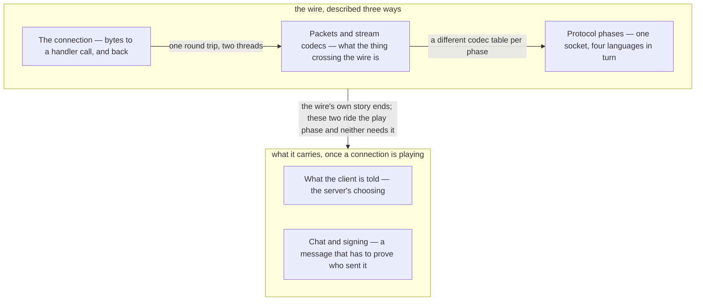

# IX · Networking

> Verified against **Minecraft 26.2** · Part IX · One socket, four languages, and everything the two halves of the game say to each other across it.

Almost every part before this one had a single machine to describe. This one
has two. A player meets the seam as a set of symptoms — the *Connection lost*
screen with a reason string on it, the mob that freezes and then jumps a dozen
blocks, the chest whose contents appear only when it is opened, the chat line
that turns red and takes every line after it with it — and every one of those
is a decision rather than a fault. Singleplayer runs the same wire, an
integrated server on its own threads talking to the client through an
in-memory channel, so the split is not a multiplayer feature bolted on the
side: it is the shape of the program, and **the wire is not a pipe between two
halves of one machine but a border between two machines, each of which treats
what arrives from the other as a claim rather than a fact.**

## The shape of the part

Part IX is **the wire three times, and two things it carries**. The first
three lectures are all about the wire and are ordered by what they describe it
as: bytes on a socket, then the values those bytes are, then the four
languages the socket speaks in turn — a connection changes language as it goes
from handshaking to playing, and the last of the three is where that happens.
Nothing after those three is about the wire at all. The last two both sit
inside the final language, and they are the part's two largest systems:
everything the server chooses to tell a client about the world, and the one
protocol in the book written against a peer that *lies*.

The spine is the pair at the top: read them together, because the second is
the second half of the first. The last two are where the part spends most of
its length, and that is proportionate to the traffic — telling a client where
the mobs are and sending it chunks is most of what a connection ever carries,
while chat is a handful of packets a minute with a wholly disproportionate
amount of cryptography on it.

## Before you start

**[Part I's anatomy](../anatomy/anatomy.md#two-loops-and-a-wire-between-them)
first**, for the two-loops figure. The client's frame loop and the server's
tick loop are different clocks, and the client drains its inbound packets once
per **frame**, not once per tick. That one fact is behind most of what looks
like network jitter, and every page here leans on it.

**[Part III](../server/README.md) next, and not optionally**, because two of
this part's claims are really facts about somebody else's loop and Part IX
states the consequence rather than re-teaching the loop: [the server
tick](../server/server-tick.md#what-minecraftservertickchildren-runs-and-in-what-order)
owns what happens after every level has ticked, and [the level
tick](../server/server-level-tick.md#the-broadcast-which-is-why-entities-are-a-tick-behind)
owns the phase in which broadcasts go out — before the entity phase, which is
why one broadcast carries this tick's block changes but the *previous* tick's
entity movement.

**Then [Part II](../foundations/README.md)** for two objects this part assumes
whole:
[codecs](../foundations/codecs-nbt-json.md#one-abstraction-and-the-ops-that-are-not-formats),
because a packet codec is the same idea specialised to a byte buffer, and
[components](../foundations/text-components.md#a-component-is-three-things),
because a chat message is one. **And [Part
VI's authority](../entities/authority.md#five-predicates-and-the-final-one-the-other-four-hang-off)**,
which is the premise under lecture four: which side of the wire is allowed to
decide where a thing is, and therefore what the other side may be told late.

Nothing here waits on Part X. The client's half of the story is the deeper
version of the first item above, and where its arithmetic would matter these
pages state the consequence and link forward to it.

## Watch in this order

1. [The connection](the-connection.md) — you swing at a pig, and some
   milliseconds later a method runs on the server's game thread. The lecture
   with the round-trip diagram, and then the whole life of the channel that
   carried it: two threads, two codec layers, one hop.
2. [Packets and stream codecs](packets-and-stream-codecs.md) — the second
   half of the same lecture. What the thing crossing the wire is, now that
   you have watched it travel, and why its number is written down nowhere.
3. [Protocol phases](protocol-phases.md) — a login, from clicking a server
   in the list to standing in the world: four languages over one socket, and
   the surprising thing about *when* in that sequence a player becomes an
   object on the server.
4. [What the client is told](what-the-client-is-told.md) — a creeper walks
   into view. Not a trace but a policy: three gates a change passes before it
   becomes a packet, and the things the server decides never to say.
5. [Chat and signing](chat-and-signing.md) — the part's closer, and the only
   system in the book whose protocol is written against a *lying* peer rather
   than a malformed one. What each check catches, and whether it kills the
   message, the chain, or the connection.

One and two are the pair to keep together; four and five can be watched in
either order, and neither strictly needs three.

## Where the part stops

Part IX's packages hold {{#include ../../generated/part-networking.md}}, and
the count flatters it, because **this part owns the wire, not everything in
`network/`**: two thousand of those lines are `Component`, which is [Part
II](../foundations/text-components.md#a-component-is-three-things)'s, much of
`client/multiplayer` is the receiving end, which is Part X's, and the largest
block is the packet classes, catalogued rather than narrated
([packets](../../reference/packets.md)).

Three systems in those packages the book names and does not teach.
**Player reporting** is out of scope on [what this book
skips](../anatomy/what-this-book-skips.md#player-reporting). The **server list
screen** is one more screen for [GUI and
screens](../client/gui-and-screens.md); only [how a typed address becomes a
socket](the-connection.md#what-the-client-dials-is-not-what-the-player-typed)
belongs here. The **boss-bar feed** belongs to its model, [scores, teams and
stored
data](../commands/scoreboard-and-data.md#the-third-sink-is-a-boss-bar-and-it-is-this-pages-shape-again),
and to [the HUD](../client/hud.md). Past those,
{{#include ../../generated/coverage-networking.md}}.

Outward, what the client *does* with what it is told is Part X's, and how a
`ServerPlayer` comes to exist at all is [Part
III's](../server/players-and-sessions.md#preparing-a-place-to-stand). This
part stops at the packet that says so.

## Reference this part uses

[Packets](../../reference/packets.md) above all — the catalogue this part
narrates, and the page to keep open beside every lecture in it. Then [the
threads](../../reference/threads.md), which names the Netty event loop and the
two game threads and lists the nine client handlers that never leave the
network thread. Behind those: [registries](../../reference/registries.md) for
what crosses during configuration, [components](../../reference/components.md)
where a packet carries a stack, [level data and
rules](../../reference/level-data-and-rules.md) for the values a server sends
on request rather than on change, and [diagram
lanes](../../reference/lanes.md).

---

*Rules: names, never code · how the system works, not how the code reads ·
newest version only · every backticked name passes `tools/verify_names.py`.*
