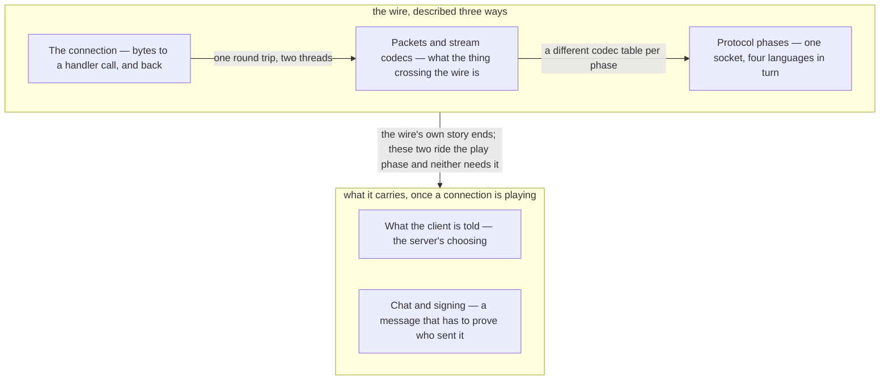

# IX · Networking

> Verified against **Minecraft 26.2** · Part IX · One socket, four languages, and everything the two halves of the game say to each other across it.

Almost every part before this one had a single machine to describe. This
one has two, and a wire between them that neither trusts. Singleplayer runs the same
wire — an integrated server on its own threads, talking to the client
through an in-memory channel — so the split is not a multiplayer feature
bolted on the side, it is the shape of the program. A player recognises the
part by its failures: the *Connection lost* screen with a reason string on
it, the mob that freezes and then jumps a dozen blocks, the chest whose
contents appear only when it is opened, the chat line that turns red and
takes every line after it with it.

## The shape of the part

Part IX is **the wire three times, and two things it carries**. The first
three lectures are all about the wire and are ordered by what they describe
it as: bytes on a socket, then the values those bytes are, then the four
languages the socket speaks in turn. Nothing after that is about the wire at
all. The last two are applications of the play phase, each a different shape
— a policy and a protocol written against an adversary — and neither needs
the other or, strictly, the third.

The spine is the pair at the top: read them together, because the second is
the second half of the first. The last two are where the part spends most of
its length, and that is proportionate — entity tracking and chunk sending are
most of what a connection ever carries, and chat is a handful of packets a
minute with a disproportionate amount of cryptography on it.

## Before you start

[Part III](../server/README.md), and not optionally. Two of this part's
claims are really facts about somebody else's loop, and Part IX states the
consequence and links rather than teaching them a third time: [the server
tick](../server/server-tick.md#what-minecraftservertickchildren-runs-and-in-what-order)
owns what happens after every level has
ticked, and [the level
tick](../server/server-level-tick.md#the-broadcast-which-is-why-entities-are-a-tick-behind)
owns the phase
in which broadcasts go out — before the entity phase, which is why one
broadcast carries this tick's block changes but the *previous* tick's
entity movement.

[Part I's anatomy](../anatomy/anatomy.md#two-loops-and-a-wire-between-them)
for the two-loops figure: the
client's frame loop and the server's tick loop are different clocks, and the
client drains its inbound packets once per **frame**, not once per tick.
That one fact is behind most of what looks like network jitter. Part X's
*client loop* is the deeper version of it, and this part does not wait for
it: where the arithmetic matters, the pages here state the
consequence and link forward.

Then [Part II](../foundations/README.md) for two objects this part assumes
whole:
[codecs](../foundations/codecs-nbt-json.md#one-abstraction-and-the-ops-that-are-not-formats),
because a packet codec
is the same idea specialised to a byte buffer, and
[components](../foundations/text-components.md#a-component-is-three-things),
because a chat message is
one. And
[authority](../entities/authority.md#five-predicates-and-the-final-one-the-other-four-hang-off)
from Part VI, which is the
premise under *what the client is told*: which side of the wire is allowed to
decide where a thing is, and therefore what the other side may be told late.

## Watch in this order

1. [The connection](the-connection.md) — bytes land on a socket, and some
   milliseconds later a method runs on the game thread. The lecture with the
   round-trip diagram: two threads, two codec layers, one hop.
2. [Packets and stream codecs](packets-and-stream-codecs.md) — the second
   half of the same lecture. What the thing crossing the wire is, now that
   you have watched it travel.
3. [Protocol phases](protocol-phases.md) — a login, from clicking a server
   in the list to standing in the world: four languages over one socket, and
   the surprising thing about *when* in that sequence a player becomes an
   object on the server.
4. [What the client is told](what-the-client-is-told.md) — a creeper walks
   into view. Not a trace but a policy: every gate a change passes before it
   becomes a packet, and the things the server decides never to say.
5. [Chat and signing](chat-and-signing.md) — the part's closer, and the only
   system in the book whose protocol is written against a *lying* peer rather
   than a malformed one. What each check catches, and whether it kills the
   message, the chain, or the connection.

One and two are the pair to keep together. Four and five can be watched in
either order, and neither strictly needs three: they are applications of the
play phase, and each names the phase only to say which packet opened it.
Three comes first because it is where the wire's own story ends.

## Reference this part uses

[Packets](../../reference/packets.md) above all — the catalogue this part
narrates, and the page to keep open beside every lecture in it. [The
threads](../../reference/threads.md) names the Netty event loop and the two
game threads by their real names, and lists the nine client handlers that
never leave the network thread. [Registries](../../reference/registries.md)
for the registry data that crosses during configuration and
[components](../../reference/components.md) where a packet carries a stack;
[level data and rules](../../reference/level-data-and-rules.md) for the
handful of level values the server sends on request rather than on change.
Then [diagram lanes](../../reference/lanes.md) for the abbreviations these
pages' figures use.

## Where the part stops

Part IX's packages hold {{#include ../../generated/part-networking.md}} —
the whole of `net/minecraft/network`, `server/network` and `client/multiplayer` — and the number is
misleading in a way worth stating, because **this part owns the wire, not
everything in `network/`**. About two thousand of those lines are
`network/chat`, which is `Component` and is [Part
II](../foundations/text-components.md#a-component-is-three-things)'s; much of
`client/multiplayer` is the receiving end, which is Part X's; and the largest
block of all is the packet classes themselves, which are a value and a codec
each and are catalogued rather than narrated
([packets](../../reference/packets.md)).

Three systems inside those packages the book names and does not teach, each
for a stated reason. **Player reporting** — the upload, the report kinds and
the reason enum — is declared out of scope on [what this book
skips](../anatomy/what-this-book-skips.md#player-reporting); what this part
owns is the signed material a report is built from. The **server list and its
screen** are Part XI's to draw; what belongs here is only how a typed address
becomes a socket, which [the
connection](the-connection.md#the-threads-underneath-it) states. And the
**boss-bar feed** — the part's largest single unnamed class — is a level feed
whose sending side has no owner anywhere in the book; it is named here so that
a reader knows the gap is known.

Outward, what the *client* does with what it is told is [the client
level](../client/the-client-level.md#what-it-does-simulate-the-two-cadences)
and [prediction and
acknowledgement](../client/prediction-and-acks.md#two-state-machines-running-against-each-other)
in Part X, and how a `ServerPlayer` comes to exist at all — the object, its
save file, its place to stand — is [players and
sessions](../server/players-and-sessions.md#preparing-a-place-to-stand) in
Part III. This part stops at the packet that says so.

---

*Rules: names, never code · how the system works, not how the code reads ·
newest version only · every backticked name passes `tools/verify_names.py`.*
