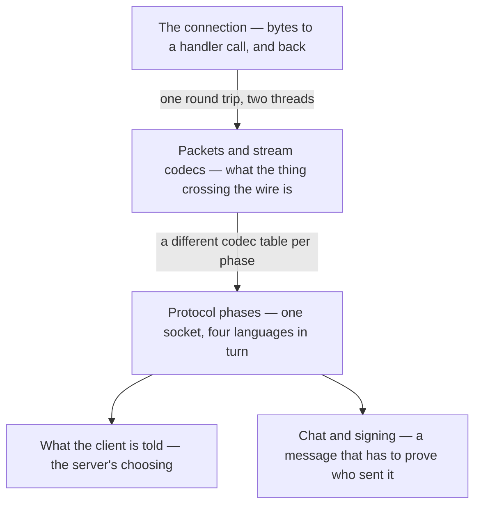

# IX · Networking

> Verified against **Minecraft 26.2** · Part IX · One socket, four languages, and everything the two halves of the game say to each other across it.

Almost every part before this one had a single machine to describe. This
one has two, and a wire between them that neither trusts. Singleplayer runs the same
wire — an integrated server on its own threads, talking to the client
through an in-memory channel — so the split is not a multiplayer feature
bolted on the side, it is the shape of the program. A player recognises the
part by its failures: the rubber-band after a laggy jump, the block that
comes back, the *Connection lost* screen with a reason string on it, the
chat message that arrives with a red line through it.

## The shape of the part

Part IX is **one wire and three passengers**. Two lectures carry bytes and
are really one lecture in two halves — the transport, then what travels on
it. The other three are unrelated systems that all happen to ride the wire,
and each has a different shape: a state machine, a policy, and a protocol
with an adversary in it.

The spine is the pair at the top: read them together and the rest of the
part is applications. *Protocol phases* is what the wire *is* over the life
of a connection; *what the client is told* and *chat and signing* are the
two systems with the most traffic on it, and neither needs the other.

## Before you start

[Part III](../server/README.md), and not optionally. Three of this part's
claims are really facts about somebody else's loop, and Part IX states the
consequence and links rather than teaching them a fourth time: [the server
tick](../server/server-tick.md) owns what happens after every level has
ticked, and [the level tick](../server/server-level-tick.md) owns the phase
in which broadcasts go out — before the entity phase, which is why one
broadcast carries this tick's block changes but the *previous* tick's
entity movement.

[Part I's anatomy](../anatomy/anatomy.md) for the two-loops figure: the
client's frame loop and the server's tick loop are different clocks, and the
client drains its inbound packets once per **frame**, not once per tick.
That one fact is behind half of what looks like network jitter. Part X's
*client loop* is the deeper version of it, and this part does not wait for
that page: where the arithmetic matters, the pages here state the
consequence and link forward.

Then [Part II](../foundations/README.md) for two objects this part assumes
whole: [codecs](../foundations/codecs-nbt-json.md), because a packet codec
is the same idea specialised to a byte buffer, and
[components](../foundations/text-components.md), because a chat message is
one. And [authority](../entities/authority.md) from Part VI, which is the
premise under *what the client is told*: the server does not send the client
the truth, it sends the client what it is not allowed to be wrong about.

## Watch in this order

1. [The connection](the-connection.md) — bytes land on a socket, and some
   milliseconds later a method runs on the game thread. The lecture with the
   round-trip diagram: two threads, two codec layers, one hop.
2. [Packets and stream codecs](packets-and-stream-codecs.md) — the second
   half of the same lecture. What the thing crossing the wire is, now that
   you have watched it travel.
3. [Protocol phases](protocol-phases.md) — a login, from clicking a server
   in the list to standing in the world. Four languages over one socket, and
   the player object built *after* the phase named for preparing it.
4. [What the client is told](what-the-client-is-told.md) — a creeper walks
   into view. Not a trace but a policy: every gate a change passes before it
   becomes a packet, and the things the server decides never to say.
5. [Chat and signing](chat-and-signing.md) — the part's closer, and the only
   system in the book with an adversary in the diagram. What each check
   catches, and whether it kills the message, the chain, or the connection.

One and two are the pair to keep together. Four and five can be watched in
either order, and both assume three.

## Reference this part uses

[Packets](../../reference/packets.md) above all — the catalogue this part
narrates, and the page to keep open beside every lecture in it.
[Registries](../../reference/registries.md) for the registry data that
crosses during configuration, [components](../../reference/components.md)
where a packet carries a stack, and [diagram
lanes](../../reference/lanes.md) for the abbreviations these pages' figures
use. [The threads](../../reference/threads.md) names the Netty event loop
and the two game threads by their real names.

Where the part stops: what the *client* does with what it is told is [the
client level](../client/the-client-level.md) and [prediction and
acknowledgement](../client/prediction-and-acks.md) in Part X, and how a
`ServerPlayer` comes to exist at all is [players and
sessions](../server/players-and-sessions.md) in Part III.

---

*Rules: names, never code · how the system works, not how the code reads ·
newest version only · every backticked name passes `tools/verify_names.py`.*
