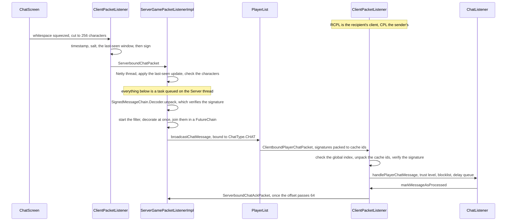
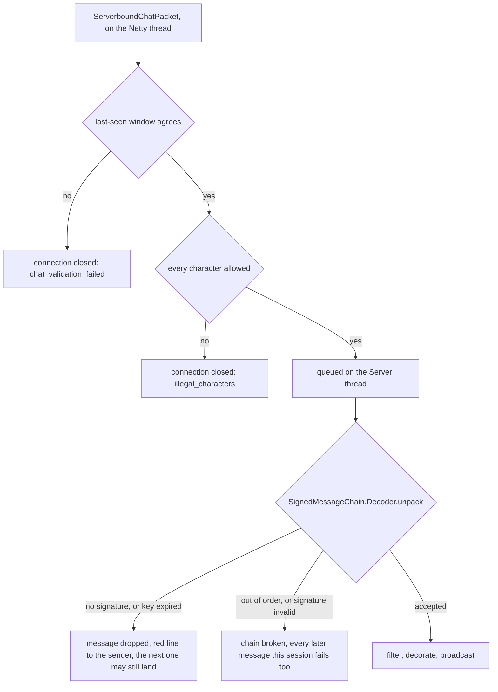

# Chat and signing

> Verified against **Minecraft 26.2** · Part IX · A player presses T, types a line and hits enter: the message is signed on the way out, taken apart on the way in, and verified again by every client that draws it.

A player presses T, types *hey* and hits enter. Before the line leaves the
machine, `ChatScreen.normalizeChatMessage` has squeezed the whitespace and cut
it to 256 characters, and `ClientPacketListener.sendChat` has taken a
timestamp, a random salt and the signatures of the twenty messages the player
most recently saw, and signed all of it with a key Mojang issued to that
account. The server pulls the packet apart on the Netty thread, hands the
cryptography to the Server thread, filters it, decorates it, broadcasts it —
and every receiving client verifies the signature again before drawing a
character. Every one of those steps can say no, and *no* does not mean the
same thing twice. Forge a signature and you stay connected: you get a red line
and your **chain** dies, so everything else you say this session fails too.
Miscount which messages you have *seen* — a number nothing in the game shows
you — and the server closes the connection mid-sentence. **The bookkeeping is
defended harder than the cryptography is**, and that is the right way round.

## The cast

| class | what it decides | thread |
|---|---|---|
| `ServerGamePacketListenerImpl` | the order the checks run in, and which failure closes the connection | Netty for the window, the characters and the chat-visibility refusal, Server for everything after |
| `LastSeenMessagesValidator` | whether the client's twenty-slot acknowledgement still matches the server's mirror | Netty, inside a lock on itself |
| `SignedMessageChain.Decoder` | whether this message continues the sender's chain — and whether the chain survives the answer | Server |
| `PlayerChatMessage` | what a signature covers: the chain link, the content, the timestamp, the salt, the window | wherever a message is built |
| `MessageSignatureCache` | which of those signatures travel as a small index instead of 256 bytes | both sides, one 128-slot cache each |
| `PlayerList` · `OutgoingChatMessage` | who gets a copy, and whether it goes as a signed message or a disguised one | Server |
| `SignedMessageValidator.KeyBased` | whether the receiving client believes the sender said this | Render |
| `ChatTrustLevel` | secure, modified or not secure — the tag drawn beside the line | Render |

## A message is not the text you see

A message on the wire is a `PlayerChatMessage`: a `SignedMessageLink` saying
where in the sender's chain it sits, a `MessageSignature`, a
`SignedMessageBody` of exactly four fields, and — optionally — a `Component`
to display *instead of* the signed string. That `Component` is Part II's
subject ([text components](../foundations/text-components.md)); all this page
needs from it is that it is a different object from the signed text and that
the signature does not cover it. Vanilla's *decorator* never produces one:
`MinecraftServer.getChatDecorator` is hard-coded to `ChatDecorator.PLAIN`, so
`PlayerChatMessage.withUnsignedContent` always finds the decorated copy equal
to the original and drops it. But vanilla sends unsigned content by another
road entirely — `MessageArgument.resolveChatMessage`, the message argument
behind `/msg`, `/say` and `/tell`, sets it on every message it resolves,
because it has expanded the entity selectors in the text. Type a selector into
a whisper and the recipient sees a string the signature does not cover.

## One line, typed and delivered

Four things in that picture are worth naming before the checks are.

**The client signs the conversation, not just the sentence.** The window it
signs is the window it now treats as acknowledged, so the signature binds the
context the sender had in front of them — which is what makes a report show
what a message was a reply *to*.

**The hop is deliberate.** `ServerGamePacketListenerImpl.handleChat` never
calls the usual same-thread guard: the window and the character check run on
the Netty thread, and only then does
`ServerGamePacketListenerImpl.tryHandleChat` post the rest to the server. That
posted task, and the `FutureChain` continuation that joins the text filter to
it, drain with every other queued server task — so a slow filter service
delays delivery by however many ticks it takes
([the server tick](../server/server-tick.md)).

**Decoration is not sequenced after filtering.** The handler starts the filter
future, decorates immediately and synchronously, and only then registers the
continuation that joins the two. A decorator never sees filtered text.

**Broadcast is per recipient, and gated in three places** — two before the
message is built for that player, and `ServerPlayer.shouldFilterMessageTo`
inside it.
`PlayerList.broadcastChatMessage` logs the line — marked *Not Secure* by
`PlayerList.verifyChatTrusted` if it has no signature or has expired — and
then offers it to every player without testing anything. `ServerPlayer` drops
it unless that player's setting is `ChatVisiblity.FULL`;
`OutgoingChatMessage.Player` applies the per-recipient filter mask and skips a
copy that was filtered away entirely, telling the *sender* so. A message whose
sender is `Util.NIL_UUID` is a system message and leaves as an unsigned,
unreportable `ClientboundDisguisedChatPacket` instead.

## Three ways to say no

Those three endings are the whole vocabulary of failure here, and every check
in the next section lands on exactly one of them.

The **message** dies alone: it is dropped, the sender usually gets a red
system line explaining why, and the next thing they send is judged on its own
merits. The **chain** dies for the session: `SignedMessageChain` clears the
link it was going to advance, and from then on no unpack can succeed — the
*chain broken* error if the message is otherwise well-formed, and a missing-key
or expired-key error before that if it is not. Only a
new session key, announced with `ServerboundChatSessionUpdatePacket`, restores
it. The **connection** dies immediately, and the player is back at the
multiplayer list.

## Every check, and what it costs

The first fifteen rows are the server treating the client as the adversary.
The last three are the client treating the server as one — the same design
mirrored, because a server can lie about who said what at least as easily as a
client can.

| the check | what it catches | what dies |
|---|---|---|
| `LastSeenMessagesValidator.applyOffset`, from a chat packet or a bare `ServerboundChatAckPacket` | a client advancing its window past messages the server has not sent it | **connection** |
| `LastSeenMessagesValidator.applyUpdate`, the acknowledged bits | a bit set longer than twenty, one naming a slot the server does not hold, or one un-acknowledging a slot already acknowledged | **connection** |
| `LastSeenMessages.Update.verifyChecksum` | the two sides holding different signatures in slots whose bits agree — a desync the crypto would otherwise report as a bad signature | **connection**, unless the client sent `LastSeenMessages.Update.IGNORE_CHECKSUM` |
| `ServerGamePacketListenerImpl.isChatMessageIllegal`, over `StringUtil.isAllowedChatCharacter` | section signs and control characters — formatting injected into everyone else's chat | **connection** |
| `ServerPlayer.getChatVisibility`, non-commands only | a player who turned chat off and sent a line anyway | **message**, with a red *chat.disabled.options* back to the sender |
| `SignedMessageChain.Decoder.unpack`, no signature present | an unsigned message once a chat session exists — unconditionally, whatever `MinecraftServer.enforceSecureProfile` says, which governs only the decoder used before one does | **message** |
| the same, `ProfilePublicKey.Data.hasExpired` | a session key past its expiry still being used to sign | **message** |
| the same, a timestamp before the last accepted one | a replayed or reordered message from this sender | **chain** |
| the same, `PlayerChatMessage.verify` | content, timestamp, salt or window that do not match the signature — a forgery, or a proxy editing text in flight | **chain** |
| `ServerGamePacketListenerImpl.collectSignedArguments`, an unknown argument name | a client signing arguments of a command the server's own parse does not have | **chain**, broken explicitly |
| the same, a signable argument with no signature | signatures stripped from *some* arguments of a signed command | **message** — the chain is left intact |
| `ServerGamePacketListenerImpl.performUnsignedChatCommand` | a signable command sent down the plain command packet with its signatures removed | **message**, and only when `MinecraftServer.enforceSecureProfile` is on |
| `ServerGamePacketListenerImpl.detectRateSpam`, a `TickThrottler` per player | flooding: each message costs 20 and one point decays per tick | **connection**, except for operators and the singleplayer host |
| `ServerGamePacketListenerImpl.sendPlayerChatMessage`, via `LastSeenMessagesValidator.trackedMessagesCount` | a client that is sent signed messages and never acknowledges them | **connection**, past 4,096 pending |
| `ServerGamePacketListenerImpl.handleChatSessionUpdate` | a key that expires *earlier* than the one it replaces, or one `RemoteChatSession.Data.validate` cannot trace to Mojang's services key | **connection** |
| `ClientPacketListener.handlePlayerChat`, the global index | a server dropping, duplicating or reordering messages beneath the player, which would falsify any report drawn from the log | **connection** |
| `MessageSignature.Packed.unpack` against the client's cache | a server naming a cached signature the client has never held | **connection** |
| `SignedMessageValidator.KeyBased` — expired key, failed signature, or a link that is not `SignedMessageLink.isDescendantOf` the last | a server inventing lines in another player's name | **chain**, latched: the validator never returns to valid |

Two rows want a sentence more. The checksum is the only check in the table a
client may decline: `LastSeenMessages.Update.verifyChecksum` passes anything
when the byte is zero, and a real checksum that computes to zero is bumped to
one so it can never be mistaken for the opt-out — though the vanilla client
never opts out, because `LastSeenMessagesTracker.generateAndApplyUpdate`
always computes one. And *chain broken* is a latch on both sides: the server's
`SignedMessageChain` and the receiving client's
`SignedMessageValidator.KeyBased` both refuse everything afterwards, so one
bad signature costs a sender their voice until a key rotation, not one line.

## Why losing the window is worse than losing the signature

The asymmetry looks backwards until you notice what the window is *for*. The
last-seen list is signed **in full** but sent as `MessageSignature.Packed`
indices into a cache both sides maintain identically. If those caches ever
diverge, the receiver reconstructs a different `SignedMessageBody`, and every
signature after that fails for a reason no cryptographic error message can
explain. There is no recovery from inside: the state is shared, and half of it
is wrong.

So the game ends the connection at the first sign of that divergence, and
`LastSeenMessagesValidator` is written to be suspicious. It rejects an
acknowledgement of a slot it does not hold, an *un*-acknowledgement of a slot
it already acknowledged, a negative offset, an offset larger than the number
of tracked messages outside the window it has
actually sent, and a bit set wider than the window; a checksum mismatch on top
of all that says *the client and server must have desynced* in as many words.

A bad signature is the opposite kind of problem: local, provable and
attributable. One sender is misbehaving, everyone else's conversation is
intact, and the proportionate answer is to stop trusting that sender — not to
end a session for every other player in the room.

**Sixty-four** — the acknowledgement offset a client may accumulate before
`ClientPacketListener.markMessageAsProcessed` sends a bare
`ServerboundChatAckPacket` unprompted. That packet exists so that a player who
only listens never reaches the server's 4,096 pending messages and gets
dropped for saying nothing all evening.

## What the signature covers

`PlayerChatMessage.updateSignature` feeds the signer a version constant, then
the link — sender id, session id, index — then the body: the salt, the
timestamp **in seconds**, the length of the content, the content bytes, the
count of last-seen signatures and each one's raw bytes. Not fed to it: the
decorated `Component`, the `FilterMask`, the `ChatType.Bound` that supplies the
*someone said* wrapper, and the global index the receiving client checks. A
server is free to change any of those. The signature is over what the player
typed and what they had seen when they typed it, and nothing else.

That gap is what `ChatTrustLevel` exists to expose, and it tests for it
crudely on purpose. `ChatTrustLevel.evaluate` calls a message *modified* the
moment the rendered string does not **contain** the signed string — the limb
that catches a server rewriting what someone said. Only if that passes does it
look at style, and only inside the unsigned copy — which vanilla does send,
for any command message carrying a selector. A
message with no signature at all, or one older than seven minutes, is *not
secure* instead. The tag is normally all that happens; with
`Options.onlyShowSecureChat` on, a not-secure message is discarded rather than
drawn — that test runs first, and `Minecraft.isBlocked` and
`Minecraft.isFriendOnlyRestricted` can swallow what survives it.

The session key is signed one level up. `ProfilePublicKey.Data` carries an
expiry, the public key and a signature over the profile id, the expiry **in
milliseconds** and the encoded key, checked against Mojang's services key. The
receiving client allows `ProfilePublicKey.EXPIRY_GRACE_PERIOD` — eight hours —
that the signing chain on the server does not.

## Commands: one signature per argument

`ClientPacketListener.sendCommand` parses the command locally and builds a
`SignableCommand`. If nothing in it needs signing it sends
`ServerboundChatCommandPacket`, which carries the string and nothing else. If
something does, it sends `ServerboundChatCommandSignedPacket` with
`ArgumentSignatures`: one signature per argument, each consuming its own chain
index, all of them sharing one timestamp, salt and window. *Signable* means
the argument type implements `SignedArgument`, and in 26.2 exactly one type
does — `MessageArgument`, behind the message-shaped commands. Its
`MessageArgument.Message.toComponent` is also the one place chat text gets
`ComponentUtils.resolve` run over it, behind a permission, which is why
`/say @a` names people and a chat line saying the same thing does not.

The server re-parses its own copy and looks each signature up **by argument
name**, which is where two rows of the table above come from: a name its parse
does not have breaks the chain outright, while a signable argument the client
left unsigned only fails the command. Both sides cap the shape of the packet
at `ArgumentSignatures.MAX_ARGUMENT_COUNT` — eight — and
`ArgumentSignatures.MAX_ARGUMENT_NAME_LENGTH`, sixteen. Commands run against
their own `TickThrottler`, separate from chat's and with its own threshold. A
command message that ends up with no signed argument is broadcast as a
`ClientboundDisguisedChatPacket`: chat-type decorated, unsigned, unreportable.

## Questions players ask

**What actually makes the "Not Secure" tag appear?** No signature, or a
timestamp more than seven minutes old by the receiving client's clock. The
server calls the same message stale after five, and logs it as *Not Secure*
there too. Two machines whose clocks are a few minutes apart will flag
perfectly honest messages, and the server says so in its log.

**Why does a custom font not flag every line on my server?** Because the style
test only looks inside the unsigned, decorated copy — and vanilla never sends
one. The font check is dead on a vanilla server and live on a server that
decorates. A player's own lines on an integrated server skip both tests and
are secure by definition.

**Can a server delete a message from my chat?** It has the packet for it:
`ClientboundDeleteChatPacket` is registered and handled, and the handler will
pull the line out of the player's own chat-delay queue if their *chatDelay*
option means it has not been drawn yet. Nothing in the game constructs it.

**Why can I report some lines and not others?** `LoggedChatMessage.canReport`
needs a signature from the player being reported, and system messages,
disguised command output and anything a broken chain swallowed carry none.
What a report uploads is the *signed* material — index, session id, timestamp,
salt, the last-seen signatures and the signed content — so it can be
re-verified independently, with
`ChatReportContextBuilder.collectAllContext` walking the last-seen links
backwards for the conversation around it.

**Where does my signing key live?** Nowhere, in a shipped client:
`AccountProfileKeyPairManager` writes the key file only when
`SharedConstants.IS_RUNNING_IN_IDE` and deletes it otherwise, so each launch
re-fetches from the account service — and only if
`ClientboundLoginPacket.onlineMode` said the server was in online mode.

**Why can I not chat here even though nothing is wrong?** `ChatAbilities` and
`ChatRestriction` are a client-side layer the server has no part in: game
options, launcher policy and the account profile each strip permissions
independently, and what survives decides whether this client will send
messages, send commands, or accept player or system messages at all.
`ChatVisiblity` is only the sliver of that the server is told about, and it
has three values, not two — `ChatVisiblity.HIDDEN` still lets action-bar text
through.

**And if somebody's session key fails validation?** Which side notices decides
the cost. On the server it closes the connection. On another client,
`ClientPacketListener.initializeChatSession` merely calls
`PlayerInfo.clearChatSession`, and that player's lines arrive unsigned — taken
and tagged insecure by `SignedMessageValidator.ACCEPT_UNSIGNED`, or refused
by `SignedMessageValidator.REJECT_ALL` where secure profiles are enforced.

## Where to look

`ChatScreen.normalizeChatMessage` · `ClientPacketListener.sendChat` ·
`LastSeenMessagesTracker.generateAndApplyUpdate` ·
`ServerGamePacketListenerImpl.handleChat` ·
`ServerGamePacketListenerImpl.unpackAndApplyLastSeen` ·
`LastSeenMessagesValidator.applyUpdate` ·
`ServerGamePacketListenerImpl.tryHandleChat` · `SignedMessageChain.Decoder` ·
`PlayerChatMessage.updateSignature` · `PlayerList.broadcastChatMessage` ·
`OutgoingChatMessage.create` ·
`ServerGamePacketListenerImpl.sendPlayerChatMessage` ·
`ClientPacketListener.handlePlayerChat` · `MessageSignatureCache.push` ·
`SignedMessageValidator.KeyBased` · `ChatListener.handlePlayerChatMessage` ·
`ChatTrustLevel.evaluate` · `ClientPacketListener.markMessageAsProcessed` ·
`ChatReportContextBuilder.collectAllContext`

---

*Rules: names, never code · how the system works, not how the code reads ·
newest version only · every backticked name passes `tools/verify_names.py`.*
