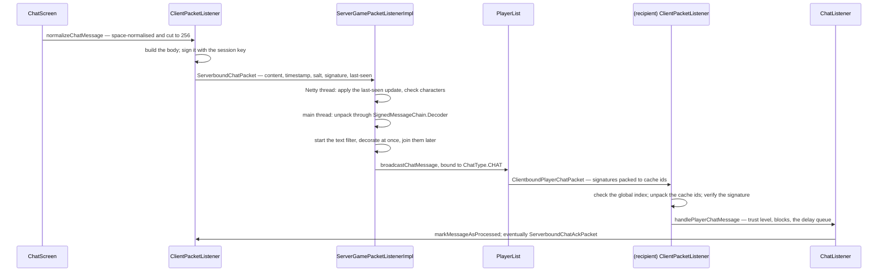

# Chat and signing

> Verified against **Minecraft 26.2** · Part IX · one message: typed, signed, validated, decorated, broadcast, validated again, displayed — and reportable afterwards.

## Responsibility

Chat is the one place where text — a `Component`, the type Part II's
[text components](../foundations/text-components.md) explains — is
**cryptographically attributed**: a message carries a signature
proving that a specific account, in a specific session, said exactly
those characters with exactly that conversational context in front of
them.

The one sentence a player would recognise: *the "Not Secure" tag, and
being able to report someone.*

The headline for a 1.21-era reader: **vanilla never decorates chat.**
`MinecraftServer.getChatDecorator` is hard-coded to
`ChatDecorator.PLAIN`, so the entire decorate-and-re-sign apparatus —
unsigned content on the wire, the *modified* trust level, the hover that
shows you the original — exists purely for servers that are not vanilla.

## The data it owns

### `Component`, in one paragraph

What a `Component` *is* — one `ComponentContents` of seven kinds, one
`Style`, an ordered list of siblings, a single implementation in
`MutableComponent`, the recursive `ComponentSerialization.CODEC` and the
NBT-not-JSON stream codecs — is Part II's
[text components](../foundations/text-components.md). Three of its facts
this page leans on: **components travel as NBT**, and every clientbound
chat packet uses the trusted stream variants that lift the NBT budget
([packets and stream codecs](packets-and-stream-codecs.md)); a data pack
and a server are both refused a `ClickEvent.Action.OPEN_FILE` click event by the same
`ClickEvent.Action.filterForSerialization` validation; and resolution —
turning selectors, scores and NBT paths into text — is
`ComponentUtils.resolve` against a `ResolutionContext`, which **ordinary
chat never runs**: the content of a `ServerboundChatPacket` is a plain
string all the way to `Component.literal`. Commands are the exception —
`MessageArgument.Message.toComponent` expands entity selectors inside a
message argument, behind a permission, which is why `/say @a` names
people and a chat line saying the same thing does not. The resolved text
becomes the message's *unsigned* content.

### Signing

- **`PlayerChatMessage`** — the whole message: a `SignedMessageLink`, a
  `MessageSignature`, a `SignedMessageBody`, an optional unsigned
  (decorated) `Component`, and a `FilterMask`.
- **`SignedMessageBody`** — what is signed: the content string, the
  timestamp, the salt, and the `LastSeenMessages` list.
- **`SignedMessageLink`** — the chain position: an index, the sender's
  id and the session id. `SignedMessageLink.root` starts a chain,
  `SignedMessageLink.advance` moves it on, and
  `SignedMessageLink.isDescendantOf` is the ordering check.
- **`MessageSignature`** — a fixed `MessageSignature.BYTES`, 256 of them,
  written raw with no length prefix. (The decompile never states the
  profile key's modulus; the only RSA size it names,
  `Crypt.ASYMMETRIC_BITS`, belongs to the login handshake and is a
  different key.) `MessageSignature.Packed` is the wire form: a cache
  index, or a marker meaning a full signature follows.
- **`SignedMessageChain`** with its `SignedMessageChain.Encoder` and
  `SignedMessageChain.Decoder`; `SignedMessageChain.DecodeException`
  enumerates every way it can go wrong.
- **`SignedMessageValidator`**, the receiving client's checker, with the
  `SignedMessageValidator.KeyBased` implementation plus the two
  degenerate ones, `SignedMessageValidator.ACCEPT_UNSIGNED` and
  `SignedMessageValidator.REJECT_ALL`.
- **`RemoteChatSession`** (a session id and a `ProfilePublicKey`) and
  **`LocalChatSession`** (a session id and the key pair). The key itself
  is signed by Mojang: `ProfilePublicKey.Data` carries an expiry, the
  key and a signature over both, validated against the services key.
- **`MessageSignatureCache`** — the shared dictionary that keeps full
  signatures off packets by sending an index instead. It holds
  `MessageSignatureCache.DEFAULT_CAPACITY` entries — a hundred and
  twenty-eight, not the twenty of the last-seen window, which is a
  different number for a different job.
- **`ChatType`** — a data-driven pair of `ChatTypeDecoration`s, one for
  display and one for narration, with `ChatType.Bound` carrying the
  resolved sender and target names. The vanilla keys are
  `ChatType.CHAT`, `ChatType.SAY_COMMAND`, `ChatType.EMOTE_COMMAND` and
  the message and team variants. It is a synced registry, so a data pack
  can add one.
- **`FilterMask`** — which characters the server's text filter redacted.

### The last-seen window

`LastSeenMessages` holds up to `LastSeenMessages.LAST_SEEN_MESSAGES_MAX_LENGTH`
signatures — twenty, and the same twenty appears on both sides and in
the bit set on the wire. The client keeps a
`LastSeenMessagesTracker`, a ring of `LastSeenTrackedEntry` with a
running offset; the server keeps a mirror, `LastSeenMessagesValidator`.
`LastSeenMessages.Update` is what crosses: an offset, a twenty-bit
acknowledgement set, and a one-byte checksum — which is optional by
design. `LastSeenMessages.Update.IGNORE_CHECKSUM` is zero and passes
unconditionally, and a real checksum that computes to zero is bumped to
one so it can never be mistaken for the opt-out.

## When it runs

Asymmetrically, and this is where the surprises live.

- **Client `ClientPacketListener.sendChat`** — including the RSA signature — runs on the
  client main thread, straight out of `ChatScreen`.
- **Server `ServerGamePacketListenerImpl.handleChat`** runs on the **Netty event loop**. It
  deliberately does *not* hop: the last-seen validation happens there,
  under a lock, as do the illegal-character and chat-visibility checks.
- **Signature verification** happens on the **server main thread**,
  inside the task that handler schedules.
- **Text filtering** is asynchronous, and ordering is restored by
  `FutureChain`, which runs its continuations on the server executor.
- **Client `ClientPacketListener.handlePlayerChat`** — including RSA verification — runs on
  the client main thread.
- The profile key is fetched on a client IO pool and picked up by
  polling in `ClientPacketListener.tick`; report upload is on another
  pool.

## What is actually signed

`PlayerChatMessage.updateSignature` feeds the signature, in order:

1. a version constant;
2. the link — sender id, session id, index;
3. the body — salt, timestamp **in seconds**, the content length, the
   content bytes, then the count of last-seen signatures followed by
   each one's raw bytes.

So the signature binds the text *and* the conversational context the
sender had in front of them. **Not** signed: the decorated component, the
filter mask, the `ChatType.Bound`, and the global index.

The session key is signed one level up: `ProfilePublicKey.Data` is
verified against Mojang's services key over the profile id, the expiry
**in milliseconds** and the encoded key.

## The trace: one message

Each arrow is a decision.

**The client signs before it sends.** It takes the current time, a random
salt and the current last-seen window, and produces the signature on the
main thread. The window it signs is also the window it now considers
acknowledged. The trimming happens earlier still, and not in the network
code: `ChatScreen` normalises the whitespace and cuts the line to 256
characters before `ClientPacketListener.sendChat` ever sees it, and the
same 256 reappears as the wire cap in the body's own codec.

**The server validates the window before anything else, on the network
thread.** `LastSeenMessagesValidator` checks the offset and the twenty
acknowledgement bits against its own mirror and compares the checksum. A
mismatch is not a rejected message — it is a **disconnect**, because the
two sides' idea of the conversation has diverged and no later signature
could be checked.

**Two of the five failures break the chain; three do not.**
`SignedMessageChain.Decoder` refuses a message for one of five reasons,
and only *out of order* and *invalid signature* call
`SignedMessageChain.Decoder.setChainBroken`. A missing or expired profile key
rejects this message and leaves the next one free to succeed; the
*chain broken* reason is thrown **because** the chain is already broken,
not to break it. Where the chain does break, the sender gets a red
message, stays connected, and has **every subsequent message fail too**
until a new session key resets it. A signed command whose argument names
do not line up breaks the chain explicitly, by the same call.

**Decoration is not sequenced after filtering.** The handler starts the
filter future, decorates *immediately and synchronously*, and only then
registers the continuation that joins the two — so a decorator never sees
filtered text, and a slow filter service delays delivery rather than
decoration.

**Decoration is a no-op in vanilla, and that shows on the wire.**
Because `ChatDecorator.PLAIN` returns the same text,
`PlayerChatMessage.withUnsignedContent` drops the decorated copy
entirely, so vanilla always sends a null unsigned content.

**Broadcast is per recipient, and gated three times in three classes.**
`PlayerList.broadcastChatMessage` logs the line — marked as insecure if
the message has no signature or has expired — and then offers it to
**every** player without testing anything. `ServerPlayer` applies the
chat-visibility setting; `OutgoingChatMessage` applies the per-recipient
filter mask and drops a copy that was filtered away entirely. That last
class is also what chooses the packet: a message whose sender is the nil
id is a *system* message and goes out disguised, unsigned and
unreportable. A recipient whose copy was fully filtered causes the
*sender* to be told so.

**Signatures are packed against the cache.** `SignedMessageBody.pack`
replaces each last-seen signature with a `MessageSignatureCache` index
where it can. Both sides push into their cache identically.

**The receiving client checks an index first.** A gap in the global chat
index is a disconnect; an unknown cache id is a disconnect. Only then is
the signature verified, by `SignedMessageValidator.KeyBased`, whose
failure latches — once a sender's chain is invalid, it stays invalid.

**Display is where trust becomes visible.** `ChatListener` evaluates a
`ChatTrustLevel`, checks the social blocklist and the filter mask, and
tags the line. Then it goes into the chat delay queue, the HUD, the
narrator and the `ChatLog`.

**Acknowledgement is separate from sending.**
`ClientPacketListener.markMessageAsProcessed` advances the tracker, and
when the accumulated offset gets large enough the client sends a bare
`ServerboundChatAckPacket`. A player who only listens still has to
acknowledge, or the server's pending list grows until the connection is
dropped.

## Commands

Commands split into two packets. `ClientPacketListener.sendCommand`
parses locally and builds a `SignableCommand`; if no argument needs
signing it sends `ServerboundChatCommandPacket`, which carries nothing
but the string. If one does, it sends
`ServerboundChatCommandSignedPacket` with `ArgumentSignatures` — **one
signature per argument**, each consuming its own chain index while
sharing a timestamp, salt and window.

"Signable" means the argument type implements `SignedArgument`, and in
26.2 there is exactly one such type: `MessageArgument`, behind the
message-shaped commands. The server re-parses its own copy and looks each
signature up **by argument name**; a name it cannot find breaks the chain
outright, and a second pass then checks that every argument that
*should* have been signed was. There is a ceiling on both sides:
`ArgumentSignatures.MAX_ARGUMENT_COUNT` is eight and
`ArgumentSignatures.MAX_ARGUMENT_NAME_LENGTH` is sixteen. It also refuses an *unsigned*
command that its own parse says should have had signatures — but only
when *enforce-secure-profile* is on. With it off, a stripped `/msg`
simply runs. Both command paths also pass through the same rate
throttles as chat, which exempt operators and the singleplayer host.

A command message with no signed argument becomes a
`ClientboundDisguisedChatPacket`: chat-type decorated, unsigned, and not
reportable.

## Interfaces

- **Called by:** `ChatScreen` and the command dispatcher on the client;
  `ServerGamePacketListenerImpl` and `PlayerList` on the server;
  every system in the game that builds a `Component`.
- **Calls into:** `Signer` and `SignatureValidator` over the JDK's RSA;
  the text filter service; the session service for the profile key.
- **Crosses the network as:** `ServerboundChatPacket`,
  `ServerboundChatCommandPacket`,
  `ServerboundChatCommandSignedPacket`, `ServerboundChatAckPacket`,
  `ServerboundChatSessionUpdatePacket`;
  `ClientboundPlayerChatPacket`, `ClientboundSystemChatPacket`,
  `ClientboundDisguisedChatPacket`, `ClientboundDeleteChatPacket`,
  `ClientboundCustomChatCompletionsPacket`, and the chat-session entry
  in `ClientboundPlayerInfoUpdatePacket`.
- **Data-driven by:** `ChatType`, a synced registry, so a data pack can
  add message formats. The *signing* is not data-driven at all.

## Invariants and surprises

- **Chat sessions are negotiated in the play phase, not at login.** The
  client only fetches a key if `ClientboundLoginPacket` says the server
  is in online mode, and announces it later with
  `ServerboundChatSessionUpdatePacket`. See
  [protocol phases](protocol-phases.md).
- **A signature-cache desync silently invalidates signatures.** The
  last-seen list is *signed in full* but *sent as cache indices*. If the
  two caches diverge, the receiver reconstructs a different body and the
  verification fails with no crypto-level explanation — which is exactly
  why `LastSeenMessages.Update` carries a checksum whose failure message
  is about desynchronisation.
- **The client's private key is only written to disk in a development
  environment.** In a shipped client the key file is deleted on every
  refresh path, so every launch re-fetches from the account service.
- **The trust check is a substring test first and a style test second.**
  `ChatTrustLevel` calls a message *modified* the moment the rendered
  text does not contain the signed text — that is the limb that catches a
  server rewriting what someone said. Only if that passes does it look at
  style, and only inside the *unsigned* copy, which vanilla never sends.
  So the familiar "a custom font flags every line" is true only of a
  server that also decorates. And a player's own lines on an integrated
  server short-circuit to secure without either test.
- **`ClientboundDeleteChatPacket` is never sent by vanilla.** It is
  handled fully — including the deferred deletion of a message too fresh
  to vanish silently — but nothing constructs it.
- **Failing to verify does not disconnect; failing to keep the window in
  sync does.** An invalid signature costs the sender their chain and
  gets them a red message. A last-seen mismatch, a bad chat index, or an
  unknown cache id ends the connection.
- **A silent listener is on a counter, not a timer.** The server tracks
  every signed message it has sent a player and disconnects them once
  more than 4,096 are unacknowledged — which is what the bare
  acknowledgement packet exists to prevent.
- **Signed and unsigned coexist.** Without a session, the encoder
  produces no signature; if `enforce-secure-profile` is off the server
  accepts it, recipients fall back to accepting unsigned messages, and
  the line is tagged insecure. With it on, every such message is
  rejected at the chain.
- **Two different clocks call a message expired.** A message is stale to
  the server after five minutes and to the client after seven, which is
  what drives the "Not Secure" tag and the trust evaluation; a profile
  key is separately checked against its own expiry, with an
  eight-hour grace period on the receiving client that the sending chain
  does not grant. A server whose clock is out of step with a client's
  will flag perfectly good messages, and says so in its log.
- **The client has a whole gating layer of its own.**
  `ChatAbilities` and `ChatRestriction` decide whether a client will
  *accept* player messages, system messages or commands at all — options,
  launcher policy and account profile each strip permissions
  independently — and `GuiMessageSource` then filters what the HUD shows.
  `ChatVisiblity` is only the part of that which the server is told about,
  and it has three values, not two: hidden still lets action-bar text
  through.
- **A broken chain shows up as a message, not a silence.**
  `ChatListener.handleChatMessageError` prints a red validation error with
  its own tag when the sender is unknown or the validator returns nothing
  — and still acknowledges the message, so the window does not drift.
- **Announcing a chat session can itself be fatal.** A session update
  whose key expires *earlier* than the one it replaces is an immediate
  disconnect; a failed validation is another. A successful one resets the
  player's chat state and re-broadcasts the session in the tab-list
  update through the same ordering chain the messages use, so nothing
  in flight is verified against the wrong key.
- **Only signed messages are reportable.** The client's `ChatLog` records
  everything, but a log entry can only be reported if it carries a
  signature from the reported player. System messages never can.
- **A report carries the signed material, not the rendered text.** The
  evidence includes the chain index, session id, timestamp, salt, the
  last-seen signatures and the *signed* content — enough for Mojang to
  re-verify the signature independently and to see the context the
  reporter saw. `ChatReportContextBuilder` walks the last-seen links
  backwards to gather that context.

## Where to look

`ComponentUtils` · `ChatType` · `PlayerChatMessage` ·
`SignedMessageBody` · `SignedMessageLink` · `SignedMessageChain` ·
`SignedMessageValidator` · `MessageSignature` · `MessageSignatureCache`
· `LastSeenMessages` · `LastSeenMessagesValidator` · `RemoteChatSession`
· `ProfilePublicKey` · `ChatListener` · `ChatTrustLevel` ·
`OutgoingChatMessage` · `ChatAbilities` · `ChatRestriction` ·
`ReportingContext`

---

*Rules: names, never code · how the system works, not how the code reads ·
newest version only · every backticked name passes `tools/verify_names.py`.*
