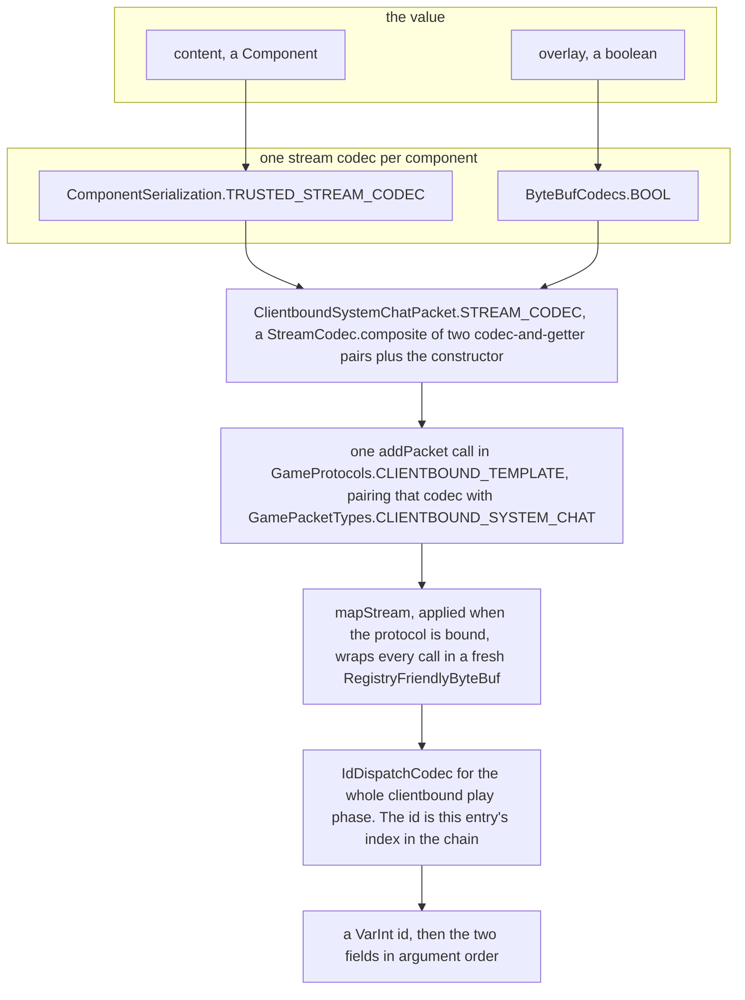
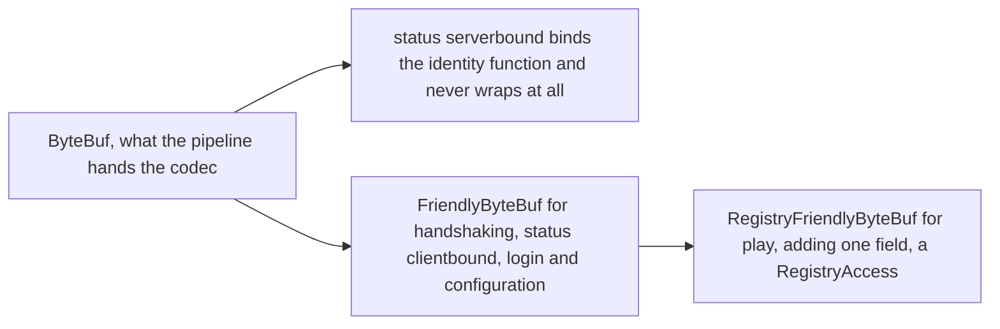

# Packets and stream codecs

> Verified against **Minecraft 26.2** · Part IX · Someone says hello in chat, and you stop the message on its way out of the server to ask what it actually is.

[The connection](the-connection.md) hands you a frame: a length, then a run
of bytes that a handler on a Netty thread is about to turn into a method
call on the other side. This page is what is inside that frame. A chat line
leaving the server is a `ClientboundSystemChatPacket` — a record of a
`Component` and a boolean — and it has no write method, no byte layout of
its own, and no number. The number that goes on the wire in front of it is
written down nowhere in the game: not on the packet, not on its
`PacketType`, not in any table a human maintains. **A packet's id is the
position of one line in a chain of registration calls.** Swap two of those
lines and the whole protocol renumbers — and because a handful of packet
types are registered into several phases, *the same packet type is a
different number in each phase it appears in*.

> **For a 1.21-era reader.** `Packet` no longer knows how to write itself.
> There is no *write* method on the interface and no buffer constructor it
> is obliged to have. Serialisation is a *STREAM_CODEC* static field that
> the protocol description reads — which is why one packet class can have
> two of them, and why a packet class need not own one at all.

## The cast

| class | what it decides | thread |
|---|---|---|
| `Packet` | that a message is a value with a type, one handler method and two flags — and nothing at all about bytes | any |
| `PacketType` | which message this is: a direction and a name, and no number | — |
| `StreamCodec` | one value's bytes — an encoder and a decoder over a `ByteBuf`, composed out of its fields' codecs | Netty |
| `ByteBufCodecs` | the primitive vocabulary every packet codec is built from, and where the read limits sit | Netty |
| `IdDispatchCodec` | one codec for a whole phase: a var-int id, then delegate to the entry that id names | Netty |
| `ProtocolInfo` | what a configured connection holds — the phase, the direction, that one codec, and the bundler | Netty |
| `ProtocolInfoBuilder` | the registration chain, and therefore every packet number in the game | class-load, or the configuration-to-play swap |
| `RegistryFriendlyByteBuf` | that a registry id on the wire means something, by carrying the `RegistryAccess` it is relative to | Netty |

The catalogue of *which* packets exist is generated, not written:
[reference/packets.md](../../reference/packets.md) lists all 232 packet
types across the eight `*PacketTypes` classes that declare them.

## A packet is a value, a name and a direction

`Packet` is an interface with four methods and one static helper.

| member | what it says |
|---|---|
| `Packet.type` | the `PacketType`, always a constant from one of the eight `*PacketTypes` classes |
| `Packet.handle` | hands this packet to one named method on the phase's listener interface |
| `Packet.isSkippable` | default false. True for the chat-shaped packets, so a failure to encode one is dropped rather than fatal |
| `Packet.isTerminal` | default false. True for the seven packets that end a protocol phase |
| `Packet.codec` | a static convenience: `StreamCodec.ofMember` under a friendlier name |

Exactly one packet refuses to be handled at all: `BundleDelimiterPacket`
makes `Packet.handle` final and throws, because a delimiter is consumed by
the pipeline and must never reach a listener. The skippable set is the five
chat-shaped packets — `ClientboundSystemChatPacket`,
`ClientboundPlayerChatPacket`, `ClientboundDisguisedChatPacket`,
`ClientboundPlayerCombatKillPacket` and `ClientboundTagQueryPacket`. The
terminal set is exactly the seven transition packets drawn on
[protocol phases](protocol-phases.md) and no others; what the flag *does*
to the pipeline is [the connection](the-connection.md)'s business. Beware
the namesake: `ServerboundResourcePackPacket.Action.isTerminal` asks
whether a resource-pack *response* is a final answer, and that packet is
not terminal.

**`PacketType` is a record of two things** — a `PacketFlow` and an
`Identifier`. A direction and a name; no number, no version, no size.
`PacketFlow` is the two-constant enum `PacketFlow.SERVERBOUND` /
`PacketFlow.CLIENTBOUND`, with `PacketFlow.getOpposite` and
`PacketFlow.id`.

Two shapes of packet class coexist in the tree. The modern one is a record
whose *STREAM_CODEC* is a `StreamCodec.composite` naming each component's
codec and accessor — `ClientboundSystemChatPacket` is one. The older one is
a plain class with a private buffer constructor and a private write method,
joined into a codec by `Packet.codec`; `ServerboundSwingPacket`,
`ClientboundKeepAlivePacket` and `ClientboundSetHealthPacket` are these,
and `StreamMemberEncoder` exists solely so that second form can bind a
member reference as its encoder half.

## From two fields to a numbered blob

Read it downwards and you have the page. **Nothing above the
`ProtocolInfoBuilder.addPacket` line knows anything about ids**, and
nothing below it knows anything about chat.

**One codec serves an entire phase.** `ProtocolInfo.codec` is a single
`StreamCodec` — an `IdDispatchCodec` — and not a table the encoder walks:
encoding looks the `PacketType` up in a map, and a type never registered
in *this* protocol is an encoder error naming the unknown packet, which is
how a configuration-phase packet sent during play fails. Decoding reads the
id, bounds-checks it and delegates — and then **must have consumed the
frame exactly**, or `PacketDecoder` raises an error naming how many bytes
were left over. An under-read corrupts nothing visible until much later, so
it is caught at the one point where the answer is still knowable. All of
that runs on the Netty event loop, inside `PacketEncoder` and
`PacketDecoder`, never on a game thread; the framing, the compression, the
ciphers and the later hop to the game thread are
[the connection](the-connection.md)'s.

## The codec layer is small, and composition is all of it

`net/minecraft/network/codec` is a handful of files and does every byte of
the work. `StreamCodec` is one interface extending `StreamEncoder` and
`StreamDecoder`, so `StreamEncoder.encode` takes a buffer and a value and
`StreamDecoder.decode` takes a buffer and returns one. It is deliberately
*not* a `Codec`: a packet is written once, read once and must be small, so
it gets hand-laid bytes rather than a document in some format — the
distinction is [codecs, NBT and
JSON](../foundations/codecs-nbt-json.md)'s.

The constructors and combinators are `StreamCodec.of`,
`StreamCodec.ofMember`, `StreamCodec.unit`, `StreamCodec.map`,
`StreamCodec.mapStream`, `StreamCodec.apply`, `StreamCodec.dispatch`,
`StreamCodec.recursive` and `StreamCodec.cast` — plus
**`StreamCodec.composite` in twelve arities**, one through twelve pairs of
codec and getter followed by a constructor. Fields encode and decode
strictly in argument order, and *that ordering is the format
specification*: there is no other statement anywhere of what a packet's
bytes look like. `StreamCodec.CodecOperation` lets `StreamCodec.apply` read
left to right, and `StreamCodec.dispatch` is how registry-dispatched values
travel — `ConsumeEffect.STREAM_CODEC`, `SlotDisplay.STREAM_CODEC` and
`RecipeDisplay.STREAM_CODEC` are built with it.

`ByteBufCodecs` is the primitive library underneath: SCREAMING\_CASE
constants for the fixed things, lowerCamel factories for the parameterised
ones.

| what | the names |
|---|---|
| numbers | `ByteBufCodecs.BOOL`, `ByteBufCodecs.BYTE`, `ByteBufCodecs.SHORT`, `ByteBufCodecs.UNSIGNED_SHORT`, `ByteBufCodecs.INT`, `ByteBufCodecs.VAR_INT`, `ByteBufCodecs.LONG`, `ByteBufCodecs.VAR_LONG`, `ByteBufCodecs.FLOAT`, `ByteBufCodecs.DOUBLE` |
| bytes and text | `ByteBufCodecs.BYTE_ARRAY`, `ByteBufCodecs.LONG_ARRAY`, `ByteBufCodecs.STRING_UTF8`, `ByteBufCodecs.byteArray`, `ByteBufCodecs.stringUtf8`, `ByteBufCodecs.PLAYER_NAME` |
| tags and JSON | `ByteBufCodecs.TAG`, `ByteBufCodecs.COMPOUND_TAG`, `ByteBufCodecs.TRUSTED_TAG`, `ByteBufCodecs.TRUSTED_COMPOUND_TAG`, `ByteBufCodecs.lenientJson` |
| shapes and identities | `ByteBufCodecs.VECTOR3F`, `ByteBufCodecs.QUATERNIONF`, `ByteBufCodecs.RGB_COLOR`, `ByteBufCodecs.CONTAINER_ID`, `ByteBufCodecs.GAME_PROFILE`, `ByteBufCodecs.GAME_PROFILE_PROPERTIES` |
| structure | `ByteBufCodecs.optional`, `ByteBufCodecs.collection`, `ByteBufCodecs.list`, `ByteBufCodecs.map`, `ByteBufCodecs.either`, `ByteBufCodecs.lengthPrefixed` |
| registries | `ByteBufCodecs.idMapper`, `ByteBufCodecs.registry`, `ByteBufCodecs.holder`, `ByteBufCodecs.holderRegistry`, `ByteBufCodecs.holderSet` |

Two are worth naming for what they encode rather than for what they are.
`ByteBufCodecs.ROTATION_BYTE` is one byte meaning 1/256 of a full turn — a
little over a degree, with `Mth.packDegrees` and `Mth.unpackDegrees` doing
the arithmetic — and `ByteBufCodecs.OPTIONAL_VAR_INT` spends zero for
absent and value-plus-one otherwise.

The bridge to the disk-and-JSON codecs of Part II is
`ByteBufCodecs.fromCodec` and its relatives, which run an ordinary `Codec`
into a carrier format and put the result on the wire. The combinator
underneath takes the ops as an argument and is format-agnostic, but all
four public entry points pass the NBT ops, so in practice **a `Codec` on
the wire means a compound tag**. Beneath it, `ByteBufCodecs.tagCodec` takes
an `NbtAccounter` supplier — which is exactly what *trusted* turns out to
mean, below.

`IdDispatchCodec` is the class that makes a protocol out of a pile of
codecs: a list of serialisers, a type-to-int map, a var-int written in
front and a delegation behind it. `IdDispatchCodec.DontDecorateException`
is the marker meaning *rethrow me as I am, do not wrap me*, and
`IdDispatchCodec.Builder.build` refuses a duplicate `PacketType` outright,
so registering one type twice in a protocol is a class-load failure rather
than a silently shadowed id.

## Which buffer, and why play needs its own

`FriendlyByteBuf` is a `ByteBuf` decorator carrying a hundred convenience
readers and writers — `FriendlyByteBuf.readVarInt`,
`FriendlyByteBuf.writeUtf`, `FriendlyByteBuf.readIdentifier`,
`FriendlyByteBuf.writeResourceKey`, `FriendlyByteBuf.readNbt`,
`FriendlyByteBuf.readCollection`, `FriendlyByteBuf.readEnumSet`,
`FriendlyByteBuf.readBlockPos`, `FriendlyByteBuf.readBlockHitResult`,
`FriendlyByteBuf.readWithCodec` and so on. It holds the two length
constants `FriendlyByteBuf.MAX_STRING_LENGTH` and
`FriendlyByteBuf.MAX_COMPONENT_STRING_LENGTH`, and also
`FriendlyByteBuf.limitValue`, the wrapper an old-style packet puts round a
collection constructor to get the cap `ByteBufCodecs.collection` gives for
free.

**`RegistryFriendlyByteBuf` extends it and adds exactly one field**, a
`RegistryAccess`, behind `RegistryFriendlyByteBuf.registryAccess`. It
exists because a numeric registry id means nothing on its own — item number
37 is only an item relative to the registry set the server sent during
configuration ([identifiers and
registries](../foundations/identifiers-and-registries.md)). Every codec
that writes a registry id needs one: `ByteBufCodecs.registry`,
`ByteBufCodecs.holderRegistry`, `ByteBufCodecs.holder`,
`ByteBufCodecs.holderSet`, `ByteBufCodecs.fromCodecWithRegistries` and
`ByteBufCodecs.registryFriendlyLengthPrefixed` — and therefore
`ItemStack.STREAM_CODEC`, `DataComponentPatch.STREAM_CODEC`
([data components](../foundations/data-components.md)),
`ComponentSerialization.STREAM_CODEC` and `HashedStack.STREAM_CODEC`. The
wrapper is a throwaway, not a pipeline object: `ProtocolInfoBuilder`
applies the decorator — `RegistryFriendlyByteBuf.decorator` for play —
through `StreamCodec.mapStream`, so a fresh view is constructed round the
raw buffer on every single encode and every single decode.

Below all of it the actual encodings live in `VarInt`, `VarLong`,
`Utf8String` and `LpVec3`, the quantised position behind
`Vec3.LP_STREAM_CODEC`. Two everyday values are worth naming because they
are *not* special-cased: `Identifier.STREAM_CODEC` is a plain UTF-8 string
under the ordinary 32,767-character cap — an identifier on the wire is
text, never an interned number — and `UUIDUtil.STREAM_CODEC` is two longs.

## Where a packet's number comes from

`ProtocolInfo` is what a configured connection actually holds:
`ProtocolInfo.id` (a `ConnectionProtocol`), `ProtocolInfo.flow`,
`ProtocolInfo.codec` — the single phase-wide `StreamCodec` — and a nullable
`ProtocolInfo.bundlerInfo`. It is built by `ProtocolInfoBuilder`, whose
`ProtocolInfoBuilder.addPacket` and `ProtocolInfoBuilder.withBundlePacket`
are the registration calls and whose `ProtocolInfoBuilder.buildUnbound`
yields an `UnboundProtocol` or a `SimpleUnboundProtocol` — a protocol that
knows everything except which buffer type to wrap the bytes in.
`UnboundProtocol.bind` supplies that. Underneath it, `ProtocolCodecBuilder`
is the layer that talks to `IdDispatchCodec`.

**The id is a registration index.** `ProtocolCodecBuilder.add` appends to a
list and `IdDispatchCodec.Builder.build` walks that list assigning 0, 1, 2
in call order, so a packet's wire number is literally its position in the
`ProtocolInfoBuilder.addPacket` chain in `GameProtocols`,
`ConfigurationProtocols`, `LoginProtocols`, `StatusProtocols` or
`HandshakeProtocols`. `ProtocolCodecBuilder.add` also asserts that the
type's `PacketFlow` matches the protocol's, so a clientbound type cannot be
registered into a serverbound protocol.

Those numbers are readable from outside for one reason.
`ProtocolInfo.DetailsProvider` and `ProtocolInfo.Details` let tooling
enumerate a phase, and `ProtocolInfo.Details.listPackets` hands a
`ProtocolInfo.Details.PacketVisitor` each `PacketType` with its network id.
The tooling is the data generator: `PacketReport` walks every template and
writes every packet's id in every phase into a report — the only place in
the project those numbers are written down.

There are four registration entry points, one per direction and per
context-or-not: `ProtocolInfoBuilder.serverboundProtocol`,
`ProtocolInfoBuilder.clientboundProtocol`,
`ProtocolInfoBuilder.contextServerboundProtocol` and
`ProtocolInfoBuilder.contextClientboundProtocol`. The context ones let a
codec ask the *connection* a question, and in 26.2 exactly one protocol
uses one: `GameProtocols.SERVERBOUND_TEMPLATE`, whose context is
`GameProtocols.Context` and whose only question is
`GameProtocols.Context.hasInfiniteMaterials`. Every other template is a
`SimpleUnboundProtocol`; `CodecModifier` is the hook a context-aware codec
is installed through.

**When the description is built** splits the same way. Handshaking, status,
login and configuration bind their buffers eagerly at class-load — and the
serverbound status protocol binds the identity function, so it is the one
phase and direction that never wraps its bytes at all. Play binds **per
connection**, at the configuration-to-play transition: on the client that
really is the first moment a `RegistryAccess` exists, while on the server
the registries have been loaded since startup and the rebind happens
because the protocol changed, not because the registries arrived.

## A bundle is two empty markers round ordinary packets

`ClientboundBundlePacket` has a `PacketType` and **no wire id at all**.
`ProtocolInfoBuilder.withBundlePacket` registers only the *delimiter*,
`ClientboundBundleDelimiterPacket`, serialised with `StreamCodec.unit` — an
id and a zero-byte body — and records a `BundlerInfo` beside the codec
list, so a bundle on the wire is two empty markers with ordinary,
individually numbered packets between them. `PacketBundleUnpacker` explodes
an outgoing bundle into delimiter-packets-delimiter and
`PacketBundlePacker` collects an incoming run back up; `BundlePacket` holds
the sub-packets, `BundlerInfo.Bundler` the logic, and
`BundlerInfo.BUNDLE_SIZE_LIMIT` caps a bundle at 4,096 sub-packets. Only
the clientbound play protocol declares a bundle at all.

**What a bundle buys is atomicity against the client's tick.**
`ClientPacketListener.handleBundlePacket` hops to the main thread once for
the whole bundle and then handles the sub-packets inline, so the client can
never tick or render with half a bundle applied. There are only two
senders, both in `ServerEntity`: `ServerEntity.addPairing`, which collects
what `ServerEntity.sendPairingData` writes into a list and sends the result
as one bundle, so an entity never appears mid-initialisation ([what the
client is told](what-the-client-is-told.md)); and the motion-plus-power
pair sent for a hurtling projectile.

## What stops a hostile sender

The frame limit does most of the work, and it is not on this page: a frame
length is at most three var-int bytes, and `Varint21FrameDecoder` refuses a
wider prefix or a zero length before any codec sees anything
([the connection](the-connection.md)). Above that sit two separate
collection defences, and only the second is famous.
`ByteBufCodecs.readCount` is the first — it compares the declared count
against the codec's own maximum and refuses outright, which is what makes
the three-argument `ByteBufCodecs.collection` different from the
two-argument one whose maximum is effectively unbounded. Behind it,
`ByteBufCodecs.MAX_INITIAL_COLLECTION_SIZE` clamps the *allocation* to
65,536 entries whatever the count says, so even an accepted count cannot
force a huge array up front. `ByteBufCodecs.lengthPrefixed` bounds the
bytes instead of the count, handing the inner codec a slice it physically
cannot read past.

*Trusted* is a real distinction in the codec library, and a statement about
the read budget rather than about direction:
`ByteBufCodecs.fromCodecTrusted` gives the NBT reader an unlimited heap
quota where plain `ByteBufCodecs.fromCodec` gives it the default. Hence the
pairs `ByteBufCodecs.TAG` / `ByteBufCodecs.TRUSTED_TAG`,
`ByteBufCodecs.COMPOUND_TAG` / `ByteBufCodecs.TRUSTED_COMPOUND_TAG` and
`ComponentSerialization.STREAM_CODEC` /
`ComponentSerialization.TRUSTED_STREAM_CODEC`. The rule is direction: the
server wrote it, so the client may trust it ([codecs, NBT and
JSON](../foundations/codecs-nbt-json.md) has the serverbound half).

**Exactly one packet lets a client hand the server an arbitrary item**, and
it is fenced three ways. `ServerboundSetCreativeModeSlotPacket` uses
`ItemStack.OPTIONAL_UNTRUSTED_STREAM_CODEC`, which differs from the
ordinary one only in using `DataComponentPatch.DELIMITED_STREAM_CODEC`:
every component's payload is length-prefixed, and
`ByteBufCodecs.lengthPrefixed` hands the inner codec a slice and advances
the outer reader past the whole region before delegating, so a component
that lies about its own length cannot mis-frame the ones after it. That is
containment, not recovery — nothing catches a component that throws, and
one bad component still fails the whole packet. It is then wrapped in
`ItemStack.validatedStreamCodec`, which re-encodes the decoded stack
against `NullOps` purely to collect its errors. And the registration
carries `GameProtocols.HAS_INFINITE_MATERIALS`, a `CodecModifier` that
refuses the packet whenever its context says the connection is not in
creative — a `SkipPacketDecoderException` one way and a
`SkipPacketEncoderException` the other, landing on one side only because
the client's context answers `GameProtocols.Context.hasInfiniteMaterials`
true unconditionally while the server's answers from the real player. The
packet is refused **in the decoder**, before any handler exists to fool.

The ordinary container click is defended by carrying nothing to validate.
`ServerboundContainerClickPacket` sends a `HashedStack` — either
`HashedStack.EMPTY` or `HashedStack.ActualItem`, with an item holder, a
count and a `HashedPatchMap`, itself two halves rather than one:
`HashedPatchMap.addedComponents`, a map of component type to a hash, and
`HashedPatchMap.removedComponents`, a bare set. A removal is as much a part
of the claim as an addition, and `HashedStack.matches` checks both.
Client-supplied component *contents* never cross the wire at all; see
[containers and menus](../items/containers-and-menus.md).

The limits in one table:

| limit | value | where |
|---|---|---|
| frame length prefix | three var-int bytes | `Varint21FrameDecoder` |
| compressed frame | 2 MiB | `CompressionDecoder.MAXIMUM_COMPRESSED_LENGTH` |
| decompressed frame | 8 MiB | `CompressionDecoder.MAXIMUM_UNCOMPRESSED_LENGTH` |
| default string | 32,767 chars | `FriendlyByteBuf.MAX_STRING_LENGTH` |
| component as string | 262,144 | `FriendlyByteBuf.MAX_COMPONENT_STRING_LENGTH` |
| player name | 16 | `ByteBufCodecs.PLAYER_NAME` |
| collection allocation | 65,536 | `ByteBufCodecs.MAX_INITIAL_COLLECTION_SIZE` |
| sub-packets in a bundle | 4,096 | `BundlerInfo.BUNDLE_SIZE_LIMIT` |
| slots in one click | 128 | `ServerboundContainerClickPacket.MAX_SLOT_COUNT` (named, but the codec passes the literal) |
| var-int / var-long | 5 / 10 bytes | `VarInt.read`, `VarLong.read` |

## Custom payloads, the only extension point

The packet set is code, fixed at compile time, and no data pack adds to it.
The one seam is `CustomPacketPayload`, with `CustomPacketPayload.Type`,
`CustomPacketPayload.createType` and `CustomPacketPayload.codec`, carried
by `ClientboundCustomPayloadPacket` and `ServerboundCustomPayloadPacket`.
The route in is `CustomPacketPayload.FallbackProvider`, the codec handed to
the dispatch as the map miss, with `CustomPacketPayload.TypeAndCodec` as
the registration pair; `BrandPayload` is vanilla's own use of the
mechanism.

An unrecognised payload decodes to `DiscardedPayload` — a record of the
identifier and **nothing else**. Its decoder checks the remaining length
against a per-direction maximum and then skips every byte, and its encoder
writes nothing. The payload is discarded, not held.

## Questions players ask

**Why do packet ids move — between versions, and between phases?** Because
nobody chose them. They are indexes into a registration chain, so inserting
one line in `GameProtocols` shifts every packet declared after it, and the
*common*, *cookie* and *ping* types, registered into several phases, count
from zero again in each. A `PacketType` is a name and a direction; a number
is a property of a phase, not of a type — which is why nothing in the game
reads a packet number as a constant, and why `PacketReport` is the only
place they are ever written out.

**Why can one packet class have several codecs?**
`ClientboundCustomPayloadPacket` declares
`ClientboundCustomPayloadPacket.GAMEPLAY_STREAM_CODEC` and
`ClientboundCustomPayloadPacket.CONFIG_STREAM_CODEC`;
`ClientboundShowDialogPacket` declares
`ClientboundShowDialogPacket.STREAM_CODEC` and
`ClientboundShowDialogPacket.CONTEXT_FREE_STREAM_CODEC`. The same
`PacketType` is registered with the first in `GameProtocols` and with the
second in `ConfigurationProtocols`. Type and encoding are genuinely
separate things.

**Why does a malformed chat message not disconnect me?** Because
`SkipPacketException` is a marker and the skip is a decision two layers up.
`SkipPacketEncoderException` and `SkipPacketDecoderException` implement it
and `IdDispatchCodec.DontDecorateException`; `PacketEncoder` turns a
failure on a `Packet.isSkippable` packet into one; `PacketDecoder` drains
the rest of the frame and **rethrows**, because the frame was already
delimited and nothing was ever misaligned, so the drain only satisfies
Netty's bookkeeping. What keeps the connection alive is
`Connection.exceptionCaught` logging it and returning
([the connection](the-connection.md)).

**Is a modern packet safer than an old one?** Measurably.
`FriendlyByteBuf.readCollection` applies its constructor to the raw decoded
count with no cap of its own, so only the frame limit bounds it, where
`ByteBufCodecs.collection` refuses the count and then clamps the
allocation. The hand-written shape is still in the tree, and
`FriendlyByteBuf.limitValue` is what one of those must remember to use.

Which packets a phase registers, and in what order, is therefore the whole
definition of that phase — so the next page is [protocol
phases](protocol-phases.md), where five codec tables become five languages
one connection speaks in turn.

## Where to look

`Packet` · `PacketType` · `PacketFlow` · `StreamCodec` · `ByteBufCodecs` ·
`IdDispatchCodec` · `ProtocolInfo` · `ProtocolInfoBuilder` ·
`ProtocolCodecBuilder` · `GameProtocols` · `GamePacketTypes` ·
`FriendlyByteBuf` · `RegistryFriendlyByteBuf` · `VarInt` · `BundlerInfo` ·
`PacketBundlePacker` · `CustomPacketPayload` · `HashedStack` ·
`PacketReport`

---

*Rules: names, never code · how the system works, not how the code reads ·
newest version only · every backticked name passes `tools/verify_names.py`.*
