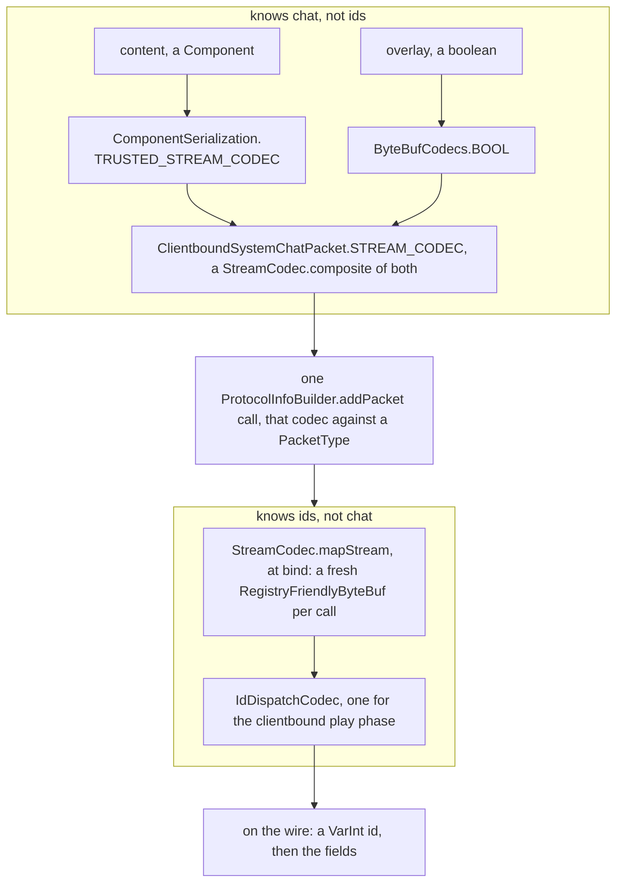

# Packets and stream codecs

> Verified against **Minecraft 26.3** · Part IX · What the thing crossing the wire is: a value with no bytes, a number nobody chose, and the limits that stop a hostile sender.

[The connection](the-connection.md#one-packet-there-and-one-back) hands you a frame: a length, then a run
of bytes that a handler on a Netty thread is about to turn into a method
call on the other side. This page is what is inside that frame. A chat line
leaving the server is a `ClientboundSystemChatPacket` — a record of a
`Component` and a boolean — and it has no write method, no byte layout of
its own, and no number. The number that goes on the wire in front of it is
written down nowhere in the game: not on the packet, not on its
`PacketType`, not in any table a human maintains. **A packet's id is the
position of one line in a chain of registration calls.** Insert or remove one of
those lines and every packet after it renumbers — and because two dozen packet
types are registered into several phases, *the same packet type is a
different number in each phase it appears in*.

## The cast

| class | what it decides | thread |
|---|---|---|
| `Packet` | that a message is a value with a type, one handler method and two flags — and nothing at all about bytes | any |
| `PacketType` | which message this is: a direction and a name, and no number | — |
| `StreamCodec` | one value's bytes — an encoder and a decoder over a `ByteBuf`, composed out of its fields' codecs | Netty |
| `ByteBufCodecs` | the primitive vocabulary the packet codecs are built from, and where the read limits sit | Netty |
| `IdDispatchCodec` | one codec for a whole phase: a var-int id, then delegate to the entry that id names | Netty |
| `ProtocolInfo` | what a configured connection holds — the phase, the direction, that one codec, and the bundler | Netty |
| `ProtocolInfoBuilder` | the registration chain, and therefore every packet number in the game | class-load, or the configuration-to-play swap |
| `RegistryFriendlyByteBuf` | that a registry id on the wire means something, by carrying the `RegistryAccess` it is relative to | Netty |

The catalogue of *which* packets exist is generated, not written:
[reference/packets.md](../../reference/packets.md) lists all 235 packet
types across the eight `*PacketTypes` classes that declare them.

## A packet is a value, a name and a direction

`Packet` is an interface with four methods and one static helper.

| member | what it says |
|---|---|
| `Packet.type` | the `PacketType`, always a constant from one of the eight `*PacketTypes` classes |
| `Packet.handle` | hands this packet to one named method on the phase's listener interface — see below |
| `Packet.isSkippable` | default false. True for five packets, so a failure to encode one is dropped rather than fatal |
| `Packet.isTerminal` | default false. True for the seven packets that end a protocol phase |
| `Packet.codec` | a static convenience: `StreamCodec.ofMember` under a friendlier name |

Exactly one family of packets refuses to be handled at all:
`BundleDelimiterPacket` makes `Packet.handle` final and throws, because a
delimiter is consumed by the pipeline and must never reach a listener. It is
abstract and has one subclass, `ClientboundBundleDelimiterPacket`, which is
the one that is actually registered — see *a bundle is two empty markers*,
below. The skippable set is five packets, and what they share is not chat: each
carries a payload composed at run time from data rather than assembled from
fixed fields — a `Component` in four of them
(`ClientboundSystemChatPacket`, `ClientboundPlayerChatPacket`,
`ClientboundDisguisedChatPacket` and `ClientboundPlayerCombatKillPacket`, the
death message) and an arbitrary `CompoundTag` in the fifth,
`ClientboundTagQueryPacket`, which answers the debug key that copies a
targeted block or entity with its data. Those are the payloads
likeliest to fail to encode, and the five whose failure to encode a connection survives. The
terminal set is exactly the seven transition packets drawn on
[protocol phases](protocol-phases.md#the-five-phases) and no others; what the
flag *does* to the pipeline is the business of [the
connection](the-connection.md#what-a-terminal-packet-does-to-the-codecs). Beware
the namesake: `ServerboundResourcePackPacket.Action.isTerminal` asks
whether a resource-pack *response* is a final answer, and that packet is
not terminal.

**The interface `Packet.handle` targets is per phase and per direction**, and
those interfaces are the quietest large family in the part: `ClientGamePacketListener`
and `ServerGamePacketListener` are the two big ones — one method per packet,
which is why the play pair declares nearly two hundred methods — with
`ClientCommonPacketListener` and `ServerCommonPacketListener` above them and a
pair each for status, login, configuration, cookie and ping. Handshake has only
a serverbound one, and every phase's interface is rooted in
`ClientboundPacketListener` or `ServerboundPacketListener`. Beyond
`ServerPacketListener`'s error policy, each phase's interface naming its
protocol and the two roots their direction, nothing in them decides anything: they are the vocabulary a phase's `*Impl` class
promises to implement, and a packet arriving at a listener that implements the
wrong one is the failed class cast and *invalid_packet* kick
[the connection](the-connection.md#one-packet-there-and-one-back) describes
([protocol phases](protocol-phases.md#the-five-phases) tabulates which `*Impl`
serves which phase).

**`PacketType` is a record of two things** — a `PacketFlow` and an
`Identifier`. A direction and a name; no number, no version, no size.
`PacketFlow` is the two-constant enum `PacketFlow.SERVERBOUND` /
`PacketFlow.CLIENTBOUND`, with `PacketFlow.getOpposite` and
`PacketFlow.id`.

Three shapes of packet class coexist in the tree, and two of them carry the
argument. The modern one is a record
whose *STREAM_CODEC* is a `StreamCodec.composite` naming each component's
codec and accessor — `ClientboundSystemChatPacket` is one. The older one is
a plain class with a private buffer constructor and a private write method,
joined into a codec by `Packet.codec`; `ClientboundKeepAlivePacket` and
`ClientboundSetHealthPacket` are these,
and `StreamMemberEncoder` exists chiefly so that second form can bind a
member reference as its encoder half — `CustomPacketPayload`, `DisplayInfo` and
`TrackedWaypoint` bind one too. The third shape is the one with no fields to serialise at all:
fifteen packet classes that declare a `StreamCodec.unit` codec, every one but
`ServerboundPlayerLoadedPacket` a singleton (the bundle delimiter is handed
one by `ProtocolInfoBuilder.withBundlePacket`), of which
`ServerboundFinishConfigurationPacket` is the one this part's login trace
turns on.

## From two fields to a numbered blob

```mermaid
flowchart TD
    subgraph V["knows chat, not ids"]
      direction TB
      F1["content, a Component"]
      F2["overlay, a boolean"]
      SC1["ComponentSerialization.<br/>TRUSTED_STREAM_CODEC"]
      SC2["ByteBufCodecs.BOOL"]
      COMP["ClientboundSystemChatPacket.STREAM_CODEC, a StreamCodec.composite of both"]
      F1 --> SC1
      F2 --> SC2
      SC1 --> COMP
      SC2 --> COMP
    end
    COMP --> ENTRY["one ProtocolInfoBuilder.addPacket call, that codec against a PacketType"]
    subgraph I["knows ids, not chat"]
      direction TB
      WRAP["StreamCodec.mapStream, at bind: a fresh RegistryFriendlyByteBuf per call"]
      DISP["IdDispatchCodec, one for the clientbound play phase"]
      WRAP --> DISP
    end
    ENTRY --> I
    DISP --> OUT["on the wire: a VarInt id, then the fields"]
```

*How one packet class is assembled, cut at the line the section is about:
above it nothing knows an id, below it nothing knows chat. This is the order
things are **built** in — at send time the `IdDispatchCodec` runs outermost,
writing the id and then handing the value back up to the composite codec.*

Read it downwards and you have the page. **Nothing above the
`ProtocolInfoBuilder.addPacket` line knows anything about ids**, and
nothing below it knows anything about chat.

**One codec serves an entire phase.** `ProtocolInfo.codec` is a single
`StreamCodec` — an `IdDispatchCodec` — and not a table the encoder walks:
encoding looks the `PacketType` up in a map, and a type never registered
in *this* protocol is an encoder error naming the unknown packet, which is
how a configuration-phase packet sent during play fails. Decoding reads the
id, bounds-checks it and delegates — and then **must have consumed the
frame exactly**, or `PacketDecoder` raises an error naming how many bytes
were left over. The check sits where the frame's length is still
known. All of
that runs on the Netty event loop, inside `PacketEncoder` and
`PacketDecoder`, never on a game thread; the framing, the compression, the
ciphers and the later hop to the game thread belong to
[the connection](the-connection.md#the-pipeline-in-both-directions).

## The codec layer is small, and composition is all of it

`net/minecraft/network/codec` is a handful of files and does all of the
composing; the byte-level encodings themselves live outside it, and are
named below. `StreamCodec` is one interface extending `StreamEncoder` and
`StreamDecoder`, so `StreamEncoder.encode` takes a buffer and a value and
`StreamDecoder.decode` takes a buffer and returns one. It is deliberately
*not* a `Codec`: a packet is written once, read once and must be small, so
it gets hand-laid bytes rather than a document in some format — the
distinction belongs to [codecs, NBT and
JSON](../foundations/codecs-nbt-json.md#one-abstraction-and-the-ops-that-are-not-formats).

The constructors and combinators are `StreamCodec.of`,
`StreamCodec.ofMember`, `StreamCodec.unit`, `StreamCodec.map`,
`StreamCodec.mapStream`, `StreamCodec.apply`, `StreamCodec.dispatch`,
`StreamCodec.recursive` and `StreamCodec.cast` — plus
**`StreamCodec.composite` in fourteen arities**, one through fourteen pairs of
codec and getter followed by a constructor. Fields encode and decode
strictly in argument order, and *that ordering is the format
specification*: there is no other statement anywhere of what a packet's
bytes look like. `StreamCodec.CodecOperation` lets `StreamCodec.apply` read
left to right, and `StreamCodec.dispatch` is how registry-dispatched values
travel — `ConsumeEffect.STREAM_CODEC`, `SlotDisplay.STREAM_CODEC` and
`RecipeDisplay.STREAM_CODEC` are built with it.

`ByteBufCodecs` is the primitive library underneath: SCREAMING\_CASE
constants for the fixed things, lowerCamel factories for the parameterised
ones.

| what | the names |
|---|---|
| numbers | `ByteBufCodecs.BOOL`, `ByteBufCodecs.BYTE`, `ByteBufCodecs.SHORT`, `ByteBufCodecs.UNSIGNED_SHORT`, `ByteBufCodecs.INT`, `ByteBufCodecs.VAR_INT`, `ByteBufCodecs.LONG`, `ByteBufCodecs.VAR_LONG`, `ByteBufCodecs.FLOAT`, `ByteBufCodecs.DOUBLE` |
| bytes and text | `ByteBufCodecs.BYTE_ARRAY`, `ByteBufCodecs.LONG_ARRAY`, `ByteBufCodecs.STRING_UTF8`, `ByteBufCodecs.byteArray`, `ByteBufCodecs.stringUtf8`, `ByteBufCodecs.PLAYER_NAME` |
| tags and JSON | `ByteBufCodecs.TAG`, `ByteBufCodecs.COMPOUND_TAG`, `ByteBufCodecs.TRUSTED_TAG`, `ByteBufCodecs.TRUSTED_COMPOUND_TAG`, `ByteBufCodecs.lenientJson` |
| shapes and identities | `ByteBufCodecs.VECTOR3F`, `ByteBufCodecs.QUATERNIONF`, `ByteBufCodecs.RGB_COLOR`, `ByteBufCodecs.CONTAINER_ID`, `ByteBufCodecs.GAME_PROFILE`, `ByteBufCodecs.GAME_PROFILE_PROPERTIES` |
| structure | `ByteBufCodecs.optional`, `ByteBufCodecs.collection`, `ByteBufCodecs.list`, `ByteBufCodecs.map`, `ByteBufCodecs.either`, `ByteBufCodecs.lengthPrefixed` |
| registries | `ByteBufCodecs.idMapper`, `ByteBufCodecs.registry`, `ByteBufCodecs.holder`, `ByteBufCodecs.holderRegistry`, `ByteBufCodecs.holderSet` |

Two are worth naming for what they encode rather than for what they are.
`ByteBufCodecs.ROTATION_BYTE` is one byte meaning 1/256 of a full turn — a
little over a degree, with `Mth.packDegrees` and `Mth.unpackDegrees` doing
the arithmetic — and `ByteBufCodecs.OPTIONAL_VAR_INT` spends zero for
absent and value-plus-one otherwise.

The bridge to the disk-and-JSON codecs of Part II is
`ByteBufCodecs.fromCodec` and its relatives, which run an ordinary `Codec`
into a carrier format and put the result on the wire. The combinator
underneath takes the ops as an argument and is format-agnostic, and the six
NBT entry points either reach it with `NbtOps` or, the three that read
registries, do its work themselves over a registry view of `NbtOps`, so **a `Codec` on the wire
almost always means an NBT tag**. Beneath it, `ByteBufCodecs.tagCodec` takes an
`NbtAccounter` supplier — which is exactly what *trusted* turns out to mean,
below.

*Almost* always, because the combinator is public and exactly two packets call
it with `JsonOps` and carry JSON strings instead: the server-list response,
`ClientboundStatusResponsePacket`, and the login kick,
`ClientboundLoginDisconnectPacket`. Both are read by a client that may speak
another version — the server list's ping, and a client the server has just
refused — and both write against no registries at all. They are also the two a player is
likeliest to have seen.

`IdDispatchCodec` is the class that makes a protocol out of a pile of
codecs: a list of serialisers, a type-to-int map, a var-int written in
front and a delegation behind it. `IdDispatchCodec.DontDecorateException`
is the marker meaning *rethrow me as I am, do not wrap me*, and
`IdDispatchCodec.Builder.build` refuses a duplicate `PacketType` outright,
so registering one type twice in a protocol fails loudly rather than
silently shadowing an id. Loudly, but not always early: the check runs when
the template is bound, which for the four phases whose codecs are fixed —
handshaking, status, login and configuration — is class-load, and for play is
the first connection's configuration-to-play switch (*which buffer, and why
play needs its own*, below).

## Which buffer, and why play needs its own

| phase and direction | what the codec is handed | bound |
|---|---|---|
| status, serverbound | the raw `ByteBuf` — the identity function, no wrapper at all | at class-load |
| handshaking, status clientbound, login, configuration | `FriendlyByteBuf` | at class-load |
| play, both directions | `RegistryFriendlyByteBuf` — a `FriendlyByteBuf` with one more field | per connection, at the switch into play |

Three rows and no figure, because there is no order here to draw: the third
row is not the second one wrapped again, it is a subclass of it, and every one
of the three is built round the raw buffer.

`FriendlyByteBuf` is a `ByteBuf` decorator declaring a hundred and forty-six
readers and writers, counting every overload and static twin separately, eighty-eight of which add a wire format the
plain buffer knows nothing about — `FriendlyByteBuf.readVarInt`,
`FriendlyByteBuf.writeUtf`, `FriendlyByteBuf.readIdentifier`,
`FriendlyByteBuf.writeResourceKey`, `FriendlyByteBuf.readNbt`,
`FriendlyByteBuf.readEnumSet`, `FriendlyByteBuf.readBlockPos`,
`FriendlyByteBuf.readWithCodec` and so on. It holds the two length
constants `FriendlyByteBuf.MAX_STRING_LENGTH` and
`FriendlyByteBuf.MAX_COMPONENT_STRING_LENGTH`.

**`RegistryFriendlyByteBuf` extends it and adds exactly one field**, a
`RegistryAccess`, behind `RegistryFriendlyByteBuf.registryAccess`. It
exists because a numeric registry id means nothing on its own — enchantment
number 3 is only an enchantment relative to the registry set the server sent
during configuration ([identifiers and
registries](../foundations/identifiers-and-registries.md#what-crosses-the-wire-and-where-the-files-are)). Every codec
that reads the `RegistryAccess` needs one: `ByteBufCodecs.registry`,
`ByteBufCodecs.holderRegistry`, `ByteBufCodecs.holder`,
`ByteBufCodecs.holderSet`, `ByteBufCodecs.fromCodecWithRegistries`,
`ByteBufCodecs.fromCodecWithRegistriesTrusted` and
`ByteBufCodecs.registryFriendlyLengthPrefixed` (`ByteBufCodecs.idMapper`, over
a fixed map such as the block states, needs none) — and therefore
`ItemStack.STREAM_CODEC`, `DataComponentPatch.STREAM_CODEC`
([data components](../foundations/data-components.md#the-patch-on-the-wire-and-on-disk)),
`ComponentSerialization.STREAM_CODEC` and `HashedStack.STREAM_CODEC`. The
wrapper is a throwaway, not a pipeline object: `ProtocolInfoBuilder`
applies the decorator — `RegistryFriendlyByteBuf.decorator` for play —
through `StreamCodec.mapStream`, so a fresh view is constructed round the
raw buffer on every single encode and every single decode.

**When each of those bindings happens** is the other half of the same fact.
Handshaking, status, login and configuration are the four *static* phases:
they bind their buffers eagerly at class-load, and the serverbound status
protocol binds the identity function, so it is the one phase and direction
that never wraps its bytes at all. Play — the fifth — binds **per
connection**, at the configuration-to-play transition. On the client that
really is the first moment a `RegistryAccess` exists; on the server the
registries have been loaded since startup, and the rebind happens because the
protocol changed rather than because the registries arrived.

Below all of it the actual encodings live in `VarInt`, `VarLong`,
`Utf8String` and `LpVec3`, the low-precision vector behind
`Vec3.LP_STREAM_CODEC`, mostly velocities. Two everyday values are worth naming because they
are *not* special-cased: `Identifier.STREAM_CODEC` is a plain UTF-8 string
under the ordinary 32,767-character cap — an identifier on the wire is
text, never an interned number — and `UUIDUtil.STREAM_CODEC` is two longs.

## Where a packet's number comes from

`ProtocolInfo` is what a configured connection holds:
`ProtocolInfo.id` (a `ConnectionProtocol`), `ProtocolInfo.flow`,
`ProtocolInfo.codec` — the single phase-wide `StreamCodec` — and a nullable
`ProtocolInfo.bundlerInfo`. It is built by `ProtocolInfoBuilder`, whose
`ProtocolInfoBuilder.addPacket` and `ProtocolInfoBuilder.withBundlePacket`
are the registration calls and whose `ProtocolInfoBuilder.buildUnbound`
yields an `UnboundProtocol` or a `SimpleUnboundProtocol` — a protocol that
knows everything except which buffer type to wrap the bytes in (and, for the
one context protocol, its context).
`UnboundProtocol.bind` supplies that. Underneath it, `ProtocolCodecBuilder`
is the layer that talks to `IdDispatchCodec`.

**The id is a registration index.** `ProtocolCodecBuilder.add` appends to a
list and `IdDispatchCodec.Builder.build` walks that list assigning 0, 1, 2
in call order, so a packet's wire number is its position in the chain of
`ProtocolInfoBuilder.addPacket` calls — `ProtocolInfoBuilder.withBundlePacket`'s
delimiter counting, in the one protocol that has one — in `GameProtocols`,
`ConfigurationProtocols`, `LoginProtocols`, `StatusProtocols` or
`HandshakeProtocols`. `ProtocolCodecBuilder.add` also asserts that the
type's `PacketFlow` matches the protocol's, so a clientbound type cannot be
registered into a serverbound protocol.

Those numbers are readable from outside for one reason.
`ProtocolInfo.DetailsProvider` and `ProtocolInfo.Details` let tooling
enumerate a phase, and `ProtocolInfo.Details.listPackets` hands a
`ProtocolInfo.Details.PacketVisitor` each `PacketType` with its network id.
The tooling is the data generator: `PacketReport` walks every template and
writes every packet's id in every phase into a report — the only place in
the project those numbers are written down.

There are four registration entry points, one per direction and per
context-or-not: `ProtocolInfoBuilder.serverboundProtocol`,
`ProtocolInfoBuilder.clientboundProtocol`,
`ProtocolInfoBuilder.contextServerboundProtocol` and
`ProtocolInfoBuilder.contextClientboundProtocol`. The context ones let a
codec ask the *connection* a question, and exactly one protocol uses one:
`GameProtocols.SERVERBOUND_TEMPLATE`, whose context is `GameProtocols.Context`
and whose two questions are `GameProtocols.Context.hasInfiniteMaterials` and
`GameProtocols.Context.canUseCommandBlocks`, the second deciding how long a
command the server will read from a `ServerboundCommandSuggestionPacket`. The
other **eight** templates —
nine in all, one per direction per phase bar handshaking's serverbound-only
one — are a `SimpleUnboundProtocol`; `CodecModifier` is the hook a
context-aware codec is installed through.

## A bundle is two empty markers round ordinary packets

`ClientboundBundlePacket` has a `PacketType` and **no wire id at all**.
`ProtocolInfoBuilder.withBundlePacket` registers only the *delimiter*,
`ClientboundBundleDelimiterPacket`, serialised with `StreamCodec.unit`, and
records a `BundlerInfo` beside the codec list, so a bundle on the wire is two empty markers with ordinary,
individually numbered packets between them. `PacketBundleUnpacker` explodes
an outgoing bundle into delimiter-packets-delimiter and
`PacketBundlePacker` collects an incoming run back up. `BundlePacket` is the
abstract class that holds the sub-packets and `ClientboundBundlePacket` its one
subclass; `BundlerInfo` is the logic, split between
`BundlerInfo.unbundlePacket` outgoing and its nested `BundlerInfo.Bundler`
incoming, and `BundlerInfo.BUNDLE_SIZE_LIMIT` caps a bundle at 4,096
sub-packets. Only the clientbound play protocol declares a bundle at all.

**What a bundle buys is atomicity against the client's tick.**
`ClientPacketListener.handleBundlePacket` hops to the Render thread once for
the whole bundle and then handles the sub-packets inline, so the client can
never tick or render with half a bundle applied. There are only two
senders, both in `ServerEntity`: `ServerEntity.addPairing`, which collects
what `ServerEntity.sendPairingData` writes into a list and sends the result
as one bundle, so an entity never appears mid-initialisation ([what the
client is told](what-the-client-is-told.md#the-introduction-is-one-bundle)); and the motion-plus-power
pair sent for a hurtling projectile.

## What stops a hostile sender

The frame limit does most of the work and it is not the codec layer's: a
frame length is at most three var-int bytes, and `Varint21FrameDecoder`
refuses a wider prefix or a zero length before any codec sees anything ([the
connection](the-connection.md#one-packet-there-and-one-back) owns it, and it
is in the table below because a reader chasing a limit should not have to know
which layer imposed it). Above that sit two separate
collection defences, and only the second is famous.
`ByteBufCodecs.readCount` is the first — it compares the declared count
against the codec's own maximum and refuses outright, which is what makes
the three-argument `ByteBufCodecs.collection` different from the
two-argument one whose maximum is effectively unbounded. Behind it,
`ByteBufCodecs.MAX_INITIAL_COLLECTION_SIZE` clamps the *allocation* to
65,536 entries whatever the count says, so even an accepted count cannot
force a huge array up front. `ByteBufCodecs.lengthPrefixed` bounds the
bytes instead of the count, handing the inner codec a slice it physically
cannot read past.

*Trusted* is a real distinction in the codec library, and **the mechanism is a
read budget**: `ByteBufCodecs.fromCodecTrusted` gives the NBT reader an
unlimited heap quota where plain `ByteBufCodecs.fromCodec` gives it the
default two mebibytes at depth 512. **The rule for choosing between them is
direction** — the server wrote it, so the client may trust it — which is why
the trusted half of each pair is clientbound only. Hence
`ByteBufCodecs.COMPOUND_TAG` / `ByteBufCodecs.TRUSTED_COMPOUND_TAG` — the
plain one carries `CustomData` and the predicates, and the trusted one has
exactly one call site in the game, `ClientboundBlockEntityDataPacket`;
`ByteBufCodecs.TAG` / `ByteBufCodecs.TRUSTED_TAG`, whose trusted form has none
at all and is a pair only on paper; and
`ComponentSerialization.STREAM_CODEC` /
`ComponentSerialization.TRUSTED_STREAM_CODEC`, the live one — **every
clientbound chat packet uses the trusted variant**, which is the codec this
page's own opening figure draws on a `ClientboundSystemChatPacket`'s
`Component` field ([text
components](../foundations/text-components.md#on-the-wire-nbt-and-two-budgets)).

**Exactly one packet lets a client hand the server an arbitrary item**, and
it is fenced three ways. `ServerboundSetCreativeModeSlotPacket` uses
`ItemStack.OPTIONAL_UNTRUSTED_STREAM_CODEC`, which differs from
`ItemStack.OPTIONAL_STREAM_CODEC` only in using
`DataComponentPatch.DELIMITED_STREAM_CODEC`:
every component's payload is length-prefixed, and
`ByteBufCodecs.lengthPrefixed` hands the inner codec a slice and advances
the outer reader past the whole region before delegating, so a component
that lies about its own length cannot mis-frame the ones after it. That is
containment, not recovery — nothing catches a component that throws, and
one bad component still fails the whole packet. It is then wrapped in
`ItemStack.validatedStreamCodec`, which re-encodes the decoded stack through
`ItemStack.CODEC` against `NullOps` purely to collect its errors — the output
is thrown away, and the point is to prove that the *persistent* codec would
have accepted it. And the registration
carries `GameProtocols.HAS_INFINITE_MATERIALS`, a `CodecModifier` that
refuses the packet whenever its context says the connection is not in
creative — a `SkipPacketDecoderException` one way and a
`SkipPacketEncoderException` the other, landing on one side only because
the client's context answers `GameProtocols.Context.hasInfiniteMaterials`
true unconditionally while the server's context is
`ServerGamePacketListenerImpl`, answering from the real player. The
packet is refused **in the decoder**, before any handler exists to fool.

**Serverbound defence is layered, and the three layers sit on three different
packets.** Full re-validation is the creative slot above.
`ServerboundCustomClickActionPacket` takes the second: it builds its own,
much tighter `NbtAccounter` and length-prefixes its payload, so a custom
click's tag is bounded rather than checked. And the third is the strongest,
because there is nothing to check.

The ordinary container click is defended by carrying nothing to validate.
`ServerboundContainerClickPacket` sends a `HashedStack`, which is an item, a count
and a hash per component its patch adds (the removed ones by type alone), so on *that* packet no client-supplied
component content crosses the wire at all. What the shape is and what the server does with the claim belong to [containers
and menus](../items/containers-and-menus.md#why-hashes-and-why-only-in-one-direction).

The limits in one table:

| limit | value | where |
|---|---|---|
| frame length prefix | three var-int bytes | `Varint21FrameDecoder` |
| compressed frame | just under 2 MiB, all a three-byte prefix can count | `Varint21FrameDecoder` |
| decompressed frame | 8 MiB, for every sender, and on receipt for the server only | `CompressionDecoder.MAXIMUM_UNCOMPRESSED_LENGTH` |
| default string | 32,767 chars | `FriendlyByteBuf.MAX_STRING_LENGTH` |
| component as string | 262,144 | `FriendlyByteBuf.MAX_COMPONENT_STRING_LENGTH` |
| player name | 16 | `ByteBufCodecs.PLAYER_NAME` |
| collection allocation | 65,536 | `ByteBufCodecs.MAX_INITIAL_COLLECTION_SIZE` |
| sub-packets in a bundle | 4,096 | `BundlerInfo.BUNDLE_SIZE_LIMIT` |
| slots in one click | 128 | `ServerboundContainerClickPacket.MAX_SLOT_COUNT` |
| var-int / var-long | 5 / 10 bytes | `VarInt.read`, `VarLong.read` |

## Custom payloads, a seam in a fixed packet set

The packet set is code, fixed at compile time, and no data pack adds to it.
The seam after login is `CustomPacketPayload`, with `CustomPacketPayload.Type`,
`CustomPacketPayload.createType` and `CustomPacketPayload.codec`, carried
by `ClientboundCustomPayloadPacket` and `ServerboundCustomPayloadPacket`.
The route in for an id nobody registered is
`CustomPacketPayload.FallbackProvider`, the factory the dispatch asks for one, with `CustomPacketPayload.TypeAndCodec` as
the registration pair; `BrandPayload` is vanilla's own use of the
mechanism.

An unrecognised payload decodes to `DiscardedPayload` — a record of the
identifier and **nothing else**. Its decoder checks the remaining length
against a per-direction maximum and then skips every byte, and its encoder
writes nothing. The payload is discarded, not held.

The login phase has its own parallel set — `CustomQueryPayload`,
`CustomQueryAnswerPayload` and the discarding implementations of each — because
the play-phase seam does not exist yet when a login is negotiated. Vanilla
decodes every one of them to the discarding form and never sends a query,
which is why any answer is a disconnect ([protocol
phases](protocol-phases.md#login)).

## What a skippable packet actually costs

A chat line that fails to encode does not end your connection, and the reason
is worth following because it is the codec layer deciding that an error is not
a fault — as it also does in the creative-slot fence above and in the
command-suggestion packet's chat-only cap. `SkipPacketException` is a bare
marker; `SkipPacketEncoderException` and `SkipPacketDecoderException`
implement it and `IdDispatchCodec.DontDecorateException`. `PacketEncoder`
turns a failure on a `Packet.isSkippable` packet into one. `PacketDecoder`
drains the rest of the frame and **rethrows**. What keeps the connection alive is
`Connection.exceptionCaught`, which logs the marker and returns ([the
connection](the-connection.md#how-a-connection-dies)).

The old shape is weaker only where it does its own counting. `FriendlyByteBuf`
has no list or map reader, so a hand-written packet's counted list goes
through a `ByteBufCodecs` codec — `ClientboundSetPlayerTeamPacket` builds its
player list with `ByteBufCodecs.list` — and gets the clamped allocation with
it. A count the packet decodes itself gets no such cap:
`ClientboundSectionBlocksUpdatePacket` sizes both of its arrays from the raw
decoded count with nothing of its own bounding it.

## One type, several encodings

Type and encoding are separate objects, and three packets prove it by having
two encodings each — `ServerboundCommandSuggestionPacket`'s are the protocol
context's choice, above. `ClientboundCustomPayloadPacket` declares
`ClientboundCustomPayloadPacket.GAMEPLAY_STREAM_CODEC` and
`ClientboundCustomPayloadPacket.CONFIG_STREAM_CODEC`;
`ClientboundShowDialogPacket` declares
`ClientboundShowDialogPacket.STREAM_CODEC` and
`ClientboundShowDialogPacket.CONTEXT_FREE_STREAM_CODEC`. For the other two, the same
`PacketType` is registered with the first in `GameProtocols` and with the
second in `ConfigurationProtocols` — the same message, typed against the
buffer each phase has, and for the dialog written differently, since only play
has a `RegistryAccess` to write a registry reference against.

Which packets a phase registers, and in what order, is therefore the whole
definition of that phase, so the next page is [protocol
phases](protocol-phases.md#the-five-phases), where nine codec tables — one per direction per
phase, bar handshaking's serverbound-only one — become the four languages a
joining connection speaks in turn.

> **For a 1.21-era reader.** `Packet` no longer knows how to write itself.
> There is no *write* method on the interface and no buffer constructor it
> is obliged to have. Serialisation is a *STREAM_CODEC* static field that
> the protocol description reads — which is why one packet class can have
> two of them, and why a packet class need not own one at all.
> *FriendlyByteBuf.readList*, *readMap*, *readCollection* and *limitValue* are
> gone: `ByteBufCodecs.list`, `ByteBufCodecs.map` and `ByteBufCodecs.collection`,
> which can take the cap as an argument, do their work.

## Where to look

Three files in this order and the page's argument is in front of you.
**`Packet`** is an interface of four methods and takes a minute.
**`GameProtocols`** is the chain — scroll it, and the claim that an id is a
line's position stops being a claim. **`ProtocolInfoBuilder`** is what the
chain is calling, and `ProtocolInfoBuilder.addPacket` is the line that assigns
the number without ever naming one.

Then the two layers underneath. **`StreamCodec`** for the combinators, and
`StreamCodec.composite` in particular, because the fourteen arities are the
whole reason a packet needs no write method. **`IdDispatchCodec`** for how a
phase's codecs become one codec, and for the duplicate check that fires at
bind time rather than at registration.

**`ByteBufCodecs`** is a library rather than a read: open it when you want to
know how one kind of value is written, and read `ByteBufCodecs.readCount` and
`ByteBufCodecs.lengthPrefixed` whatever else you skip, since between them they
are most of the defence. **`FriendlyByteBuf`** is the same for the old shape.

Two doors this page only points at: **`PacketReport`**, a short data
generator and the only place a packet number is ever written down, and
**`CustomPacketPayload`**, the seam a modded packet goes through after login.

---

*Rules: names, never code · how the system works, not how the code reads ·
newest version only · every backticked name passes `tools/verify_names.py`.*
