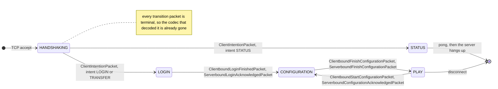
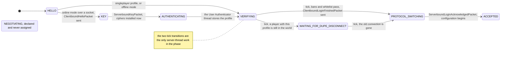
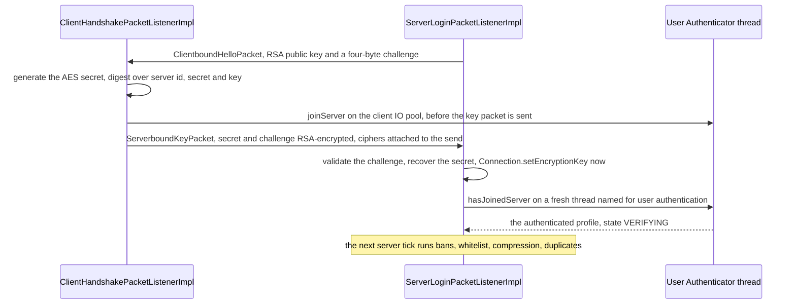

# Protocol phases

> Verified against **Minecraft 26.2** · Part IX · A login: from clicking a server in the list to standing in the world.

Click a server in the multiplayer list and one TCP connection opens, and
over the next second it speaks four different languages in turn. Each is a
`ConnectionProtocol`; each has its own packet set and its own listener on
both ends; and each hands over to the next by a packet marked *terminal*,
which tears its own codec out of the pipeline as it passes. What a
1.21-era reader will not expect is where the work happens. Every
server-side handler in the handshake and login phases runs on the Netty
event loop, and the thing that actually advances a login is a **tick**. And
the `ServerPlayer` — the object, its save data, its position, the chunks
under it — is *prepared* during configuration, by a task named for it, and
**constructed after the client has already acknowledged that configuration
is over**, by which point the server is encoding play packets to a player
that does not yet exist.

## The cast

| class | role | thread |
|---|---|---|
| `ConnectionProtocol` | the five phases — a bare enum of labels; the codec lives in a `ProtocolInfo`, the behaviour in a `PacketListener` | — |
| `Connection` | one channel, and `Connection.setupInboundProtocol` / `Connection.setupOutboundProtocol` at every transition | Netty |
| `ServerHandshakePacketListenerImpl` | the three-way switch and the version gate | Netty |
| `ServerLoginPacketListenerImpl` | the login state machine; its handlers set a volatile state and its `ServerLoginPacketListenerImpl.tick` acts on it | Netty, ticked from Server |
| `ServerConfigurationPacketListenerImpl` | the serial task queue, and the handler that finally builds the player | mixed — see below |
| `ClientHandshakePacketListenerImpl` | the client's side of handshake and login, including the session-service call | Netty, client IO pool |
| `ClientConfigurationPacketListenerImpl` | accumulates registries and tags, then constructs the `ClientPacketListener` | Netty, then Render |
| `PrepareSpawnTask` | finds a spawn, tickets its chunks, waits — and later, on request, spawns the player | Server |

## The five phases

`ConnectionProtocol` is five constants — `ConnectionProtocol.HANDSHAKING`,
`ConnectionProtocol.STATUS`, `ConnectionProtocol.LOGIN`,
`ConnectionProtocol.CONFIGURATION`, `ConnectionProtocol.PLAY` — each
carrying only a string `ConnectionProtocol.id`. There is no number, no
packet table and no lookup by id. What a phase *is* lives in two other
places: the packet set, bound as a `ProtocolInfo`, and the listener that
handles it.

| phase | serverbound listener | clientbound listener | `ProtocolInfo` |
|---|---|---|---|
| `ConnectionProtocol.HANDSHAKING` | `ServerHandshakePacketListenerImpl`, or `MemoryServerHandshakePacketListenerImpl` in singleplayer | none — there is no clientbound handshake protocol | `HandshakeProtocols.SERVERBOUND`, one packet |
| `ConnectionProtocol.STATUS` | `ServerStatusPacketListenerImpl` | reached from `ServerStatusPinger` | `StatusProtocols.SERVERBOUND` binds a **raw buffer**; `StatusProtocols.CLIENTBOUND` a `FriendlyByteBuf` |
| `ConnectionProtocol.LOGIN` | `ServerLoginPacketListenerImpl` | `ClientHandshakePacketListenerImpl` | `LoginProtocols.SERVERBOUND` / `LoginProtocols.CLIENTBOUND` |
| `ConnectionProtocol.CONFIGURATION` | `ServerConfigurationPacketListenerImpl` | `ClientConfigurationPacketListenerImpl` | `ConfigurationProtocols.SERVERBOUND` / `ConfigurationProtocols.CLIENTBOUND` |
| `ConnectionProtocol.PLAY` | `ServerGamePacketListenerImpl` | `ClientPacketListener` | **not pre-bound** — `GameProtocols.SERVERBOUND_TEMPLATE` and `GameProtocols.CLIENTBOUND_TEMPLATE` are bound per connection |

The first four bind their buffers once, at class load, because they need no
registries. Play cannot: its codecs write registry ids, so both templates are
bound per connection with `RegistryFriendlyByteBuf.decorator` at the
configuration-to-play switch. On the client that is genuinely the first
moment a `RegistryAccess` exists; on the server the registries have been
there since startup and the rebind is only because the protocol changed.
The serverbound play template is also the one protocol with a context
object, `GameProtocols.Context`, whose single question is
`GameProtocols.Context.hasInfiniteMaterials` — which is why it is an
`UnboundProtocol` where the other four are a `SimpleUnboundProtocol`.

Two listeners sit under the phases. `ServerCommonPacketListenerImpl` is the
shared base of the server's configuration and play listeners and holds
everything legal in both — keep-alive, latency, custom payloads,
resource-pack responses and the flush suspension — with
`ClientCommonPacketListenerImpl` its client counterpart; that inheritance
is why the *common* packets in [reference/packets.md](../../reference/packets.md)
belong to no single phase. And the state that crosses a phase change is a
`CommonListenerCookie`: on the server a small record of profile, latency,
client information and a transferred flag; on the client a much larger one
carrying registries, feature flags, cookies, chat state and the server
brand.

## Handshake

The handshake is one packet and a three-way switch. `ClientIntentionPacket`
carries the protocol version, the address the client dialled and a
`ClientIntent`, and `ServerHandshakePacketListenerImpl.handleIntention`
branches on it. `ClientIntent.STATUS` installs the status listener, or
disconnects at once if the server does not reply to status.
`ClientIntent.TRANSFER` disconnects if the server does not accept transfers,
and otherwise joins `ClientIntent.LOGIN` in
`ServerHandshakePacketListenerImpl.beginLogin`, which compares the client's
protocol version against this build's and refuses a mismatch —
*outdated_client* below the 1.16.4 protocol number, *incompatible* above
it. Every one of those refusals first installs the **login** clientbound
protocol, purely so it can send `ClientboundLoginDisconnectPacket` and have
the client render a reason.

The client does not wait for any of that. Whichever of its three entry
points opened the connection — `ConnectScreen` for a listed or direct
server, `Minecraft` for the integrated server's memory channel,
`RealmsConnect` — it sends `ServerboundHelloPacket` immediately after the
intention packet; there is no round trip between them. The profile id the hello carries is decoded and then never read — the
server mints or fetches identity for itself. All of this runs on the Netty
thread, and the intention packet, being terminal, has already torn out the
codec that decoded it.

## Status, the phase nobody logs in through

`ConnectionProtocol.STATUS` is two packets each way and a deliberate dead
end. `ServerStatusPacketListenerImpl` answers exactly one
`ServerboundStatusRequestPacket` — a second one disconnects the caller —
and answers `ServerboundPingRequestPacket` with
`ClientboundPongResponsePacket` and then **hangs up**. A status connection
is expected to be thrown away, which is why `ServerStatusPinger` opens one
per server in the list and why `Connection.initiateServerboundStatusConnection`
exists as a separate entry point.

## Login

`ServerLoginPacketListenerImpl` has no thread hop anywhere, which is why its
`ServerLoginPacketListenerImpl.state` field is volatile: the packet handlers
run on the Netty thread and set the state, and
`ServerLoginPacketListenerImpl.tick` — reached from
`MinecraftServer.tickConnection` through `ServerConnectionListener.tick`
and `Connection.tick` — reads it on the server thread and does the login.
The tick is also where `ServerLoginPacketListenerImpl.MAX_TICKS_BEFORE_LOGIN`,
six hundred ticks, is enforced: a client that has not reached the end of
the phase in thirty seconds is disconnected for a slow login.

**Three branches out of the hello.** If the name matches the singleplayer
profile, verification starts at once with no encryption. If the server uses
authentication and this is not a memory connection, the state becomes
`ServerLoginPacketListenerImpl.State.KEY` and `ClientboundHelloPacket`
carries the server's RSA public key and a four-byte challenge. Otherwise —
offline mode — the profile is minted from the name by
`UUIDUtil.createOfflineProfile` and nothing is encrypted.

**Both sides authenticate, and the client goes first.**

The client generates the AES secret and computes a digest over the server
id, the secret and the server's public key; if the server asked for
authentication it calls the session service on its IO pool *before* the key
packet goes anywhere, and sends `ServerboundKeyPacket` from that callback,
attaching its own ciphers to the send. The server validates the challenge,
recovers the secret, recomputes the digest, installs its ciphers
*immediately and synchronously*, and only then starts its own
session-service call. An unauthenticated connection is already encrypted.

**Authentication is a plain thread with two fallbacks.** It calls the
session service, reports login activity and on success stores the profile
and flips the state to `ServerLoginPacketListenerImpl.State.VERIFYING`. On
failure it disconnects — unless the server is a singleplayer host, in which
case both a null result and an unreachable authentication service fall back
to an offline profile. That is how a LAN world admits a guest whose account
cannot be checked. A login over a real socket against an authenticating
server starts exactly one such thread; an offline-mode, memory or
singleplayer-profile login starts none.

**The tick does the real login.**
`ServerLoginPacketListenerImpl.verifyLoginAndFinishConnectionSetup` runs on
the server thread: `PlayerList.canPlayerLogin` for bans, whitelist and
capacity; the compression switch; and
`PlayerList.disconnectAllPlayersWithProfile` for a duplicate login, after
which the machine waits in
`ServerLoginPacketListenerImpl.State.WAITING_FOR_DUPE_DISCONNECT` until the
old connection has actually died. It also compares the authenticated profile
against `Connection.getIntendedProfileId`, an embedder hook that nothing in
vanilla sets.

**Login ends with a terminal packet in each direction**, and the two sides
install their codecs in mirror order. `ClientboundLoginFinishedPacket` then
`ServerboundLoginAcknowledgedPacket` — but the server installs *outbound*
configuration when the acknowledgement arrives, in
`ServerLoginPacketListenerImpl.handleLoginAcknowledgement`, whereas the
client installs *inbound* configuration before sending it and outbound
immediately after. Both packets are terminal, so the codecs tear themselves
out as they pass ([the connection](the-connection.md)). The client then
volunteers two packets straight away: its own `BrandPayload` and
`ServerboundClientInformationPacket`, which is where the server learns the
language it will pick a code of conduct in.

What disconnects a login: a version mismatch, a ban, a full whitelist-only
server, a failed session check on a non-singleplayer host, an unexpected
custom-query answer (`ServerLoginPacketListenerImpl.State.NEGOTIATING` is
declared and never assigned — `ClientboundCustomQueryPacket` decodes every
payload as `DiscardedQueryPayload`, and an answer just disconnects), or six
hundred ticks.

## Configuration

```mermaid
flowchart LR
    S["startConfiguration: BrandPayload, server links, enabled features, outside the queue"] --> R["SynchronizeRegistriesTask"]
    R --> C["ServerCodeOfConductConfigurationTask, if the server has one"]
    C --> P["ServerResourcePackConfigurationTask, if the server has one"]
    P --> W["returnToWorld appends the last two"]
    W --> PS["PrepareSpawnTask: Preparing, then Ready"]
    PS --> J["JoinWorldTask sends ClientboundFinishConfigurationPacket, terminal"]
    J --> F["handleConfigurationFinished: outbound play, the gate again, then spawnPlayer"]
```

`SynchronizeRegistriesTask` is the reason configuration exists, and the
queue around it is strictly serial. `ServerConfigurationPacketListenerImpl.startConfiguration`
sends three things outside the queue — the server's `BrandPayload`,
`ClientboundServerLinksPacket` if there are links, and
`ClientboundUpdateEnabledFeaturesPacket` — then queues the registry task, a
code-of-conduct task if the server has one and a resource-pack task if it
has one, before `ServerConfigurationPacketListenerImpl.returnToWorld`
appends `PrepareSpawnTask` and `JoinWorldTask` and starts the first. Each
`ConfigurationTask` finishes before the next begins:
`ServerConfigurationPacketListenerImpl.finishCurrentTask` rejects a
completion naming the wrong task type, and an exception out of any task
disconnects the client.

**Registry and tag sync.** The task begins with `ClientboundSelectKnownPacks`,
a list of `KnownPack` records naming every pack the server's resource
manager has, by namespace, id and version; the client matches them against
its bundled vanilla repository through `KnownPacksManager.trySelectingPacks`
and replies with the subset it recognises. If that reply is not *exactly*
the requested list — same packs, same order — the server discards the
negotiation and re-sends everything; it is all or nothing, never a per-pack
intersection. Then one `ClientboundRegistryDataPacket` **per registry**,
walking `RegistryDataLoader.SYNCHRONIZED_REGISTRIES`, each element a
`RegistrySynchronization.PackedRegistryEntry` whose data is omitted when the
element came from a pack the client already has — the entire point of the
negotiation — written as NBT with the registry's own element codec. Then
one `ClientboundUpdateTagsPacket` covering **all** registries, static ones
included ([tags](../foundations/tags.md)). On the client,
`RegistryDataCollector` accumulates the contents and the tags and only
resolves them at `ClientConfigurationPacketListenerImpl.handleConfigurationFinished`,
loading them on a background executor against the negotiated packs — and
blocking on the result, so the load is dispatched away rather than genuinely
asynchronous — before constructing the `ClientPacketListener` with the
finished `RegistryAccess`. In singleplayer the result is narrowed to the
server's own objects, so both sides share instances.

**The seam is not where it looks.** Three of the server's configuration
handlers hop to the main thread —
`ServerConfigurationPacketListenerImpl.handleSelectKnownPacks`, the
resource-pack response and
`ServerConfigurationPacketListenerImpl.handleConfigurationFinished` —
while the client-information and code-of-conduct handlers, like the
keep-alive and ping handlers they inherit, stay on the Netty thread. That
last one is load-bearing: accepting a code of conduct finishes a task, which
**starts the next task on the Netty thread**, and the next task may be
`PrepareSpawnTask`, whose first act is to read a player save file and
resolve a spawn position. `ServerConfigurationPacketListenerImpl.tick` runs
each tick to drive the current task and keep the spawn chunks loaded.

**`PrepareSpawnTask` is two states, and the player is born in neither.**
Its `PrepareSpawnTask.Preparing` state reads the save file for a stored
position, resolves a level, runs `PlayerSpawnFinder.findSpawn`, takes a
`TicketType.PLAYER_SPAWN` ticket at `PrepareSpawnTask.PREPARE_CHUNK_RADIUS`
and waits — which is what `ConfigurationTask.tick` exists for. When the
chunks arrive it becomes `PrepareSpawnTask.Ready`, reports itself finished
and does nothing further except re-arm the ticket every tick through
`PrepareSpawnTask.keepAlive`. `JoinWorldTask` then sends the terminal
packet. Only when the *client's* `ServerboundFinishConfigurationPacket`
arrives does `ServerConfigurationPacketListenerImpl.handleConfigurationFinished`
swap the outbound protocol to play, re-run the duplicate-player check and
`PlayerList.canPlayerLogin` — because a ban or a full server can arrive in
the seconds a configuration takes — and call `PrepareSpawnTask.spawnPlayer`,
which loads the save data a second time, constructs the `ServerPlayer` and
hands it to `PlayerList.placeNewPlayer`, which installs the inbound play
protocol. [Players and sessions](../server/players-and-sessions.md) owns the
rest of that story. Everything between the join task and that handler is a
server holding a ticket on chunks for a player that does not exist.

What disconnects a configuration: a task that throws on start or on tick, a
completion for the wrong task, a ban or a full server at the second check,
and an exception while placing the player.

## Play, and the way back

The play protocol is installed from two different places on each side: the
server swaps outbound at the top of the finish handler and inbound inside
`PlayerList.placeNewPlayer`; the client swaps inbound, sends the finish
packet, then swaps outbound. That is why the server can be encoding play
packets while still nominally in the configuration listener. Chat session
keys are not part of any of this: they are negotiated in play, after the
client learns the server's mode from `ClientboundLoginPacket`
([chat and signing](chat-and-signing.md)).

**A reconfigure does not re-run configuration.**
`ServerGamePacketListenerImpl.switchToConfig` removes the player from the
world, sends `ClientboundStartConfigurationPacket` and swaps outbound; the
client's `ClientPacketListener.handleConfigurationStart` flushes its chat
queue, stashes the chat state and carries the registry access, feature
flags, brand and server links forward in a rebuilt cookie, then answers
`ServerboundConfigurationAcknowledgedPacket`; and
`ServerGamePacketListenerImpl.handleConfigurationAcknowledged` installs a
configuration listener **without** calling
`ServerConfigurationPacketListenerImpl.startConfiguration`. No registries,
tags, feature flags or brand are re-sent, and none need to be. The player
parks in configuration with an empty queue until
`ServerConfigurationPacketListenerImpl.returnToWorld` re-queues the spawn
and join tasks. Both directions are reachable in vanilla only from
`DebugConfigCommand`.

## What the phases leave unused

**Seven packets are terminal**, and four of them are the two handshakes that
bracket configuration; `ClientIntentionPacket` is one of the seven, so the
very first packet of a connection already tears out the codec that decoded
it.

**The creative-inventory packet is filtered at the codec, asymmetrically.**
`GameProtocols.HAS_INFINITE_MATERIALS` refuses to encode or decode the
packet when its context says the connection is not in creative — but the
client's own context answers `GameProtocols.Context.hasInfiniteMaterials`
true unconditionally, while the server's is `ServerGamePacketListenerImpl`
answering from the real player, so the symmetric modifier bites on exactly
one side ([packets and stream codecs](packets-and-stream-codecs.md)).
Compression is asymmetric the same way: the server validates that a
compressed frame really was above the threshold; the client does not.

**Cookies, transfers and the chat reset are proxy hooks.** A
`ServerboundCookieResponsePacket` arriving at any server listener is an
unexpected query and a disconnect, and nothing in the tree constructs
`ClientboundStoreCookiePacket` or `ClientboundCookieRequestPacket`. Of the
transfer machinery only `ClientboundTransferPacket` has a vanilla caller,
`/transfer`: it sends the client to another server, which sees a
`ClientIntent.TRANSFER` handshake and a transferred flag in its cookie, and
`ClientCommonPacketListenerImpl.shouldHandleMessage` keeps accepting
store-cookie and transfer packets while a transfer is in flight, which is
what lets a proxy's trailing state land. `ClientboundResetChatPacket` is
registered and handled and never sent. The rest is fully implemented on the
client and unused by the server.

> **For a 1.21-era reader.** The assumption that "packet handlers run on
> the game thread" is exactly backwards for the first two phases: the
> handshake and login listeners run to completion on the Netty thread, and
> the first `PacketUtils.ensureRunningOnSameThread` in a connection's life
> is in configuration. The connection is encrypted before it is
> authenticated — the server installs both ciphers while handling the key
> packet, before its own session-service call has begun.

## Where to look

`ConnectionProtocol` · `ProtocolInfo` · `ProtocolInfoBuilder` ·
`ServerHandshakePacketListenerImpl` · `ServerStatusPacketListenerImpl` ·
`ServerLoginPacketListenerImpl` · `ServerConfigurationPacketListenerImpl`
· `ClientHandshakePacketListenerImpl` ·
`ClientConfigurationPacketListenerImpl` · `ConfigurationTask` ·
`SynchronizeRegistriesTask` · `PrepareSpawnTask` · `JoinWorldTask` ·
`RegistrySynchronization` · `KnownPack` · `Crypt` ·
`ServerCommonPacketListenerImpl` · `CommonListenerCookie`

---

*Rules: names, never code · how the system works, not how the code reads ·
newest version only · every backticked name passes `tools/verify_names.py`.*
