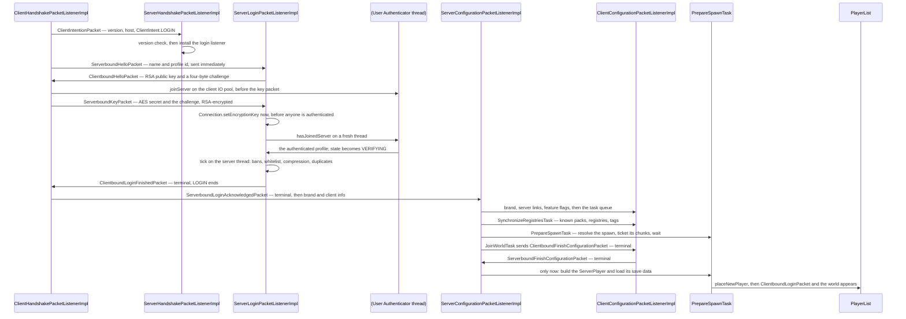

# Protocol phases

> Verified against **Minecraft 26.2** · Part IX · a login: from clicking a server in the list to standing in the world.

## Responsibility

One TCP connection speaks four different languages in sequence. This page
is about the state machine that decides which — what each phase is for,
which packet moves the connection to the next one, and what the
configuration phase does with the time it takes.

The one sentence a player would recognise: *the loading bar between
"Connecting to the server" and being able to move.*

The headline for a 1.21-era reader: **almost none of a login runs on the
main thread.** Every server-side login packet handler runs on the Netty
event loop, and the thing that actually advances the phase is a tick. And
the `ServerPlayer` — the object, its save data, its spawn position and
its spawn chunks — is prepared during **configuration**, by a task, and
constructed at the very last moment: after the client has already
acknowledged the end of the phase.

## The data it owns

`ConnectionProtocol` is a bare enum of five constants —
`ConnectionProtocol.HANDSHAKING`, `ConnectionProtocol.STATUS`,
`ConnectionProtocol.LOGIN`, `ConnectionProtocol.CONFIGURATION`,
`ConnectionProtocol.PLAY` — each carrying a string
`ConnectionProtocol.id`. There is no number, no packet table, no
*getById*. It is a label, and everything else lives elsewhere: the codec
in a `ProtocolInfo`, the behaviour in a `PacketListener`.

| phase | serverbound listener | clientbound listener | `ProtocolInfo` |
|---|---|---|---|
| `ConnectionProtocol.HANDSHAKING` | `ServerHandshakePacketListenerImpl`, or `MemoryServerHandshakePacketListenerImpl` in singleplayer | *none — there is no clientbound handshake protocol* | `HandshakeProtocols.SERVERBOUND`, one packet |
| `ConnectionProtocol.STATUS` | `ServerStatusPacketListenerImpl` | reached from `ServerStatusPinger` | `StatusProtocols.SERVERBOUND` binds a **raw buffer**; `StatusProtocols.CLIENTBOUND` a `FriendlyByteBuf` |
| `ConnectionProtocol.LOGIN` | `ServerLoginPacketListenerImpl` | `ClientHandshakePacketListenerImpl` | `LoginProtocols.SERVERBOUND` / `LoginProtocols.CLIENTBOUND` |
| `ConnectionProtocol.CONFIGURATION` | `ServerConfigurationPacketListenerImpl` | `ClientConfigurationPacketListenerImpl` | `ConfigurationProtocols.SERVERBOUND` / `ConfigurationProtocols.CLIENTBOUND` |
| `ConnectionProtocol.PLAY` | `ServerGamePacketListenerImpl` | `ClientPacketListener` | **not pre-bound** — `GameProtocols.SERVERBOUND_TEMPLATE` and `GameProtocols.CLIENTBOUND_TEMPLATE` are bound per connection |

The first four bind their buffers once, at class load, because they need
no registries. The play phase cannot: its codecs write registry ids, so
they are bound per connection with `RegistryFriendlyByteBuf.decorator` at
the configuration-to-play switch. On the client that is genuinely the
first moment a `RegistryAccess` exists; on the server the registries have
been there since startup and the rebind is only because the protocol
changed. The serverbound play template is also the one protocol that
carries a context object — `GameProtocols.Context`, whose single question
is `GameProtocols.Context.hasInfiniteMaterials` — which is why it is an
`UnboundProtocol` where the other four are a `SimpleUnboundProtocol`.

`ServerCommonPacketListenerImpl` is the shared base of the server's
configuration and play listeners, and holds everything that is legal in
both: keep-alive, latency, custom payloads, resource-pack responses and
the flush suspension. `ClientCommonPacketListenerImpl` is its client
counterpart. That inheritance is why the *common* packets in
[reference/packets.md](../../reference/packets.md) belong to no single
phase.

The state carried across a phase change is a `CommonListenerCookie` —
on the server a small record of profile, latency, client information and
a transferred flag; on the client a much larger one carrying registries,
feature flags, cookies, chat state and the server brand.

## When it runs

Handshake, status and login are handled **on the Netty event loop** and
never hop. `ServerLoginPacketListenerImpl` contains no thread hop at all,
which is why its `ServerLoginPacketListenerImpl.state` field is volatile.

What advances the login is `ServerLoginPacketListenerImpl.tick`, reached
from `MinecraftServer.tickConnection` through
`ServerConnectionListener.tick` and `Connection.tick`. It is also where
`ServerLoginPacketListenerImpl.MAX_TICKS_BEFORE_LOGIN` — six hundred
ticks, thirty seconds — is enforced.

Configuration is mixed, and the seam is not where it looks. Three
handlers hop to the main thread —
`ServerConfigurationPacketListenerImpl.handleSelectKnownPacks`, the
resource-pack response, and
`ServerConfigurationPacketListenerImpl.handleConfigurationFinished` —
while the client-information and code-of-conduct handlers, like the
keep-alive and ping handlers they inherit, stay on the event loop. That
last one is load-bearing: accepting a code of conduct finishes a task,
which **starts the next task on the Netty thread**, and the next task may
be `PrepareSpawnTask`, whose first act is to read a player save file and
resolve a spawn position. `ServerConfigurationPacketListenerImpl.tick`
runs each tick to drive the current `ConfigurationTask` and keep the
spawn chunks loaded.

Off-thread work exists but is conditional. A login against an
authenticating server over a real socket starts one bare thread named for
user authentication on the server, and uses the client's IO pool for the
matching call; an offline-mode, memory or singleplayer-profile login
starts neither. The client also loads the synchronised registries on a
background executor at the end of configuration — and then blocks on the
result, so it is dispatched away rather than genuinely asynchronous.

## The trace: a login

Each arrow is a decision.

**The handshake is a three-way switch and a version gate.**
`ServerHandshakePacketListenerImpl.handleIntention` branches on
`ClientIntent`. A status intention is refused outright if the server does
not reply to status; a transfer is refused if the server does not accept
transfers; and both login and transfer go through
`ServerHandshakePacketListenerImpl.beginLogin`, which compares the
client's protocol version against this build's and disconnects on a
mismatch — *outdated_client* below the 1.16.4 protocol number and
*incompatible* above it. Every one of those refusals sets the **login**
clientbound protocol first, purely so it can send
`ClientboundLoginDisconnectPacket` and have the client render a reason.

**The client sends its hello without waiting.** After the intention
packet it immediately sends `ServerboundHelloPacket`; there is no round
trip in between. The profile id it carries is decoded and then never
read — the server mints or fetches identity for itself.

**Three branches out of the hello.** If the name matches the
singleplayer profile, verification starts at once with no encryption. If
the server uses authentication and this is not a memory connection, it
goes to the encryption handshake. Otherwise — offline mode — the profile
is minted from the name by `UUIDUtil.createOfflineProfile` and nothing is
encrypted.

**Both sides authenticate, and the client goes first.** The client
generates the AES secret and computes a digest over the server id, the
secret and the server's public key — then, if the server asked for
authentication, calls the session service on its IO pool *before* the key
packet goes anywhere, and sends `ServerboundKeyPacket` from that
callback. It attaches its own ciphers to the *send* of that packet. The
server validates the challenge, recovers the secret, recomputes the same
digest, installs its ciphers *immediately and synchronously*, and only
then starts its own session-service call. An unauthenticated connection
is already encrypted.

**Authentication is a plain thread with two fallbacks.** It calls the
session service, reports login activity and, on success, stores the
profile and flips the state to
`ServerLoginPacketListenerImpl.State.VERIFYING`. On failure it disconnects
— unless the server is a singleplayer host, in which case both a null
result and an unreachable authentication service fall back to an offline
profile. That is how a LAN world admits a guest whose account cannot be
checked.

**The tick does the real login.**
`ServerLoginPacketListenerImpl.verifyLoginAndFinishConnectionSetup` runs
on the server thread: `PlayerList.canPlayerLogin` for bans, whitelist and
capacity; compression; and
`PlayerList.disconnectAllPlayersWithProfile` for a duplicate login —
after which the state machine waits for the old connection to actually
die before continuing. It also compares the authenticated profile against
`Connection.getIntendedProfileId`, which is an embedder hook that nothing
in vanilla ever sets.

**Login ends with a terminal packet in each direction**, and the two
sides install their codecs in mirror order.
`ClientboundLoginFinishedPacket` then `ServerboundLoginAcknowledgedPacket`
— but the server installs *outbound* configuration when it receives the
acknowledgement, whereas the client installs *inbound* configuration
before sending it and outbound immediately after. Because both packets
are terminal, the codecs tear themselves out of the pipeline as they pass
— see [the connection](the-connection.md). The client then volunteers two
more packets straight away: its own `BrandPayload` and
`ServerboundClientInformationPacket`, which is where the server learns
the language it will pick a code of conduct in.

**The configuration task queue is strictly serial.**
`ServerConfigurationPacketListenerImpl.startConfiguration` sends three
things outside the queue — the server's `BrandPayload`,
`ClientboundServerLinksPacket` if there are links, and
`ClientboundUpdateEnabledFeaturesPacket` — then queues
`SynchronizeRegistriesTask`, a code-of-conduct task if the server has
one, and a resource-pack task if it has one, before handing off to
`ServerConfigurationPacketListenerImpl.returnToWorld`, which appends
`PrepareSpawnTask` and `JoinWorldTask` and starts the first task. Each
finishes before the next begins:
`ServerConfigurationPacketListenerImpl.finishCurrentTask` rejects a
completion that names the wrong task type, and any exception out of a
task disconnects the client.

**`PrepareSpawnTask` is two states, and the player is born in the
second.** Its `PrepareSpawnTask.Preparing` state reads the save file for
a stored position, resolves a level, runs `PlayerSpawnFinder.findSpawn`,
takes a `TicketType.PLAYER_SPAWN` ticket at
`PrepareSpawnTask.PREPARE_CHUNK_RADIUS` and waits — which is what
`ConfigurationTask.tick` exists for. When the chunks arrive it becomes
`PrepareSpawnTask.Ready`, reports itself finished, and does nothing
further except re-arm the ticket every tick through
`PrepareSpawnTask.keepAlive`. `JoinWorldTask` then sends the terminal
packet. Only when the *client's* reply arrives does
`ServerConfigurationPacketListenerImpl.handleConfigurationFinished` call
`PrepareSpawnTask.spawnPlayer`, which loads the save data a second time,
constructs the `ServerPlayer` and hands it to
`PlayerList.placeNewPlayer`. See
[players and sessions](../server/players-and-sessions.md), which owns the
rest of that story.

**The gate is checked twice.**
`ServerConfigurationPacketListenerImpl.handleConfigurationFinished` re-runs both
the duplicate-player check and `PlayerList.canPlayerLogin` immediately
before spawning, because a ban or a full server can arrive in the seconds
a configuration takes.

**The play protocol is installed from two different places.** The server
swaps its *outbound* codec at the top of that same handler
and its *inbound* one inside `PlayerList.placeNewPlayer`; the client does
inbound, then sends the finish packet, then outbound. That is why the
server can be encoding play packets while still nominally in the
configuration listener.

## Registry and tag sync

`SynchronizeRegistriesTask` is the reason configuration exists.

It begins by sending `ClientboundSelectKnownPacks` — a list of
`KnownPack` records naming every pack the server's resource manager has,
by namespace, id and version. The client matches them against its own
bundled vanilla repository through `KnownPacksManager.trySelectingPacks`
and replies with the subset it recognises.

The server then sends one `ClientboundRegistryDataPacket` **per
registry**, walking `RegistryDataLoader.SYNCHRONIZED_REGISTRIES`. Each
element becomes a `RegistrySynchronization.PackedRegistryEntry` whose
data is **omitted** when the element came from a pack the client already
has — that is the entire point of the negotiation. Elements are written
as NBT with each registry's own element codec.

Then one `ClientboundUpdateTagsPacket` covering **all** registries,
static ones included ([tags](../foundations/tags.md)).

On the client, `RegistryDataCollector` accumulates the contents and the
tags and only resolves them at
`ClientConfigurationPacketListenerImpl.handleConfigurationFinished`,
loading them on a background executor against the negotiated packs — and
blocking on the result — before constructing the `ClientPacketListener`
with the finished `RegistryAccess`. In singleplayer the result is
narrowed to the server's own objects, so both sides share instances.

## Status, and the phase nobody logs in through

`ConnectionProtocol.STATUS` is two packets each way and a deliberate
dead end. `ServerStatusPacketListenerImpl` answers exactly one
`ServerboundStatusRequestPacket` — a second one disconnects the caller —
and answers `ServerboundPingRequestPacket` with
`ClientboundPongResponsePacket` and then **hangs up immediately**. A
status connection is expected to be thrown away, which is why
`ServerStatusPinger` opens one per server in the list and why
`Connection.initiateServerboundStatusConnection` exists as a separate
entry point.

## Interfaces

- **Called by:** `ServerConnectionListener` on accept; on the client, one
  of three entry points — `ConnectScreen` for a listed or direct-connect
  server, `Minecraft` for the integrated server's memory connection, and
  `RealmsConnect`. All three send `ServerboundHelloPacket` immediately.
- **Calls into:** `Connection.setupInboundProtocol` and
  `Connection.setupOutboundProtocol` at every transition;
  `PlayerList.placeNewPlayer` at the end.
- **Crosses the network as:** `ClientIntentionPacket`,
  `ServerboundHelloPacket`, `ClientboundHelloPacket`,
  `ServerboundKeyPacket`, `ClientboundLoginCompressionPacket`,
  `ClientboundLoginFinishedPacket`,
  `ServerboundLoginAcknowledgedPacket`, `ClientboundSelectKnownPacks`,
  `ServerboundSelectKnownPacks`, `ClientboundRegistryDataPacket`,
  `ClientboundUpdateTagsPacket`,
  `ClientboundUpdateEnabledFeaturesPacket`,
  `ClientboundCodeOfConductPacket`,
  `ServerboundAcceptCodeOfConductPacket`,
  `ClientboundResourcePackPushPacket`,
  `ClientboundResourcePackPopPacket`,
  `ServerboundResourcePackPacket`,
  `ClientboundFinishConfigurationPacket`,
  `ServerboundFinishConfigurationPacket`, and for a reconfigure
  `ClientboundStartConfigurationPacket` /
  `ServerboundConfigurationAcknowledgedPacket`.
- **Data-driven by:** the server properties (online mode, compression
  threshold, transfers), the resource-pack settings, and the data packs,
  whose content is precisely what registry sync has to ship.

## Invariants and surprises

- **The server's login handler never touches the main thread, and the
  main thread is what finishes the login.** Packet handlers run on the
  event loop and only set a volatile state; the ban check, the
  compression switch and the finish packet all happen on the next tick.
  A 1.21-era assumption that "packet handlers run on the game thread" is
  exactly backwards here.
- **The connection is encrypted before it is authenticated.** The server
  installs both ciphers while handling the key packet, before its own
  session-service call has begun.
- **The `ServerPlayer` is constructed after configuration has been
  acknowledged, not during it.** The task that carries its name only
  finds a position and loads chunks; the object itself is built inside
  the handler for `ServerboundFinishConfigurationPacket`, by which point
  the server is already encoding play packets. Everything between is a
  server holding a ticket on chunks for a player that does not yet exist.
- **Seven packets are terminal**, and four of them are the two
  handshakes that bracket configuration. `ClientIntentionPacket` is one
  of the seven, so the very first packet of a connection already tears
  out the codec that decoded it.
- **A reconfigure does not re-run configuration.**
  `ServerGamePacketListenerImpl.switchToConfig` removes the player from
  the world and sends the client back, but
  `ServerGamePacketListenerImpl.handleConfigurationAcknowledged`
  installs a listener **without** calling
  `ServerConfigurationPacketListenerImpl.startConfiguration`. No
  registries, tags, feature flags or brand are re-sent, and they do not
  need to be: `ClientPacketListener.handleConfigurationStart` carries the
  registry access, feature flags, brand and server links forward in the
  rebuilt cookie, having first flushed its chat queue and stashed the
  chat state. The player parks in configuration with an empty queue until
  `ServerConfigurationPacketListenerImpl.returnToWorld` re-queues the
  spawn and join tasks. Both directions are reachable in vanilla only
  from `DebugConfigCommand`.
- **Any mismatch in the known-pack negotiation collapses to nothing.**
  If the client's reply is not exactly the requested list — same packs in
  the same order — the server discards the negotiation entirely and
  re-sends every registry element in full. It is all or nothing, not a
  per-pack intersection.
- **`ClientboundResetChatPacket` is registered and handled but never
  sent.** Nothing in vanilla constructs it.
- **The cookie mechanism has no vanilla sender either.** A
  `ServerboundCookieResponsePacket` arriving at any server listener is an
  unexpected query and a disconnect, and nothing in the tree constructs
  `ClientboundStoreCookiePacket` or `ClientboundCookieRequestPacket`. Of
  the transfer machinery only `ClientboundTransferPacket` has a vanilla
  caller, `/transfer`. The rest is a proxy hook, fully implemented on the
  client and unused by the server.
- **A transfer carries cookies for whoever does use them.**
  `ClientboundTransferPacket` sends the client to another server, which
  sees a `ClientIntent.TRANSFER` handshake and a transferred flag in its
  cookie; `ClientCommonPacketListenerImpl.shouldHandleMessage` keeps
  accepting store-cookie and transfer packets while a transfer is in
  flight, which is what lets a proxy's trailing state land.
- **`ServerLoginPacketListenerImpl.State.NEGOTIATING` is declared and
  never assigned.** The custom-query negotiation path is vestigial:
  `ClientboundCustomQueryPacket` decodes every payload as
  `DiscardedQueryPayload`, and an unexpected answer just disconnects.
- **The creative-inventory packet is filtered at the codec,
  asymmetrically.** `GameProtocols.HAS_INFINITE_MATERIALS` refuses to
  encode *or* decode the packet when its context says the connection is
  not in creative — but the client's own context answers
  `GameProtocols.Context.hasInfiniteMaterials` true unconditionally,
  while the server's is `ServerGamePacketListenerImpl` answering from the
  real player. So the symmetric modifier bites on exactly one side
  ([packets and stream codecs](packets-and-stream-codecs.md)).
- **Compression is enabled asymmetrically.** The server validates that a
  compressed frame really was above the threshold; the client does not.
- **Chat session keys are not part of login.** They are negotiated in the
  play phase, after the client learns the server's mode from
  `ClientboundLoginPacket`. See [chat and signing](chat-and-signing.md).

## Where to look

`ConnectionProtocol` · `ProtocolInfo` · `ProtocolInfoBuilder` ·
`ServerHandshakePacketListenerImpl` · `ServerStatusPacketListenerImpl` ·
`ServerLoginPacketListenerImpl` · `ServerConfigurationPacketListenerImpl`
· `ClientHandshakePacketListenerImpl` ·
`ClientConfigurationPacketListenerImpl` · `ConfigurationTask` ·
`SynchronizeRegistriesTask` · `PrepareSpawnTask` · `JoinWorldTask` ·
`RegistrySynchronization` · `KnownPack` · `Crypt` ·
`ServerCommonPacketListenerImpl` · `CommonListenerCookie`

---

*Rules: names, never code · how the system works, not how the code reads ·
newest version only · every backticked name passes `tools/verify_names.py`.*
