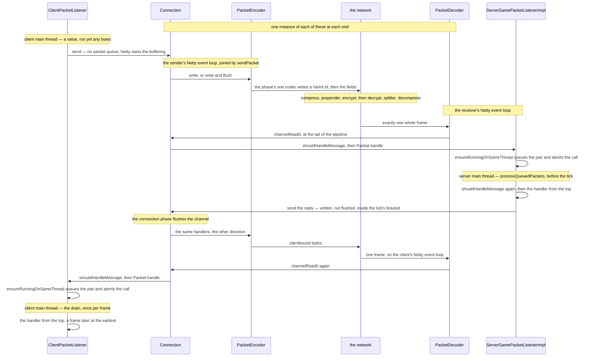

# The connection

> Verified against **Minecraft 26.2** · Part IX · you swing at a pig and the server answers: one round trip, from a value on one thread to bytes on a wire to a method call on another.

You swing. A small immutable value is handed to `Connection.send` on the
client's main thread, and some milliseconds later a method runs on the
server's game thread with that value as its argument; the server's answer
makes the same trip in reverse. Now close the server list and open a
singleplayer world. Every sentence above is still true. The integrated server
is another thread in the same process, and the client reaches it through a
real Netty channel with a real `PacketEncoder` and a real `PacketDecoder` in
it: **singleplayer serialises every packet to bytes and parses them back
again.** The local pipeline swaps the length-prefix framing for an in-memory
hand-off and never installs a cipher or a compressor, and that is the whole
of the difference. There is no local shortcut: the same encoder runs, the
same decoder runs, and the value your click produced is rebuilt from bytes on
the other side.

## The cast

| class | what it decides | thread |
|---|---|---|
| `Connection` | the channel, the current `PacketListener`, and when a fault kills the link | Netty event loop, plus one call a tick from a game thread |
| `PacketEncoder` | one packet becomes the bytes of one frame, or is skipped | the sender's Netty event loop |
| `PacketDecoder` | one frame becomes one packet, and a terminal one dismantles the codec | the receiver's Netty event loop |
| `PacketProcessor` | the queue that carries a decoded packet to a game thread | filled from Netty, drained by its owner |
| `PacketListener` | whether this packet should be handled at all — asked twice | both |
| `TickablePacketListener` | the only way a listener gets time when no packet has arrived | a game thread |
| `ServerConnectionListener` | the server's accept side, and which connections get ticked | server main |
| `EventLoopGroupHolder` | NIO, Epoll, KQueue or in-memory, and the threads that run them | any |

## One packet there, and one back

Four things in that picture are worth stopping on: the framing, the hop, the
drain, and the fact that `Connection` appears once but exists twice.

**Framing is separate from decoding.** `Varint21FrameDecoder` reads at most
three length bytes, refuses anything wider and refuses a zero length, and
emits exactly one frame or nothing at all. Everything downstream of it may
assume it is looking at one whole packet, which is why the codec layer never
has to handle a half-arrived value.

**`Connection.channelRead0` calls `Packet.handle` directly, on the Netty
thread.** There is no automatic hop. `PacketListener.shouldHandleMessage` is
consulted first — which is how a listener being torn down ignores what is
still arriving — and `Connection.receivedPackets` counts only the packets that
pass it. Three other outcomes live in that method: a packet arriving before
any listener is set is an illegal state; a packet whose listener is of the
wrong shape is a cast failure and an *invalid_packet* kick; and a rejected
schedule — the `PacketProcessor` closed because the game is shutting down —
becomes a *server_shutdown* kick.

**The hop is the handler's own first line.**
`PacketUtils.ensureRunningOnSameThread` asks the `PacketProcessor` whether
this is the right thread; if it is not, it enqueues the listener-and-packet
pair and throws the singleton `RunningOnDifferentThreadException`, a stackless
exception that `Connection.channelRead0` catches and drops on the floor. **The
handler body then runs again from the top** when the queue is drained, which
is why a handler method must do nothing observable before that line. A handler
that touches no game state — the pong bookkeeping, the chunk-batch clock, the
keep-alive answer — simply omits it and runs on Netty; the client's play
listener has nine, listed in
[threads](../../reference/threads.md#the-nine-client-handlers-that-never-hop).
The unknown-custom-payload fallback is not one of them, and looks as though it
should be: `ClientCommonPacketListenerImpl` hops first and dispatches to it
afterwards, so it runs on the main thread like everything else.

**The drain has a phase of its own, and the two sides do not schedule it
alike.** The server drains before the tick proper, so every packet that
arrived since last time enters the world at one point ([the server
tick](../server/server-tick.md#every-packet-since-last-time-in-one-drain)); the
client drains **once per frame**, not
once per tick, because its tick is a sub-step of the frame loop ([two loops
and a wire between them](../anatomy/anatomy.md#two-loops-and-a-wire-between-them),
and [the client loop](../client/the-client-loop.md#one-turn-of-the-loop) for
the arithmetic). The
consequence for a packet is that its handling latency on the client is a frame,
not a tick — and that packet handling and *execute*-style task scheduling are
two different queues drained at two different moments on both sides.

**The drain re-asks the same question.** `PacketProcessor.ListenerAndPacket`
calls `PacketListener.shouldHandleMessage` a second time before dispatching,
and logs and drops if the answer has changed. That is the gate that matters:
a packet can wait between the two checks, and a disconnect arriving in between
must not be able to run its handler.

**Errors on re-dispatch go somewhere else entirely.** The drain catches
exceptions only — a bare out-of-memory error is not caught at all — and routes
what it does catch to `PacketListener.onPacketError`. The interface's own
default raises a reported crash, and **no listener a drained packet reaches
uses it**: every serverbound listener inherits `ServerPacketListener`'s
override, which logs and returns ([the server
tick](../server/server-tick.md#every-packet-since-last-time-in-one-drain) owns
what the server then does with the exception), and
`ClientCommonPacketListenerImpl` overrides it the other way, writing a
disconnection report and hanging up. The one special case is a
`ReportedException` *caused by* an out-of-memory error: that is rethrown, but
not untouched.
`PacketUtils.makeReportedException` delegates both steps to
`PacketUtils.fillCrashReport`, which first decorates the report with an
*Incoming Packet* category naming the type and its terminal and skippable
flags, then lets the listener add its own detail.

## The pipeline, in both directions

Two directions through one list of handlers. Inbound runs head to tail;
outbound runs tail to head. Handlers in *italics* are added later, if at all.

| inbound order | handler | added by |
|---|---|---|
| 1 | `"timeout"` — a read timeout of thirty seconds | the connect or accept site, before serialization |
| 2 | `"legacy_query"` — `LegacyQueryHandler` | `ServerConnectionListener.startTcpServerListener` only, and only if the server replies to status; removes itself on the first modern byte |
| 3 | *`"decrypt"`* — `CipherDecoder` | `Connection.setEncryptionKey` |
| 4 | `"splitter"` — `Varint21FrameDecoder` | `Connection.configureSerialization` |
| 5 | *`"decompress"`* — `CompressionDecoder` | `Connection.setupCompression`, inserted directly *after* `"splitter"` |
| 6 | an unnamed flow-control handler | `Connection.configureSerialization` |
| 7 | `"decoder"` or `"inbound_config"` | `Connection.configureSerialization` |
| 8 | *`"bundler"`* — `PacketBundlePacker` | `Connection.setupInboundProtocol`, only for a protocol with a bundle ([packets and stream codecs](packets-and-stream-codecs.md#a-bundle-is-two-empty-markers-round-ordinary-packets)) |
| 9 | `"packet_handler"` — the `Connection` itself | `Connection.configurePacketHandler` |

Outbound, from the game outwards: `"packet_handler"`, then `"hackfix"` — an
anonymous pass-through that `Connection.configurePacketHandler` adds
immediately before it, whose write method does nothing but call its
superclass — then *`"unbundler"`* (`PacketBundleUnpacker`), `"encoder"` or
`"outbound_config"`, *`"compress"`*, `"prepender"`
(`Varint21LengthFieldPrepender`, the exact mirror of the splitter),
*`"encrypt"`*, and the socket.

Which side gets a live codec at birth is decided by direction. The end that
will *receive* the handshake — the server — is built with a real `"decoder"`
and a dead `"outbound_config"` placeholder; the end that will *send* it gets a
real `"encoder"` and a dead `"inbound_config"`. Only the live one is built
from `Connection.INITIAL_PROTOCOL`, which is `HandshakeProtocols.SERVERBOUND` —
one of the nine per-phase codec tables [packets and stream
codecs](packets-and-stream-codecs.md#where-a-packets-number-comes-from) builds.
The placeholder is a bare `UnconfiguredPipelineHandler` holding no protocol at
all, which is the entire point of it.

`HandlerNames` is a class of constants for most of those names, and **nothing
references it**: every name the pipeline is actually built with is a string
literal in `Connection`, `ServerConnectionListener`, `ProtocolSwapHandler` and
`UnconfiguredPipelineHandler`. It has already drifted, which is what an index
no code reads does — it has no entry for *hackfix*, and it carries
`HandlerNames.LATENCY`, a handler that exists only on the local pipeline behind
a debug flag. Cite it for the names, not for the list.

### The threads underneath it

`EventLoopGroupHolder` owns the event-loop groups: four
instances behind two accessors, `EventLoopGroupHolder.local` for the in-memory
channel and `EventLoopGroupHolder.remote`, which tries KQueue and then Epoll
**only if the native-transport flag is set** and otherwise goes straight to
NIO. That flag is the client's option and the server property of the same
name, so switching it off really does change transport rather than hint at it.
The class lives in `server/network` and the client uses it too: `ConnectScreen`
and the server list — `ServerList`, a saved file of `ServerData` entries — ask
for a group, and the list hands the one it got to `ServerStatusPinger`, which
never asks for its own.

**What the client dials is not what the player typed.** One package,
`client/multiplayer/resolver`, stands between the two and nothing else in the
book uses it: `ServerAddress.parseString` splits host from port,
`ServerNameResolver` resolves it, `ServerRedirectHandler` looks up the
*_minecraft._tcp* **SRV** record that lets a server answer on a port nobody
types, `AddressCheck` asks the account service whether the address is blocked,
and the answer is a `ResolvedServerAddress`. `LegacyServerPinger` is the client
half of the `"legacy_query"` row above, for listing a pre-1.7 server.

## Singleplayer runs the same pipeline

`Connection.configureInMemoryPipeline` builds the local variant, and the
differences are smaller than almost anyone assumes.

- `"splitter"` and `"prepender"` become `LocalFrameDecoder` and
  `LocalFrameEncoder`, which do nothing but `HiddenByteBuf.pack` and
  `HiddenByteBuf.unpack` — no length prefix, because the buffer never becomes
  a byte stream.
- **No read timeout on either side**, so a wedged integrated server hangs
  rather than disconnecting.
- No legacy query handler, and **never** a cipher or a compression handler —
  though by two different mechanisms. Compression is refused at the
  installation sites, which both test `Connection.isMemoryConnection`.
  Encryption is not: neither `Connection.setEncryptionKey` nor either side's
  key handler asks. What prevents it sits one gate further up, in
  `ServerLoginPacketListenerImpl`, where the decision to *ask* for encryption
  requires authentication **and** a non-memory connection, so
  `ClientboundHelloPacket` is never sent and the ciphers are never reached.
- Everything else is identical, with one debug exception. `PacketEncoder` and
  `PacketDecoder` are still there, still running the same [stream
  codecs](packets-and-stream-codecs.md#the-codec-layer-is-small-and-composition-is-all-of-it), and
  singleplayer pays the full serialisation cost; the only handler that exists
  *only* on the local pipeline is `ServerConnectionListener.LatencySimulator`,
  installed when `SharedConstants.DEBUG_FAKE_LATENCY_MS` is positive.

The integrated server binds its channel through `EventLoopGroupHolder.local`
and `ServerConnectionListener.startMemoryChannel` hands back an address that
`Connection.connectToLocalServer` dials.

## Sending, and the two flushes

Outbound is the mirror image and shorter. `Connection.send` reaches
`Connection.sendPacket`, which checks whether the calling thread is already
the channel's event loop and, if not, schedules the write onto it — so a
packet sent from the game thread crosses the same boundary an inbound packet
does, just without a queue of its own. `Connection.doSendPacket` then chooses
between a write and a write-and-flush, and between a real future and Netty's
void promise; `Connection.flushChannel` performs the same hop for a bare flush.

`PacketSendListener` is the callback that rides along.
`PacketSendListener.thenRun` runs something once the packet is really on the
wire — which is how compression and the client's encryption are installed
*after* the packet that announced them, and how a disconnect waits for its own
kick message to leave. `PacketSendListener.exceptionallySend` sends a fallback
packet when the write fails. Both run on the event loop, which is why
"disconnect after sending" is not a game-thread operation.

### Why a tick's packets leave in two writes, not fifty

The server does not flush per packet: `ServerCommonPacketListenerImpl.send`
turns a send into a write with no flush while
`ServerCommonPacketListenerImpl.suspendFlushing` has set the flag. The one
thing about that bracket which is a fact about the *channel* rather than
about the tick is that the flag is tested together with the thread check, so
it is honoured only for a caller on the connection's owning game thread and
anything sent from another thread flushes on its own regardless. Which two
moments empty the buffer, and in what order, is [the server
tick](../server/server-tick.md#the-two-writes-each-client-gets)'s — the
bracket opens at the top of `MinecraftServer.tickChildren`, which is why the
packet drain that runs before it is outside the bracket entirely.

### `Connection.tick`, the one call from a game thread

`Connection.tick` is also the only place a listener gets time on a game thread
without a packet having arrived. It drains `Connection.pendingActions` (the
one queue `Connection` owns, holding closures rather than packets, and mattering
only in the window before the channel exists); ticks the listener if it is a
`TickablePacketListener`; calls `Connection.handleDisconnection` if the channel
has died; flushes; every twentieth tick runs `Connection.tickSecond`, which
rolls the packet-rate averages; and last, samples bandwidth. Note the order:
the flush is in the middle, and the disconnect check happens before it.

Its callers differ by side. The server has one,
`MinecraftServer.tickConnection`, which walks `ServerConnectionListener.tick`.
The client has three, because the client has more than one connection:
`MultiPlayerGameMode.tick` ticks the play connection, `Minecraft.tick` ticks
`Minecraft.pendingConnection` — the one still handshaking or logging in, and
therefore the one that drives a login — and `ServerStatusPinger` ticks the
connections it opened to ping the servers in the list. Note the clock: the
pending connection is ticked at tick rate, not at the frame rate the drain
above runs on.

## A phase change is a message written down the pipeline

The pipeline is **reconfigured by writing through it**, not by editing it from
outside. `Connection.setupInboundProtocol` validates that the new listener's
direction and phase match the `ProtocolInfo`, assigns
`Connection.packetListener`, and then builds an
`UnconfiguredPipelineHandler.InboundConfigurationTask` — a closure that will
replace the current handler with a new `PacketDecoder` and turn auto-read back
on, optionally adding `"bundler"` after it. That task is *written down the
channel*, where `UnconfiguredPipelineHandler.Inbound` recognises it and runs it
with the right context, and `Connection.syncAfterConfigurationChange` blocks
the caller until it completes. `Connection.setupOutboundProtocol` is the mirror
image, and also records whether the new outbound protocol is the login one, for
the benefit of the disconnect path.

### Getting back to unconfigured, which nobody asks for

Returning to the unconfigured state is automatic, and it is asymmetric.
`ProtocolSwapHandler.handleInboundTerminalPacket` fires when a packet whose
`Packet.isTerminal` is true passes through `PacketDecoder`: it turns auto-read
*off*, inserts a fresh `UnconfiguredPipelineHandler.Inbound` under the name
`"inbound_config"`, and removes the decoder.
`ProtocolSwapHandler.handleOutboundTerminalPacket` does the equivalent on the
encoder side — but there is no incoming flow to stop, so it leaves auto-read
alone and simply puts an `UnconfiguredPipelineHandler.Outbound` in the
encoder's place. The bundler and unbundler remove themselves on the same
signal, and `PacketBundlePacker` treats a terminal packet arriving *inside* a
bundle as a decode error rather than a swap.

So a phase change reads: terminal packet, codecs self-destruct and inbound
reads stop, the game thread installs the new protocol, a configuration task
travels the pipeline in order with the byte stream, reads resume. The unnamed
flow-control handler between `"splitter"` and the decoder is what makes
turning auto-read off actually stop delivery mid-batch. Which phases exist,
and what ends each of them, is [protocol phases](protocol-phases.md#the-five-phases).

The server's first listener is installed by
`Connection.setListenerForServerboundHandshake`, which refuses if one already
exists and refuses on a connection that is not receiving serverbound traffic in
the handshake protocol — so it is server-side by construction. The client has no
equivalent: its first listener arrives with the pair of protocols that
`Connection.initiateServerboundConnection` installs around
`ClientIntentionPacket`, and `Connection.initiateServerboundStatusConnection` is
the same code with a different intent.

## Compression and encryption arrive behind the packet that announces them

**Compression** is `Connection.setupCompression`, which inserts
`CompressionDecoder` after `"splitter"` and `CompressionEncoder` after
`"prepender"`, or re-thresholds them if they already exist; a negative
threshold removes both. The server turns it on during login, sending
`ClientboundLoginCompressionPacket` with a send-listener that installs the
handlers only *after* that packet is on the wire, and the client installs its
own side when it handles the packet. Both sides skip it entirely on a memory
connection. The asymmetry worth knowing is that the server validates that a
compressed frame really was above the threshold and the client does not; the
frame ceilings the two handlers enforce are in [packets and stream
codecs](packets-and-stream-codecs.md#what-stops-a-hostile-sender).

**Encryption** is `Connection.setEncryptionKey`, which inserts `CipherDecoder`
before `"splitter"` and `CipherEncoder` before `"prepender"` — so decryption is
the first thing that happens to inbound bytes and encryption the last thing
before outbound bytes leave. Neither is ever removed. The server installs its
ciphers synchronously the moment it handles the key packet; the client attaches
its own to the *send* of that packet, so the key packet itself goes out in the
clear and everything after it does not.

## How a connection dies

`Connection.exceptionCaught` is the funnel, and it has four outcomes.

- A `SkipPacketException` is **logged and swallowed**: the codec layer has
  already decided this one packet may be dropped, and the connection survives.
  It is the one marker that does not end the connection — an empty interface,
  implemented by `SkipPacketDecoderException` and `SkipPacketEncoderException`,
  one per direction.
- A timeout — the thirty-second read timeout expiring — disconnects with
  *disconnect.timeout*, the "Timed out" a player sees.
- Any other fault, the **first** time: the listener is asked for a
  `DisconnectionDetails` through `PacketListener.createDisconnectionInfo`; if
  this end is the one sending clientbound traffic it tries to tell the peer
  why, with either `ClientboundLoginDisconnectPacket` or
  `ClientboundDisconnectPacket` depending on `Connection.sendLoginDisconnect`,
  and disconnects once that packet has gone. `Connection.setReadOnly` is not
  the last step but an immediate one, taken on both branches the moment the
  write is handed over and long before it completes.
- Any other fault, the **second** time — a fault while handling a fault, which
  `Connection.handlingFault` detects — skips all of that and disconnects
  immediately.

`Connection.setReadOnly` is how a pending disconnect ignores the rest of the
stream: it turns auto-read off and leaves the peer's remaining packets unread.
`Connection.handleDisconnection` is the other end of the story. It runs from
`Connection.tick`, only once the channel is really closed, reports to the
listener — or to `Connection.disconnectListener`, the client's connect-attempt
fallback, if the connection never got a real one — and is guarded by
`Connection.disconnectionHandled` so that it reports exactly once.

**Keep-alive is the real timeout on a live connection**, and it belongs to
the *common* listener rather than to the play one, so it runs in configuration
too. `ServerCommonPacketListenerImpl.keepConnectionAlive` sends a challenge
every `ServerCommonPacketListenerImpl.LATENCY_CHECK_INTERVAL` milliseconds —
fifteen seconds — and disconnects with
`ServerCommonPacketListenerImpl.TIMEOUT_DISCONNECTION_MESSAGE` if the previous
one was never answered. An answer carrying the **wrong id** takes the same
branch, so a stale reply disconnects immediately rather than being ignored.
The round trip a correct answer measures is not used raw: it is smoothed three
parts old to one part new, which is why a tab list lags a genuine latency
change by several pings. Keep-alive stops once the listener has closed itself
behind a terminal packet; from that moment
`ServerCommonPacketListenerImpl.checkIfClosed` gives the protocol swap another
fifteen seconds and then times the connection out. The thirty-second read
timeout exists only on socket connections, so the singleplayer host has
neither clock running against them: no read timeout on the in-memory pipeline,
and the exemption `ServerCommonPacketListenerImpl.isSingleplayerOwner` grants
here — the only one of the three kicks a tick can deliver that the host is
spared ([players and
sessions](../server/players-and-sessions.md#the-three-kicks-that-come-from-the-tick)).

## Questions players ask

**Which phase am I in?** `Connection` cannot tell you: there is no protocol
field and no getter. The answer is distributed between the two codec handlers
currently in the pipeline and the listener object, and every place
`Connection` names a `ConnectionProtocol` is a comparison rather than a
reading: `Connection.validateListener` checks a new listener against the
protocol it is being installed for, `Connection.setupOutboundProtocol` asks
only whether this is *login*, and the handshake entry point asks only whether
the listener is the initial one.

**Does login happen on the Netty thread or the game thread?** Both, and that is
the surprise. None of `ServerHandshakePacketListenerImpl`,
`ServerStatusPacketListenerImpl`, `ServerLoginPacketListenerImpl` or the
client's `ClientHandshakePacketListenerImpl` contains a single
`PacketUtils.ensureRunningOnSameThread` call, so every state transition and the
encryption setup happen on the event loop. But
`ServerLoginPacketListenerImpl` is a `TickablePacketListener`, and its tick —
on the server thread, through `Connection.tick` — is what runs the ban and
whitelist checks, switches compression on, and sends the terminal packet that
ends the phase. Login is a three-thread state machine; [protocol
phases](protocol-phases.md#login) walks it.

**Does the server drop packets when it is behind?** Not for being late.
`Connection` keeps no outbound packet queue at all — once the channel exists,
everything written goes into Netty's own buffer and backpressure is Netty's
water marks — and inbound, the `PacketProcessor`'s queue is unbounded and each
drain empties it. What a slow server costs you is latency, not messages, until
the keep-alive gives up.

**Why does kicking someone sometimes stall the caller?** Not for the obvious
reason. `Connection.disconnect` does block on the channel close, but the
deliberate kicks never call it from the game thread: `/kick` and the ban
commands go through `ServerCommonPacketListenerImpl.disconnect`, which defers
`Connection.disconnect` to a `PacketSendListener.thenRun` callback on the event
loop. What stalls the game thread is the next line —
`MinecraftServer.executeBlocking` running `Connection.handleDisconnection`,
so the kicking tick does not continue until the player has been removed. The
one place that does block on the close from a game thread is
`ServerLoginPacketListenerImpl.disconnect`, reached from that listener's tick.

**Is a flood of packets rate-limited?** Only if the server was configured for
it. `RateKickingConnection` overrides `Connection.tickSecond` to kick a client
whose average received-packet rate exceeds
`RateKickingConnection.rateLimitPacketsPerSecond`, and the two accept sites
build one only when the server's rate limit is above zero — which it is not by
default. An ordinary socket gets a plain `Connection`.

**Why does one client's bug crash a singleplayer world but not a server?**
`ServerConnectionListener.tick` catches a throw out of `Connection.tick` and
kicks that client with *"Internal server error"* — unless
`Connection.isMemoryConnection`, in which case the same catch rethrows it as a
fresh reported crash named *"Ticking memory connection"* and takes the
integrated server down. One catch, two branches, and the branch is the channel
rather than the fault.

**Why is the network graph in the debug screen client-side only?**
`Connection.bandwidthDebugMonitor` is inbound-only and socket-only, set from
`ConnectScreen` and the Realms connect path and nowhere else, so no server ever
has one. `MonitoredLocalFrameDecoder` exists for the singleplayer case and is
**never installed**: the local pipeline is always built with a null monitor.

That is the transport: one wire, two ends, a thread hop at each of them, and a
picture that does not change between singleplayer and a public server. What
actually
crosses — what a packet class has to declare, how its fields become bytes, how
the far side knows which class to build, and what stops a hostile sender from
allocating a gigabyte — is the other half of this lecture, [packets and stream
codecs](packets-and-stream-codecs.md).

## Where to look

`Connection` · `PacketListener` · `TickablePacketListener` ·
`PacketProcessor` · `PacketUtils` · `PacketSendListener` · `ProtocolInfo` ·
`UnconfiguredPipelineHandler` · `ProtocolSwapHandler` · `PacketDecoder` ·
`PacketEncoder` · `Varint21FrameDecoder` · `HandlerNames` ·
`CompressionDecoder` · `CipherBase` · `EventLoopGroupHolder` ·
`ServerConnectionListener` · `RateKickingConnection` · `DisconnectionDetails` ·
`ServerCommonPacketListenerImpl`

---

*Rules: names, never code · how the system works, not how the code reads ·
newest version only · every backticked name passes `tools/verify_names.py`.*
