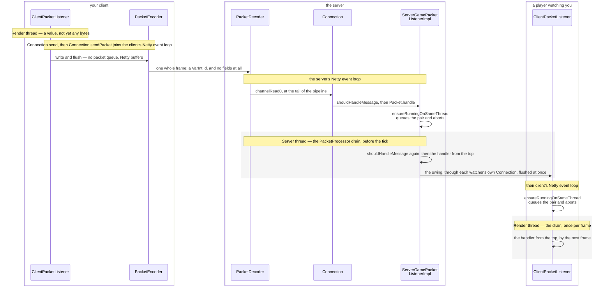

# The connection

> Verified against **Minecraft 26.3** · Part IX · you swing at a pig: one packet up and its answer out to the players watching, from a value on one thread to bytes on a wire to a method call on another — and then the whole life of the channel that carried it.

You swing. `ServerboundPunchPacket` — an immutable value holding nothing at
all, not even which hand — is handed to `Connection.send` on the client's Render
thread, and some milliseconds later
`ServerGamePacketListenerImpl.handlePunch` runs on the server's game thread
with that value as its argument. What comes back — unless your last swing is still in its first half, when
nothing does — is `ClientboundSwingAnimationPacket`, and it goes to every
player tracking you **except you**: your own arm was already swinging, because the client moved it the
moment you clicked. Now close the server list and open a singleplayer world.
Every sentence above is still true. The integrated server is another thread
in the same process, and the client reaches it through a real Netty channel
with a real `PacketEncoder` and a real `PacketDecoder` in it:
**singleplayer serialises every packet to bytes and parses them back again.**
There is no local shortcut — the same encoder runs, the same decoder runs,
and what reaches the server is what the decoder made of the bytes.

That crossing is the first half of this page. The second half is the
channel it travelled on, from the first listener installed on a raw socket to
the fault that closes it: one connection's whole life, which is more than one
packet's journey and is where everything surprising about the transport
lives.

## The cast

| class | what it decides | thread |
|---|---|---|
| `Connection` | the channel, the current `PacketListener`, and when a fault kills the link | Netty event loop, plus its tick, its sends and its flushes from a game thread |
| `PacketEncoder` | one packet becomes the bytes of one frame, or is skipped | the sender's Netty event loop |
| `PacketDecoder` | one frame becomes one packet, and a terminal one dismantles the codec | the receiver's Netty event loop |
| `PacketProcessor` | the queue that carries a decoded packet to a game thread | filled from Netty, drained by its owner |
| `PacketListener` | whether this packet should be handled at all — asked twice | both |
| `TickablePacketListener` | the only way a listener gets time when no packet has arrived | a game thread |
| `ServerConnectionListener` | the server's accept side, and which connections get ticked | Netty for the accept, Server for the tick |
| `EventLoopGroupHolder` | NIO, Epoll, KQueue or in-memory, and the threads that run them | any |

## One packet there, and one back

```mermaid
sequenceDiagram
    box transparent your client
    participant CPL as ClientPacketListener
    participant PEnc as PacketEncoder
    end
    box transparent the server
    participant PDec as PacketDecoder
    participant Conn as Connection
    participant SGPL as ServerGamePacket<br/>ListenerImpl
    end
    box transparent a player watching you
    participant RCPL as ClientPacketListener
    end

    Note over CPL: Render thread — a value, not yet any bytes
    Note over CPL,PEnc: Connection.send, then Connection.sendPacket joins the client's Netty event loop
    CPL->>PEnc: write and flush — no packet queue, Netty buffers
    PEnc->>PDec: one whole frame: a VarInt id, and no fields at all
    Note over PDec,SGPL: the server's Netty event loop
    PDec->>Conn: channelRead0, at the tail of the pipeline
    Conn->>SGPL: shouldHandleMessage, then Packet.handle
    SGPL->>SGPL: ensureRunningOnSameThread<br/>queues the pair and aborts
    rect rgba(0, 0, 0, 0.04)
        Note over PDec,SGPL: Server thread — the PacketProcessor drain, before the tick
        SGPL->>SGPL: shouldHandleMessage again, then the handler from the top
        SGPL->>RCPL: the swing, through each watcher's own Connection, flushed at once
    end
    Note over RCPL: their client's Netty event loop
    RCPL->>RCPL: ensureRunningOnSameThread<br/>queues the pair and aborts
    rect rgba(0, 0, 0, 0.04)
        Note over RCPL: Render thread — the drain, once per frame
        RCPL->>RCPL: the handler from the top, by the next frame
    end
```

*The punch and its answer, one machine to a box: the server's answer goes to
the players watching you and never back to you, and the one arrow into their
client folds away its encoding, its decoding and the `Connection` at each end of the
watcher's link. Watch for each handler body being entered twice.*

Six things in it are worth stopping on — the framing, the direct call, the hop, the
drain's own tick phase, the second question the drain asks, and where an error on
re-dispatch goes.

**Framing is separate from decoding.** `Varint21FrameDecoder` reads at most
three length bytes, refuses anything wider and refuses a zero length, and
emits exactly one frame or nothing at all. Everything downstream of it may
assume it is looking at one whole packet, which is why the codec layer never
has to handle a half-arrived value.

**`Connection.channelRead0` calls `Packet.handle` directly, on the Netty
thread.** There is no automatic hop. `PacketListener.shouldHandleMessage` is
consulted first — which is how a listener being torn down ignores what is
still arriving — and `Connection.receivedPackets` counts only the packets that
pass it. Three other outcomes live in that method: a packet arriving before
any listener is set is an illegal state; a packet whose listener does not
implement the packet's listener interface is a failed class cast and an
*invalid_packet* kick; and a rejected
schedule — the server's `PacketProcessor` closed because it is shutting down —
becomes a *server_shutdown* kick.

**The hop is the handler's own first line.**
`PacketUtils.ensureRunningOnSameThread` asks the `PacketProcessor` whether
this is the right thread; if it is not, it enqueues the listener-and-packet
pair and throws the singleton `RunningOnDifferentThreadException`, a stackless
exception that `Connection.channelRead0` catches and drops on the floor. **The
handler body then runs again from the top** when the queue is drained, which
is why a handler method does nothing observable before that line unless it
means to — the client's transfer handler raises its transferring flag first, so
that `ClientCommonPacketListenerImpl.shouldHandleMessage` already sees it. A handler
that touches no game state — the pong bookkeeping, the chunk-batch clock, the
keep-alive answer — simply omits it and runs on Netty; the client's play
listener has nine, listed in
[threads](../../reference/threads.md#the-handlers-that-never-hop).
An unknown custom payload never reaches a game thread either, though its
handler has the line: it decodes as a `DiscardedPayload`, which
`ClientCommonPacketListenerImpl` drops on the Netty thread before the hop it
takes for every other payload.

**The drain has a tick phase of its own, and the two sides do not schedule it
alike.** The server drains before the tick proper, so every packet that
arrived since last time enters the world at one point ([the server
tick](../server/server-tick.md#every-packet-since-last-time-in-one-drain)); the
client drains **once per frame**, not
once per tick, because its tick is a sub-step of the frame loop ([two loops
and a wire between them](../anatomy/anatomy.md#two-loops-and-a-wire-between-them),
and [the client loop](../client/the-client-loop.md#one-turn-of-the-loop) for
the arithmetic). The
consequence for a packet is that its handling latency on the client is a frame,
not a tick — and that packet handling and the tasks posted to a game thread are
two different queues drained at two different moments on both sides.

**The drain re-asks the same question.** `PacketProcessor.ListenerAndPacket`
calls `PacketListener.shouldHandleMessage` a second time before dispatching,
and logs and drops if the answer has changed. That is the gate that matters:
a packet can wait between the two checks, and a disconnect arriving in between
must not be able to run its handler.

**Errors on re-dispatch go somewhere else entirely.** The drain catches
exceptions only — a bare out-of-memory error is not caught at all — and routes
what it does catch to `PacketListener.onPacketError`. The interface's own
default raises a reported crash, and **no listener a drained packet reaches
uses it**: every serverbound listener inherits `ServerPacketListener`'s
override, which logs and returns ([the server
tick](../server/server-tick.md#every-packet-since-last-time-in-one-drain) owns
what the server then does with the exception), and
`ClientCommonPacketListenerImpl` overrides it the other way, writing a
disconnection report and hanging up. The one special case is a
`ReportedException` *caused by* an out-of-memory error: that is rethrown, but
not untouched.
`PacketUtils.makeReportedException` delegates both steps to
`PacketUtils.fillCrashReport`, which first decorates the report with an
*Incoming Packet* category naming the type and its terminal and skippable
flags, then lets the listener add its own detail.

## The pipeline, in both directions

Two directions through one list of handlers. Inbound runs head to tail;
outbound runs tail to head, and the last column below is that second reading —
six of the nine have an outbound mirror and the other three are inbound-only.
Handlers in *italics* are added later, if at all.

| inbound order | handler | added by | its outbound mirror |
|---|---|---|---|
| 1 | `"timeout"` — a read timeout of thirty seconds | the connect or accept site, before serialization | — |
| 2 | `"legacy_query"` — `LegacyQueryHandler` | `ServerConnectionListener.startTcpServerListener` only, and only if the server replies to status; removes itself on the first modern byte | — |
| 3 | *`"decrypt"`* — `CipherDecoder` | `Connection.setEncryptionKey` | *`"encrypt"`*, last out |
| 4 | `"splitter"` — `Varint21FrameDecoder` | `Connection.configureSerialization` | `"prepender"` — `Varint21LengthFieldPrepender`, its exact inverse |
| 5 | *`"decompress"`* — `CompressionDecoder` | `Connection.setupCompression`, inserted directly *after* `"splitter"` | *`"compress"`* |
| 6 | an unnamed flow-control handler | `Connection.configureSerialization` | — |
| 7 | `"decoder"` or `"inbound_config"` | `Connection.configureSerialization` | `"encoder"` or `"outbound_config"` |
| 8 | *`"bundler"`* — `PacketBundlePacker` | `Connection.setupInboundProtocol`, only for a protocol with a bundle ([packets and stream codecs](packets-and-stream-codecs.md#a-bundle-is-two-empty-markers-round-ordinary-packets)) | *`"unbundler"`* — `PacketBundleUnpacker` |
| 9 | `"packet_handler"` — the `Connection` itself | `Connection.configurePacketHandler` | itself, and then `"hackfix"` |

So outbound, from the game outwards, is that column read upwards:
`"packet_handler"`, then `"hackfix"` — an anonymous pass-through that
`Connection.configurePacketHandler` adds immediately before it, whose write
method does nothing but call its superclass — then the unbundler, the encoder,
the compressor, the prepender, the cipher, and the socket.

Which side gets a live codec at birth is decided by direction. The end that
will *receive* the handshake — the server — is built with a real `"decoder"`
and a dead `"outbound_config"` placeholder; the end that will *send* it gets a
real `"encoder"` and a dead `"inbound_config"`. Only the live one is built
from `Connection.INITIAL_PROTOCOL`, which is `HandshakeProtocols.SERVERBOUND` —
one of the nine per-phase codec tables [packets and stream
codecs](packets-and-stream-codecs.md#where-a-packets-number-comes-from) builds.
The placeholder is an `UnconfiguredPipelineHandler.Inbound` or
`UnconfiguredPipelineHandler.Outbound` holding no protocol at all, which is the
entire point of it.

`HandlerNames` holds most of those names as constants, the local pipeline's
*latency* among them, and none for *hackfix*.

### The threads underneath it

`EventLoopGroupHolder` owns the event-loop groups: four
instances behind two accessors, `EventLoopGroupHolder.local` for the in-memory
channel and `EventLoopGroupHolder.remote`, which tries KQueue and then Epoll
**only if the native-transport flag is set** and otherwise goes straight to
NIO. That flag is the client's option and the server's *use-native-transport*
property, so switching it off really does change transport rather than hint at it.
The class lives in `server/network` and the client uses it too: `ConnectScreen`,
`RealmsConnect` and the multiplayer screen's `ServerSelectionList` — whose saved-server rows are
the `ServerData` that `ServerList` keeps on disk — ask for a group, and the list
hands the one it got to `ServerStatusPinger`, which never asks for its own.

### What the client dials is not what the player typed

One package,
`client/multiplayer/resolver`, stands between the two and nothing else in the
book uses it: `ServerAddress.parseString` splits host from port,
`ServerNameResolver` resolves it, `ServerRedirectHandler` looks up the
*_minecraft._tcp* **SRV** record that lets a server answer on a port nobody
types, `AddressCheck` asks the account service whether the address is blocked,
and the answer is a `ResolvedServerAddress`. `LegacyServerPinger` is the client
half of the `"legacy_query"` row above, for listing a pre-1.7 server.

## Singleplayer runs the same pipeline

`Connection.configureInMemoryPipeline` builds the local variant, and the
differences are smaller than almost anyone assumes.

- `"splitter"` and `"prepender"` become `LocalFrameDecoder` and
  `LocalFrameEncoder`, which do nothing but `HiddenByteBuf.unpack` and
  `HiddenByteBuf.pack` — no length prefix, because the buffer never becomes
  a byte stream.
- **No read timeout on either side.** What that costs the singleplayer host
  is the keep-alive section's, below.
- No legacy query handler, and **never** a cipher or a compression handler —
  though by two different mechanisms. Compression is refused at the
  installation sites, which both test `Connection.isMemoryConnection`.
  Encryption is not: neither `Connection.setEncryptionKey` nor either side's
  key handler asks. What prevents it sits one gate further up, in
  `ServerLoginPacketListenerImpl`, where the decision to *ask* for encryption
  requires authentication **and** a non-memory connection, so
  `ClientboundHelloPacket` is never sent and the ciphers are never reached.
- Everything else is identical, with one debug exception. `PacketEncoder` and
  `PacketDecoder` are still there, still running the same [stream
  codecs](packets-and-stream-codecs.md#the-codec-layer-is-small-and-composition-is-all-of-it), and
  singleplayer pays the full serialisation cost; the only handler that exists
  *only* on the local pipeline is `ServerConnectionListener.LatencySimulator`,
  installed when `SharedConstants.DEBUG_FAKE_LATENCY_MS` is positive.

The integrated server binds its channel through `EventLoopGroupHolder.local`
and `ServerConnectionListener.startMemoryChannel` hands back an address that
`Connection.connectToLocalServer` dials.

## Sending, and why nothing queues on the way out

Outbound is the mirror image and shorter. `Connection.send` reaches
`Connection.sendPacket`, which checks whether the calling thread is already
the channel's event loop and, if not, schedules the write onto it — so a
packet sent from the game thread crosses the same boundary an inbound packet
does, just without a queue of its own. `Connection.doSendPacket` then chooses
between a write and a write-and-flush, and between a real future and Netty's
void promise; `Connection.flushChannel` performs the same hop for a bare flush.

`PacketSendListener` is the callback that rides along.
`PacketSendListener.thenRun` runs something once the packet is really on the
wire — which is how compression and the client's encryption are installed
*after* the packet that announced them, and how a disconnect waits for its own
kick message to leave. `PacketSendListener.exceptionallySend` sends a fallback
packet when the write fails. Both run on the event loop, which is why
"disconnect after sending" is not a game-thread operation.

### Why a tick's packets leave in two writes, not fifty

The server does not flush per packet: `ServerCommonPacketListenerImpl.send`
turns a send into a write with no flush while
`ServerCommonPacketListenerImpl.suspendFlushing` has set the flag. The one
thing about that bracket which is a fact about the *channel* rather than
about the tick is that the flag is tested together with the thread check, so
it is honoured only for a caller on the connection's owning game thread and
anything sent from another thread flushes on its own regardless. Which two
moments empty the buffer, and in what order, belongs to [the server
tick](../server/server-tick.md#the-two-writes-each-client-gets) — the
bracket opens at the top of `MinecraftServer.tickChildren`, which is why the
packet drain that runs before it is outside the bracket entirely.

### `Connection.tick`, the tick a game thread gives the connection

`Connection.tick` is also the only place a listener gets time on a game thread
without a packet having arrived. It drains `Connection.pendingActions` (the
one queue `Connection` owns, holding closures rather than packets, and mattering
only in the window before the channel exists); ticks the listener if it is a
`TickablePacketListener`; calls `Connection.handleDisconnection` if the channel
has died; flushes; every twentieth tick runs `Connection.tickSecond`, which
rolls the packet-rate averages; and last, samples bandwidth. Note the order:
the flush is in the middle, and the disconnect check happens before it.

**The early phases have no hop at all, and a tick is what advances them.**
None of `ServerHandshakePacketListenerImpl`,
`ServerStatusPacketListenerImpl`, `ServerLoginPacketListenerImpl` or the
client's `ClientHandshakePacketListenerImpl` contains a single
`PacketUtils.ensureRunningOnSameThread` call, so in those phases every protocol
swap a handler makes and the encryption setup happen on the event loop. What runs on a
game thread is this method: `ServerLoginPacketListenerImpl` is a
`TickablePacketListener`, and its tick is what performs the ban and whitelist
checks, switches compression on, and sends the terminal packet that ends the
phase. Login is a three-thread state machine, and [protocol
phases](protocol-phases.md#login) walks it.

Its callers differ by side. The server has one,
`MinecraftServer.tickConnection`, which walks `ServerConnectionListener.tick`.
The client has six, because it has more than one connection and more than one
thing that waits on one: `MultiPlayerGameMode.tick` ticks the play
connection; `ConnectScreen`, `RealmsConnect` and `ServerReconfigScreen` tick
the one they are waiting on; `Minecraft.tick` ticks
`Minecraft.pendingConnection`, the singleplayer world's until its level
arrives; and `ServerStatusPinger` ticks the connections it opened to ping the
servers in the list. Note the clock: all six run at tick rate, not at the frame
rate the drain above runs on.

### A throw out of Connection.tick, and why the channel decides what it costs

`ServerConnectionListener.tick` catches an exception out of `Connection.tick`
(an error passes through) and kicks that client with *"Internal server error"* — unless
`Connection.isMemoryConnection`, in which case the same catch rethrows it as a
fresh reported crash named *"Ticking memory connection"* and takes the
integrated server down. One catch, two branches, and the branch is the channel
rather than the fault: the same bug that costs a multiplayer client its seat
costs a singleplayer player their world.

## A phase change is a message written down the pipeline

**`Connection` does not know which phase it is in.** There is no protocol
field and no getter; the answer is distributed between the two codec handlers
currently in the pipeline and the listener object, and every place
`Connection` names a `ConnectionProtocol` is a comparison rather than a
reading — `Connection.validateListener` checks a new listener against the
protocol it is being installed for, `Connection.setupOutboundProtocol` asks
only whether this is *login*, and the handshake entry point asks only whether
the listener is the initial one. That is what makes the next paragraph
possible.

The codecs are **swapped by writing through the pipeline**, not by editing it
from outside. `Connection.setupInboundProtocol` validates that the new listener's
direction and phase match the `ProtocolInfo`, assigns
`Connection.packetListener`, and then builds an
`UnconfiguredPipelineHandler.InboundConfigurationTask` — a closure that will
replace the current handler with a new `PacketDecoder` and turn *auto-read*
back on, optionally adding `"bundler"` after it. Auto-read is Netty's own
switch for whether a channel keeps pulling bytes off the socket without being
asked; turning it off is how the game stops delivery in the middle of a batch
while it swaps codecs, and it is the mechanism the rest of this section
turns on. That task is *written down the
channel*, where `UnconfiguredPipelineHandler.Inbound` recognises it and runs it
with the right context, and `Connection.syncAfterConfigurationChange` blocks
the caller until it completes. `Connection.setupOutboundProtocol` is the mirror
image, and also records whether the new outbound protocol is the login one, for
the benefit of the disconnect path.

### What a terminal packet does to the codecs

Returning to the unconfigured state is automatic, and it is asymmetric.
`ProtocolSwapHandler.handleInboundTerminalPacket` fires when a packet whose
`Packet.isTerminal` is true passes through `PacketDecoder`: it turns auto-read
*off*, inserts a fresh `UnconfiguredPipelineHandler.Inbound` under the name
`"inbound_config"`, and removes the decoder.
`ProtocolSwapHandler.handleOutboundTerminalPacket` does the equivalent on the
encoder side — but there is no incoming flow to stop, so it leaves auto-read
alone and simply puts an `UnconfiguredPipelineHandler.Outbound` in the
encoder's place. The bundler and unbundler remove themselves on the same
signal, and `PacketBundlePacker` treats a terminal packet arriving *inside* a
bundle as a decode error rather than a swap.

So a phase change reads: terminal packet, codecs self-destruct and inbound
reads stop, the terminal packet's handler installs the new protocol (on the
event loop in the early phases and in the server's return to configuration, on a
game thread otherwise), a configuration task
travels the pipeline in order with the byte stream, reads resume. The unnamed
flow-control handler between `"splitter"` and the decoder is what makes
turning auto-read off stop delivery mid-batch. Which phases exist,
and what ends each of them, is [protocol phases](protocol-phases.md#the-five-phases).

### The first listener, and who is allowed to install it

The server's first listener is installed by
`Connection.setListenerForServerboundHandshake`, which refuses if one already
exists and refuses on a connection that is not receiving serverbound traffic in
the handshake protocol — so it is server-side by construction. The client has no
equivalent: its first listener arrives with the pair of protocols that
`Connection.initiateServerboundConnection` installs around
`ClientIntentionPacket`, and `Connection.initiateServerboundStatusConnection` is
the same code with a different intent.

## Compression and encryption arrive behind the packet that announces them

**Compression** is `Connection.setupCompression`, which inserts
`CompressionDecoder` after `"splitter"` and `CompressionEncoder` after
`"prepender"`, or re-thresholds them if they already exist; a negative
threshold removes both. The server turns it on during login, sending
`ClientboundLoginCompressionPacket` with a send-listener that installs the
handlers only *after* that packet is on the wire, and the client installs its
own side when it handles the packet. Both sides skip it entirely on a memory
connection. The asymmetry worth knowing is that the server validates that a
compressed frame really was above the threshold and under the decompressed
ceiling, and the client checks neither; the ceilings are in [packets and
stream codecs](packets-and-stream-codecs.md#what-stops-a-hostile-sender).

**Encryption** is `Connection.setEncryptionKey`, which inserts `CipherDecoder`
before `"splitter"` and `CipherEncoder` before `"prepender"` — so decryption is
the first thing that happens to inbound bytes and encryption the last thing
before outbound bytes leave. Neither is ever removed. The server installs its
ciphers synchronously the moment it handles the key packet; the client attaches
its own to the *send* of that packet, so the key packet itself goes out in the
clear and everything after it does not.

## How a connection dies

`Connection.exceptionCaught` is the funnel, and it has four outcomes.

- A `SkipPacketException` is **logged and swallowed**: the codec layer has
  already decided this one packet may be dropped, and the connection survives.
  It is the one marker that does not end the connection — an empty interface,
  implemented by `SkipPacketDecoderException` and `SkipPacketEncoderException`,
  one per direction.
- A timeout — the thirty-second read timeout expiring — disconnects with
  *disconnect.timeout*, the "Timed out" a player sees.
- Any other fault, the **first** time: the listener is asked for a
  `DisconnectionDetails` through `PacketListener.createDisconnectionInfo`; if
  this end is the one sending clientbound traffic it tries to tell the peer
  why, with either `ClientboundLoginDisconnectPacket` or
  `ClientboundDisconnectPacket` depending on `Connection.sendLoginDisconnect`,
  and disconnects once that packet has gone. `Connection.setReadOnly` follows
  on both branches — on the sending one as soon as the write is handed over,
  without waiting for it to complete.
- Any other fault, the **second** time — a fault while handling a fault, which
  `Connection.handlingFault` detects — skips the message to the peer and
  disconnects immediately.

`Connection.setReadOnly` is how a pending disconnect ignores the rest of the
stream: it turns auto-read off and leaves the peer's remaining packets unread.
`Connection.handleDisconnection` is the other end of the story. It runs only once the
channel is really closed (from the tick that finds the connection dead, or
straight after a disconnect), reports to the listener — or to `Connection.disconnectListener`, the client's connect-attempt
fallback, if the connection never got a real one — and is guarded by
`Connection.disconnectionHandled` so that it reports at most once.

**Keep-alive is the real timeout on a live connection**, and it belongs to
the *common* listener rather than to the play one, so it runs in configuration
too. `ServerCommonPacketListenerImpl.keepConnectionAlive` sends a challenge
every `ServerCommonPacketListenerImpl.LATENCY_CHECK_INTERVAL` milliseconds —
fifteen seconds — and disconnects with
`ServerCommonPacketListenerImpl.TIMEOUT_DISCONNECTION_MESSAGE` if the previous
one was never answered. An answer carrying the **wrong id** is disconnected with the
same message, so a stale reply disconnects immediately rather than being
ignored.
The round trip a correct answer measures is not used raw: it is smoothed three
parts old to one part new, which is why a tab list lags a genuine latency
change by several pings. Keep-alive stops once the listener has closed itself
behind a terminal packet; from that moment
`ServerCommonPacketListenerImpl.checkIfClosed` gives the protocol swap another
fifteen seconds and then times the connection out. The thirty-second read
timeout exists only on socket connections, so the singleplayer host has
neither clock running against them: no read timeout on the in-memory pipeline,
and the exemption `ServerCommonPacketListenerImpl.isSingleplayerOwner` grants
here, from the one kick of the game listener's three that could reach the
host ([players and
sessions](../server/players-and-sessions.md#the-three-kicks-that-come-from-the-tick)).

## Questions players ask

**Does the server drop packets when it is behind?** Not for being late.
`Connection` keeps no outbound packet queue at all — once the channel exists,
everything written goes into Netty's own buffer, and nothing in the game asks
whether that buffer is full — and inbound, the `PacketProcessor`'s queue is unbounded and each
drain empties it. What a slow server costs you is latency, not messages, until
the keep-alive gives up.

**Why does kicking someone sometimes stall the caller?** Never when `/kick`
does it: the kick and ban commands defer `Connection.disconnect` — the call
that blocks on the channel close — to an event-loop callback, and the
`BlockableEventLoop.executeBlocking` after it runs
`Connection.handleDisconnection` in place on the Server thread, which returns
at once while the channel is open. What stalls is elsewhere: a login refusal
from the login's tick calls `Connection.disconnect` itself, and the Server
thread waits for the socket to shut; a kick made on the Netty thread, such as a
wrong keep-alive id, waits in `BlockableEventLoop.executeBlocking` for the
Server thread.

**Is a flood of packets rate-limited?** Only if the server was configured for
it. `RateKickingConnection` overrides `Connection.tickSecond` to kick a client
whose average received-packet rate exceeds
`RateKickingConnection.rateLimitPacketsPerSecond`, and the socket accept site
builds one only when the server's rate limit is above zero — which it is not by
default; the in-memory one never does. An ordinary socket gets a plain `Connection`.

**Why is the network graph in the debug screen client-side only?**
`Connection.bandwidthDebugMonitor` is inbound-only and socket-only, set from
`ConnectScreen` and the Realms connect path and nowhere else, so no server ever
has one. `MonitoredLocalFrameDecoder` exists for the singleplayer case and is
**never installed**: the local pipeline is always built with a null monitor.

That is the transport: one wire, two ends, a thread hop at each of them, and a
picture that does not change between singleplayer and a public server. What
crosses — what a packet class has to declare, how its fields become bytes, how
the far side knows which class to build, and what stops a hostile sender from
allocating a gigabyte — is the other half of this lecture, [packets and stream
codecs](packets-and-stream-codecs.md).

## Where to look

**`Connection`** is the page, and it is worth reading in three sittings rather
than one. First `Connection.channelRead0` and `Connection.exceptionCaught` —
the two ends of a packet's life at this class, arrival and fault. Then
`Connection.configureSerialization` and `Connection.setupInboundProtocol`
beside each other, which is the pipeline built once and then rebuilt by
writing through itself. Then `Connection.tick`, six duties in one method and
the one whose job is the tick.

Around it, in the order this page meets them:
**`PacketUtils.ensureRunningOnSameThread`** for the hop, one test and the
reason every handler is written the way it is; **`PacketProcessor`** for
what the hop enqueues and who drains it; **`PacketDecoder`** and
**`PacketEncoder`** for the two places a codec runs; and
**`UnconfiguredPipelineHandler`** with **`ProtocolSwapHandler`**, the
placeholders and the helpers the codecs call to become them, which between
them are the phase change. **`ServerConnectionListener`** is the
accept side and the one catch that treats a memory connection differently.

Four doors this page only points at: **`Varint21FrameDecoder`**, which defines
what a frame is; **`PacketSendListener`**, for everything the game
does *after* a packet is really on the wire; **`RateKickingConnection`**, the
subclass almost nobody runs; and **`EventLoopGroupHolder`**, where the choice
of transport is made.

---

*Rules: names, never code · how the system works, not how the code reads ·
newest version only · every backticked name passes `tools/verify_names.py`.*
