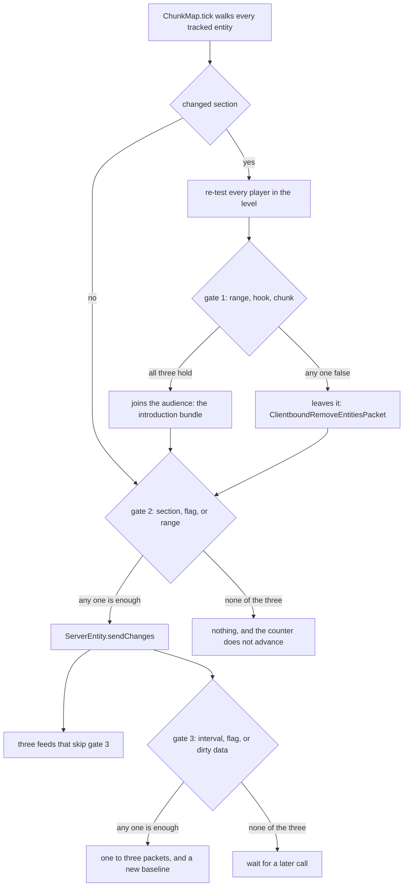
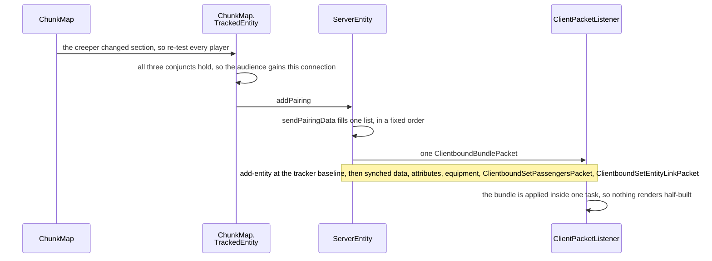

# What the client is told

> Verified against **Minecraft 26.2** · Part IX · a creeper walks into view: everything the server decides to say, in order, and everything it decides not to.

A creeper three chunks away steps across a section boundary, and inside that
tick the server decides a player may know about it. One bundled packet goes
out, and the position in that packet is not where the creeper is. It is where
the creeper's tracker last *said* it was — stale by at least the entity's
update interval and, for an entity sitting in a chunk that is loaded but not
ticking, stale by no bounded amount at all. That is not a bug being
tolerated. Between packets every viewer moves the creeper itself, stepping it
along from the last position it was told and the last velocity — dead
reckoning — and two viewers only agree if they started from the same place.
So **the server sends the base rather than the truth**, and the rest of this
page is that trade made over and over: which chunks a player is sent and how
fast, which entities they are told about, and what counts as a change worth
a packet.

## The cast

| class | what it decides | thread |
|---|---|---|
| `ChunkMap` | which players can see which chunks and which entities — it owns both maps | Server |
| `ChunkMap.TrackedEntity` | one entity's audience, `ChunkMap.TrackedEntity.seenBy`, and the range test that fills it | Server |
| `ServerEntity` | the change detector: the dead-reckoning baseline, the interval gate, the packet shape | Server |
| `ChunkTrackingView` | which chunks a player has been sent, and what a movement turns into | Server |
| `PlayerChunkSender` | how many chunks leave for one player this tick | Server |
| `ChunkHolder` | the per-chunk block-change batch, one flush a tick | Server |
| `EntityType` | the per-type tracking range, update interval and delta exclusion | static, from the builder |
| `ChunkBatchSizeCalculator` | the client's answer — how many chunks a tick it wants | client Netty thread, and it never hops |

## One entity's tick, and the gates it does not pass

*The three gates, each a three-term test, and the two ways out that are not a
packet. Gate 1 is a conjunction and gates 2 and 3 are disjunctions, which is
the asymmetry to carry away: at gate 1 one wrong answer keeps a viewer from
seeing the entity at all, and at the other two one right answer is enough to
make it speak. The three terms of each are the three sections below.*

The figure is the page. Three gates stand between an entity moving and a
player hearing about it, and each is a three-term test: gate 1 is a
conjunction, where all three must hold, and gates 2 and 3 are disjunctions,
where any one term is enough. What comes out the bottom is not a description
of the entity but a description of the *difference* between the entity and
what this viewer was last told. The sections below are one per gate, then one
per feed that does not go through them at all.

### Gate 1: who is allowed to see it

`ChunkMap.tick` re-tests visibility only when something moved between
sections — the entity's own section against the tracker's last, and, for
players who changed section, every entity against that player. `ChunkMap.move`
does the same eagerly the moment a player crosses a boundary
([tickets and
loading](../world/tickets-and-loading.md#which-chunks-a-player-is-owed-and-what-makes-one-eligible)).
The test itself is
three conjuncts.

**The distance is horizontal.** `ChunkMap.TrackedEntity.updatePlayer` compares
squared *x/z* distance against the smaller of the entity's effective range and
the player's view distance in blocks. **Y is ignored entirely** — an entity
directly above you, at any height, is in range.

**The range is the maximum over the whole vehicle stack.**
`ChunkMap.TrackedEntity.getEffectiveRange` takes the largest
`EntityType.clientTrackingRange` among the entity and all its indirect
passengers, then scales it by `MinecraftServer.getScaledTrackingDistance`,
which both server classes override: `DedicatedServer` applies the
*entity-broadcast-range-percentage* property, and `IntegratedServer` applies
the client's own **Entity Distance** video option. In singleplayer a graphics
slider decides how far away mobs are tracked.

**And the chunk must already be there.** `Entity.broadcastToPlayer` looks like
a per-entity hiding hook and is not: it defaults to true and is overridden
exactly once, by `ServerPlayer`, to make spectators see only what they are
spectating and to keep a spectator out of everyone else's view. And
`ChunkMap.isChunkTracked` is false while the chunk is still queued in
`PlayerChunkSender`, so an entity is never sent before the ground it stands
on — the ordering is guaranteed rather than hoped for.

One case never reaches the test at all: `ChunkMap.TrackedEntity.updatePlayer`
returns immediately for the player's own entity. **You never track yourself.**
That is why `ServerEntity.Synchronizer` has three verbs and not one —
`ServerEntity.Synchronizer.sendToTrackingPlayers`,
`ServerEntity.Synchronizer.sendToTrackingPlayersAndSelf` and
`ServerEntity.Synchronizer.sendToTrackingPlayersFiltered` — and why damage,
knockback and synched data must all reach for the self-directed one.

### The introduction is one bundle

What gate 1 opening actually costs, in packets, is one:

*Gate 1 opening, and what the new viewer is sent the moment it does: one
bundle, in one fixed order, applied on the client inside a single task. The
position in it is the tracker's baseline, not the creeper's.*

`ServerEntity.sendPairingData` produces the list and `ServerEntity.addPairing`
sends it as a single `ClientboundBundlePacket`, so the creeper can never be
seen half-initialised. The synched values are not read fresh: they come from
`ServerEntity.trackedDataValues`, the cached snapshot of the entity's
non-default values, refreshed whenever dirty data is flushed
([synched entity
data](../entities/synched-entity-data.md#the-gate-that-holds-a-packet-back)).
Only the syncable
attributes go ([attributes](../entities/attributes.md#four-objects-two-dirty-sets-and-one-list-that-is-neither)),
and equipment,
passengers and leash links go only if there are any.

That bundle is where the page's claim first bites: what it carries is the
tracker's baseline, not the creeper. It has three exceptions and two refusals. Paintings, item frames and leash knots build their own
`ClientboundAddEntityPacket` from their real position, bypassing
`ServerEntity` entirely — they are the three `BlockAttachedEntity` subclasses,
and a block-attached entity has no dead reckoning to agree about.
`EnderDragonPart` refuses outright, and `ChunkMap` never asks it. `Marker` throws
outright if anyone asks — which nobody does, because its tracking range is
zero and `ChunkMap` never tracks it. Everything else reads its position from
`ServerEntity.getPositionBase` and its rotations and motion from the last-sent
fields, however old they are.

### Gate 2: whether the detector is called at all

`ChunkMap.tick` calls `ServerEntity.sendChanges` when *any* of three things is
true: the entity changed section, `Entity.needsSync` is set, or its chunk is in
entity-ticking range. Two public fields on `Entity` do the forcing.
`Entity.needsSync` appears at this gate, again at gate 3 and again in the
velocity decision — three of the cascade's terms are the same flag — and is
set by being pushed, by being loaded from disk, and by a couple of dozen
classes for their own reasons. `Entity.syncPosition` is subtler: it re-phases the call
counter to the next interval boundary, so a bounced entity syncs at once
rather than up to an interval late.

The interval itself is per type and the page leans on it twice below, so it
is worth a number: `EntityType.updateInterval` defaults to **three** ticks and
thirty types override it — and the direction is the opposite of the obvious
one. The three `Display` entities get **one**, because they move by
interpolation and a missed tick shows; an arrow, an experience orb, a dropped
item and a falling block get **twenty**, because a ballistic path is something
the client can extrapolate exactly. The thing moving fastest is told least
often.

The two counters inside `ServerEntity` are deliberately out of step.
`ServerEntity.tickCount` advances on every call, gate 3 open or shut, so
`ServerEntity.FORCED_POS_UPDATE_PERIOD` counts *calls*.
`ServerEntity.teleportDelay` advances only inside gate 3, so
`ServerEntity.FORCED_TELEPORT_PERIOD` counts *gated* calls — the forced
absolute sync is rarer than the forced position packet by however long the
interval gate stays shut.

This is also where a distant entity goes quiet, and the silence is
conditional. Being out of entity-ticking range only suppresses the detector
while the entity *also* stays inside its section and leaves `Entity.needsSync`
clear. Either of those breaks it, which is why a far-off mob can freeze for a
long time and then correct itself in one jump.

### Gate 3, and the position it chooses

The rows are in the source's own order, which matters: the absolute-sync test
is a single conjunction and `Entity.getRequiresPrecisePosition` is its first
term, not its last.

| condition | result |
|---|---|
| `Entity.getRequiresPrecisePosition` | absolute sync |
| delta beyond what a short can hold — about eight blocks | absolute sync |
| `ServerEntity.teleportDelay` past `ServerEntity.FORCED_TELEPORT_PERIOD` — four hundred *gated* calls, so at least 1,200 ticks on the three-tick default interval | absolute sync |
| the entity just dismounted, or its ground flag flipped — the common case, so every landing and every step off a ledge costs a full packet | absolute sync |
| none of those, and the squared position delta is below `ServerEntity.TOLERANCE_LEVEL_POSITION` with rotation within `ServerEntity.TOLERANCE_LEVEL_ROTATION` | nothing sent |
| none of those, and something moved | `ClientboundMoveEntityPacket.Pos`, `.Rot` or `.PosRot` |
| the call count is a multiple of `ServerEntity.FORCED_POS_UPDATE_PERIOD` | a position packet even if nothing moved — but only on a call that got through gate 3 |
| the entity is a passenger | rotation only — the base is silently re-set, and the next call that opens gate 3 forces an absolute sync |

The gate covers more than the position. The same test that opens the table
above also opens the synched-data flush, which is why shearing a sheep sends
that sheep's position delta in the same call ([synched entity
data](../entities/synched-entity-data.md#the-gate-that-holds-a-packet-back) has
the data channel's half); the `ItemFrame` branch — three sections down, under the feeds that skip gate
3 — is the **only** path to that flush which skips the interval test, and
`ServerEntity.handleMinecartPosRot` reaches it from *inside* the gate rather
than around it.

Rotations are single bytes, so one unit is a little over a degree, and the
dead-reckoning base — a `VecDeltaCodec`, which is the object holding the
last-sent position the whole page's opening rests on — advances only when
something was actually sent: that is
what keeps the two sides' arithmetic identical. An arrow never takes a partial
path — `AbstractArrow` is excluded from the position-only and rotation-only
branches, so every open gate sends it a full position-and-rotation packet. A
minecart on the new movement behaviour skips the table altogether:
`ServerEntity.handleMinecartPosRot` diverts it into
`ClientboundMoveMinecartPacket`, which carries a list of steps rather than one
position.

That first term has exactly one caller in the whole game, and it is a happy
ghast. `Entity.setRequiresPrecisePosition` is asked for by a
ghast on its still timeout and by nothing else — a large ridable platform is
the one entity whose rounding error a player has to stand on.

Velocity is the third decision and a separate channel. When the entity wants
deltas — it is in the `EntityType.trackDeltas` set, `Entity.needsSync` is set,
or it is a `LivingEntity` currently elytra-flying — `ServerEntity` compares the
current delta movement against `ServerEntity.lastSentMovement` and sends
`ClientboundSetEntityMotionPacket`, bundled with
`ClientboundProjectilePowerPacket` for a hurtling projectile.
`EntityType.trackDeltas` looks like a third tracking parameter but is a
hardcoded exclusion list: players, llama spit, the wither, bats, item frames,
leash knots, paintings, end crystals and evoker fangs are out, everything else
is in.

### Three feeds that skip gate 3, and one that skips ServerEntity

`ServerEntity.sendChanges` opens with `Entity.updateDataBeforeSync`, the hook
`LivingEntity` overrides to reconcile its own effects — so a mob effect that
expired this tick can dirty the synched container and open gate 3 in the same
call that goes on to read it ([synched entity
data](../entities/synched-entity-data.md#the-gate-that-holds-a-packet-back)).
Below it, **three feeds ignore gate 3** — which is most of what still feels
responsive about a distant mob, and is a smaller exemption than it sounds:
all three live *inside* `ServerEntity.sendChanges`, so a mob that fails gate 2
gets none of them either. `Entity.hurtMarked`
sends a motion packet to the trackers *and* the entity itself, which is why
knockback is immediate on a creeper whose position otherwise updates slowly. A
changed passenger list is diffed on every call and goes out as a
`ClientboundSetPassengersPacket`, *filtered*, and
the filter is the surprise: it excludes the player whose own passenger status
changed, because that player has already been told directly by
`ServerPlayer.startRiding` or `ServerPlayer.removeVehicle`. An `ItemFrame`
iterates *every player in the level* — not its trackers — every tenth
call, to flush its synched data and, if it holds a map, push map updates.

Equipment *changes* do not pass through `ServerEntity`.
`ClientboundSetEquipmentPacket` comes from
`LivingEntity.handleEquipmentChanges`, and it goes to the trackers *without*
the self-directed variant, so a player is never sent their own equipment. A
straight main-hand to off-hand swap does not even get that far:
`LivingEntity.handleHandSwap` compresses it into a one-byte entity event. And
damage crosses without a number — `ClientboundDamageEventPacket` carries the
source, not the amount, and the health bar moves because of a separate synched
value ([damage and death](../entities/damage-and-death.md#telling-everyone-and-what-a-block-replaces)).

## Chunks arrive on a loop the client paces

Chunk visibility is the same kind of decision one level up: made per player
rather than per entity, and paced by a loop whose set point the client
supplies.

### Which chunks enter and leave

`ChunkMap.applyChunkTrackingView` diffs the player's old and new
`ChunkTrackingView` and turns the difference into a queue of pending sends and
a run of `ClientboundForgetLevelChunkPacket`s. Which chunks are in that view,
what shape the view is — neither a disc nor a square, because
`ChunkTrackingView.isWithinDistance` shrinks each axis before it squares — and
what makes a chunk eligible to leave at all are [tickets and
loading](../world/tickets-and-loading.md#which-chunks-a-player-is-owed-and-what-makes-one-eligible)'s.
The one class the iteration needs and no other page names is
`ChunkTrackingView.Positioned`, which walks one chunk beyond the view distance
for exactly that reason.

### The rate the client asks for

Then, once per tick, `PlayerChunkSender.sendNextChunks` runs per player from
the phase `MinecraftServer.tickChildren` reaches after every level has ticked
([the server
tick](../server/server-tick.md#what-minecraftservertickchildren-runs-and-in-what-order)):

- it stops if too many batches are unacknowledged —
  `PlayerChunkSender.maxUnacknowledgedBatches` **starts at one** and is raised
  to `PlayerChunkSender.MAX_UNACKNOWLEDGED_BATCHES`, which is ten, on the
  first reply. One batch in flight until the client answers, ten after it: the
  first batch of a login is a hard round-trip barrier, and it is why the world
  arrives in a pause and then a flood;
- it accumulates `PlayerChunkSender.batchQuota` by the client's desired rate
  and stops if it is below one;
- it takes that many chunks **nearest first** from
  `PlayerChunkSender.pendingChunks` — or, on a memory connection, or whenever
  fewer are pending than the budget allows, all of them at once;
- and it brackets them with `ClientboundChunkBatchStartPacket` and
  `ClientboundChunkBatchFinishedPacket`.

The client times the bracket in `ChunkBatchSizeCalculator`, clamps the sample
against the running average by `ChunkBatchSizeCalculator.CLAMP_COEFFICIENT`,
folds it into a weighted mean against
`ChunkBatchSizeCalculator.MAX_OLD_SAMPLES_WEIGHT`, and reports a rate back in
`ServerboundChunkBatchReceivedPacket`. The server clamps that between
`PlayerChunkSender.MIN_CHUNKS_PER_TICK` and
`PlayerChunkSender.MAX_CHUNKS_PER_TICK` and uses it as next tick's budget. It
is a closed control loop, and it is the client that sets the set point.

**Seven milliseconds** — the client time per tick that
`ChunkBatchSizeCalculator.getDesiredChunksPerTick` divides by its running
estimate of nanoseconds per chunk. It starts pessimistic, at two milliseconds
a chunk — three and a half chunks a tick against
`PlayerChunkSender.START_CHUNKS_PER_TICK`, nine. That opening figure is never
actually sent: the client folds the first real batch into the average before
it answers, so the first number the server hears is already measured.

What is being measured is narrower than it looks.
`ClientPacketListener.handleChunkBatchStart` and
`ClientPacketListener.handleChunkBatchFinished` are two of the nine handlers on
the client's play listener that never hop off the network thread, so the
loop is timing packet decode, not mesh building (the nine are listed in
[threads](../../reference/threads.md#the-handlers-that-never-hop)).

### What a chunk packet carries

A chunk packet — `ClientboundLevelChunkWithLightPacket` — carries only the
client-facing heightmaps, every section's paletted block states and biomes, a
block-entity entry per block entity holding `BlockEntity.getUpdateTag` rather
than its save data, and the light layers. See
[chunk anatomy](../world/chunk-anatomy.md#sections-and-their-four-counters) and
[lighting](../world/lighting.md#two-4-bit-fields-and-the-sections-that-may-not-exist).

## Block changes: one flush a tick, two audiences

`ServerLevel.sendBlockUpdated` sends nothing. It marks a section dirty on the
`ChunkHolder` — in `ChunkHolder.changedBlocksPerSection`, one short set per
section — and adds the holder to a set on `ServerChunkCache`, unless the chunk
is loaded but not ticking, in which case nothing is recorded and the change is
never broadcast to anyone. `ServerChunkCache.broadcastChangedChunks` drains
that set through
`ChunkHolder.broadcastChanges` once per level tick — inside
`ServerChunkCache.tickChunks`, so only on a tick that ticks chunks at all and
never in a debug world — early in the tick and before entities
move ([the level
tick](../server/server-level-tick.md#the-broadcast-which-is-why-entities-are-a-tick-behind))
— so one broadcast
carries this tick's block changes and the previous tick's entity-driven ones.

**Light goes first, and to a strictly smaller audience** — the border of each
player's sent region rather than everyone tracking the chunk, through
`ChunkMap.isChunkOnTrackedBorder`. Why the border player needs it and the
player in the middle does not is [lighting](../world/lighting.md#off-the-server-thread-and-onto-the-wire)'s,
and it is the one feed on this page whose audience is *smaller* than the
chunk's trackers.

**Then blocks, to everyone tracking the chunk.** Exactly one changed block in
a section becomes a `ClientboundBlockUpdatePacket`, two or more become a
`ClientboundSectionBlocksUpdatePacket`, and every change within the tick
collapses into at most one packet per section. What collapses them is that the
set holds *positions*, not values: `ChunkHolder.broadcastChanges` reads the
level again when it builds the packet, so a position written five times in one
tick is sent once, carrying the value it ended on and none of the four it
passed through. A whole redstone cascade can therefore run, settle and be
broadcast as a single state per position ([signal and
dust](../blocks/signal-and-dust.md#what-one-neighbour-update-to-a-wire-costs)).

**And block entities alongside the blocks, not after them.** The check runs
inside the same per-section loop, immediately after that section's own update
packet — interleaved, not a third pass.
`ChunkHolder.broadcastBlockEntityIfNeeded` tests whether the state has a block
entity at all and delegates to `ChunkHolder.broadcastBlockEntity`, the one
place in the game that asks `BlockEntity.getUpdatePacket`. Only overriding
types produce a `ClientboundBlockEntityDataPacket`, and the fallback is not "it
rides the chunk packet instead" — which is why chest contents are invisible
until the chest is opened. What the two sync hooks default to, and which types
override which, is [block
entities](../blocks/block-entities.md#a-furnace-tells-nobody-anything)'.

### The rest of the block-shaped traffic

It is small: `ClientboundBlockEventPacket` from the deferred event set
([pistons and block
events](../blocks/pistons-and-block-events.md#the-queue-and-which-tick-it-drains-in)),
`ClientboundBlockDestructionPacket` for other players' mining progress,
`ClientboundChunksBiomesPacket` when biomes are re-sent, and
`ClientboundBlockChangedAckPacket`, sent at most once per connection per tick
and on any tick where the client sent a block action, a use-on or a use —
**including an unsequenced abort, which produces an ack of zero and settles
nothing**. The rules that receipt obeys — and the ordering rule that makes a receipt
without a verdict sufficient — belong to [prediction and
acknowledgement](../client/prediction-and-acks.md#two-state-machines-running-against-each-other).

## The level's own feeds

Entities and chunks are the two big feeds. The level itself has several small
ones, all bypassing the change detectors entirely — most on `ServerLevel`,
though time comes from `MinecraftServer` and the view distances from
`PlayerList`:

- **Time**, once a second. `MinecraftServer.forceGameTimeSynchronization` runs
  every twentieth tick, and the packet it broadcasts carries the overworld's
  game time and an **empty** clock map: clock state travels only when a clock
  is changed or a player joins
  ([what crosses the wire](../world/environment-attributes-and-timelines.md#what-crosses-the-wire)).
- **Weather**, on change. `ServerLevel.advanceWeatherCycle` broadcasts rain-
  and thunder-level changes and the start/stop pair as
  `ClientboundGameEventPacket`s, and `PlayerList` re-sends the same set to a
  joining player.
- **Sounds, level events, particles and entity events**, each with its own
  helper and its own audience. Two radii are worth naming because they are not
  the tracking distance: another player's mining progress reaches everyone
  within thirty-two blocks except the miner, and a block event reaches
  sixty-four.
- **View distances**, as `ClientboundSetChunkCacheRadiusPacket` and
  `ClientboundSetSimulationDistancePacket` — the two integers that are the
  client's entire knowledge of the ticket system, and the only feed here the
  receiver acts on structurally rather than by storing a value: the first one
  rebuilds the client's chunk storage array.
- **The debug feed**, which is the only exception to the next section and is a
  narrow one. `ServerLevel` owns a set of per-subscriber debug synchronizers
  that push neighbour updates, POI state, chunk sends and entity tracking to a
  client that has opted in — sixteen subscriptions in all, registered in
  `DebugSubscriptions`, covering brains, goal selectors and paths among them.
  Most of the next section has no subscription at all: not the seed, not the
  loot tables, not the game rules, not a scheduled tick.

## What the client is never told

| what never crosses | the server-side owner | where it is explained |
|---|---|---|
| all AI — targets, goals, brains, paths | `Mob.goalSelector`, `Mob.targetSelector`, `Mob.getTarget`, `Brain`, `Mob.navigation` | [AI, goals and brains](../entities/ai-goals-and-brains.md#what-holds-the-state) |
| scheduled block and fluid ticks — the client's equivalents are empty | `ServerLevel.blockTicks`, `ServerLevel.fluidTicks` | [scheduled ticks](../world/scheduled-ticks.md#where-an-appointment-waits) |
| points of interest, except through the debug channel | `ChunkMap.poiManager` | [points of interest](../world/points-of-interest.md#where-the-index-lives-and-how-it-repairs-itself) |
| the ticket graph — the client gets a radius and a simulation distance, as two integers | `TicketStorage`, `DistanceManager`, `ChunkHolder.ticketLevel`, `FullChunkStatus` | [tickets and loading](../world/tickets-and-loading.md#two-graphs-one-store) |
| worldgen, and **the world seed** — `ClientLevel` gets only a biome zoom seed | `ChunkGenerator`, `RandomState`, `ServerLevel.structureManager`, `StructureStart` | [the generation pipeline](../world/chunk-generation-pipeline.md#the-pyramid-drawn) |
| the worldgen heightmaps, and any block-entity field outside `BlockEntity.getUpdateTag` | `BlockEntity` | [block entities](../blocks/block-entities.md#a-furnace-tells-nobody-anything) |
| non-syncable attributes, loot tables and loot seeds, the natural spawn state, raids and the dragon fight | `AttributeMap`, `LootTable`, `NaturalSpawner` | [attributes](../entities/attributes.md#four-objects-two-dirty-sets-and-one-list-that-is-neither) |
| game rules — they reach the client only on request, and only for a player with the command permission | `GameRules` | [level data and rules](../../reference/level-data-and-rules.md#what-the-client-hears) |
| the creeper's fuse length and its swell counter — of its three synched values, none is the counter | `Creeper` | [synched entity data](../entities/synched-entity-data.md#nineteen-slots-and-where-the-numbers-come-from) |
| everything outside the disc: entities past tracking range, chunks past the view, and every other level on the server | `ChunkMap`, `MinecraftServer.levels` | — |

## Choosing what the client may be wrong about

Every gate above is a decision *not* to say something, and the server can
afford them because the receiver is not passive. `ClientLevel` never admits a
chunk is missing, runs its own light engine and its own clock, ticks entities
it does not own — `Creeper.tick` runs locally, swell counter and all — and
guesses at block placements through a sequence-numbered ledger. That half of
the story is Part X's: [the client
level](../client/the-client-level.md#what-it-does-simulate-the-two-cadences) for
what the receiver fakes and simulates,
[prediction and
acknowledgement](../client/prediction-and-acks.md#two-state-machines-running-against-each-other)
for what it
guesses, and
[authority](../entities/authority.md#five-predicates-and-the-final-one-the-other-four-hang-off)
for which side is allowed
to move what. The client also applies a whole burst of these packets once per
frame, before that frame's ticks, so at a high frame rate it takes the
server's updates far more often than it ticks — the two-loops figure in
[anatomy](../anatomy/anatomy.md#two-loops-and-a-wire-between-them) is the shape,
[the client loop](../client/the-client-loop.md#one-turn-of-the-loop) the detail.

Which is the design constraint under all of it: because the client will
happily simulate in the absence of data, **the server's job is not to keep the
client correct — it is to choose what the client is allowed to be wrong
about.**

> **For a 1.21-era reader.** `PlayerChunkSender` is in `server/network`, not
> `server/level`. And routine movement no longer travels as
> `ClientboundTeleportEntityPacket`: that packet survives, but `ServerEntity`
> never touches it, and an absolute position is
> `ClientboundEntityPositionSyncPacket`.

## Where to look

**`ServerEntity.sendChanges`** is the page. It is one long method and the
three gates, the relative-or-absolute conjunction, the head-yaw branch and the
velocity branch are all visible in it at once; read it before anything else
here, and read it twice.

Then the two callers that decide who hears it: **`ChunkMap.tick`** for the
sweep that runs it, and **`ChunkMap.TrackedEntity.updatePlayer`** for gate 1,
which is four lines and the whole visibility policy. **`ServerEntity.addPairing`**
and **`ServerEntity.sendPairingData`** are the introduction bundle, in the
order it is built.

For the other two feeds: **`PlayerChunkSender.sendNextChunks`** is the control
loop from the server's end and **`ChunkBatchSizeCalculator`** is the client's
half of it — open them together or neither. **`ChunkHolder.broadcastChanges`**
is the block flush, and the line in it that re-reads the level is why a
redstone cascade costs one packet per position.

One door this page only points at: **`VecDeltaCodec`**, forty lines that are
the dead-reckoning base itself and the reason the whole policy works.

---

*Rules: names, never code · how the system works, not how the code reads ·
newest version only · every backticked name passes `tools/verify_names.py`.*
