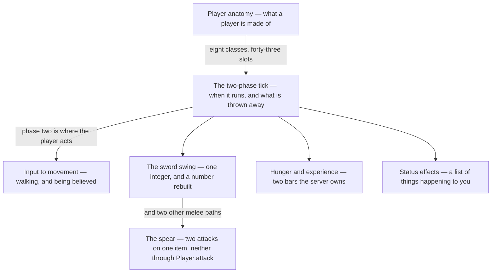

# VIII · The player

> Verified against **Minecraft 26.2** · Part VIII · The one entity a human is steering: what it is made of, when it runs, and the five things it does that the rest of the world does differently.

Everything in Parts IV to VII happens to the world. This part is about the
one object in it that argues back. You meet it as friction — the snap back
after a laggy jump, the swing that does more damage if you wait, the food bar
that empties from sprinting and not from walking, the effect timer that keeps
counting while the connection is down — and every one of those is the same
thing showing through. A player is an entity like any other, with the same
base class, the same tick and the same synched data, and then almost every
rule is bent for it: it is ticked twice instead of once, its inventory
reports seven slots it does not store, its melee combat has three separate
entry points of which the famous one is the least interesting, and the server
simulates its movement in full every tick and then throws the answer away.
**The player is the one object the server is not allowed to be right about**,
and this part is the cost of that.

## The shape of the part

Part VIII is a trunk and four branches. Two pages say what a player *is* and
when it runs; everything after them is one thing a player *does*, and they
are independent of each other — except the spear, which is the sword swing's
sequel and should not be watched before it. The inventory has no lecture of
its own and does not need one: Part VII stops at the slot, and the container
those slots sit in is a section of *player anatomy*, because what is
interesting about it is that seven of its forty-three slots are somewhere
else.

## Before you start

[Part VI](../entities/README.md) is the hard prerequisite, and two of its
pages in particular. [Entity
anatomy](../entities/entity-anatomy.md#the-tree-and-the-class-that-was-inserted-into-it),
because a player is a `LivingEntity` with three rungs added on the server
and four on the client, and this part never re-teaches the base; and
**[authority](../entities/authority.md#five-predicates-and-the-final-one-the-other-four-hang-off)**,
because every page here rests on it — a `Player` is client-authoritative on
*both* sides, which is why the server's own answer for your movement is
thrown away in favour of the number you sent it. If you watch one page from
another part first, watch that one. Three more of Part VI's are assumed
rather than re-taught: [attributes](../entities/attributes.md#forty-numbers-every-one-of-them-clamped),
because reach and every number a hit is worth is one; [synched entity
data](../entities/synched-entity-data.md#nineteen-slots-and-where-the-numbers-come-from);
and [movement and collision](../entities/movement-and-collision.md#the-tick),
the pipeline *input to movement* feeds and never repeats.

Then [the server tick](../server/server-tick.md#where-a-players-own-tick-actually-happens)
and [the level tick](../server/server-level-tick.md#every-entity-and-then-its-riders),
because half this part's timing claims are about which phase something ran in
— including the fact that a player's own physics run *after* every level has
finished. [Players and
sessions](../server/players-and-sessions.md#preparing-a-place-to-stand) owns
how a `ServerPlayer` comes to exist at all, and how the session it belongs to
ends. From [Part VII](../items/README.md), [using an
item](../items/using-an-item.md#the-two-paths-side-by-side), because the
spear's charge is an item you *use* and the meal in *hunger and experience*
is that same machinery from the eater's end.

## Watch in this order

1. [Player anatomy](player-anatomy.md) — the vocabulary page: eight
   classes, two game-mode objects, forty-three slots. There is a rung between
   `LivingEntity` and `Player` — `Avatar` — with no instance state at all,
   shared with a posable dummy; and the main-hand item has no storage of its
   own, being the selected hotbar slot seen through the equipment container a
   horse also has.
2. [The two-phase tick](the-two-phase-tick.md) — one player, one tick,
   twice. The connection records where you are, runs the whole physics
   pipeline, and then puts you back: the server keeps the velocity and
   throws the position away.
3. [Input to movement](input-to-movement.md) — W is pressed. A movement key
   held for less than a tick never happened, sending move packets faster makes the
   anti-cheat *stricter*, and the packet that reports your key presses
   cannot move you but can move a minecart.
4. [The sword swing](the-sword-swing.md) — left-click on a pig. The attack
   packet carries one integer and the server rebuilds the rest, charging the
   hit against a cooldown twice in two different shapes — quadratically on the
   base damage, linearly on the enchantment bonus — and multiplying the mace's
   fall bonus by the critical hit.
5. [The spear](the-spear.md) — the 26.2 combat change, and the part's most
   surprising lecture. Two components on one item: a stab whose packet has
   no target in it, and a charge whose damage comes from closing speed and
   which ignores the attack cooldown entirely.
6. [Hunger and experience](hunger-and-experience.md) — two bars the server
   owns outright. Walking costs exactly zero exhaustion; `FoodConstants` names
   every threshold in the system and not one of its names is read by anything,
   because `FoodData` writes each number as a literal instead; and the
   experience packet watches the *total*, so every mutation that moves only
   your level has to poison the last-sent value by hand.
7. [Status effects](status-effects.md) — the part's closer, and the cleanest
   statement of the server/client split in the book: the client never runs a
   single one of an effect's hooks, only counts it down. The server corrects
   that countdown by testing whether the remaining duration divides by six
   hundred — so an infinite effect, whose duration is −1, is never corrected
   at all.

Watched as lectures, one and two are the pair to keep together, and four and
five are the other pair. Six and seven can be watched in either order, or
skipped and returned to.

## Where the part stops

Part VIII is the smallest part of the book with a system in it — only Part I
is smaller, and Part I is two pages about the program the rest run inside —
{{#include ../../generated/part-player.md}} in `world/entity/player`,
`world/food`, `ServerPlayer` and `client/player` — and it is the one part
where the coverage question has a trivial answer:
{{#include ../../generated/coverage-player.md}}. A player is a small object
surrounded by large ones, so the interesting borders are not the ones inside
these packages but the ones just outside them.

Upward, the part starts at `Avatar` rather than at `Entity`: what a player
*inherits* is [Part VI](../entities/README.md)'s, including the `Mannequin` —
the posable dummy that shares the rung, and the reason the rung exists.
Outward, it stops where the player stops being a player. How a hit is
resolved once it lands is [damage and
death](../entities/damage-and-death.md#the-number-the-arrow-decides) in Part
VI; what your client is *told* about everyone else is [what the client is
told](../networking/what-the-client-is-told.md#one-entitys-tick-and-the-gates-it-does-not-pass)
in Part IX; the ledger behind the block you already saw break is [prediction
and acknowledgement](../client/prediction-and-acks.md#the-four-writes) in
Part X; drawing a player, its skin and its model parts is Part XI's; and the
chat session a `ServerPlayer` carries — the public half of message signing,
the key itself never leaving the client — is [chat and
signing](../networking/chat-and-signing.md#what-the-signature-covers)'s. The
two game-mode objects, `ServerPlayerGameMode` and `MultiPlayerGameMode`, are
the sharpest of those borders: this part says what they hold, and what they
*do* with a block is Part V's two click pages.

Three things inside these packages are nobody's. Two are declined:
`Hotbar` and `HotbarManager`, the nine *saved* creative hotbars, belong to
the creative inventory screen this book does not cover; and sleep is
half-explained on purpose, with [player
anatomy](player-anatomy.md#what-player-owns) naming the fields and the
refusals a bed answers with while the *everyone is asleep* half — the night
skip and the weather reset — is [the level
tick](../server/server-level-tick.md#a-freeze-stops-the-clock-and-not-the-sleep-check)'s.
The third is simply missing, and is the one gap this part admits rather than
declines: nobody explains the walk between those two halves — what one player
lying down actually does over the hundred ticks of `Player.SLEEP_DURATION`
that follow, and which of the two owners is driving during them.

## Reference this part uses

[Attributes](../../reference/attributes.md), because reach, attack damage,
attack speed, sweeping ratio and knockback are all attributes — and attack
damage and knockback, the two that decide what a hit is worth, are not
synced to the client at all. [Packets](../../reference/packets.md) for the
movement, attack and health packets by name. [Data
components](../../reference/components.md) for the components that make an
item a weapon. [Damage outside
`LivingEntity`](../../reference/non-living-damage.md) for what a swing meets
when the target is not a mob. Then [game
rules](../../reference/gamerules.md), [level data and
rules](../../reference/level-data-and-rules.md) and [diagram
lanes](../../reference/lanes.md).

---

*Rules: names, never code · how the system works, not how the code reads ·
newest version only · every backticked name passes `tools/verify_names.py`.*
