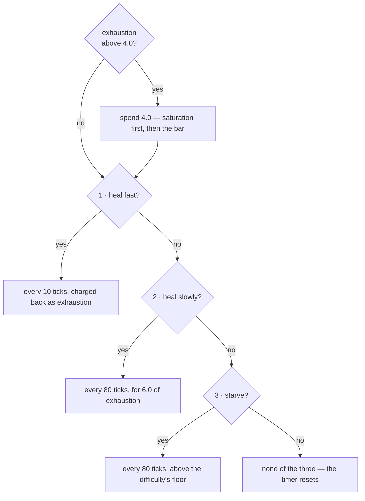
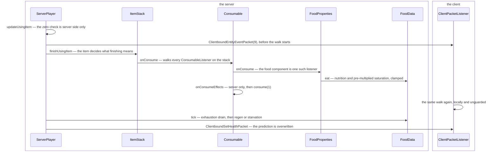

# Hunger and experience

> Verified against **Minecraft 26.2** · Part VIII · Two bars above the hotbar that the server owns outright: one you empty by sprinting, one you fill by mining, and neither of them is quite the number the interface draws.

The food bar and the experience bar look like the same kind of thing: a
number the server keeps and sends you. They are, and they are also the two
counters a player argues with most — the meal that does not seem to fill
you, the levels that vanish into an anvil. Both are worth following for the
same reason: neither is quite what the interface suggests. **There is no
method called *eat*** on `Player` or `LivingEntity` — eating is a walk over
the components of a stack that happens to end in `FoodData.eat` — and the
experience packet is change-detected on the **total** alone, so every
mutation that changes only your level has to poison the last-sent value or
the bar will not move.

## The cast

| class | what it decides | thread |
|---|---|---|
| `FoodData` | the food bar, saturation and exhaustion; both sides hold one, but only the server ticks it | both (`FoodData.tick` takes a `ServerPlayer`) |
| `FoodProperties` | how much a given item is worth, as a data component | both |
| `Consumable` | how long eating takes, what it sounds like, and what else it applies | both |
| `Player` | the four experience fields, the level curve, and the enchanting seed | both |
| `ExperienceOrb` | a value and a multiplicity, wandering toward you | both |
| `ServerPlayer` | the change detection that turns any of this into a packet | server main |

Both halves hang off `ServerPlayer.doTick`, the connection-driven half of
[the two-phase
tick](the-two-phase-tick.md#phase-two-what-this-player-would-do-if-it-simulated-itself);
the level's entity tick touches
essentially none of it. The order inside that half matters: item use is
resolved, then `Player.aiStep` runs `ServerPlayer.tickRegeneration` — which
*is* the Peaceful refill, its whole body gated on that difficulty — and the
orb pickup, then **`FoodData.tick`**, and then the
change-detection block that emits the packets. So a meal eaten this tick and
a Hunger effect's exhaustion from this tick are both visible to
`FoodData.tick` in the same tick, and the resulting health and food reach
the client in that tick too.

## The food bar is four numbers and a pile of literals

**`FoodData`** (`world/food`) is a value bag with no back-reference to the
player: `FoodData.foodLevel` (20), `FoodData.saturationLevel` (5.0),
`FoodData.exhaustionLevel` and `FoodData.tickTimer`. Its surface is the two
`FoodData.eat` overloads — one taking a `FoodProperties`, one taking a
nutrition and saturation pair — plus `FoodData.addExhaustion` (which caps at
40), `FoodData.needsFood`, `FoodData.hasEnoughFood`, `FoodData.setFoodLevel`,
`FoodData.setSaturation`, the two accessors, and `FoodData.tick` — whose
signature is `FoodData.tick(ServerPlayer)`, **server-only by type**. It saves
as four loose keys in the player tag, not a sub-compound.

**`FoodConstants`** names every threshold in the system —
`FoodConstants.MAX_FOOD`, `FoodConstants.HEAL_LEVEL`,
`FoodConstants.HEALTH_TICK_COUNT`,
`FoodConstants.HEALTH_TICK_COUNT_SATURATED`,
`FoodConstants.EXHAUSTION_DROP`, `FoodConstants.EXHAUSTION_HEAL`,
`FoodConstants.EXHAUSTION_SPRINT`, `FoodConstants.EXHAUSTION_MINE`,
`FoodConstants.EXHAUSTION_ATTACK`, `FoodConstants.SPRINT_LEVEL`,
`FoodConstants.SATURATION_FLOOR` and the saturation-quality ladder from
`FoodConstants.FOOD_SATURATION_POOR` to
`FoodConstants.FOOD_SATURATION_SUPERNATURAL` — and **none of them is
referenced by anything.** Only `FoodConstants.saturationByModifier` has call
sites; `FoodData` writes every threshold as an inline literal, so the
constants file and the behaviour can drift apart without a compile error.

Before the tick can spend exhaustion, something has to produce it, and the
economy is smaller than players assume. **Walking costs nothing** — and it
costs nothing out loud: `ServerPlayer.checkMovementStatistics` multiplies
distance by a literal zero on both the walking and the crouching branch,
while `FoodConstants.EXHAUSTION_WALK` documents an intent nothing reads.
What does cost you is sprinting, jumping, swimming, mining, attacking, the
Hunger effect, the `ApplyExhaustion` enchantment effect, and being hurt — the
last of which is data-driven, since `DamageSource.getFoodExhaustion` reads
the damage type. `Player.causeFoodExhaustion` charges 0.1 for a melee swing,
which is the figure [the sword swing](the-sword-swing.md) and [the
spear](the-spear.md) both end on. And in creative or spectator the whole
economy is disabled in one line: `Player.causeFoodExhaustion` returns
immediately for invulnerable abilities.

What `FoodData.tick` then does with that budget is one exhaustion rule and a
three-way chain, tested **in the order below**, first match only — and the
figure is that order, with the conditions themselves in the table under it.

*A chain, not a fan: each diamond is only reached because the one above it
said no, which is the whole of why the three are exclusive.*

| tested in this order | the condition | and then |
|---|---|---|
| 1 · heal fast | the game rule on, saturation left, hurt, and the bar at 20 | every 10 ticks: heals a sixth of the saturation it spends, and charges that much back as exhaustion |
| 2 · heal slowly | the game rule on, hurt, and 18 food or more | every 80 ticks: half a heart, for 6.0 of exhaustion |
| 3 · starve | food at zero — and **not** gated on the game rule | every 80 ticks: half a heart of `DamageTypes.STARVE`, above the difficulty's floor |
| 4 · none of them | — | `FoodData.tickTimer` goes back to zero |

The order is what makes the three exclusive, and it is why a full bar with
saturation left heals you six times faster than a bar at eighteen: both
conditions hold at twenty food, and the fast one is tested first.

The game rule is `GameRules.NATURAL_HEALTH_REGENERATION`, which lives in
`world/level/gamerules` with typed `GameRule` lookups ([level data and
rules](../../reference/level-data-and-rules.md#game-rules-are-a-registry)). The starvation hit only
lands if health is above five hearts, or above half a heart on Normal, or
unconditionally on Hard: five hearts is the floor on Easy and Peaceful, half
a heart on Normal, and death on Hard. `DamageTypes.STARVE` is declared with
zero exhaustion, so starving does not feed itself.

## Eating is a component walk

**`FoodProperties`** (`DataComponents.FOOD`) is three things: nutrition,
saturation and *can always eat*. That is the whole of what a meal is *worth*.
Everything about how long it takes, what it looks like and what else it
applies is a different component on the same stack — `Consumable`, and [using
an item](../items/using-an-item.md#the-two-paths-side-by-side) owns it.

The two meet through an interface, and that is the answer to the missing
*eat* method. `FoodProperties` reaches the player by implementing
**`ConsumableListener`**,
and `Consumable.onConsume` walks every component of that type on the stack.
It is not the only implementation — `PotionContents`,
`SuspiciousStewEffects` and `OminousBottleAmplifier` implement it too, and
`PotionContents` is how drinking applies an effect, which is where this page
and [status effects](status-effects.md#what-an-effect-is) meet in one method. Two routes reach
`FoodData.eat` without any of that: `CakeBlock.eat`, and the saturation
effect, both using the raw nutrition-and-saturation overload.

The walk itself is five hand-offs on the server and one line out to the
client, and the packet leaves before any of the five have run.

*The second arrow is the whole of what the client is told, and it leaves
before the server has eaten anything: everything below it on the left is the
walk, and the client's one self-call is that same walk run again on a copy
nobody guarded.*

`Consumable.canConsume` consults `Player.canEat` only when the stack has
`DataComponents.FOOD` and the user is a player — potions and milk are
ungated — and `Player.canEat` itself passes for *invulnerable abilities*,
*can always eat*, or `FoodData.needsFood`. An item whose
`Consumable.consumeTicks` is zero is consumed instantly with no animation.
After the food lands, `ItemStack.finishUsingItem` applies
`DataComponents.USE_REMAINDER` and `DataComponents.USE_COOLDOWN` ([using an
item](../items/using-an-item.md#the-two-endings)).

The *decision* to finish is server-only, but the client replays the meal on
an entity event and runs `FoodProperties.onConsume` and its `FoodData.eat`
locally, with no side guard on it — which is why the hunger bar's jump is
predicted while a chorus fruit's teleport is not ([using an
item](../items/using-an-item.md#the-meal-tick-by-tick)). The prediction lasts
one tick: `ClientPacketListener.handleSetHealth` overwrites food and
saturation outright, and routes health through
`LocalPlayer.hurtTo`, which works out the delta first so the damage flash
still plays. The client also *reads* its food data for two decisions of its
own: sprinting is gated on having more than six food *or* being able to
fly, and the HUD's food-bar jitter reads saturation.

What crosses the wire for all of this is three packets — `ClientboundSetHealthPacket`
(health, food and saturation together, to that player only),
`ClientboundSetExperiencePacket` (progress, level and total) and
`ClientboundTakeItemEntityPacket` for the orb pickup animation — and what is
data-driven is `DataComponents.FOOD`, `DataComponents.CONSUMABLE`,
`DataComponents.USE_EFFECTS`, `Registries.CONSUME_EFFECT_TYPE` and the three
game rules above.

Eating slowdown is a third component again — `UseEffects`, on *every* item,
which is why a meal and a drawn bow cost you exactly the same speed ([using
an item](../items/using-an-item.md#moving-while-you-use)). It has nothing to
do with the food: it is read while any item is held out, and a spear is the
one definition that turns it off ([the spear](the-spear.md#what-an-item-needs-to-be-a-spear)).

## The other bar, and the number it is really watching

`Player.experienceLevel`, `Player.experienceProgress`,
`Player.totalExperience` and `Player.enchantmentSeed`, plus
`Player.takeXpDelay` and `Player.lastLevelUpTime` — which exists only to
throttle the level-up sound — are the whole of it. The arithmetic is
`Player.giveExperiencePoints`, `Player.giveExperienceLevels` and
`Player.getXpNeededForNextLevel` — the three-segment curve with corners at
levels 15 and 30.

Where orbs come from is worth naming, because two game rules gate it:
`LivingEntity.dropExperience` requires the experience not to have been
consumed already, and either an always-dropper or a recent player kill with
`GameRules.MOB_DROPS` on and the entity's own
`LivingEntity.shouldDropExperience` agreeing; a player's own death drop is
`Player.getBaseExperienceReward`, seven per level capped at 100, unless
`GameRules.KEEP_INVENTORY` — or unless you are a spectator, which drops
nothing.

The packet that draws the bar watches **one** of those four fields, and it is
not the one on the bar. `ServerPlayer.lastSentExp` is compared against
`Player.totalExperience`, and `ClientboundSetExperiencePacket` goes out only
when the two differ. Every mutation that changes the *level* without changing
the total — `ServerPlayer.setExperienceLevels`, `Player.giveExperienceLevels`,
enchanting, respawn — therefore has to poison the last-sent value by hand
before the bar will move. Nothing in the game changes a level and lets the
change detection notice: each call site remembers to lie to it, and a call
site that forgot would produce a client whose level is stale until the next
orb.

**`ExperienceOrb`** is an `Entity` with `ExperienceOrb.DATA_VALUE` synched
and `ExperienceOrb.count`, `ExperienceOrb.age`, `ExperienceOrb.health` and
`ExperienceOrb.followingPlayer` unsynched — though `ExperienceOrb.age` and
`ExperienceOrb.followingPlayer` are still mutated by the client's own tick,
which runs the follow behaviour locally. `ExperienceOrb.health` is not: only
`ExperienceOrb.hurtServer` ever writes it.
`ExperienceOrb.awardWithDirection` splits an amount into denominations via
`ExperienceOrb.getExperienceValue` (a fixed ladder from 2477 down to 1) and
calls `ExperienceOrb.tryMergeToExisting` for each; `ExperienceOrb.award` is
a one-line delegate to it. Merging is by **count, not value**: an orb
carries one value and a multiplicity. The merge candidate search picks a
*random* group number below `ExperienceOrb.ORB_GROUPS_PER_AREA` and only
merges into orbs whose id is congruent to it — which caps how many orbs
collapse into one entity rather than reducing the scan.

## Questions players ask

**Why does a meal not seem to fill me?** Because the number you cannot see is
clamped to the one you can. `FoodData.eat` adds nutrition to the bar and
saturation behind it, and then **clamps saturation to the new food level** —
so the emptier you are when you eat, the more of the meal's saturation is
thrown away. A golden carrot carries 14.4 of it — nutrition 6 at a modifier
of 1.2, doubled by `FoodConstants.saturationByModifier` — and eaten on an
empty bar it leaves you at six food and six saturation, with more than half
of what it was worth discarded. The reserve that funds fast healing is
exactly what an emergency meal loses. At the other end the
meal does not happen at all: `Player.canEat` refuses at a full bar unless the
food is *can always eat* or your abilities are invulnerable.

**Why does my saturation sit above my food bar on Peaceful?**
`ServerPlayer.tickRegeneration` raises saturation directly toward 20, while
`FoodData.eat` clamps saturation to the food level. Only one of the two
respects the clamp.

**Why does the saturation shown by the HUD lag?** Because it is sent but not
change-detected. `ClientboundSetHealthPacket` carries a full float, yet the
server only notices whether saturation became *zero* — so your client's
saturation does not update until health or food moves.

**Why is the Standard Galactic gibberish stable until I enchant?** Because
`Player.onEnchantmentPerformed` subtracts the level cost *and* re-rolls
`Player.enchantmentSeed`, while `AnvilMenu` — which also spends levels,
through `Player.giveExperienceLevels` — does not. A seed that loads back as
zero is re-rolled on read. [Enchanting](../items/enchanting.md#where-the-randomness-comes-from)
owns what the seed is for. This is the one place the two bars of this page
meet: the levels the anvil eats and the seed the table reads are fields on
the same object, and only one of the two spenders touches both.

**Why does an orb repair my pickaxe before it reaches my bar?** Because
`ExperienceOrb.playerTouch` runs `ExperienceOrb.repairPlayerItems` first —
mending, through `EnchantmentEffectComponents.REPAIR_WITH_XP` — and only the
remainder becomes experience; that method then calls itself with the
leftover. One orb entity can also be picked up many times: it carries a
count, decremented per touch behind a two-tick `Player.takeXpDelay`, and a
player absorbs **one orb per tick**, chosen at random from those it is
touching. The pickup sweep buckets orbs separately from items for exactly
that purpose.

## Where to look

**`FoodData`** is a hundred lines and is the food half entire — read it
first, then **`FoodConstants`** beside it for the names of everything
`FoodData` writes as a literal, which is the joke. **`Foods`** is where the
built-in `FoodProperties` values live, if you want to know what a carrot is
worth.

For the walk that reaches it, open **`Consumable.onConsume`** and follow it
into **`ConsumableListener`**: `FoodProperties` is one implementation of
four, and seeing the other three is what makes the missing *eat* method
obvious. The experience half is one method,
**`Player.giveExperiencePoints`**, plus **`ExperienceOrb`** for the
denomination ladder and the merge. Then the two packets the whole page is
about: **`ClientboundSetHealthPacket`**, which carries a number it does not
change-detect, and **`ClientboundSetExperiencePacket`**, which
change-detects a number it is not drawing.

---

*Rules: names, never code · how the system works, not how the code reads ·
newest version only · every backticked name passes `tools/verify_names.py`.*
